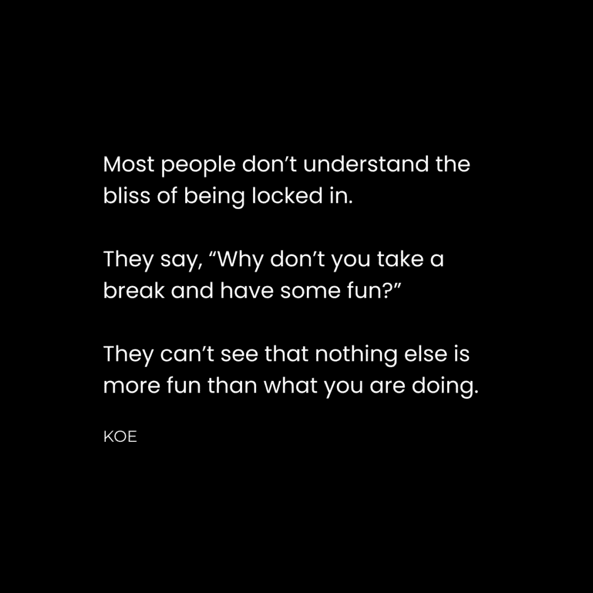
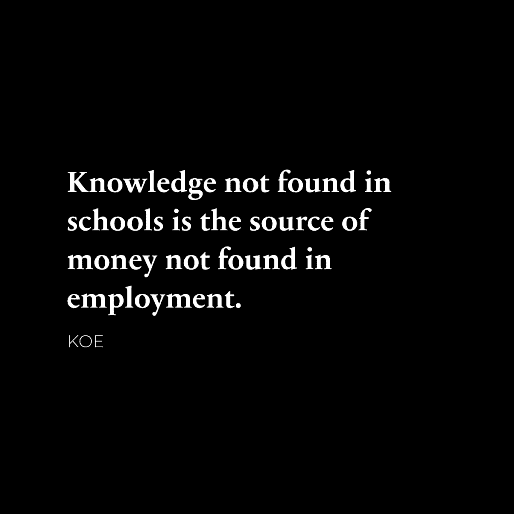
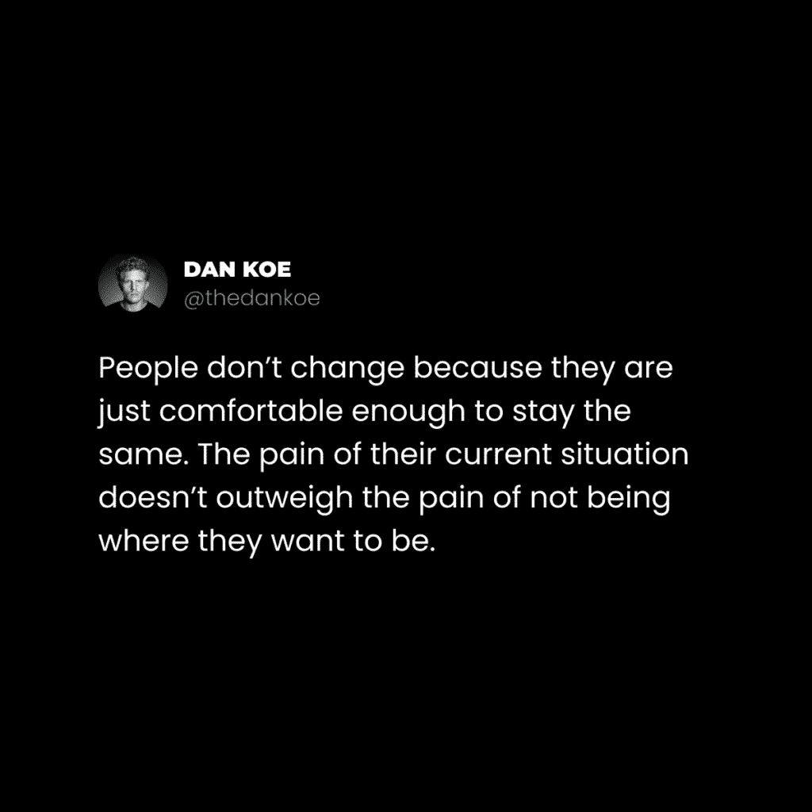

# 不确定性危机（为什么每个人都感到如此迷茫）

> 原文：[`thedankoe.com/letters/the-uncertainty-crisis-why-everyone-feels-so-lost/`](https://thedankoe.com/letters/the-uncertainty-crisis-why-everyone-feels-so-lost/)

<picture fetchpriority="high" decoding="async" class="wp-image-2158"></picture>

每次妈妈打电话给我，她都会问：

*“这个周末你做了什么有趣的事情吗？”*

在过去的几年里，我的回答几乎总是：

*“没有，还是老样子。”*

当然，偶尔我会去参加她想要听我详细描述的旅行或活动，但大多数时候，答案只是涉及工作、写作、散步、举重和吃饭。这些都是我每天做的事情。

她的回答总是：

*“哦，你应该多出去走走！你年轻，丹尼尔！”*

我一直觉得我有什么地方不对劲。

我觉得她是对的。

我*应该*出去更多。

我是不是在浪费那些最重要的岁月？

我会回头看看，后悔日复一日地做同样的事情吗？

所以，我强迫自己出去更多。

我发现的是，我刚开始感到更加迷茫和对生活感到不满。

随着妈妈继续打电话并问这个问题，我开始意识到。

*“这个周末你做了什么有趣的事情吗？”*

不，还是老样子。

*“你为什么不出去找点乐子？”*

嗯...

没有什么比我所做的每天的事情更有趣。

这个问题假设做任何事情都比老样子更有趣，但老样子才是导致意义、存在和流畅的原因。在最佳状态下运行比不断敲打令人愉悦的干扰来填补你灵魂中的空虚要有趣得多。

我为什么要出去，迎合社会认为的有趣，只是为了融入并显得自己*好像*在做一些有趣的事情呢？

+   晚上熬夜打乱你的睡眠时间表，并逐渐破坏你的精神和身体健康。

+   酒精中毒会腐蚀你的大脑，破坏你的注意力，让你难以在享受的事情上表现。

+   狂吃油腻、含糖的食物，以及他们为了让你上瘾而放入其中的任何其他东西。

现在，我并没有直接和妈妈这么说。我并不那么粗鲁。

我也不认为这些事情应该从你的生活中完全消除。

偶尔的夜晚外出可以是一个很好的战略重置。它可以让你感到糟糕，从而渴望感觉更好。它可以让你接触到你通常不会有的对话，从而在你的工作中取得突破。它可以让你接触到意识较低的状态，这样你就可以导航其内容并从中受益。

昨晚我和那位女士出去给她庆祝生日，玩得很开心。我写这封信的时候有点晕，但我不愿意用任何其他东西来交换那样的夜晚。

整个想法是我和一个商业朋友之间的对话。

他评论说，人们感到迷茫是因为他们还没有创造出一个他们不想逃离的生活方式。

那条评论让我陷入了对现代世界如何让人们为失败做准备的思考。

所以这就是我们在这里要讨论的：

1.  现代性的问题以及为什么人们——尤其是年轻人——对未来感到如此迷茫、困惑和不确定。

1.  技术和信息时代提供的机会以及有多少人利用了这些机会。

1.  设定标准将如何改变你的生活（以及如果你想要有目标地生活，你必须为自己设定的 7 个标准）。

1.  如何创造你理想的一天，这样你就可以停止讨厌星期一，感觉你需要填补你身份上的一个空缺。

对于那些现在正在挣扎的人来说：

有一种方法可以走出困境。

有一种方法可以驾驭混乱。

有一种方法可以让你对最终的结果有所掌控。

你生活在一个可以创造一个你每天早上醒来都喜欢的生命的时代。

走出困境的第一步是理解你最初是如何到达那里的。

## 不确定性危机：一个全面的问题

> 你感觉非常糟糕，因为你的潜意识知道你可以做得更好。
> 
> — 丹·科伊 (@thedankoe) [2021 年 12 月 28 日](https://twitter.com/thedankoe/status/1475819335277031427?ref_src=twsrc%5Etfw)

不确定性的问题始于你将你的确定性外包出去的事实。

这就是这样：

你出生在一个具有特定信仰、价值观和标准的文化中。

当你学习走路、跑步和表达自己的思想时，你的思想被塑造成与周围人相匹配。你无法控制这一点。这就是你生存的方式。

在你意识到之前，你心中的唯一目标就是上学、找工作、结婚、去一些有趣的度假地，以及有朝一日退休。这些目标因家庭而异。有些家庭强迫道德成功和宗教信仰，有些家庭强迫学术成功，而有些家庭则鼓励创业成功。

如果你理解了思想和人类行为，你就能发现这个问题所在。

深藏在你的心理深处的无意识设定的目标塑造了你的行为方式，你是谁，以及哪些机会能够被你的意识所察觉。

你拥有和你父母一样的思想，他们拥有和他们父母一样的思想，他们又拥有和他们父母一样的思想。

除非……家族树中的某个人质疑了自己的信仰并寻求更好的做事方式。

世界已经改变了。

技术进步来得很快。

世界与 10 年前相比，已经大不相同。如果你仍然按照 100 年前的信念行事，你感到如此迷茫也就不足为奇了。

你缺乏目标，因为现代世界被信息淹没。

你不知道如何理解这一切。

你的信念与你的环境不匹配。

你将你的确定性外包给了社会、你的父母、你的老师、政府以及宗教意识形态。

现在信息量如此丰富，挑战了你的信念，你的注意力分散，直到你决定重新编程自己的思想，你的思想才会处于持续的无序状态。

在你的本地环境中为你生存服务的那些东西，在快速变化的世界中，将无法帮助你生存和繁荣。你的父母可能不会把你推出巢穴，让你学会飞翔，所以你必须自己跳出去。

更不用说，大多数工人担心在接下来的 10 到 20 年内被取代。这是一个可以通过自己动手创业来轻易解决的干扰。我上周在[工作未来](https://thedankoe.com/letters/the-future-of-work-acquire-this-skill-stack/)中讨论了这一点。

如果你想要学习一种不会过时（并允许你成为一个深度通才，使你变得不可替代）的技能，那就学习[高影响力写作](https://2hourwriter.com)。

问题在于，一个人如何改变他们思维运作的代码？

你如何编写代码，以便在你的生活中实现有意义的进步？

在一个从你作为机器齿轮中获益的社会中，你如何找到清晰的方向？

我们会谈到这一点。

因为在变好之前，它会变得更糟。

### 现代环境

让我们描绘一幅现代生活的残酷画面。

由于大多数人的多巴胺因不必要的阿得拉处方、手机和导致快感缺失的干扰而耗尽——快感缺失是指无法感受到快乐。由于人们已经到了他们的“正常”状态就像完全糟糕透顶的地步，他们试图通过任何可能的手段来感受一些东西，任何东西。

你处于一种持续的生存和压力状态。

你的思维变得狭隘，只能注意到快速获得短暂快乐的机会。

从这种低意识状态出发，你变得机械化和动物化。你选择追求社会赋予你的目标。你没有专注于解决你成长过程中独特的、使你独特和有价值的那些问题。你为了迎合他人对你的期望而忽视了你的健康、财务和心灵，现在这些问题四处蔓延，制造混乱，而你却不知道发生了什么。

普通人用加工食品填饱肚子。

每次看到社交媒体帖子，他们都会有情绪反应。

他们觉得在任何时候都有必要争论和证明自己的价值。

此外，他们从不出去晒太阳。

他们整天盯着屏幕。

他们坐在荧光灯照亮的隔间里。

他们的工作缺乏挑战和意义。

所有这些都相互影响，并分裂成更多的问题。

你的性欲受到了打击，因为你的雌激素和催乳素水平极高。

你的睾酮水平急剧下降。

你的身体变得柔软和臃肿，你开始脱发，胸部突起的胸肌让你感到尴尬。你开始以驼背、不自信的姿态走路，并想从世界中隐藏自己。

对于女性来说，也存在类似的激素现象。

避孕药像糖果一样被开处。

抗抑郁药是心理健康问题的“正常”选择，因为它们能带来比通过简单的生活方式改变带来的轻微不适更多的收入。但因为你之前没有进行过简单的生活方式改变，你的大脑会说服你这是极其困难的，你会在任何可能的机会下提出这个借口，而不是仅仅改变。

男女双方都缺乏能量或关心去结识新人、锻炼或改变他们的习惯。

在社会层面上，男性和女性的平衡越来越接近中性。没有极性。我们正在与自然法则作斗争，因此遭受了巨大的痛苦。我并不是说解决方案是回归到技术之前的时代和“回归传统”。我建议你融入并适应现代环境。解决你自己的问题。

此外，潜意识中你知道混乱正在呈指数级增加。

由于你的不努力，熵开始占据主导地位，通过无所作为，你慢慢地开始沉沦，但这只是给已经糟糕的情况增加了压力。

改变的第一个步骤是意识到所有这些。

你必须坐下来思考它，愤怒到没有其他选择，只能反抗。

然后，利用你可获得的信息的丰富性，你进行自我教育，追求新的目标，并从困境中摆脱出来。

不确定性是一个整体问题。

你的环境、你的荷尔蒙、你的心态、你的工作、你的生活方式、你的文化、你的社会……它们都可以为你服务，或者将你压垮到地面。

治疗方法正变得多维度地强大。

在其他任何事情之前，你必须照顾好自己的心灵、身体和财务。

你通过改变自己，让你的决定在意识中产生涟漪来改变世界。

但仍然...

在变好之前，它会变得更糟。

### 年轻人注定要失败

财富和繁荣就在这里。

它们并不均匀分布。

登录社交媒体并不难，可以看到人们在 30 岁之前，甚至 21 岁之前就赚了几百万美元，因为他们看到了信息经济的机遇。这对上一代人来说是不可能的。他们不理解。

所以，如果你不重视绝对的自给自足，你将被抛在一边。

为什么？

因为立法者都来自上一代人。

社会是由处于顶层的人塑造的。

通过旧的方式——上学、找工作、买房、结婚等——实现财富和繁荣的机会受到制定法律的人的影响。

住房成本从疫情前到现在翻了一番，因此人们宁愿浪费钱去旅行，在旅途中“寻找自我”。他们放弃投资未来，因为对于拥有体面高薪工作的人来说，这样做几乎是不可能的。高薪工作不再高薪，因为生存成本持续增加。

年轻人因为负担不起，而且他们没有这种欲望，所以不交配或生孩子。他们的激素和心理健康都进了垃圾桶。

因此，我们唯一花时间相处的人是社交媒体上的数字朋友、你的伴侣（如果你已经足够成熟），以及你的亲密朋友（如果你足够幸运）。如果你不发展你生活的社交方面，现代性会变得极其孤独。

回到要点…

80 岁的立法者们的孩子几乎快 60 岁了。

他们仍然需要打电话给他们的侄子寻求技术支持，学习如何在 20 年前的电脑上打开他们的电子邮件，这台电脑充满了病毒。

我不应该解释老一辈的价值和信仰如何影响他们的决策，以及这如何阻碍社会看到进步。

立法者及其子女都带有偏见。

意味着，对你来说，通往财富和繁荣的唯一途径是走一条完全不同的道路。

忘记并反抗你一直认为是“唯一方式”的东西。

为了开阔你的思想，设定新的标准，并让自己成长到这些标准。

## 信息时代的机会

<picture decoding="async" class="wp-image-2159"></picture>

这并不是为了让你用虚无主义来安慰自己保持现状的日常剂量。

这正好相反。

这是为了让你愤怒、沮丧，并对自己感到愤怒，这样你最终才能有清晰的头脑去做出改变。就像弹弓一样，你利用那种负面能量来开始，让势头接管。你通过行动和努力培养一种积极的哲学。

你需要的是一个机会。

并且在你周围有足够的数量。

你问题的解决方案是技术、信息和效率。

上学和找工作是一条过时的道路。

自我教育、改进和创业是唯一掌握自己心灵、身体和财务的途径。

你正在经历基督的第二次文艺复兴。

你看不到吗？

个人正在使用互联网来消除前几代人的限制。

你不再需要去一所著名学校来建立能带来令人难以置信的工作的联系。你所需要的只是在网上发布一些有价值的内容，让世界各地的人都能看到。或者，你可以使用那个 DM 功能——当然，需要一点社交技巧和说服力——你以前以为只是用来给你的朋友发表情包的。

你不再需要有一份简历和垃圾邮件般的申请平庸工作，这些工作你实际上并不想要。你的个人品牌是你的公开简历，它让听众根据你提供的价值来跟随你。

你不再需要在你不关心的公司中扮演一个专业角色。你不再需要成为一台机器上的齿轮，为别人销售产品。多亏了技术，你可以用几乎零成本创建产品或服务，吸引受众，并快速获得技能，让你能够经营一家一个人的企业。

但是，有些人仍然忽视了机会。

他们没有意识到这本身就是现代生存。

是的，现在，是互联网、社交媒体和信息让你能够创造你理想的生活方式。

时代在变化。如果你坚持 10-50 年前的信念，拒绝放弃，你将无法获胜。那些控制你思维的东西，把任何新事物都称为“骗局”。

所有伟大的想法在它们在社会中稳固根基之前都被视为骗局。但到那时，下一个伟大的“骗局”已经在地平线上，只有聪明的人才会利用（既不进行诈骗也不被诈骗）。

是的，实际的骗局是一个非常真实的事情。我并不怀疑这一点。但一点批判性思维就能走得很远。

如果你想要报名参加我那个让个人能够追求自己人生工作的骗局，请查看[数字经济学](https://digitaleconomics.school)以学习学校不会教给你的技能。

换句话说，他们在未来冒险，并在这一过程中创造未来。

世界的风险承担者通过推动他们认为值得自己努力的新想法来创造社会。他们不会坐等这些想法被稀释并被大众接受。因为到那时，它不再是机会，而是一项任务。你做它是因为其他人都在做。

现在的问题是：

为什么我看不见新的机会并采取行动？

因为你的标准根本不存在。

### 设定标准将改变你的生活

> 你的生活很糟糕，因为你对生活的标准如此之低，以至于你接受了生活糟糕的事实。
> 
> — 丹·科伊 (@thedankoe) [2023 年 10 月 17 日](https://twitter.com/thedankoe/status/1714297471906549825?ref_src=twsrc%5Etfw)

你的生活之所以糟糕，是因为在过去一年中你做出了数千个微小的选择。

你没有做出导致有意义职业的选择。

你没有做出导致满足关系的决定。

你没有做出导致健康和美观身体的选择。

“但丹，关于遗传和出生地以及从事一份不允许我有足够时间的工作等等”

是的，这些因素都起着作用。

但你刚刚做出了另一个微小的选择，关闭了你对当前情况下能做什么的思考。你只是放弃了解决问题的能力……这是唯一能让你自由的能力。

> 选择的能力不能被剥夺，甚至不能被放弃——它只能被遗忘。 —— 格雷格·麦克劳恩

很容易看出你并不是一个特殊案例。成千上万像你一样的人已经改变了他们的处境。我敢打赌，你可以给一个处于糟糕境地的人提供实现目标的步骤，但你不能为自己做同样的事情，因为你的思维阻碍了。

一年后你生活的质量将取决于那些累积成生活的微小选择。

你不必做出完美的选择。

实际上，犯错误更好。

最大的风险就是没有风险，因为否则你怎么会失败？

没有失败，改进实际上是不可能的。

如果没有改进，你的人生就没有目标。

如果你的人生没有目标，一切都将变得毫无意义。

成为更好的人是你有目的地生活的途径。

穷人可以接受贫穷，直到发生灾难性事件。

对于他们来说，发生灾难性事件的可能性更大。

他们的车因为老旧且未保养而爆胎。

有人在一个糟糕的社区里闯入他们的房子。

他们的父母生病了，因为他们收入低，无法提供帮助。

当然，他们现在有一些赚钱的动机，但当灾难事件发生时，他们认为太晚了。他们没有做好准备。

因此，他们陷入了“我应该早点开始”的无限循环。

最终，事情会趋于平衡。他们生活中的压力降低了。他们又开始享受那些无脑的舒适了。等待另一个灾难来摧毁他们。

*成功的人会利用这些事件来改变自己。*

他们是谁决定了他们的标准和价值观。

他们的标准和价值观决定了他们所做的微小选择。

如果你对自己的银行账户里有 5 美元感到满意，你不会把它看作是问题。

如果你对自己的银行账户里有 100,000 美元感到满意，你会把低于这个数额的任何东西看作是需要解决的问题。

问题塑造了你的认知——我在我的书中谈到了这一点。[在我的书中](https://theartoffocusbook.com)

你开始注意到更多的赚钱机会。

你的谷歌搜索变成了“如何每月额外赚取 1000 美元”之类的事情。

你开始和朋友讨论金钱问题。

所有这些微小的选择开始累积成结果。

你会根据你针对面临的问题有意识地搜索的特定信息来重新配置你的思维模式。

你所消费的信息对你的身份和标准有重大影响。

如果你周围的人——无论是物理的还是数字的——让你觉得 100 磅的体重、没有钱、讨厌的工作、讨厌的伴侣、每晚喝醉，以及其他……你认为你的生活会怎样结束？

如果你的人生标准要求你从 Whole Foods 购物，你会对麦当劳的餐点感到厌恶。

如果你的人生标准要求你像 CEO 一样工作，你会把低级的工作看作是一个必须通过技能获取、教育、优先级排序和外包来解决的问题。

你显然不能立即解决你生活中的所有问题。

你现在无法逃避你的处境。

你需要一个计划。一个目标。一个出路。

通过坚持这个计划，我保证这段旅程会比那个结果更有趣。

如尼采所说：

“幸福是力量增强的感觉——阻力正在被克服。”

### 你想要成为的人的标准

大多数人对生活采取最低限度的态度。

快速赚钱，快速性行为，快速愉悦，没有承诺，没有深度，没有失败。

你越想使你的生活变得容易，它就越难。

走出无意义生活的途径是采用你想要成为的人的标准。

你想要赚多少钱？

哪种工作能给你带来满足感？

你理想的关系，无论是朋友还是伴侣，是什么样的？

你想看起来和感觉如何？

你必须超越仅仅为了生存的最低限度。

承诺你的行为背后有一个原因。

如果你不知道你为什么要做某事，你为什么要做它？如果你知道了，你为什么要忽视它？

你是不是通过在星巴克分发 40 杯三倍浓缩摩卡卡布奇诺来推动人类进步？或者你是在让人类变得不健康和肥胖？

关于你的“无辜”的军事工业复合体接待员工作，它轰炸了世界另一边无辜的人呢？

你是否意识到你在无意识中做出了什么贡献？

为什么你没有开始追求更有意义的事业或开始创业？

你知道为什么你会狼吞虎咽地吃东西吗？你理解每种营养素如何与你的生物体相互作用并创造一个健康的状态吗？

为什么你没有开始学习健康和训练？

你生活在你的身体里。了解它应该是你全职的工作。

你知道为什么你会和一个轻易就能得到的伴侣一起行动吗？你看到自己和他们在一起度过接下来的 40 年吗？

为什么你没有提高你的社交技巧，以至于能够吸引更好的伴侣？

虽然老套，但你只有一次机会来体验人生。

唯一能阻止你过上无意义生活的人是你自己。

### 为自己设定 7 个标准

让我们快速列举 7 个标准，这将引导你走向充实的人生：

1.  **1 小时的深度工作**——如果你能花 8 小时去实现别人的梦想，你也能花 1 小时去实现自己的梦想。

1.  **银行里存有 10 万美元**——任何少于这个数额都被视为需要解决的问题。这个标准为你提供了财务方向和选择的清晰度。

1.  **每天 10000 步**——对身心健康有益。燃烧卡路里，获得阳光，让你的思想开放接受新想法。所有重大的发现，如原子弹的创造，都是在散步中发现的。

1.  **每磅体重 1 克蛋白质**——这让你感到饱腹，增加肌肉，并使达到宏量和微量营养素变得更容易。即使你不是在增肌，富含蛋白质食物的生热效应和微营养素密度也应该优先考虑。当你这样做时，你大部分的脂肪减少/饮食问题就会迎刃而解。

1.  **每周训练 3 次以上** – 跑步、骑自行车、奥运举重、健美、CrossFit，我不在乎。做一些能增加血液循环、延长寿命，并作为冥想习惯来让你的心灵从工作中休息的事情。

1.  **每月一次自我投资** – 那些付费的人，请注意。将浪费在快速快乐上的钱用于投资教育、业务增长和能让你成为你想成为的人的经历。

1.  **30 分钟的自学** – 如果你每天不学习新东西，你就是在死亡。自学重新编程你的大脑。没有它，你无法发现新的改变生活的机会。

这些是你逐渐成长的标准。它们不会一夜之间发生。

你改变你消费的东西，以重新连接你的大脑，使其与这些标准一致，然后，当你达不到这些标准时，你会感到压力反应。那是你的新身份在试图生存。

你利用那种压力来行动、解决问题和创造。

## 如何创造你理想的生活方式

让我们分析一下什么能创造更好的选择：

学习是基本的人类驱动力。

在出生时，你就是一个信息海绵。

你的父母、朋友、社会、老师和管理者都将他们的世界观投射在你身上。

他们从哪里得到他们的世界观？从同一个人那里，除非他们质疑过。

这就是你所知道的一切。

如果我们能给它一个数字，你知道的比世界上可用的信息少 1%以下。可能更接近于少于 0.001%。

这些信息在现实中创造了参考点。

这就是你如何区别于他人。

它塑造了你的身份。

你的身份限制了你能注意到的信息，因为你只学到了这么多。如果你没有学习到连接你所知与所知的信息，你不会注意到某些事情。如果你没有学习到基础知识，你不会理解中间信息。你不能从 1 级直接跳到 3 级。你因为这种原因错过了生活中 99%的东西。

如果我接触到了让我变成哥特的信息和环境，我会注意到音乐、人、服装、工作机会、对未来的看法和情绪状态中的某些喜好和厌恶。

作为一名哥特，我不会注意到，甚至不会关心有利的商业机会去尝试（假设我是一个典型的孤独哥特，他讨厌这个世界）。

如果我沉浸在信息中，随着时间的推移重新编程我的身份，我会注意到与该身份相关的机会。

这引出了互联网的力量。

你可以照料一个数字花园，或者被推入一个数字沼泽。

我们从未有过如此多的信息，我很难相信它不会迅速且负面地塑造身份。

当你登录社交媒体时，默认操作是关注娱乐账户和梗页。

几乎所有这些都让你的心灵承受着像兄弟会派对一样狂欢的不受欢迎的房客。当父母回家时，他们会因为看到的一切而感到震惊。

你的意识就像父母在无意义的想法让你的思维变成沼泽后回家。

现在就意识到这一点。

取消关注任何不符合你生活中更好标准培养的人。即使它看起来不像，无论你如何辩解，你关注的那些人都会微妙地影响你的行为。慢慢地，然后突然间，你变成了你可能讨厌的人。

仔细关注有价值的账号。有价值的账号挑战你的世界观，让你跳出思维定式思考，并教育你掌握达到更高生活质量所需的技能。

这不是一个一夜之间就能完成的过程。

你可能一开始不会觉得这些信息有用。

需要时间来弥合导致理解的具体想法。

你可能会觉得它很无聊……直到它成为世界上最有趣的事情之一。

关注一个账号。

让算法做它的工作。

关注回复第一个账号帖子的账号。

随着时间的推移，你将创造一个有利于你成长的环境。

你与比你更成功的人之间的唯一区别是他们消费信息背后的持续意图。

“但关于采取行动呢？？”

你每天都在行动。

为什么？

因为你的大脑被那些有利于那些行动的信息编程了。

你的身份是由你接受的信息塑造的，而且仅此就决定了你视为行动机会的东西。

与正确的人为伍，你可以实现你想要的一切。

### 价值创造者的道路

为什么人们会一直做自己讨厌的事情？

我一直想知道这个。

不像我是个特殊的小花朵，从未陷入陷阱，而是一个感觉像是从陷阱中逃脱出来，可以从更高的山上俯瞰局势，直到他不可避免地再次跌落。

期待周末。

恐惧周一早上。

为了与不喜欢合作的人交谈而隐藏自己。

用互联网作为逃避。

滚动，点击，让你的思维暂时休息一下，因为当它活跃时，你不喜欢它在做什么。

这就是消费者的生活。

被互联网利用的人，而不是利用它的人。

无法逃离这个新世界。

你可以与之抗争，也可以随波逐流。

虽然互联网是问题，但它也是解决方案。

你不必使用互联网来做这件事，但也没有不用的理由。

你生活糟糕的最后一个原因是你没有为人类做出贡献。

你缺乏*目标。你不是一个大于自己的东西的一部分，你选择了它*。

*你之所以没有为人类做出贡献，是因为你没有那样有价值的东西，以至于你不得不分享它。*

你没有有价值的东西可以提供，因为你忽视了生活中那些需要解决方案的问题。

你之所以忽视生活中的问题，是因为你不知道如何实现解决这些问题的目标。

你对如何实现目标没有清晰的思路，因为你没有任何东西可以构建。没有任何东西可以构建和指导你的学习。

价值创造者是指那些在他们的输入和输出背后有意图的人。

他们将生活视为一个科学项目。

他们识别自己的问题。

他们利用互联网上无穷无尽的资源来自我教育。

他们亲自测试解决方案，并分享他们的写作经验。

他们将最有帮助和最简化的解决方案打包成产品或服务的形式。

这就是他们通过有目的的生活来谋生的方式。

成为创造者是过度消费的解药。

写作是分配价值的载体。

我在所有平台上写作。我不在乎与我的豪华汽车或生活方式竞争。通过将互联网不仅作为一个整理好思想的地方，而且作为一个组织它们并与他人分享的地方，我获得了深深的满足感，这让我能够以我所热爱的方式谋生。这是我可以控制的事情。

这并不是关于成为名人。

这不是关于建立一个庞大的追随者群体。

这是在一个可以触及任何人的地方分配你所能提供的价值，这些机会将改变你的生活和职业。

你不需要一个循序渐进的课程来加入在线派对。

写你想写的东西。

与你想交谈的人交谈。

通过不成为隐形人，让你的名字出现在人们面前。

让你的写作随着时间的推移传播得更广。

如果你真的需要额外的推动力，只需观察你长期关注的人即可。

观察他们写的是什么。

观察他们是怎样写的。

观察他们与谁互动。

观察他们是怎样谋生的。

将点拼凑在一起，开始模仿他们。

如果你没有答案，就去查找。

你不会立刻得到所有答案。

对此感到满意。

如果你知道自己注定要更多，就开始表现得像那样。

你不必写作，但我已经尝试过所有方法。

由于写作是人类存在的基本沟通方式，它是发现你真正想做什么的一个很好的起点。

### 如何期待周一早上

你不期待醒来，因为你没有期待的事情。

很明显，但仍然是一个普遍存在的问题。

人们不把它看作是问题，因此他们成为了自己处境的受害者，并责怪所有人而不是自己，因为他们无法*创造*一条新的道路。

这里有一个你可以尝试的过程，以找到那个让你无法睡懒觉的东西：

**1) 制定全面的未来规划**

<picture decoding="async" class="wp-image-2160"></picture>

你需要有一个愿景和反愿景。

拿出笔记本开始写作。

把你未来不想要的一切都倾倒出来。从过去的经历、当前的情况中汲取，当你意识到更多需要添加到页面上的事情时，继续写作。这是一份活生生的文档。你不仅仅写 10 分钟就把它忘了。

你的反愿景应该足够强烈。如此强烈，以至于你对当前的情况感到厌恶。你根本不想与之有任何瓜葛。你唯一的选项就是向相反的方向出发。

从那里，写出相反的内容。

开始明确你对未来的期望。在接下来的一个月里，随着你经历生活，添加到这个列表中。

接下来，再写几件事情：

+   你接下来一年、一个月和一周内需要确切地做什么来开始取得进步。

+   你需要学习哪些技能才能达到那里。

+   目前阻碍你的是什么，以及你计划如何取代这些习惯（或人）。

+   你需要成为什么样的人才能实现你对未来的愿景。

至少这应该给你一个起点。

**2) 开始创业**

“但丹，我不想开始创业！！！”

你现在还没有明白，对吧？

除非你的愿景不真实——这意味着你并没有按照你父母或社会对你未来的期望去行动——否则，要完全掌控你生活的所有领域，唯一的方法就是开始创业。

不想被取代？成为取代者。

没有精力，无法集中注意力？开始创业，这样你可以控制你工作的时间，并专注于健康。

没有赚到足够的钱？开始一个有高收入上限（或无限学习上限）的生意，几乎总是从需要 0 美元启动的在线生意开始。

缺乏意义和满足感？那是因为你在一份工作中，工作中的挑战已经停止。你为那些你不在乎的人工作，销售你不在乎的产品，消耗你的能量，创造你不在乎的生活。

你的心理、生理和精神都处于低谷，仅仅因为你没有把事情掌握在自己手中。

是的，很不幸，“开始创业”这个词带有许多陈旧的联想。

在我看来，一个企业，就是给自己一个去做你想做的事情的许可。

如果你想要创造你理想的一天，那么你需要完全掌控它。

是的，这需要时间，但这段旅程将比你所做的一切都更有意义。

**3) 每日自学**

这很明显，但你还能通过什么其他方式来学习你想要做的事情的方法呢？

让它变得有意义。

你不能拥有所有的这些梦想和抱负，却表现得好像你不需要学习任何东西。

投资研讨会。

投资课程。

投资经历。

投资业务增长。

把你所有的一切都投入到创造你想要的生活中去。否则，那不是投资；那是浪费。

在你的一天中专门留出 30-60 分钟的时间用于自我教育。

你可以把这与其他你生活中的标准结合起来，比如每天走 10000 步。

去散步，戴上播客、讲座或有声书，让你接触到你所不知道的，并捕捉到有力的想法，这样你就有燃料在专注的工作时段中构建。使用 [Kortex](https://kortex.co) 捕获这个。

**4) 系统化你的周与日**

如果你没有取得进步，你就是在退步。

我不确定这语法是否正确，但你应该明白我的意思。

熵并不友好。

你永远不会停滞不前，你要么向前移动，要么不知不觉地后退。

所以，如果你没有取得进步，你必须能够将其识别为问题，并开始深入挖掘。

从每周审计开始。

记录你一天中做的每一件事，并开始将每件事标记为不必要或寄生。

然后，拿出一张空白页，画一个每周日历，并写下你那一周要做的每一件事。它应该与朝着你的目标进步相一致。

然后，开始这样做。

如果有什么事情不顺畅，就在页面上划掉它，并用其他事情替换它。

如果你没有取得进步，就尝试其他事情。

**5) 自我实验**

> 永久解决你问题的唯一方法是通过自我实验。 —— 专注的艺术

这是一个巨大的问题。

如果你只通过实验来解决你生活中的问题，你会变得成功。

但是没有人这么做。

他们被推销教育、工作、房子、汽车和退休。所以人们追求这些作为解决他们根深蒂固问题的创可贴。

然后，他们被给予食物、药物和意见，这又是在上面贴上了一块创可贴。所以人们慢慢地变得更加神经质和愚蠢，因为他们未能真正解决生活中的问题。那些使你变得有价值、不可替代、聪明、有意识，以及你可以获得的任何其他良好特质。

当你踏上这条新道路，远离你的反愿景，走向你的愿景时，你成功的决定因素是能动性：

能够在没有他人许可的情况下识别和解决问题的能力。

当你遇到问题时：

+   意识到这一点

+   开始自我教育以解决问题

+   尝试不同的过程和教导

+   不要执着于任何特定的方法（比如可能为你服务大约一年的肉食主义饮食，让你更健康，直到它转向相反的方向，对你的健康造成破坏）。

解决方案会根据你的情况而改变和演变。

你可能永远找不到一个永久的解决方案。

意思是，如果你一旦停止了改进，你将开始退步。

这并不意味着你停止了享受乐趣。创造和毁灭是循环发生的。自我提升做得太多时，可能会进入破坏性的领域，但到了那个阶段，它就不再是自我提升了。所以自我提升就是放松，做大多数人会称之为“破坏性”的事情，但从这个角度来看，它是创造性的。

这就是这一点的全部。

感谢阅读。

—— 丹
