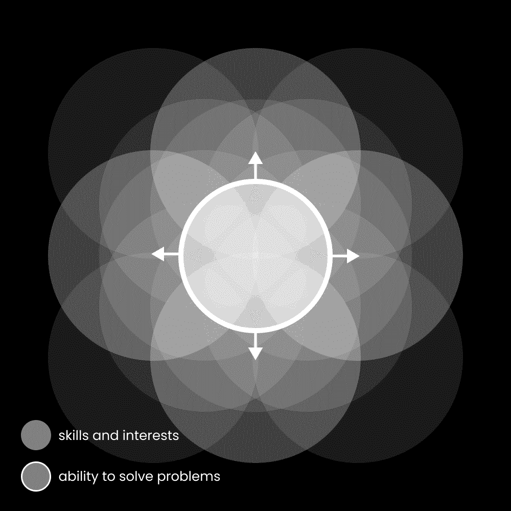

# 创作者经济是一个巨大的庞氏骗局。

> 原文：[`thedankoe.com/letters/the-creator-economy-is-a-giant-ponzi-scheme/`](https://thedankoe.com/letters/the-creator-economy-is-a-giant-ponzi-scheme/)

有些事情我相当烦恼，这是其中之一。

一个初学者开始了他们的创作者之旅。

他们学习写作、营销、品牌建设和其他技能，与他们的技艺相结合，使他们能够成为一个个体企业——因为作为一个创作者，你需要成为一个*专业通才*。

换句话说，你需要对所有数字商业技能有一个一般性的了解，同时也要在你每天热爱做的事情上专业化。擅长很多事情，在一件事情上出类拔萃，因为这种一般性的理解是*让你在这件事上出类拔萃的原因*。

初出茅庐的创作者想要开始赚钱。这是合理的。尝试销售自己的产品以停止销售他人的产品并没有什么不妥。

现在，这里有一个棘手的部分：

初出茅庐的创作者想用他们学到的技能来帮助其他创作者。无论是营销、销售、品牌建设、写作还是其他任何事情。

他们想用他们在商业模式中获得的技能经验来帮助其他创作者。这是有道理的。

我感到烦恼的是当人们称这为庞氏骗局。

他们不懂商业，所以他们只能看到正在发生的事情的表面，并将其简化为那样。

“你只是在帮助创作者成为创作者的创作者。”

“你只是在教教练成为教练。”

我明白，表面上看起来确实不好，但如果你不深入看看实际上发生了什么，生活中的每一件事看起来都是这样。

这个狭隘的群体似乎不理解庞氏骗局是什么。他们似乎只是认为帮助其他人做你做过的事情（即，你唯一真正有资格做的事情）是坏事，所以他们称之为庞氏骗局。

根据定义，庞氏骗局是一种金融欺诈，它用新投资者的资本向早期投资者支付回报，而不是从合法业务的运营中获得的利润。

这并不是一个创作者企业的本质。我稍后会处理更多关于这个问题的反对意见，但你需要理解的是，一个创作者企业本质上是一个企业。创作者可以作为一个个体或团队来运营。按照狭隘的逻辑，所有 B2B 商业都是庞氏骗局，因为他们用学到的技能帮助彼此的商业。

庞氏骗局的特点是依赖、欺骗和操纵。一般而言，商业，尤其是创作者模式，的特点是*独立*、说服和选择。没有人强迫你听任何人的话或购买他们的产品。仅仅因为它不适合你，并不意味着它对其他人没有价值，不值得付费。

现在，让我们从进化的角度来审视这个问题。

有两种类型的等级制度：

**支配者等级制度** - 通过力量、权力、控制和支配来维持结构的系统。这类等级制度中的关系通常以强制、自上而下的权威和恐惧为特征。

这包括大多数企业结构，动物王国中像雄性黑猩猩那样有选择食物和交配的权利，以及某些政治结构，即独裁。

等级制度反映在一切事物中。在生物层面上，癌细胞可以开始形成一个支配者等级制度，除非重新整合到身体的自然等级制度中。

庞氏骗局并不完全是支配者等级制度，但它们处于类似的领域。

声称创作者经济是庞氏骗局的人通常是在一个支配者等级制度中陷入困境。这很遗憾，因为他们关闭了通向他们苦难的唯一途径之一。

**实现等级制度** - 受马斯洛需求层次理论等理论的启发，结构旨在支持其成员的增长、发展和自我实现。这类等级制度中的领导力旨在赋权个人而不是控制他们。

这就是创新型初创公司、创作者经济和进步教育（也是创作者经济，教授他们的技能和兴趣）发挥作用的地方。

创作者不控制你做什么。他们实际上只是媒体渠道。他们分发信息。如果你觉得这样不好，可以参考 Tyler The Creator 关于网络霸凌的推文并关闭你的屏幕。

创作者经济的定义特征是**提升自己和他人**。

价值的交换。

解决问题和分发解决方案。

一个创作者帮助另一个创作者完全在合理范围内，这可以说是你能做的最令人满足的事情之一。

考虑到独立性、高技能上限、高收入上限、高自主性和使生活值得过的其他一切，在我看来，成为创作者是未来的道路（以及许多预测创作者将是未来工作的人）。

### 在这封信中，你可以期待以下内容：

+   为什么创作者到创作者的市场是新的、奇怪的，以及你一直在等待的机会（因为你总是“来得太晚”到其他地方）。

+   我成为权威人士的秘密武器，这样你就可以克服冒名顶替综合症并停止质疑你所做的一切。

+   作为创作者开始一家单人企业的最佳途径。如何开始，要学习的技能，以及要出售的产品。

这些是我最喜欢的信件。

我喜欢拆解争论。

## C2C 市场

“内容创作者”是一种商业模式。

意思是，一个创作者帮助其他创作者，就是一家企业帮助其他企业。

现在有很多创作者。其中大多数人不理解商业。为什么其他创作者——就像别人告诉他们的那样，学习可销售技能——会想要帮助他们和教导他们，这一点很明显。

以狭隘的标准来看，他们本质上是在说整个 B2B 市场就是一个庞氏骗局。

哎……这有点过分了。

他们还未能意识到的是，创作者不仅仅是单人企业。创作者可以拥有小型或大型团队。他们是企业。他们只是利用社交媒体，将自己公之于众，并通过在互联网上展示自己来创造更多业务。

在我看来，创作者是这样一些人，他们想要把喜欢做的事情作为职业，最终意识到商业不过是一个法律结构，*用来*通过支付报酬来做自己想做的事情。

奇怪的是，创作者模式如此新颖。创作者既是企业也是消费者。这意味着，他们从其他创作者那里购买东西来学习（因为正是他们提供了教育和课程），然后他们用所学的东西来经营自己的业务。创作者位于 B2B 和 B2C 的交集中心，而且这些界限每天都在变得越来越模糊。

人们将这称为庞氏骗局的原因是他们还不理解这个模式。它不是社会的一个正常部分。婴儿潮一代还会告诉你“找一份真正的工作”，无论你作为创作者赚多少钱。他们仍然认为互联网货币是某种想象中的货币，除非你通过体力劳动（机器人应该而且最终会做）来辛勤工作，否则它就不算数。

人们把创作者经济称为庞氏骗局，这比以往任何时候都更表明这个领域存在机会，而你参加这个派对还太早了。

创作者到创作者的市场每天都在增长和繁荣。

作为一种商业，创作者必须学习很多技能，跨越任何可想象到的兴趣领域。所以当他们去教授那些东西时，学习者也可以通过它成为创作者（因为创作者可以围绕任何兴趣建立受众），那么我就能理解为什么这会被视为一种非法的事情。但在这个意义上，每个人在线上都是一个创作者，无论是直接还是间接地教导他们的受众如何成为创作者。所以即使它是一个庞氏骗局，这也是现实，而且带着这种悲观的心态，你的生活也不会很好。

这听起来有道理，但那些帮助初学者创作者学习他们刚刚学会的技能（比如内容、品牌或营销）的创作者怎么办？

难道这不就是庞氏骗局吗？

好吧，如果初学者创作者是一个已经建立起来的企业主，但他并不理解那些事情呢？为什么企业最初要雇佣人来做他们的内容、品牌和营销呢？

那为什么亚历克斯·霍莫齐会雇佣一个没有任何前客户或经验的枪手来为他撰写推特文章？这是庞氏骗局吗？亚历克斯并不是推特创作者，但在那个背景下他只是一个新手，所以他付钱给别人帮忙，因为他理解其中的价值。

上下文，上下文，上下文。

我帮助过八位数的电子商务 CEO 从创作者起步。你会惊讶他们对这个领域了解得有多少。

如果你从 SkillShare 或 Udemy（由创作者创建）购买一门关于电子邮件营销的课程，那会是庞氏骗局吗？所以当你从实际上有成果的公开创作者那里学习时，为什么你不采取同样的心态？如果他们在教授电子邮件营销时能够从电子邮件列表中获取客户，而不是依赖 SkillShare 或 Udemy 来分发课程，那不是更好吗？这就是电子邮件营销的全部要点，不是吗？为什么你会因为教授技能的人是从公开、真实世界的经验出发而偏袒自己得到更少的结果？任何人都可以创建课程，但社交媒体上的创作者作为一个商业实体，他们是那些有真实验证结果的人。

现在，作为一个刚开始学习技能的新创作者，为了钱帮助别人是否道德？

如果你的答案是“不”，将这种心态应用到其他赚钱方式上。

自由职业者如何获得经验？不是通过学习，而是通过帮助客户，即使他们做得不好，通常以较低的费用交换。你必须先做不好，这可能会让一些人感到不快。没关系。欢迎来到商业世界。

这件事的美丽之处在于存在一种叫做退款的东西。如果自由职业者无法交付，他们会退还钱款。在庞氏骗局中要拿回钱可就难了。创作者经济也有自然制衡机制。如果你搞砸了，相信有人会为此发帖或攻击你。你可以是骗子，但不会长久。群众会来找你的麻烦。

顺便说一句，我之所以说这些，是为了打破你的限制性信念，让你最终能够采取行动成为创作者。我可以保证，如果你只是思考一下，大多数其他赚钱的方式都不如这个好。

最后一种情况，如果创作者刚开始起步，向想要**成为**创作者的人收费怎么办？

好吧，我认为没有比刚刚实现目标的人更好的学习对象了。购买方也有机会从那个人那里学习，并购买他们提供的产品。

由于创作者经济如此新颖，因此存在大量的教育内容也就不足为奇了。供求关系。人们**想要**成为创作者，因为他们潜意识里知道那是工作未来的方向。

在这种情况下，唯一的“骗局”就是你的自我思考能力不足。

顺便说一句，我在[数字经济学](https://digitaleconomics.school)（实际上，我只是教你现在商业中需要的所有现代技能，但如果你想在之后称自己为创作者，请随意。）

## 被尊重的秘密武器

所有这些都意味着：

我可能无法改变那些不想改变的人的想法。

这就像试图说服一个坚定的民主党人（或共和党人）成为共和党人（或民主党人）。当提供更好的论据时，瞬间放下自己的信念是一种极其罕见但宝贵的特质。大多数人不会这样做，因为这意味着他们必须改变。如果人们必须停止将任何新的机会视为骗局或庞氏骗局，他们实际上必须做一些除了坐着和沉浸在自己的痛苦中之外的事情。他们会移除他们廉价的多巴胺来源：恶搞。

我想要帮助那些想要被帮助的人。

我想给有抱负的和当前的创作者们揭示一个秘密，那就是通过做同样的事情获得尊重和赚取更多。

我是一个作家。

我教人们如何写作。

有些人可能会说这有点奇怪，但正如我提到的，你还有什么比你所做和有经验的更能胜任的呢？

现在，事情变得棘手的是，我自己也是一个创作者。

所以，当我教写作时，我实际上是在教人们如何成为创作者。

我是一个使用社交媒体的作家（因为作为一个作家、设计师、音乐家或任何其他职业，不上社交媒体是有点愚蠢的，因为媒体是吸引观众关注你工作的方式（这样你实际上就能得到报酬），而社交媒体现在是媒体）所以这使得其他人认为我是一个“创作者”。

换句话说，如果你：

1.  实际上，你想要通过做自己喜欢的事情来谋生

1.  想要通过你所做的事情来教或帮助人们（因为你有资格做这件事，这是一个完全合理且具有影响力的商业模式）

你有被愚蠢的人视为“庞氏骗局”的风险。

避免这种情况的秘诀在于理解定位。

说“我帮助人们成为创作者”是不太优的选择。

更优的做法是说“我教写作，这样你可以吸引人们关注你的工作。”

（顺便说一句，我现在并不是想戴上我的营销者帽子，这些不会是*最好的*定位方式。）

成为教练教练的教练是不太优的选择。

对于服务型企业来说，有一个更优的做法是建立一个客户获取系统，并将内容偏向吸引你想要帮助的教练。

你可以教其他创作者和/或那些想要成为创作者的人。

这并没有什么不妥，从技术上讲，社交媒体上任何拥有业务的人（这很多人，包括大多数 B2B 市场的人）都是创作者。

只需将自己定位为某人，他教 X 以获得 Y 的好处。

我并不是字面意义上教创作者如何成为更好的创作者，因为这并不那么有说服力。

我教人们如何写作以吸引人们关注他们的工作。当我教这个时，我是在社交媒体上教的，因为这是作家最有效的媒介。用其他方式教他们将是他们的不公。

如果你想要教授营销、品牌或内容……那么就教给你想要教的人。你并不是明确地帮助人们成为创作者。你教给他们解决生活中问题的技能，帮助他们达到理想的生活方式，而且仅仅通过工作和商业环境，他们就成为了创作者。

所以，如果你想被认为是有价值的，改变你提供内容的定位方式。

## 如何开始作为一家一人的企业

来自那些不了解创作者模式的人的另一个常见建议是：

“你应该先开始一个**真正的**企业。然后做创作者的事情。”

我明白，我真的明白，但听听你自己。

你是在告诉我，我不应该利用生成业务流量的最佳方式之一，只是为了忍受你那些冷邮件、冷电话和付费广告的方法吗？这对初学者来说并不友好，对吧？

我明白你有一个身份需要捍卫，因为你的商业思维是在一个更老一代的策略中培养起来的，但现在有更好、更易于访问的方法来做事情。

技术让人们能够建立一人的媒体公司，通过这种方式过上美好的生活，吸引让上一代人羡慕的受众，所有这些都是在社交媒体写作的最低成本甚至零成本下实现的。

成为创作者现在的益处很难全部列在一个清单中，但我试试。

1.  你被迫学习运营现代企业所需的每一项技能。这比以往任何时候都要容易，多亏了课程、教程以及实践工具的易于获取。

1.  你建立了一个受众，也就是社会资本，所以当你想要建立一个创业公司或你一直梦寐以求的企业时，你不需要个人资本或风险资本。你有你的应用程序用户和产品客户。

1.  你的网络超越了你的受众。你可以接触到互联网上几乎任何你需要的人。如果你有 1 万名粉丝，而且每个跟随他们的人都有 500-1000 个粉丝，对跟随他们的人也是如此，你实际上拥有一个比你的受众多 10 倍的网络。（不，你显然不需要很多粉丝来谋生）。

1.  你可以做自己喜欢的事情，吸引志同道合的人，向新的人介绍你的技能和兴趣，并创建一个你喜欢的有意义的商业模式，即使有时很难。

1.  由于你唯一的杠杆是写作和构建产品或服务，你可以尽可能减少你的工作时间。如果我的受众通过 30 分钟的写作在增长，我向他们推荐一个优质的产品，那么我实际上不需要工作超过那个时间——尤其是如果我的 30 分钟写作产生的流量比一个写 8 小时却无人阅读的书的人还要多。

我现在就说到这里。

你实际上是如何开始的？

### 1) 开始，然后学习

学习的最佳方式不是通过一节接一节的课程，直到你发现自己陷入了教程地狱，什么都没建成，没有结果，也没有钱。

最好的学习方式是开始，感到不知所措，不知道自己在做什么。这样，你的大脑就会渴望学习，并且有实际的应用来应用这些学习。

我现在就告诉你，如果你在学习课程的同时没有积极地进行实践，那么你在浪费时间。

每个人都可以观看一个视频，了解一个顶级 CEO 如何在创纪录的时间内建立了一个价值十亿美元的企业，但有多少人真正复制了这一点？如果这像跟随一个逐步教程（我在说你们，那些想要这些信件更短、更“直接”的人）那么现在每个人都会成为亿万富翁。

你需要正确的时间和经验。

经验，经验，经验。

经验是王道。

经验不仅仅是进步。

经验是由失败频率决定的。

就像在视频游戏中打 Boss 一样。

你尝试一次就被击败了。

你稍微改变一下策略，再试一次，还是失败了。

你有一个更好的想法，尝试它，*几乎*赢了。

然后你失败了 5 次，开始质疑自己的理智。

你关掉游戏，触摸草地。

然后，当你最意想不到的时候，完美的想法突然闪现。你启动游戏，自信地进入，轻松获胜。

当你对自己的进步感到沮丧时，记得这个过程。这只是一场游戏。

这是你如何学习的方法：

+   **你需要一个目标来界定你的学习。** 在这种情况下，是建立受众和赚取收入。如果你在这两方面没有取得进步，那么你需要继续学习、测试和失败，直到你看到关注者和收入的增长。如果它们没有增长，那是一个技能问题。

+   **你需要从你所知道的事情开始。** 很明显，你需要一个社交媒体上的个人资料，定期发布内容，以及一种方式来货币化看到它的人。

+   **你需要持续的想法来改进你的流程。** 购买课程来了解他人的系统并进行实验。每天让你的大脑有某种形式的灵感。

+   **当你遇到问题时，你需要具体的信息。** 当你遇到问题时，研究如何解决问题，而不是在此之前。比如如何开始一个通讯录或设计个人资料图片或建立网站。

我从未在某个特定时刻学习过像电子邮件营销或图形设计这样的具体技能。

我总是开始一个项目，研究我需要知道的一切以达到目标，然后重复这个过程。

现在，我有一堆真正能带来结果的技能。在这个时候，甚至很难将它们视为单独的技能，因为这只是知道如何在实现许多目标后达到一个具体目标。

### 2) 选择你的精通领域

回到专业通才主义的话题。

Valve，这家创造了《半条命》这款视频游戏的公司，提到他们的公司由“T 形”的人组成。

既是通才又是专家的人。T 形图的顶部代表在一系列有价值的广泛事物上具有高度技能。底部部分代表在某个狭窄研究领域中处于最佳状态。

这之所以有效，是因为当你在一件事上变得熟练时，你在许多领域都变得有价值，但你通常不会意识到如果你的经验不足，你的技能如何与这些领域重叠。

我会争辩说，我非常擅长写作，并不是因为我的语法或结构是最好的，而是因为我的其他技能帮助我实现了写作的主要目标：激发积极方向的行为改变。

当我从另一个角度来看时，写作并不是我的主要技能。实际上，直到有几个人指出这一点，我才知道我的主要技能是什么。

我非常擅长同时在大脑中保持许多想法。我经常能够处理整个策略、商业模式或其他复杂主题，并注意到所有的陷阱和问题，而且只要有足够的时间，我就能想出一个获胜的解决方案。

但也许正是写作导致了这一切。所以最终，只是学习很多知识，构建很多事物。

如果我能重新定义“T”形人或专业通才是什么，那就是：

*一个能够并且愿意为了一个项目、目标或愿景学习任何兴趣或技能的人。他们理解使命，他们在其中的角色，以及他们需要学习什么来实现它。这在企业职位或不允许自主或打破重复性任务常规的工作中是非常困难的。*

你的意识范围越大，你能解决的问题就越有价值。你停止与特定利基领域的专家竞争，开始解决其他人无法解决的问题。

要成为一个创作者，你需要分享的价值。你需要内容想法。你需要可以盈利的东西。你需要一个让人们跟随并支付你的理由。

我认为将这些事情写出来并放入特定的框中并不会帮助太多。

相反，我鼓励你写出 2-3 个你非常感兴趣的广泛主题，并从这里开始。

这可能是一些特定的技能，如市场营销和编程，或者某些兴趣，如自我提升或健身。只要它们与提高自己和他人目标的项目相一致，你就没问题。

响应，找到信号。

开始写作和创作关于你生活中有趣和有价值的事情。你将逐渐发现你擅长什么或想擅长什么。

### 3) 首先学习正确的技能（习惯）

除了你当前技能或兴趣之外，还有一些特定的技能你需要学习，以使你的创作者业务成功。

+   **写作** – 你需要写帖子、电子邮件、视频脚本、着陆页、课程、直接消息和课程材料。我在[2 小时作家](https://2hourwriter.com)中教授这一点。

+   **演讲** – 一种以可消费的方式分发想法的替代写作方式，通常在先写作的基础上得到增强。

+   **营销** – 理解你的写作或演讲如何触及人们，在哪里触及他们，如何影响他们，以及这种影响的结果（他们是否采取行动或参与你引导他们向目标迈进的方向？）

+   **销售** – 以一种让人们认为你提供的东西有价值的方式撰写你的写作。销售是艺术创作的解毒剂。

如果你把这些都结合起来，那将仅仅是*说服*。这就是你需要学习的技能。我们将在下周的信中讨论它。

这些更多的是习惯而不是技能。它们是成功人士的习惯。如果你去见任何创作者，或者任何成功的人，我可以保证你，他们中的大多数（如果他们还在经营业务）每天都在写作。这是一个习惯。这是一种生活方式。这是成功的主要杠杆。

如果你不去写作，你怎么能创造出任何东西呢？

写作是沟通的基础媒介。

写作是具体化的思考，如果你的想法只停留在你的脑海中，你将无处可去。

写作是你构建和传播思想的方式。

那么，营销和销售在哪里发挥作用呢？

这些塑造了*你如何*写作和演讲。

如果你只是随心所欲地写，那么你最终会成为一个没有读者的作者，或者一个没有用户的初创公司。

这并不会剥夺你的创造力，因为创造力发生在你提供的限制之内。事实上，保持真实并尽可能以最有影响力的方式传达信息需要更多的创造力。

例如，每天花 4 个小时来经营业务而不牺牲你的关系或健康，比在忘记生活中任何重要事情的同时经营业务需要更多的创造力。前者也会带来更令人满意的结果（以及更多的知识/经验）。

最好的营销和销售是不可察觉的。最具创造力的人让它看起来毫不费力。

### 4) 关注眼球

我看到初学者犯的最大错误是他们根本不理解商业。

**规则 1)** 产生流量。

**规则 2)** 销售产品。

**规则 3)** 根据你理想的生活方式优化连接 1 和 2 的系统。

我不知道人们在想什么，但如果你的受众没有增长…*你做错了什么。* 如果你没有做成销售…*你做错了什么。*

这是什么意思？

这意味着有问题存在。

既然你是一名企业家，你的工作就是通过实验和教育来识别和解决问题。

我之前在文章中详细介绍了如何控制你在社交媒体上的增长策略。你可以在这篇文章中找到它们：[如何在社交媒体上真正增长](https://thedankoe.com/letters/how-to-actually-grow-on-social-media-what-they-dont-tell-you/)。

现在，明白你需要尝试一切直到找到有效的方法，然后将其系统化为你深度工作块的习惯，然后继续终身实验。

可能是回复大账户、付费增长、建立网络或破解算法。每个人都会大声讨论哪些更好，哪些不道德，哪些糟糕。如果你听从他们，你可能会关闭自己接受那些对你有效的方法。然后，你放弃并称之为庞氏骗局，哈哈。

尝试一切，看看什么有效。

一个生活得很好而不是仅仅生存的人，是一系列实验。

### 5) 要销售什么，以及销售顺序

我也多次谈过这一点。

在[作为个人业务从零到一百万](https://thedankoe.com/letters/zero-to-1-million-as-a-one-person-business-while-working-2-4-hours-per-day/)中，我分析了如果你想在不雇佣他人的情况下工作更少而收入更多，创意工作必须如何演变。

在我看来，这里是你能做的最好的事情：

**1) 创建一个简约的报价**

这是我提出的一个新概念，我将在另一封信中详细说明。

简而言之，简约报价是：

1.  你可以帮助人们做什么

1.  一个付款链接

1.  可选：为潜在流量创建问卷

没有着陆页。没有标志。没有有限责任公司。只有与你的受众谈论他们的目标，并承诺以金钱换取帮助。

当你没有大量受众时，大部分销售将来自直接消息。

你写的内容针对人们的痛点。

你回应人们的评论，并将对话带到直接消息中。

你进一步询问他们的目标，并提供一些免费教育（这为你创造了一个网络）。

你提到你可以在接下来的几周内*教授*他们（这会花费一些钱，但不多）。你用你学到的技能/兴趣帮助他们实现目标。你测试哪些真正有效，并完善你自己的系统。然后你可以将其打包并收取超过第二步的费用。

换句话说，你学会即兴创造报价。

没有人真正需要着陆页来关闭客户。尤其是在你的直接消息（DMs）与对方交流已经起到了着陆页的作用时。这让他们意识到痛点，并把自己定位为解决方案。

你创建的调查问卷会询问他们的目标和阻止他们实现目标的原因。如果你给他们写信，你会把它放在你的简介和电子邮件中。这是人们表达愿意与你合作的一种方式，如果你不是第一个发直接消息的人（务必要求他们的社交媒体账号，以便之后发直接消息给他们）。

这是我如何从自由职业网页设计转型为社交媒体业务（即创作者）的“营销咨询”的。我和他们交谈，并提到我可以帮助他们更快地增长（更多流量）和销售更多——你知道，无论他们是否是创作者，你都可以帮助企业的两件事。如果他们没有东西可以销售，我会帮助他们创建一个报价。

记住，定位。

**2) 可选：将其转变为服务业务**

如果我能回到过去，我会减少对服务的关注，更多地关注类似基于小组的课程。

而且，我作为创作者首先创建的是网页设计课程，而不是营销咨询服务。那是在之后。

现在我认识了很多受人尊敬的人，比如 David Perell 和 Dickie Bush，他们都是从小组课程开始的（并且比我赚得更多），我认为这是最佳选择。

现在，如果你的账户每月没有增长，这可能不是最佳选择。但如果你没有增长，你的问题比你的产品应该解决的问题更大。你需要先解决这个问题。

但如果你真的坚持这样做，将你的简约产品转化为服务业务。自由职业或辅导。利用你的技能和兴趣，创建一个系统以获得特定的结果，并开始研究如何在销售电话中生成线索和关闭交易。

**3) 将其转化为小组课程**

注意我是如何说“将其转化为小组课程”的。

服务业务通常非常具体，针对更高级的问题。

通过小组课程和其他产品，你旨在以较低的价格吸引更多人（但要有一种交付结构，让你能节省更多时间并离开客户工作）。

同时，你可以为小组课程收取非常高的价格，只需承担较少的人。David Perell 的收费高达 7K 美元。这比大多数服务业务都要多。到那时，你只需将其视为服务业务，并在过程中进行更多手动推广以吸引学生。

通过小组课程，你通常会更偏向于入门级，这样你可以帮助更多的人。你通常帮助他们通过你的主要技能或兴趣获得理想的结果——就像我教人们如何写作，以便为喜欢的工作建立受众一样。

顺便说一句，小组课程只是你引导人们通过的具有结构化的课程。

你设定一个开始和结束日期。

你有一个课程。

你每周有 1-2 次通话来回答问题和复习材料。

有时你有一个社区供人们加入。

**4) 将其转化为数字产品**

如果你想要从数字产品开始，我在我的营销/产品开发课程[精神变现](https://mentalmonetization.com)中教你如何做。

现在你清楚地知道你在做什么，并且有结果，*将其转化为*你教授的一部分内容，制作成数字产品。

最佳的起点是你的主要技能或兴趣。

不要过于复杂化。

以你希望被接触的方式教授技能或兴趣。

包含项目、模板、任务和课程，涵盖人们需要了解的内容，以达到理想的结果。

**5) 建立一个你想要但不存在的东西**

到目前为止，你有一个受众、一个盈利的业务和可以投资到新类型业务中的多余现金流。

（或者，你可以通过雇佣更多的人来继续扩大你开始的服务业务）。

你知道你的受众想要什么和需要什么。

你可以用数字产品或软件来补充你的当前产品。

就像我们为什么创建 Kortex（并且即将对等待名单上的用户[推出！)](https://kortex.co)一样。

Notion 感觉臃肿，而且不适合写作。

我没有很好的方法来组织我所有的想法。

大多数其他第二大脑应用对普通个人来说都太复杂了

所以我们创造了一些更好的东西。

这对你来说并不是不可能的。

当你拥有社会资本（而非风险资本）时，你真的可以在这个时候建造任何你想要的东西。

因此，根据你在创作者旅程中的位置，我希望这有所帮助，并祝愿你一切顺利。

感谢您阅读。

– 丹
