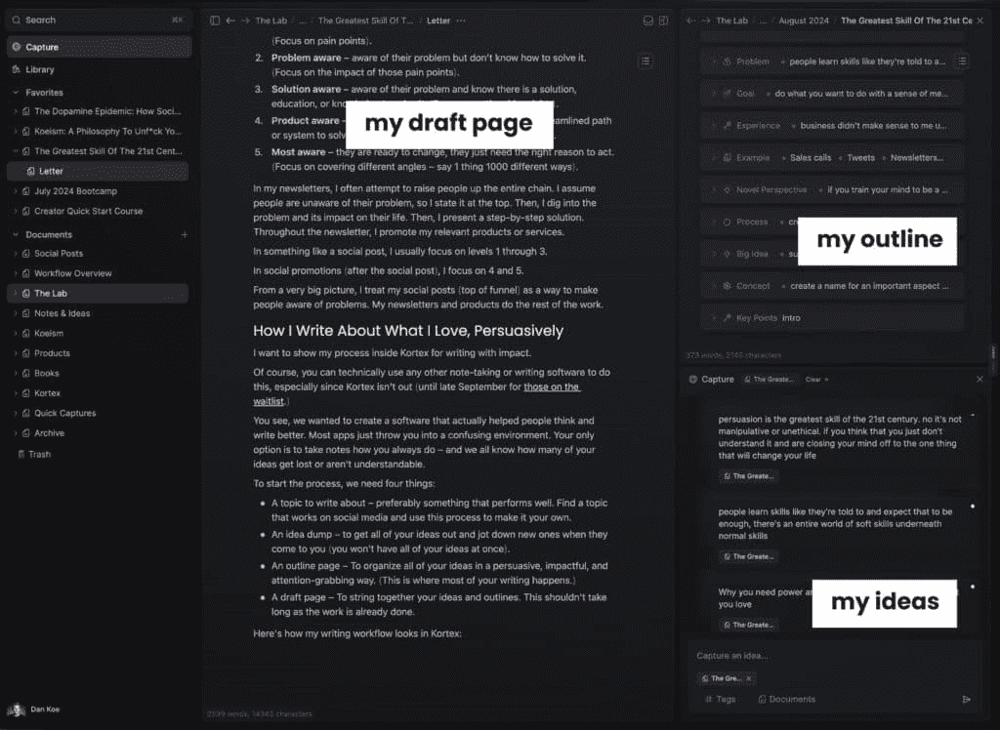

# 用 4 个框架掌握说服力（&成为强大的人）

> 原文：[`thedankoe.com/letters/the-greatest-skill-of-the-21st-century/`](https://thedankoe.com/letters/the-greatest-skill-of-the-21st-century/)

说服力是 21 世纪最伟大的技能。

不，说服力不是操纵。两个不同的词。

不，说服力不是不道德的。如果是的话，那么你就是地球上最不道德的人，因为你每天都在说服，但对你来说是无意识的，所以在这个时候，它被认为是操纵。

当你试图说服你的朋友与你一起做某事时，你正在使用说服力。

当你提出一个为什么人们应该与你合作的论点时，你正在使用说服力。

你试图从生活中得到你想要的东西。你正在玩人生的游戏。如果你不这样做，你可能就不会活着。你没有选择。

为了得到你想要的东西，你需要说服人们给你关注、资源、金钱，最重要的是……权力。

在社会中做得好，并且一直做得好的人，是那些拥有权力和影响力的人。

他们是那些努力获取实现目标所需资源的人，变得有价值，并创造财富的人。

在历史上，从来没有一个时期是弱者、普通人或无思想的人不被当作牛来对待。小心你的思想试图现在就劫持你的思想，让你成为他人（他们没有你想要的生活）在你的脑海中编程的思想的奴隶。

地位、权力和影响力并不坏。每个人都有。每个人都试图得到它们。当出于无意识的原因时，它们才会变成坏事。也就是说，当你不理解通过说服追求权力的整体影响时。

这封信整体上可能完全负面，但如果它对你生活的影响是积极的，这难道就让它变成了一件坏事吗？

**关于做出更好决策的旁白：**你可能会在你的一生中做一些别人会认为“不好”、“肤浅”或“表面”的事情，因为他们不理解大局。他们看不到你看到的东西。他们现在批评你，以后赞扬你。如果你在决定是否应该做出决定，就放大视野，尝试思考所有可能产生的场景。正如我之前说的，一支股票可能会下跌，而指数基金可能会上涨。你可以吃一顿欺骗餐，仍然保持健康。大多数人只是对欺骗餐感到神经质。即使那个决定最终证明是错误的，欢迎来到人类，我的朋友。那才是你下次做出更好决定的唯一方式。犹豫不决、停滞不前、不追求更大的事情，是所有“不好”决定中最糟糕的。

回到要点。

如果你想要被视为有价值，你需要产生权力。

如果你成功的策略是表现得和善、高尚和有精神，你将被卑鄙的人推开，他们的影响比你大。

那些声称权力游戏是坏事的人实际上在玩自己的权力游戏。一个自私的、缺乏对人类贡献的、自欺欺人地只做宣讲，告诉别人应该如何改变，从而让他们从镜子前转移注意力。

最近与你们中的许多人交谈后，我缩小了你来这里的原因。

你想要你喜欢的工作，有意义的生活方式，以及比市场上目前表面的内容更深层次的东西。

猜猜看？

为了实现任何这些事情，你需要一定程度的权力。

你需要有人为你所做的工作付费。

你需要有人愿意听你说话。

你需要对你创造的生活方式有控制感。

你需要说服的不仅仅是人，还有现实本身，以在你的有利方面共谋。“创造”你理想的生活就是在说服现实。你不能强迫现实。你不能欺骗现实。但你可以说服它。这是真理的标志。

你天生就知道你需要学会说服以得到你想要的东西。

唯一阻止你的只是那些在生活中无所作为的人的评判。

## 如何开始说服…今天

结构化思维很重要。

为了及早处理反对意见：

不，框架和结构不会剥夺你的创造力。

每当我教授写作框架、社交媒体帖子框架或如何写我的通讯时，人们都会提出有效的问题。

“如果我不想使用框架呢？如果我想保持真实？如果我想写我想写的一切呢？”

（请注意，我使用“写作”作为一种说服的方式，但你可以将其替换为演讲）。

我的回答：

+   做吧。写你想写的东西。但直到你理解什么使写作有影响力，将你的写作组织成框架。

+   框架并不会伤害创造力，反而会增强它。只有当你有一个目标（有所创造的方向）和限制（如框架）迫使你发挥创造力时，你才能变得有创造力。每天用 4 个小时建立业务而不牺牲健康和人际关系，比放弃生活中的一切来建立业务需要更多的创造力。

+   你已经在使用一个框架了。它被称为你的思维，以及你被编程去思考的方式。问题是，它是无意识的，显然没有影响力，否则你会在生活中得到你想要的东西。

人类通过故事来理解世界。

他们将遇到的任何想法或信息都植入自己的大脑，这是一个寻求意义的机器，试图了解这些信息如何与他们的目标和以往经验相关。

因此，你*可以*写你想写的一切，但你的写作或说服的目的是什么？

为了得到你想要的东西。

换句话说，如果你的写作没有针对另一端的人，那么它真的不能算作说服，对吧？

你将几乎在所有事情上使用以下方法。

我挑战你在未来的每一个生活场景中练习说服，看看你的生活如何改变。

+   在你的社交媒体帖子、时事通讯和着陆页上

+   在你的网络和销售电话或私信中

+   在你试图做出决定的关系中

+   尤其是在你推广你的工作或产品时

今后要有意为之。

在任何机会都练习这些。

### 金字塔原理

金字塔原理是一种简单而有效的沟通方式。

你可以用它来做什么。

这就是你怎么做的：

1.  从你的答案、结论或大想法开始

1.  用 3 个以上的关键论据来证明你的结论。

1.  用事实、数据、轶事、引言等来支持你的论点。

从大局的角度来看，我的所有时事通讯都是这样写的。

这是不是因为我没有乱写而让我显得不真诚？或者这给了我一个以有影响力的方式表达我的思想的方式？

你可以注意到我经常从我想论证的观点开始。

然后，我在时事通讯中有几个部分，我会在那里分解那个观点的论点。

然后，我经常有推文、引言或统计数据来使这些论点更有可信度。

我在[Kortex](https://kortex.co)有自己的模板。在写任何时事通讯之前，我会写出我的观点、我的论据和我在写作时可以参考的研究。然后，那个时事通讯就变成了 YouTube 脚本。当我们推出时，我会用 Kortex 模板更新[2 小时作家](https://2hourwriter.com)。

为什么金字塔原理有效？

读者会立即知道它是否与他们相关（钩子有效）。

他们可以跟随你得出结论的逻辑。

最后，它简单易复制，易于使用。

陈述你的观点，解释原因，并支持它。

### 我个人使用的框架

我喜欢在我写的或说的任何东西中从痛点或问题开始。

这使我的其他想法流畅。

这也很好地框定了情况，并使读者有了资格。

当某人意识到一个痛点时，他们的思维会将其与他们生活中的一个目标联系起来，激发他们了解更多信息的欲望，并帮助他们知道我的写作是否适合他们。然后，留下来的人想要一个解决方案，如果我的解决方案足够好，他们更有可能留下来并投资于我提供的进一步价值。

记住：人类通过故事来理解世界。故事通常从一个预示着“目标”或结果的问题开始。这使得你的大脑开始填补那个故事的空白，并想要继续阅读以看看它是否正确。

这里有一些框架可以尝试，从简单到困难，以实现这一目标。

你可以用 1 和 2 来写社交媒体帖子或长篇作品的开始。你可以用 3 来写时事通讯、着陆页和其他较长的对话，如销售电话。

**1) PP – 痛点与过程**

非常简单。

提出痛点并提供克服它的过程。

作为一个推文的例子：

> 如果你总是感到疲倦：
> 
> +   在午夜停止滚动
> +   
> +   改善你的糟糕营养
> +   
> +   去散步，活动你的身体
> +   
> +   对一个新的兴趣着迷
> +   
> 你之所以感到疲倦，是因为你陷入了导致疲倦的常规中。

将所有这些框架总结成一个结论或行动号召是明智的。

此外，你的解决方案越独特，影响力就越大。

你是一个多巴胺商人，所以提供别人没有听过的创新观点。这要求你对你要写的主题或市场有深入了解。如果你是营销的一部分，这很容易（咳嗽* [你是唯一的利基](https://thedankoe.com/letters/how-to-create-your-niche-of-one-become-nicheless/) *咳嗽*）

**2) PAS(O) – 问题，放大，解决方案，(提供)**

与此类似的故事。

你从痛点开始，但这次你放大了它。

你深入思考这个痛点如何蔓延到某人的生活的其他方面。

就像疲惫可能导致你的丈夫/妻子认为有什么不对劲，小问题突然冒出来一样。或者当你试图建立副业时（它永远能成功吗）？或者当你下班回家时，你只想躺下吃垃圾食品，这显然不利于你。

越具体、越有共鸣，效果越好。个人经历在这种情况下通常效果很好。所以，如果你有痛点经验，你可以谈谈它如何影响你的生活。

这个框架的“提供”部分是可选的。如果你用它来写社交媒体帖子，你不需要提供部分。如果你用这个框架进行推广，那么将你的提供定位为目标痛点的创新解决方案。

**3) PASTOR – 问题，放大，故事，证词，提供，回应**

再次，非常相似。

PASTOR 框架稍微长一些，最好用于推广材料，如着陆页和电子邮件。

当你推出产品、进行促销或很久没有推广自己时，使用这个框架。

从问题开始。

放大它。

提供一个个人或客户故事，说明他们是如何克服问题的。暗示你的独特解决方案。

通过他人的证词展示证据。如果你没有证词，尝试通过个人成果或研究统计数据来展示证据。

介绍你提供的功能优势，与之前描绘的痛点相对立。

让他们做下一步，比如购买。

**4) 尝试框架**

学习说服力的最佳方式是：

1.  研究写作和演讲框架

1.  将它们并排写下来

1.  在现实世界中练习它们

1.  注意它们之间的模式

1.  打破规则

框架、系统和大多数教育都是训练轮。

大多数人都会阅读这封信，或另一封信，或任何其他内容，并看到有人尝试一个“新颖”的解决方案。这可能是一些建议、健康习惯或商业模式。

他们会采用一种策略，从中塑造一个身份，最终在意识到他们随着进步必须改变做事方式时会受到伤害。

人们提供东西来*测试*和*实验*是非常好的事情。当人们拿走那些东西并表现得好像它们是获得结果的唯一方式时，这是非常糟糕的。

因此，为了学习说服技巧，研究并写下 5-10 个框架在你的帖子、对话、通讯和其它地方尝试。

然后，放下框架，使用最初使它们起作用的原理，在任何时候成为一个有说服力的人。

我在[2 小时作家](https://2hourwriter.com)中教授我的 APAG 框架。这就是我写这些变成长视频的长信（让我与众不同）的方式。如果你想的话，可以尝试这个框架。

### 了解你的听众

你的话只有在你对某人说话时，他们*感知*你的话有价值时，才能说服他们。

如果你在一个你很了解的话题上讲一些高级的胡言乱语，初学者是不会关心你有什么要说的。对他们来说，很难与之产生共鸣或理解。

我们可以通过理解 5 个意识层次来解决这个问题：

1.  **无意识** – 意识不到他们的问题及其如何伤害他们的生活质量。（关注痛点）。

1.  **问题意识** – 意识到他们的问题，但不知道如何解决它。（关注那些痛点的影响）。

1.  **解决方案意识** – 意识到他们的问题，并知道有解决方案、教育或知识可以解决它。（关注可操作的忠告）。

1.  **产品意识** – 意识到他们的问题，并知道有简化的路径或系统可以解决它。（关注你独特的做事方式）。

1.  **最意识** – 他们准备好改变，只是需要正确的理由去行动。（关注从不同角度覆盖——用 1000 种不同的方式说一件事）。

在我的通讯中，我经常试图提升人们整个链条的认识。我假设人们不知道他们的问题，所以我会在开头陈述它。然后，我深入探讨问题及其对他们生活的影响。然后，我呈现一个逐步的解决方案。在整个通讯中，我推广我的相关产品或服务。

在类似社交帖子这样的东西中，我通常关注第 1 到第 3 个层次。

在社交推广（社交帖子之后），我关注第 4 和第 5 个层次。

从一个非常大的角度来看，我把我的社交帖子（漏斗顶部）视为让人们意识到问题的方法。我的通讯和产品做其余的工作。

## 我如何有说服力地写我所热爱的事物

我想展示我在 Kortex 中写作时如何产生影响力的过程。

当然，你可以技术上使用任何其他笔记或写作软件来做这件事，特别是由于 Kortex 还没有推出（直到 9 月底对于[等待名单上的人](https://kortex.co)）。

你看，我们想要创建一个真正帮助人们思考和写作更好的软件。大多数应用程序只是让你陷入一个令人困惑的环境。你唯一的选择是像往常一样记笔记 – 而我们都知道你的多少想法丢失了或者无法理解。

要开始这个过程，我们需要四样东西：

+   **写作主题** – 最好是表现良好的内容。找到一个在社交媒体上表现良好的主题，并使用这个流程使其成为你自己的。

+   **想法倾倒** – 将所有想法倾倒出来，并在它们出现时记下新的想法（你不会一次性拥有所有想法）。

+   **大纲页面** – 以有说服力、有影响力、引人注目的方式组织所有想法。（这是大部分写作发生的地方）。

+   **草稿页面** – 将你的想法和大纲串联起来。由于工作已经完成，这不应该花费很长时间。

这就是我的 Kortex 写作工作流程看起来像什么：

<picture fetchpriority="high" decoding="async" class="wp-image-2188"></picture>

我在每个周的开始时开始我的大纲。

我可以在手机上捕捉想法并将它们附加到那个大纲中（想想你如何在 Todoist 这样的应用程序中向项目添加“待办事项”）。

奇迹发生在大纲中。

在上面截图的右上角，我们有一个名为“元素”的功能。

这是我们的学生和用户最喜欢的一个简单功能。

简而言之，它们只是你可以命名的自定义突出显示框，类似于 Notion。但在 Kortex 中，你可以链接到它们，镜像它们，并且最终能够为每个元素添加自定义提示，以便 AI 可以在几秒钟内创建你的大纲（基于你在第二大脑中存储的所有知识，因此它是独特的，符合你的写作风格）。

这就是我的带有元素的空白每周大纲看起来像什么：

<picture decoding="async" class="wp-image-2187"></picture>

我在顶部头脑风暴 YouTube 标题和标题。

我将相关的笔记和想法连接起来，以便在写作时导航。

我添加推文、引言和研究来加强我的论点，并给我提供谈话要点。

（我将所有这些存储在我的图书馆中，该图书馆与 Readwise 集成，这样我就可以从 Kindle 高亮到推文书签再到网页剪辑保存一切）。

<picture decoding="async" class="wp-image-2189"></picture>

（你可以看到我可以在左侧面板中打开任何我的高亮、文档、捕获、大纲等，以便在写作时有一个全面的视图 – 或者我可以进入专注模式）。

然后，我列出写作中需要回答的问题或反对意见。

我阐述并放大痛点或问题。

我头脑风暴目标或期望的结果。

我谈论我的经验以增强可靠性，注意新颖的视角，创建可操作的步骤作为解决方案，总结大思想，并头脑风暴潜在的概念。

顺便说一句，这就是我构思所有最佳 YouTube 视频的方法。

我的视频“单人企业（如何产品化自己）”只是我内容大纲中的“概念（过程）”元素。

这就是为什么大纲和元素如此重要的原因。

你不是学会写有说服力的文章，而是学会有说服力地组织你的思想，然后写作就变得容易了。

你可以用任何笔记应用来创建这个系统，但这可能很困难或需要很多时间。或者你可能需要串联 5 个应用。

这不是 Kortex 的唯一目的，因为我确信你可以看到这将如何导致日记、生产力以及更多内容模板。

这只是[Kortex](https://kortex.co)的冰山一角。

所以，为了总结你应该做什么来开始练习你的说服力：

+   接受你需要力量和地位才能打破比你更有力量的人设定的等级。

+   以金字塔原理作为起点。陈述你的观点，论证你的观点，支持你的观点。

+   使用文案、内容或说服力框架来构建你的写作、演讲或视频脚本。

+   首先基于该框架创建一个大纲。

+   有一个地方可以捕捉想法（因为最好的想法不会在你试图构思所有想法时出现）。

+   开始你的草稿。将你的大纲想法串联起来。

然后，将其发布在公共平台上，这样你就可以开始收集数据。

如果人们不参与、购买或关注，你做错了什么，你可能需要更多地教育自己在说服力之外。

这里有一些开始的地方：

+   [如何在社交媒体上真正成长](https://thedankoe.com/letters/how-to-actually-grow-on-social-media-what-they-dont-tell-you/)

+   [《单人基金会迷你课程》](https://theone-personbusiness.com)

+   [数字经济学](https://digitaleconomics.school)或我的[其他课程](https://thedankoe.com)

这封信就到这里了。

感谢您阅读。

– 丹
