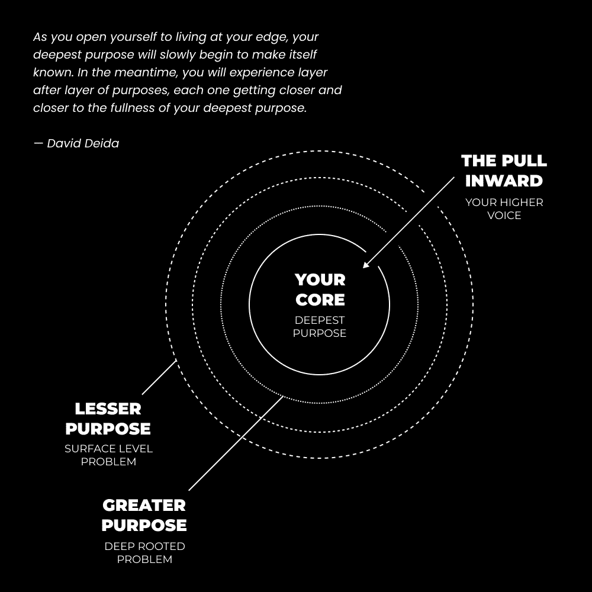

# 8 Steps To Just Stop Giving A F*ck

> 原文：[`thedankoe.com/letters/8-steps-to-just-stop-giving-a-fck/`](https://thedankoe.com/letters/8-steps-to-just-stop-giving-a-fck/)

如果你想要停止关心别人的看法...

如果你想要自信地优雅地在这个世界上行走...

如果你想要建立业务、掌握你的技艺或从生活中得到你想要的东西...

这里有一些停止在乎的 8 个步骤。

我们将讨论：

+   自信的三个支柱，这样你就可以快速停止关心。

+   为什么你一开始就如此关心（这样你就有意识去停止）。

+   如何重新编程你的大脑，成为你注定要成为的人。

+   为什么你可能正走在一条 100%失败率的生活道路上，以及如何逃离。

+   如何发展你自己的内心指南针，找到你生活中的所求。

+   发现你的兴趣并将改进变成痴迷的过程。

+   一个加速改变你生活的工具。

+   现实的本质，以及它如何帮助你变得更聪明（这样你就不会为小事烦恼）。

我不希望这又是一个随处可见的表面性的步骤建议。我希望你能彻底解决这个问题。而这将需要我们深入探讨。

***

**一个微妙的提醒：**

我们将于 9 月 20 日开始推出 Kortex 的访问权限（现在还有 6 天）。

你必须加入 Kortex 的等待名单才能获得访问权限。

Taylin Simmonds 说：“这就像 Notion、Obsidian 和 Google Docs 生了一个孩子。”

所以，如果你想要一个地方：

+   捕获你所有的想法（而不会有一个混乱的笔记，让你丢失它们）

+   将你的 Kindle 高亮、网页、PDF、推文以及任何与 Readwise 集成的内容存储起来。

+   拥有一个互联的第二大脑，孕育出清晰而独特的写作。

+   编写着陆页、社交媒体帖子、视频脚本或任何你的创意项目。

此外，获取免费的第二大脑课程和社区论坛的访问权限...

在这里加入[Kortex 等待名单](https://kortex.co)。在接下来的几周内，你将收到一封电子邮件来注册（是的，有免费层）。

***

## 1) 自信的三个支柱

不再在乎的第一步是理解自信的大图景，而不仅仅是些肤浅的建议。

如果自信就像观看一个关于自信的 YouTube 视频那么简单，我们就会生活在乌托邦。

有更深层次的事情在发生，我希望我能在整封信中让你意识到这一点。

缺乏自信是困扰大多数人口潜力的一个问题。他们太在意别人的看法。

假设你想开始创业，思绪开始涌来：

我的父母会怎么想？

我的朋友们会怎么想？

我的配偶会怎么想？

这是否足以取代我的收入？

需要多长时间？

当你真正开始建立业务时，甚至不要让我开始谈论那些涌上心头的想法。

人们失败的原因是他们无法承担实现他们设定的目标所需的情感负担。

对于每一个想要过上更好生活的想法，都有 100 个想法把你拉回原点。

这只是关于商业的想法。

那么，我们一天中还有 60-80,000 个其他想法呢？

我们有很多事情要做。

当我尝试交新朋友时，我会显得奇怪吗？

如果我不控制我的债务，我会在生活中走到哪里？

我今天早上喂狗了吗？想象一下，如果他们发现了，人们会认为我是一个多么糟糕的宠物主人。

培养自信并非易事。

更多信息，更多责任，以及更多未来选择，将信心转化为成功，将焦虑转化为失败。

这是我们现在生活的现代环境。

我们如何开始培养那种导致自信的信任？

当大多数人想知道他们如何能变得更加自信时，他们会想起这种简单的建议：

“自信=能力。”

这是真的，但大多数人会将能力视为在特定技能上变得更好。

所以他们会学习，学习，再学习，从不行动，从不自我反思，也从未在任何情境中真正将自信作为一种技能来培养。这是最常见的结局。

那个简单陈述背后有着深意，很少有人能看透。

我们必须寻求理解这个陈述，因为显然，“自信=能力”作为一般建议并没有解决世界上最大的问题之一，反而使它变得更糟。

**支柱 1）视角**

当你进入一个你感觉不自信的情境时，焦虑会急剧上升。

这会使你的思想封闭，除了你的思想之外，其他一切都不考虑。

它们会成倍增加。

你完全从情境中退缩，成为你过去的奴隶。你之前经历过的经历。你仍然是同一个人。

你必须摆脱这种状态，并做出有意识的努力，重新编程你对情境的反应习惯。

要做到这一点：

+   当你进入一个情境，焦虑爆发时，暂停一下

+   放大视角，看看情境本身，只是一个正常的情况

+   将意识转移到与你处于同一情境的人身上

“转移意识”就是采取另一个人的视角。

大多数人只是像我们一样经历同样生活的人。

亿万富翁也是有同样问题的人。

健身模特也是有问题的人。

你在心理上置于你之上的人都有同样的问题。

令他们对你产生负面反应的唯一一件事就是像对待非人类一样对待他们。

不要把他们置于你之上。

记住，这正在形成一种习惯。

这需要重复和实践。

如果你不对情境有正确的认识，你就无法前进到其他支柱。

**支柱 2）感知**

你如何看待情境决定了你的行为。

这要求你在情境之前转变到一个开放的心态，并在情境中保持这种心态。

如果你滑动社交媒体，不把企业主的推文视为接触的机会，你就不会去接触。

如果你把它视为机会，你可能会搞砸信息或者根本不发送信息，因为你误解了那个人。

这同样适用于结交新朋友或参与困难的讨论。

感知是双向的。

你根据他们如何展示自己来感知他人。

他们根据你如何展示自己来感知你。

如果你没有“看起来合适”或者以某种方式表现自己，导致对方做出积极的解读，那么事情就不会顺利。而且你会在潜意识中知道这一点。你不会参与某些情况，因为你以你的外观和行为为自己设置了失败。

我非常内向，但人们经常告诉我，我穿着、走路和说话的方式看起来很有自信。

练习。

**第三支柱）实践**

你在某个方面的能力允许你更好地感知情况。

将技能获取视为提高你在人生游戏中水平的一种方式。

在一款视频游戏中，有“技能树”。

在游戏中，你选择技能来帮助你以你想要的方式玩游戏。

随着你练习这些技能，你增加了你的经验，新的技能对你开放。

这里关键点是：

*你无法访问其他技能，直到你练习你目前可用的技能。*

你没有意识到有利可图的机会，因为你没有识别、选择和采取行动的技能。

当你朝着你的目标前进时，你需要教育和练习技能以达到那些目标。

如果你目标定得太高，你会感到不知所措，不知道该学什么。

你必须在你自己的水平上玩，并获取达到下一个水平所需的技能。

随着你的水平提高，你会在你的工具箱中填满技能，这些技能让你能够看到你所在的飞机，这比你在较低水平时要广阔得多。

我第一次成功的尝试是自由职业网页设计。

任何人都可学习的单一技能。竞争激烈，争夺更高的价格。

我知道，如果我想做一些更有利可图的，比如为服务型企业制作漏斗，我就必须学习营销、文案写作和买家旅程等技能，才能做得好。

然后，当我追求创作者的水平时，我需要结合我所知，并添加新的技能，如内容写作（我在[2 小时作家](https://2hourwriter.com/)教授你所需的所有技能）。

我的水平越高，我遇到的人越多，我在多个领域的自信心也越强。

你能做的最糟糕的事情就是停止学习新技能，满足于你现在的水平。

视角、感知和实践是自信的基础。现在，让我们深入探讨一下。

## 2) 理解你为何一开始就关心

> 今天，在数百万年之后，我们拥有着为相同目的设计的相同大脑。但由于我们越来越能控制我们的环境，物理压力大大减轻，危险变得更加微妙——它们以人的形式（而不是豹子）和他们的狡猾心理，以及我们必须玩的政治和社会游戏出现。正因为这些不那么明显的危险，我们最大的问题是我们的思维变得对环境不那么敏感；我们转向内心，沉迷于我们的梦想和幻想。我们变得天真。 —— 罗伯特·格林

你太在乎了，因为这威胁到了你的自我形象。

你在心中有一个关于自己的形象，当一种思想、观点或意见与之冲突时，你的情绪开始激化。你退缩了。你陷入了生存模式。你唯一能关注的就是另一个人的观点。从那里，因为你没有暂停并打开你的心扉，它放大并占据了你的心灵。

人类和动物有一个主要的不同点。

动物试图在物理层面上生存。当它们的身体受到威胁时，它们会感到受到威胁。它们试图复制它们基因中的信息。

多亏了自我反思意识的产生，人类试图在物理层面和心灵层面上生存。当我们的身体受到威胁时，我们会感到受到威胁，但我们的心灵，或者我们的自我形象，也会受到威胁。我们试图复制我们基因中的信息，也试图复制我们意识中的信息。

我们写书，交流，互相发短信，选择政治立场，这样我们认同的思想网络就能在我们死后继续存在。思想是精神上的精子。通过读书，作者在精神上使你受孕。你的自我形象是你一生中接触到的所有思想的产物。艺术家通过他们的思想变得不朽，就像我们长时间引用柏拉图和亚里士多德，尽管他们的肉体已经消失。

这可能听起来很奇怪，确实如此，但我会让你稍微思考一下，以确定它的有效性。如果这有助于你，不要把它看作是精神上的性行为，而把它看作是在你的心中播种和浇灌种子，使其成为花朵。当你思考的时候也是这样。上面这样，下面也是这样。

那么，我们为什么在乎别人的看法呢？

因为我们想要生存。

我们被编程去被部落接受。如果我们不被接受，我们就会成为局外人。我们将失去生存的资源。如果你的父母与你所认同的意识形态不同，比如你是共和党人、民主党人、基督徒、穆斯林，或者如果你足够坚定地认同……如果你的最喜欢的运动队不是他们的（这是一个极端但可能的情况），他们将会厌恶你。你的信仰与父母的信仰发生冲突，他们会不惜一切代价去生存。这种心理感受与在战斗中被刺伤相当。如果他们没有发展，他们会通过把你赶出家门来反击，你*将会*感到那种痛苦。

在某些情况下，关心别人的看法是有意义的。在你还没有能力独立生存和繁荣的时候，不想被排斥（或被反击）是明智和战略性的。

但在 95%的现代案例中，当我们可以学习任何东西，做任何事，实现任何事时，这是完全无用的。你实际上并没有受到威胁。当有人在评论区嘲笑你的发际线时，你的生存并没有真正受到威胁。但是，你没有学会如何导航和掌控你的思维，所以你认为威胁是真实的，并成为它的奴隶。你没有知识、技能和自我发展的能力，能够自信地做任何你想做的事。

## 3) 编程你的思维停止关心

你在乎别人的看法，因为你的思维被编程去这样。

这对你来说是一种本能。

你在小时候就被编程去服从命令。你的思维编程自己以生存。你将威胁到你生存的事情——比如小时候触摸蜡烛火焰——视为坏事。这是有道理的。你不想被责骂或烧伤。这是负面反馈，你的思维将其解释为如此。

你的父母可能没有教你如何掌控自己的思维，因为他们自己也没有掌控好。

这就是开始重新编程你思维的方法。

首先，你需要打破无意识的习惯。

你需要停止程序执行。

每当你感到情绪反应时，*暂停*。

*暂停是一个改变你想法的机会*。

其次，练习元认知。质疑你的思绪，让你的思维从狭窄的状态中打开。

提出问题，“我真的在乎这件事吗？”

从那里开始，让思绪引发思绪，直到紧张感释放。

当你这样做足够多的时候，它就变成了一种习惯，你的思维也会转变。你会意识到你实际上并不在乎；你的思维只是喜欢让你从满足和平静的状态中分心。

这可能在一时的冲动中不可能实现，但在反思或在你独自一人，在手机上阅读某些内容后感到受到威胁时是可能的。

通过自我反思，你可以在任何时候重新编程你的思维。

## 4) 社会的道路有 100%的失败率

> 智力的真正考验是你是否能从生活中得到你想要的东西。 —— 纳瓦尔·拉维坎特

你在乎别人的看法，因为你对自己的独立生存能力没有信心。你依赖别人给你一个角色，而不是自己创造。

我要陈述一些可能会冒犯你的事情。

换句话说，你可能在乎我的看法，所以可能是时候练习上面提到的事情了。

**1) 生活中现代的默认路径是自动失败的，因为你一开始就没有设定目标。**

上学，找工作，买房，让 40 年过去，退休（也许）。

你实现了别人想要的东西，而不是你自己的。这并不是智慧，这是盲目的愚蠢。你没有质疑你的编程。

这不是成功，这是彻底的失败。即使周围的人都认为你的物质财富是成功，他们却忽视了这样一个事实：你不是独一无二的个体。你的个性和自我形象是与社会大众一样的克隆体。

在我的定义中，成功是创造你自己。你生活中的质量、乐趣和满足感是那个过程的副产品。

**2) 学校系统是一个旨在让人变得愚昧的构造，即使这并非其初衷。**

学校的建立是为了教育人们在其所在王国或社会中的特定角色。

那里的关键词是“特定角色”。

在他们整个教育过程中，他们追求一个目标。这个目标是为了让他们达到一定的地位，这样别人就会认为他们很重要。这样他们才能生存并从别人那里获取资源。这个单一的目标决定了他们可能获得的所有知识（这就是目标的作用，框架你的思维以学习新的信息以达到那个目标）。他们研究了一个领域，比如历史、金融、生物学。他们研究的是一部分，而不是整体。他们研究的是材料，而不是关系。他们研究的是点，而不是联系的网络。

结果是，他们在某个领域拥有大量的知识，使他们对别人有用，而不是对自己有用。他们只有选择成为需要他们专业知识的人的奴隶。不是身体上的奴隶，而是精神上的。他们没有通才的理解力，使他们能够为自己设定的目标创造自己的道路。

这与在乎别人的看法有什么关系？

因为仅仅为了实现别人分配给你的目标而学习是极其破坏性的。它会让你陷入一条单一的道路，为了地位。它会让你变成一个狭隘的克隆体，看不到生活的深度，因为如果你看到了生活的深度，你就会停止关心。

## 5) 拥抱自然的指南针

你知道大脑是如何工作的吗？

大脑是一个帮助实现已知目标和发现未知目标的系统。

你的大脑总是在运作，策划，并根据占据你大脑的目标来理解现实。

这些目标，大多数情况下，是你从文化中接受的*价值观*、父母和老师提供的*信息*、生存的生物需求以及更多其他因素的结果。你的目标往往是你的环境的产物。

为什么这很重要？

因为理解它将决定你生活的结果。

占据你头脑的目标决定了你感知和学习的内容。

你的大脑会自动接受或拒绝信息，以帮助你实现追求的目标。例如，如果你只有一个目标，那就是上学和找工作，你只会注意到帮助你实现这一目标的生活方面。但如果你有一个目标，那就是过上最好的生活，这是一个更加全面且几乎永无止境的目标（一个无限游戏），你会注意到多得多的东西。你可以发现和获取的目标和技能将是无限的。只要你保持这个目标，生活就会保持其活力——因为它很容易被社会所取代。

重点：

你在乎别人的看法，因为你不在自己的小世界里。你没有被你的愿景、使命以及构成它们的那些目标所占据，以至于无法被分散注意力。

流动状态代表了最佳体验。你的注意力沉浸在当前的目标中，你忘记了你的担忧。

为了保持持续的状态，这只能发生在你控制着塑造你每一个行动的目标时，从早上醒来到走在街上。

如果你想要重新掌控你的生活，你必须从头开始。

由于目标决定了你如何看待世界，因此决定了你所能获得的机会，社会为你设定的默认路径——以及你头脑中存在的任何碎片——对你的生活质量是有害的。

对你所知道的一切提出质疑。反抗社会，找出对你自己来说什么是真实的。密切关注你的每一个思想和行动。问自己，“我设定的目标导致了这个结果吗？”

现在的问题是，你如何带着确定性去导航生活？

你不需要。而且你一开始就不在一个安全或确定的地方。

在我看来，今天是你的生日。你不再是那个被分配给你的身份。因为你选择了重生，你现在可以开始重新编程的过程。所以，生日快乐。

忘掉你对确定性和安全的不断追求。那只会将你困在另一个狭隘的领域。

相反，拥抱自然的指南针。

+   为你的未来创造一个愿景。让它宏大而几乎疯狂。

+   将其逆向工程为 10 年、1 年、每月和每周的目标。

+   将其进一步分解为每天需要完成的优先任务。

+   这些优先任务将涉及自我教育和问题解决。

你实际上为你的心灵创造了一个新的框架，以充分利用生活。

你正在给自己提供机会，可以随意进入心流状态。你有一连串的挑战性目标，必须掌握匹配这些目标的技能。

<picture fetchpriority="high" decoding="async" class="wp-image-2211"></picture>

现在，这并不是一个静态和狭隘的框架。这会随着你的成长而发展。接受重新审视你的计划并改变它是可以的。

之后，你所做的一切都归结于识别和解决问题。问题是黑暗房间里的光明。

+   从你生活中现在可触及的问题开始。

+   改善你的健康。改善你的财务状况。改善你的关系。改善你的心理健康。

+   不要被那些不在你直接经验范围内的问题所分散注意力。

当你解决问题时，新的问题会显现出来。你可以去健身房解决你的自信心问题，但这会揭示更深层次的问题。自信不是通过外在的表象就能解决的。这是一个内在的问题。所以解决那个问题。从浅处开始，因为这是唯一深入挖掘深度的方式。

<picture decoding="async" class="wp-image-2212"></picture>

你是如何解决问题的？

通过自我实验。不接受别人的解决方案、意识形态或建议作为法律。你尝试别人的技术和流程，找到它们交汇的地方，从而永久解决存在的问题。

很快你就会意识到，所有的问题都导向自我实现和发展。你走得越深，你就能越成功，你在这个过程中获得的技能也越多。

## 6) 激情过程

很不幸，“激情”已经变成了它以前形态的糟粕版本。

互联网上充斥着标题和营销角度的头条，大声疾呼激情是无用的，你不需要找到它，或者你应该做其他的事情。

激情是一个伟大、描述性、值得的词。

你可以在骨子里感受到激情。

如果你不去过一种充满激情的生活，那么唯一的其他选择是什么？

当你对某件事充满激情时，你不在乎别人怎么想。

你将独自研究这一切。这将成为你的避风港。

你在社会层面上会有朋友，但在智力层面上，你将完全满足于你的孤独。

同时，当你找到那些与你分享激情的少数人时，就会形成一种不可摧毁的纽带。这是无与伦比的感觉。

你是如何发现你的激情的？

有几件事情你需要知道：

+   激情是当改进变成痴迷的时候。

+   激情是尝试一切并发现那一件让你无法自拔的事情的过程。

+   激情不是在你现在所在的地方找到的。它是在你前往的地方的旅途中被发现的。

那些是你的指南。

当你朝着你的愿景解决问题时，通过自我教育找到的潜在技术和解决方案进行实验，保持对激情迹象的警觉。

学习新信息将变成一种爱好，而不是一项任务。

建立一家企业会感觉像是一个孩子玩乐高一样。

如果你想要停止在乎别人的看法，发现你的激情。

## 7) 写得更多

你的思想是现实的操作系统。

当你学会如何思考时，你就学会了如何有效地导航情况，以获得对你和他人最有利的结局。换句话说，当你学会如何思考时，你就能从生活中得到你想要的东西。

你如何提高思考能力？通过将你的思想和想法视为乐高积木。你不是因为组成你思考的思想和想法是一团糟而有智慧的思想家。你无法看到它们的个体状态并重新组织它们。

这就是写作发挥作用的地方。

写作是加速你心智训练的工具。

将自己写入一个能带来更好生活的世界观。

当我按照我希望成为的人来写作时，我感觉最好。

我从未把自己当作一个作家（在大多数情况下仍然不是），直到我意识到我学到的每一项其他技能都需要我写作。

视频大纲、着陆页、短信、电子邮件、广告、社交媒体内容等。即使我学习了像平面设计或编程这样的其他技能，我仍然需要*写作*，使用这些技能来为这项服务吸引客户或顾客。

每个人都是作家。一旦你内化了这一点，并开始磨练使你的创意工作成功的技能，你就会看到你甚至不知道你正在追求的好处。

+   写作迫使你组织和表达你的思想。你成为一个更好的决策者。你开始慢慢地在你的思想混乱中找到方向。

+   写作是完美的反馈机制。如果你的读者没有成长，或者你没有因为你的工作而获得报酬，那么这是一个你需要提高说服力写作能力的信号。

+   你的写作越好，你的思考就越深入，如果你的思想影响了你的大多数习惯、行为、优先事项以及理解复杂情况的能力，那么写作将大大增加你成功的机会。

你不需要英语学位就能写作。你已经用短信给你的朋友带来了比大多数学校论文更大的影响力。如果你能说服一个朋友通过短信和你一起吃饭，那么你在现实世界的应用中比大多数学者更有写作能力。

多亏了社交媒体和互联网，如果你有能力了解它们是如何运作的，一个简单的类似短信的社交媒体帖子就能触及成千上万的人，其中许多人愿意为你提供的价值付费。

你可以养成最具影响力的习惯是早上 30-60 分钟的写作习惯。让它变得有意识。让你自己和你的工作成功的关键在于你将你的写作——免费或付费——展示给那些能够共鸣的人。

我们将在未来的信中讨论我在 Kortex 内部是如何做到这一点的。

现在，[加入等待名单](https://kortex.co)，我们将在 9 月 20 日开始推出应用程序的访问权限。

## 8) 宇宙思维

如果你想要停止关心别人的看法，学会放大视角。

当我说放大视角时，我是指尽可能远地放大。超越宇宙，向着宇宙本身。

对于古希腊哲学家来说，世界是一个“宇宙”，用来描述宇宙作为一个有序和和谐的系统。这与今天将宇宙视为机器的还原论科学范式相反，它试图通过研究部分来理解现实，而不是研究部分之间的关系，这些关系构成了整体。

在这种意义上，“宇宙”几乎等同于对终极现实的全部解释：上帝、梵天、无限、源头、特奥洛、以及宗教领袖和神秘大师们所暗示的其他概念。

对于希腊人来说，在思考部分和整体时，每个部分都服务于宇宙和谐的目的。

其他哲学家，如艾伦·瓦茨，将世界描述为一个有机体——一个由关系约束的功能性生态系统。

亚里士多德认为，事物的最终原因是它的功能，任何事物的完整解释都必须考虑其最终原因。这提出了目的论和控制论领域。

目的论（*telos*意为目标，*logos*意为理由）是通过参考其目的、终点或目标来解释某物的观点。

控制论研究系统如何自我调节和自我组织，以达到系统的最终目标。

当结合并应用于心灵时，我们可以开始理解我们的行为和举止，通过这种理解，我们可以改变它们。

心灵是一个系统，它接受和拒绝信息以帮助实现其目标。我之前讨论过这一点，但你现在必须理解，你的行为可以通过你的目的来解释。

人类是目标导向的生物。你总是有一个目标。但当这个目标被分配给你，而你又没有意识到它时，你开始关心别人的看法，这会慢慢地摧毁你的生活。

通过与最高自我的目的以及宇宙本身的目的相一致——正如我在书中所讨论的——生活将变得更有意义，你可以开始优雅地导航它。

我们可以深入探究现实的本质，但在我看来，最好的方式是通过观察你的心灵并记录下反映在你周围世界中的模式。

当涉及到“对某事不关心”时，你之所以关心别人的看法，是因为你看不到大局。你看不到你正在运作的生态系统。你不理解你的目的，也不理解处于这种情况中的人们的目的，以及这两个目标如何不一致，因此当然会有心理冲突。

你无法采取他人的视角来看他们是如何与情况互动的。你无法拓宽自己的视角来找到出路。你无法看到那个情况中每个变量的因果关系，这会帮助你获得清晰并自信地前进。

你会因为某人的政治评论而感到冒犯，因为你不懂他们的世界观以及是什么导致了这样的评论。你无法退后一步，看到你的反应几乎对对方的观点没有影响，而且，如果有什么的话，反而会使他们的反应变得更糟，导致浪费时间争论。

我所说的宇宙思维，是指带有一些魔法和灵性的系统思维。我喜欢这个主题，而且还没有写够，所以我们将把大部分内容留到未来的信件中。

宇宙思维是关于放手，扩大你的思维，从一个更高、无范式偏见的视角来观察情况，理解整体及其部分（包括你自己）的目的，并引导自己做出有利于你内心清晰和实现更高目的的生活进步的决定。

因此，再次强调，当你感到自己变得紧张和反应过度时，请暂停。

退后一步。看清情况本身。如果你无法控制它，就放手。找到导致秩序的关联。
