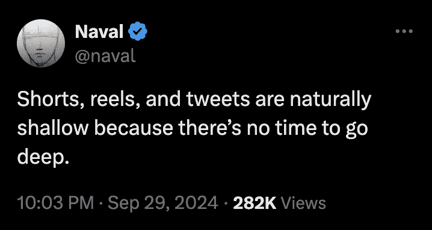
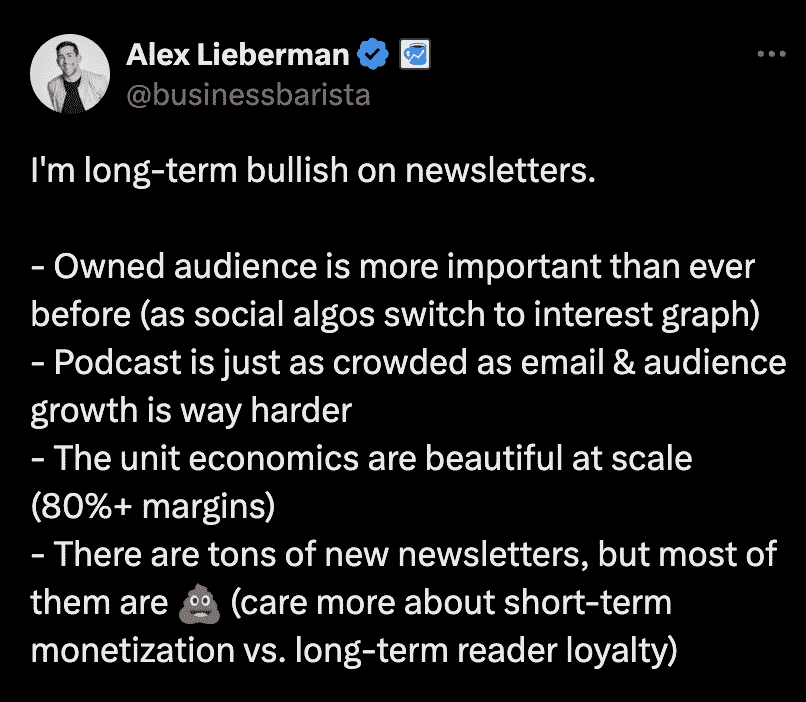

# 智能创作者如何在 2025 年建立受众

> 原文：[`thedankoe.com/letters/the-future-of-creators-how-to-build-an-audience-in-2025/`](https://thedankoe.com/letters/the-future-of-creators-how-to-build-an-audience-in-2025/)

我开始在社交媒体上写作，因为我想要做自己想做的事情。

但写作并不是我追求自由的第一次尝试。

在那之前，我肯定没有意识到写作——这个对英语专业和实体书作者来说奇怪的技能——是我掌控自己生活的门票。

我的第一个“真正的工作”是在一家零售营销机构担任网页设计师（想想家具和家电零售商的电子商务店铺）。

在一家印刷店兼职工作，试图在兄弟会宿舍里支付租金，那里有 7 个室友。住在那里的时候，我尽我所能为自己工作。我一直想做一些有创意的事情。我尝试了从摄影、数字艺术、跨境电商、多个电子商务店铺、创办自动化机构、自由职业网页开发等等，但都失败了。

但我们都知道失败是好事。

我得到这个网页设计工作是因为我在大学里已经学习了 5 年，债务开始累积。我还有大约一年的学校时间，因为我记得至少换过 4 次专业。

但我的梦想并没有死去。我知道一旦我得到这份工作，时钟就开始倒计时，指向我的毁灭。

找到一份工作是我存在的痛苦。我反乌托邦愿景的核心。

我知道我会变得舒适。

我知道如果我现在不采取行动，我就会终身陷入企业系统。

而随着责任的累积，想要摆脱现状只会变得更加困难。

幸运的是，我有如此多的失败经历，通过自由职业网页设计赚了一大笔钱。足够让我辞职。我在工作中拖延了大部分工作，以追求和学习自由职业。我是个糟糕的员工，但我做得足够好，以至于没有引起注意。

但我仍然几乎全职地作为自由职业者工作。

我仍然讨厌为别人做项目。

那时我终于明白了社交媒体的重要性。

### 自由的关键

从赞美或成功中你学不到任何东西。

你可以从负面和失败中学习。

我的“失败”的企业教会了我所有的技能（如品牌建设、设计、文案写作和分销），这些技能最终使我意识到在互联网业务这个阶段社交媒体的重要性。

在 2019 年翻阅了数月推特后，我意识到一件事。

+   人们只是……写作。没有图片，没有设计，没有耗时的视频编辑。就像向一个巨大的公共群聊发送短信。

+   人们谈论的事情我已经知道了。我经常想，“我也能写那条推文。”

+   人们将他们的个人资料用作吸引客户的方式。一些人通过网页设计做到了这一点（“嘿，我也能做这个。”）

+   人们实际上很酷。我感觉自己在一个没有商业语言或我厌恶的专业性的地方，但他们仍然赚了很多钱。

那时我才恍然大悟。

“等等，这些人不是在发送冷邮件或采取奇怪的客户获取策略。”

他们只是在建立受众。

你是在告诉我，我可以只写我喜欢的内容，它就能吸引客户到我这里来吗？

为什么我要通过发送手动冷邮件和与一个我讨厌的利基市场的人合作来破坏我的心理健康，因为有人告诉我这是有利可图的？

经过这么长时间……写作，所有事情中，是通向我的自由的钥匙。

为什么？

一，它可以帮助我获得自由职业客户，但这只是开始。

如果我坚持下去，建立起哪怕是一个小小的受众群体，我就能做一些更有影响力的工作。

物理产品、数字产品、软件、书籍……我终于可以“睡梦中赚钱”并停止接受我不感兴趣的项目。

正如你们中的许多人可以告诉我的那样，通过适当的坚持和迭代，那个愿景终于实现了。

但钱只是冰山一角。

大多数人都没有意识到这一点。他们喜欢说，“他们只是为了钱而做这件事，”但生活中绝对没有人只为了一个原因而做任何事情。

是的，当然，我们都是为了钱。钱是必要的。把你对钱的固有观念放在一边。重点是：

有什么比得到报酬做自己更有意义的工作呢？

为了销售对他人有积极影响的产品。

通过谈论对你来说重要的兴趣来帮助人们。

我知道这听起来很无私，但对我来说，这比仅仅为了生存而赚钱要好得多，即使它是自由职业。

自由职业并不像我想象的那么自由。

## 受众建设的未来

<picture fetchpriority="high" decoding="async" class="wp-image-2251"></picture>

自从那时起，社交媒体已经发生了变化。

你不会相信，但现在建立受众比以前更容易了。

TikToks、Reels 和 Shorts 还不存在。

当然，那些不是基于写作的，但它们的流行改变了算法的整体工作方式。

算法已经切换到*兴趣图谱*。

这意味着*社交媒体的粉丝不再重要了（大部分情况下）。*

“为你推荐”页面已经改变了我们动态上看到的内容。

是的，你仍然能看到你关注的人发布的内容，但前提是你必须持续对该账户表示兴趣。

大多数时候，你的动态都是你分享、长时间查看或最近参与的话题的相关帖子。

这意味着几件事情：

+   如果小账户学会了写吸引人和相关的内容，它们可以迅速增长。

+   为了在社交媒体上保持相关性，你不能像以前那样深入。你必须保持相对肤浅。（这并不是坏事。你被迫去接触那些处于入门水平的人，并真正改变他们的生活，直到他们理解你的深度。）

+   如果你想要*建立*和*保持*你的受众，时事通讯比以往任何时候都更重要。社交媒体成为让追随者了解你的“第一层”，而不是一个培养或教育的地方（再次强调，主要是）。

我在这里谈论的是短内容平台。

Instagram、X、LinkedIn、TikTok 和短视频。

长视频和播客则是一个稍微不同的话题。

### 时事通讯是新的受众。

<picture decoding="async" class="wp-image-2252"></picture>

我已经谈论了这个话题 2-3 年了，现在似乎其他人也开始注意到了。

对于信任、权威和杠杆作用来说，长内容更为重要。

对于流量、病毒式传播和关注度来说，短内容更为重要。

重点是两者都很重要。

如果你依赖单一来源，你将限制你的长期成功。

是的，你可以在社交媒体上谈论肤浅的话题一整天并快速赚钱，但你没有建立出几年后仍然存在的有形和无形资产。

如果你写得不够长，不仅你会在人们心中被遗忘，而且你的业务可能会在社交平台的瞬间被关闭。

如果你写得不够简短，你就无法建立起你的读者群。

如果你写得不够长，你就无法保持你的读者群。

你的关注者数量不再代表你的受众规模，因为“为你推荐”页面存在，每个人都可以在这里病毒式传播。

电子邮件列表是唯一真正代表你受众规模的指标。

电子邮件列表是新的地位象征。

没有人能从你那里夺走你的电子邮件列表。

让我们把这些拼凑在一起。

### 1) 写短内容以吸引人们。

除非你有可以发送给时事通讯的人，否则你无法建立时事通讯。

这就像那些写书并期待亚马逊流量使他们致富的人一样。

不，你需要*你自己的流量来源来推动你的产品和写作*。

即社交媒体上的短内容。

在当今社交媒体环境中，短内容写作是你的基础。

写关于你的观点。

提供简短的操作性建议，但不要填空。让人们提问以增加参与度。

提出具有争议性的但符合你观点的陈述。如果他们看不到双方的观点，就让他们自己过滤掉。

在最简单的解释中：

+   选择一个想法，任何想法都可以。

+   从你自己的视角来写，不要担心初稿。

+   编辑它。让它引人注目并具有影响力。

+   参考他人的内容结构，而不是想法，以增强你自己的内容。

+   根据参与度进行迭代，基于反馈进行改进。

你不需要课程就可以开始，但如果你想要所有策略都在一个地方，可以考虑加入 10 月 28 日开始的[作家训练营](https://bootcamp.kortex.co)。我们将讨论帖子、线程、时事通讯以及其他写作策略，如社交增长和受众建设。

大多数人对于短内容写作的问题是这样的：

他们不想肤浅。

他们不想“玩地位游戏”。

当人们不跟随或不参与他们发布的如此聪明、酷、深刻的思想时，他们会感到沮丧。

别再那样想了。

想象一下，你正在将人们的思想从浅层扩展到深层。

如果你期望人们知道你所知道的一切，你将如何帮助他们？

你是在他们所在的地方与他们相遇，这在大多数情况下将是浅层的（这就是为什么他们在社交媒体上），但然后你有责任向他们介绍你长内容中的更深层次内容。

你需要将所有内容视为一个整体。

你的帖子、线索和通讯都是同一个有机体。

短内容适合吸引广泛但相对肤浅的受众。

中等长度的内容，如线索和较短的 YouTube 视频，是关于深入探讨，并让合适的人选择加入你的通讯名单、观看你的视频或阅读你的书籍/指南/课程。

长内容，如通讯、长视频或播客，是为忠实粉丝准备的。他们与你的目标一致，并希望尽可能多地从你那里学习。

### 2) 写中等长度的内容来教育人们。

在我看来，中等长度内容的作用是展示**能力**。

线索、轮播图、短视频、长帖子、微型文章等。

选择一种有意义的风格，并在此方面不断提高。

个人来说，我喜欢线索，因为你可以很容易地将它们作为轮播图进行跨发帖，并将它们用作较短的 YouTube 视频脚本。

（我观看量最高的 1.5M 次 YouTube 视频正是这个[线索](https://x.com/thedankoe/status/1603724124047769600)，这是这个[短内容帖子](https://x.com/thedankoe/status/1538861422779764738)的扩展版）。

线索、轮播图和短视频在以下方面做得很好：

+   建立权威和信任。

+   给予人们足够的信息，让他们能够立即关注你。

+   将很多人引导到线索的底部，在那里你可以推广你的通讯、进行订阅或甚至推广产品。

你可以仅用线索就建立一个高质量的受众群体，但问题仍然存在：

你的关注者数量已经不再重要了。

### 3) 写长内容来创造 1000 个忠实粉丝。

你所有的内容都应该引导人们建立起信任和价值体系。

帖子可以吸引读者。

线索可以吸引粉丝。

通讯可以吸引超级粉丝。

如果你熟悉**1000 个忠实粉丝**的概念，一个活跃的电子邮件名单就是你为自己设定一生的全部。

我第一次了解到这种力量是在阅读莱恩·迪伊斯的《无形销售机器》时。这是我真正读过的少数几本商业书籍之一。我主要从古代哲学和现代心理学中获取商业建议。

虽然我现在不再使用他的任何策略，但书中的第一个教训一直留在了我的心中。

莱恩陷入了混乱。这是那种他必须快速筹集大量资金的生活状况，否则他就完了。所以，他创造了一个有价值的提案，发送给了他的名单，并在一夜之间赚了一大笔钱（因为他花了时间建立电子邮件名单）。

我现在没有那本书，但据我所知，它的价值远远超过任何人都知道如何处理的钱。如果我记得正确的话，比 10 万美元多得多（不要引用我）。

简而言之，新闻简报是那些真正关心你和你兴趣的人支持你的地方。

如果你想了解我是如何写新闻简报和 YouTube 脚本的，我们在这里的 Kortex YT 频道进行了一场[直播](https://community.kortex.co/c/live-events/how-dan-writes-newsletters-youtube-scripts)。时间是 10 月 25 日下午 1 点 MST。

## 如何在 2025 年建立受众

建立受众主要归结为 6 件事：

+   在社交媒体上测试想法和结构。

+   为新帖子制定催化剂策略。

+   将最佳想法转化为帖子和新简报。

+   将你的写作重新用于其他平台。

+   利用指数级事件。

+   将每个人都引导到你的新闻简报。

这些是你每天早上唯一需要关注的事情。

如果做得好，每天只需 1-2 小时即可。

### 1) 社交媒体帖子是新的 MVP

MVP = 最小可行产品。

在我看来，社交媒体是一个可以分发到更高杠杆平台的想法测试场。

在社交媒体上发帖。

将你的最佳帖子转化为帖子和新简报。

将你的最佳帖子和新简报转化为免费下载。

将免费下载转化为信息产品或服务。

将你的信息产品或服务转化为软件、实物产品、书籍或其他可扩展的业务。

### 2) 你需要一个想法催化剂

如果你只有少量或没有粉丝，你将经历新手地狱。

我不确定人们在开始时在想什么，但不是，算法不会对你的帖子做任何事情。你可能会有好运，但我不喜欢把我的生活工作建立在运气上。

你需要一种方式来确保人们看到你的帖子。这样，你实际上可以看到哪些想法做得好，哪些不好。

换句话说，你需要有人*有受众*来点赞、评论或分享你的帖子。目前看来，评论似乎是最有力的（平台相关）。

你可以采取几种方式来做这件事：

**1) 付费参与**

广告允许你付费给一个平台（如 Facebook 或 Google），让他们向更多受众展示你的帖子。

但广告并不是扩大受众的唯一方式。事实上，我宁愿不为此向平台付费。我宁愿付给一个我想建立关系并且拥有高度参与度受众的个人。

几乎所有有社交媒体受众的人也都有一个服务，他们帮助你增长。对他们来说这是容易赚钱的，对你来说非常有益。

向拥有 20K 以上粉丝的 DM 账户发送消息，询问他们是否可以帮助启动社交增长。

（大品牌为此收费数千美元，因为其他品牌将其视为可行的营销策略。如果你没有数千美元，不要向大品牌寻求增长。）

如果你不想投资增长（1）那也行，但（2）我会质疑你是否真的认真对待建立你的人生事业。你会在一顿美好的愉悦晚餐上花 40 美元，但你不会在可能让你增加 10 倍的业务流量上花这么多钱，如果你有一个产品并且理解 ROI 的概念。

并且不。我不认同那些认为投资金钱在你的业务增长上是“不真诚”的人，他们可以向你推销**他们**的增长方式。而且双重否定，你不需要像其他人一样在回复中努力奋斗，争先恐后地走向底部（这并不意味着不要评论和交朋友）。

**2) 建立一个部落**

现在，你**不需要**付费来玩社交媒体游戏。

我已经三年没有这样做过了。但你可以肯定，当我刚开始的时候，我会尽我所能去改变我当前的生活状况。我非常想摆脱自由职业。我不会因为增长大师说那不好而推迟，他们又不能提出一个合理的论据来说明为什么。

有其他方法可以将你的帖子传播到更大的受众。

你将自己融入社交媒体上的一个部落。

+   找到与你规模相当的账户。

+   将它们添加到列表中或收藏他们的个人资料。

+   每天回复他们的内容。

然后，从回复中提取对话到私信。

就像你发现了一些有趣的东西想要与朋友分享后给朋友发短信一样对待它。

之后，询问他们正在做什么来增长。

嘣！现在你可以询问他们是否愿意通过互动彼此的内容一起成长。

如果你想现场观看这一过程，我可能会因为与 Kortex 相关的原因，在明年某个时候将我的方式注入 X 的初创领域。请随意观看。

**3) 交换价值**

如果你没有钱或者不擅长交朋友，也许你有一套技能或其他形式的社会资本可以用来交换股份。

例如，你有一个 Instagram 受众，而他们有一个 X 受众。

你可以提出在 IG 上分享他们的帖子，同时他们在 X 上分享你的帖子。

或者，也许你可以为他们建立一个着陆页，以换取股份来写一封电子邮件序列。

你可以根据自己的意愿发挥创意。

交易商品和服务与交易金钱一样可行。

### 3) 将你的最佳帖子变成通讯稿

当一个帖子作为一个异常值脱颖而出时，将那个帖子变成通讯稿。

使用 BPAS 框架。

+   大概念 - 在帖子中陈述这个想法。

+   问题 - 基于大概念，展示一个相关的问题。

+   放大 - 提供该问题如何影响人们生活的例子。

+   解决方案 - 提供步骤、教训或见解，以帮助解决问题。

这是写通讯稿简短而直接的方式。

只有两个部分。介绍部分包含大概念、问题和问题的放大，以及解决方案部分，你列出每个步骤并给出每个步骤的背景（就像我在这封信中所做的那样）。

### 4) 利用指数级事件

受众增长是非线性的。

你可能会暂时停滞不前或缓慢进步。然后你会一次性看到很多增长。

在 X 上，有一些精选帖子让我获得了高于平均水平的观众增长。每次我重新发布那些想法，我都知道我会增加关注者。

我的 YouTube 增长一直很慢，直到有一个视频表现极好（一个月内为我增加了 20 万订阅者。）

我的 Instagram 增长也很慢，但当我用某些视频或轮播图击中大奖时，几个月内我增长了 120 万。

大多数病毒式增长是在尝试了 1-2 年的想法之后，直到你达到这些指数级事件之一。

当你有一个表现良好的主题时，不要做傻瓜去尝试不同的事情。尽可能从所有角度发布关于那个主题的内容，直到增长开始趋于平稳。

我制作了 20 多个关于单人商业模式的视频，这让我走到了今天。

这更多是关于坚持细分市场，而不是关于尝试你的兴趣并加倍投入那些有效想法。

我有很多哲学和生产力视频的表现比我一个人的商业模式视频要好。我也加倍投入了那些。

### 5) 将所有人引导到你的通讯录

在每个地方推广你的通讯录。

每天在你的帖子或故事下面更新一次。

在你的帖子或轮播图的末尾。

在你的 YouTube 描述中。

你的通讯录将是推广你的产品或服务的地方（大多数时候，不是所有时候。）

如果你没有在通讯录中添加人们，你可能再也见不到他们了。

记住，关注者并不重要。电子邮件列表才是。

这封信就到这里了。

希望这对你有帮助。

– 丹
