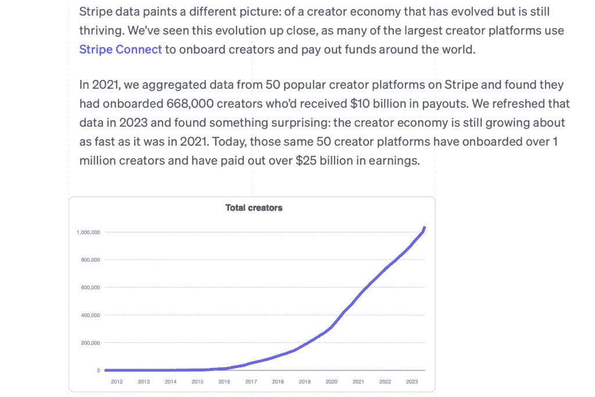
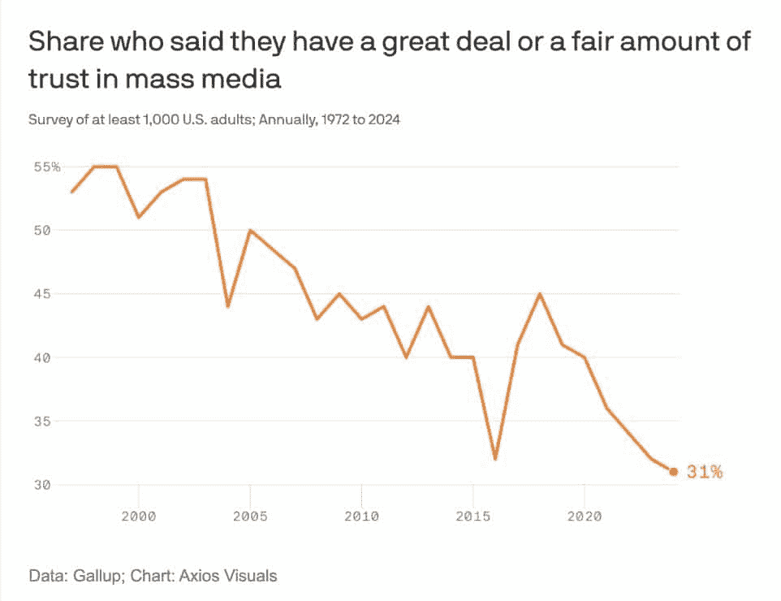
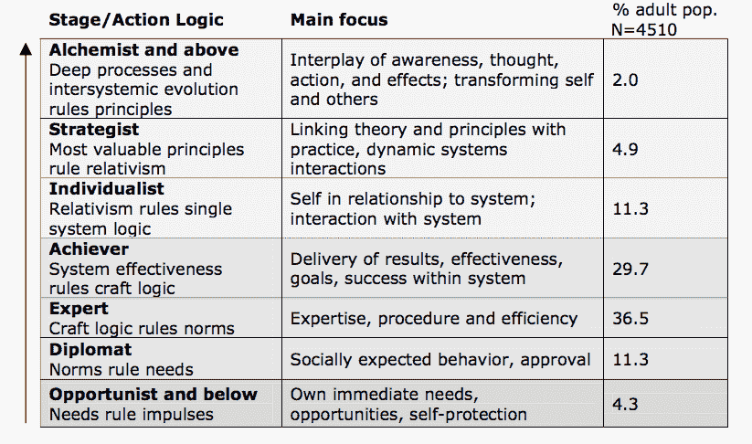

# 《最适合聪明人的单人企业》（2025）

> 原文：[`thedankoe.com/letters/the-best-one-person-business-for-smart-people-2025/`](https://thedankoe.com/letters/the-best-one-person-business-for-smart-people-2025/)

我想让你和我一起想象未来。

在这样一个世界里：

+   创作者是新的教师。

+   在线课程是去中心化的学校。

+   个人追求自己的兴趣，并教授那些具有相似性格的人，从而创造更好的学习体验。

+   教育比顺从的公立学校系统更有效率、更经济、更有结果导向。

+   任何人都可以选择与个人目标相符的课程和创作者。他们不会被锁定在某一特定研究领域，从而培养出狭隘的思想和对社会工作的依赖或工资。

+   越来越多的人拥抱深度通才主义，成为博学家，这是成为独立思考个体的先决条件。

+   学习、教学和赚钱合并成一种理想且有意义的生活方式（得益于技术的进步和信息传播。）

你现在正在体验这个过程。

你现在正在阅读一封可能改变你生活的信（而且在学校里不敢教授，因为这会打破他们的体系，他们从中得不到任何好处。）

在我看来，这是教育、创业和整体工作的未来。

所有迹象都指向这一点。

在这封信中，我想向你展示一条任何人都可以走的道路，以确保他们的未来。

这不是一条每个人都做同样事情的道路。

这是一条人们可以追求自己的兴趣，并深入到使他们独特的那个故事中的道路。在这个机器人工作被自动化左右的世界里，每个人——在合理范围内——都能得到报酬来做自己。

如果你观看视频，我会处理你关于这可能是大多数人可行路径的几乎所有疑虑。

当然，这只是个预测，但数据压倒性，只要有足够的关注和努力去创造那个现实，预测就能成真。

让我们来看看：

首先，从 Stripe 来看，创作者的成长不会很快停止。

（这些图片是从[Hosun 的 X 帖子](https://x.com/hosun_chung/status/1845491689793982641)中关于类似主题的内容中提取的。这是我对此的看法，我们过去讨论过很多次，但这次没有像这次这样精炼。）

在我看来，创作者的成长是进入一个由 AI 和自动化使无意义工作变得可选的世界中唯一合理的选项。

虽然社交媒体可能会改变，但追求你的兴趣和因做自己而获得报酬的愿望仍然存在。而且如果你没有注意到，进化就是解决问题。为了引导进化到这个阶段，已经使用了大量的技术，但我们正站在解决讨厌的工作问题的边缘。当然，原则仍然存在，即这一切都不会自动给你。

这种生活方式是为博学者、自学者和那些渴望获得一系列不可替代技能的人保留的。

让我们更进一步。

SignalFire 的一张图表显示，现在有 5000 万内容创作者。除此之外：

+   自由职业者占劳动力总数的 46.6%（从 2020 年的 36%大幅增加）。

+   创作者经济预计到 2028 年将从 2500 亿美元翻倍至 4800 亿美元。人们认为他们来得太晚了，而实际上它才刚刚开始。

+   经济青睐有利可图的商业模式。技术赋能的企业，如创作者，可以通过数字产品和服务的 95%利润率运营——这导致该领域对新平台和工具的发展更多。

+   大公司要求其公司的领导者活跃在社交媒体上，以维护品牌声誉。减少企业营销，增加人性营销。

企业开始选择承包商和创作者作为员工和营销人员。

简而言之，未来有利于那些停止试图将人们锁定在讨厌的生活中的个人、小型团队和进步公司。现在他们有了技术，人们将全力以赴地反击。

那还有另一件事……

技术已经发展了。

你现在不需要一个由 10 名开发者组成的团队来构建网站。

你有无需编码的拖放工具，可以帮助你快速构建。

你不需要为广告牌或广播电台的时段付费。你只需发布内容，吸引人们关注你的创意工作和业务。

大多数人认为人工智能将取代创意工作者。

如果是这样，也许你应得的替代，并且你并不像你认为的那样有创造力。

人工智能只使聪明人能够作为个人或团队做更多的事情。人们可以在周末构建病毒式应用程序，并以比以往任何时候都快的速度编写内容。这些应用程序和内容的质量取决于一系列广泛的技能，这些技能不能通过在 ChatGPT 中输入来弥补。

这是对通才和博学者的超级能力。

但它还有更深层次的意义。

## 智慧的人不应该上大学

> 学校找不到的知识是就业中找不到的金钱来源。——《专注的艺术》

人们开始失去对那些未能给他们带来承诺的稳定未来的机构和意识形态的信任。

学校使你的思想局限于美好工作和丰厚薪水的虚幻地位。

宗教将你的思维局限在单一的文化视角上，这种视角无法理解现实。

乔布斯将你的思维局限在一系列可替代和重复的任务上，随着技术的进步，这些任务将不再值得你现在所获得的报酬。

对于那些重视自我教育和个人责任的人来说，你们可能正处于一生中最重要的时刻。

对于那些无法独立思考或打开心扉接受新视角的人来说，在达到谷底之前，你可能会在未来几年中遭受痛苦——这迫使你转变视角并成长。

在自我发展理论中，较低的发展阶段是**顺从者**阶段。一个人们无法独立思考的阶段。他们需要被部落接受。因此，他们的思维将宗教和其他意识形态以及制度教条视为法律。“圣经敲击者”不仅仅是对圣经。

看起来，随着新一代人获得更多的集体声音，顺从者阶段——主要由婴儿潮一代占据——正逐渐从大众中消失。更多的人正在占据更高的发展阶段。

这就是社交媒体和互联网隐藏的重要性。

社交媒体为教育、意义和工作的分配奠定了基础。

界限变得模糊。没有任何中心机构能够控制任何一种文化中的任何一个方面。

社交媒体上的个人品牌通过分享他们的兴趣和信仰系统，通过在其品牌下提供产品或服务来赚取收入。

为什么这是历史上的一个如此重要的转折点？

1.  任何人在互联网上都可以自由分享他们的兴趣和信仰。

1.  任何人都可以自由地自我发展，获取新技能，向他人学习，并通过提供自己的产品或服务为人类做出贡献。

1.  教育决定了个人的潜力，如果这种教育被一个不考虑个人目标和发展的学校系统所主导，我们正在进入一个新的黄金时代。

教育塑造未来，因为它塑造了人类行为。你成为你所消费的东西。

教育扩展了你的视野，并允许你在未知领域中发现机会。

教育是编程。你一生都在接受教育。但直到现在，你都没有选择过教育的来源…

换句话说，我们正在进入一个人类经济时代。

一个最终反映自然模式的经济体。

一个目的经济，人们可以选择从那些有共同愿景和目标的人那里学习。

这为什么有效？

因为人们对理解有不同的需求。

你们中的许多人之所以在这里，是因为你们与我所说的和所教的内容产生了共鸣。

有些人讨厌我，但他们从不同的视角获得了类似的信息，这没关系。这只是个性和教育风格的不同。

传统的学生被分配了让他们变得愚蠢和可替代的目标。他们被分配了一位老师。他们被告知要支付巨额费用。要借出无法偿还的贷款。让他们在高利息的困扰下，由于压力而陷入生存模式。他们试图通过找工作来解决这种压力，使他们的生活变得更糟。等到他们意识到这一点时，他们要么忘记了他们本应拥有更多，要么被从那个混乱中摆脱出来的工作量所压倒。

现代学生可以选择自己的目标，找到导师，投资自己的教育，一旦他们实现了这个目标，他们就可以像所有事物一样进化到下一个目标，或者他们可以满足自己更高的需求，成为导师并传授他们所学。

如果你不成为有价值的人，你将如何创造出值得分发的东西？

是的，要加入这个新、高盈利的经济体，你将需要在你的生活中做一些事情。

但是，传统的教育是不够的。

当前的教育体系就是这样，一个体系。

一个塑造你进入劳动力的体系。

它教授了在旧经济中工作所需的服从和技能。

如果你想在新的经济体中赚钱，那么显然你必须从那些在该领域有成果的人那里寻求教育。

来自那些已经*创造*出这些赚钱方式的品牌和创作者的课程、指导和内容。

虽然许多人认为这些是骗局——而且许多确实如此，因为这个领域是新的，还没有完全通过进化自我纠正——但你能做的最糟糕的事情就是避免从那些在你眼前创造未来的人那里学习。

新的工作正在到处创造。

那些婴儿潮一代会告诉你“找一份真正的工作”的地方。

创作者正在开辟一条新的道路，创造价值，组建团队，雇佣高效率的个人。

创作者经济是新的教育体系。成为创作者是新的职业道路。一条全面发展的职业道路，让你能够追求和货币化你认为有意义和重要的任何兴趣。

设定一个目标。

找到你共鸣的创作者。

沉浸在他们提供的信息中。

观察新的机会在你的意识中登记。

就像你的生命依赖于它一样去行动。

## 一人媒体公司 – 你的教育体系

如果你理解进化，你就会明白个人、行业和生命本身在统一和分裂之间波动。

集中和去中心化。

这是一个现实的普遍原则。

就像海洋蒸发成水滴，凝结在云层中，一旦足够重，就会再次降下来滋养植物，提供其他有益的生态功能，然后再次重复。

我们正进入一个时代，其中钟摆从机构转向个人。

熵和财富是两个极端。

随着不确定性和混乱的增加，你拥有更多机会和资源来积累财富。财富是通过价值创造来增加秩序的。就像把木头变成房子（低价值变成高价值）。

所有这些哲学上的胡言乱语都是为了说明我们生活在一个充满不确定性和对机构对我们心智控制的怀疑的时代。但这不是一件坏事。这仅仅意味着我们拥有更多信息、更多想法、更多资源——比如其他价值创造者诞生的无代码工具——以及更多作为个体可以工作的丰富资源。

让我们分解一下这是如何运作的：

### 1) 创业未来

社交媒体是目前注意力的焦点。

社交媒体是一种免费技术，它彻底改变了我们学习和获取知识的方式，以改善我们的生活质量（对于价值导向的人来说……专注于梗和毒性的低发展人群不应是你的重点）。

社交媒体是你加入工作未来的方式。

是的，我相信在足够长的时间尺度上，我们为了创造财富所做的事情将从物理发展到数字。

物理业务拥有在线商店和受众，以扩大其影响力和提供更多价值。

企业正在培养“内部创造者”，为他们的机器人公司带来更多个性。

像阿里·阿布达尔这样的个人——我们的生产力主宰者——辞去了医生的工作。他发布了医学院的视频，市场告诉他人们想要他的生产力建议。因此，对他来说，投身于更有价值的事情——考虑到他们是在葡萄上做手术——并且比 10 个医生加起来赚得还多，这是不言而喻的。

### 2) 成为价值创造者

如果我们观察进化的箭头，让我们假设现实的目的是统一意识。

我们可以通过注意整体性增加的模式来假设这个方向。

从物质到生物到心理学到精神——每个都超越了另一个并包含另一个。

从原子到细胞到分子到生物体。

从字母到句子到段落到章节到书籍。

从材料到基础设施到表面到房屋。

所有智能生命都在通过创造价值向更高层次的统一迈进。或者，通过创造财富来对抗熵带来的混乱和不确定性。

现在，如果我们观察心理发展的各个阶段，我们可以注意到一个相似的方向。

随着一个人的自我发展，他们从以自我为中心到以社会为中心，再到以世界为中心，最后到宇宙为中心。他们扩大了他们的关注圈。他们的欲望从自私的生存转变为无私的贡献。

那么，这个“创造者业务”究竟是为谁而设的？

在我看来，这是那些处于“成就者到策略家”阶段以及更高阶段的人。不到一半的人口。成就者似乎是一般自我提升的人群，专家似乎是一群“上学、找工作、退休”的人。

这是为了那些热爱学习、在特定技能或兴趣上有成果，并且想要通过他们的自然愿望去帮助他人和进化的人。

并不是每个人都不能做这件事。而是它甚至不会在大多数人的视角中作为一个机会。它没有意义。在较低阶段，他们的需求不同——关注生存和自我。他们不关心这些。

成就者阶段是大多数已经接触并理解自我提升和价值实现重要性的大多数人。

创造者商业模式最美丽的地方在于，它在很大程度上不受阶段限制。

它可以用作推动力，从传统过渡到后传统。

就像我之前推文所说的，“*自我发展是通往创业的门户药物，因为你意识到提升他人是提升自己的下一个层次。*”

在更高阶段，为人类做出贡献成为首要任务和愿望。由于金钱和财富是反熵的，创造价值（产品）和传播知识（内容）是满足这种愿望的可行方式。通过实现自我来获得报酬。

最后一点：

人类在能力边缘找到意义和乐趣。当信息流动最大化时。当他们感觉自己有足够的技能去接受更高的挑战时。

因此，如果我们把自己视为现实流动的创造性容器，那么这就是一个创造者企业的本质。

我们学习、创造和教学。

我们解决自己的问题，并通过出售解决方案来增加财富的尾端，并为意识的统一做出贡献。

### 3) 你的公立学校和生态系统

让我们把这个实际化。

我们刚才有点跑题了。

你需要三样东西来建立一个专注于教育和改进，而不是像典型影响者那样关注梗和无聊娱乐的价值创造者企业。

1.  **品牌** – 你自己的延伸。你在网上如何展示你的思想。人们发现并跟随你观点的方式。

1.  **内容** – 你如何分配教育、知识和智慧，以帮助他人在你技能和兴趣的周围。

1.  **产品** – 一个帮助人们解决问题和实现目标的系统。

你的品牌是你邀请人们进入的世界。

你帮助他们采纳的视角。

你帮助他们达到的目标或发展水平。

虽然这在你的个人简介、个人照片和品牌设计中有所体现，但我认为内容扮演着最重要的角色。

你的品牌是你受众心中 3-6 个月内思想的结晶。

现在，我们希望我们的内容与现实相符。

互联和有机。

不是快速而碎片化的销售漏斗，让你感觉像是一个为了最大化利润而无所不为的油腻营销人员。

并不是你不能这样做，或者你不应该在需要通过成长来发展的较低级别上这样做（请不要混淆“较低”与坏，当它们是必要的），但我假设你从事这条工作是因为你想要比你现在所意识到的更深层次的东西。

换句话说，我们正在构建一个内容生态系统。

我们正在为人们开辟一个互联网的小角落，让他们加入、学习和超越到下一个阶段。

我通过以下方式做到这一点：

+   每天撰写社交帖子

+   在所有平台上发布这些帖子

+   选取表现最好的想法

+   将它们扩展为更深入的通讯稿或线程

+   在我的个人博客/网站上发布我的通讯稿

+   将那些通讯稿转化为视频和播客脚本

+   将我的产品链接起来，让人们可以发现

+   将我的视频嵌入相应的博客

+   在所有社交平台上“插入”那个博客

由于我只专注于撰写帖子、通讯稿（以及每周一次坐在摄像机前阅读它们），这不会超过每天 1-2 小时。这是一个非常高效的系统。当然，构建和实验产品需要更多时间，但一旦数字产品建成，你就不需要做太多的维护。

这为人们探索和根据他们的目标获得他们所需的东西创造了一个循环和互联的“学校系统”。

当然，我们在这里的空间有限，所以如果你想了解所有做这件事的系统，我在[数字经济学](https://digitaleconomics.school)——一个终身工作的大师班中教授它们。

### 4) 销售高价值产品

警告：这可能变得很长且复杂，但将提供对销售产品的有意义的视角。

企业家的未来是教育、意义和价值交换的融合。

你已经可以看到它在你周围。

个人正在创建从课程到服装到软件到有助于而不是伤害人类的整体物理产品。

当我说“销售高价值产品”时，我的意思是这个：

销售一种帮助人们达到新阶段发展的产品。新的意识阶段。新的心灵层次。帮助人们打破他们的限制，扩展他们的自我感。

有无限种方法来做这件事，所以我会把那留给你的创造力。

但如果你想知道我的意见，教育产品是最好的起点。

+   它们的创建和分发几乎免费。你可以从简单的电子书开始，随着时间的推移让它发展成为更复杂的课程或群体。

+   物理产品可能会有所帮助，但改变并不一定需要物理产品。教育和意识是任何行为改变绝对必要和先决条件。

+   它们是盈利的且可扩展的。高利润率，没有运营成本，没有运输或供应链。这创造了一种高杠杆的生活方式。你可以按照你想要的方式生活。

+   你首先建立现金流并验证未来的产品想法。你可以在没有投资者的情况下构建你的下一个创业公司，并且已经有一个潜在买家的受众。

对于我来说，从教育开始似乎是最直接、最令人满足、真正有影响力的方法，来对世界产生影响。

不仅如此，经济倾向于有利可图的，在不确定的世界中对教育的市场需求也极高。

“但不会饱和吗？”

实际上并不是这样。

我们讨论了熵作为普遍定律。

随着选项和不确定性的增加，财富创造的潜力也在增加。资源增加。效率增加。进化被迫发生。

当然，未来 10 年内，景观可能会发生剧烈变化，这就是为什么我们要建立受众，发展自己，并把自己置于一个既能发现又能利用这种变化的位置。

但现在，像 Zoom 这样的实时学习工具被更广泛地接受。更多的人在学校之外投资于进一步的教育。在线学习正在以加速的速度被采用。教育的一般市场和机会已经呈指数增长。

在饱和度的议题上，为什么人们会从你这里而不是别人那里购买？市场上不是已经有足够多的信息产品了吗？

如果我们回顾心理发展的各个阶段，我相信直到每个人都达到统一阶段或更高阶段之前，教育是不够的，而这在*很长时间*内不太可能发生。

现在，最有利可图的产品是那些帮助人们达到或超越成就者和多元主义阶段的产品。

在我们关注的背景下，成就者和多元主义阶段最容易通过那些深入自我帮助、职业发展、商业、培养关系、情绪管理和调节以及精神初学者水平的人来识别。

换句话说，我们之前讨论过的永恒市场。健康、财富、关系和幸福。

这就是为什么社交媒体和 YouTube 上充满了这类视频。因为那些是大多数人口（对自我发展感兴趣的人）居住的阶段。

事实上，这些视频和内容*并不是专注于帮助人们进入下一个阶段*。它们专注于该阶段内的水平增长，而不是垂直增长。

你可以针对更高的阶段，但请理解这将更加困难吸引。占据更高阶段的人的比例较小（直到行为改变教育/意识的增加改变这一点。）

你如何创造一个有利可图的产品？

+   **选择一个媒介** – 电子书、付费通讯、课程、小组、辅导等。

+   **选择一个领域** – 你的产品可以包含多个主题，但它的主要焦点应该是健康、财富、关系或幸福。

+   **向你的过去自我销售** – 反思你生活中已经解决的问题。这可能只是一个简单的预算工作表或教授一项技能（财富领域）、健身计划（健康领域），甚至是一个生产力系统。

+   **卖那些已经热销的产品，但要做得更好** – 研究市场上目前热销的产品，并使其成为你自己的。

+   **尝试一个独特的系统** – 测试大量其他人的方法（如培训计划或生产力规划者）

+   **绘制并构建你的产品** – 创建一个解决大问题的提纲，并帮助客户达到他们生活中期望的结果。

+   **通过你自己的视角过滤一切** – 移除与你的目标不一致的信息。包括帮助人们接受你观点的信息。

[精神变现](https://mentalmonetization.com)在这方面能提供更多帮助。

接下来，人们最好是从那些处于他们阶段或高一个或两个阶段的人那里学习，这些人可以俯瞰并创建一个地图。你的地图就是你的产品。

其他人在卖类似的产品，谈论同样的事情，但有些人永远不会找到他们。你跟随某人不是因为他们的教诲，而是因为他们的个性和目标。

我可以在网上搜索网页设计课程，但如果一开始我就没有对网页设计的兴趣呢？如果我是从我所跟随的人那里了解到它的呢？在那个时刻，我唯一要购买的人就是那个特定的人。

当你通过你的产品让他们接触到下一个自我发展层次时，市场饱和度并不重要。

我在这里结束这封信。

它已经有点长了，我们可能需要再写另一封信来专门讨论这些话题。

同时，如果你想读些别的，我认为这封信关于[价值创造](https://thedankoe.com/letters/the-value-equation-how-to-become-a-top-1-individual-fast/)将帮助你理解是什么让产品有利可图。

到下周见，

– 丹
