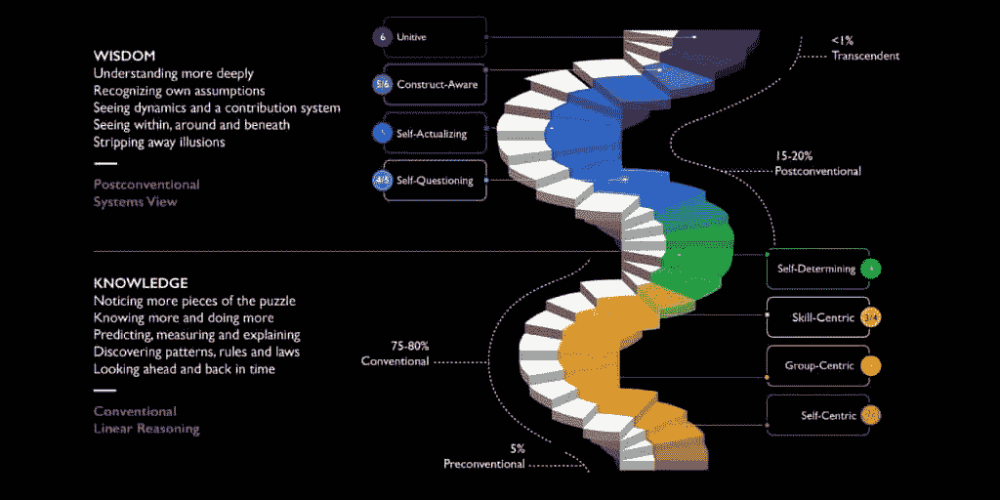
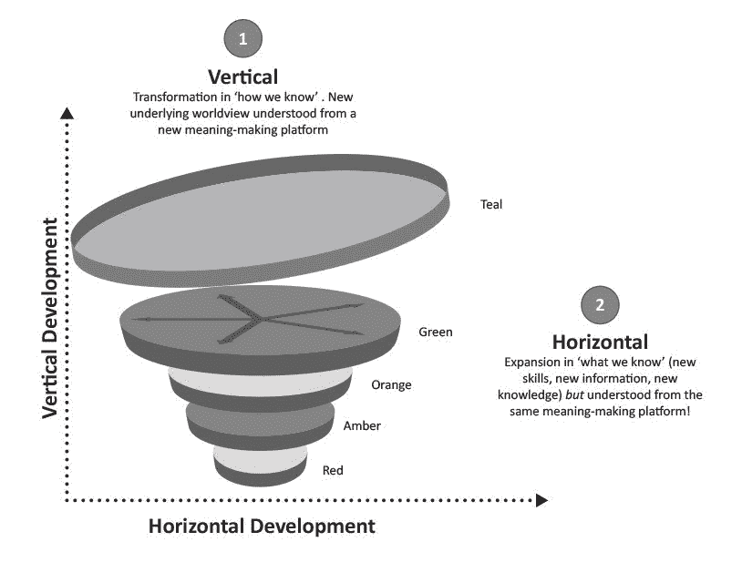
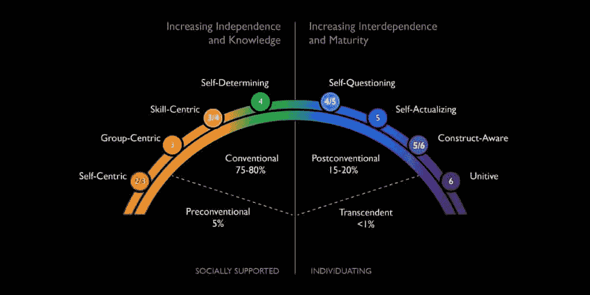

# 如何加入智商前 1%的行列（完整指南）

> 原文：[`thedankoe.com/letters/how-to-join-the-top-1-of-intelligence-full-guide/`](https://thedankoe.com/letters/how-to-join-the-top-1-of-intelligence-full-guide/)
> 
> 智能的唯一真正测试是从生活中获得你想要的东西。 —— 纳瓦尔·拉维坎特

智能有一门科学。

但大多数人理解错了。他们认为智能就是书本知识或认知任务。当然，这些在你的成功中扮演了一定的角色，但故事远不止于此。

在智商测试中得分高的人通常处于“传统”的心理发展阶段。他们很少意识到（因为低级阶段无法理解高级阶段），他们仍然处于真正智能的底部 80%，而不是书本知识。

更重要的是，许多“聪明”的人孤独、贫穷、不健康，并对世界感到愤怒。他们可以思考复杂的问题，但无法解决生活这个更大、更全面的难题。

拥有最高智商的人克里斯·兰根说：“*大多数高智商的人有放大镜，但没有望远镜。*”换句话说，正如我们将要学习的，智商并不是智能的全部。如果你的大脑是一台相机，那么它不仅仅有放大功能。

现在，如果你想拥有乔丹·彼得森的清晰表达或艾伦·瓦茨的思考方式，请给自己时间阅读这封信的结尾，了解他们是如何取得如此成就的。

然后，至少承诺一年时间专注于自己的发展。

每天一小时的有意识学习和反思。

这并不是要求你发展决定你生活中几乎所有成功特质的一种特质。

导航你心理健康的能力。

获得你想要的多多金钱的能力。

理解现实并从中获得你想要的东西的能力。

这就是我们将要学习的。

智能无法在 5 步 1 分钟的视频中总结，所以如果你不是来读长篇大论，请到别处寻找多巴胺的刺激。如果你坚持下去，这封信将彻底改变你的人生方向。

我们从哪里开始？

## 控制论——获得你想要的东西的艺术

> 疯狂的定义是反复做同样的事情，却期望不同的结果 —— 爱因斯坦

控制论来自希腊语单词 *kybernetikos*，意为“引导”或“擅长引导”。

这也被称为“获得你想要的东西的艺术”。

因此，如果纳瓦尔的智能定义是从生活中获得你想要的东西，那么理解控制论可以帮助你更快地做到这一点。

控制论阐述了智能系统的特性（提示：你的大脑是一个系统，一个元系统）。

有一个目标。

朝着那个目标行动。

感知你的位置。

将其与目标进行比较。

然后根据反馈再次行动。

**你可以根据系统在试错中迭代和坚持的能力来判断智慧**。

一艘偏离航线的船朝着目的地纠正方向。恒温器感知到温度变化并打开。胰腺在血糖升高后分泌胰岛素。

这与从生活中得到你想要的东西有什么关系？

一切。

从元视角进行行动、感知、比较和理解系统是高智慧的基本要素。

高智慧是迭代、坚持并理解大局的能力。**低智慧的特征是无法从错误中学习**。

低智慧的人会卡在问题上而不是解决问题。他们会遇到障碍并放弃。就像一个作家未能建立读者群并放弃，因为他们缺乏尝试新事物、实验和找出对他们有效的方法（认为你不能创造一个有效的过程是经得起验证的错误的，无论你的限制性信念如何，因此是低智慧。）

高智慧在于意识到任何问题都可以在足够长的时间尺度上得到解决。现实是，你可以实现你心中设定的任何目标。这不是一个可以用理性来反驳的事情。

智慧在于意识到你可以做出一系列的选择，这些选择能帮助你实现你想要的目标。你明白思想是有层次的，你不能一蹴而就地从纸莎草纸跳到谷歌文档。即使那个目标现在不可能实现，你也没有资源——这些资源可能在未来几年内被发明出来——来实现那个目标。

如果你想变得更聪明，就从你追求的目标开始。

目标决定了系统。

目标决定了旅程。

目标和目的地远远比系统或旅程更重要，因为它们创造了它。

当然，你可以争论说，“旋律的结束并不是它的目标”，正如尼采所说，但艺术家的目标是创造旋律。你做的任何事情，从阅读这封信到移动你的眼睛一厘米，到向前迈出一步，到挠鼻子，到建立一个价值十亿美元的企业，都是追求目标、在其路径上创造旋律的行为。

**目的地是一种让你能够欣赏旅程的观点**。

为什么人们总是说，“重要的是过程”*同时*庆祝他们已经达到了目标？

因为你很少享受这个过程，这是完全可以接受的。你不需要享受每一件事。你需要一点痛苦来欣赏和平的时光。如果你总是“快乐”，那就会变得对你来说很正常。快乐就会失去意义。所有真正的幸福都源自于之前的悲伤。

换句话说，旅程和目的地是不可分割的。

当我谈到“目标”时，我并不是从典型的自我帮助的角度出发，尽管在某种程度上这是一个有用的视角。

我是从**目的论**或希腊的**宇宙观**的角度来谈论的——即一切都有其**目的**。一切都是更大整体的一部分。在这个意义上，目标并不是反精神主义的，它们**就是**精神主义。有限游戏与包含有限游戏的无限游戏。

当你玩语义游戏并扩大诸如能量和金钱之类的定义时，可以发现的现实的目的性属性。想想这些定义的扩大，以及当它们像社会中许多情况那样被垄断或缩小时，它们可能变得多么危险。不是为了地位的目标，而是你周围可以观察到的意义。

> 人类天生就是追求目标的存在。因为人类“就是这样被建造的”，除非他们像被创造出来那样作为目标追求者运作，否则他们不会感到快乐。因此，真正的成功和真正的幸福不仅是一起发生的，而且相互增强。——麦克斯韦·马尔茨

在人们无法停止从新学校中重复编程“系统优于目标！”的世界里，目标比我们想象的要重要得多。

目标决定了你如何看待世界。

目标决定了你如何看待“成功”或“失败”。

你可以尝试“享受旅程”，但如果追求错误的目标，你会使享受它变得 100 倍困难。

你的大脑是现实的操作系统。

那个系统由目标组成。

对于大多数人来说，这些目标是被分配给他们的。就像你心理中的代码行一样被编程。

**上学。找工作。感到受冒犯。扮演受害者。65 岁退休**。

一个已知但无效的路径。

要变得更聪明，你必须：

+   拒绝已知路径

+   深入未知

+   设定新的、更高的目标来拓展你的思维

+   拥抱混乱，允许成长

+   研究自然的普遍原则

+   成为一名深度通才

我们将学会做所有这些。

超专业化使你服从于主导范式。

人类与机器人（尤其是 AI）之间的区别在于，人类创造了范式。他们讲述故事。他们设定项目框架。机器人只能朝着分配给它的目标或故事去运作。

我们将在未来的信中讨论人工智能将如何改变你的生活。

## 你的大脑如何解释现实

> 内在体验的最佳状态是在意识中有秩序。这发生在心理能量——或者说注意力——投入到现实目标中，以及技能与行动机会相匹配时。追求目标将秩序带入意识，因为一个人必须集中注意力在手头的任务上，暂时忘记其他一切。——米哈伊·契克森米哈伊

大脑有两个关键目的以生存：

1.  实现已知的目标

1.  发现未知的目标

大脑是一个信息处理和模式识别机器，我们根据我们的发展水平在一定程度上可以控制它。

大脑是一个系统——包含一系列复杂的系统——它接受、拒绝并使用信息来帮助你实现你输入的目标。

如果你总是专注于负面结果，它们就会成为现实，你将责怪所有人，而不是自己，为生活中的不幸负责。

> 那个认为自己是一个“失败型的人”的人，尽管他有着良好的意图，但总会找到某种方式去失败，即使机会摆在他的面前。那个认为自己是不公正的受害者，一个“注定要受苦”的人，总会找到一些情况来证实他的观点。 —— 马克斯韦尔·沃尔茨

换句话说，如果你认为自己可以，你就行；如果你认为自己不行，你就不行。

在你思维的深处，就像一个木偶师，是你的身份或自我。

你的自我是一个由想法、信念、价值观和标准组成的系统，这些标准塑造了你的视角。与流行观念相反，自我不是敌人。它是讲故事的人。是解释者。你的工作不是摆脱它，而是发展它。扩展它。移除那些让你陷入狭隘视角、使生活变得反应性和消极的条件限制。

你的视角就像相机的镜头。

你可以放大或缩小。

你可以专注于场景的一部分——而背景则被模糊——或者专注于整个场景的细节。

你的视角影响你对情况的认知。

意味着，你的身份将限制它可以感知的信息，如果它接收到的信息与它的信念、价值观或标准不匹配，它将拒绝它。

你的思维会自动接受和拒绝那些有助于实现你头脑中编程的目标的信息。

如果你想要找到一份工作，多巴胺会信号那些帮助你找到这份工作的信息和机会的重要性。

你的书中的重点将反映那个目标。你如何处理对话（与任何人）将反映那个目标。你在社交媒体上参与的内容将反映那个目标（算法将通过展示更多相关信息来加深那个身份的根源，无论好坏）。

如果你想要辞职，多巴胺会做同样的事情。就像猎人注意到灌木丛上新出现的浆果一样，多巴胺信号那些对你心中首要目标生存重要性的信息，因此你更有可能记住并利用这些信息。

你的谷歌搜索将从“2024 年最佳职业”变为“2024 年最佳创业项目”。

或者，你可能会更倾向于查看[数字经济学](https://digitaleconomics.school/)，我在那里帮助你分解你的身份，并将其转变为有利可图的单一企业。

你的书中的重点，即使在像小说这样的东西中，也会与有不同目标的人截然不同。

无论你是否意识到，我们都在强化我们可能平庸的身份，这个身份决定了我们生活的结果。对于大多数人来说，这将是消极的。

### 你的思维是一个控制论系统

**社会是一个行为系统**。

而且在你学会理解你所说的语言的时候，他们就在你的脑海中注入了 3 个大的目标。

1) 学校

2) 工作

3) 退休

99%的人只是以导致那些目标的方式解读日常情况。他们为了地位和生存而学习被告知要学习的东西，因此关闭了他们生活中真正重要的事情的大门。他们变成了一个专家奴隶，依赖于那些需要那种特定知识的人。他们没有深层次和通用的技能集，这使他们能够追求自己的道路。一个只学习写作的作家没有机会获得独立收入。

99%的人正在练习技能，集中他们的注意力，编程他们的思想去过一种平庸的生活，甚至不知道这一点，因为他们没有质疑和反抗。

**人们常常太晚才意识到的事实：**

成功不是计划出来的，它是自动的。

成功的人——无论他们是否意识到这一点——都有一个被编程去实现导致他们成功的目标的大脑。他们通过目标的角度看待生活，这使他们能够在潜意识中存储*正确*的信息，影响他们的选择，这些选择累积起来实现了那个目标。

你的身份、观点和对情况的感知都是一系列系统，按照这个顺序相互输入和加强。

**80%的生活是你想要的，归结于创造你自己的目标，而大多数人却成了社会目标的盲目奴隶。**

目标改变了你对情况的解读方式，这影响了你的行为，这塑造了你的身份，这些在多年后累积成丰富的生活。

除非它影响了一个目标，否则你无法意识到一个问题。

除非你意识到它，否则你无法解决问题。

大多数人没有目标。大多数人害怕犯错。大多数人不给自己一个机会去改善生活的任何方面。

如果你不对一个目标投入精力，你就不会感受到达不到那个目标的痛苦。

偶尔饮酒，只要不超过酒精水平，并不是问题，直到它影响了实现我夏天减肥和写书的目标的努力。

我从未把它看作是一个问题，直到我有了那些目标。在经过一个晚上甚至适度的饮酒后，我的晨跑受到了影响。我脱水且缺乏动力。我的写作因为大脑模糊而受到影响。每天没有朝着目标取得进步都变得越来越痛苦，直到我终于做出了停止那个“坏”习惯的选择。而到了那个时刻，戒掉那个习惯变得毫无阻力。

重点是，除非你有相应的目标，否则问题就不是问题。如果你没有值得追求的目标，你就无法*看到*那些一旦解决就能带来更好生活的众多问题。

大多数人对于他们从那个目标中想要得到什么没有清晰的愿景，因此他们行为的负面影响被忽视。

你的坏习惯似乎不值得放弃，因为你没有责任（或者没有优先考虑那些责任）值得你 100%的能力。

如果那些责任的重要性超过了你坏习惯的乐趣，你会毫不犹豫地停止。

目标与身份交织在一起。

人类在概念层面上生存。

当我们感到我们身份的威胁时，我们会感到威胁。

一个健身者在训练和饮食控制较少的环境中会感到压力和痛苦。

一套常规是一系列实际目标，它们有序地组织了心智。一个搬到新地方或长时间旅行的作家，在他们的大脑适应新系统之前，将会有一个压力很大的适应期。如果他们不能在正常的常规中很好地写作，他们会感到威胁，因为“他们是谁”可能会死去。

如果你通过新的刺激（持续自我教育）来训练自己，以至于拥有一个不能“生存”而不实现新目标的身份 – 你将不可避免地轻松地实现任何目标。如果你想有一个成功的商业、关系或任何超出常规的事情，你必须通过改变自己来从根本上改变你心智运作的目标。

要改变自己，你必须通过教育、实践和体验新信息来重新编程你心中由社会安装的错误接线。

## 心理发展阶段 – 达到 1%

就像阿尔伯特·爱因斯坦据说说过但并没有说过的那样：

> 你不能从创造问题的同一意识层次解决问题。

如果你想要变得更聪明，你需要扩大你的思维以看到更大的图景。讲述一个更全面的故事。从所有角度看待情况。不要通过迎合一个观点 – 一个宗教、一个商业模式、一个研究领域 – 来切断你的思考，因为这是由于它的单维性而无法验证的真相。

当你有一个更高的目标时，你可以更明智地朝着这个目标思考。

但是，你不能瞬间提升到更高的心智层次。

事实上，达到最高阶段需要一生的时间（谁知道当技术允许我们活到 500 岁时，人类的发展将走多远。不要死。）

我们将根据我们对智能的定义来剖析自我发展理论。为了这封信的目的，更高阶段等同于更高智能。

这个理论的细微之处还有很多。我鼓励你阅读 Susanne Cook-Greuter 的完整[研究论文](http://onesystemonevoice.com/resources/Cook-Greuter+9+levels+paper+new+1.1$2714+97p$5B1$5D.pdf)。我也鼓励你进一步探索螺旋动力学和肯·威尔伯的 AQAL 模型等概念，以完善你对这一领域的理解。

我们将在这封信中提取与我们的用例相关的相关信息。

在 EDT 中，有 3 个运动方向：

1.  **水平** – 在同一阶段进行横向扩展。发展新的技能，增加信息和知识。

1.  **垂直向上** – 变革。成长到新的阶段和视角。

1.  **垂直向下** – 由于生活情况、环境、压力和疾病导致的暂时或永久性退步。

水平发展是填满一个人的杯子。

垂直发展是扩大杯子的容量。

有趣的事实：仅仅压力本身就可以让你退回到较低的发展阶段。这就是为什么我们在压力下往往更加狭隘和反应过度，但如果你达到更高的发展基线阶段，压力就不会让你跌落得太远。更低点。

上面的图形来自 [Sloww](https://www.sloww.co/horizontal-vertical-development/)，展示了螺旋动力学阶段颜色（人类发展的另一个模型）。值得注意的是，发展是以螺旋形状进行的。你经常发现自己感觉像是在回到类似的生活阶段，但有了新的视角。它还代表了个体化和整合的循环。

我们的目标是达到新的垂直发展阶段，而不是陷入水平发展的竞争。

发展新的技能和获得新的知识是很好的。这在许多方面都是必要的，但它们并不是让你达到新的心灵层次、智力以及得到你想要的东西（因为“你想要的东西”也在进化）的原因。

达到新的发展阶段需要你观点的进化。你需要：

+   时间、理解和那个阶段中的水平发展。新的技能、挑战和目标。

+   对不同于你自己的观点保持意识和开放心态去探索。

+   通过教育和有意识的培养，实现你自己的根本改变，致力于更深入的理解和寻求真理。

+   控制论式的试错。设定一个位于新阶段发展目标，以该目标的方式解决问题，当你意识到你没有解决正确的问题时进行自我纠正。

疼痛有时是达到新视角的必要催化剂。就像当你对现状感到极度厌恶时，你最终突破到新的层次。一个新的视角出现，你也在进化。

理解下面的阶段可以极大地改变你的人生方向。

一旦你意识到它们，你就可以努力通过它们前进。

### 前传统阶段 – 5% 的人口

你们大多数人并不处于这些阶段，所以我们将简要介绍。

前传统阶段——*共生、冲动和机会主义*——以自我中心为特征。

大多数人在从出生到大约 10 岁左右的年龄期间，通过这些阶段发展。

自我与他人的界限模糊。需求集中在生存、个人欲望和即时满足上。在这些阶段的后期，我们开始理解我们需要遵守和遵循的社会规则。

### 传统阶段 – 75-80% 的人口

我们可以将传统阶段想象成猴子为了地位和成为食物链顶端而模仿其他猴子的尝试。

大多数高智商的人都会到达这个阶段。

注意，这些阶段没有哪一个比另一个“更糟”。它们只是“更低”。每个人都必须经历每一个阶段。问题是陷入任何一个阶段，这在社会中很容易做到，也很容易注意到。

当你和一个处于传统阶段的人交谈时，你通常是在和一个电视或 YouTube 频道交谈，而不是一个独特的个体。这在当前的政坛上相当普遍。

**阶段 3) 顺从者**

他们的身份由他们与群体的关系定义。

高中生专注于受欢迎。遵守规则的职场员工，比如参加所有强制性的会议。军事或宗教的忠诚。

换句话说，顺从者服从权威并遵守群体。这在“圣经敲击者”中最为明显，这些人从未质疑他们从小接受宗教意识形态。(**记住**：如果你出生在世界的另一边，你不会成为基督徒、天主教徒、穆斯林等。这是无可争辩的。)

**阶段 3/4) 专家**

专家阶段的特点是自我授权（个人成长）、解决复杂问题、自我反思和复杂问题解决。

专业人士生活在这一阶段。工程类型。以技能为中心。认为一切都可以通过现代科学解释的科学唯物主义者。

他们擅长完成任务，但不好判断他们是否在做正确的事情。他们看不到他们所做的事情是否对人类重要。

他们是“无所不知的人”。他们知道一切，认为一切都应该按照他们的方式来做。

**阶段 4) 成就者**

大多数西方教育和学校都是为了培养成就者。

这是一个人在思想上可以达到的最高阶段。这是西方成功的定义。

从员工心态转变为创业心态。从个人技能到如何在社会中利用这种技能的转变。

在我们的空间里，这是社交媒体上大多数人的主导特征。这是自助和商业阶段。哈姆扎、霍莫齐和其他自我提升、商业或男性气质创作者是偶尔窥视后传统阶段的成就者的例子。比如当他们阅读《卓越男性的道路》，但通过一个成就者的视角来解读它。

这就是为什么我经常使用 YouTube 标题来吸引那些处于成就者阶段的人。比如当谈论如何赚很多钱时。他们是我的目标受众。我想向他们介绍发展的下一阶段，并帮助他们逐渐进入灵性和其他更深入的话题。而且，很高兴的是，他们中有很多人都在网上。

### 后传统阶段——占人口的 15-20%

每个阶段都有不同的目标和世界观。

意味着，他们对成功的看法在演变，*所以他们心中运行的系统也在随之演变*。如果我们认为一个有效的系统是“有序”的，我们就能理解为什么混乱、不适和痛苦是发展的一部分。

正如提到的，传统阶段就像猴子模仿其他猴子（当然，更发达一些）。但这不是智力。

智力是你解决问题的能力，因为你不能从创造了问题的同一思维中解决问题。你必须扩展。所以，如果你陷入一份你讨厌的工作或其他事情中，并且没有通过扩展你的视角来解决问题，那么你就不聪明。

智力是质疑你的信念，意识到深层次的普遍模式，并理解真理的矛盾——唯一的绝对真理就是没有绝对真理。

后传统阶段是我们开始遇到系统思维的地方。整体大于部分之和。现实更像是一个有机体，而不是可以被解剖和研究的机器。

从第一层（传统）到第二层（后传统）思维之间的重大步骤就是如此。它是多视角的。它不仅仅关乎你的商业模式、自我帮助意识形态或宗教。你开始注意到组成它们的*属性*。比如基督教和佛教指向同一现实身份（上帝），即使他们对此有分歧，因为低级阶段不理解高级阶段，而高级阶段理解低级阶段。当然，非意识形态的佛教徒是另一个故事，但大多数嬉皮士盲目地接受这些信念而不理解。

在这些阶段，你开始收集更多的观点。你站在山上的位置越高，你就能看到通往你所在之处的多条路径。你越渴望帮助人们选择更好的道路。

**阶段 4/5) 多元主义者**

发现了第四个人视角。

多元主义者开始走出他们成长中的系统——现状——并质疑他们的信念和价值观。

最普遍的例子可能是一个有让所有人成为嬉皮士愿景的嬉皮士。但他们还看不到其他人已经经历的发展，所以这个愿景就变得空洞了。

想象一下，这是从圣经敲击者到无神论者再到首先发现灵性的嬉皮士的演变，但他们还没有回到或整合圣经敲击者的真理。

现在，想象一下在多个领域，比如在工作领域，人们从企业员工到企业家再到饥饿的艺术家，但他们还没有意识到他们可以做自己喜欢的事情，从中获得体面的收入，同时为人类做出贡献——这就是我通过在[数字经济学](https://digitaleconomics.school)中连接传统和后传统来尝试教授的内容。

（这些并不完全准确，但作为例子效果很好。）

**第五阶段）策略家**

我与策略家阶段有很多共鸣。

这占据了我过去几年生活中的大部分时间（据我所知，我可能是在幻想并且发展不足。我对此持开放态度）。

策略家意识到直觉比逻辑和理性（在传统阶段中找到的）更强大。认为某件事已经被正式证明是愚蠢的，几乎是不可能的。

探索和发现开始比实现目标或赚很多钱更重要——这往往会导致实现更多目标并赚更多钱。

策略家对世界在进化过程中需要前进的方向有一个愿景，并理解现实的普遍原则。

策略家是价值创造者。他们主要关注自我发展、他人发展、自我实现、整合和拥有自己的阴影。真理可以近似，但更高更好（更高的视角）。

**第五/六阶段）构造意识**

在我看来，乔丹·彼得森主要介于构造意识和策略家阶段之间。在宗教和他在基督教上的加倍投入方面，他仍然有传统的阴影，除非他正在利用这一点作为帮助更多人从这些阶段发展的行为，这可能是真的。

如果心灵是一台电脑，构造意识的人会理解：

+   传统阶段的人通常在电脑上玩一个应用程序或视频游戏。他们只在一个网站或浏览器上。

+   后传统阶段可以开始导航整个桌面。他们可以玩最有意义的游戏，甚至可以创建自己的游戏。

构造意识进入第五维度的思考，即认知维度。他们可以看到心灵如何构建现实和意义。他们可以看到大多数人都在一个观点中找到安慰，但他们无法超出这些观点本身到一个更大的整体。

这就是现实的普遍原则真正开始点击和连接的地方。统一与分裂，创造与毁灭，熵与财富。他们开始从新的、抽象的层面思考世界，这可能会给他们带来痛苦，因为他们不断地在与“那又如何？这种所谓的心理自慰对我有什么帮助？”这个问题作斗争。

答案是更全面的决策。

### 智力前 1% – 超越阶段

最后，智力前 1%。

统一阶段。

当神秘主义者开始听起来比他们更有幻想而不是有洞察力时。

而像艾伦·瓦茨和特伦斯·麦肯纳这样的洞察力丰富的人，他们有一种用简单而深刻的句子描述现实的方式来减轻你的担忧。

他们接触到了源头。无限的智慧。

> 现实现在通常被体验为未分化的现象学连续体或统一意识的创造性基础。每一个物体、每一个词、每一个思想、每一种感觉，每一种理论都被理解为人造结构：分离出来，在无界限的地方创造界限。对意义和联系的追求是人类条件的一个基本方面。给经验命名和做出区分对于人类成长、学习、互动和沟通是必要的，但在源头处没有可以区分的东西。 – 苏珊娜·库克-格吕特

要达到这个发展阶段，你不能强迫它。你必须经历所有其他阶段，这可能从你开始走出顺从思维之旅起需要十年或三十年。

反叛你被教导视为绝对真理的信念，是你诞生的那一天。

但是，了解这个阶段的主要特征有助于你注意到它们并为之努力。有了这种意识，你可以识别决策中的错误并努力纠正它们。

单一性阶段的特征：

+   真理在宇宙中是即将到来的，但无法通过逻辑或理性来把握。

+   他们将普遍或宇宙视角作为组织原则和从中获得意义的稳定场所。

+   大多数关于开悟的定义都实现了。他们以一种完全新、根本开放的方式代谢经验。

+   他们理解个人自我生存的需要，同时也认识到对永久性的渴望是一种错觉。*当需要时，自我可以作为视角或透镜来使用。*

+   二元性和冲突在没有紧张或改变它们的欲望的情况下被见证。

+   他们生活在创造性的基础上，并投身于不断的人类进程中，实现他们进化的命运。

+   生活被视为一种暂时且有时是自愿的与“创造性基础”分离的形式（菩萨），这是他们立足的基础。

+   他们并不像传统嬉皮士所认为的那样被动。相反，非个人立场在需要时允许更清醒、更强大和更直接的行动。

换句话说，嬉皮士和单一性之间存在明显的区别。

嬉皮士试图与世界分离并否认自我。

单一性主要存在于一个独立的状态中，但理解进入相对世界对于大多数工作、社交互动和进化是必要的。

总结来说，智慧不在于书本知识或放大。

它关乎整体模式识别和视野。你的能力可以扩展到如此之远，以至于所有的界限和限制都消融了。

通过有意识的成长和意识到自己何时关闭了成长的大门，陷入任何阶段，你可以达到单一性阶段。

事实上，我的书《[专注的艺术](https://theartoffocusbook.com)》试图涵盖达到这些更高发展阶段的大部分路径。或者至少那是我的尝试。

感谢阅读。

我希望这个主题像我所发现的那样深刻和具有变革性。
