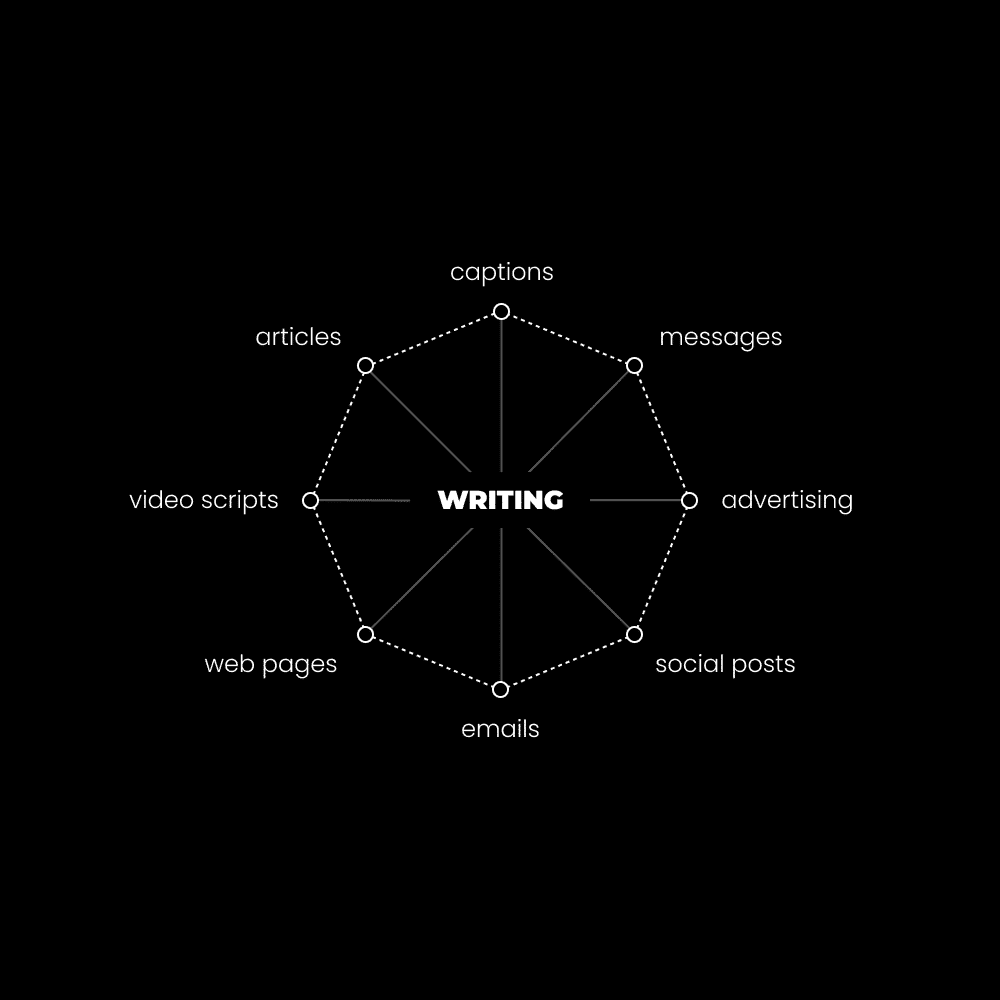

# 学习这项技能，如果你想在未来 10 年里蓬勃发展

> 原文：[`thedankoe.com/letters/learn-this-skill-if-you-want-to-survive-the-next-10-years/`](https://thedankoe.com/letters/learn-this-skill-if-you-want-to-survive-the-next-10-years/)

从我能记事起，我就有一个目标，那就是把热爱的事情变成职业。难道这不是每个人都想要的吗？

我的家人、老师，甚至我在线上关注的人都在大声呼喊，让我走其他道路。

所以这就是我做的事情。

+   上过大学（但 5 年后没有毕业）

+   顺便学习了创意技能

+   开始了所有可以想象到的在线业务

+   学习编程，因为它是“有利可图的”

+   因为我认为大学在浪费时间，所以我退学了

+   在一家设计公司找到了一份年薪 55K 的初级网页开发员工作

在整个旅程中，我“做我所爱”的梦想一直在我脑海中。我不断地被提醒这一点。从 16 岁到 25 岁，我没有一刻不在从事一个有意义的副项目。

我至今仍保持着这个习惯。如果不是商业项目，那就是一个健康项目。

这就是我摆脱困境的方法，因为唯一让我陷入困境的原因是心理熵，即思想倾向于混乱。这意味着我没有目标、项目或优先事项来集中我的注意力。

我目前的项目是 Kortex（第二大脑软件）、Kortex University（一个为创作者的学校）、推广我的书、计划另一本书（在 Kortex 中写作），并在我减重迎接温暖的季节之前再增重几磅。

我为什么要告诉你这些？

因为我发现大多数人并不知道自己谈论的是什么。

我曾从那些没有实现我想要实现的目标的人那里获取职业和生活的建议。在他们封闭的头脑中，我想创造的现实中是不可能的，但我还是不断回到那些为了保持理智而热爱的工作的项目上。

大多数人没有能够创造他们想要的未来的个人项目。

大多数人没有个人项目来创造他们想要的未来。

唯一的另一种选择是按照你的编程生活，追求社会为你设定的目标，并从事那些能实现这些目标的项目。如果你不花 1 小时去建造你的梦想，你将花上 8 小时去建造别人的，而且是一辈子。

10 年前，我的心态是：“如果我能将任何这些激情项目货币化，我就会成功。我需要做的就是学习和建造，直到其中一个成功。我需要通过技能获取和经验来增加我的运气容量。可能需要 10 年，但有些人上学要 12 年。即使我失败了，我也会处于相似的位置。”

经过多年对人们告诉你要学习的每一个“可销售技能”的尝试和错误，我发现了一个秘密。

好吧，这其实不是什么秘密，但我应该让你好奇，想知道更多。

在我们开始之前：

这篇文章会很长。请确保你有足够的带宽和时间来阅读它。我保证它值得。

如果你想了解写作的方方面面（这不可能在一篇文章中涵盖），请查看[2-Hour Writer.](https://2hourwriter.com)

## 为什么是写作？

媒体的未来是去中心化的。

人们现在和将来都会转向：

+   新闻媒体社交媒体

+   教育课程

+   知识创作者

我不想听到关于人工智能颠覆写作的消息。

我认为我们在线消费的唯一东西是由没有灵魂的机器人创造的，这是不可能的。

人工智能的出现似乎有利于人类创造力，而媒体是前端创造力的载体。

人工智能是作家提高生产力的工具。

写作是赋予你所学任何其他技能生命力的技能。

这是人们直到被迫学习（因为他们需要生存）之前都会避免学习的元技能。

他们没有看到它的重要性，因为它只是“普通的写作，谁需要学习这个？”

我在尝试的几乎所有商业模式上都失败了，这是有原因的。

数字艺术、SEO、Facebook 广告、dropshipping、电子商务商店等等。

我之所以如此专注于学习这项技能和建立网站，以至于我忘记了实际上我必须在某个时候获得客户。

你是如何获得客户的？

写作。

内容（或媒体）是互联网的前端。它是你如何在一片自我贬低的自媒体和毫无价值的内容中捕捉、保持和转换注意力的方式。

内容的基础是写作。

+   **推文？** 写作。

+   **讨论串？** 写作。

+   **通讯？** 写作。

+   **博客文章？** 写作。

+   **冷邮件？** 写作。

+   **社交媒体标题？** 写作。

+   **着陆页？** 写作。

+   **产品描述？** 写作。

+   **课程模块？** 写作。

+   **客户沟通？** 写作。

+   **客户资源？** 写作。

+   **任何形式的广告？** 从写作开始。

+   **YouTube 视频？** 最好的方式是使用书面脚本。

+   **Instagram 短视频和 TikToks？** 就像阅读写得好的推文一样。

+   **Instagram 图片？** 通常是从一句写得好的引言或格言中设计的。

+   **任何其他形式的在线营销、广告或娱乐？** 从写作开始。

*你受众、客户和网络看到的每一件事都始于写作。*

不要低估这种力量。

每个从事商业的人本质上都是一名作家，他们只是没有这样称呼自己。

我之所以能在 Instagram 上在参与度和粉丝增长方面超越所有拥有六块腹肌的家伙，是有原因的。

高影响力数字写作。

不是技术或学术写作。

我不是来教你如何写研究论文的。我是来教你如何以让你过上想要的生活的方式写作。

如果你想要成为内容大师（并利用无代码工具分发你的写作和吸引受众），很明显，写作需要成为你个人业务的基石。

### 6 步骤开启个人写作业务

> 内容是个人和集体思维的延伸。我们提出我们的想法、信仰和观点，形成了数字社会、文化和世界。互联网上的内容是集体意识中的内容。
> 
> 专注的艺术

我称自己为作家，因为这是我每天做的事情（即使在社会媒体上看起来不是这样）。

我通过撰写推文、通讯和帖子（这些帖子被重新用于 Instagram 帖子、YouTube 视频、LinkedIn 帖子等）来维持每月 10 万至 25 万美元的收入（偶尔跳到 50 万至 70 万美元）。这仅针对我的个人品牌，而不是我的其他公司。

反思，并参考这封信的顶部，写作是我不得不每年支付比以前网页设计工资高 20 倍的税收的倍增器。这是一个坚实的问题。

但是，如果你只把事情简化为 X 和通讯，我仍然会保持大部分收入。

不要陷入必须要在所有平台上拥有疯狂的粉丝数量来替代你当前收入的陷阱。[遵循这个收入来源的进展](https://thedankoe.com/letters/the-7-digital-career-paths-from-zero-experience-to-advanced/)，如果你不知道从哪里开始（上周的信件）。

入门，以下是你开始写作业务的 6 个步骤。

**1) 选择一个你无法停止谈论的主题**

不要过早地思考这个问题。选择一个主题并练习写作。

它可以是生产力、创造力、灵性、健身或任何你可以与之交谈的兴趣。

如果你已经开始写作，请使用你[你的主题树](https://thedankoe.com/letters/dont-get-replaced-by-ai-how-to-write-authentic-content/)中的一个主题。

**2) 策划你独特的观点**

忘掉你关于“价值”的一切知识。

可行的建议和陈词滥调在互联网刚刚兴起时并不像现在这样好卖。

新颖性吸引注意力。如果你想让人们阅读你写的东西，注意力是必不可少的。

新颖的观点是捕捉注意力的最佳（且可复制的方式），而不使用卑鄙的策略。

你如何想出一个新颖的观点？

思维导图：

+   与该主题相关的问题

+   克服这些问题的好处

+   与该主题相关的常见目标

+   实现这些目标的道路障碍

+   你所经历的个人经历

现在，将所有东西拼凑在一起，*就像你和一个朋友交谈一样解释它。*

不要试图模仿某人的观点或措辞方式。用自己的声音说出来，并让它*随着时间、努力和练习而完善。*

**3) 每周就主题写 500-1000 字**

你需要深度和增长的平衡。

意味着你需要长篇和短篇内容。

我非常重视以通讯作为你的长篇内容——但可以等到开始时再进行。

专注于一个平台，比如 X。

每周写一篇长篇帖子。

每天写 2-3 篇帖子。

然后最专注于第 5 步以实现增长。

我很快就会分解如何写这些内容。

**4) 为日常帖子分解和简化想法**

长形式写作给你提供了多个可以借鉴的想法。

不要尝试复制粘贴你的通讯或线程中的帖子——*将它们重写为独立的短帖子。*

我们将在整封信中讨论这一点。

**5) 学习如何让你的写作被分享（至关重要）**

如果没有人看到你的写作，你的写作就没有意义。

这是一个巨大的新手陷阱。

他们认为他们可以整天写作，并希望我们的救世主算法会让他们一夜成名。

不。写作只是方程式的 20%。流量是 80%。

你可以通过回复、网络和分享在你的个人资料和写作中获得流量。

我在[如何在社交媒体上真正增长的信件](https://thedankoe.com/letters/how-to-actually-grow-on-social-media-what-they-dont-tell-you/)中详细介绍了所有可能的方法。

**6) 利用你的经验进行货币化**

现在你有了写作、不断增长的受众和流量——剩下要做的就是创建一个产品或服务来货币化。

我们在上周的来信中讨论了所有可能的选择。

## 高影响力写作的一切你都需要知道

> 写作是表达思想和沟通的载体。它是将你的信息展示给那些可以接受你所呈现的视角并在其中运作的中介。
> 
> 专注的艺术

有很多写作框架。

在尝试了所有这些并建立它们之间的联系后——我创造了自己的，我认为它是最有效的。

如果你想了解一些可靠的写作框架并自己连接这些点，我的一些最喜欢的包括：

[PASTOR](https://goinswriter.com/better-sales-copy/)——适用于长形式写作，非常适合有说服力的博客和销售页面。

[AIDA](https://www.siegemedia.com/creation/aida-model)——一个用于推文、电子邮件订阅页面等短形式写作的基本框架，有时也是长形式内容的一般结构。

[PAS(O)](https://www.copywritematters.com/paso-copywriting-formula/)——适用于任何类型的内容写作，无论是短形式还是长形式。

所有这些都遵循一个普遍的故事叙述结构，激发好奇心：

+   **引入或暗示一个问题**——让人们好奇是什么原因导致了这个问题（因果关系定律）。先暗示效果，然后再深入原因。

+   **它让人们接触到一系列可能的事件**——这与此类似，但让人们想要了解导致特定解决方案（故事的好结局）的事件序列。

+   **它造成了一个信息差距**——这意味着存在教育、娱乐或启发性的信息，这是特定读者所渴望的。

一旦好奇心被激发，你必须通过以下方式履行你的承诺：

+   个人、客户或其他经历，陈述或暗示一种转变。一个“之前”（问题）和一个“之后”（解决方案和相关好处）。

+   如何更快地达到解决方案的逐步建议（独特的解决方案）。

+   一个清晰明确的行动号召，引导他们深入了解你的其他内容或激发行为改变——再次，这样他们就可以将这种良好行为与你联系起来。

你不必使用我的框架。你可以使用你喜欢的任何框架。但我在构建自己的框架时已经考虑了好奇心和故事讲述的这些方面。

我称之为 **APAG 框架**。

注意力、视角、优势和游戏化。

所有这些都有心理研究的支持，目的是将人们带入类似流动的状态体验……使他们将这种良好体验与你联系起来。

这可以用于什么？

+   你的新闻通讯

+   播客或 YouTube 脚本

+   多个线程或中形式帖子

+   销售页面、着陆页面或注册页面

+   书籍或电子书章节或部分

+   课程模块、吸引用户的模块以及其他教育模块

+   推特或短形式帖子的潜在想法

+   你用来构建业务的任何其他东西

这封信的这一部分来自 [2 Hour Writer.](https://2hourwriter.com)

### 注意 —— 吸引注意力的技巧与标题的艺术

你的钩子或标题是你内容最重要的部分。

如果钩子没有吸引他们的注意力——他们会阅读你投入大量努力的其余内容吗？或者他们会滚动过去，让你的辛勤工作无人问津？

这些是让他们继续阅读的三个因素：

+   **相关性** —— 它与他们的日常生活有多相关？解决了痛苦或潜在的好处。对读者有什么好处？

+   **意识** —— 它是否足够简单或复杂，以适应你想要达到的意识水平？他们能否理解你即将展示给他们的是什么？

+   **努力** —— 他们将多快收到结果（教育、娱乐或灵感），并且是否容易获得？

这些内容不必都包含在你的标题或钩子中——但都应该被考虑。最有力量的应该被使用。

在新闻通讯或文章标题中，你比在帖子或其他中形式帖子（如 LinkedIn 帖子）中的钩子有更少的空间。

现在，我们可以开始使用我们的提纲和文章（问题、好处、经历等）的片段来拼凑我们的标题或钩子。

+   **核心问题** —— 你可以通过总结你列出的所有问题来创建这一点。

+   **核心好处** —— 你可以通过总结所有好处来创建这一点。

+   **核心思想** —— 你能否将文章中最有影响力的部分总结成一句话？

+   **转变过程** —— 你可以使用数字或独特的名称来暗示将带给他们结果的流程（提出信息差距）。

+   **时间框架** —— 你能否量化他们阅读内容或获得你承诺的结果所需的时间？请使用数字。

+   **负面个人经历** —— 如果你在内容中包含个人经历，能否暗示经历中的低点和与之相关的情感？

将所有这些都视为构建完美钩子的构建块。

你不必包括所有内容，尤其是在标题中。

但钩子（你内容的前几行）可以谈论它们，一旦点击阅读，就能吸引读者的注意。

这里有一条推文的例子，有一个简短的钩子，你能看到它如何在一句中暗示问题、好处和转变吗？

> 没有痴迷，你无法成功。
> 
> 但没有人一开始就是痴迷的。他们开始时是好奇的。他们尝试。他们建造东西。他们打破东西，他们失败。最终，他们无法自拔。
> 
> 好奇心随着时间的推移和坚持变成痴迷。
> 
> — 丹·科伊 (@thedankoe) [2023 年 11 月 24 日](https://twitter.com/thedankoe/status/1728068209075519958?ref_src=twsrc%5Etfw)

**注意：**

APAG 框架中的“注意”部分可以用作长篇或短篇内容的钩子或标题。

意味着，它可以作为旋转木马的第一张幻灯片、推文的第一行、长篇或短篇内容的钩子等。

以下所有其他内容都将被视为长篇内容的章节，或者它们可以单独用于像推文这样的短篇帖子。

长形式应遵循 APAG。

短形式应该是 A+P、A+A 或 A+G。

如果你可以一次性将它们全部放入一篇短文中，那就更好了，试试看。

### 观点 — 描绘敌人的图画或为什么一个观点是错误的

这是你与读者目前经历的问题建立联系并放大问题的地方。这也是你创造故事“敌人”的地方。

你能做的最好的事情就是描绘一个关于你所写主题的常见观点的图画。

*在描述与该观点相关的问题及其带来的痛苦时，要着重强调。*

*这可以直接陈述或暗示。以下是一条推文，它描绘了一个观点，但没有直接陈述问题：*

> 醒来。
> 
> 按“贪睡”键 4 次。
> 
> 盯着你的手机。
> 
> 从床上滚下来。
> 
> 做咖啡。
> 
> 坐在交通中。
> 
> 8 小时令人不满的工作。
> 
> 再次坐在交通中。
> 
> 与你的“重要”伴侣争吵。
> 
> 散步宠物。
> 
> 看电视。
> 
> 睡过去。
> 
> 重复。
> 
> 这应该会让你感到害怕。
> 
> — 丹·科伊 (@thedankoe) [2023 年 2 月 23 日](https://twitter.com/thedankoe/status/1628758834192736256?ref_src=twsrc%5Etfw)

为了增加火力，用你个人与那种观点相关的经历来与他们建立联系。

这是我开始大多数文章、通讯、视频和帖子的方式。我分享一个个人经历，以帮助说明问题并与读者建立联系。

人们希望被理解。如果他们感到被理解，他们就更愿意听你说话。

**不知道在这个部分该说些什么？**

好的写作是将你所能利用的一切拼凑在一起。

对于观点，你可以使用：

+   问题

+   好处

+   例子

+   隐喻

+   引用或推文

+   个人或流行故事

+   比较

+   概念

*这些元素（我们在 Kortex 中称它们为）可以用作章节的开始、过渡或结束。*

如果你遇到写作障碍，研究或思考问题、例子、推文、比较等。

### 优势 — 描绘英雄、愿景或为什么你的观点是正确的画面

注意，APAG 框架的任何部分都可以是一行或整个内容部分。

只要你触及每个部分，你就没问题。如果你想不出更多要写的内容，就转到下一部分。

在说服性写作中，你是在提出一个可信的论点来推销某物。

你总是在销售，或者至少你应该如此。

不仅销售产品 — 而且销售思想和更好的做事方式。这就是人们想要的。让人们摆脱低意识的存在。

现在你已经描绘了他们错误观点及其相关的问题 — 你可以开始转变他们的观点，让他们以你的方式看待事物。

+   你如何教育人们，让他们理解你的观点？

+   他们需要了解什么才能理解你现在所处的位置？

+   你写作中缺少了什么，阻止了他们理解你的更好的做事方式？

这就是你可以展示新颖想法、概念、社会证明和经验的地方，这些可以使你的论点更具可信度。

如果你有一些引言、推文或其他参考资料可以包括 — 那将只会使你的论点更具可信度。

这里有一个我写的“优势”推文的例子：

> 写作是一项伟大的技能去学习，因为它可以与任何其他技能或兴趣搭配。
> 
> 如果你能够写作，你就可以做任何你想做的事，并分发从这些追求中发现的价值。
> 
> 写作让你可以从生活中谋生。问题是大多数人并不
> 
> — 丹·科伊 (@thedankoe) [2023 年 5 月 10 日](https://twitter.com/thedankoe/status/1656228093453914112?ref_src=twsrc%5Etfw)

这是这个比喻故事的转折点。你正在向他们展示更好的做事方式。

再次强调，你可以使用例子、问题、好处、故事、隐喻、引言、推文等来帮助构建你的论点并使其更具可信度。

### 游戏化 — 创建挑战性目标的层次结构

当你想到一个游戏时，你会想到一组目标层次（或任务、使命等），这给人们提供了清晰的方向，知道该做什么。

当正确执行，并且当你给出与他们技能相匹配的挑战时，你将你的读者置于发现新颖想法的流动状态，这些想法有助于他们的未来。

简而言之，你通过在帖子中描述的转型步骤提供逐步建议来“游戏化”。（从充满问题的旧观点到有利的角度）。

你正在将一切总结成一个清晰、简洁且可操作的获得特定结果的方式 — 并清楚地说明他们下一步应该做什么。

有哪些步骤（或建议）将帮助他们克服你在“观点”中提到的那个问题？

他们现在可以实施什么来获得结果？

步骤列表、关键点或其他类似的书单，帮助他们解决问题。

这里是我写的一个独特的“游戏化”推文示例——这变成了一个日常常规通讯，并且可以轻松地转化为一个帖子的要点：

> 你需要 4 个习惯：
> 
> 一个能帮助你塑造思维的方法。
> 
> 一个能帮助你塑造身体的方法。
> 
> 一个能帮助你建立业务的方法。
> 
> 一个能帮助你建立关系的方法。
> 
> 好的生活是成为你所能成为的一切的过程。
> 
> — 丹·科伊 (@thedankoe) [2023 年 11 月 12 日](https://twitter.com/thedankoe/status/1723689606774706247?ref_src=twsrc%5Etfw)

**如果这还不明白（它不会）**

你将不得不理解和内化大多数长篇在线内容的结构。

你还必须理解讲故事。它们两者相互关联。

这里是普遍的说服性写作结构：

+   **钩子** — 我们已经讨论过这一点。

+   **引言** — 介绍和激化问题

+   **正文** — 通过标题分隔的关键点（编号或不编号），以帮助学习和理解主题

+   **结论** — 总结或逐步建议，以克服问题

+   **CTA** — 呼吁行动，促使人们采取下一步行动（不必要在简短帖子中）

这确实是一个讲故事的结构。

讲故事不总是故事。

故事由轶事、研究、例子、隐喻、引言、推文、视频、其他内容以及任何可以帮助他人理解的其他事物组成。

这就是为什么拥有一个充满你收集的想法的第二大脑（如[Kortex](https://kortex.co)）很重要。随着它的增长，写作变得如此容易。你只需以无限的方式拼接想法即可。

你提出一个问题，并引导某人克服它。

## 短篇写作的关键

所有上述内容都可以用来写短篇帖子，如推文、Instagram 帖子、LinkedIn 帖子、Reels 脚本等。

但如何提高写作这些的能力？

模仿。

我通过观察学会了写好的推文。

由于你的其他写作中产生了想法，所以请采取这些想法：

+   研究你最喜欢的作者的引言

+   使用像 Twemex 这样的工具来研究高绩效帖子（链接）

+   成为研究者而不是消费者——阅读社交媒体内容来研究他人的帖子结构

+   对于你看到的每一篇帖子，尝试用你自己的想法重新创作，以训练你的大脑像那样写作

*沉浸在优秀的简短形式写作中*。

*用他们的句子结构作为训练轮来写你自己的*。

*思考为什么那篇写作做得好。它让你感觉如何？为什么让你有这种感觉？*

我在这里写了一封关于[如何写短篇内容](https://thedankoe.com/letters/dont-get-replaced-by-ai-how-to-write-authentic-content/)的完整信件。

你也可以下载我的一些最佳推文，并将它们作为你内容的训练轮（[在此 PDF 中](https://www.dropbox.com/scl/fi/nhvzkqzbzlp6ro6ocb8a4/ContentPresentation.pdf?rlkey=8kpb8t3wgc21wu9acqg33c80v&dl=0)）使用

所有这些都需要练习，大量的练习。

但如果你想从你拥有的任何其他技能中获得收入，你必须将其与写作技能相结合。

感谢阅读，希望这有所帮助。

丹
