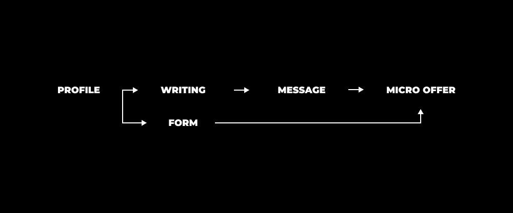
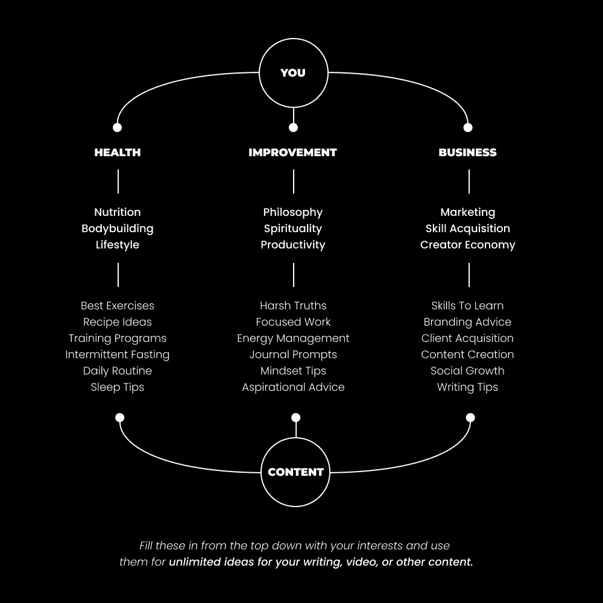

# 快速建立一家单人企业的最快方式（入门指南）

> [`thedankoe.com/letters/the-minimalist-creator-business-make-your-first-1000-in-60-days/`](https://thedankoe.com/letters/the-minimalist-creator-business-make-your-first-1000-in-60-days/)

**我将为你提供一个 60 天的行动计划，帮助你赚取你的第一笔 1000 美元**。

这张图表是你将在本信的结尾学会掌握的内容：

这封信是为初学者准备的，因为我感觉在 60 天内赚取 1000 美元是合情合理的，但如果你不是初学者，你将学会的东西在 60 天内可以让你赚取比这更多的钱。

我将尽力使内容尽可能简洁，没有废话。但请理解，心态建议不是废话。信念和清晰度在技能和自信之前。

如果我写得过长，那是因为我所写的内容对你来说绝对有必要知道。如果你觉得无聊，那可能就是你会跳过的部分，当你没有取得结果时会抱怨。

如果你能够赚取 1000 美元，你就能赚取 10 万美元。

随着你在这个过程中的进步和学习的增加，你将需要更少的时间来一次赚取 1000+美元。

我们将尽可能以最简化的方式进行。

+   你不需要一个大的受众。

+   你只需要学习两种高收入技能的基础。

+   所有你的行动都会累积，没有任何东西会浪费。

+   如果你坚持下去，每次你这样做，你都将赚取超过 1000 美元。

但首先，有一个免责声明。

如果你来看这个视频是因为你想要一个快速的方式来发送一个“给我 1000 美元”的按钮，你可能会失败。

把快速致富的心态留在门外。

如果你想要控制你赚多少钱，你需要一个企业。简单明了。无可争议。

如果你开始创业，它需要的性格与 9-5 的工作大不相同。你必须对一切负责。你必须管理自己，发展自己，并学会热爱商业带来的情绪起伏。

你将会被拒绝。

你可能会质疑自己是否应该放弃并回到那种“勉强能生存且不痛不痒”的生活。

请，为了所有神圣的事物，承诺你已知你需要做的事情来掌控你的生活。

这是你的出路。

我们将讨论以下内容：

+   在自由职业者和代理商的世界中，建立受众的重要性。

+   要谈论什么，要卖什么。

+   微型技能栈——学习两种高收入技能如何为你设定一个有利可图的未来。

+   微型产品——如何在不花几个月时间构建你的产品或服务的情况下，今天就开始吸引客户。

+   唯有两种方式可以吸引客户，这样你就可以专注于接下来的 60 天。

+   1000 美元挑战。每天采取的精确步骤，将这变成一个企业。

这封信是一个迷你课程，所以它有点长。

让我们开始吧。

旁白：One-Person Business Launchpad 在黑色星期五周末前 50%折扣。[在这里查看。](https://thedankoe.com/get/opbl)

## 设置您的数字店面

你将在社交媒体上建立受众。

**这是商业的第一课：**你需要*流量*来发送到你的产品或服务。现在建立网站或设计标志并不是你时间的有效利用。

你不需要一百万个粉丝就可以开始，但我保证你将来会想要一个不断增长的受众。

冷邮件和付费广告很棒，但还有更好的方法可以达到相同的结果，并避免没有成果。

你可以发送 10,000 封冷邮件，在广告上花费 10,000 美元，但人们在那之后会去哪里呢？通过在社交媒体上发布内容来建立受众，你可以完成几件事情：

+   你可以继续接触到关注你的人。

+   开始是免费的，你不需要很多技能或许可。

+   你写的每一篇内容都会让你的受众更愿意购买。

+   你可以建立新产品并增加盈利能力。

+   人们跟随你是因为你。你并没有被困在特定的商业模式或技能中。

+   当你的受众足够大时，你可以离开客户工作或建立你一直梦想的初创公司（你已经有了潜在的客户和团队成员，不需要在营销和招聘上花费数十万美元）。

话虽如此，让我们快速设置你的社交资料。

### 决定要教授和销售什么

我以前以许多不同的方式教授过这一点。

大多数时候，它涉及到创建某种类型的主题树。

这仍然很有用，我鼓励你使用它，但我希望让事情变得稍微容易一点。

你将*加入你已经在其中的利基市场*。

回答这些问题，并选择最符合他们 1-3 个主题：

1.  你搜索和 YouTube 观看历史中有什么*有价值*的内容？

1.  你关注的账户在谈论什么？你是否觉得自己有相似的知识水平？

1.  如果你现在要买一本新书，它会是关于什么主题的？

1.  当你购买教育或行为改善产品（如计划表、软件或健康补充品，而不是新衣服或其他必需品）时，你买的是什么？

生活大多数领域的成功关键是*智能模仿*。

我们都在模仿。我们的思想是我们迄今为止接触到的信息的复杂混合体。

人们真正地过度复杂化商业。

他们认为如果每个人都这么做，市场就会饱和。

不。

差得远呢。

如果每个人都这么做，那就意味着它是盈利的。这意味着人们实际上想要它。

所以，你的任务是做同样的事情，但让它只稍微独特一点。

我的初创公司 Kortex 并不具有革命性或新颖性。

随处可见笔记记录和第二大脑克隆。

使我们与众不同的，是我们根据在该领域的经验添加的一些小功能，这些功能大多数人都没有。我们还有分发渠道。在未来几年内，与像 Notion 这样的产品竞争对我们来说并不是一项太大的任务。其他应用程序可能有机会或没有机会。

即使我们的规模和成本只有 Notions 团队的一小部分，我们没有接受任何风险投资，我们仍然可以用我们选择的小市场达到八位数的年度经常性收入（ARR）。

回到要点。

写下 1-3 个你已经阅读过的主题。你的内容想法将来自这里。

写下 1-3 个你已经购买的课程、模板或产品。这些是你将重新定位的提供的起点。

当你真正写作和销售时，只有那时你才会有想法和反馈，使那些东西真正对你来说独一无二。

再次阅读最后一句话，并将其深深印在你的脑海中。

这不仅仅是我随意放入并被遗忘的随机句子。这是将决定你整个旅程的一件事。

### 创建你的个人资料

一个好的社交媒体个人资料是一项小小的成就。

你需要理解设计和/或摄影，以制作一个好的个人照片和横幅。

你需要理解文案，才能撰写出让人想要关注的个人资料。

你需要理解意识度和漏斗，才能在你的个人资料中放入链接。

你需要理解社交媒体和写作，才能发布有权威性的固定帖子，并保持良好的互动（这也在你的漏斗的末尾推动了下一步）。

现在，你不应该以此为借口去逃避教程地狱。不，你不需要参加设计、文案和漏斗课程。你需要快速创建一个个人资料并开始测试。这是真正学习这些技能的唯一方法。课程有助于*测试技术*。技能是一组你已经测试并筛选出最大效果的技巧。

这是完成这项任务最快的方法：

+   观看 1-3 个关于如何拍摄头像照片或创建个人资料的 YouTube 教程。同时创建你的。

+   使用我们之前讨论的内容来撰写你的个人资料。你的主题和想要建立权威性的提供内容。

我已经为你做了测试。请使用这个生物模板。

*我写关于[主题]。[他们将从你的提供中获得的结果]。*

如果我的主题是生产力、写作和自我提升，而我想要销售的东西围绕着写作，我的个人资料会是：

*我写关于生产力、写作和自我提升的文章。学会写作作为一种高收入技能。*

然后，我会链接我的提供的第一步，我们将在微提供部分讨论。

如果你觉得你的简介不够好，那没关系。不要担心。开始用现有的简介写作内容。在宏观层面上，你的简介意义不大。人们看一次或两次就会忘记它。你的内容是导致最多粉丝和销售的因素。你的工作是写出如此出色的内容，以至于你的简介说了什么无关紧要。

最后，一个引导你创建个人资料的问题：

**它看起来应该有 100 万粉丝吗？**

如果不是，慢慢在接下来的 6-12 个月内提高它，直到它是。

即使它不起作用，你仍然可以增加粉丝并赚取收入。

## 微型技能堆栈

作为一家一个人的企业，你需要最终学会所有允许你运营一个完整企业的技能（除了实物分销和商业地产）。

我们在这里谈论的“微型创作者”只是开始的一种方式。我假设这将是你一生的作品，所以不要因为继续那种让你来到这封信的快速致富心态而廉价地对待你的长期潜力。

现在，为了开始赚钱，你只需要几样东西：

1.  一个流量来源

1.  一个要出售的产品或服务

因此，简化这一过程的两个技能是*写作*和*销售*。

写作是可及的。你不需要设计或视频经验。你甚至不需要写得很好，你只需要写得有影响力。所有社交媒体内容都始于写作（是的，即使是视频脚本）。

销售是将阅读你写作的人转化为客户的方式。

让我们学习两者的基础知识。

### 写作以建立受众

社交媒体内容有两种类型：

**1) 短帖子**

这包括推文、视频剪辑、短片、TikToks、Instagram 上的帖子，以及任何 300 个字符或 1 分钟以下的真正内容。

我最喜欢的在任何平台上写作的方式是先写一条推文，然后将这条推文复制/粘贴到像 Figma 或 Canva 这样的图像模板中（查看我的 Instagram 页面，看看写作以图像形式看起来是什么样子）。不，你不需要发布除了写作之外的内容来在任何短形式平台上建立受众。

短帖子有助于保持关注度，吸引受众，并测试想法。

短帖子是你的基础。你应该每天至少发布一条。在 X 上，你可以每天发布 2-3 条来测试你应该发布到其他平台的内容，或者将其变成一篇长文。

**2) 长帖子**

这包括 X 的帖子、Threads by IG 上的帖子、Instagram 的轮播图、LinkedIn 的长帖子或轮播图，或者我称之为“微型文章”的内容，最近做得相当不错。

这是一个微型文章的例子：

对于短或长帖子来说，美丽之处在于你可以将它们发布到任何平台。只需确保图像的尺寸是 4×5，这样它们就可以适合 Instagram。

长篇帖子是有策略的。如果它们基于一个经过验证的主题（比如你最好的短篇帖子之一），它们可以非常迅速地传播。它们往往能吸引更多的粉丝。

问题是，它们需要更长的时间来撰写。你应该目标每周写 1-2 篇，并确保你能够让它们被分享，以便有更多观众看到它们的潜力。不要依赖算法来帮助你增长。阅读我的信件“[如何在没有粉丝的情况下建立受众](https://thedankoe.com/letters/how-to-actually-grow-on-social-media-what-they-dont-tell-you/)”来学习如何做到这一点。

确保你网络中的每个人都每周分享你的长篇帖子。这就是你增长的方式。

你也可以在我的[2 小时作家](https://2hourwriter.com)课程（含模板）中学习整个流程。

总结一下：

在 X 上每天写 2-3 篇短篇帖子。

在 X 上每周写 1-2 篇长篇帖子。

当你达到 50,000+粉丝时，再考虑开始在其他平台上发布帖子。

为什么选择 X？

X 上的人比 YouTube 之外的大多数平台上的质量都要高。

人们不会登录 Instagram、LinkedIn 或 TikTok 来接受教育。

X 就像 Reddit，但毒性略低，你可以关注真实的人。

你经常去 Reddit 上学习你之前不知道的东西。

在 X 上，你只需要写下你的想法。

然后，挑选你最好的内容，在其他平台上更容易实现增长。

将一个想法变成一个话题，将一个话题变成一封通讯，将一封通讯变成一个 YouTube 视频，将那个视频变成一个免费下载，将那个免费下载变成一个产品。这就是你验证好想法的过程。

现在实际上你应该写些什么？

根据你之前选择的主题做以下事情：

+   将它们分解成常见的痛点，并写关于如何解决它们。

+   使用像[TweetHunter X Sidebar](https://chromewebstore.google.com/detail/tweet-hunter-x-sidebar-fo/amoldiondpmjdnllknhklocndiibkcoe?hl=en)这样的工具研究其他账号的热门推文，并从你自己的角度重新撰写。

+   读书，并使用社交媒体作为你做笔记的地方——但用钩子、正文和结论来写这些笔记。

+   去你最喜欢的 YouTube 频道，按最受欢迎的视频进行筛选。然后，用他们的标题作为你的钩子和帖子的起点。

现在，开始写作。

### 销售流程

销售是讲故事。

你在向某人展示他们可以成为的样子，让他们意识到他们当前情况中的痛点，并*提供*一条从 A 点到 B 点的路径。

+   痛点

+   预期结果

+   通向那里的路径（最好是你的独特方式）

这就是销售的本质。

这就是内容。

这就是着陆页的含义。

这就是所有好的、有说服力的东西的本质。这不仅仅是一个关于销售的教训，而是关于一般性的说服[就像我们上周讨论的那样](https://thedankoe.com/letters/the-greatest-skill-of-the-21st-century/)。

在你遇到的任何情况下练习销售技巧。无论是写作、对话，还是尝试赚取收入。

我们不会深入探讨像销售电话这样的过程，因为在所有诚实地说，你不需要担心它。

作为创作者，你 90%的“销售”是通过内容完成的：

+   让人们意识到他们的问题/痛点。

+   给他们提供解决方案进行测试和实验。

+   展示他们的未来生活，让他们有一个期望的结果。

大多数企业主没有建立受众群所带来的奢侈。

我们将在下一节讨论一种更实际的销售方式。

## 微提案

简而言之：

微提案是一种服务，你目前不需要构建任何东西。

你需要的只是：

+   一个社交媒体个人资料作为你的公开简历。

+   展示你权威的内容（通过说明问题和提供解决方案——即“提供价值”）

+   能够给喜欢、评论、分享或给你发私信询问你帖子问题的用户发信息。

+   如果你先不给他们发信息，他们可以填写一份问卷来展示他们的兴趣。

微提案是一种在花费时间之前测试你应该将其转变为完整产品或服务的方法。

创建微提案的最佳方式很简单。

**你提供一套 4 周的每周一对一会议，价格为 1000 美元。**

这可以做几件事情：

+   1000 美元是一个合理的价格。如果人们为此付费，这意味着其他人会为更完善的服务支付 3000-10000 美元，具体取决于你的目标受众（企业家和企业主通常不会对这样的高价标签犹豫不决……如果他们真的想，1000 美元是大多数人都能负担得起的（不要让限制性信念和你的缺乏经验占据上风））。

+   4 周的会议足以让你的客户看到结果。

+   只有少数人能从你为他们做的工作中受益（自由职业工作）。*任何人*都可以从你通过电话*教学*他们中受益。如果你想，你可以称之为辅导或咨询。

+   在销售几个这样的产品或服务之后，你可以确定应该包含在完整产品或服务中的内容。

现在，你在这 4 次通话中包括什么？

### 微提案框架

我们需要一个起点。

你有信心提供的东西。

**步骤 1) 确定一个大问题**

与你有一些经验的主题相关，人们面临的大问题是什么？

你可以通过几种方式找到它：

+   写关于不同问题的内容，并查看哪个获得最多的互动。

+   研究有关该主题的 YouTube 视频，查看哪些视频获得了大量观看，并观看视频以确定他们在视频中针对的问题（所有内容都针对一个问题）。

+   关注讨论该主题的社交媒体账户，并查看哪些与问题相关的帖子表现最好。

大问题应该属于健康、财富和关系这三个永恒市场。你的工作是瞄准其中一个，并围绕它定位你的兴趣。

如果我的兴趣是生产力，一个很大的问题是缺乏时间或精力去让配偶感到被爱（关系）以及在他们的职业生涯中取得进步（财富）。

你可以通过说明*这些问题在人们生活中导致的结果*来深入挖掘。在这种情况下，他们的关系可能会变得陈旧和无聊，造成不必要的压力和许多小问题，这些问题累积起来会导致精神混乱。你越能说明某人生活中发生的事情，就越好。

（使用所有这些内容）。

如果我的兴趣是编程或写作，一个大的问题是没有一套技能组合让你能赚更多的钱。你慢慢地被学校系统推进到一个与你技能栈无关的职业。那条道路耗尽了你生活中更多的事情的能量，并让你承担起责任。

注意我不仅是在说明问题，还在放大它？这很重要。可能是你营销邮件、着陆页和内容中最重要的一部分。

不要把问题看作是与你选择的主题或兴趣直接相关的东西。

这个问题是一个*人们已经在生活中经历过的痛点*，你的主题或兴趣可以解决。

在某人的生活中，什么是一个大问题，你的兴趣如何帮助解决它？

**步骤 2）描绘一个理想的生活方式**

这个问题的对立面是什么？

他们想要实现的目标是什么？

他们达到那个目标后，他们的生活是什么样的？

记录下他们理想的一天中的 3 个方面。

对于像生产力这样的东西，可以是这样的：

1.  醒来并做你喜欢的工作

1.  不要在中午后感到疲倦和昏昏欲睡，这样你才能完成工作

1.  睡得香，因为你没有造成压力的溢出任务清单

如果你愿意，你可以规划出更多这样的内容。

**步骤 3）创建一个独特的过程**

现在，你的实际提供是什么？

你将在会话中引导人们做什么？

你最终能将其转化为产品或完整的服务？

你需要自己独特的过程或系统，你可以持续改进。

对于我的 2 小时作家课程，它是 3 点内容生态系统。

你是如何想出这个的？

1.  写出某人需要采取的每一步，从步骤 1（大问题或他们现在所在的位置）到步骤 2（他们希望的生活方式）。

1.  检查这些步骤，并稍作润色。创建一个你认为可以帮助你帮助的人的系统。

1.  给这个流程起一个吸引人的名字。这是激发潜在客户欲望的东西。我创造了这么多名字，导致了今天我所拥有的受众，比如《一个人的企业》、《4 小时工作日》、《掌握方法》等等。我在大多数内容中通过实践命名事物（这个是《微型创作者》，我相信大多数人都因为这个名字而来）。

不要让它比这更复杂。

在你与客户的 4 次会话中，你将把写下的步骤拆分，以便在那些 4 次会话中可以管理。

作为额外的好处，你可以为客户创建一个项目，引导他们通过这些步骤（如生产力计划、健身计划、撰写通讯稿或编写小型应用程序）。

那就是你的整个提案：

+   你解决的问题

+   想要的结果

+   独特的过程来弥合差距

当你与人合作时，你应该专注于提升你的提案并收集推荐信。

### 创建一个资格问卷

我们的大部分客户将来自内容。

但是，我们需要一个地方让人们表达与我们合作的想法。

通常，这将是着陆页甚至是一个展示你的产品或服务的完整网站。

目前，忘记这一点。这不是必要的。

在 JotForm、TypeForm 或使用 Google Forms 上注册。

将表格名称设为“与我一对一合作 1”

将描述设为“实施[你的独特过程]”

包括与你的提案相关的这些问题：

1.  姓名

1.  电子邮件

1.  社交媒体账号（这样你可以联系他们）

1.  你最大的挑战是什么？（提供与你的主题和提案相关的多项选择题答案）

1.  你希望 30 天后在哪里？（提供与你的主题和提案相关的多项选择题答案）

1.  “这不是一项免费服务。你真的想一起[想要的结果]吗？”（是或否选项）

简短、甜蜜、直截了当。

第 4 个问题使潜在客户意识到他们的问题。

第 5 个问题激发了改变的欲望。

第 6 个问题在他们的脑海中种下了付费的念头。

你将在你的内容和生物链接下插入这个问卷。

但之后我们做什么？我们如何吸引那些没有填写问卷的客户？

### DM 的艺术

当你开始观看在线商业教程时，你几乎总是会被建议给那些几乎没有任何经验的人发冷邮件或冷 DM 来吸引客户。

我们已经有一个你至少有些了解的提案。

现在，我们需要给那些*已经喜欢你、想和你交谈，并且是潜在客户的人发 DM*。

避免给随机的人发信息。你可能会在 DM 和时间线上被批评。

**你给谁发私信？**

+   评论与你提案相关的帖子的人

+   重新发布或分享与你提案相关的帖子的人

+   首先给你发信息提问或打招呼的人

+   填写你的资格问卷的人

在我们了解在 DM 中说什么之前，让我们先了解我们将称之为磁性内容的东西。

磁性内容是关于痛点、好处、理想生活方式、快速提示、对常见建议的个人看法、从其他账户重写的表现良好的内容，以及克服痛点的可执行步骤的短文或长文……所有这些都与你提供的提案相关。

一旦你有了提案，围绕它写内容应该相对简单。

*评论或分享这些帖子的人是表达对该主题感兴趣的人。他们非常适合用热情的方式联系。他们已经认识你，并看到你在某种程度上有权威。*

（旁白：如果你在 YouTube 上这样做，你不能发私信，所以你需要告诉每个人填写资格问卷，并通过 Instagram 等平台给他们发邮件或私信）。

**现在，你在直接消息中该说什么？**

**1) 从他们上次停止的地方继续对话。**

如果他们评论或分享了你的帖子之一，*发送他们帖子的链接*并在他们的私信中“回复”评论。

如果你在他们提交你的问卷后给他们发私信，你的任务是简要地再次带他们过一遍所有问卷问题。

开始时说，“嘿[名字]，我看到你提交了与我合作的表格。你能告诉我更多关于你为什么填写它吗？你希望通过与我合作得到什么？”

**2) 询问他们的努力进展如何。**

假设他们对他们参与的话题感兴趣，问问他们是否在学习它或他们的进展如何。

对于像健身这样的东西，*“减肥之旅进行得怎么样？有什么我可以帮忙的吗？”*

这既提醒了他们他们想要的生活方式，也让他们意识到他们的痛点。

如果你正在回复他们的问卷，问问他们他们做了什么来解决他们列出的问题。

**3) 给他们提供新颖的建议并提及你的报价。**

到现在为止，你知道你是否能帮助他们。

首先提供一些免费的价值和教育。这证明了你的权威。

给他们提供关于他们在第二步中提到的建议，并尽量让它不那么基础。对于像健身或生产力这样的东西，告诉他们“喝水”会让他们认为你不值得合作。证明你知道你的东西。

在那封信息的结尾，提到“我实际上提供一套 4 次会话的套餐来帮助解决这个问题。我帮助你实施[你的独特流程]，这只是一个更时髦的说法，意思是我会让它更容易达到[期望的结果]。总成本与一位优秀的私人教练相当——4 次会话 1000 美元。”

如果你正在回复他们的问卷，将最后一部分换成解释你的报价的下一步如何进行。你可以提到，如果他们感兴趣，你将发送每个会话中将要讨论的内容，他们如何安排通话，他们将参与的项目，以及 1000 美元的发票。

是的，只需说出价格。

**4) 处理反对意见，发送发票。**

销售电话可能会有帮助，但你不需要。如果他们要求你在电话上过一遍，那也是值得做的。

你可能会在开始时听到很多拒绝。这没关系。这就是商业开始时的样子。

记住，我们的目标是 60 天内达到 1000 美元。在你获得第一个客户和推荐信之后，这会来得更快。

在这个时候，回答他们可能有的任何问题。

一旦完成，发送一个带有 Stripe 或 Paypal 发票链接给他们。

## 60 天行动计划

你会感到困惑和不知所措。

这就是当你学习新事物时的样子。

你的思想正在努力扩展和成长。就像你举重后肌肉会酸痛一样。

你的大部分成果将在第 30 天之后出现。

如果你没有取得任何值得称道的东西，你可能没有意识到，对于不认真做这件事的人来说，有一个自然的过滤机制。

我必须发布 80 个 YouTube 视频，其中一个才走红，我实际上感觉我的 YouTube 在增长。

对于所有值得拥有的东西，一开始可能什么都不会发生，然后一切都会发生。

如果你感觉没有取得任何进步，那么你的经验会积累并转化为一个人说“是的”。

这里要关注的是什么。

无论你是否能立即得到结果（有些人会），停止成为多巴胺成瘾者，给自己 60 天的时间来赚取第一个 1000 美元。

**1) 创建个人资料并停止担心它。**

不，改变你的个人资料信息并不能神奇地让你每月赚 10,000 美元。

创建你的个人资料并忘记它。

**2) 每天写 3-5 篇短文。**

通常我建议每天写 1-2 篇短文，这就是我做的。

你可能认为写 1-2 篇帖子更容易，但实际上并非如此。想法孕育想法。通过写更多，你会产生更多想法，学到更多，感觉好像你取得了更多进步。

这里要做什么：

+   开始建立一个你喜欢的其他内容并希望重新创作的滑动文件（保存好的推文、帖子、视频等）。

+   在你消费内容、播客、书籍或与人交谈时，记下你的想法。

+   写关于挑战、解决方案、如何做、崩溃、对你不同意建议的评论，以及更多与你的产品相关的内容。

我用[Kortex](https://kortex.co)来做所有这些。我会在下周的[YouTube 视频](https://youtube.com/c/DanKoeTalks)中展示我的设置——或者阅读[上周的信件/视频](https://thedankoe.com/letters/the-greatest-skill-of-the-21st-century/)来了解整个过程。

每天记得查看你的评论和转发，并私信给人们。

每天或每隔一天，包括一个链接和行动号召到你的问卷中，以吸引更多感兴趣的人私信。

**3) 每周写 1-2 篇长文。**

你保持注意力的时间越长，人们就越信任你，你就能提供更多的价值。这就是为什么我会写如此长的通讯。人们不需要另一个理由来参加我的课程或尝试 Kortex。

通讯不是“微型创作者”工作流程的一部分。当你把其他所有事情都做好时再添加它们。我们在[单人商业启动器](https://thedankoe.com/opbl)中详细说明了这一切。

对于长篇文章，你做的是类似的事情：

+   选择你最好的帖子（或别人的最佳想法）并在一个帖子、微型文章([示例](https://x.com/thedankoe/status/1824463895894835480))或长文中进行扩展。

+   利用额外的空间分享额外的秘密。尽量包括至少一个不常见的建议或知识。

+   在每个帖子的底部插入你的问卷。

我个人推荐写一系列帖子。系列帖子是由多个推文连在一起的。你以前见过它们，就是一条条推文作为对彼此的评论。

它们通过结构（更易读）吸引更多的注意力，它们引导读者直接到行动号召（更多销售），并且它们可以轻松地改编成 YouTube 视频、Instagram 轮播图或 LinkedIn 轮播图。而且，它们中的每条推文都可以变成新的推文。

长篇帖子将是你的增长和销售的主要燃料。不要忽视它们。

但是，只有当你让人们看到你的长篇帖子时，它们才有意义。

**4) 让你的帖子受到关注。**

我们在这封信中没有过多地谈论这一点（因为我在其他信件中无法停止谈论它），但算法可能不会让你一夜之间成功。

大多数人没有意识到社交媒体的增长来自于*手动努力和技巧*。一旦你意识到这一点，你就不会再把它看作是名人的一场运气游戏。

你需要回复大小账户的评论。

你需要私信别人，与他们交朋友并共同成长。

你需要写一系列帖子，标记其他人，这样他们就有理由重新发布你的内容。

你可以在“[如何用零粉丝建立受众](https://thedankoe.com/letters/how-to-actually-grow-on-social-media-what-they-dont-tell-you/)”中学习如何做所有这些。

任何告诉你你不需要做那些事情的人，可能只是给你一个不真诚地迎合算法的方法。

如果你想要写你想要写的内容，按照你想要的方式写，算法可能不会喜欢它——或者你可能运气好，抓住了一波潮流，然后你会 wonder 为什么当平台改变时你停止了增长。

**5) 制定你的微产品计划。**

你目前还不需要一个固定的产品或服务。

你只需要一个东西，(1) 你在它上面高于平均水平，(2) 它能帮助人们解决他们生活中的实际问题。

想想你擅长什么。

别人是否想要学习那件事？他们是否已经在学习它？是否有一个围绕它建立的行业？你是否关注那些以此为生的人？

太好了，你已经拥有了建立一家价值百万美元公司的所有东西。这不是玩笑。你正在经历一个关于人们如何赚钱的活跃教程。

我并不是没有原因地坐在这里写这些通讯。是的，我非常喜欢写它们（否则我会做些更有利可图的），但我写它们是因为它们有助于我的业务赚钱。

你读到的每一篇内容，你访问的着陆页，你读到的电子邮件，你读到的书籍等等，都附带着金钱。

你没有赚钱，因为你没有创造和销售那些东西。

你现在需要的只是一个包含 4 个电话的套餐，售价 1000 美元，教别人一些能让他们受益一生的东西。

健身、编程、营养、编程等等。

选择一样东西，并承诺帮助人们解决它。

一旦你开始看到成果并知道人们想要什么，就投入更多的时间去建立一个“真正的”企业。

**6) 每周发送 30 条直接消息。**

这听起来像是一个很高的数字，但实际上非常低，甚至可以说是可怜。

对于那些每月发送数千封冷邮件的自由职业者和代理商来说，如果你抱怨每月只发送 30 条信息，他们会在你面前大笑。

但是，30 条直接消息乘以 8 周等于 210 条直接消息。

你只需要接触到的人中有不到 0.5%的人愿意接受 1000 美元的报价就足够了。这是完全可能的。

但是，你可能不明白的是，即使你只签下了一个客户，你已经建立了一个庞大的网络。

你与 210 个人有直接联系。你可能已经增加了几百个关注者。大约有 1000 人将理解你的专业知识。他们每个人都能告诉 50-500 个更多的人关于你。

你坚持的时间越长，说“是”的人越多，你的听众就会越来越大，很快你将会有从天而降的人来与你合作。

这封信就到这里。

我希望这对你有所帮助。

– 丹·科
