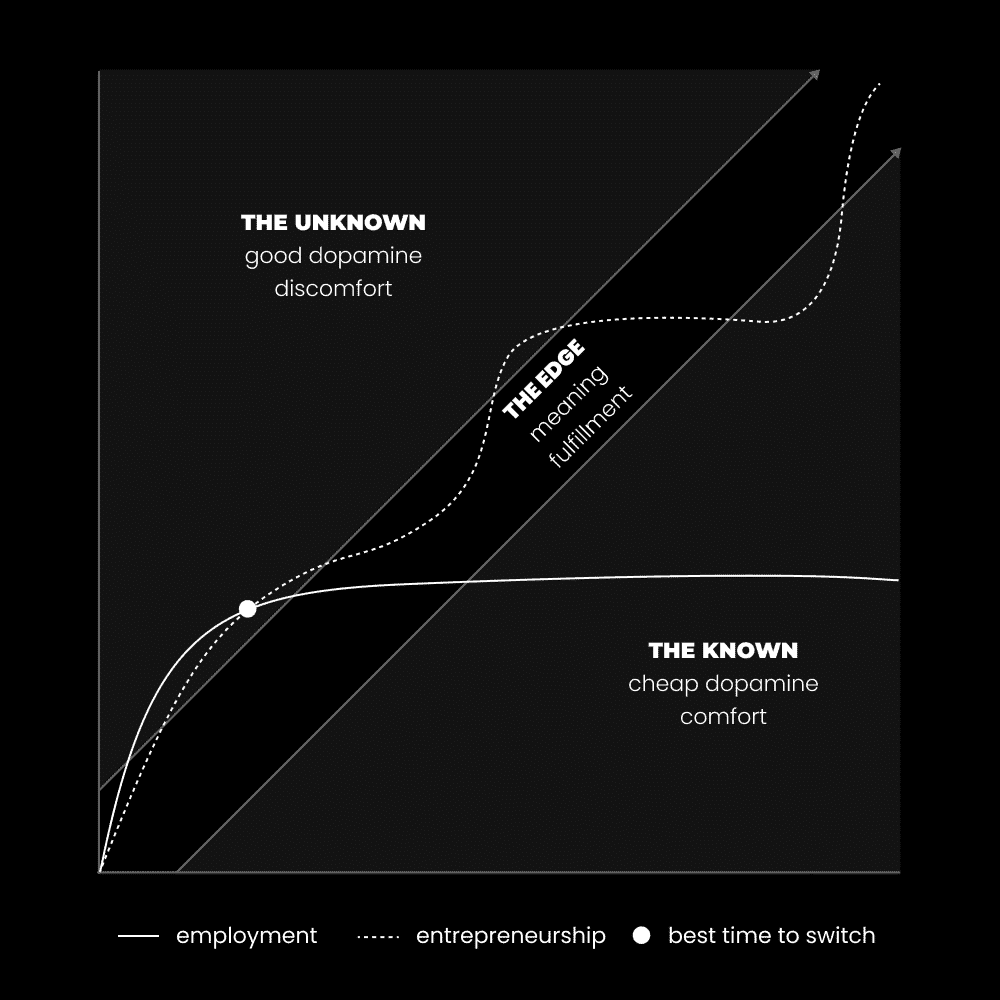

# 我现在 28 岁。这是我想要告诉我的 18 岁自己的话。

> 原文：[`thedankoe.com/letters/im-28-heres-what-i-would-tell-my-18-year-old-self/`](https://thedankoe.com/letters/im-28-heres-what-i-would-tell-my-18-year-old-self/)

当我 18 岁的时候，我感到迷茫。

我一直在寻找一套整洁的答案来回答生命中的最大问题。我们在这里是为了什么？我该做什么？我如何避免像周围的人一样结束，或者是否每个人注定要变得反应性、不快乐和低能量？我如何充分利用这个机会？

但无论我读了多少本书，我似乎都找不到它们。我找到的都是没有明确结论的辩论，不快乐的人的论点，以及脱离语境似乎没有意义的坚定信念。

在这个星球上数千年了，我们真的还没有提出一套每个人都能同意的原则、价值观或教训吗？这是某种病态的宇宙玩笑吗？我是说，来吧……这甚至超出了生命的大问题。种子油。商业模式。关系教条。宗教教义。每个人都参与着这场概念战争，而任何一方都没有明确的胜利。

似乎进化和熵是手拉手前进的，但远远超出了物理世界。我们抓住那些给我们一线清晰度的信念，宣扬它们是唯一的正确答案，并且当那个信念不可避免地瓦解时，我们常常拒绝改变我们的想法。

所以，如果有一件事我意识到了，那就是。

唯一正确的生活方式是像别人一样。

好的生活从你拒绝任何其他方式开始。

最佳做法是从零开始，自己弄清楚。

信念、概念和忠告就像工具。它们有助于实现目标，但一旦目标实现，工具就不再适合螺丝。所以，与其寻找一个适合非存在的唯一螺丝或木板或房子的唯一工具，不如训练一个能够创造自己的工具、规划自己的房子，并且愿意从经验出发重新开始的大脑，这样它们就能随着微观和宏观环境不可避免地采取新的形状而适应。

如果我能回到过去，给我的 18 岁自己写一封信，这就是我想说的。

## 1) 如果你不去创造一个目标，别人会为你指定一个

大多数人在 18 岁之前，他们的整个生活已经被决定了，即使他们认为不是这样。

唯一逆转这个过程的方法是深入理解大脑是如何工作的。

你的意识或无意识的目标塑造了你如何看待世界。

多巴胺在你的大脑中爆发，以信号信息的重要性并帮助你实现目标。

你的大脑存储了这些信息，你根据这些信息采取行动，如果你朝着你的目标取得进展，你的大脑将这种反馈解释为“成功”，并开始形成一个系统。重复这一行动所需的努力要少得多。这变成了习惯。这就是我们所说的条件反射或编程。

你的一生都取决于那些被植入你头脑中的目标序列，因为那些目标塑造了你如何感知、解释和在任何给定时刻对任何信息采取行动。

这里的大问题是，当我们年轻的时候，我们对被分配给我们的目标几乎没有或没有控制权。如果我们没有理解这一过程的高自主性父母，我们就成为主导系统的仆人。在这种情况下，那就是上学，找工作，并在某个年龄退休，得到的远少于你被承诺的。这些是在你出生时就注入你头脑中的目标。

大多数孩子每天都要在政府培训的专家面前坐上几个小时，吸收信息，唯一的目的就是成为有用的工人。这不是可以争论的。教育体系服务于创造它的东西：政府。你为政府服务的方式是成为一个有用的工人，支付你的税款，其余的。

现在，这并不全是坏事。在许多情况下，这是必要的。许多有用的工人可以过上美好的生活。但我不和他们说话。我在和我过去的自己说话。那个知道他注定要更多，无法忍受平凡生活想法的孩子。

对于那个孩子，我会告诉他，普通与罕见之间的区别，是低自主性与高自主性之间的区别。在这个背景下，*高自主性的人是那些设定自己的目标并积极追求它们，而不需要他人的许可的人。低自主性的人是那些被分配目标并追求它们的人，因为他们没有思想，无法看到其他选择。*

这就是自由个体与仆人、企业家与雇员、通才与专家之间的区别，并为这封信的其余部分设定了场景。其他所有课程都集中在如何思考、如何学习和如何生活，以培养和利用你的自主性。

如果你没有创造一个目标——或者一个可以用来统一你决策的大而有意义的目标——那么你就无法掌控你的潜力。

## 2) 经常思考你不想做的事情

> 人应该害怕的，不是死亡，而是永远无法开始生活。 —— 马库斯·奥勒留

你从积极的赞扬中无法学到任何东西。

这在人类经验中是一个特性，而不是一个缺陷，你可以学会整合和利用它。我们的头脑是为生存而设计的。当我们感到舒适时——在当今世界，这相当常见——我们更容易受到陷阱和乐趣的诱惑，这些陷阱和乐趣会慢慢地将我们拖入混乱。

你只从错误中学习。你只从挣扎中学习。只有当你的思想处于渴望学习、适应和进化的状态，以便它能减少那种痛苦时，你才会学习。当你的思想在与问题搏斗直到产生解决方案时。

因此，向我们的理想生活方式迈进的小技巧并不是持续的积极性和可视化理想的结果。当然，这些都有帮助，但它遗漏了等式的一半。

你必须经常思考你不想的东西。你必须形成一个你可以从中汲取强大燃料以向独特未来飞驰的反愿景。

你不会一次性创造一个愿景或反愿景。你通过经验添加笔触。你给自己许可去失败。你给自己许可去害怕。你给自己许可去进入未知领域犯错误、挣扎、与你的恶魔搏斗，并弄清楚这一切。

当大多数人让生活中的问题不被注意时，养成反思你经历的习惯。你永远不会再次经历什么？你当前的行为将把你引向何方？你因为你的思想在那一刻处于如此封闭的状态，以至于你无法想象出一个解决方案，而忽略了哪些痛苦？

当你处于激情四溢的时刻，你不会处于开放的心态。你不会去麻烦去修复它。如果你在你能够这样做的时候不进行自我反思，你就不会改变。你将让错误累积到太晚为止。

## 3) 关注“为什么”并观察“如何”神奇地出现

人类是通才。

我们不像狮子或北极熊那样在一个单一的领域茁壮成长，如果被扔到不同的环境中，它们将无法生存。我们构建工具，如衣服、计算机和概念，以帮助我们适应新的物理、心理和数字环境。

问题在于当人类被欺骗成认为它是一种工具时。

那就是无意识之路的终点。你上学是为了地位和安全。你专注于成为一名医生、律师、艺术家或程序员。你的思想被那个目标所框定，你无法学习到它之外的知识。

没有什么奇怪的，你害怕人工智能和自动化。那是因为你已经成为了一台机器。你是一个担心被另一台工具取代的工具。你不是一个人，有执行功能来创造叙事，而不是成为叙事的一部分。你已经放弃了培养愿景、为工具分配目标以及学习完成这两项任务所需的一切的能力。

当你深入挖掘你的欲望时，你会发现你实际上并不想成为一名医生、律师或艺术家。你意识到那些是整洁有序的头衔，你可以采用它们来给你的思想带来即时的、但却是错误的秩序。

到最后，人类都有创造、扩展和超越的欲望。你想要成为一名医生来帮助他人。你想要成为一名艺术家来满足你的创造力需求。你想要成为一名作家来追求精通。但接受这一点极其困难，因为当你这样做时，你只剩下完全负责自己生活的选择。

有无数条道路可以满足这些欲望。

了解你注定要做什么的唯一方法就是专注于“为什么”：创造、扩展和超越。创造一些有价值的东西来帮助他人。扩展你自我复杂性以承担更大的挑战。超越并包括以前的发展水平，以实现更全面的世界观。

你做事的方式会随着时代的变化而变化。它一直如此，并将永远如此。你做事的原因从未改变，除非你被更深层次的目的所分心。

如果你创建一个随着你成长而演变的宗旨，经常思考你不想做的事情，并避免依赖于最好的或最高地位的工具来完成工作，你就不再会感到新技术和变化的威胁。

不要仅仅为了做特定的工作而学习技能。学习任何必要的技能来创造你理想的生活方式。尝试一切，直到你找到那件你无法自拔的事情，当那件事不可避免地衰落时，再做一遍。

顺便说一句，没有应用，AI 特别是无用的。OpenAI 只有在成为聊天应用时才变得有用。Cursor 通过将其放入编辑器中使 AI 变得有用。[Kortex](https://kortex.co)将做同样的事情，随着我们的人工智能功能这个月开始下降。

## 4) 如果你不去建造，你就在死亡

> 三个最有害的成瘾是海洛因、碳水化合物和月薪。 —— 纳西姆·尼古拉斯·塔勒布

对于长期思考者来说，创业是唯一合理的选项。

你可以在工作中成为一个高效率的个人，并因此获得丰厚的回报——通过主动性和解决问题——但事实仍然如此，你并不掌控着愿景。你并不掌控着目标。你并不掌控着你所学的内容、你的思维方式，或者你生活的最终走向。当然，你有一些控制权，但仍然受到那些让你生存的人的限制。

如果你想要朝着你的目标前进，利用思考你不想做的事情带来的能量，并作为一个深度通才来发展自己，你必须成为一个建造者。

如果你每天能花 8 小时去帮助别人实现梦想，那么你就可以花 1 小时去实现自己的梦想。每个人都能在自己的日常生活中挤出 1 小时。对于那些认为这很小的朋友，你认为 99%的人是从哪里开始的呢？

难道每个企业家都是神奇地开始每天花 12 小时在自己的事情上吗？或者你缺乏远见，喜欢认为他们和你一样没有责任？一小时可以很快变成 365 小时，而 365 小时足够你创造一些了不起的东西。

每天留出 1 小时。

将项目规划成你理想生活的拼图。

给自己许可去尝试、失败和犯错误。

学习构建自己东西所需的各种技能。

记录在案，我认为工作并不是无用的或坏的。但我残酷地意识到，它们会让你变得自满，对你的心理有害。你看，在工作中，你无法控制技能与挑战的比例。

具有挑战性的目标使生活变得有趣。但如果你的技能不足以匹配挑战，你会感到焦虑。如果你的技能过高，以至于超过了挑战，你会感到无聊。关键是要设定一个略高于你能力的目标。这样，你的能力就会受到考验，你也会感受到进步的乐趣。

工作对于技能获取、经验和人脉是有用的，但你在阶梯上爬得越高，对大多数人来说就越不切实际。最初的 6 个月后，重复性工作就会开始显现。你将不再受到挑战。你更有可能留在那个职位上，不是因为那份工作令人满意，而是因为它每个月都能给你带来稳定的收入。

如果你不是通才，你就无法达到顶峰。到那时，你最好还是建立自己的东西。

但这里有个关键点。无聊和焦虑会导致心理熵增。无聊会导致以自我为中心，你开始思考自己能做更好的事情。焦虑会导致自我意识，你专注于自己的缺点，感觉自己不够好。两者都会让消极思想倍增，破坏你心中的秩序和专注，导致混乱。自然地，你会寻求快乐来减轻痛苦，因为你看不到其他选择。你不需要在工作中做到最好，所以你允许坏习惯在你的生活中累积。

如果你没有在构建与你的理想未来一致的东西，你就是在走向死亡。

## 5) 金钱是个人发展的工具

> 那些有特权但没有权力的人是浪费，而那些受过教育但没有影响力的人则是一堆无价值的垃圾。 —— J.D. 洛克菲勒

我知道这很难相信，但金钱并不是那些心胸狭窄的人所认为的那种邪恶怪物。

事实上，成为一名企业家是我个人成长中最强大的催化剂。它迫使我增强我的自主性。它迫使我整理我生活的其他方面，比如健康和习惯，否则我的工作会受到影响。它迫使我通过获取新技能和承担更有趣的挑战来扩展我的自我复杂性。最后，它迫使我变得更加无私。我的创造不仅仅是为了满足我的创造性表达，更是为了帮助他人。

我理解你可能有一个节俭的思维，被限制性信念所束缚，这阻止了你看到现实的更好一半。我理解如果你认同一种纯粹上升的哲学——并且未能整合“较低视角”——认为整个显化世界都是肮脏和不道德的。我也理解如果你不是基于实验和经验来解释金钱，而是基于关于富人和成功人士总是不道德的骗子的普遍叙事。

但改变生活的创造并不是建立在捐赠和慈善之上的。人类福祉的提升并不是通过脱离它去森林中沉思就能实现的。不道德的公司不是通过抗议来瓦解的，而且不通过创办一个以更好方式为人类做出贡献的企业，你实际上是通过工作和无知直接为这种邪恶做出了贡献，这些不道德的公司才能爬到顶端。

除此之外，你的生活难道不是已经被金钱所统治了吗？难道你不必须征服它才能摆脱它的束缚吗？难道你不是为了生存而为一个主要向快乐客户销售产品的公司工作吗？难道你不是因为你对那一件你似乎无法摆脱的东西的仇恨而成为一个伪君子吗？在我们这个现代世界中，人们认为他们可以通过希望回归到过去的人类不发达状态，那时事情“更好”，来摆脱金钱问题，而不是解决它们吗？

人们之所以厌恶金钱的根本原因是因为它是价值的衡量标准。价值是衡量有多少人支持和关心你的创造。

按你工作的数量获得报酬是没有意义的。按你提供的价值获得报酬是有意义的，这就是现实的工作方式。你可能不喜欢它，它可能并不完全纯洁或神圣（因为没有什么东西是，创造与毁灭是相互平衡的），但那些比你更富有的人，按定义，比你更有价值，这让你感到愤怒。

但你并没有采取行动去改变，而是抱怨自己工作辛苦却收入微薄。你还没有意识到，为了在世界上看到你想要的变化，你需要关注、权力、地位以及你所有讨厌的其他东西。想象一下，如果耶稣基督、乔达摩·悉达多、艾伦·瓦茨或者你寻求指导和清晰度的人没有关注、权力或地位，会怎样。重点是，这些事情本身并不完全是绝对的邪恶。它们邪恶的程度取决于拥有它们的人的发展水平和解释它们的人的发展水平。

事实上，你可以赚钱。能赚多少取决于你自己。实际上，这可能是阻碍你实现更有意义和充实生活的那唯一件事。

如果最后一句话让你感到困惑，那你需要从某个角度去思考。

就到这里吧。

我还有几节课要上，但我会把这些留到未来的信件中。

– 丹
