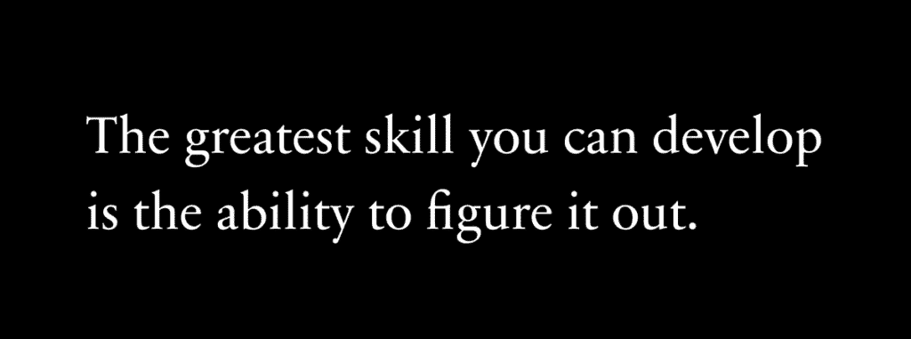
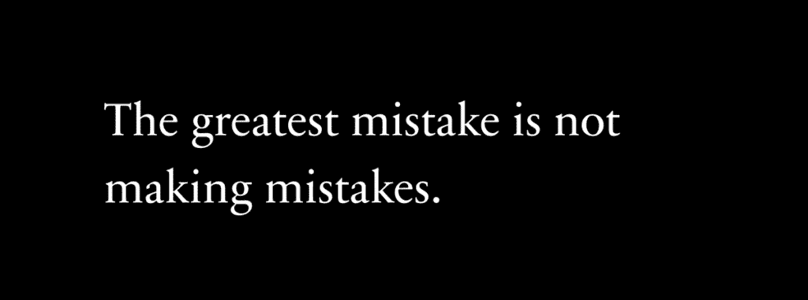

# 如何实现你人生中最伟大的回归

> 原文：[`thedankoe.com/letters/how-to-make-the-greatest-comeback-of-your-life/`](https://thedankoe.com/letters/how-to-make-the-greatest-comeback-of-your-life/)

大多数人感到被困住。

他们的思维感觉狭窄而狭小。

他们无法逃离重复的消极思维泡沫。

他们对自己的生活缺乏清晰的方向。

他们不知道他们想要“专注于一件事情”，因为自我帮助领域的每个人都对他们大喊大叫要专注于“一件事情”，但这完全忽略了重点。

（你不会专注于一件事情。你专注于一个使命，这迫使你专注于许多事情。专注于一件事情是成为那个事物的依赖并永远无法适应的可靠方法。）

他们有这些随机的抱负，比如在社交媒体上获得一些关注者，开始一些他们在网上发现的随机业务，试图“得到一个女孩”来结束他们的孤独，或者任何其他他们可以抓住以在生活中找到方向的事情。特别是像建立一家企业这样的事情，似乎是有价值的，因为至少它是一条不同于我们文化设定的死胡同的路径。

没有什么奇怪的，为什么大多数人无法开始。

没有什么奇怪的，他们质疑他们所做的一切。

没有什么奇怪的，为什么大多数人难以实现任何有价值的事情。

因此，他们慢慢地开始接受他们可能注定要平凡。也许你注定要醒来，按四次闹钟，遛狗，通勤上班，表现得好像你喜欢那里的人，表现得好像你关心你的任务，通勤回家，与你的伴侣争吵，看电视，昏昏欲睡，重复。

但有些东西缺失了。

你试图用被训练成仆人的心态去追求自由。

这就像试图把一个方块塞进圆形的洞里。

这永远不会成功。

## 如何弄清楚你生活中想要什么

人类是自然的多面手。

人类*制造工具*以适应不同的生态位和环境。

另一方面，动物，比如撒哈拉沙漠中的狮子或阿拉斯加的北极熊，如果被扔到不同的生态位，将无法生存。

这不仅限于物理工具。

人类发明了像语言、文化、概念、宗教和故事这样的心理工具，这样他们就能适应、建设和获取在任何情况下繁荣所需的知识和技能。

这是使我们与众不同的能力。

这是大多数人已经失去的能力。

你看，作为孩子，我们喜欢冒险。我们喜欢探索。我们喜欢弄清楚事情。我们犯错并从中学习。*我们触摸火焰*。

但然后，我们的学习就不再是关于真正的错误了。

它开始关注我们父母和老师在我们身上不喜欢的特质。他们觉得烦恼或不文明的特质。他们认为这些特质不会导致他们被训练相信的唯一一条真正的成功之路，他们没有打开心扉去发现，永远不只有“一条真正的道路”。

那条真正的道路是什么？这就是你感到如此迷茫、不知所措、焦虑、困惑的原因。

那条本应安全可靠的道路却是完全相反的。

你被放在一个由政府培训的专家面前，这些专家是由政府培训的专家培训的，显然他们并没有在做你生活中想要做的事情，每天 6 个小时，被告知要学习什么，如何行动，同时不断被推向工作的象征地位和学位。如果你理解了大脑是如何工作的，你就会明白构成你世界观的目标——光鲜的学位和高薪工作——决定了你大脑潜在的发展和自由。

你被训练成为一个专家。

你只专注于成为一名医生、律师、艺术家、设计师、工程师或任何其他自我限制的身份，这些身份塑造了你能够感知和学习的东西。

你没有发展出**自主性**。

你没有通过自己的欲望去探索、失败、发现和构建，而是依赖于他人的。*你没有发展出自由个体的独特特质*。

在过去，自由的人被期望根据自己的兴趣行事。为了做到这一点，他们会在一生中做和学很多东西。最伟大的设计师之所以伟大，仅仅是因为他们在其他生活领域的经验，而不是因为他们去了地位高的学校，并且以某种方式比其他人更好地学习了相同的课程。

一个自由的人与政府培训的专家相反，或者那些被视为劳动机器的人。一个有用的工人。一个奴隶。

与我在[2 小时作家](https://2hourwriter.com)中教授的内容相反，因为写作是一种技能，它让你能够将任何兴趣转化为创造性工作，而不是静态的工作。

### 自然指南针

问题是，你与众不同。

你意识到了这一点。

你很观察力敏锐。也许有点安静。害怕表达自己的观点，因为他们无论如何都不会听。但那沉默正在杀死你。你试图融入。你试图信任他人来规划你的未来。你试图贬低金钱、成功和其他东西，因为“你不需要它来过上好生活”，但你需要**构建**。因为这样你才能为他人做出贡献，与比你更大的事物建立联系，并开始一段独特的旅程，结束这种机械式的生活，因为你有钱摆脱这种机械式生活的依赖。

问题是，你仍在寻找“那条真正的道路”。

我在这里告诉你，没有一条。

如果有，我们早就发现了，每个人都会变得富有、快乐和健康。但现实并非如此。事情永远不会总是快乐的。为什么？因为快乐没有悲伤就没有意义。一只手没有手臂就不存在。物理、生物、心理和灵性层面都包含这种模式。一件事不能没有另一件事。

当你度假时，最终，可能在 2-3 周后，它对你来说变得正常。你会感到无聊。它不再是“度假”了。这是正常生活。你想要回到工作中。你想要做点什么，*任何事*，只要稍微新奇和有趣一点。你的大脑渴望平衡，但不是在普通意义上过着平坦而悲惨的生活。你的大脑渴望*对比*。

所有这些都指向一点：

*你之所以不在你想要的地方，是因为你害怕犯错误。*

我无法表达得更多了。

如果有一个真正的句子可以指引你的生活，那将是它。

错误是自然的指南针。

如果幸福不能没有悲伤而存在，成功也不能没有失败而存在。

这是一条*普遍规律。现实的模式。自从生命的第一迹象以来就存在的现象，因为没有什么可以没有无中生有。*

你可以在传统道路上犯错误——学校和工作中——但你仍然是在朝着狭窄的目标努力。这些错误不会引导你走向一条新的、更好的道路，它们只会让你感到自怜。

当你决定自由——并拒绝在你出生时赋予你的目标，这些目标让你觉得渺小并把你困在这个消极的思想泡泡中——你的错误就是黑暗中的光明。

但你不知道你想要什么。

那就是问题所在。

你没有意识到你永远不会知道你想要什么。它在未来。它不存在。它是虚构的。生活是变化的。你现在想要的东西可能会，并且绝对会在明天、后天或下一个十年变得不同。但你永远不会开始这个精炼和净化的过程，因为你似乎无法让自己失败。

当你意识到你不想从生活中得到什么，并从相反的方向工作时，你想要的生活就会变得更加清晰。由于你在自己的道路上没有犯过错误，所以很明显你不知道你想要从生活中得到什么。

我的建议：

做你想做的事，无需他人的许可。

去参加派对。喝醉。开始创业。整夜刷手机。做你心中所渴望的任何事。说真的，因为否认这些欲望只会让你更加束缚于它们。

但有一个前提。

你需要能够意识到哪些事情是错误的。

如果你每天晚上都喝醉，那并不是一个错误，如果你没有早上醒来有意义的责任。它不会伤害你实现目标的能力。当它影响到比派对和酒精更重要的事情时，管理派对和酒精就变得容易得多。由于你的学校和工作并不更重要，你不在乎，所以你仍然这样做。你需要你自己的目标，而你只能通过对你目前所在的地方感到极度不满并拒绝你认为是真的的一切来产生这些目标。

你需要从头开始。

## 如何实现你人生中最伟大的逆袭

> 传统成为我们的保障，而当心灵感到安全时，它就在衰退。 —— J. Krishnamurti

你在已知的事物中无法做出发现。

这根本说不通。

请意识到这一点。

如果你按照父母和老师在你脑海中种下的东西来行事，你绝对无法过上充实、开放和非机器人般的生活。当然，你有时可以感到快乐，就像所有人一样，但深刻的满足感是另一回事。大多数人没有经历过那种感觉，因为他们不认识它，所以它们不会费心去寻找它，而是通过告诉你他们作为机器人一样工作是多么满足来投射他们的不安全感。代码的线条刻在了他们的脑海中。再次强调，如果你没有一个目标让你去感知，你就无法认识到什么是错误。

你必须投身于未知，感觉就像你在溺水中，并学会如何游泳。这就是你学习任何东西的方法，这就是为什么大多数人学不到东西。他们宁愿跳入深水区，抱怨有多难（好像它应该以任何其他方式，或者好像困难的东西是坏的或负面的，而不是现实本身），并责怪任何人而不是自己无法在没有被给予的情况下做任何事情。

但我到目前为止的所有胡言乱语并不能帮助你意识到你现在已经在这里和现在溺水的现实。

那你该怎么办？你怎么学习？你怎么实现你人生中最伟大的逆袭？

### 对现状感到愤怒

我生命中最美好的时光是在对我不停进步的缺乏感到极度不满之后到来的。

我不在乎我做了什么。我只需要做点什么。我会尝试任何方法来摆脱那种情况。大多数人会称之为绝望，但我会称之为一个渴望学习、成长和进化到下一个层次的心灵。 

目标不是立即找到一件能减轻你痛苦的事情。

目标是接受你生活方式的激进转变。

你必须意识到，你所有的行动累积到了你现在所在的位置，如果你继续做那些事情，你将保持在那里。唯一真正的改变是行为改变，所以和现在你紧紧抓住的几乎所有你认为“并不那么糟糕”的东西说再见。显然，你无法很好地管理它们。

你必须对现状感到厌恶。

你必须创造一个心理上的谷底。

把你生活中不想要的一切都写下来。

愚蠢的头脑。臃肿的身体。迟缓的能量。死胡同的关系。拒绝它们。

你可以非常消极，因为负面能量比正面能量更强大，但你必须将它引导到塑造新身份的方向上。

我不是在告诉你做简单的习惯改变。

我在告诉你完全翻转开关。

因为如果你这样做正确的话……如果你对生活中不想要的东西有了绝对的认识，这并不是一个困难的过程。你不会想要做任何除了你一生都在做的事情之外的事情。

### 消失 3 个月

如果你没有愿景，你就会迷失。

负能量无处可去，因此它被困住并在你的脑海中造成破坏。心理熵。如果你没有有意义的方法、系统或目标来投入这种能量，你就会衰退。

但愿景并不是一开始就很清晰。

它开始于一个有根据的猜测。

你不会对它有信心。

“我想尝试一下这个生意。”

“我想读这本书。”

而且这就是通过将能量重新导向更好的生活来开始以积极方向重新编程你大脑的全部。

如果你想要规划你的愿景并将其分解为可执行的步骤，请使用我的[简单生活重置计划](https://app.kortex.co/public/document/883d9246-6dde-4794-9f54-92b8ff07d502)，你可以复制并填写。它会帮到你。

现在你对不想要的东西有了残酷的认识，集中精力在你认为想要的东西上。

改善你的身体饮食。改善你的精神饮食。多散步。学习一项新技能。去健身房。去散步。今天和新人交谈。毕竟，你处于未知之中。是的，这会有些不舒服。但这并不能减少一个平庸的生活是世界上最不舒服的事情这一事实。一旦你真正意识到这一点，其他的一切似乎都不那么糟糕了。

给自己 3 个月的时间，而不是 2 周。

你需要足够的时间来投入正确的能量，直到你看到那件事很重要。就像一首你不喜欢但当你听足够多时，它就变成了你最喜欢的歌曲。

健身房第一次去不会有趣。

技能第一次使用时可能会很困难。

但随着你的技能开始与情况的挑战相匹配，你开始发现这个游戏极其上瘾，到了你只想做的地步。

### 如果你没有犯错误，你就没有学到任何东西。

我做出的最好的决定是大多数人认为愚蠢的决定。

我擅长犯下巨大的错误，因为我意识到那是导致巨大成长的原因。

在 2018 年，我透支了我的第一张信用卡，试图让一个生意成功。

在 2019 年，我卖掉了我所拥有的一切（除了几件衣服和我的笔记本电脑）并飞到了另一个国家。

在 2020 年，我签订了一份超出我负担能力的公寓租赁合同。这迫使我让我的生意成功。

注意事项：

这些不是从错误开始的。它们是从风险开始的。这个风险的结果是错误，因为如果这个风险只导致成功，你就学不到任何东西，你也就无法复制它。

为什么这有效？

**原因 #1**

金鱼会根据你放进去的容器大小成长。

但如果你把它们放在一个小碗里，它们永远不会成长。

这同样适用于你的思想。

**原因 #2**

帕金森定律：

工作会扩展以填满分配给完成的时间。

当你投身于未知之中，你威胁到了你的生存，你用来成为成功者的时间就更少了。

**原因 #3**

返回原点的主题。

想象一条直线，一端是黑色，另一端是白色，中间是渐变的。

现在，将两端连接起来，形成一个圆圈。

从黑到白瞬间翻转。

一个如此不好笑的笑话，反而变得好笑。

那些如此愚蠢以至于变得有洞察力的人。

有如此多痛苦以至于他们别无选择，只能寻找乐趣的人。

这是一个普遍的模式。

利用它。

这背后的心理学是这样的：

+   你设定一个挑战性的目标，你内心深处知道你可以实现。

+   你创建一个真正的截止日期，消除干扰。

+   它利用你的生存本能快速学习生存所需的必要知识。

那么，你该怎么做？

**1) 感受你的处境**

对你不想过的生活要有残酷的认识。让你的思想沉浸在消极情绪中。

**2) 投身于未知**

做一个愚蠢的决定。强迫自己追求你一直推迟的梦想。沉或浮。

**3) 像疯狂科学家一样学习和构建**

用压力、痛苦和混乱进行情感炼金术。

将一切投入到那个有意义的目标中。

在你的大脑准备好存储所有相关信息的时候学习和学习。

你会成功的。

– 丹
