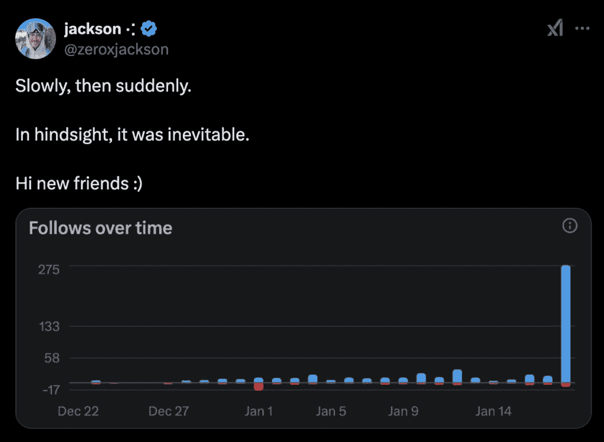
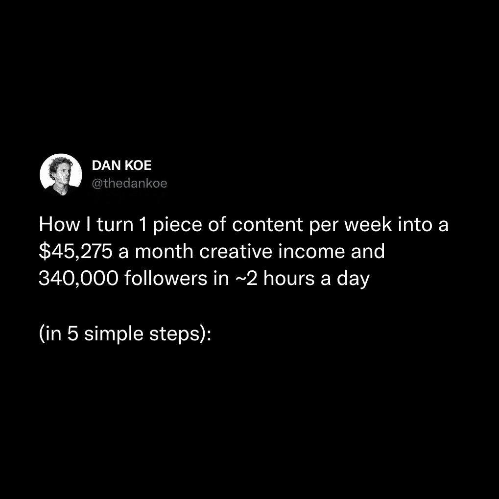
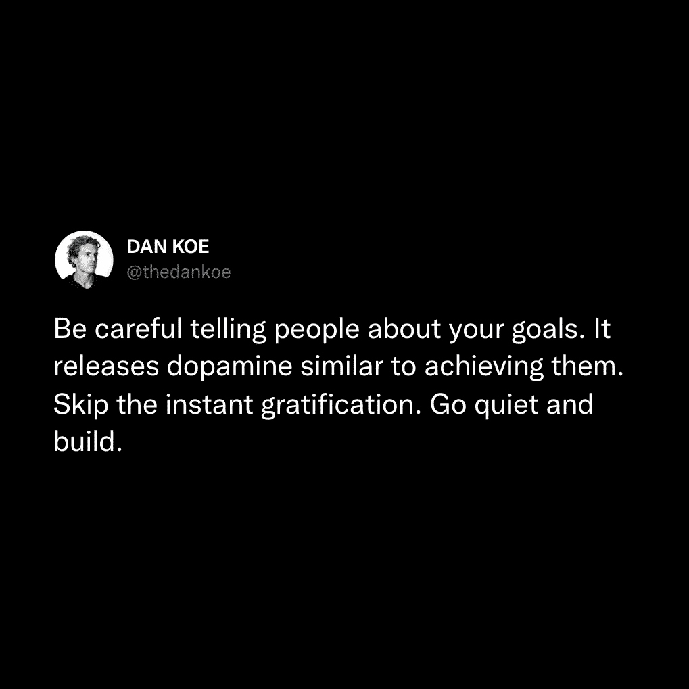
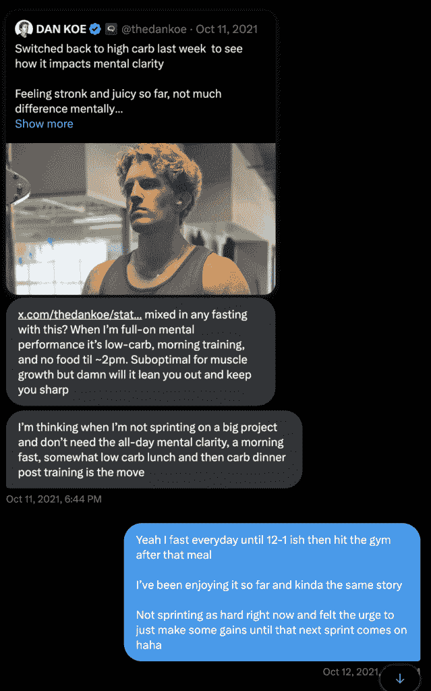
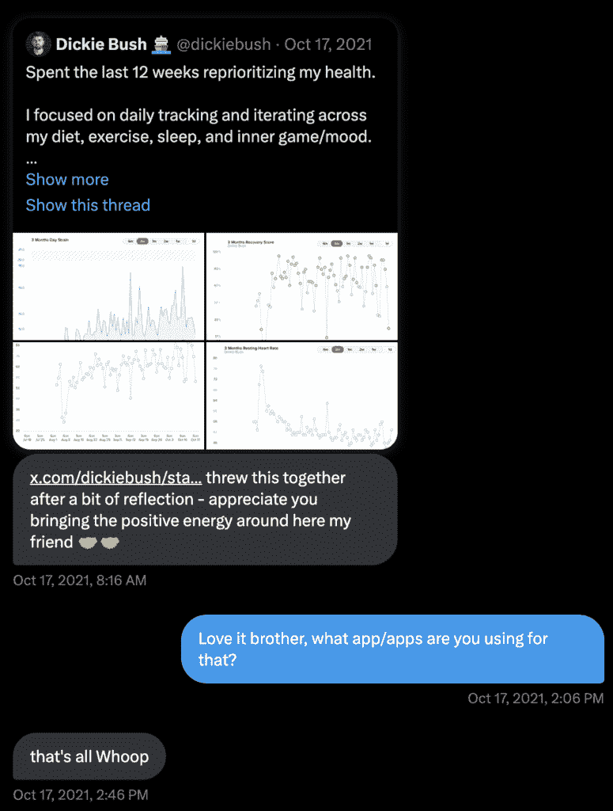

# 如何作为创作者摆脱新手地狱

> 原文：[`thedankoe.com/letters/how-to-escape-beginner-hell-as-a-creator/`](https://thedankoe.com/letters/how-to-escape-beginner-hell-as-a-creator/)

3-6 个月。

大多数创作者就是这样被困在新手地狱中的。

你知道，那个让你感觉好像不知道自己在做什么的可怕地方。你质疑是否值得继续前进。你在想接下来要尝试什么（只是为了重蹈覆辙）。不幸的是，大多数人都是在事情开始变好之前就放弃了。

但你要明白这一点：

大多数人认为答案是“只是保持一致性。”

即使你没有取得进步，也要继续推动。

零点赞。零关注者。零销量。这是世界上最痛苦的事情之一。成为创作者本应是通往美好生活的门票，对吧？或者这只是营销人员和大师们卖给你的一个幻想？一个管道梦想？

这是残酷的真相…*你没有取得进步，因为你没有做正确的事情。*

所以在你回到你发誓要离开的舒适生活之前，听听我有什么要说的。

你需要达到一切“点击”的点。你需要那个“啊哈！”的时刻，清晰出现，你知道如何突破到中级天堂。

我知道你现在正处于边缘。

但记住你为什么开始。

你知道你想要做一些有创意的事情。

你知道，除了工作之外，你需要一个观众。

你知道你想要控制你赚的钱和你设计的生活方式。

你知道，为了做这些事情，你需要写作或创造。你需要成为自己的媒体公司，吸引人们关注你的独立作品。你的自出版书籍。你的音乐。你的想法。你的专业知识。

你只需要达到那个辉煌的时刻——“点击”，你将最终感到掌控自己的未来。

让我来帮助你。

## 如何摆脱新手地狱

> 所有的一夜成名都需要大约 10 年的时间。 ——杰夫·贝索斯

现在，你可以采取一系列行动，这些行动将导致结果。

简单明了。

但大多数创作者盲目地遵循他们在视频、课程或文章中得到的指示。

我的朋友，这不是一个你可以每天执行一系列线性步骤的工作，关闭你的大脑，像以前一样生活。这是一个一个人的生意。你是 CEO。你是 CMO。你是 COO。你是所有的一切。请开始像这样行事。整理好自己。

我知道，因为我几乎在新手地狱中待了 5 年。

我在跨境电商、3 家电商店铺、数字艺术和摄影、一家 Facebook 广告代理公司、一家 SEO 内容代理公司之间跳来跳去，最终不得不在网页设计领域找了一份工作，因为贷款越积越多，而我不再愿意继续沉沦。

在我的工作中，我把所有的工作都拖延到做自由职业网页设计。当我开始写社交媒体文章以吸引更多客户时，我没有经历新手地狱，因为我知道如何避免它。

我在过程中学到的技能导致了我自己的“顿悟”。我会告诉你那些是什么，但它们包括：

+   一种不同的思考方式来寻找你的利基市场

+   吸引粉丝的最佳内容类型

+   如何在不依赖平台广告收入的情况下进行货币化

+   为什么你应该忘记建立漏斗，因为社交媒体已经改变了

以及更多我将留给你的想象。我将给你一个浓缩的社会媒体大师班，让你最终感觉你对自己的生活工作有了控制。我将告诉你如何最终成为这样的人：

在教授写作和内容给近 30,000 名学生之后，以下是 7 个将改变你一切的提示、策略和见解：

### 1) 为初学者做有效的事情

初学者的困境可能持续从 3 个月到 30 年不等。

对于一些人来说，这持续了他们的一生（饥饿的艺术家）。

为什么？

因为初学者没有意识到现在高级创作者所做的*不是*他们最初用来成长的事情。

这是这封信最重要的观点：

*你没有成长，因为你没有做那些导致成长的事情。*

初学者开始发布哲学名言或试图成为下一个马库斯·奥勒留斯，而没有人知道他们是谁或关心他们做什么。他们没有*权威。*

我很遗憾告诉你，你不是罗马皇帝。

你不受尊重，因为没有人知道你是谁。

这意味着在人们关心你那些可爱的小幸运饼干帖子之前，你必须在社会媒体上建立权威。

你如何建立权威？

**1 – 解决更多问题。**

作为初学者，你 80%的内容应该从痛点开始。

如果你只是随意写想法而没有深思熟虑，你不会走得很远。你需要从一开始就对你的帖子结构细致入微。

对于你想要写的每一个想法，考虑一下普通人面临的一个痛点。在你的内容中从那个痛点开始。

使用以下短语：

+   **“大多数人”** – 即大多数人写作都很糟糕。

+   **“如果你在”** – 即如果你难以集中注意力超过 5 分钟。

+   **“最糟糕的”** – 即你可以学到的最糟糕的技能是网页设计。

我在我的内容中经常使用这些，因为*它们有效。*

问题能够吸引注意力。问题打开好奇心循环。问题使得其余的帖子更容易产生影响力。

从问题开始，然后用步骤列表、你独特的观点或新颖的见解来完成它。

**2 – 深入探讨最重要的想法。**

一旦你选择了一个主题，你不仅仅开始写随机的想法。

在这个主题中，有一些精选的常青想法总是表现良好。这取决于你找到它们，并在你的品牌下写出关于它们的全部内容。

在像建立企业这样的活动中，这些想法是：

+   如何选择一个利基市场

+   适合初学者的最佳商业模式

+   最佳学习技能

+   如何在 Y 时间内赚 X 金额的钱

你之所以总是看到这些话题被讨论，是有原因的。

因为它们有效。它们之所以有效，是因为市场中的 95%都是初学者。它们之所以有效，是因为没有人会厌倦基础。

停止试图避免写人们想要了解的事情。

“但丹，每个人都谈论过这些事情，为什么他们会在我做的时候关心我？”

我需要你稍微退后一步。你正处于初学者地狱，所以你的大脑很容易陷入生存模式，无法正常思考。

你有多少次从不同的人那里读过这些话题？你关心吗？

不。因为人们需要被提醒的次数比他们需要新东西的次数多。

一旦你知道你想写什么主题，研究 5-10 个谈论那个主题的账号。注意他们每周或每月重复的内容。注意他们都在谈论什么内容。

然后，让它成为你品牌的一个持续部分。

围绕这些主题创建多个免费指南。

每天至少围绕其中一个主题创建内容。

写短篇、中篇和长篇内容。帖子、帖子、轮播图、通讯和其余的。

你需要创建一个*内容世界*，让人们可以深入挖掘你的品牌，但这是我们在稍后要讨论的内容。

**3 – 筛选你最喜欢的账号以找到它们最旧的内容。**

很可能，你正在复制大账号中的那些让人感觉良好的想法。

他们已经有了受众。他们已经有了很高的参与度基础。你不知道那些帖子是否会对没有权威或投入的人有效。

James Clear 可以写任何东西，并获得数千个赞。你不能。为什么？因为 James 在这个领域投入了大量的时间，并发布了大量的价值。人们只需要读他的书，他们就会成为粉丝。你没有写过书，也没有从博客中获得的那 1 百万订阅者电子邮件列表，这使他的书最初取得了成功。

研究人们为了成长而创建的内容。看看他们的最旧帖子，并继续滚动，直到你找到一些比其他帖子做得更好的帖子。

大多数人都经历过自己的初学者地狱，然后他们有过 1-2 次一次性获得大量粉丝的时刻。找到那些时刻。

### 2) 你的内容并不那么出色

坦白说，如果你没有成长，你的内容只是不那么出色。

你不能只是选择一个主题就开始写作。

你需要考虑读者的心理。

你需要成为一个多巴胺销售员。

你需要*吸引注意力，保持注意力，并传递价值*。

大多数人认为他们在做这件事，但他们并没有。他们写了一篇文章，发送出去时没有任何第二想法，也没有质疑它是否真的很好。

所有这些都需要在其自身内进行一生的研究。天哪，即使是我也需要每个月左右更新一下如何做这些事情。

我已经写了一封关于[10 个参与守则](https://thedankoe.com/letters/the-most-important-skill-of-the-21st-century-only-1-use-it/)的先前信件，所以如果你想深入了解例子，请阅读那封信，但我会在这里列出它们，这样你可以练习。

我会强调建议将这些写下来。你可以下载[Kortex](https://kortex.co)桌面应用程序，使用**Option+C**打开浮动捕获，并在阅读时做笔记。

**1) 具体数字**

在你的钩子或标题中使用具体数字，比如“苹果新的 1175 美元 iPhone 有这个新功能。”

示例：

这之所以有效，是因为它起到了模式中断的作用（增加权威也有帮助）。

**2) 模式中断**

模式中断是打破人们正常条件化模式的东西。

在社交媒体上，人们主要在浏览无聊的文字和图片。你需要做一些不同的事情，让他们停止滚动。

**3) 消极偏见**

人类大脑天生就会记住并关注消极情绪。

这并不意味着你需要消极，这意味着你应该将你的一些写作定位在消极的背景下（它仍然可以是积极的）。

“你将取得巨大的成就。”

与之相比：

“你将永远不会再次触底。”

第二个更有效。

**4) 目标呼吁**

这很简单，指出你正在与之交谈的特定个人。

+   如果你 20 多岁…

+   向所有创作者、教练和自由职业者发出呼吁！

+   父亲是人类的一份礼物…

即使你的听众不属于你指出的特定群体，这也将允许他们“选择一方”并将自己与你所说的话进行比较。

**5) 问题呼吁**

我们已经讨论过这一点，但作为一个重要的提醒：

从痛点开始。

**6) 潜在利益**

你可以为读者回答的最重要的问题之一是“对我有什么好处？”

如果你阅读完你的内容后问自己这个问题，大多数人会发现他们的内容缺乏任何实质性的价值。你有一个酷主意，但人们并不关心它。

改变你的思维方式，以问题和利益思考。

从问题开始，暗示一个有利的转变并带来好处。

**7) 社会证明**

当你展示你的成果、经验或资历时，人们会假设你知道他们不知道的东西，他们想要继续阅读或关注。

Justin Welsh 擅长这样做而不显得自大：

讨论你的成果。

人工智能无法与你的成果竞争。

无论你是写完了一本书的章节的作家，还是一个减掉了 20 磅的健康达人，分享你的经验。我分享商业截图，因为我周围正好有这些，但生产力、健康、人际关系或一般自我提升领域有大量的例子。数字不仅仅是钱。

**8) 信心与信念**

这是我最喜欢的点，因为许多人拒绝在他们自己的信念中持有坚定的信念。如果你能在心中调和“坚定信念，但不要过于执着”这个短语，那就很容易脱颖而出。

+   消除表示不确定性的词语

+   当可能时，用绝对的语言说话

+   夸大你的观点以增加能量

当然，不要为了吸引关注而滥用这些。

而不是这样说：

*“如果有些人能发展他们的技能集，那可能很明智。”*

说：

*“地球上每个人发展他们的技能集至关重要。”*

这里有一个很好的例子：

我几乎 5 年前就写了这篇帖子。

那是我作为新手带来的第一个帖子，几乎让我获得了 600 名关注者。

由于这个原因，我一直在谈论它，把它变成一个话题，然后是一个 YouTube 视频（在两年后，我开始专注于一个平台），这是我在频道上观看次数最多的视频。

我们将在稍后的点讨论如何制造噪音并增强信号。

**9) 拳击、节奏与可读性**

简短而直接地开始。

然后，就像这样，继续你的想法。

+   使用换行符

+   人们喜欢项目符号

+   你可以发挥你的创造力，想多创意就多创意

你注意到我是如何引导你向下翻页的吗？

我是如何简短地开始，让你保持兴趣，并给出一点价值的？

即使是项目符号列表也是按从短到长的顺序排列的。

**10) 警告与注意事项**

阅读这篇帖子：

我首先警告人们一个陷阱。然后我告诉他们为什么。

这是一种写引人入胜内容的绝妙方式，因为*每个主题*都有大量人们可能陷入的陷阱。如果你能识别出这些陷阱是什么，你就有一份写优质内容的清单。

你不需要一次性使用所有 10 条诫命，但我强烈建议你在写作时打开这份清单。在你发送之前，确保至少有 2 条适用于短篇内容，甚至更多适用于长篇内容。

顺便说一句，我在[2 小时作家](https://2hourwriter.com)中谈到了所有这些。

### 3) 从训练轮开始

大多数人不是没有想法，而是有结构问题。

因为这里有件事：

任何想法只要*并且仅当*你以正确的方式构建它，都可能走红。

产生想法并不难。你在这份通讯中至少已经看到了 50 个可以采纳并付诸实践的想法。

问题在于，你不知道如何构建它们。

你还没有*训练你的大脑以巧妙地以有影响力的方式阐述想法。*

一旦你这样做，你甚至可以将最糟糕的想法变成人们无法停止阅读、观看或倾听的内容。

就像任何其他技能一样，你需要从辅助轮开始。以下是你要做的事情：

**1) 创建一个 Swipe File。**

如果你想要成为一个创作者，你需要保持对市场脉搏的敏感。

你需要像研究者一样滚动社交媒体，而不是像消费者一样。

每当你看到让你想，“该死，我希望我写了那篇。”的病毒性想法时，保存它。将链接复制到 Kortex 捕获中，并按“@”键将其组织到“Swipe File”文档中。

将你的品牌视为你喜欢的想法的混合体，对你影响最大的想法，以及你希望包含在你品牌下的想法。

现在，你可以使用这些想法作为灵感，但这并不是全部。

你正在保存这些内容片段，以便你可以模仿其结构。

让我们以前面的这篇帖子为例：

你可以看到一个清晰的*结构：*

+   具有期望结果和具体数量的宽钩

+   列表中 5 个夸张且极端的步骤

+   额外的背景信息，以回答“好吧，我不能完全消失！我有朋友和家人！！”的异议

+   最后一句，将所有内容串联起来

所以，如果我从一本随意的书中，比如“冥想是心灵的跑步”这样的想法中汲取灵感，我可以将其转变为全新的内容：

*如何在 60 秒内清理你的思绪：*

+   *将自己锁在房间里*

+   *坐在角落里*

+   *深深地呼吸到腹部*

+   *用所有感官感受呼吸*

+   *重复一分钟*

*每次你分心时，将你的注意力重新集中在呼吸上。*

*“冥想冲刺”是你达到平静快速的方法。*

如果你想要更有创意，可以使用上述 10 条诫命来更换钩子，并让这些诫命塑造帖子。

而不是“如何在 60 秒内清理你的思绪”，我可以专注于一个痛点、统计数据、目标呼吁，或者从负面角度来处理，比如“如何在 60 秒内摧毁负面思想。”

是的，这需要你思考和与这个想法坐下来。

这里的目标是练习到它成为第二天性。你开始用说服的方式给你的妈妈写文本。你开始以人们愿意倾听的方式说话。这种好处远远超出了获得几个粉丝。

最后，不要只是用推文来做这件事。你可以研究长视频、短视频或任何与你想要创建的内容类型相关的其他内容。

如果你想要一个包含 77 个帖子模板的 Swipe File，这里是我的想法博物馆。[我的想法博物馆](https://app.kortex.co/public/document/47b0dbfc-45df-43ae-802e-45b7eadd87e9)

**2) 学习写作框架。**

当我开始写作时，框架就像救命稻草一样。

我读过《Ca$hvertising》这本书，并学习了像 AIDA（注意、兴趣、欲望、行动）这样的框架的基础。

当我深入研究文案写作时，我了解了 PAS（用于简短推广）和 PASTOR（用于长篇销售信件）。

可以说，通过使用这些方法来写作，我不仅写得更快，而且我有信心我的内容能够吸引注意力和具有说服力。

除了你的内容 swipe 文件，*研究 5-10 个文案写作框架。*

如果你愿意，可以使用 ChatGPT（或下个月的 Kortex AI）来做这件事。

或者，如果你想有另一个模板来继续充实你的第二大脑中的有用笔记，这里是对 [痛苦与过程框架](https://app.kortex.co/public/document/bec7fcec-d76c-4d00-8669-37f53892fead) 的解释。

**3) 在写作时打开它们。**

我说“写作”，但这适用于所有类型的内容。

如果你首先为你的 reels、TikToks 或 YouTube 视频编写脚本，你就能对你的表达有物理控制。你可以*看到*钩子、句子、想法，就像乐高一样移动它们，直到它们变得完美。不要盲目地进入内容创作。

+   在一周内捕捉想法

+   每周坐下来 2-3 天，每次 1-2 小时

+   打开 Kortex 或其他写作/笔记软件

+   将你的内容框架粘贴进去

+   在侧边栏中打开它们

+   将你的想法写出来，并参考框架

你不是在复制别人的想法。*你是在模仿让他们做得好的结构。*

### 4) 没有人知道你是谁

你有好的内容。

你知道你的想法很有力。

你每天都在写作，但每天最多可能只增加几个关注者。

问题出在哪里？

*没有人知道你是谁。*

你只是在等待你的救世主算法将你的帖子推上月球，但这种情况不会发生。即使会发生，你也应该表现得好像不会发生。你的成长在于**你**。这**在你**的控制之中……如果你知道你在做什么。

你看，内容只是社交媒体方程式中的一个*小*部分。特别是作为一个初学者。

方程式中的更大一部分是：

+   了解并喜欢你的数量（因为他们更有可能分享和参与你的帖子）

+   看到你的帖子的人数（因为几乎没有人会作为一个初学者）

+   与那些正在上升的人建立的友谊的质量（因为他们会随着他们的成长而拉你上升）

如果你有 500 个关注者，并被一个有 500,000 个关注者的人转发，你的受众现在变成了 500,500 个关注者。

这就是人们如何通过一个小众群体赚取数万美元。*他们知道如何建立人脉。他们知道如何让他们的内容被看到* **超越** *他们的受众。*

初学者认为他们受限于他们的关注者数量，算法是他们成长的途径。

专家知道他们可以接触到自己的粉丝和网络的粉丝。他们会写一篇知道会吸引粉丝或销售的文章，并让 10-15 个人分享它。这不是他们每天都会做的事情。这是战略性的。他们在合适的时候建立良好的意愿并采取行动。

Sahil Bloom 是现在正在做这件事的人之一。他的书[《五种财富类型》](https://www.amazon.com/gp/product/059372318X?tag=randohouseinc7986-20)可以预订（顺便说一句，它将成为一本畅销书，不仅仅是因为他有一个庞大的受众，而是因为他很聪明）。他夜以继日地工作，让他的书尽可能多的人看到。他向 X 上的至少 50 人发送免费副本，为他们在帖子中标记页面，以便它们可以病毒式传播，并附上指向帖子的链接。他有 100 万粉丝，但据我猜测，这些帖子被 1 亿人看到。

我在胡言乱语。

你能做什么？

**1) 加入一个群体。**

最基本的社交媒体建议是“回复大量账号”。

这有效，也很重要，但大多数人不知道他们为什么要这样做，除了在他们的回复中获得一些印象，希望其中一些会跟随他们。

事实上，你正在做几件事情：

+   写出*高质量*的回复（不是“好帖子！”或用 ChatGPT 重复他们的话），这样人们就有理由查看你的个人资料并跟随你。再次强调，这是 10 条戒律。

+   成为一个群体中知名的人。如果我想进入一个社交媒体圈子，比如创业圈子，我会简单地通过增加价值和个人经验来回复那个领域中的 10 个优秀账号。那个领域的*消费者*习惯于看到你的脸，在你出现足够多次后才会跟随你，而不是在你第一次回复后。

+   种植联系。你在一个特定的细分群体中回复和私信的人越多，就越容易给他们发私信，或者让他们给你发私信。他们会更积极地参与你的帖子，并为你提供机会。

策略性地回复。

**2) 练习非需求型网络。**

真是遗憾这需要被教授，但确实如此。

人们不再在日常环境中学习社交技能。

人们害怕给其他人发私信的程度，和他们在街上向一个陌生人打招呼一样。

事实上，这就像*找到共同的兴趣*一样简单。

 

这实际上就是这么简单。

猜猜我在他分享的那个帖子做了什么？我重新发布了它。因为我有一个新朋友，而且他很聪明，知道要转发。

这里还有一个[Kortex 文档](https://app.kortex.co/public/document/e5b5d206-0874-4637-9201-6cc0d6b2f583)，如果你想在你的工作空间中添加它，它包含了 7 个非需求型网络步骤。

发送关于他们内容的赞美或问题。聊一会儿。然后这样做：

**3) 每周计划一篇战略性的帖子。**

如果你只发布内容，你将不会成长。

简单明了。

如果你真的成长了，算法最终会改变，你将在没有支持网络的情况下在海洋中漂泊。

你需要每周进行对话。你需要写一些能够增加这些对话价值的帖子，并与这些人分享。

### 5) 你需要一个产品

大多数创作者等到达到一些虚构的粉丝数量时才开始尝试盈利，结果却失望地发现没有人购买。

或者，他们认为他们将从平台盈利（如 YouTube）中获得可观的收入，直到他们遇到障碍，观看量在两个月内急剧下降。

关键是，如果你想控制你的收入，你需要销售产品或服务。

这做了几件事：

**1) 人们开始把你视为权威。**

大多数创作者建立了一个对他们漠不关心的受众群体。

他们没有意识到内容本身不足以与某人建立深厚的联系。人们需要**投资**于你，才能更加关注你。

人们不是为了学习和养成新习惯而使用社交媒体的。他们购买产品是为了这个目的。一旦你改变了他们的习惯，或者改变了他们的生活，他们会在心中对你有更高的评价。

许多创作者仅仅因为拥有一个表面层次的受众而停滞不前。

**2) 它为你提供了内容框架和激励。**

如果你不知道要写什么，就写一个与你的产品或服务相关的痛点解决主题。简单。

此外，许多人没有继续创作内容的**理由**，因为没有立即的回报。

如果你有一个产品或服务，至少你有从其中赚取一些金钱的**潜力**。你能够将精力集中在能带来结果的事情上。

**3) 它使试错更加可容忍。**

如果某件事不起作用，你**知道**它不起作用。

你没有得到点击量。你也没有得到销售额。

如果你没有得到点击量，就围绕更多的痛点写内容，并通过非需求型网络将其传播给更多的人。

如果你没有销售额，研究产品创建和文案写作，以转化更多的人。

如果你不知道从产品或服务开始的地方，我在[单人商业启动器](https://stan.store/thedankoe/p/the-oneperson-business-launchpad--your-first-5k)中展示了如何构建一个“MVO”。

### 6) 建立一个世界，而不是一个漏斗

那些倒计时计时器和虚假稀缺的日子已经过去了。

现在，创作者们正在构建世界，而不是漏斗，尽管简单的通讯录和着陆页可以被视为漏斗。在这种情况下，你正在构建一个由微型漏斗组成的世界。

普通消费者一开始并不信任人们。你需要游戏中的时间以及足够的价值，让他们探索，以便他们建立信任。

你需要建立一个小型规模的漫威电影宇宙。你需要构建电影、动作人偶和人们可以狂热观看的传说。

换句话说，你需要：

+   短形式内容（X、LinkedIn、Instagram、Threads 或 TikTok）

+   长形式内容（通讯、播客或 YouTube）

+   免费指南（电子书、模板、视频培训）

+   低价值产品（课程、模板、小组）

+   高价值产品（辅导、自由职业、咨询）

从一种简短形式和一种长形式开始。我推荐 X、LinkedIn 或 Threads 结合通讯。然后，您可以使用这些通讯作为 YouTube 脚本，并将您的简短帖子交叉发布到所有其他平台，并将最好的内容作为视频或 TikTok 脚本。

然后，一旦您建立了足够的分发和现金流，您就有资源转向类似电子商务或软件的东西。

社交帖子是新的最小可行产品。

发布一大堆内容。将最好的内容变成通讯。到处交叉发布。将最好的内容变成数字产品。优化到销售量高。将这个系统变成软件，或者用实物产品来补充。

### 7) 噪声大，信号加倍

最后的反对意见：

“但丹，我想以真实的方式写关于我的想法。整个社交媒体感觉如此无灵魂和模板化。”

我同意。

但要处理第一部分，模板和框架不会让您变得不真实。创造力在约束中蓬勃发展，框架允许您以其他人关心的方式表达您真实的思想。

如果您想完全“真实”，不考虑别人的看法，那很好，但祝您好运，能够作为一个能赚钱的生活方式坚持下去。并不是说钱是唯一的目标，但它很重要，它只有当它被掌握的人变得邪恶时才是邪恶的。

对于第二部分，您可以写任何您想写的内容。

您不必陷入只写能在算法中表现的内容的陷阱。

您应该为两者都留出空间。您知道会让您接触到更多人的内容，以及您认为这些人会喜欢的内容。

但如果人们首先找不到您，他们就没有机会看到您其他更深入的想法。

所以，请随意制造很多噪音。

写下您心中所想的想法。

关注人们共鸣的想法。

那些获得稍微更多互动、私信或关注者的想法。

然后，将它们作为您内容策略的持续部分。

您不需要选择一个细分市场。您需要尝试不同的想法，直到人们告诉您哪个细分市场最适合您与受众的关系。

如果您想了解更多关于我的“你是细分市场”哲学，这里有一封之前的信件。

感谢您的阅读。

– 丹
