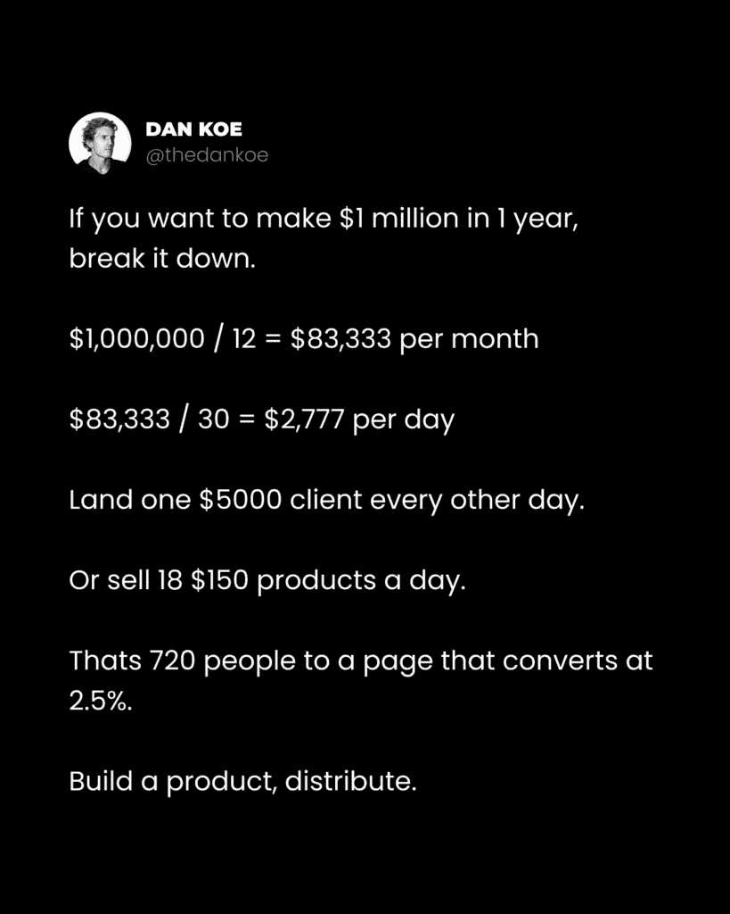
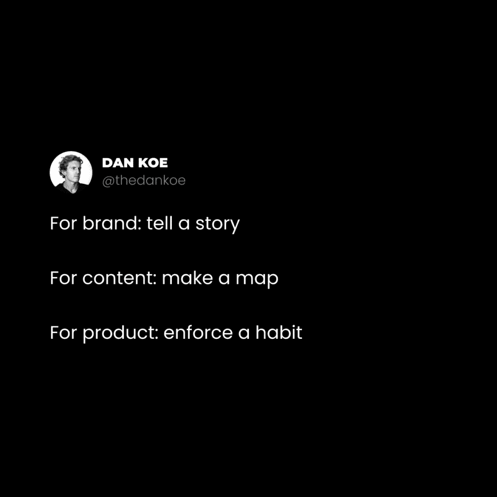
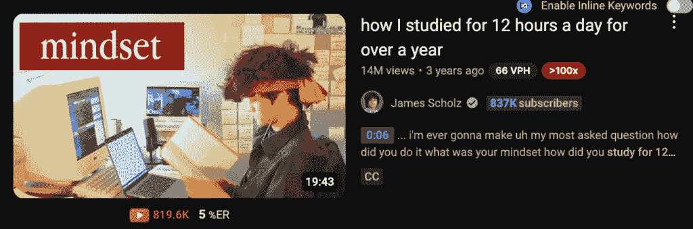

# 《一百万美元产品：如何包装和营销你的知识》

> 原文：[`thedankoe.com/letters/the-1-million-product-how-to-package-market-your-knowledge/`](https://thedankoe.com/letters/the-1-million-product-how-to-package-market-your-knowledge/)

你的大脑里困着 10 万美元。

或者，它就在你的 Google Drive、Notion 或 Kortex 里闲置。

关键是：

你有技能、兴趣和某种专业知识，你可以将其打包成产品，在你睡觉时也能销售。

这封信中你学到的东西将决定你作为一个创意人士的大部分成功。

但这封信不仅仅关于构建产品。

有很多因素会混合在一起，比如：

+   如何找到一个超盈利的想法

+   如何创建营销策略并与失败迭代

+   如何将一个无聊的产品定位成人们无法忽视的东西

+   不可抗拒的提议的五个要素

+   即使你以前从未写过，如何写一个着陆页

+   如何真正构建产品以及如何接受付款

+   最后，如何推出产品，让它不会闲置积灰（而且你不会浪费时间）

这里的事情是…

如果你想要赚取独立收入并且控制你的时间，你需要一个产品。

这应该是显而易见的。

然而，大多数人像我一样。你从客户工作开始。你开始看到一些成功。你的时间被消耗了。最糟糕的是，你意识到你多么讨厌在别人的项目上工作。

你离开你的工作是因为你讨厌那份工作，对吧？

你原本想写作。

你原本想探索你的兴趣。

你原本想专注于你的技艺，但现在你回到了生存模式，从发票到发票工作，而不是从工资到工资。

但一旦你拥有了一个不需要你的时间和劳动就能赚取大量收入的产品，10 万美元就只是坚持和迭代的问题了。

一旦你意识到，如果你能赚 1 美元，你就能赚 100 万美元，如果你有一个能够达到这个规模的单人产品，那就令人解放。

如果你想要建立一个团队来完成价值一百万美元的客户工作，甚至更多，请随意，但即使那样，为什么不构建一个既能增加你的收入又能为你的客户工作带来更多潜在客户的产品呢？

在我们开始之前，明白这并不是什么快速致富的胡言乱语。

我建立产品的第一年，我赚了大约 10,000 美元。

第二年赚了 10 万美元。

然后 150K。然后 800K。然后 400 万。

然后我感到足够自信去资助 Kortex，并且有足够的观众去做这件事。

如果你坚持这样做多年（并且拒绝回到你想要离开的生活），你将看到成功。

这将是一个很长的课程，因为这是一个产品和营销大师班。

这两个都是不能跳过的关键技能。

## 如何找到一个价值一百万美元的想法——要构建什么产品

这里有一个让你感到震惊的想法：

你已经购买了一个价值一百万美元的产品。

实际上，你购买了数百个，如果不是更多。

你现在知道这意味着什么吗？

这意味着你可能是在过度思考。

这意味着，如果你确切地理解了我在这封信中将要说的内容，大多数想法都可以达到 100 万美元。

现在，我假设这是你的第一个产品，你是一个新手。

进入 AI 未来的最佳进步方式将是这样的：

+   建立一个免费且高杠杆的流量来源的受众群

+   在你的兴趣或专长领域成为权威人士

+   从一个可以快速测试的“个人系统”数字产品开始

+   坚持并迭代，直到你达到 10 万美元以上

+   然后，由于你拥有如此多的数据和结果，将这个系统转化为类似软件或实物产品

那里的一个大问题是，“*什么是‘个人系统’产品？*”

好吧，这就是如何将任何想法转化为独特的东西。这种东西无法被 AI 复制或取代，因为 AI 可以在过程中使用它。

这可以通过自由职业服务、教练服务、教育产品或软件的形式来完成。

例如，我的 2 小时作家课程不是教写作。它教的是我写作的个人系统，我如何写作，以及我为什么写作。它*定位*写作——要么太无聊，要么太学术——以一种对像我过去那样的人有吸引力和价值的方式。 （见：[你是你的细分市场](https://thedankoe.com/letters/how-to-create-your-niche-of-one-become-nicheless/)）

我写一个通讯，将其分解成社交媒体帖子，到处转发，每天只需花费不到 2 小时的时间写作，就能在所有平台上建立受众群。

我可以轻松地将这转化为一个个人品牌内容创作的自由职业服务。我还可以教人们如何将这种一对一服务作为创始人或高管教练服务来实施，而不仅仅是创作者，因为建立受众群是一件非常重要的事情。

但由于我们想要避免客户工作并控制我们的时间，我们剩下的两个选择是一个*教育产品和一个软件产品*。

由于 Cursor 和 Lovable 等工具的出现，现在普通人更容易接触到软件开发。虽然学习仍然需要时间，但如果你想做得体面，你仍然需要学习相当多的编程知识，但构建一个网络应用或移动应用是完全可能的，我每天都在 X 上看到这种情况发生。

问题是，你仍然需要理解营销和产品提供。没有将产品定位为独特的*个人系统*，仅仅建立一个待办事项应用是走不远的。

在我看来，在未来几年里，教育产品仍然是最好的起点。就像 Cursor 在编程方面一样，你可以在即将到来的几周内 AI 功能发布时使用[Kortex](https://kortex.co)来帮助写作。

教育产品采取以下形式：

+   课程

+   社区

+   群体

所有这些都基于一个个人系统，附带模板，这些模板也可以与 Kortex 一起提供。

你知道，那种类型的产品是 Alex Hormozi 的投资组合中的。

人们喜欢把“信息产品”钉在坏的光环里，好像教育不是你发展的最重要方面，或者不是为你准备一个学校无法跟上未来的东西。

一个**好的**教育产品可以比任何物理产品或软件改变一个人的生活 10 倍。

创作者是非中心化的教师。他们是互联网上的新学校系统。创作者——不是内容创作者，只是创造他们生活的人——是那些开辟新道路并传授让你能够利用新机会的神秘信息的人。

只要人们购买书籍，他们就会购买课程。让你的思维只看到教育产品的一半，就像你认为课程一样愚蠢。你不会抱怨世界上有 ~129,864,880 本书（大多数都是不好的，因为任何人都可以在键盘上打字…），所以如果你不能接受信息产品，你将会有一个糟糕的时间。

“但是丹！人们只是在教授他们自己做的事情！”

没有废话。这正是市场所想要的，而且这确实是唯一一个**任何人**真正有资格去教授的东西。

我可以整天处理关于这个的反对意见，但我会让你在没有一些被某些反大师（顺便说一句，他们教育你说教育是坏的，而你甚至没有为此付费！）灌输到你头脑中的陈旧信念的情况下思考。

教育产品是超盈利和超有价值的。这是完美的组合。你只需构建一次，就可以按你喜欢的次数出售。

所以，这封信的其余部分就是围绕这个主题。

### 将你所做的事情转化为产品想法

最好的教育产品是那些：

+   解决一个具体的痛点

+   给人们一个获得结果的方法

+   对执行系统所涉及的一切提供清晰度

首先，我们需要决定你想要创建的产品主题。然后我们将进入如何营销产品的有趣部分。

想想你在至少某个领域有一些经验的地方。

你花时间研究或在你生活中实施的东西。

你现在**不需要**个人系统部分。只需要主题。

这份清单可能会激发一些想法。

+   写作

+   视频编辑

+   演讲

+   社会动态

+   人际关系与约会

+   生产力

+   网页设计或开发

+   人工智能

+   心理健康

+   举重

+   跑步

+   营养

+   学习更快

+   知识管理

+   管理财务

+   获得面试机会

简单地想一下你比平均水平高的那件事，并把它写下来。

其次，我们需要研究该主题内的产品和想法。

我们的目的是找到**有效**和**你能做得更好的**东西的交集。

至少写下 10-20 个产品或想法。

你怎么找到它们？

+   在 Masterclass、Udemy 或 Skillshare 等课程网站上搜索你的主题

+   在健康主题中搜索像“最佳训练计划”这样的课程评论

+   深入了解您关注的账户，加入他们的电子邮件列表，并确定他们在网站和销售漏斗上销售的产品。

+   记住您过去买过的产品，重新挖掘它们。

+   在该主题内找到 X 个账户，使用 Twemex 查看他们的顶级推文，搜索与您主题相关的关键词，并保存您可以用作产品或营销想法的帖子。

+   在该主题内找到 YouTube 账户，通过最受欢迎的视频进行筛选，并记下可能转化为产品的热门视频标题。

让我们假设您想围绕社交动态的兴趣建立一家企业。

您可以去 Charisma On Command 的 YouTube 频道，研究他们的视频标题，并挑选出一些明显比其他视频做得更好的。

如果您查看他们的顶级视频，您可以立刻看出，有趣、自信、不缺乏安全感是人们*真正*想要的。

您可以围绕这个主题创建一个产品，用自己的独特视角重新创作这些视频主题中的相当一部分，并且有相当大的信心认为这个产品会做得很好。

在您进行研究时，将这些想法保存在一个安全的地方。

您现在有一份成功的产品和营销想法列表，您可以将其结合、添加、简化或使其独特。我们将在下一部分这样做。

对于您找到的课程，购买它们。

现在别对我小气。

如果您不知道如何构建产品，那么您需要使用几个作为灵感来源的参考点。

您现在还不需要确切知道您想创造什么。

## 如何营销和构建产品

大多数人浪费 2-3 个月的时间来构建一个产品，结果它从未被推出，更糟糕的是，从未卖出任何东西。

我们将做完全相反的事情。

您在开始构建产品之前就能赚钱。

这样，如果您不赚钱，您可以快速转型并再次尝试。

一旦您找到金子，就全力以赴，用 2-3 周的时间将其打造出来，并推出一个成功的产品。

这又是教育产品优越的另一个原因。

1.  您可以快速测试和迭代。

1.  您可以将它们转化为软件或另一种产品。

1.  如果它们是好的，它们对购买者真正有帮助。

换句话说，大多数产品应该*从*教育产品开始，大多数创始人可以通过添加某种形式的教育来创建一个新的收入渠道，即使只是电子书也行。

### 选择您的目标用户画像

人们在这个问题上卡得太久了。

让我们把它简化一下。

您需要一个目标用户画像——您定位产品的对象——这样您的营销才能具体且切实可行。就是这样。

事实上，有一个更大的市场，人们也会对你的营销产生共鸣。特别是如果你是通过社交媒体进行营销的话。你不想过于具体，否则你的内容就不会传播给更多的人。

个人而言，我认为你应该从两个选项中选择：

1.  目标是你自己或你的过去自己。

1.  目标人群是那些拥有大量财富的人（创始人、高管、高薪工作者）。

面向那些拥有大量财富的人的问题在于，你通常并不了解他们。你无法与他们建立联系。这会渗透到你的营销中。然而，对于那些之前曾与这些人共事或在社会媒体上关注了大量这些人的人来说，这是一个很好的选择。

目前你需要的就是这些。

对你想要的目标人群有一个模糊的概念。

### 5 步创建他们无法抗拒的提议

你不是从产品开始的。

你是从营销开始的。

因为如果你把营销做好，你就可以围绕有效的东西来构建产品。

基于良好的营销来构建产品，比基于糟糕的产品来创建营销要容易得多。

现在，拿上你的主题，你收集到的所有想法，把它们写下来：

**1) 大问题**

这是需要确定的最重要的事情。

与这个主题相关的是什么“大问题”？

人们现在在哪里，如果他们不改变，那会导向何方？

那一个问题是如何分裂成 100 个更多的问题的？

问题是他们转型的起点。

问题应该是

+   **相关** – 他们必须能够*感受*和体验这个问题。

+   **相关** – 问题必须是重要的，值得解决的。

+   **有研究支持** – 你必须确保你不是在凭空制造问题。

大多数紧迫问题都落在健康、财富和关系类别中。

所以如果你的主题是**举重**，问题可能包括以下几点：

+   **健康示例** – 没有进行阻力训练，你更有可能发展慢性疾病，随着年龄的增长，你移动起来也会更加困难。

+   **财富示例** – 如果你看起来不好，人们不会尊重你，因为你的身体反映了你的纪律和承诺。你不太可能得到机会、晋升和来自有价值的人的信任。

+   **关系示例** – 你缺乏信心去和陌生人交谈，或者在你脱掉衬衫在配偶面前时感到不安全，这可能导致性生活不佳，从而在其他关系领域产生小问题。

意外地，这里最紧迫的问题并不是与健康相关。它与被视为高价值以获得更好的机会和关系有关。

如果我们想要进一步放大这个问题（你应该这样做），你会谈论缺乏社交机会如何导致孤独感。这会影响你的心理健康，使你在生活的其他任何领域都难以保持纪律。你陷入了一个特定的工作和环境中，却不知道为什么无法摆脱。

作为一个小贴士，在第一轮头脑风暴之后，这一切都不会完美。

这种营销策略是你随着阅读更多书籍、内容、听有声书以及与有这种问题的人交谈而不断完善的。

将这些想法作为社交媒体帖子进行测试也有帮助。你获得的参与度越多，就越有可能将它们纳入你的营销中。

**2) 期望的结果**

如果大问题是人们开始的地方，那么期望的结果就是转变的另一个端点。

意思是，如果你不能确定问题（正确想法的出现需要一些时间）的话，你大部分的营销就会失败。这就是你应该建立一个观众群的原因，这样你就可以免费在你的内容中测试这些想法。使用[2 小时作家](https://2hourwriter.com)来做这件事。

如果我们的普遍问题是缺乏自信和他人没有把你视为有价值，那么一般的期望结果就是拥有一个令人敬畏的身体。

现在，我们需要再次使它更加贴近、相关，并基于研究。

人们实际上想要什么？**他们为什么想要它？**

对于男性来说，他们想要明显的腹肌，一个不错的下巴线条，宽阔的肩膀，并在与其他人交谈或裸露时对自己的皮肤感到自信。

对于女性来说，我无法真正发表意见，但我会假设她们想要沙漏般的身材，一个漂亮的臀部，明显的腹肌，并且要*感觉*“性感”和迷人。她们希望她们的伴侣对她们百依百顺。

你可以将这与其他大好处结合起来，以回答“为什么？”这个问题。

为什么男人想要明显的腹肌？

为什么女性想要一个丰满的臀部？

记住，这里的大部分具体性都源于你的目标人物画像。

**3) 可信的时间框架**

时间框架可以极大地提升你的营销效果。

30 天。

3-6 个月。

6 周。

2 小时。

它们有助于使你的产品具体化。它们是激发读者欲望的参考点。

时间框架也有助于压缩你放入产品中的内容。很多人只是把所有知道的东西都塞进一个产品里，而不是只放入解决问题和达到期望结果的有价值的内容。

在创建个人系统之后，你可能需要回过头来考虑这个问题。

**4) 个人系统**

你个人系统克服痛点并达到结果的方式使你的产品独一无二。

你可以复制一个成功的产品的营销策略，用你的系统替换他们的系统，这样可能会卖得非常好。这就是大多数产品所做的原因，因为这是大多数人想要的。人们想要*你的做事方式*。

你如何创建一个个人系统？

你进行实验。在自己或愿意帮助你且符合目标用户画像的人身上进行实验。（这也为你提供了可以用于社交证明的结果，如果你是一个新手的话。）

这是你要做的：

1.  打开像 Kortex 这样的工具来写下这些内容

1.  记住**问题**和**结果**

1.  列出他们需要在**时间段**内采取的步骤

1.  这些步骤应该涉及达到结果所需的所有相关内容（例如，在举重的情况下，通常还需要涉及营养。）

1.  在那个时间段内测试它或针对你的目标用户画像进行测试

1.  记录下可以改进的地方

1.  重写步骤列表并再次测试

1.  重复直到它可以为更多人带来结果

然后，给你的系统起一个名字。

对于像举重或健康这样的东西，你随处可见。

间歇性禁食是一个个人系统，后来成为世界上很大一部分人认可的术语。

Stronglifts 5×5 是一个个人系统，现在已成为大多数健身房新手的“首选”。

如果你能在你的营销中融入其他方面，比如 2 小时作家中的“2 小时”，它就会变得更有力量。

你的个人系统是让人们觉得“这终于能解决我的问题！”的原因。

**4.5) 教育**

如果你正在创建一个教育产品，你需要为人们需要了解的内容创建一个课程或大纲。

你可以给他们系统，但如果他们不理解与之相关的所有内容，这不会很有帮助。

除了你的个人系统，概述人们为了最好地使用系统需要了解的基本原理、步骤和技能。

**5) 特性和好处**

大多数人**只**列出他们产品的特性。

但这并不具有说服力。

人们不在乎产品本身，他们关心产品如何改变他们的生活。这是营销 101，但即使是经验最丰富的营销人员也会在这里遇到困难。（我们都会忘记，并且没有提醒自己基本原理。）

当你列出如下特性：

+   5 周训练计划

+   包含 20 个菜谱的食谱

+   学习胸部增长的前 5 个练习

将它们与一个吸引人的好处配对，或者完全用好处替换掉无聊的特性：

+   5 周计划，这样你知道当你走进健身房时该做什么（不再感到迷茫！）

+   包含 20 种填充和低热量食物的食谱，这样你可以在不感到罪恶的情况下感到饱腹。

+   胸部增长的前 5 个练习，这样你就不必浪费多年时间而没有发展出可以撕裂衬衫的胸肌。

从这里，将你个人系统和教育中的所有特性都提取出来。

列出它们。

给他们添加好处。

所有这些都是必要的，因为它们将成为一个高转化率着陆页的基石。

**6) 交付机制**

让我们用一个新例子来回顾一下我们所学到的所有内容。

+   **主题** – 生产力

+   **目标用户画像** – 我过去的自己。一个 18 岁的想要平衡学习和建立业务的人

+   **大问题 + 消极结果** – 我不想做传统的 9-5 工作，但我在课堂上落后了，我的业务也退居次要位置。如果我不能长时间学习并长时间从事我的业务，我就会陷入一个舒适的工作中，而且要摆脱它将极其困难。40 年后，我会希望我花时间学习了。

+   **期望结果** – 每天专注 12 小时以上，无需添加尔。

+   **可信的时间框架** – 14 天

+   **个人系统** – “注意力马拉松”，一个训练你的大脑进行马拉松的训练计划

+   **教育** – 关于心流状态、多巴胺、工作空间设置、避免分心等的一切。

我知道这是一个经过验证的想法，因为我事先研究了 YouTube。人们*想要*长时间专注。

现在我们有了软营销计划和提供概述，我们需要决定我们如何交付实际提供。

你在这里有几个选择：

+   **电子书** – 制作速度快，但很难收费高。

+   **电子邮件课程** – 结构化学习，但大多数人都会掉队。

+   **团队** – 一个 4-8 周的课程，包括电话和社区。每年只开放 4 次报名。对于稀缺感和感知价值很好，但很贵。

+   **普通课程** – 一个始终可以推广的常青产品，但你需要大量的流量。

+   **社区** – 每月重复收入 = 每月重复工作。更难销售，但如果你承诺，回报会很大。

+   **软件** – 建设时间更长，失败的可能性更高，但如果你投入 5-10 年（或快速赢得病毒式奖金），可能会带来巨大的回报。

为了使这些更有价值，你可以添加模板、跟踪器或工作表。仅此一项就足以使教育产品值得付费，而不仅仅是观看上面的免费视频。

我真的不能告诉你该选择哪一个……但我可以告诉你，你可能会创建多个。

一个好的初学者进阶路径可能是这样的：

+   从一个关于“一年内每天专注 12 小时”的特定主题的$27 电子书开始

+   将其转化为一个更大的$150 课程模块，使用“焦点中心”模板来规划他们的学习和工作块

+   将其扩展为一个更全面的$399 团队课程，“活在流动中”

你可以在任何地方推广电子书。你可以在后台电子邮件或 YouTube 视频中推广课程。你可以在每个季度推广一次团队。

你的交付机制——电子书、课程、团队等——的整个工作就是要履行你的营销和提供。

在你概述了你的第一个提供将包含的所有内容之后，是时候赚你的第一个$1 了。

## 落地页、启动、构建——按此顺序

我要重申，这是初学者最好的路线。

你几乎不能用我们接下来要讨论的任何其他类型的产品来做。

在过去，数字产品并不是真正的东西。

你可能会花费大量时间来构建一个可能成功也可能失败的产品。

你将资金投入到产品开发中，建立生产和分销，然后推出。

有一个统计数据在业界流传，大约 95%的企业在第一年内失败。

关于构建受众和数字产品的事情是，你可以*转型*。

你可以在内容中每天测试想法。

你可以将这些想法转化为营销策略。

你可以构建着陆页，添加支付，并启动预售。

如果它不起作用，你可以放弃并尝试无限次，直到它起作用。

换句话说，如果你*坚持不懈并迭代*，你就不可能失败。

当你准备将其转变为初创公司或更复杂的有形产品时，你已经积累了大量数据，成功的可能性大大提高。

好的，我们有了营销策略，接下来你该做什么：

### 首先创建着陆页

为了重复一遍：

你将首先在[像 Stan 这样的平台上](https://join.stan.store/thedankoe)创建着陆页。

然后，你将*推出*产品。确保告诉人们产品将在特定日期发布。在 Stan 内部，你可以为产品添加一个模块，为每个人提供有关何时上线详情。

一旦你完成了第一笔销售，压力就来了。你现在没有退路了。你必须集中精力，按照你公开的发布日期打造一个*优秀*的产品。这是一个公开的责任机制，所以你不能退缩。

现在，一旦你确定了出价的各个部分，文案写作就变得简单了。

整个文案写作的目的是以清晰和有说服力的方式展示出价。

我们已经完成了说服部分，现在我们需要结构。

有很多种方法可以做到这一点，我建议你进行研究，但以下是我构建页面的方式：

再次强调，构建和托管这些产品的最佳方式是在[像 Stan 这样的平台上](https://join.stan.store/thedankoe)。

着陆页制作简单（它们只是写作）并且你可以托管任何类型的数字产品。此外，你所有的链接都活在一个类似 LinkTree 的页面上，这非常适合在个人资料、帖子和新 letter 中推广。

**标题**

你的标题和副标题应该是你出价中所有价值的*浓缩*。

你的任务是结合这个大问题、期望的结果、个人系统、时间框架，以及在这个部分中可能的目标人物的最强大部分。

对于我的生产力产品，标题可以是：

*每天学习 12 小时无需安非他命（14 天计划）*

如果你想查看这些模板，请访问[Mental Monetization.](https://mentalmonetization.com)

**副标题**

在副标题中，添加其他部分。

由于我只在标题中包含了期望的结果和时间框架，因为它是最有力的，我可以将副标题定为：

*使用“注意力马拉松”系统来避免低薪的 9-5 工作，并征服廉价的 dopamine*。

在那里，我引入了个人系统、大问题，甚至加入了一个高绩效的话题，比如廉价的多巴胺。

**问题 + 放大**

在下一部分，大多数人称之为*引言*，你的任务是说明大问题和负面结果。

当你从问题开始时，你增加了读者对问题的认识。你给了他们这样的信念：通过使用一个帮助你改变生活的系统，他们的生活可以改变（因为可以）。

个人来说，我喜欢包含几个简短的句子来说明问题，然后跟着一个痛点列表，这些痛点源于该问题。

你可以访问我的任何着陆页面来查看实际操作。

如果你不知道在这里写什么，使用你的个人故事。

你之前在哪里？

你为什么想要改变？

你尝试过什么没有奏效的方法？

**个人系统**

进入着陆页的下一部分，你的任务是展示你的个人系统是如何不同的。

你的故事中转折点是什么？

你是如何发现并创建个人系统的？

为什么它比市场上大多数其他解决方案更好？

如果你可以在这里添加一个图形来帮助解释系统，那就更好了。

**结果或推荐信**

在个人系统之后，你可以加入使用你产品所获得的结果的图片。

如果你没有推荐信，你有两个选择：

+   免费带人们了解你的产品，以换取推荐信

+   展示你自己的成果

你可以使用自己的图片（比如生产力或健康），或者如果你的主题是像网页设计这样的数字化内容，你可以使用截图。

**功能 + 优势**

这是“产品介绍”部分。

在这里，你分解他们在程序中收到的每一件事。

做这件事最简单的方式就是一个带有功能 + 优势的项目符号列表。

如果有帮助，想想这个列表是你在*引言*中包含的痛点列表的*对立面*。

你可能在前购买的大多数产品中见过这种情况。它只是列出了里面的内容 + 为什么他们应该关心。

**行动号召**

在功能和优势部分之后，你需要促成交易。

我喜欢进行比较。

比如说“使用这个产品之前的你”与“使用这个产品之后的你”，重复痛点与好处。

这可以是图形或简单的项目符号列表。

如果你使用的是像 Stan 这样的东西，让它直接进入支付按钮。在这种情况下，跳过常见问题解答部分。

**常见问题解答**

如果你正在构建一个定制的着陆页面，我不建议你第一次就做（花费太多时间，而且它是一项你需要学习的技能），那么请包括常见问题列表和答案。

如果这些问题可以处理人们在你的着陆页上思考的反对意见，那就更好了。

### 发射 发射 发射

设定发布日期。

从第一次推广开始算起，3-4 周后。

每周在你的通讯中推广。

将链接放置在各个地方。在你的个人资料和描述中。

编写帖子，创建轮播图，或拍摄电影胶片，或者制作任何其他围绕您产品主要主题的内容。

包含一些小的推荐或行动号召，例如，“如果你在[痛点]上遇到困难，[产品]将于[日期]上线。”

*每次推广时都使用您上述营销策略的元素*。

当您距离发布还有 1-2 周时，开始增加推广的频率和强度。

如果您为提前预订的人提供某种早鸟折扣，那将非常有帮助。

为了简洁起见，我就写到这里。

如果您希望我未来更多地谈论如何推广您的优惠，请告诉我。

直到那时，您可以在我的网站上找到关于构建受众、生产力和写作的先前信件。[（在我的网站上）](https://thedankoe.com)

感谢您阅读。

– 丹
