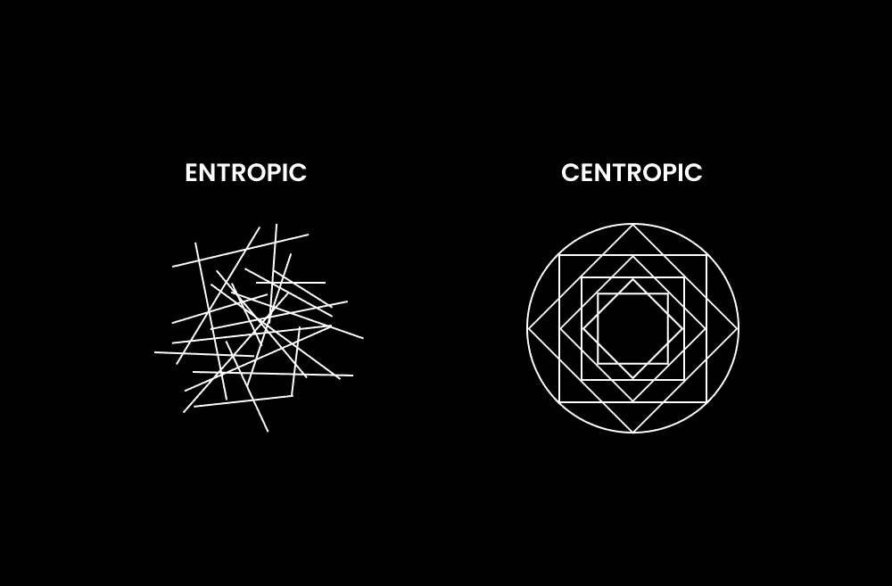
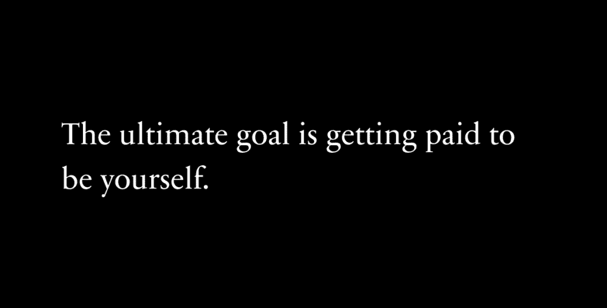

# 互联网已死，我们亲手杀死了它

> 原文：[`thedankoe.com/letters/ai-will-end-the-internet/`](https://thedankoe.com/letters/ai-will-end-the-internet/)

根据维基百科：

> 死亡互联网理论是一种阴谋论，认为互联网“死亡”发生在 2016-2017 年左右，现在主要由机器人和人工智能生成的内容主导，而不是真实的人。

但关于这个理论，还有更令人惊讶的事情，没有人谈论。

现在，我不确定为什么我们仍然将这称为“阴谋论”。

互联网的大部分内容都是由机器人和人工智能生成的。

而且只会变得更糟。

但说实话，我不认为这是一个问题。

事实上，这可能是创意人士和企业家脱颖而出的最大机会之一。

另一方面，人们可以随时浏览无穷无尽的超上瘾、脑死亡内容。

这有点疯狂，但美国人的平均屏幕时间略超过*7 小时*！当然，其中一些可能与工作相关，但我们都知道，即使你在工作，大部分时间也是在社交媒体上度过。

报告显示，抑郁、不确定性和压力已经达到了顶峰，尤其是在人工智能取代人类工作的威胁下，即使大多数人表示他们讨厌自己的工作，我们也只能抓住我们最后的生命意义。

问题是，大多数人并不想改变。

人们习惯了痛苦，以至于它感觉像家一样，离开它似乎才是真正的痛苦。

而且随着人工智能每隔一周就打破记录，个人和公司每天可以产出数百到数千篇内容。

由于这种内容如此上瘾，压力、抑郁和不确定性只会继续恶化，我们将无法控制自己。

问题是：

这*实际上*是个问题吗？

我们都想过这个问题……社会真的会变成《机器人总动员》中的那个场景吗？每个人都是肥胖的，整天坐在椅子上，被滴注含糖饮料和娱乐？

*我不这么认为*。

## 加工食品与有机内容

加工食品很糟糕。

这很明显，我们都知道。

但这并不意味着我们不能吃一块饼干或者两块——或者也许在凌晨 1 点，在喝了几杯生日摩卡之后，独自享用一整个黄油蛋糕——来平衡我们生活的过度优化。

当我们无法长时间控制自己时，问题就会随之而来。

这很容易做到。

快餐连锁店、流媒体公司、游戏公司和社交媒体公司投入数百亿甚至数千亿美元来优化由多巴胺驱动的反馈循环，以保持消费者的上瘾。

仅 Facebook 每年在研发上的投入就超过 200 亿美元。

现在，快餐之所以特别容易上瘾，是因为这种残酷的组合：

脂肪、糖和盐。

这些是稀缺资源，人类在当今世界并不适应拥有过多的资源。我们适应了生存。稀缺的原料，一旦找到，就会向我们的大脑释放多巴胺，以信号我们找到了有助于我们生存的东西。

一旦公司发现了这个机制，他们现在可以测试和创造这些成分的组合，以最大化客户的愉悦感，并让他们不断回来。上瘾。

互联网公司也效仿了这一做法。他们采用了广告模式进行盈利，很快发现极端和煽情的标题能吸引最多的关注。现在他们只需要向用户即时可访问的屏幕上提供更多他们“喜欢”的内容即可。你好，“为你推荐”页面！

有加工食品，也有加工*内容*。

数字脂肪、糖和盐。

低廉的多巴胺。即时的满足。熵。

快速而肤浅的内容就是这样：熵增。你消费得越多，你的思维就越混乱。没有长期的意义构建。只是一堆没有目标或愿景去应用的无用想法充斥着你的大脑。数字食品不会给你提供能量或建造肌肉，它让你感到如此迟钝，你只想整天躺下增肥。

作为《机器人总动员》中的公民，沉迷于一个为你提供短期满足内容的定制算法，让你处于压力和生存状态。恐惧和欲望的结合让你远离当下和心灵熵增——或者说心灵的混乱——增加。你以为是无害的帖子，实际上是一系列你同时阅读的 50 个短帖子，它们无声地引发混乱。你退步了。你保持原样。你将自己锁定在一个政治意识形态和静态意见的范式之中，这些都不利于你在生活中取得任何有价值的东西。

可悲的是…你不在乎，甚至没有意识到自己已经陷入了这种境地。这就是我写这篇文章的原因。

但也有积极的一面。

你已经知道你不能相信社交媒体公司会改变他们运作的激励机制。

但你可以，也必须，自己动手解决问题。

### 在数字农夫市场购物

在加工食品和内容的一侧，有有机食品和内容。

“有机”内容是*中心性的*。

与导致混乱和混乱的熵不同，中心性导致秩序和清晰。但你不能期望“为你推荐”页面为你提供这种内容。你必须*主动搜索、整理和培养你的数字信息流*，尤其是随着 AI 内容的增加。

你如何识别原创内容？

+   **它是有用的**——它有助于实现你的目标。但这里有一个前提，你必须有自己设定的目标。如果你没有愿景，大部分内容——除了那些有助于产生愿景的内容——都是无用的。去读一本哲学书吧。

+   **它通常是长篇形式**——书籍、文章、通讯、播客和 YouTube 视频。它有足够的空间传达有意义的和价值的内容。然而，许多短篇内容创作者可以发布一些洞察和教育，这些内容就像你思维中的一个小拼图。

+   **它是真实的**——它不是因为必须创造而创造，而是因为创作者认为它足够有价值，值得与可能从中受益的观众分享。

有机、延迟满足风格的内容仍然可以使用说服和注意力策略，但它们基于相关的痛点、洞察和教育，而不是恐惧煽动和思想腐化。[在这里学习如何写它](https://2hourwriter.com)。

这一点是，并不是所有的社交媒体内容都是坏的。

事实上，这是一个进入无限知识来源的惊人方式。你还能在哪里找到那些已经做了你想要在生活中做的事情的人的信息？大多数成功的人都是自学成才的，而今天的大多数自学都是通过屏幕完成的。

罗马文明中的贵族——比如马库斯·奥勒留斯——有最好的教师来为他们准备王位。

现在你有了在线最佳教师的资源，你却决定滚动观看那些热辣而愚蠢的人跳舞的视频？

让它有意义。

### 为什么 AI 内容可能是一件好事

没有人谈论到 AI 生成的内容可能是一件好事的事实。

因为这里的关键是：

即便互联网充斥着大量的垃圾内容，这也不重要。

这已经持续了好几年了。

更进一步，如果这实际上开始对社交媒体公司的收入造成问题——这很可能会发生，他们可以创造一个解决方案。生物识别通行证的加密来证明谁是人类是一个明显的可能性。

对抗 Dead Internet Reality（互联网的死亡现实）抱怨和抱怨是有趣的，这样可以让你从你能做什么来解决这个问题上分心。从这方面来说，思维是复杂的。

你担心机器人和 AI 内容影响了你获取好信息的能力，但这与事实相去甚远。你只是想要一切都被喂给你，而社交媒体公司正是这样做的。

如开头所述，我们习惯了痛苦，以至于它感觉像家一样，而离开则感觉像是真正的苦难。

此外，想想人们实际上是如何**看待**内容的。

内容确实很多。

但任何一个人只能看到这么多帖子，他们也只能关注这么多人。

在这里，现实是 AI 本身并不能独立创造出优质内容。

我尝试让它模仿我的写作。我设计了简单的提示和像社交媒体迷你课程一样大的提示。在我给出的 100 篇 AI 生成的帖子中，可能只有*一篇*可以发布。其余的对于我完全重写的想法是有用的，一些可能需要轻微的编辑，但这里有一个关键点：

AI 内容除非*你*擅长内容，否则不会好。

大多数内容都直接被扔进垃圾桶，没有人会看到。死互联网就像一座冰山，大部分死内容都太深，以至于没有人会看到。

如果 AI 内容很好，这实际上重要吗？

如果我用 AI 一字一句地写这封相同的通讯稿，你会介意吗？如果它提供了你想要的价值，我会说，你不会介意。你可能会说，“但如果我知道这是 AI，会有点不对劲。”

这种担忧源于对 AI 本质的根本误解和过度混淆。炒作擅长模糊人们的认知。

智力只是资源之一，而且它证明是一个相当糟糕的资源。如果没有愿景、品味和执行力，它就会失效。如果你在某个领域不是已经擅长，AI 在那个领域也不会擅长。

假设这封信是用 AI 写的。需要一个人在 AI 背后来编排要讲述的故事。那个人需要有丰富的写作和内容创作经验，才能使输出变得*好*。简单的“写一篇关于互联网死亡理论的通讯稿”不会带来任何接近这封确切通讯稿的结果。

AI 并没有取代内容，它只是让制作糟糕内容变得更加容易。

事实仍然如此，如果你没有经验、没有技能，并且试图使用 AI 来快速取得一些成果，你将会失败。这些原则从未改变，也不会改变。

> 深度研究刚刚发布了一份疯狂清单…
> 
> OpenAI o3 将取代人类的 20 个工作。 [图片链接](https://t.co/rB45IUqheC)
> 
> — Min Choi (@minchoi) [2025 年 2 月 4 日](https://twitter.com/minchoi/status/1886597182154850546?ref_src=twsrc%5Etfw)

“但丹，AI 将要取代的第一批工作将是社交媒体经理、文案撰写者和内容营销者！”

正确，他们将要取代那些公式化的工作。

你知道，那些在社交媒体上发布由 Canva 制作的华丽图片，却对客户毫无结果的社交媒体经理。

或者是那位内容营销者，在屏幕上放了一张漂亮女孩的图片，配以一个人们已经厌倦的 Z 世代标题（这已经可以用 Reel Farm 做到了）。

或者是那位为公司写更新，只是为了说他们有“在线存在”的文案撰写者。

将 AI 视为一个代笔人（或代码编写者、设计师、电影制作人等）。

代笔作家并不是创造故事，而是将故事写出来。詹姆斯·帕特森（这对大多数人来说都是一个震惊）为他的小说使用了代笔作家。问题是，詹姆斯仍然负责情节、人物、传说、营销、销售、商业和其他一切。代笔作家只是将这些内容串联起来进行写作。这正是 AI 将要做的。不仅限于写作，还包括上述所有内容，让帕特森能够独自完成这一切……如果他愿意的话。

现在是真正的关键：

人工智能缺乏连贯的愿景和哲学。人们不是追随创作者为了某一件内容，而是为了他们连贯的作品集。你不会因为这是你读的第一封信而从中找到价值。你会在过去 3-4 年里我串联起来的整个哲学中找到价值，这有助于特定的创意个体理解他们在世界中的位置。如果你是新手，你可能会找到一些价值，但随着阅读的增多，这种价值会成倍增加。中心点。至少这是我希望看到的。

好消息是，优秀的作家不会被取代。他们将会变得更加强大和有活力。

人工智能只为一个人创造了更多、更快地创造的可能性，无论是在公司内还是公司外，但这只有当他们重视代理权和自我发展时才成立。

## 一生一次的机会

大多数人不会喜欢这一点。

但讽刺的是，唯一的出路就是通过它。

为了对抗内容泛滥，你必须通过发布有机内容来为人类做贡献。

“为人类做贡献”听起来在这里是一个强有力的口号，但当你现在的社会媒体就是媒体，而你就是媒体，媒体塑造文化，文化从政治到经济塑造一切时……“在线发布”这样简单的事情可以变得相当重要。

我认为这是向前发展的少数几条路径之一：

成为价值创造者。

这并不是什么新鲜事。这是历史上最快乐和最成功的人所做的事情。为什么？

幸福来自于克服阻力并与比你更伟大的事物建立联系。换句话说，就是创造力和贡献。当你创造时，你解决了问题。当你将这个创造传递给他人时，你解决了他们的问题。当你成为一个有价值的人，并且持续地给予，你就学会了什么是幸福。

问题是，过去这并不容易获得。但进化是富有创造力的，因此它解决问题，这是一系列长期酝酿的问题：你讨厌的工作问题、无法控制的生活方式，以及缺乏机会。

社交媒体作为一个潜在的解决方案出现了。一个被未受教育的人视为有毒的平台。一个采用了不良激励并采取了有趣形态的平台。

它的好处往往被低估：

+   **任何人都可以学习**——你拥有现成的智慧，尤其是有了人工智能。你可以找到你需要的信息来实现你的目标。

+   **任何人都可以创造**——你不需要许可就可以在公共场合发布你是谁、你在做什么以及你为什么这么做。

+   **任何人都可以被发现**——你不再需要出版商、招聘网站或唱片公司来写书、找工作或制作音乐。你的个人品牌是你的公开简历。

社交媒体是注意力的集中地。过去，注意力在户外广告牌、本地网络、收音机或电视上。普通人往往没有机会传播自己的作品。

随着人工智能继续取代入门级工作，而高薪工作被技能精英（如进入 NBA，对普通人来说可能不会发生）所保留，未来的道路在于通才、自主性和讲故事。

### 你是护城河（如何未来无忧）

看起来人们现在开始意识到我过去几年一直在说的东西。

不是因为我有一些革命性的信息，而是因为我提出了一个潜在的解决方案：

+   **互联网是一个去中心化的教育体系**，创作者是教师，他们可以传授相关和有用的信息，其唯一目的不是让你成为一个有用的工人。

+   **互联网是公共广场**，你的价值可以被那些需要它的人发现。

+   **建立受众是新的简历和地位象征**。粉丝不仅仅是虚荣，更多的是社会证明，表明人们认为你的想法有价值。

+   **任何人都可以成为企业家**。当你在 20 多岁时，学校的新奇和挑战以及职业发展的动力停止——导致缺乏意义和目的——创业就是继续自我发展和控制你未来的方式。

这可能不会让一些人感到满意。

但请听我说。

我不是在告诉你做任何疯狂的事情。我只是在推广自我治理的价值。我向你展示了一条掌握你生活的道路。如果你成为创作者，你就不必担心工作、职业和人工智能，正如纳瓦尔所说。

请注意，我说的并不是“内容创作者”。

我在谈论你存在的本质。

你是人类。你是创作者。你像通才一样构建工具，让你在任何环境中都能茁壮成长（不像动物只能在一个生态位中茁壮成长）。

问题是，现在创作者们都聚集在互联网上。

建立受众需要你学习使你未来无忧的技能堆栈：自主性、讲故事、说服力、营销、销售、写作，以及如何借助人工智能来协调你的愿景——这一切都由一个人来完成。

这不是关于令人尴尬的内容模板，也不是在六个月内增长到一百万粉丝。

想想约旦·彼得森。

他不是一个“内容创作者”。他写书。他做演讲。他有一个写作软件。他创建了彼得森学院，因为学校不能满足他的需求。

互联网和社交媒体，仅仅是*推进他一生工作的最佳工具*。

这可能会改变，但真正的创造者会适应。无论是星际空间、虚拟现实，还是我们回归石器时代，你必须成为一个创造者。你必须解决问题并传播解决方案。

创造你希望成为其中一员的互联网。

创造你希望在世界上看到的内容。

创造你愿意购买、使用并从中受益的产品。

由于互联网在我们社会中如此核心，你可能会惊讶于你的贡献对人类进步的影响有多大。退一步想想。

现在，在科技领域，有很多关于*护城河*的讨论。

当 DeepSeek R1（一家中国 AI 公司）以极低成本构建了一个与 ChatGPT o1 相媲美的出色模型，*并且开源*时，人们开始尖叫，“没有护城河！”

这意味着没有任何一家公司拥有所有资源。这意味着像智力这样的资源正在向接近零成本和人人可及的方向移动——就像建立受众和与任何有互联网连接的人建立联系一样。

这让人们不禁要问，“护城河是什么？”

是什么保护你免受不确定未来的侵害？

在软件领域，人们说它是*应用层*。

那些使用人工智能构建界面和用例的人才是真正有安全保障的人。他们过去因为构建 ChatGPT 包装器（只是 ChatGPT 的新界面版本）而被嘲笑。

但他们几乎没有意识到，一切都是包装。

Typeform，一家价值数十亿美元的公司，只是一个 HTML 表单包装器。

这就引出了一个问题，终极包装是什么？终极护城河是什么？

*你*。

你是细分市场。

你的愿景、兴趣、经验、价值观、信仰以及所有让你成为你的东西，是你向世界展示的任何创造中最独特的包装。

给自己写信。

为自己构建。

解决你自己的问题，并出售解决方案。

从所有衡量标准来看，这是唯一确保未来的方法。

一切其他事物都是干扰。

– 丹

如果你想学习我的写作系统来建立一个支持你工作的读者群，请查看[2 Hour Writer](https://2hourwriter.com)。

如果你想学习现代商业的基础，请查看[One-Person Business Launchpad](https://stan.store/thedankoe/p/the-oneperson-business-launchpad--your-first-5k)。

如果你想一个地方来捕捉想法，构建第二大脑，并发现你真正独特的地方，[开始在 Kortex 上写作](https://kortex.co)。
