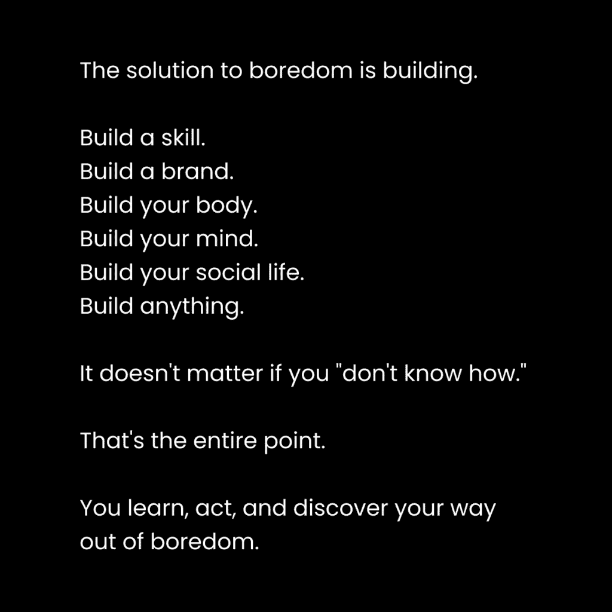

# 如何每天专注于你的目标 12 小时

> 原文：[`thedankoe.com/letters/how-to-focus-for-12-hours-a-day-on-your-purpose/`](https://thedankoe.com/letters/how-to-focus-for-12-hours-a-day-on-your-purpose/)

在普通的生活方式中，你不会找到罕见的结果。

如果你感到迷茫、疲惫，无法专注于实现你承诺给自己生活的目标，有时你能做的唯一一件事就是切换开关。

在矩阵中制造一个故障。

变成一个完全不同的人。

一次性改变你的习惯。从你的生活中移除每一个干扰。开始创业。建立项目。每天工作 12 小时，忘记吃饭。回头看，你会发现你在 3 个月内所做的工作比你过去 3 年所做的工作还要多。

你需要一段时间的强度，让你达到一个新的基准。

早上 4 点起床给你带来了 3-4 小时的经验，这是其他人无法拥有的。这是一个完全不同的现实。一个安静的现实。人们还没有醒来。干扰失去了重力。

我不是说你需要早上 4 点起床。这只是拥抱不寻常生活的一个例子。

但如果你的大脑已经开始抵制跳出你痛苦舒适泡的想法，你可能不会从这封信的其余部分中受益。

打开你的心扉或者离开。

### 你已经有了动力

这里有个问题。

你已经可以每天专注 12 小时。

当你在玩游戏或刷手机时，这是自动的。你不需要自律去做它。

但你内心深处知道你正在毁掉自己的生活。

因此，我们需要学习如何创造一个心理、身体和精神的环境，使你能够无缝地工作在你的梦想上。

首先，我们需要理解，12 小时工作日并不总是可能的。你需要处于生活的正确阶段（而且你不能陷入任何阶段）。

第二，我们需要消除那些阻止你将生活视为一个视频游戏的障碍。一个上瘾且有趣的游戏。一个你投入数小时工作并看到生活中实际进步的游戏。

如果你想要彻底改变你生活的方向，请继续阅读。

## 进步的周期

许多人知道我的 4 小时工作日哲学。

许多人——尽管如此，因为人们并不理解这种哲学，他们只是看到了这个想法并紧紧抓住它——知道我不是一个终身坚持某件事的人，因为这限制了成长和发现。

进步是非线性的。

你不会在健身房待上 10 年，每年都建造相同数量的肌肉。你一开始就建造了很多，因为你是个新手。然后你在一致性和强度的周期中建造肌肉。你增肌和减脂。生活发生了，你被抛离了一年。第二年你重新获得动力，并且极端自律，在第 10 年比在第 3 年获得更多。

这同样适用于生产力。

我不相信 12 小时的工作日是你能永远维持的。那太愚蠢了。弊端显而易见。过劳。忽视生活的其他领域。而且没有东西可以工作。

12 小时的工作日不应该被强迫。

任何工作都不应该被强迫。

如果是这样，改变你的工作（或改变你的想法。）

就像狮子狩猎和休息一样，我们将在工作中复制这一点。

### 1) 困惑

<picture fetchpriority="high" decoding="async" class="wp-image-2244"></picture>

有四个进步周期。

你可以像看待一本书的章节一样看待这些。

第一个周期是困惑，或者感到迷茫和困惑。

你故事的开始。你还没有设定场景或找到你的使命。

你不能工作 12 小时，因为你没有东西可以工作。你不知道下一步该做什么。

大多数人处于这个循环中。他们被困住了。他们不允许自己感到无聊，因此他们用即时满足和廉价的多巴胺填满自己的头脑。这是不好的，因为它会让你的大脑认为你在取得进步。显然，你没有追求更多事物的自然欲望。

通过变得好奇，你可以摆脱困惑的循环。

如果你在这方面有困难，我们将在下一节讨论进步的障碍。

### 2) 好奇心

你梦想生活的书中的下一章是好奇心。

你在生活中识别出一个问题。

你会深入挖掘它如何将你拖入混乱。

工作。账单。迟钝。不健康。缺乏社交技巧。无论是什么。你有很多问题可以解决。你只是分心。

你变得好奇并渴望解决方案。

在这一点上，你的思维看到了视角的关键转变。

你开始注意到信息，这些信息强化了新的目标，试图塑造你的身份。

你开始让自己接触新的环境。

例如，如果你对你的工作如何通过长时间工作和低工资阻碍你生活的其他方面感到厌恶，你开始注意到社交媒体上的商业机会，或者你开始寻找副业来追求，或者你决定最终开始投资或预算。

在好奇心阶段，你的任务是尝试一切，看看什么能坚持下去。

光鲜事物综合症是好事。

但只有当它指向你未来的积极目标时。

阅读更多书籍。加入新的数字社交圈。观看新的内容。购买课程。建立项目。尝试一切。让想法在你的大脑中积累，直到你获得足够多的清晰度，全力以赴于那一件让你无法自拔的事情。

然后，进入一个强烈的季节。

### 3) 强烈

故事的高潮。

主要战斗。

你生活中最有意思和最有成就感的一部分。

3-6 个月的时间在模糊中度过。纯粹的流动状态。完全专注于实现一个有意义的目标。

在健身中，这是你饮食和训练有纪律的时候。你只考虑这些。

在关系中，这是蜜月期。你只想与一个人建立联系。

在商业中，这是构建和推出新产品或进行写作狂潮。两者都导致增长和收入的新的高度。

这就是当你拉长 12 小时工作日的时候。

在任何其他阶段强迫它们都是愚蠢的。你最终会做低质量的工作，同时让生活的其他方面滑坡。

当然，这个阶段可以很快变得危险。

你必须知道何时退出困境。你也必须知道如何过渡到那些你建立的新习惯。

不要试图将大量工作做到发胖的程度。

不要等到你变得瘦弱并开始失去肌肉时才进行削减。

不要对关系过于痴迷，以至于你变得依赖和绝望。

不要试图提高收入并破坏你的品牌声誉。

知道何时降低到新的基准并维持你所取得的进步。

### 4) 一致性

不，一致性不是一切。

一致性是一个保持进步的工具，而不是取得进步的工具。

停滞不是保持进步。停滞是死亡。

保持内容创作的一致性不会让你走得太远。你必须变得好奇，并尝试新的角度和策略。当你找到正确的方法时，你加倍投入，看到你见过的最大增长（这就是我在几个月内通过 YouTube 增长 200K，在 Instagram 上增长 1.2M 的方式）。你找到一个策略并充分利用它。但意识到这些策略不会永远有效。无常。

你工作中的这个一致性阶段是你降低到 4 小时的高优先级工作。足够的时间为下一个强度阶段进行实验，足够的时间保持比上一个宏观周期更高的基准。

在推出后一个月内我的收入激增到 70 万美元，我无法维持所有这些。并不是说对我来说不可能，我只是没有维持那个水平的正确基础设施。相反，它将我带到了一个新的更高的基准，我确保执行了维持那个水平所需的优先任务。

对于我的工作来说，那些任务包括每天写作 2 小时，管理业务另一小时或两小时，以及构建新的项目，如书籍或产品，直到下一个强度季度的到来。

这个一致性周期很重要。

这是当你生活忙碌时如何在健身房保持你的进步。这是你在神经化学鸡尾酒消退后如何培养关系。

重要的是——如果你没有经历过其他周期，你就没有东西可以保持一致性。

如果你陷入了感到迷茫的循环，那是因为你的思想被阻塞了。

## 为什么你无法轻松地每天集中精力 12 小时

我们不要浪费时间。

你无法集中注意力，因为你的思想、生活和优先事项一团糟。

而你对此没有采取任何行动。

### 1) 移除集中精力的障碍

集中精力是关于移除任何阻碍集中的事物。

你感到迷茫、分心和精力不足，正是这个原因。

当你感觉到无聊时，你就用最近的慰藉来填补它。

当你感觉到焦虑时，你就做同样的事情。

你的心智正在引导你走向更好的生活，但你没有听从这些信号，而是试图麻木自己无法成为一切可能成为的人的痛苦，这从长远来看只会使情况变得更糟。

有几个阻碍让你感到迷茫：

**目标**

你感到迷茫是因为你缺乏目标。

你不知道你在解决什么问题。你不知道你在追求什么目标。你不知道你在比你自己更大的整体中的角色。

你的心智被训练成专注于社会分配给你的目标。你的道路已经确定。上学，找工作，退休。你最终在生活中拖拖拉拉，感到无聊，因为你不在乎那些事情。你用懒惰和快乐来填补你的无聊，而不是朝着自己的目标前进。

你需要让自己感到无聊。

你需要让自己接触更高的潜力。

你需要放下一切，看看什么会留下痕迹。

你需要静下心来，这样你才能捕捉到一丝愿景。

**环境**

你的环境塑造了你。

但大多数人忘记了他们完全控制着自己的环境。

如果你被周围的人、意见和物理及数字世界中的干扰所包围，难怪你无法集中注意力。

勇敢地撕下创可贴。

抽出一整天，字面意义上地扔掉任何（1）不重要和（2）分散你注意力的事物。不要犹豫。

**新陈代谢**

你缺乏动力，因为你一次吃得太多。

如果我一天中作为 225 磅重的男子吃任何超过 300-600 卡路里的食物作为一餐，我的专注力就会受到极大的影响。

尝试间歇性禁食。

尝试小餐和大餐。

如果你吃得太多，你的身体就会从你本可以用以专注的能量中抽取，并将其用于消化。

工作完成后，用一顿丰盛的餐点奖励自己。

**知识**

你之所以迷茫，是因为你不知道现在该做什么。

你投射到未来你想要的样子，卡在那里，开始担心旅程将有多长、有多难。

如果你迷茫，就去学习。

当你有方向时，就要行动。

当你需要学习时，停止尝试行动；当你需要行动时，去学习。仅此一项就能解决你 99%的清晰度问题。

### 2) 将你的思维从深渊中拉出来

一切始于身份。

形塑你世界观的思想网络。

由数十年的社会条件塑造的视角，使你渴望你所渴望的东西。

如果你想要热爱追求你的梦想，你的思维必须反映出这一点。

这不能是某个你听起来喜欢的主意。它必须是*你自己的样子*。

你如何改变自己？

重新编程你的思维。

摆脱你当前的生活方式，让自己沉浸在那些将逐渐塑造你世界观的信息中。

关注社交媒体上那些有你想追求的目标的人。

收听播客，阅读书籍，并且通过购买课程来实践你的想法，这些课程会逐渐为你提供清晰的想法。

明天醒来，不要做任何相同的事情。

规划一个新的星期。设定新的优先任务。进行新的对话。用新的信息超负荷自己。

### 3) 思考更大，行动更小

你现在处于混乱的状态。

创建秩序取决于你。

你被新的想法所包围，你可以收集这些想法作为你愿景的构建块。然后，你可以一天天地将这些块放在一起，创造你想要的生活。

你需要一个愿景。没有它，按照定义，你将迷失方向。

拿出一张纸，写下：

+   你生活中所有你讨厌的，不再想要的东西（反愿景）。

+   你未来想要的一切。身体。生活方式。地点。心灵。金钱。任何东西。不用担心肤浅。你可以在以后从中创造意义。

在[作家训练营](https://bootcamp.kortex.co)内部，这个确切的过程成为你的品牌。你所有的写作主题都源自于此。

你将每周都会回到这里。

随着时间的推移，你的愿景将越来越清晰。

在你进行这个过程的时候，你正在等待“点击”发生。

一切都变得清晰的那一刻，你便开始了充满活力的季节。

但愿景并不是拼图中唯一的部分。

大目标是为了激励、视角和潜力。

小目标是为了清晰、行动和理智。

### 4) 反向工程你的优先级

一旦你有了最小可行愿景，就做这件事。

将其分解为：

+   10 年目标

+   1 年目标

+   每月目标

+   每周目标

+   每日优先任务

然后，只专注于优先任务。

其他一切都是为了清晰。

你需要测试你完成优先任务的数量、完成时间以及你如何组织你的工作。

我个人喜欢 2 小时的工作块。

我通常可以在那个时间内完成 1-3 项任务。

在块之间，我去散步，去健身房，吃午餐，偶尔阅读。这使得我的日子更加容易消化。

### 5) 每周完善你的生产力系统

每周开始时，我都会进行一次周回顾。

+   上周哪些事情做得顺利？

+   哪些事情没有做好？

+   我感激什么？

+   我的重点项目是什么？

[如果您想在我的工作空间中复制此模板，请使用这个 Kortex 模板](https://app.kortex.co/public/document/883d9246-6dde-4794-9f54-92b8ff07d502)。

如果你无法访问，请加入等待名单，你很快就会收到。

简洁明了，你可以在 5 分钟内做到这一点。

这一步很重要。它照亮了（1）你应该添加到你的愿景和反愿景中的内容，以及（2）本周可以做出哪些小的改变以获得更好的结果。

如果你坚持这个过程，你将在 6-12 个月内取得的进步会让你感到震惊。

– 丹
