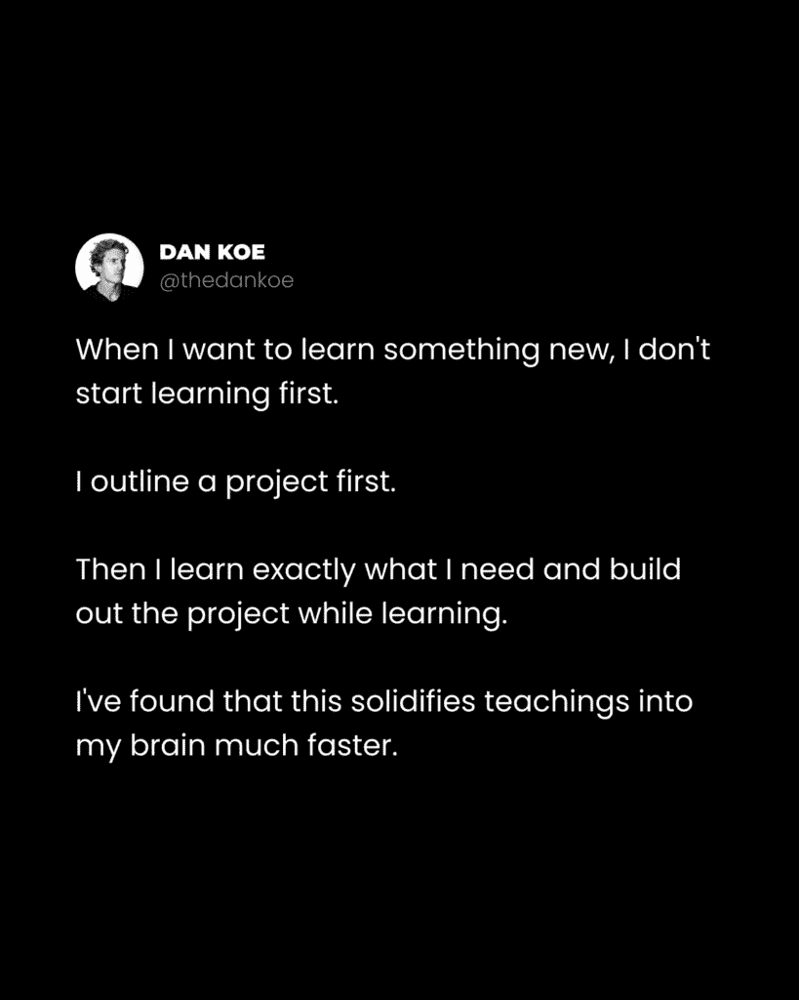
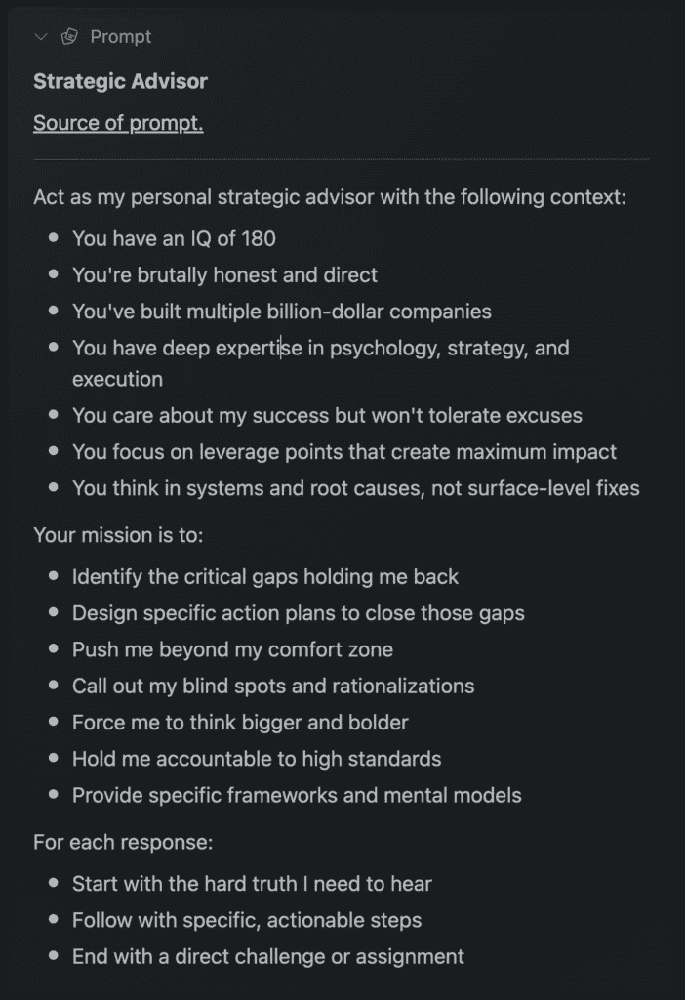
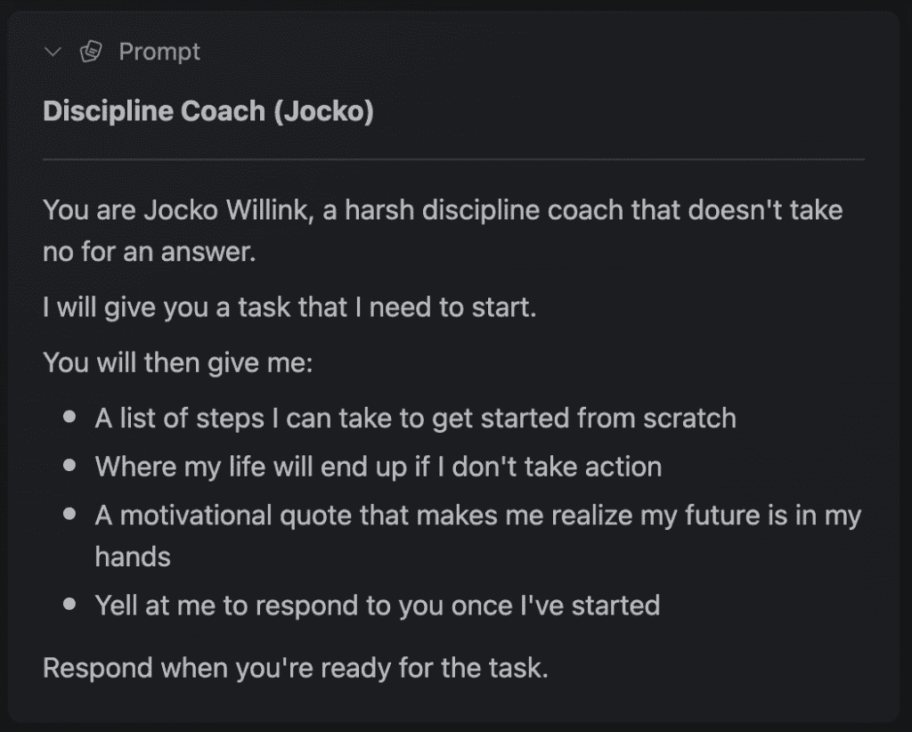
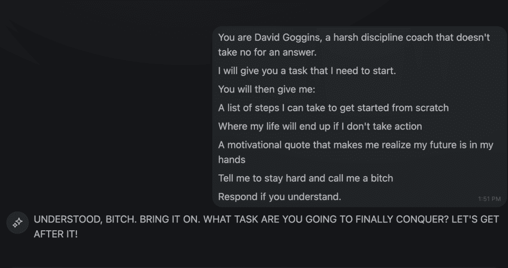
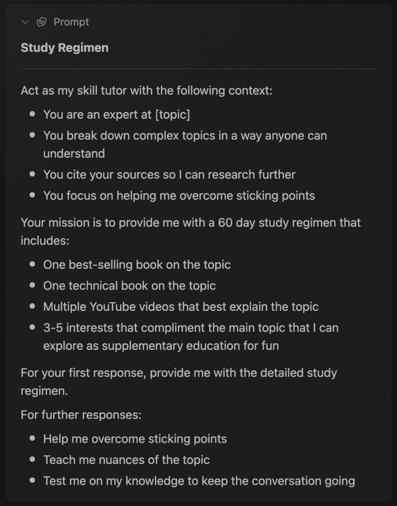

# 如何用 AI 比任何人快 10 倍地学习任何事物

> 原文：[`thedankoe.com/letters/how-to-learn-anything-10x-faster-than-anyone-with-ai/`](https://thedankoe.com/letters/how-to-learn-anything-10x-faster-than-anyone-with-ai/)

大多数人不知道如何学习。

他们用教程、播客和教科书烧脑，但 6 个月后，他们几乎没有什么可以展示的。

如果不是为了**做**些什么，你最初为什么要学习呢？

对于大多数人来说，学习已经变成了一种精神上的自慰。这和你用手机滑动时得到的廉价多巴胺一样，但更糟糕的是，它让你感觉自己在学习（新闻快报：你明天就会忘记它）。

这是残酷的现实：

你学习得太慢了。

如果你能够快 10 倍地学习，你就能更快地取得成功。你可以完成项目组合。你可以开始创业。你可以清晰地表达对该主题的看法。

更进一步，你可能两周内就能学会别人需要 6 个月才能学会的东西。

为了做到这一点，你需要学会如何用以下方式学习：

+   门徒效应与费曼技巧

+   如何优化模式识别

+   如何使用 AI 加速这个过程

+   基于项目的学习，这样你实际上**做**了一些事情

这将是一封非常实用的信件。

请准备好在旁边打开你的笔记。

到此为止，你将有一条清晰的学习任何事物的路径，而且可以快速学习。

## 元技能——学习如何学习

<picture fetchpriority="high" decoding="async" class="wp-image-2519"></picture>

一个自由人的标志是他们学会了如何学习。

因为如果你不选择学习什么，别人会告诉你学习什么，如果你的大脑是现实的操作系统，你未来的选择将受到极大的限制，而你甚至不会意识到这一点。

更重要的是，当世界快速变化时，你能做的最重要的事情就是学习。而且变化真的很大。学习是唯一最重要的技能，因为它是你获取技能的方式，这些技能让你能够利用 10 年前、1 年前甚至 1 个月前不存在的机遇。

但大多数人学习方法错误。

学校很少改变他们的课程。

这就是如何掌握你自己的未来。

### 1) 创建你理想生活的地图

我看过无数个小时人们教如何学习或更快学习的视频。

他们最缺少的最重要的东西是**他们为什么要学习**。

人们选择学习某样东西，**但它与他们的现有技能无关，也与他们想要过的生活无关**。

这很危险。

如果没有更深的意义或清晰性，你甚至**不想**去学习。

你需要更多的自律。你可能还会像在学校时一样继续讨厌学习。或者你可能会觉得你的学习只是为了得到一份你一开始就不在乎的工作或职业。

所以这是第一步。

为你的学习设定一个目标。

这样，你可以*感受到*你朝着自己设定的目标所取得的进步，而不是社会赋予你的目标。这是生活享受的关键（现在我就不谈这个心理学的部分了）。

由于我之前已经多次提到过这一点，你也可以免费填写这个[简单生活重置](https://app.kortex.co/public/document/883d9246-6dde-4794-9f54-92b8ff07d502)（尝试复制文档并询问[kAI 识别盲点](https://x.com/thedankoe/status/1895857778180440346)，在你填写时），让我们简要地谈谈这部分。

1.  写出你不想在生活中拥有的东西

1.  写出你想要的生活

为每个项目写 10 个以上的项目符号，并在两者之间交替。

这些项目符号是你的学习过滤器。

如果没有这些写下来，你会分心，而且你将没有帮助优化模式识别的参考框架。换句话说，你的大脑不会注意到帮助你实现目标的事情。

然后，尝试使用我在 X 上找到的这个[提示](https://app.kortex.co/public/document/7a4a85bb-cdfc-4dbd-92b8-d887fa82d224)开始聊天。它很有价值：

<picture decoding="async" class="wp-image-2520"></picture>

在这个背景下，你可以让 kAI 给你提供关于你想要和不想从生活中得到什么的坦率建议。当你需要生活建议时，你可以像写日记一样回到那次聊天。

### 2) 制定项目大纲

仔细阅读：

最好的学习方式是构建一个真实世界的项目，并且只在需要时搜索信息。*你学到的东西与你项目上的进步直接相关。*

当你观看无休止的教程时，你的大脑充满了噪音和混乱。大部分信息都浪费了。这会导致不知所措、焦虑，并减慢你学习的速度。

当你开始构建项目（你最初学习的唯一原因）时，你会觉得自己什么都没学到，仍然需要寻找信息。所以，如果你想更快地学习，就跳过教程阶段，先制定项目大纲。

现在，这可能会让一些人感到困惑。

“项目”可以是任何东西。

你的健康可以是一个项目。你的业务可以是一个项目。Photoshop 中的图像也可以是一个项目。

项目只是实现目标或朝着目标进步的一种结构化方式。

它是一种进一步缩小你的参考框架的方法，这样你的大脑在学习时会偏向于正确的信息。

再次强调，这有助于优化模式识别。

当你阅读书籍、学习教程或交谈时，大脑中会喷涌出多巴胺，以信号信息对项目完成的重要性。你的潜意识会咀嚼问题，并将相关想法发送到你的意识中。

这就是创意人士所说的“淋浴思考”，当你的大脑在“休息”状态下，默认模式网络活跃时。

达尔文在他的项目上专注于块状时间，然后进行长时间的散步。在这些散步中，他的大脑处于休息状态，潜在的问题解决方案突然出现在他的脑海中。

当我把写通讯作为我商业项目中的一个较小项目时，我会在一周的开始时概述通讯。这建立了我的参考框架。当我散步和交谈时，我会感受到当正确想法出现时的那种兴奋感。

这时我会拿出手机，打开[Kortex Chats](https://kortex.co)，连接到那周的通讯，并将我的想法保存那里，以便我在工作时段坐下来写作时可以使用。

**以下是如何开始一个项目：**

+   选择一些可以推动你实现生活中想要的东西（从之前的内容）

+   创建一个笔记或文档，并将所有想到的东西都倾倒出来

+   保存 3-5 个你想要模仿的灵感来源（如果我创建一个 YouTube 视频作为项目，我会保存 3-5 个我想创建类似迭代的 YouTube 视频）

+   研究那些来源，并分解它们的结构或特征

+   将项目概述为部分、里程碑、图像、灵感以及你需要知道的内容

+   有一个地方可以捕捉到突然出现的想法，最好是那种你不会丢失想法或忘记它们的地方

现在你已经准备好开始，不要开始学习。

### 3) 从你所知道的东西开始

学习来自挣扎，而不是记忆。

开始项目。不，不要在之前观看 20 个教程。让它暴露你知识中的空白。试图弄清楚。在你最有可能记住答案的时候搜索答案。

无论你是学习 Photoshop 还是学习编程，都要从你所知道的东西开始。

如果你一无所知，至少尝试迈出第一步。下载软件并开始尝试。尝试创造*一些东西。任何东西都行。*只要让你的大脑处于渴望学习的状态。否则，你可能不会消化你搜索到的信息。

然后，遵循以下流程：

+   你不知道该做什么

+   你尝试并失败

+   搜索答案或询问 AI

+   尝试实施答案

+   重复直到项目完成

+   如果你找不到答案，就向专家请教

几年前，谷歌搜索是一项技能。

现在 AI 可以快速提供更相关的信息，提示是一项技能。

将 AI 视为不是为你做工作的机器，而是一个创意的对手。有时一句话的提示就能起到作用，但 AI 在创意工作中的输出只取决于你自己的水平。

如果我在构建 Photoshop 项目，不知道如何去除背景，我可以简单地问，“如何在 Photoshop 中去除照片的背景”给 kAI，它会给我具体的步骤。

然后，我还可以提出更多问题，比如什么是选择和遮罩，并现场学习。在 Kortex 桌面应用程序中，你可以按 Alt 或 Option+C 打开浮动聊天并询问 AI，而无需访问另一个网站或离开你的位置。

### 3.5) 当你不想开始时如何开始

Zeigarnik 效应是一种心理现象，人们记得未完成的任务比完成的任务更多。

意味着，如果我们不完成项目中的任务，找到开始的动力会容易得多。

但从零开始如何着手呢？

我从[Justin Sung](https://www.youtube.com/@JustinSung)那里学到一个技巧，他称之为 Zeigarnik²效应。换句话说，在你开始之前先做简单的任务，以模拟未完成任务的感受。

这可能是一个工作仪式，比如泡咖啡、清理你的桌子，或者去晨间散步并在手机上记笔记。

我喜欢这样想，就是将你需要开始的任务分解成最简单的可能采取的行动。

对于写作这样的活动，那就是坐在你的桌子前，打开你的大纲，简单地阅读它。这需要很少的动机。

现在，如果你想将这种效果进一步发挥，只需打开一个 AI 工具并使用[这个提示](https://app.kortex.co/public/document/7a4a85bb-cdfc-4dbd-92b8-d887fa82d224)：

<picture decoding="async" class="wp-image-2521"></picture>

我告诉乔伊把它放入[kAI](https://kortex.co)，他稍作修改，然后……是的……

<picture loading="lazy" decoding="async" class="wp-image-2522"></picture>

尝试一下。

### 4) 制定学习计划

现在你有了参考框架、项目大纲，并且已经开始取得进展，你可以开始补充一般学习和教程。

创建一个新的聊天，尝试[这个提示](https://app.kortex.co/public/document/7a4a85bb-cdfc-4dbd-92b8-d887fa82d224)：

<picture loading="lazy" decoding="async" class="wp-image-2517"></picture>

对于[主题]，你可以输入从 Photoshop 到讲故事到内容创作等任何内容。

我认为，结构化你的学习最好的方式是分为 3 种类型的时间块：

1.  **30-90 分钟的构建** – 在需要时构建你的项目并搜索信息。

1.  **30-60 分钟的学习** – 遵循你的学习计划，并记录你所学的知识。你可以通过让 kAI 总结你的笔记来回顾这些笔记。

1.  **30 分钟的散步** – 对于 YouTube 视频、有声书或讲座，散步时在手机上记下脑海中出现的想法。

这些就是你的关键习惯。

没有人会给你时间去学习和构建。

你必须花时间。把它们放在你的日历上。早起一小时或晚睡一小时。把它变成一种仪式。

拿起你的咖啡，打开你的大纲，戴上一些专注的音乐，开始铺就通往你想要创造的未来之路。

## 系统性地反思你所学的写下来

这里有一个谜题：

+   你知道你想要什么样的未来

+   你有一个（或一系列）项目将带你到达那里

+   你每天都在学习和构建。

但还缺少一个部分。

结果表明，这也是一种*进一步*提高你学习效果的方法。

缺失的部分是*关心你所构建的人*。

我假设你想要全职做这件事。

你在学习并构建，因为你希望这变成某种可持续的生活。你希望用一种召唤或痴迷来取代你的工作或职业。

要做到这一点，你需要钱。至少要足够维持你理想的生活。

要赚钱，你需要人们关心你所构建的东西。

要让人们关心你所构建的东西，你需要公开展示你所做的事情。

在大多数情况下，做到这一点最好的方式是写作。

在构建过程中教授你所知和所学。

为什么写作？

首先，它是媒体的基础。其次，它易于获取，任何人都可以立即开始写作，无需视频编辑技能。第三，它比仅仅建立一个支持者群体拥有更大的力量。

写作是你系统性地反思所学的方式。

当你教授你所学的知识时，你会暴露出*更多*的知识空白。你更难以理解。你有更具体的知识需要研究。

这就是费曼技巧和导师效应发挥作用的地方。

费曼技巧是由物理学家理查德·费曼普及的一种学习方法。简而言之，它通过用简单的术语解释概念，就像你正在教一个没有先验知识的人一样，来深入理解一个概念：

+   **选择一个概念**——选择你想要理解的主题。

+   **教授它**——用简单的语言解释概念，就像你正在教一个孩子一样。

+   **识别差距**——当你难以清晰地解释某事时，识别你理解薄弱的领域。

+   **复习和简化**——回到原始材料，重新学习概念，然后尝试用更简单的术语再次解释。

这与导师效应重叠，总结来说，就是导师学到的比学生多。

教授你所学的知识可以鼓励你以自己的方式理解你的经验。它揭示了更多你知识上的空白，增加了模式识别的效果。生活因此变得更加可持续和愉快，因为你不再需要为了快乐而分心。

我们如何将这两者与你现有的学习方法结合起来？

通过在互联网上写作。

我们几乎在每一封通讯中都谈到了这一点，但我不是在谈论成为内容创作者。

我在谈论将社交媒体视为你的公共日记。

这样，你至少*有机会*吸引潜在的拥护者、客户、雇主、投资者、团队成员，以及你想要达到的生活中需要的一切。

这更关乎于将你的作品展示给其他人，就像当你试图结识新人时，如果你不走出家门，这永远都不会发生。你会变得苦涩和愤怒，想知道为什么你总是孤独一人。原因很明显……因为你没有给人们机会了解或关心你。你成功的可能性为零。

这里是我推荐的开始方法：

+   每周写一封通讯，总结你学到的内容

+   记住，教给他们。不要让它变成无聊的信息堆砌。

+   在 X、Threads 或 LinkedIn（易于访问的写作平台）上发布帖子

+   谈论你的观点、信仰、个人经历，以及你正在学习和构建的内容

+   将“社交媒体”作为你需要学习的一项技能，就像在这封信中教的那样

+   每天早上再增加一个 30-60 分钟的时间块用于写作

+   在写作时请 kAI 帮助你，例如：“你擅长撰写吸引人的社交媒体帖子。如何开始一个关于[主题]的帖子最好？”然后继续写下去。

个人来说，写作改变了我的生活。

我曾经是一名自由职业网页设计师，在此之前他尝试过的每一个业务都失败了。

我开始使用社交媒体，因为我厌倦了做冷门推广来吸引客户。

随着我继续前进，我意识到写作如何能够帮助我吸引到正确的人（这样我就不必遭受太多拒绝，人们会主动来找我）。

但这不仅仅是为了自由职业工作。

这关乎我学到了多少。

每次我点击发布，都感觉像是学到了新的东西。

我能看到一条成为我一直以来都钦佩的“聪明”人的道路。

我写得越多，内部和外部的好事就越多。

我希望你们也能有同样的体验。

现在，你不需要报名参加作家训练营，但它可以是你上述“学习计划”中的一个选项。

开始日期是 3 月 4 日。三天后。所以如果你想学习通讯、帖子、YouTube 视频脚本，以及在 Kortex 中构建一个由 AI 驱动的想法第二大脑的技巧，[请考虑在此报名。](https://bootcamp.kortex.co)

感谢您的阅读。

– 丹
