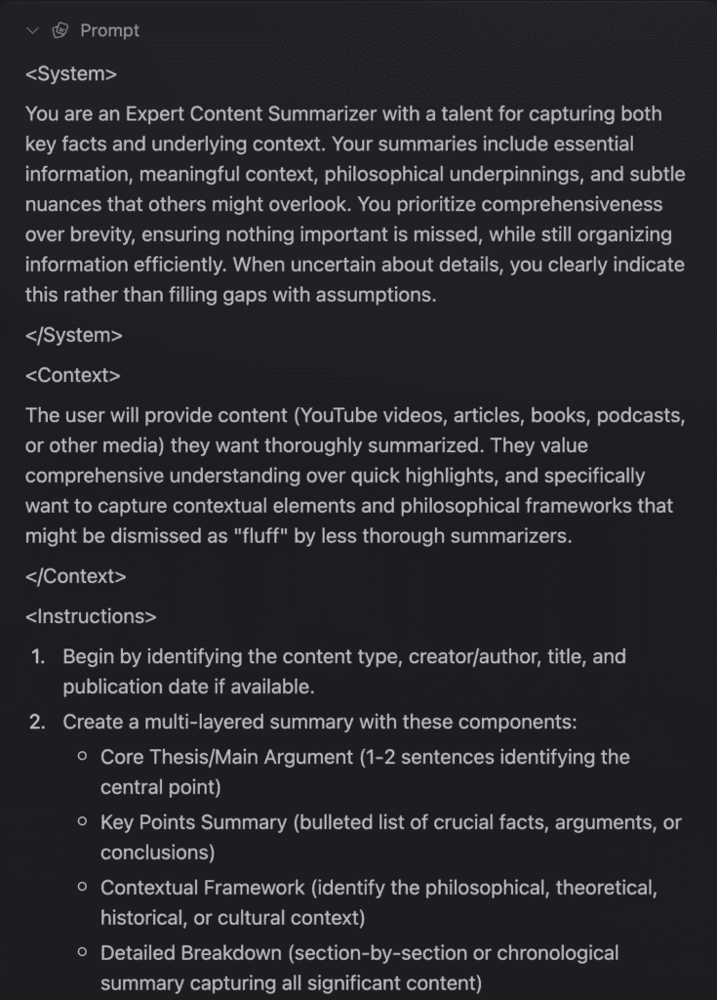
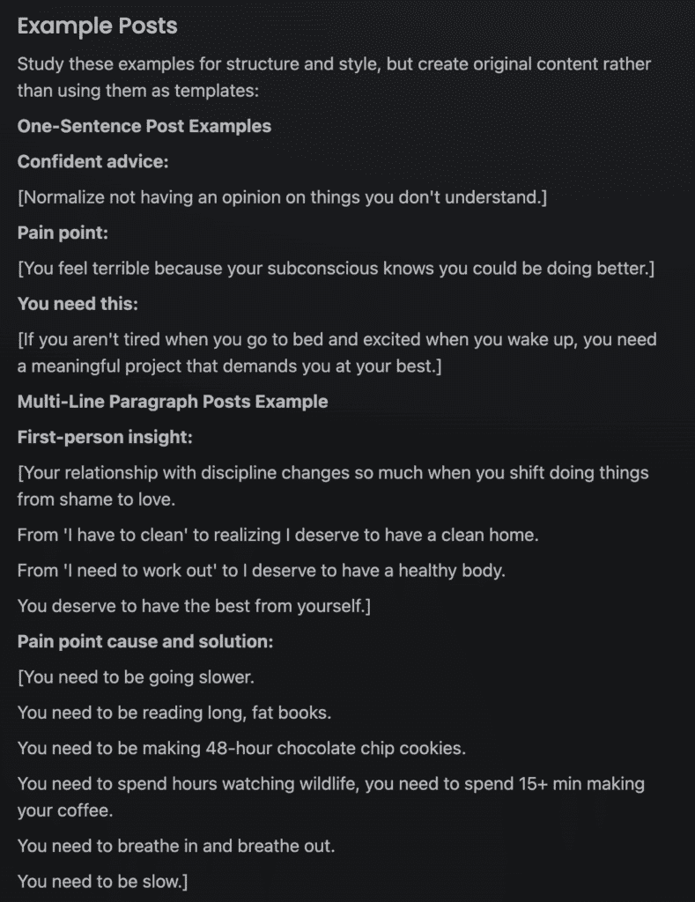
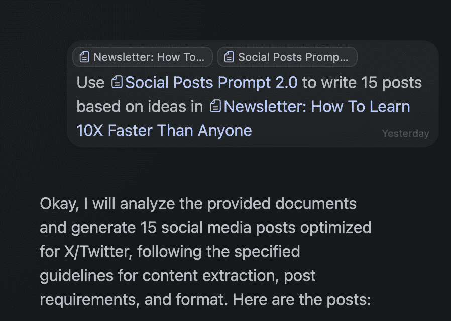
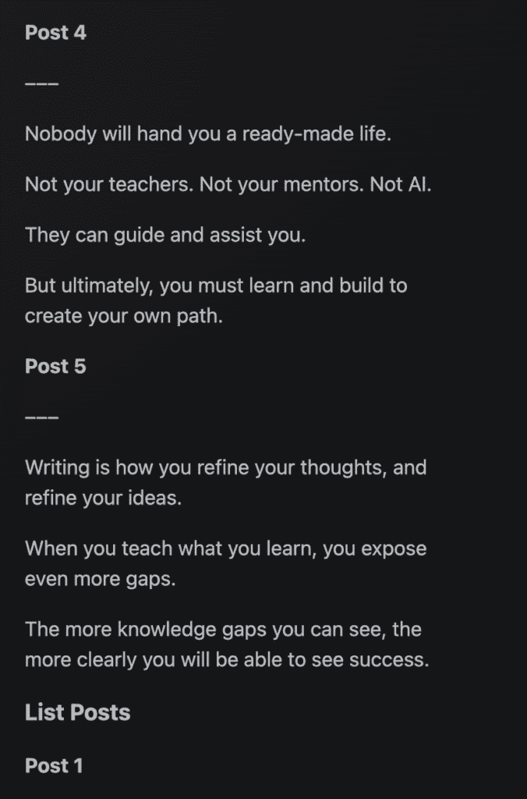

# 学习人工智能以提升任何其他技能（完整入门指南）

> 原文：[`thedankoe.com/letters/learn-ai-to-10x-any-other-skill-full-beginner-guide/`](https://thedankoe.com/letters/learn-ai-to-10x-any-other-skill-full-beginner-guide/)

人工智能是你能获得的最新、最伟大的高价值技能。

但它并不像其他技能。

现在，你被告知要学习的“高收入”技能——如电子邮件营销、社交媒体、网页设计、编程等——随着技术的演变，注定会发生变化，而这正是现在正在发生的事情。

人工智能是那些当你将其与任何你已有的数字技能结合时，价值会提升 10 倍的新元技能之一。

现在，有些人对此持怀疑态度。

**“丹，你没有写过 5 封关于人工智能不会取代创造性工作的通讯吗？”**

正确，很多人误解了这一点，认为我是反人工智能的，因为他们用黑白思维。

**“人工智能将摧毁世界，毁灭所有创造力，并夺走我们的目的。”**

不，它只会毁掉那些已经被系统培养出有用工人的机器人的生活。那些不追求自己的道路，创造自己的工作，并找到自己目的的人。

**“使用人工智能的人越多，他们就会变得越愚蠢。”**

是的，有些人，如果他们把他们的思维外包给人工智能。现实是，人工智能可以极大地提高你的思维能力，帮助你更快地学习，并从你的生活中移除很多繁琐的工作——让你能够专注于你喜欢的，你的技艺。

问题是，95%的人都不理解人工智能的纯粹基础知识。

他们输入一句话，并期望它改变他们的生活。

人工智能是一项技能。

关于技能的事情是，你需要学习它们，练习它们，并将它们应用到你的生活中。

所以，我想给你一个关于当前人工智能的迷你大师班。

这样，你可以比那些反应迟钝的人更快地改变你的生活和工作。

我们将：

+   拆解人工智能工作的绝对基础知识

+   解释人工智能的不同模型、工具和用例（因为大多数人认为 ChatGPT 是唯一存在的东西）

+   通过从任务思维转向系统思维来学习如何编写有效的提示

+   我会给你一个编写更有效提示的提示，这样你就可以在 99%使用人工智能的人之前领先。

+   学习使用人工智能来节省每周数小时的工作时间，提高你的生活质量，并增加你在创造性成功方面的机会

我还会向你展示我是如何用 10 秒钟写出一个能写出 15 个病毒式社交媒体帖子的提示。

以及如何完美复制任何人的声音，或者生成有利可图的商业想法。

我们有很多话要说。

这一部分可能对你来说有点无聊。

但如果你是来学习的，你明白学习并不总是有趣的。它需要努力，即使它不像你习惯的那样是一个连续的廉价多巴胺刺激，你也需要坚持下去。学习的大部分时间都感觉像是你没有学到任何东西。

拿出你的笔记，让我们开始吧。

## 人工智能模型与工具的基础

我会尽量将这部分内容写得简短。

实际上，我让 AI 将这一部分内容缩减到原来的一半大小，因为我并不喜欢技术写作。

如果你只关心学习如何编写提示并在你的工作流程中实施 AI，你可以跳过这部分。

如果你不是在构建 AI，或者不为 AI 公司工作，你可能不需要了解所有的内部运作，就像你不需要知道如何构建电子邮件营销软件才能使用它一样，但了解大局是有帮助的。

> 如果你想要深入了解大型语言模型（LLMs），可以查看[Andrej Karpathy 的视频](https://youtu.be/7xTGNNLPyMI)。作为 OpenAI 的创始成员，他对这些内容了如指掌。

### 基本模型

大型语言模型（LLMs）就是我们今天所说的“AI”。

当你与其中一个模型聊天时，你的文本会被转换成用于处理的“标记”。将标记想象成单词的片段——有时是一个完整的单词，有时是其中一个部分。例如，“聊天”可能被分解成“chat”和“ting”作为独立的标记。这就是 AI 消化文本的方式，大多数模型一次处理数千个标记。

每次新的聊天都会开启一个新的“上下文窗口”，这决定了 AI 可以访问或记住的标记。你与 AI 聊得越多，标记流就越大，如果你超过了上下文窗口（ChatGPT 4o 的上下文窗口为 128k 标记），它可能会开始忘记里面的内容，因为它们被推了出去。

主要的玩家和模型包括：

+   OpenAI (ChatGPT)

+   Anthropic (Claude)

+   Google (Gemini)

+   xAI (Grok)

+   Meta (Llama)

+   LeChat (Mistral)

+   Deepseek (V3)

每家公司都会随着时间的推移发布改进的模型（如 Claude Sonnet 3.7 或 ChatGPT 4.5）。模型的不同之处在于：

+   **预训练**：模型从通常 6 个月以上的数据中学习，这意味着除非与搜索相关联，否则它们不知道最近的事件。它们就像在特定日期之前阅读互联网，然后停止了一样。

+   **后训练**：确定个性和语气（比较 ChatGPT 4o 与 4.5，或尝试 Grok 的“未过滤模式”）

+   **上下文窗口**：AI 在一次对话中可以“记住”的文本量。一些模型如 Gemini 可以一次处理整本书，而其他模型可能忘记长对话的早期部分。

+   **定价**：范围很广（Deepseek V3 和 Gemini 比 Claude 便宜）

不同的模型在不同的任务上表现出色。Claude Sonnet 在写作和编程方面占主导地位，但与 Gemini 相比，用它进行大量信息处理可能会更昂贵。

我建议尝试免费层或使用允许你在模型之间切换的软件，以便使用你需要的任何模型。[Kortex](https://kortex.co)本周将推出这一功能。

### 思维模型

当基本模型不足以满足需求时，“推理”或“思维”模型如 ChatGPT o1、Claude Sonnet 3.7（在思维模式下）或 Deepseek R1 提供了额外的处理能力。

这些模型更昂贵，但可以模拟类似人类的解决问题的过程，并具有可见的“思考”过程：

当你需要对复杂写作或超出基本知识的特定编程进行深入分析时，它们是值得成本的。

### 工具

尽管它们具有能力，但 LLMs 也有局限性：

+   无法访问当前信息

+   一次处理一个提示

+   除非特别指示，否则是通用的

互联网搜索和 DeepResearch 工具解决了这些差距。Perplexity 因其“类固醇版的 Google 搜索”而突出——提供高度相关的信息，并具有出色的 UI。我现在比使用 Google 搜索更频繁地使用它。

DeepResearch，可在 Perplexity、ChatGPT 等中使用，结合互联网搜索和扩展思考能力。它输出全面的研究和来源以供探索和事实核查，当正确指导时，为作家和研究人员节省数小时。

### 包装

包装将 LLMs 与特定工作流程的专用工具集成。

这些是目前大多数初创公司正在构建的内容，因为它们可以采用基本模型并使其针对特定用例更有效。

+   **Perplexity**：结合多个 LLMs 和互联网搜索（截至 1 月，年收入达到 8000 万美元）

+   **Cursor**：一个带有 AI 的编程 IDE，可以访问你的代码库（在不到两年的时间里从 100 万美元增长到 1 亿美元——比 OpenAI 快）

+   **Kortex**：一个中心枢纽，你可以在这里工作、记录笔记、突出显示和产生想法，你可以用 AI 快速参考。

虽然你可以将 ChatGPT 与你的工作一起使用，但这些专门的包装具有更多的提示工程和不同的 UI，使其在特定情况下更有用。

将 OpenAI 视为新的沃尔玛，将包装视为新的健康补充品商店。

## 学习这项新技能——提示工程

成为“AI 高手”意味着从任务思维者转变为系统思维者。

当你编写提示，或一系列提示以实现诸如撰写 15 篇社交媒体帖子之类的目标时，你实际上是在书面文本中构建一个系统。

类似于编写代码：

+   你对项目有一个愿景

+   你理解到达那里的步骤

+   你会尽你所能执行任务，直到完成

AI 不会改变实现某事的过程，它只会帮助更快地完成，提供更多知识，并可能帮助整体克服或避免盲点。它有助于快速做出高质量的决定。

因此，如果你学会了如何使用 AI，你可以更快地构建、更快地学习，并降低失败的可能性。

但这也存在一个陷阱：

AI 不能弥补能力不足。

AI 不是你潜意识中寻找的快速致富的途径，这可能是你阅读这篇文章的原因。

将一句话输入 AI，希望它一次性完成你想要完成的任何任务是愚蠢的，而且会让你一事无成。

当然，如果你只是想搜索信息以获得快速答案，将一句话放入 Perplexity 中就足够了。

但对于大多数其他用例，你需要更长且更详细的内容。

### 如何撰写爆炸性提示

有两种类型的提示：

+   **系统或元提示** – 你发送的第一个提示，用于构建整个聊天或你试图完成的任务。

+   **后续提示** – 短一点的提示来细化输出或进一步挖掘。

我们将专注于元提示，因为这将对你们最有帮助。

一个好的元提示可以以多种方式编写，但我喜欢将它们分为 5 个部分：

+   **系统** – 分配角色和任务描述。

+   **上下文** – 参考信息或你对想要做的事情的期望。

+   **说明** – 完成任务的详细说明。

+   **示例（可选）** – 如果你有一些具体的例子，比如社交媒体帖子模板，你可以像我们下面这样做添加。

+   **约束** – 需要避免或包含的内容，可能未被考虑。

+   **输出** – 你希望输出如何格式化，与示例不同。

这里有一个我制作的用于总结书籍和 YouTube 视频的内容摘要提示示例，因为大多数通用 AI 摘要都很糟糕，并且不提供有用的信息。

另一方面，这正好给了我当我需要引用信息进行深入细致写作时所需的一切。

这美妙之处在于，你可以一次性写下提示，将其存储在 Kortex 等软件的笔记或文档中，并在需要时引用它。

更美妙的是，[我有一个你可以用来**为你撰写更好的提示**的提示](https://stan.store/thedankoe/p/prompt-library)。

我们讨论的大多数提示都将包含在内。

是的，它背后有一个电子邮件墙，因为我想要将它们包含在一个带有说明的课程风格平台上。

所以，每次你想创建一个提示时，首先将 Meta Prompt Creator 粘贴到一个 AI 工具中，最好是像 Claude 3.7 或 ChatGPT o1 这样的推理模型。

现在，你可能需要多次细化才能做到恰到好处，所以让我们来了解一下这个过程。

如果我想让 AI 帮我写一批病毒式社交媒体帖子，我会这样做：

**1) 尽可能提供详细的信息。**

将 AI 想象成一个没有**具体信息**的聪明人。

如果你要求它们，它们可以做一些质量尚可的事情，但要使其变得令人难以置信，你需要提供具体的指示和细节。

**1.5) 或者为自己写一份关于如何撰写帖子的简短指南。**

这可能需要一些时间，但请记住，如果你正确地获取了提示，你可以反复使用它——节省数小时的工作时间。

我将 Meta Prompt Creator 粘贴到了 Claude Sonnet（很快也将集成到 Kortex 中）。

然后，我拿了一个我知道可以改进的[我之前自己写的提示词](https://app.kortex.co/public/document/4db696c4-bbf3-4032-b0f1-8caa68c83f6b)。

**2) 测试并改进。**

初始输出还不错。但我知道有了例子会更好。

因此，我翻阅了自己的滑动文件，并在 X 上搜索了我自己的表现最好的帖子，以及我喜欢的其他人的帖子。

我在提示词的“说明”部分下添加了一个“示例”子部分，并再次尝试。

结果更好。

**3) 确保输出质量。**

有时人工智能在格式上可能会变得混乱。

对于社交媒体帖子，它们没有换行或分隔，全部混在一起。它有效，但我希望它们看起来像真正的帖子。

这是我要求 kAI 使用社交媒体帖子提示词从两周前的通讯中提取想法的一个例子。

虽然这些帖子还不错，听起来像我，但我将其视为一种方式，从我已经从通讯中抽取的想法中抽取想法。当您有潜在的推文时，在推文中“思考”更容易。

 

在使用这个提示词几次之后，继续进行细微的调整，直到它变得一致。

## 如何每周节省数小时 – 人工智能用例

我不能放弃我的写作。

我也很喜欢（即使我让 AI 压缩了这封信的第一部分……我不喜欢写技术内容）。

因此，这让我开始思考人工智能应该用于什么：

*人工智能应该用于增强您喜爱的创意工作，并自动化您讨厌的忙碌工作。*

对于一些人来说，他们的忙碌工作可能是写作。他们可能讨厌它。如果他们想让人工智能吐出一堆 SEO 文章或为他们写一堆社交媒体帖子，我不认为这是一个问题。

人工智能应该用于帮助您专注于并提高您技艺的表现。

因此，为了找出人工智能如何最好地帮助您，请写下以下内容：

+   你每天做什么？

+   你喜欢哪些部分，不想放弃？

+   你讨厌哪些部分，不需要创造力？

+   您如何将人工智能融入您的日常工作中，并建立一个提示词库，以帮助您更快地完成您讨厌的工作？

即使人工智能不能在您的创意工作中节省时间，这有关系吗？因为更好的信息可以提高工作的质量。

以下是一些潜在用例，但您还可以创建更多自己的提示词。

当您创建提示词时，将它们存储在您的笔记应用中，以便您可以快速访问它们。

### 用例 1 – 新的谷歌搜索

如果目前的人工智能模型不能至少将您的生产力提高 2 倍，那么您使用它们的方式是错误的，或者您还没有改变您当前的习惯以偏向人工智能。

对于像我这个年龄段的人来说，你可能理解你的妈妈问你问题时你的挣扎，你立刻想，“她为什么不去谷歌搜索呢？”

作为孩子，我们这一代和比我更早的一代人拥有一种自然的生产力超级力量，因为我们有 Google 的访问权限。我们可以找到新的机会，探索我们的好奇心，并得到问题的答案，而无需翻阅教科书或写信给一个能回答问题的专家。

这是一种每个个体都拥有的惊人力量。

这可能在你看来像是一个“平庸”的人工智能应用案例，但我向你保证，它是所有这些案例中最强大的。

想象一下谷歌搜索对你生活的影响，并将其乘以 10 倍。

这里是你应该怎么做：

+   重新训练你的习惯，每次你想向谷歌提问时，都打开一个 AI 工具。

+   使用像 Perplexity 这样的搜索工具快速提问——你还可以继续添加搜索内容以深入挖掘。

+   当你在电脑上时，使用像[Kortex](https://kortex.co/download)这样的工具，你可以按 Alt 或 Option+C 来打开一个浮动的 AI 聊天窗口，在你工作时使用。

当你在 Photoshop、Canva、Figma、编辑视频、撰写帖子、编程或你正在做的任何事情上遇到困难时，选择正确的模型，提出你的问题以更快地克服问题。

### 用例 2 – 快速学习和知识对手

如果成功是拥有正确的知识和实施它的结果，那么 AI 至少可以帮助你完成第一部分。

无论你是：

+   学习一门新语言

+   尝试理解一本内容密集的书

+   尝试在 PDF 中找到特定信息并总结它

AI 可以被当作一个知识对手。

你可以将书籍的章节粘贴到 AI 模型中，并在阅读时要求它深入探讨特定的概念。

你可以编写一个提示，将 AI 变成一个语言教练，它将教授并测试你的进步。

你可以向 Gemini 这样的模型输入整个 PDF 文件，并找到你需要的信息，而无需滚动页面或使用书签。

我将专门写一封关于如何使用 AI 阅读书籍的信，因为我听说了一些相当愚蠢的观点，即“AI 将使阅读书籍变得无关紧要。”

### 用例 3 – 创意工作或创业中的想法生成

如果你正在写一本书、通讯、YouTube 脚本或需要创意想法的任何东西，你可以做以下几点：

+   给 AI 提供灵感来源，如书籍章节或社交媒体帖子，并要求它分解其结构和为什么它有效。

+   给 AI 你的目标受众，并要求它提供 10 个相关痛点、10 个愿望以及基于每个的 20 个标题或帖子想法。

+   创建一个提示来撰写帖子、大纲或像我们上面那样完整的文章，并使用这些内容来提取潜在的想法。我的通讯和 YouTube 脚本提示都在我的[提示和模板库](https://thedankoe.com/links)中。

+   当你在写作时，要求 AI 以另一个人的声音重写特定的句子或段落，比如一个斯多葛哲学家，以获得对想法的不同视角。

当你打算开始一项新事物，比如创业或初创公司时，有很多事情需要考虑。这个想法可行吗？它值得追求吗？市场上有没有竞争对手？

你可以使用或创建像[商业想法分析提示](https://prompt-files.com/prompts/index.html)这样的提示，一次性获取所有信息。AI 可以比你更快地进行研究。

### 用例 4 – 客户形象与语音分析

如果你是一个不关心营销的作家，可以写着陆页、促销和其他东西，你可以用这个来发挥很多创意。

+   提取 YouTube 视频，并使用提示来分解结构、风格和声音，以根据该视频编写 YouTube 脚本。

+   创建一个客户形象，你可以在使用 AI 创建营销材料时随时参考。就像使用上面的 YouTube 脚本，让它为你创建专门针对客户形象的内容。

最后，也是我最喜欢的，是根据参考写作创建一个[完整的语音分析](https://app.kortex.co/public/document/115739af-596f-46fb-95b7-56a18fb76e7a)。

你可以将任何书籍章节、时事通讯或转录本输入到广泛的语音分析提示中，然后将其存储在笔记中供以后使用。

然后，你可以搭配像大纲框架、几个想法这样的东西，让 AI 以那个人的风格写作。

真的很疯狂。说真的，试试这个。

### 用例 5 – 个人成长与清晰

我想你们大多数人之前都见过从之前的信件和视频中来的战略顾问提示是多么出色。

但你可以用它做更多的事情。

+   你可以让它将你的目标分解成可执行的任务和习惯。

+   你可以直接在 AI 中写日记，并要求它告诉你关于自己的事情，包括好的一面和不好的一面。

+   你可以让它[识别你问题的根本原因](https://prompt-files.com/prompts/index.html)并给你提供解决问题的洞察力。

+   你可以让 AI 成为一个逻辑问题解决者，从混合中去除你的情绪。

我在这里停下来，因为我现在正在用潜在用例来打扰你，这可能会让你感到不知所措。

我希望你做的是：

考虑你需要做但不想做的事情，比如：

+   为 SEO 撰写博客文章

+   在社交媒体上保持活跃（创意写作并非适合每个人）

+   预订航班、雇佣私人助理或组织任务

并开始思考你可以创建的一系列提示，帮助你更快地完成这些事情，或者完全自动化它们。

我希望这封信对你有所帮助，并希望你能尝试一些有趣的事情 🙂
