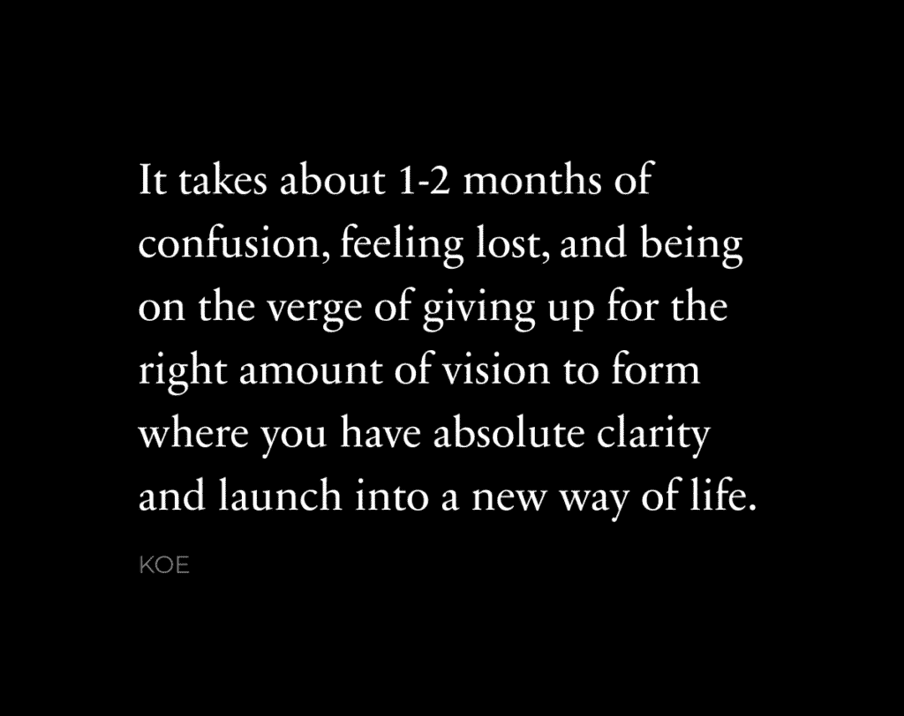

# 如何进入全新的生活

> 原文：[`thedankoe.com/letters/how-to-launch-into-a-completely-new-life/`](https://thedankoe.com/letters/how-to-launch-into-a-completely-new-life/)

首先，了解生活是分章节展开的。

每一章都是一个可预测的四个阶段的序列：

+   **停滞** – 你不知道该做什么或你想要什么。

+   **愿景** – 一个面向未来的图像形成，你开始走上一条新的道路，动力逐渐积累。

+   **流动** – 你无法将自己从追求的目标中抽离出来。

+   **阻力** – 指数级进步不会永远持续，但你不想让它结束，这往往对你自己不利。

但大多数人会陷入停滞阶段。

你的一生都在被训练去遵循一个剧本。

你习惯了学校和工作的线性结果。

你习惯于别人给你提供确定性。

但当谈到过上不寻常的生活（因为这是获得不寻常结果的唯一方式）时，你将“感到迷茫”视为一个坏兆头。所以你跳船并回到为你规划好的舒适生活中，而那个系统只关心自己的利益。

这可能也是你阅读这篇文章的原因。

你讨厌想到自己最终会像其他人一样。

但这意味着你必须独自一人。

你感觉像是在一片茂密的森林中迷失了方向。你无法*看到*树木后面的任何东西，所以你没有意识到有一条距离 5 码的路径可以通往山顶的顶峰。

在这种情况下，你能做的最糟糕的事情就是什么都不做。

这是你如何摆脱困境的方法：

> 顺便说一句，我创建了一个[AI 提示，可以将你的生活变成一个视频游戏](https://app.kortex.co/public/document/b9063db2-418b-4876-ba20-45c354d33f0a)。你可以用它来引导你实施这封信（它非常棒）。

### 1) 如何收集愿景

你的大脑通过故事来理解世界。

这就是为什么你会感到迷茫。

因为你不知道你正在讲述什么样的故事，或者你正在讲述别人为你安排的故事，你可以在你的灵魂中感受到这种不协调。

重新掌控你生活的最难部分是收集正确的拼图碎片，直到形成足够的愿景，让你有足够的清晰度来自信地行动。

起初，这个谜团看起来像是一团糟。

你的大脑无法理解它。

你会感到压力和担忧，这会导致思维变得狭隘和消极，这使得注意到新的机会变得极其困难。

这就是为什么你会感到停滞不前。

所以这是第一步：

*给自己许可，让生活变得更糟*。

没有预料到这一点吗？

让我来解释。

你感到迷茫、无聊，甚至毫无生气的原因是因为你没有一个明确的目标去努力。

但你不知道自己想要什么。

由于你感到迷茫，你的思维动荡，一个“明确的目标”将是你的大脑最后能想到的东西，你经常会找借口说那不是正确的追求目标。

问题是，目标并不是孤立存在的。

一个强大、有目的的目标是以下情况的直接对立面：

*一个你将不惜一切代价避免的负面结果，一旦你亲身体验过这种结果，你将做任何事情来避免再次经历它。*

你需要一个需要解决的问题。一个需要攻击的敌人。当你有需要避免的东西时，你的目标在重要性和清晰度上都会增加。

所以这就是你将注意力转向的地方。

问问自己，“如果我继续做同样的事情，我的生活会走向何方？”

沉浸在那个想法中。

真正地沉浸在其中。

让它占据你的思维，因为当它开始接管时，你的大脑将渴望学习、实验和成长。

### 2) 如何改变你的思维

你现在的行为方式是因为你已经有一个目标。

这就是思维的工作方式。

你的大脑是一个追求目标的机器，它以允许它收集有用信息以实现目标的方式感知世界。

问题是，你并没有意识到你正在追求什么目标，这正在毁掉你的生活。

亚里士多德认为，一个情况的最终原因是它存在的最终目的或最终目标。

在阿德勒心理学中，侧重于目的论，我们不是被我们的过去推动，而是被我们的目标吸引。我们以有利于我们被引导的目标的方式行事，正如乔丹·彼得森可能会说的。

换句话说（这对许多人来说是一个思维挑战）：

你处于当前的情况是因为你想要这样，但这对你是无意识的，你可能一开始不会相信这一点。

你会感到迷茫、困惑或不知所措，因为这对实现避免因生活中做出非传统选择而带来的痛苦、恐惧和尴尬的目标是有益的。

你已经通过完全意识到你生活的负面结果来为改变你的思维做好了准备。

现在，要彻底改变你的思维，你需要沉浸在新信息源中，以发现通往清晰度的拼图碎片。

阅读新书。

与新人交谈。

关注新的账户。

去一个你一直想去的地方。

去散步，并扔上一个播客。

报名参加一门新技能的课程以提升你的职业生涯或开始一项业务。

或者，使用我上周发布的这个免费[迷你课程](https://stan.store/thedankoe/p/mini-course-how-i-systemize-my-life-with-ai)将 AI 变成你的专注教练或战略顾问，这个课程讲述了我是如何用 AI 系统化我的生活的。

事实上，你消费的信息是什么并不重要，只要它有激发变革的潜力。

当你的大脑处于想要避免当前生活轨迹（新目标）的状态时，这才是真正的学习发生的时候。当你找到一个追求的机会时，你会感觉到多巴胺涌入你的大脑。

几周内，你应该对想要过的生活有一些想法。

你有了地图，但现在来了领域。

### 3) 将生活游戏化

你的思维运行在一个故事线上。

游戏是预先构建的故事，具有某些机制，这些机制可以缩小你的关注范围并使进步变得愉快。

当你玩游戏时，有：

+   清晰的目标层次结构，让你知道如何获胜

+   直接反馈，让你知道何时在取得进步

+   规则可以增加挑战感和技能发展感

所有这些都是流心理学的基本组成部分。

而流动是我们常常渴望（或上瘾）的 optimal experience 的状态。

社交媒体、游戏和娱乐公司花费数十亿美元构建最上瘾的信息，这些信息利用了这些因素。

然而，大多数人没有意识到的是，你可以在你的生活中复制这种相同的效果。

而不是进步和改进的幻觉，你在过程中变成了一个新人。

这是如何将生活游戏化的：

**1) 设计游戏**

首先，了解大多数人对于目标有一个平庸的定义。

目标是一个*目标*。

目标不是你无论如何都必须实现的东西。

目标是一个用于做决定的*透镜*。随着你变得更加经验丰富，目标本身*应该*改变和进化。

当这个列表不被设定为固定不变时，大多数人将其视为“不起作用”的东西。

+   **创建一个目标层次结构**，包括最终目标、长期目标和短期目标

+   **制定规则** – 你在生活中不愿意为了实现最终目标而牺牲什么？（健康、关系、长时间工作等）

+   **使用可量化的优先级任务作为反馈循环**，例如每天写 1000 字，阅读 10 页，或联系 5 个潜在客户

当你有一个模糊或无意识的你在其中生活的故事时，你的生活就失去了新颖性和模式识别的火花。

当你创建你渴望的秩序时，混乱就更容易被遏制。

**2) 创建教程阶段**

在游戏中，你是通过实践来学习的，而不是通过无尽的学习教程或观察游戏玩法。

当然，你可以学习教程，但如果你还没有开始游戏，那么这并不是学习，而是娱乐。

当你在玩游戏后观看教程时，你可以发现下一次玩游戏时可以尝试的策略和战术。

开始玩游戏。

不要担心你是否绝对确信这是你想要余生做的事情，因为你可以通过错误纠正来找出你想要做什么。你不能纠正一个不存在的错误。

一旦你开始玩（并且只有当你开始玩时）通过以下两件事来补充你的思维：

+   **基础** – 大多数成功不是被这些所分散。

+   **具体解决方案** – 一旦你无法通过自己的知识或直觉取得进展，就故意寻找答案。

你每天的主要优先任务应该是每次学习或构建 1-2 小时。这些活动不是孤立发生的。

对于那些还没有将 AI 作为他们生活一部分的人来说，这可能是最好的用例：摆脱困境。

如果我在 Photoshop 中创建某个东西时遇到了困难，我可以简单地让 AI 教我下一步怎么做。

如果我不知道为什么我陷入了困境，我可以把关于这个情况的所有信息都告诉 AI，并让它识别我的盲点。

**3) 勇敢地探索未知**

在一些视频游戏中，你有一个小地图。

地图在你尚未探索的地方是黑暗的，在你已经探索的地方是可见的。

这间接代表了游戏中的两个东西：你的经验和技能水平。

通常，阴暗的地方有更高等级的怪物、任务和挑战。如果你作为一个低等级的角色试图进入这些地方，你可能会立即被杀，或者你会花费大量时间在逃跑。这并不有趣。

反之，如果你从不探索阴暗的地方，你会感到无聊。再次强调，这并不有趣。你已经做了一切，你可以轻松地杀死怪物，也没有更多的任务要做。

在现实中，当你不知道如何承担一项任务时，你会感到焦虑；当你不断地做同样的任务时，你会感到无聊。

为了保持在最佳体验范围（享受你的生活），你需要持续培养你的技能集并接受更高的挑战。

那里才是信息流动最有意义的最大化之处。

那里你会感觉好像你总是在学习新东西。

那里你的生活变成了令人愉快的进步模糊——一种清晰的感知精神状态，事情“感觉就是对的。”金色的日子。

这也是为什么 9-5 的工作是一个很好的垫脚石，但往往是死刑判决。你学习和进步，直到你陷入重复做同样的事情。这不是有意义的生活方式。它在心理上阉割了你，并渗透到你的生活的各个方面。

在这里给出建议是困难的，但如果我能提出一些建议的话：

每周或每月，稍微增加你所做的事情的挑战性。

这**并不**意味着增加更多的工作。

这意味着将你所做的事情视为在健身房举重。

你不会一下子增加 50 磅。最发达的举重者知道，每过一两周增加最小的 2.5 磅的杠铃片是他们看到最大进步和保持上瘾的方法。

我希望这封信对你有帮助。

如果是这样的话，请告诉我。

– 丹
