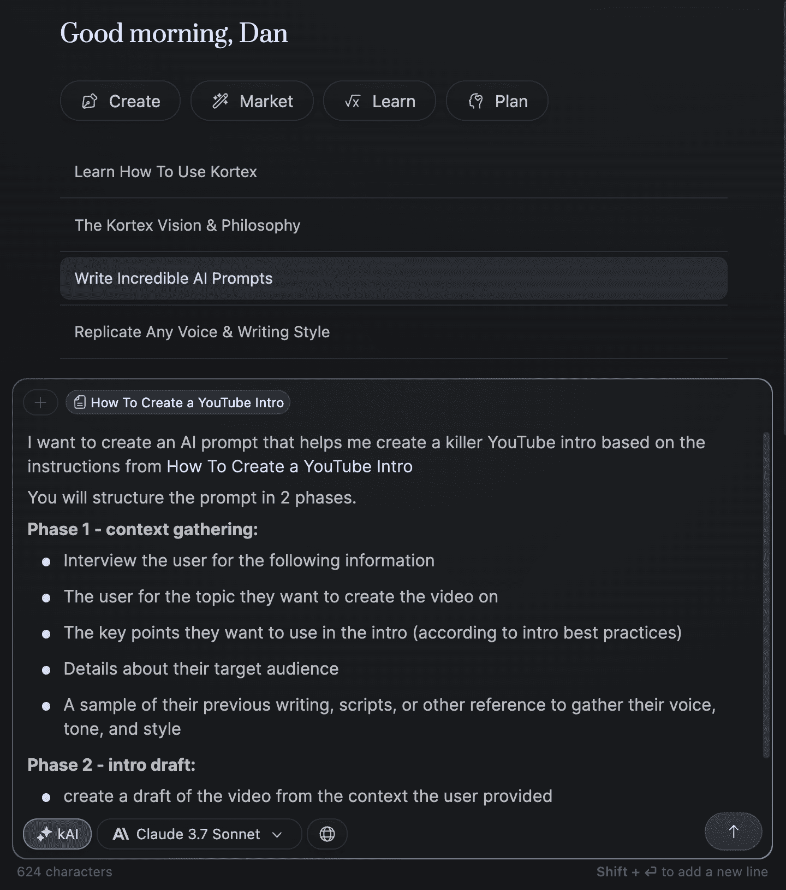

# 智能创作者如何在 2026 年赚钱（你来得太早了）

> 原文：[`thedankoe.com/letters/how-smart-creators-will-make-money-in-2026-youre-early/`](https://thedankoe.com/letters/how-smart-creators-will-make-money-in-2026-youre-early/)

目前，创作者主要销售数字产品和服务。

咨询、课程、社区、小组和订阅会员。

这是有道理的。

他们有巨大的利润空间。它们可以由一个人大规模地完成。它们提供了比依赖平台收入或接受赞助更多的自由。而且它们可能是人们可以购买的最具变革性的产品——从没有过这样的时候，从技能前沿的人那里获得负担得起的基于兴趣的教育是可用的，而教育影响行为，正确的教育是*唯一*可以改变你生活的事情。当然，也有不良行为者。

现在，我对这种演变有一个预测。

如果你理解这一点，你可能在接下来的几年里能够获得竞争优势。

我是基于以下信念：

**1) 信息永远不会免费**

> 一方面——你正在说的点，沃兹——是信息有点想变得昂贵，因为它如此有价值——正确的信息在正确的位置可以改变你的生活。另一方面，信息几乎想免费，因为获取它的成本一直在降低。所以你有了这两者相互对抗。
> 
> – 斯图尔特·布兰德采访苹果的史蒂夫·沃兹尼亚克

信息不想免费，因为信息不想。

人们希望信息是免费的，因为他们不理解信息是劳动。

虽然现在听起来可能有些陈词滥调，但如果人们不付费，他们就不会关注。只有那些与金钱关系不好的人才会在为关键信息付费时出现问题。

当然，信息存在的时间越长，它的价值就越低。它变成了常识，AI 被训练在最受欢迎或最相关的信息上，但还有一个类别将在不久的将来保持其价值。

这就是创作者的用武之地。

创作者从事个人信息（写作、音频、视频）业务，并将继续这样做。

问题是如何将正确的信息放在正确的位置，正如布兰德在上面的引语中对沃兹尼亚克所说的。

**2) AI 永远不会给你提供最佳答案**

并不是 AI 不如你。

那就是你不够好，无法让 AI 比你做得更好。

因为如果你让 ChatGPT 为你写一本书，它会写，但读起来可能不值得。

如果你既擅长写书，又擅长提示工程（主要是向 AI 提供清晰的指令），那么你很可能比以前更快地写出一本令人难以置信的书，*而且这仍然是你自己的知识，而不是 AI 的。*

AI 只有在高度相关的领域（如营销、写作、设计或任何非机械性事物）中，当它有足够的背景信息时才有效。如此之多，以至于它不再是提供知识的 AI，而是做繁琐的工作。

这将变得有意义。

**3) 课程是静态的**

有 3 种类型的提供。

自己动手做。由你完成。由我来完成。

这些就是自社交媒体诞生以来创作者们一直在销售的东西。有些人自由职业，拥有像营销这样的技能。有些人以健康等兴趣为辅导。有些人如果想要一个低票价产品，就会销售课程。

但每个都有它们的缺点。

课程是静态信息，必须正确解释才能发挥作用。

自由职业通常是不满足的，因为你是在做别人的项目而不是自己的。

如果你想要扩展，辅导需要大量的时间或一个不断增长的团队。

但如果 AI 现在允许你将所有这些压缩成一个呢？

如果一个数字产品既能提供教育又能根据你独特的知识执行，会怎么样呢？

## 数字产品的未来

我在我的时间里创建了一些数字产品。

我的下一个项目将是一个[30 天挑战，建立个人品牌](https://stan.store/thedankoe/p/build-a-profitable-personal-brand-in-30-days)。

（因为我想在我们尝试将 Kortex 作为一个功能构建并共享带有自定义提示的工作空间之前，先测试这个理论）。

现在，让我们来模拟一个场景。

想象一下我有两个数字产品的部分：

+   **教育** – 以易于消化的方式呈现的课程或知识。

+   **执行** – 从特定知识构建的 AI 提示，让你能够更快地执行。

单独来看，这两者都不如它们结合在一起有价值。

让 AI 为你完成任务不会教你如何自己完成任务，所以当 AI 不可避免地只给你一个初稿时，你不知道如何创建一个有效的最终稿。AI 不解决迭代或缺乏结果的问题（除非你知道*如何*引导 AI）。

这就是为什么“氛围编码者”现在无法构建任何复杂的东西。

他们对编码的理解不够深入，所以当他们遇到错误时，他们要么必须开始学习编码，要么因为外包了他们的代理而陷入困境。即使人们可以用自然语言编写整个应用程序，这并不意味着人们会使用它。换句话说，你仍然需要学习。

当你只有教育背景时，将知识应用到自己的情况中是很困难的。许多人因为试图复制老师而没有意识到他们独特的情况会改变教育的应用方式而感到课程难以应对。

这就是两者都能繁荣的地方。

AI 擅长收集你的个人背景，尤其是在被提示时，这样它就可以考虑这些因素来完成任务。

如果你从我开始学习建立个人品牌，有很多变量。你必须提取你的信念、观点、兴趣、想法和其他东西。AI 不能从你的脑海中提取这些，但它可以帮助引导你的思维来想出这些事情。

这就是为什么课程有如此低的完成率和成功率。

让我更清楚地说明：

想象一个 YouTube 课程。

它教授：

+   如何产生具有病毒潜力的想法

+   如何设计和迭代缩略图想法

+   如何概述 YouTube 脚本和关键点

+   如何格式化钩子和介绍以减少流失

+   如何为视频制作故事板，以控制节奏、B 卷、主镜头和视觉效果

你需要理解的是，没有一种最好的方法来做这件事。

如果你让 AI 在没有上下文的情况下做这些事情，它会给你提供它在互联网上能找到的一般信息。

但关于 YouTube，以及大多数相关（非机械）领域，问题是“什么有效”经常变化。没有哪个 YouTuber 与其他人完全相同，但他们似乎都达到了某种形式的成功。这意味着即使是针对 YouTube 的特定 AI 软件也会有其缺陷，因为它可能基于**一个**最佳实践构建。如果每个人都使用这个 AI 工具，它产生的结果就会减少。

因此，对于这个 YouTube 课程，创作者用自己的**思维、模型和方法**构建它。

然后，当他们将上面的每个项目点转换成一个提示（如创意生成、大纲、脚本等），就会发生神奇的事情。

你不仅拥有教育，还拥有执行力！

你意识到这是多么疯狂吗？

YouTube 课程不再是课程。它是创作者思维的一部分**可以独立行动**。

作为个人，你可以购买他们思维中的一部分，学习“操作手册”，提供自己的上下文，然后它就会**为你工作**。

它给你提供想法，你选择一个，它引导你通过大纲，你编辑它，然后根据你自己的声音输出脚本，而且，在某些时候，AI 甚至能够制作出整个视频，听起来像你，看起来像你的风格。

仍然是**你**在制作视频，你只是做了更少的工作。

这不是人工智能的垃圾，因为它有**上下文**。

如果你想看到这个实际操作，[观看我在 Kortex 频道上制作的这个视频](https://youtu.be/4E9rO6FDUwo)。

对于一个公司的内容团队呢？你不需要雇佣这个人作为自由职业者，因为他们可以在不在那里的情况下为你做工作。

关于像健身教练这样的东西呢？他们不能为你做工作？嗯，他们仍然可以提供创建定制训练计划、营养方案和每日检查来跟踪你的进度、体重减轻或其他什么的提示。

你不再在销售课程。

你在销售一个完整的解决方案——一个个人和特定的系统，AI 不会直接提供，因为它需要被训练来这样做——这更有可能产生结果。

信息的价值不是在下降，而是在急剧增加。

## 如何构建一个 AI 首个产品

如果你是一个创作者，或者你想要成为一个创作者，你能做的最好的事情就是学习如何将你的知识转化为提示。

如果你是一个初学者并且做得很好，恭喜你，你现在有一个可以立即开始销售的产品了！

这就是我确切会做的事情：

### 1) 记录你的流程

打开一个笔记或文档来写作。

如果你想要让它对你来说更容易，请在[Kortex](https://kortex.co/)上这样做，这样你就可以在将此转换为提示时参考该文档。你可以在 ChatGPT 等之间复制和粘贴，但 Kortex 有 ChatGPT 模型和所有其他模型，因此你可以根据不同的用例选择不同的模型。

从那里，*假装你在向其他人提供详细的指示，以便他们可以做到你所做的一切。*

这将需要一些时间。

如果你是一个 YouTube 博主，那么你需要为你的流程的每个步骤创建一个文档。看看之前的要点，并扩展每一个。

对于创建 YouTube 简介，[它可能看起来像这样](https://app.kortex.co/public/document/eff80eec-769f-479d-8a00-e1556aac6c6e)（因为内容长且详细，所以链接在一个文档中）。

当然，你几乎可以用任何任务来做这件事。如果你以前从未这样做过，可能会有些困难。你正在积极学习如何管理和指导一个员工（AI），这需要时间。

但是，你只需记录一次，就可以永远使用。

你也可以将这视为你课程的大纲。

这需要一些前期工作，但回报很大。

这是一个非常有杠杆作用的活动，值得关注。

### 1.5) 使用他人的流程

我建议你手动处理自己的东西。

但为了价值和教育，这里还有其他你可以做的事情：

+   选择一个你想要完成的任务

+   在 YouTube 上找到一个教授这个的视频的专家

+   或者，找到一本教授这个任务的 PDF 书籍

+   将其提供给 AI（你可以链接到一个 YouTube 视频或上传 PDF 到 Kortex）

+   让 AI 分解详细的指示

+   将其保存为文档，以便在步骤 2 中参考

这就是我上面 YouTube 简介说明中所做的事情 😉

我找到了一个教授这个的视频，并让 AI 将其分解。

我有一个[免费的 AI 迷你课程](https://stan.store/thedankoe/p/mini-course-how-i-systemize-my-life-with-ai)，其中包含多个此类示例。

### 2) 将每个部分转化为提示

值得花 30-40 小时自己研究提示工程。

我显然不能在这里解释所有内容。

因此，我想给你一个我使用的快捷方式。

我喜欢根据任务的结构将提示分为两个阶段。

+   **第一阶段** = 收集背景信息阶段，通过采访用户来获取执行任务所需的相关信息。

+   **第二阶段** = 执行阶段，它使用用户的信息并执行任务。

如果任务类似于创建 YouTube 简介，那么显然你需要用户背景信息。你需要将他们想要变成视频的想法和声音分析作为参考，以便听起来像他们。

最好你还有一个创意生成提示词。这样，你可以将那个输出的结果输入到 YouTube 简介提示词中。

这些任务以某种方式相互依存。

+   首先，你有一个创意生成提示词，它会收集关于你兴趣的背景信息，并输出高绩效的话题

+   然后，你将其中一个话题作为背景信息输入到 YouTube 简介提示词中，该提示词也会收集你想要使用的重点信息。

+   然后，你将这个作为背景信息输入到一个大纲提示词中。

+   然后，你将这个作为背景信息输入到剧本提示词中。

简而言之，你将创建许多提示词来封装整个过程。

现在，这里有一个快捷方式。

我有一个能创造出令人难以置信的提示的提示词。

所以，你告诉它你想完成的任务，你给出任务的说明，并让它将提示词的输出结构化为两个阶段。

你可以复制[这里的提示词](https://app.kortex.co/public/document/83651c0d-dfd3-4e6c-9821-c9c41b2a3ddc)，或者进入 Kortex 的**聊天 → 创建令人难以置信的 AI 提示词**，让这一切为你完成。我喜欢使用 Gemini 2.5 Pro 或 Claude 3.7 Sonnet 来做这件事。

这里是创建提示词时的提示词样子。

注意我是如何以文档的形式提供说明并将其分为两个阶段的。[这里是该提示词的输出结果。](https://app.kortex.co/public/document/d1ac7b33-83f8-4af6-886a-9b9d867d0318)

这美妙之处在于你可以将提示词保存为文档，这样你就可以随时组织和管理它们。

### 3) 自用并迭代

你可能认为你已经完成了。

但你还没有。

我知道你希望 AI 是一个全能的魔法东西，可以为你完成所有工作，但如果你想让它做得好，那就不是这样。

这可以看作是一个初稿。

创建任何一种生活系统都是如此。

你创建一个常规，尝试一周，注意哪些没有很好地工作，然后尝试新事物，直到得到很好的结果。这适用于健康、写作内容等。

在接下来的几周里，你的任务是使用你自己创建的提示词，评估它们的好坏，并对提示词进行修改，直到结果达到你期望的 80-90%。

然后，你就有了一些可以提供给别人的东西。

目前，AI 总是需要有人来评估和编辑输出。

如果你让它输出一个 YouTube 剧本，当然，你可以使用它并看到一些好的结果……可能比大多数人都要好，但你仍然会希望在你自己进行最终润色时将其视为草稿。

### 4) 创建文档

恭喜。

现在你有一个可以用于自己的工作或作为产品提供给别人的提示词库。

现在，你需要创建课程部分。

你需要教授如何使用提示，以及他们需要了解的任务内容。

幸运的是，你已经有了你的处理过的概要。

你只需要将它们扩展并结构化，形成一个从 A 点到 B 点的产品。

如果你想深入了解，我这里有一个关于创建数字产品的[超级指南](https://thedankoe.substack.com/p/mega-guide-how-to-create-your-first)。

不再花一个小时，以下是我创建数字产品的步骤：

+   购买别人做得好的产品

+   将所有内容保存为 Kortex 中的单独文档。

+   请问 AI 如何分解产品的结构和模式（为什么它能很好地工作）

+   将你学到的内容转化为一个提示

+   将你自己的产品细节输入进去

+   让它引导你创建自己的产品

你在这里学到的不仅仅是创建产品。

这是一种用 AI 思考的方式。

这是教你 AI 完成任何你想要达成的任务的方法。

我就说到这里。

感谢阅读。

– 丹

如果你想深入了解：

+   “30 天内建立盈利的个人品牌”挑战将于 6 月 16 日启动。对早鸟用户有[折扣](https://stan.store/thedankoe/p/build-a-profitable-personal-brand-in-30-days)。

+   Substack 上最新的付费文章是关于构建数字产品的[超级指南](https://thedankoe.substack.com/p/mega-guide-how-to-create-your-first)和[如何编写销售页面](https://thedankoe.substack.com/p/how-to-write-persuasive-landing-pages)的产品。接下来将是发布策略。

+   Claude 4 刚刚发布，我们将将其与其他所有 AI 模型一起放入 Kortex（https://kortex.co/）——一款笔记和 AI 工作流程软件。
