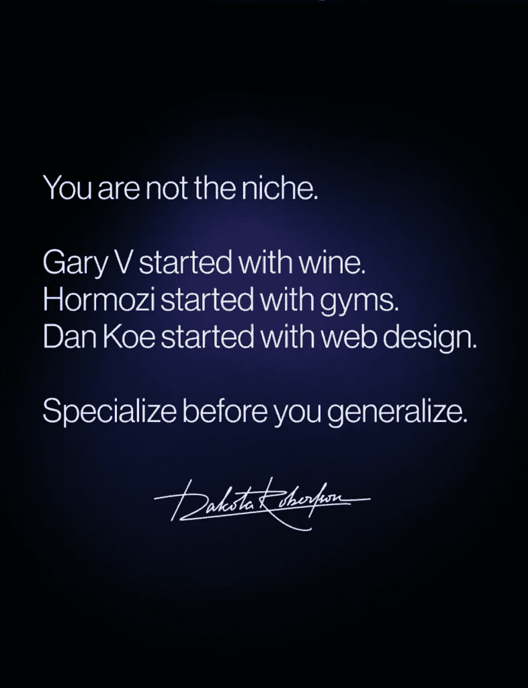

# 目前创作者经济中最有利可图的细分市场

> 原文：[`thedankoe.com/letters/the-most-profitable-niche-in-the-creator-economy-right-now/`](https://thedankoe.com/letters/the-most-profitable-niche-in-the-creator-economy-right-now/)

最有利可图的细分市场是你。

至少那是我在 3 年前说的话，导致了一个充满爱与恨的世界。

我收到了一些人的评论和消息，他们提到他们“感觉被看到”。我在现实生活中遇到了其他人，他们告诉我那是让他们开始在线分享想法的哲学。那个短语“你是细分市场”进入了我的[第一本书](https://theartoffocusbook.com/)，并塑造了我如何进行有意义的工作。

但然后还有另一面。

似乎每隔一天，我都会看到一篇标题为“你不是细分市场”的帖子、视频或通讯。

当我阅读或观看它时，我忍不住笑了，因为他们会暴露出他们只阅读了我的短语**你是细分市场**并立即做出反应，而没有进行勤奋的研究，或者他们根本不理解我在说什么。

大多数人虽然没有意识到，但都同意了我的观点。

以达科塔为例，我在德克萨斯州奥斯汀与他一起住了 6 个月的好朋友。

我全心全意地爱着达科塔，但这只是一种半真半假的说法。

我提供网页设计**产品和**服务，但只有 ~5% 的内容与网页设计有关。从所有衡量标准来看，如果你回顾我 2019 年及以后的推文，你会看到大多数帖子都是关于自我提升、情商、效率和任何其他我感兴趣的事情。

我可以提供（并且确实提供了）任何其他产品或服务，而不仅仅是网页设计，并且做得同样好。我对这一点有信心。

你绝对**不必**从狭窄的开始，然后逐渐扩大范围，正如我们将要发现的。

我制作“你是细分市场”视频的全部原因是因为我厌倦了人们把商业当作一种宗教。

*如果你不遵循一个企业**应该**的样子，你永远不可能成功！*

所以这就是我想在这里做的。

我想要彻底结束这场辩论。

而不是说“最有利可图的细分市场是你”，我将给出一种完全不同的做事方式。

如果你不知道从哪里开始，这可能对你来说意义重大。

## 基于主题 vs 基于任务

我将把“传统”的细分方法称为**基于主题**。

简而言之，你选择一个目标受众和一个主题，比如写作或网页设计，来帮助那个目标受众，比如为建筑工人提供网页设计。将这和燃烧的问题结合起来，你就成功了。你也可以仅针对目标受众进行细分，但人们在教授社交媒体业务时，通常是指选择一个主要主题来建立权威。

我明白了。

你不必过多思考要创建什么内容。如何货币化非常清楚，你可以快速做到这一点。你可以成为你细分市场的“首选”。

但这里是我对这个方法的几个大问题：

+   **你被框定在那个细分市场内。** 如果你作为一个人的你发生变化（这肯定会发生），而你失败了或者试图转型，你将会有一段糟糕的时光。这是反持续学习的，反通才，反人类的。

+   **它鼓励人们寻找“最好”或最赚钱的。** 大多数人放弃是因为他们换了 20 次细分市场，因为他们一开始就出于错误的原因开始做生意。只要你真正擅长你所做的事情，任何细分市场都可以行得通。（参见：技能问题）

+   **它把多情的人撕得粉碎。** 有多种兴趣的人不需要被告知只能选择**一个**。他们需要学习如何将它们全部引导到一件事上。如果你对多件事感兴趣，其他人也可能感兴趣，你已经跟随了很多成功的人，他们谈论的不仅仅是件事。用你的眼睛看。

正如你所见，我写这篇文章是因为我讨厌被放入一个框框里的想法。

我不希望商业成为另一个我醒来后最终会厌恶的工作。我希望工作是我生活的一个自然部分。我希望它是一种游戏。我希望它是我学习我想学的东西、建造我想建的东西和创造我想创造的东西的载体。

**这引出了我称之为*****基于使命的细分市场的方法**，这是一个更好的方法。

当你建立一个现代企业时，你就是一个媒体企业。如果你不在社交媒体上，要么你没在阅读这篇文章，要么你只是在忽视必要的。

使用社交媒体，大多数人没有考虑到内容是如何**被看到**的。

他们能怎么做呢？他们是初学者。他们不知道更好的方法。这没关系。

你的内容被其他分享它的人看到（以及其他不是关键推动者的方式）。

当你的内容被分享时，它是在与**随机的人**分享。

这不是付费广告，你可以输入你想要的目标受众的统计数据，然后让每个广告直接到达你想要的目标细分市场。

这就是为什么大多数初学者会失败的原因。因为他们不知道如何创造足够吸引人以至于值得**跟随**的内容。

现在，人们会跟随谁呢？

领导者。

领导者有什么？

一个使命。

为什么这是一个更好的选择？

+   商业成为你人生工作的载体。

+   你可以谈论任何能够推动那个使命的人。

+   它是基于变革的。这意味着，创造内容是以痛点为导向和以期望的结果为导向的。

+   想出想法变得容易得多。任何你阅读、观看或听到的与你的使命以某种方式相符的想法都可以写下来，并转化为你自己的品牌下的想法。

我实际上昨天刚刚发布了一篇关于如何练习写作的[3 个练习](https://open.substack.com/pub/thedankoe/p/3-drills-to-become-a-master-at-short?r=of0ip&utm_campaign=post&utm_medium=web&showWelcomeOnShare=true)，这是一篇引人入胜的短篇内容，任何想法都可以用来练习。

正如你所见，我最近将我的通讯简报重新命名为“未来/证明”。

那是我的使命。帮助尽可能多的人成为有价值且适应性强的同时过上美好的生活。

为了实现这一使命，几乎要求我谈论商业、生产力、自我实现、技术、各种技能等等。我有十年的内容要发布以实现这一使命。

我已经有一段时间觉得事情变得乏味了。想法不像以前那样涌来。当我决定做出这个转变时，伟大的想法又开始涌现。几年前，我有明确的使命帮助人们掌握现代世界（因此有了《现代精通》，现已关闭），那可能是我最好的作品诞生的时候，也为许多人所熟知的单人企业奠定了基础。

这里的问题是，**两种选择都有效**。

迪基·布什和尼古拉斯·科尔有一个名为“用 AI 写作”的通讯，走的是传统细分市场路线。它做得很好。

虽然我在很多方面都钦佩他们（如果你在读这封信，迪基，我很快又和你吃晚餐了，我很兴奋），但我可能在我做类似的事情之前就自我毁灭了。

主题式与使命式之间的选择是**个性依赖**的。

两者都具有巨大的货币化潜力。

但坦白说，了解我的受众，我认为基于使命的方法更好。

尽管具有争议性的绝对论在社交媒体上病毒式传播，但并没有一种正确的方式来做到这一点。见鬼，有些人开始发布内容时没有任何计划，一夜之间就成了名人。事实是，你可能又在过度思考了（再次），但了解我是如何思考的可以帮助你获得清晰。

## 如何领导一个使命

承认这一点很痛苦……

但你之所以在网上关注某人，主要是因为你渴望清晰。

当我们发现一些自信、有价值且真实具有争议性的内容时，你能感受到创作者的分量。感觉他们似乎一切尽在掌握，我们也希望拥有这种感觉。承认这一点是可以的。

现在，我要亲口告诉你，没有人真正知道自己在做什么。

有些人对自己不知道的事情足够自信，以至于他们愿意提出可能错误的想法和建议。

许多深思的人陷入了这种细微差别螺旋。他们拆解自己的观点，对自己所说的话没有信心，将他们的思想稀释到几乎成为**反行动**的程度。

“嗯，这并不适用于这个人，而且这并不总是如此” 哗哗哗。无聊。没有人想看那种东西。

听着：

+   比起成为风中的一片叶子，对糟糕的想法有信心并失败更好。至少当你错了的时候，你学到了一些东西。

+   伟大想法的目的是激发行为改变。当你给予人们行动、失败和学习的信心和清晰度时，你改变的生活比仅仅自我雕琢要更多。

+   有信心和一点夸张可以帮助你传达**要点**。如果人们没有抓住要点，或者他们字面地而不是比喻地阅读，那就让他们去吧。对你来说，更多的曝光。

这三个要点将帮助你比任何其他社交媒体建议增长得更快。做你自己，不要后悔。

在我们继续之前，记住这些。

现在，拿出一张纸或打开你最喜欢的笔记应用，开始把这些东西记下来。

如果你下载了[Kortex 桌面应用](https://kortex.co/download)，你可以使用 Option 或 Alt + D 打开一个浮动笔记（如果你愿意，还可以使用 Option 或 Alt + A 打开一个浮动 AI 聊天）。

### 1) 你需要一个敌人来攻击

回答这些问题：

+   什么生活方式是你存在的祸害？

+   你在做什么来避免那种生活？

+   为什么它如此具有破坏性？

由于某种原因，我总是讨厌 9-5 的工作。我知道这把我放在了“9-5 讨厌者”的陈词滥调中，尽管这并不是我，但我就是做不到。看起来所有过着我不想过的生活的人都在那种情况下，主要是因为他们有讨厌的长时间工作，这也消耗了他们一天中做任何有价值的事情的能量。大多数人都是行尸走肉。我不关心那些例外。大多数人是。

这成为了我学习和做一切我能做的事情来避免它的动力。我想掌握现代世界。我想变得未来保障。

### 2) 为人们创造一个可以接受的身份

在你的品牌敌人的另一边，是你想要成为的人的原型。

当你跟随某人或购买某物时，你这样做的基本原因是，你想要成为某人（或加强你认为你是谁）。

人们跟随你不是因为他们喜欢你的想法。他们跟随你是因为你的想法影响了他们的行为，解决了他们生活中阻碍他们发挥潜能的问题。

将你的使命与此保持一致。

现代精通给人一种他们可以成为的人的形象。

未来保障法暗示了同样的事情。

2 小时作家也是如此。

单人企业、价值创造者，或者我所有的顶级内容总是符合这一模式。

为此头脑风暴 5-10 个名字，并考虑它们。

他们不需要成为你的产品、社交媒体账户名称或通讯录名称，除非你希望他们这样做。他们只是你的指引之光。

### 3) 为人们建立一个可以探索的世界

你的细分市场不会在一行品牌声明中展示出来。

“我帮助 ____ 做 ____ 而不需要 ____”是过去的遗迹。

相反，你的细分市场通过你的作品集和被吸引到它的人来体现。

现在，商业不再是关于倒计时计时器和销售漏斗。更多的是为人们建立一个可以探索的世界。就像一个带有电影（长篇内容）、衍生剧（短篇内容）、动作人偶（产品）和其他内容的微型漫威电影宇宙。

你需要足够一致，让人们可以在一周内一次性消费你提供的一切，因为这就是人们现在消费事物的方式，那时你实际上才开始赚钱。当你的某个帖子做得好时，他们会开始到处寻找更多信息，或者像 YouTube 这样的平台会继续向他们展示你的旧内容。

在一个视频做得好之前，我发了 30-40 个 YouTube 视频。之前，它们的观看量只有 2-3k。在一个视频做得好之后，它们的观看量都上升到了 10 万以上。**你现在发布的任何内容，即使做得不好，一旦你进入增长期，也能被人看到**。

如果你发了 10 次帖子就放弃了，你就不知道这一切是如何运作的。

我在这里写了一篇关于“如何构建一个世界”的内容生态系统[“如何构建一个世界”的内容生态系统](https://thedankoe.substack.com/p/how-to-build-a-world-the-2-hour-content)，供感兴趣的人阅读。

现在，你需要以聪明的方式进行。以下是我会做的事情：

+   找出 3-5 个谈论你想要谈论的类似内容的账户。

+   通过最受欢迎的内容过滤他们的内容，并记下他们 5-10 篇最好的内容。

+   从你自己的视角和自己的愿景重新创造那些话题。

+   一贯地融入基本要素。如果你谈论写作，就教授写作的基本知识。大多数跟随你的人将是初学者。

+   阅读非主流书籍，并关注那些有伟大想法但不太知名的人。将这些想法融入你自己的使命中。

当然，写下任何你想到的想法。

它有助于学习如何包装这些想法，以便他们总能做得很好（即使它们很无聊）。我们将在下一封信中讨论这一点。

### 4) 80%的原因，20%的方法

大多数初学者的内容都失败了，因为：

+   他们没有足够地击中痛点。

+   他们没有给人们一个**理由**去关注他们。

到最后，人们不分享你的内容，因为它没有触及他们的情况。它没有进入他们的头脑，向他们展示他们有实现潜力的可能性。

没有人会滚动社交媒体来阅读你的深刻思考。

他们也不是在滚动学习一项新技能。如果他们想学习某样东西，他们会在 Google、ChatGPT 或 YouTube 上故意搜索它。他们不会登录社交媒体时间表寻找特定信息。

如果你能说服他们为什么应该关心，他们才会关心你的深刻思考或那项新技能。

我是从网页设计开始的，当然，但我让人们想要学习网页设计的方式是通过谈论“为什么”：

+   这是一项有利的技能去学习。

+   对于想要进行创造性工作的人来说，这真是太好了。

+   你可以用它来找到更好的工作，开始自由职业，或者为你的自己的业务建立一个网站。

让我成长的不是像网页设计那样愚蠢的事情，而是我让人们关心它的能力。

所以，在你发送你写的任何内容之前，问问自己：

+   他们为什么要关心？

+   这解决了什么一个大痛点？

+   这如何能极大地造福普通人？

最后一点很重要，因为请记住，您的内容将被分享到互联网上随机的人群，而不仅仅是您选择主题领域的专家。

可行的步骤或“价值”是次要的。这很好，但对于短篇内容通常并不重要，除非它是新颖的或鲜为人知的。如果它非常基础，那么我建议您在初学者寻找更多信息的时刻分享这些内容（例如，初学者课程、指南、小型软件，或其他数字产品）。

我就说到这里。

我真心希望这能帮到您。

– 丹

当您准备好时，这里有几种我可以进一步帮助的方式：

+   最新的一篇付费文章是关于练习吸引人的短篇写作的 3 个练习。 [您可以在这里查看所有可用的付费文章。](https://thedankoe.substack.com/)

+   如果您想要一个地方集中所有 AI 模型，快速参考文档和 PDF，以及 25+个用于学习、写作、营销和规划的预建工作流程—— [在这里免费注册 Kortex。](https://kortex.co/)

+   每周六，我都会向我的个人名单上的 17.5 万多人发送所有写作的高信号总结。如果您想接收它， [您可以通过这里加入。](https://thedankoe.com/letters)
