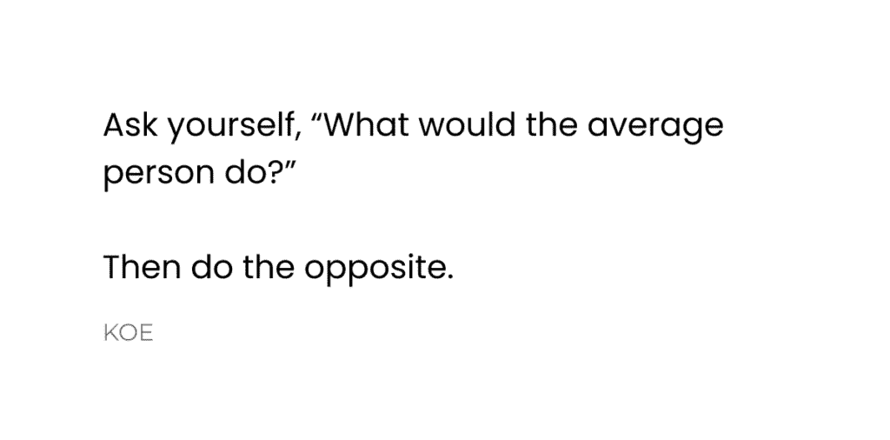
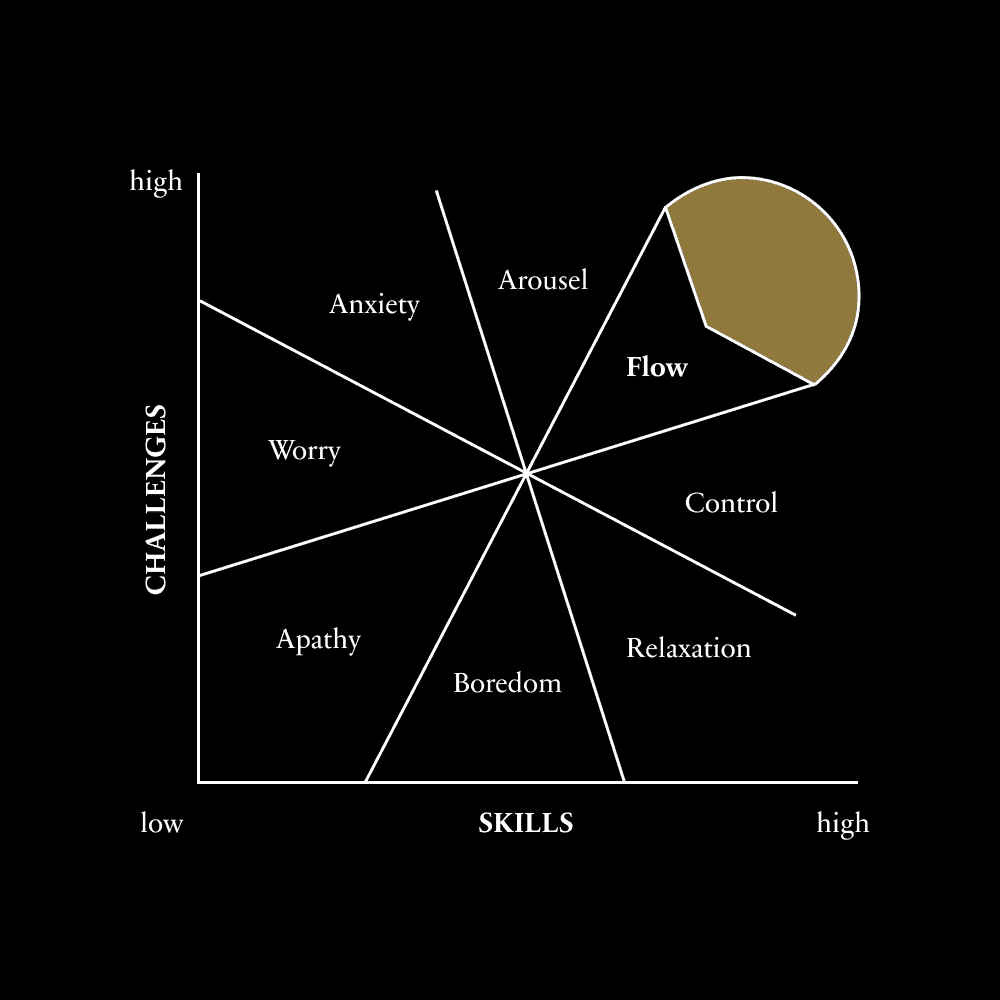

# 如何成为你人生的主角

> 原文：[`thedankoe.com/letters/how-to-become-the-main-character-of-your-life/`](https://thedankoe.com/letters/how-to-become-the-main-character-of-your-life/)
> 
> 有自主权就是成为句子的主语，而不是直接宾语。这是行动的倾向，而不是等待被行动。
> 
> – 德文·埃里克森

我是一个很爱评判的孩子。

我总是想知道为什么每个人都这么被洗脑。

我在教堂的朋友似乎对我的任何关于他们信仰真实性的问题都感到退缩，就像他们眼睛中的一个可见的故障，这代表了他们的思想突然回到了父母强加给他们的教条。

世界在我眼中显得过于机械化。

醒来。按几次闹钟。滚动直到你几乎要迟到。煮咖啡。坐在交通中。为那些你不在乎的人做你不在乎的项目。对老板假笑。和同事假笑。再次遇到交通。和配偶争吵。看电视。昏倒。重复。

这让我感到害怕。

无论我转向哪个方向，我都被推着走一条似乎过时的路，这条路会把我引向与推我的人相同的生活。

留住你的钱！

为你的考试学习！

获得一份高薪工作！

就像视频游戏中的 NPC 一样。

非玩家角色。可预测、预先编写和编程的角色，它们遵循狭窄和严格的行为模式，没有自主权。他们在游戏中，但主角是玩游戏的人，掌握着自己的命运。

我总是对那些人感到一种羡慕。

那些不在乎他人看法的人。那些能够随心所欲地做事而不后悔也不在意的的人。那些最终过上充实而有趣的人生冒险的人。他们拥有 MCE——主角能量。

至少在我年轻、愚蠢和天真的时候，我是这样想的。

## 为什么有这么多 NPC？

> 一般而言，我们有两种意识。一种我称之为“聚光灯”，另一种是“泛光灯”。聚光灯就是我们所说的意识注意，我们从童年起就被训练认为这是最有价值的感知形式。当老师在课堂上说“注意听！”时，每个人都盯着老师看，那就是聚光灯意识；一次专注于一件事情。你集中注意力，即使你可能没有很长的注意力跨度，但你仍然使用了你的聚光灯：一件又一件，一件又一件…
> 
> – 阿兰·瓦茨

将大多数人口降低到仅仅是被操纵的木偶并不是解决办法。

每个人都有一个复杂的内心世界，其他人大多对此一无所知，永远无法完全理解，因为他们无法接触到它。

把有主角综合症的自恋者放在神坛上也没有帮助。

这两种都是扭曲的心智理论，但它们背后都有一些真理。

我们不希望“认为”自己是主角，我们希望“成为”主角，因为任何低于这个层次的东西都是对你潜力的不尊重。

在这个世界上，尊重只留给那些具有高度自主性的人。企业家、运动员、知识分子。那些开辟自己的道路、克服逆境并创造一个我们不禁要为之惊叹的故事的人。

其余的都被推到了地毯下，尽管这听起来可能很残酷。我们把他们标签化为普通、平凡，很少有时间他们能创造出社会认为足够有价值，值得用关注、金钱和其他我们视为成功象征的东西来奖励的东西。

但为什么呢？

为什么这么少的人能从群体中脱颖而出？

为什么我们几乎把所有的精力都投入到别人的梦想中，而不是自己的梦想中？

我认为对这个问题的答案有 3 个重叠的部分：条件反射、工业化和第一层次思维。

我们一出生，我们的思维就像一个没有操作系统的电脑。我们是这些可爱哭泣的人类肉团，如果我们没有得到适当的指导和关怀，我们就会死去。

在一个学习欲望强烈的大脑和一个渴望塑造孩子的父母面前，这可能会变得非常危险。如果父母的编程几乎复制了他们自己的父母的编程，这意味着他们没有被教导（或者他们没有练习）自主性，那么孩子更有可能得到相同的结果。必须有一个主要角色出现来打破这种代际诅咒。

将其与一个以工业为基础的社会相结合——一个旨在创造有用工人的系统——你就得到了美国梦：*上学，找工作，65 岁退休*。

你认为事情会变得更糟吗？

好吧，过去几十年人类心理学已经被广泛地研究。

很明显，我们的思维——我们的价值观、信仰和世界观，这些在很大程度上影响我们的思考和决策——随着时间的推移会通过可预测的阶段进化。这些阶段可以分为第一层次意识和第二层次意识。

*第一层次思维者的决定性因素是他们无法持有多个观点。他们的信仰是正确的，你的信仰是错误的，你是他们的敌人*。

所以，如果你的父母认为学校、工作和退休（或特定的宗教或平等主义信仰体系）对你最好，他们会确保你也相信这一点。当你不知道更好的时候，这是很难避免的。

超过 95%的西方人口居住在第一层次思维的中间或上层，分为 3 个阵营：

+   **秩序** – 重视规则、角色和纪律，通常由某个外部和全能的统治者分配（即圣经敲击者）

+   **成就** – 重视理性、科学、冒险和自力更生（即自助或攀登企业阶梯）

+   **平等主义** – 价值观相对主义和平等。没有真理或信仰是绝对的或更好的，除了没有真理比其他更好的事实——形成一种危险的虚伪（即性别或身份政治）

感觉整个世界都在对你大喊，要么赞美你的神，要么努力工作，要么成为社会权利的积极分子，而且，由于我们处于信息时代，无论你转向哪里，人们都在试图说服你，这三个大目标比你的个人目标更重要，这并不利于你。

如果这些是父母、老师、权威和公众人物所持有的主导价值观，他们可以直接接触到你的年轻、易受影响的大脑，那么其中写下的代码就像 NPC 的代码一样。

做你被告知的事情。

遵从权威。

跟随群体。

你别无选择。

生存是你的基础。这是你做出每一个决定的操作原则。如果你不是在试图保护你的身体，你就是在试图保护你的自尊，而当你的自尊处于一级发展阶段时，你很快就会发现自己对别人的信仰进行指责，认为它们是错误的。新的机会，这些机会可能会改变你的生活，变得稀缺。

如果你违背了父母或老师的信仰，你可能会被逐出部落，所以你自然会倾向于服从。

这就是为什么世界感觉如此机械。

这就是为什么世界如此适合被 AI 颠覆，为什么人们围坐在一起抱怨它将取代工作，而不是其他选择。

我们已经被训练去缩小我们的注意力。

正如沃茨所描述的，这是聚光灯意识。

当权威发言时，我们倾听。当我们被分配任务时，我们执行。如果我们不这样做，我们会感到威胁，这种恐惧反应让我们朝着从未属于我们的目标努力。有些人无法忍受，所以他们陷入抑郁和焦虑的深渊，无法逃脱，因为他们的聚光灯看向了除他们旁边用来搭建梯子的工具以外的所有地方。

默认路径是我们的命运。我们通过我们应当实现的目标来过滤世界。如果你理解了思维，你就会明白我们感知到的信息有助于我们实现目标。

我们所能看到的只是我们编程允许我们看到的东西。

除非你反抗，否则大多数关于意义、满足感和真正成功的机会都会从你鼻子底下溜走。

除非你拒绝所有你被告知是真实的，并寻求发现你能够做到的事情。

## 反抗默认路径

失败是默认状态。

这就是生活的残酷真相。

如果你不去创造一条道路，你将被分配一条道路，无论你按照社会的标准多么成功，这种成功从来就不是你的。永远不是你的目标。永远不是你的信念。永远不是你的行动。你只是简单地运行一个程序，去实现你被设定去实现的目标。

你并非注定要受你编程的限制。这就是人类酷的地方。我们是唯一可以重写自己代码的超计算机，即使这个比喻也无法完全解释人类意识的复杂性。

如果你想要改变你生活的方向，你需要三个要素。

+   **意识** – 扩宽视野和发现机会的能力。

+   **获取** – 利用那些机会的资源。

+   **能动性** – 在没有许可的情况下采取那些机会的能力。

这些就是你成为你生活主角的方式。

许多人意识到了机会。大多数人都能接触到利用这些机会的知识。*但很少有人采取行动。*

因此，你生活中可以培养的每一个特质都依赖于最后一个要素：能动性。

大多数人仍然认为，智力或书本知识在成功中扮演着最重要的角色，但这与事实相去甚远。

**高智商 + 高能动性** = 建造火箭飞船将人类带到火星。

**低智商 + 高能动性** = 在本科三年级辍学创业，而不关心优化。

**高智商 + 低能动性** = 毕业并获得博士学位，只是为了哭泣，抱怨富人不应存在。他们从未离开过轨道。

**低智商 + 低能动性** = 普通人跟随他人的计划，成为他们环境的受害者。

有适当的能动性，你的智商如何并不重要。

好消息是，能动性是一种习惯，习惯是可以培养的。

### 意识：拓宽视野

> 在最广泛的意义上，一个人对理解的追求确实是一个搜索问题，在一个思想抽象空间中，这个空间太大，无法彻底搜索。
> 
> – 大卫·德什

我想让你把成功想象成一张地图。

没有图例。没有道路。没有景观。大部分是空白。

那么，成功就像麦堆里的针。地图上的一个无形针。

这张地图上唯一显示的是*已知*的部分。就像只有那部分地图被照亮了聚光灯。对大多数人来说，这个区域充满了他们童年的、学校的、宗教的灌输和职业培训的方面。

你当前的成功版本是那个定义区域内地图上的一个*可见*的针。

你已经知道你的生活*应该是*什么样子，你基本上已经接受了这一点。你很少考虑*生活可能是什么样子*，即使你考虑，任何更美好的想法也会很快被对未知的恐惧所取代。

而这种恐惧是有道理的。你不知道成功的无形针在哪里。你不知道哪个方向能带你到那里。但这暗示了问题：你一生都在被给予方向，你自然认为你需要方向才能成功。

这与事实相去甚远。

那么，你如何在麦堆里找到针？

首先，你需要一个深入、内在的理由，去对未知世界进行信仰的飞跃。你需要对这样一个事实有残酷的认识，那就是你不想过一种机械和预定的生活，因为你可以直接观察到大众的生活并不是你想要的生活。

人们只有在厌倦了生病的状态后才会改变。你需要在接下来的一个月里，至少每天都要思考你的生活将走向何方。你需要最终诚实地面对自己，当前生活的不适并不是你愿意忍受的，因为如果你不讨厌它，你就会忍受它。

一旦你尝到了你现在生活的味道，转型的下一步就是*不一致性*——你的当前生活和潜在生活陷入了一场角力。这就是为你的*洞察力*做好准备。

对负面事物的认识就像拉回瞄准积极方向的弹弓。

第二，你需要对如何实现非传统进步有一个一般性的理解。你不遵循那些导致已知和普通结果的传统规则或指令，无论表面上看起来多么安全。

如果你想要非传统的结果，你需要做出一个猜测。你根据这个猜测采取行动。你几乎可以保证会失败。你将失败视为一个数据点，一个需要纠正的错误。你再次做出猜测，但这次是从一个更加有见地的位置出发，慢慢地，你将未知变为已知，并且，在适当的坚持下，你将缩小不奏效的范围，直到你发现奏效的方法。

这就是创造知识的方式。

这就是如何产生更深的意识。

这就是如何从单一、一级的视角中解脱出来，并开始扩展你自己的复杂性。你探索的地图区域越多——无论是商业模式、精神实践还是健身计划——你增加你性格潜力的可能性就越大。

但那只是一个需要变为实际的抽象概念。

### 权限：利用新技术

如果你想要探索地图上的新区域，你需要获得进入它的权限。

你至少需要有一个大致的想法，认为某种形式的机会存在于未知之中，并且有一系列步骤可以帮助你达到那个区域。

在一款视频游戏中，你必须达到一定的经验水平，才能（1）注意到任务，并且（2）接受任务，进入未知领域。

问题在于，我们如何找到我们的下一个目标并开始采取行动？

在体验与当前生活方式不一致的前提下，你的思维就会成为机会的磁铁。机会的问题在于，大多数人仍然用先入为主的思维方式思考。他们没有意识到，资历、物理位置和金钱不再是机会的障碍。

你可以在互联网上学习任何东西。

你可以关注各自领域的专家。

你可以整理一个充满高信号想法的社会动态。

你可以分享你所知道或你所做的事情，让全世界都能看到。

你可以利用技术来创业，提升你的精神境界，与任何人交谈，改善你的思维，或者改变你的健康和体型。

那既是机会的潜力，也是行动的资源。

然而，大多数人像使用毒品一样使用互联网。

为什么？聚焦意识。

但我们已经超越了那个阶段。你准备好进入你人生的下一章了。

步骤极其简单，但越来越困难：跟随那些致力于*有用*的人，无情地筛选谁可以进入你的思维，并让自己接触到你每天都会滑过的机会，因为至少现在你会注意到它们。

我不能告诉你该走哪条路。

因为如果我说了，你可能会因为恐惧而紧紧抓住那个方向，再次让你的思维变得狭隘，以避免不确定性，而不确定性是潜力的诞生之地。

### 自主性：所有问题都是可解决的

在 20 世纪 60 年代末，马丁·塞利格曼进行了一项著名的实验，以展示狗如何学会无助。

实验中有三组狗和两个阶段。

**第一阶段：**

+   第一组狗被放置在设备中并受到电击，但它们可以学会按下面板来停止电击。它们有控制权。

+   第二组狗也被放置在设备中，受到相同的电击，但无法停止电击。

+   第三组狗佩戴了同样的设备，但并没有受到电击。

**第二阶段（一天后）：**

我们将所有狗单独放入一个穿梭箱中——两个隔开的隔间由一个低矮的障碍物分开。在狗放置的那一侧箱子的旁边有一个警告信号，在电击之前发出。

为了让狗逃脱，它们只需要跳过障碍物到安全的一边。

+   第一组狗在警告信号出现后立即跳到另一边，逃避了任何电击。

+   大约三分之二的第二组狗甚至试图逃脱电击。它们通常会躺下，哀嚎，忍受电击。

+   第三组狗很快就学会了如何逃避电击。

正如第二组狗所表明的，这可能是一个巨大的延伸，我会争辩说，由于我们成长的环境，三分之二的西方人口已经学会了无助。

学会无助的核心思想是，对厌恶事件的*感知*缺乏控制可能导致被动和忍受痛苦。即使第二组狗*可以*逃脱，它们也没有尝试，因为它们*相信*这是不可能的。

这有助于我们区分低自主性和高自主性个体之间的关键区别。

你可能无法控制你的智力，你出生的邮政编码，你关于上帝、金钱或平等的信条，但自主性是你可以跳过障碍的成分。

自主性是一种习惯，而不是一种特质。就像无助可以学会一样，自主性也可以。

要有主动性，就是选择对你来说重要的目标，决定哪些行动能推动你向这些目标迈进，而且听起来可能很简单……行动。

但并非任何目标都适用。

当我们研究最佳体验心理学时，我们发现乐趣存在于已知事物的边缘。既不太难以至于你被焦虑淹没，也不太简单以至于你很快就会感到无聊。

那就是你在挑战中失去自我并与挑战合为一体的时刻。

因此，有三种类型的目标：容易的、困难的和不可能的。

容易的目标已经可以用你现有的技能和资源实现。

不可能的目标是我们无法完成的，要么是因为它超出了可能性的范畴（物理定律），要么是因为我们没有实现困难的那个目标，使得看似不可能的目标变得可能。

困难的任务是我们一开始无法完成的，但如果我们成长、获得技能并收集完成这些任务所需的资源，我们最终可以完成。这些是你可能会失败的任务，但如果你坚持不懈并不断迭代，你将成功。

主动性 – 以及美好的生活 – 是对困难的信念。

主动性是一种信念，即所有问题都是可解决的。

主动性是进行*好科学*的过程。

这就解锁了拼图的最后一部分。我们有意识。我们有资源。但我们缺乏推动我们进入未知领域的*实验*。

好的科学发生在四个部分：

+   **《目标》** – 你承诺一个重要的目标，通常源于你生活中的一个问题（或你不想拥有的东西）。

+   **《实验》** – 你对什么能推动你向目标迈进做出猜测，并在现实世界中采取行动。

+   **《体验》** – 与世界互动带来体验。数据（datum）的原始含义是*直接体验*。数据可以是物理的、心理的或精神的。

+   **《确认》** – 你观察数据，看看实验是否让你更接近或远离目标。

如果你目标是暴风雨中到达灯塔，你就扬帆起航，偏离航线，向左转向，看看你在哪里，然后不断纠正航向，直到到达灯塔。

这就是如何导航未知领域。

这就是如何培养主要角色的能量。

你在地图上放下一个指南针并*创建*方向。

通过这样做，你巩固了一项宝贵的贡献，可以传承给人类，通过分享你的经验，为你的生活带来更深层次的快乐。

我相信你现在拥有了实现生活中任何你想要的东西所需的一切。

如果你还在寻找快速解决方法、策略或技巧，我鼓励你重新阅读这封信，直到你不再有这种愿望。

你独自一人，这是一个令人难以置信的领悟。

旅途愉快。

– 丹

本周注意事项：

在 60 天内建立盈利的个人品牌挑战赛将于 6 月 16 日开始。

如果你追求自己的商业或创意努力是一个重要的目标，并且你希望教育能帮助你实现这一点，[请在开课前考虑报名。](https://stan.store/thedankoe/p/mini-course-how-i-systemize-my-life-with-ai)

每天你将收到一节课和一个可操作的步骤，完成这些步骤需要 30-60 分钟。到结束时，你已经搞清楚了商业中最困难的部分：如何盈利、如何吸引流量以及如何建立信任。
