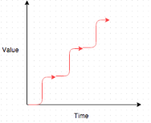

# 第五部分 流程

在公司内部，你已经有了关键人员并且他们有效地发挥作用，数据系统也在运行中，并且信息从管理者到团队成员以及反之流动得很顺畅。当然，拼图的最后一块是与外界（投资者、招聘和客户）打交道。这些过程——筹款、招聘和销售——都是相同的过程。它们只在交换内容上有所不同。

在融资过程中，你将公司的股权和债务作为一种高质量的投资出售，投资者将用资本补偿你。在招聘的过程中，你是在向公司推销一个高质量的就业机会，而新员工则是在为你付出他们的时间和精力。在销售中，你把你的产品作为高质量的解决方案来销售，客户给你钱作为报酬。

在这些情况下，无论是用钱还是时间，都有人做出了投资你或你的公司的决定。因此，你需要建立与这些决策者的信任关系，以便筹款、招募或销售。

彼得·莱因哈特（Peter Reinhardt）指出：“这也是一个将大量复杂的利益相关者对齐，共同完成某事的过程。”

## 第二十七章 融资

### 选择一个合作伙伴，而不是一家公司

当你融资时，你也会得到一个投资者。确保你找到的合作伙伴是你认为能增加价值并且能很好地合作的。不要让公司来选择合伙人，从每家公司的其他创始人身上找出最适合合作的人，确保他们将长期留在公司，然后搞定他们作为合伙人。

### 介绍信

介绍信是融资过程中的关键部分，你只有一次机会。我建议使用三角定位法。

当你想向投资者介绍自己时，首先在你的人脉网络中找到三到五个认识那个人的人。然后请每个人给目标投资者发送电子邮件，让她知道他们认为你很棒，并强烈推荐她与你见面。收到几封这样的邮件后，投资者将主动联系你。她以前收到过推荐信，但从未收到过同一个人的三个或更多推荐信。她得出结论：你和你的公司必须真正优秀，因此在甚至见面之前就已经倾向于投资于你。

从你这边来看，在短时间内（一周内）堆叠所有推荐非常重要（如第二十八章所述）。就像公共关系一样，你正在努力实现临界质量，并使你的推荐超越其他引推荐的噪音。将推荐人紧密地堆叠在一起，可以确保它们高于噪音。

重要的是不要把相同潜在文本交给每个推荐方转发。如果他们最终发送了相同内容，则揭示了由你组织推荐信件这一事实。因此，请为你的推荐方提供不同的建议内容，或根本不给任何建议。

### 两种方法

融资有两种方法：传统方式和搞关系的方式。

传统方式是当你向投资公司推销你的故事时，通常是用幻灯片，描述客户的问题、你的解决方案、市场规模、单位经济、财务预测、竞争、团队成员、吸引力、进入市场的战略等等。你可能会把你的演讲重复几十次，然后才发现对你或你的公司感兴趣的火花。

搞关系的方式是在与投资者建立信任、友好的关系之后再讨论公司业务。这需要更多时间，但可以显著提高成功率。这种方法有效的原因是无论我们看起来有多理性，我们大多数时候都受到情感反应的影响。我们做出本能、直觉的选择，而我们理性的大脑会很好地将逻辑套用于这些选择上。

第一次谈论你的公司时，投资者会决定是否想要投资。如果她还不喜欢或信任你，那么你的公司最好是完美无缺的——但往往并非如此。因此，关键是等到你确定投资者个人喜欢和信任你后再谈论你的公司。到那时，投资者将对你有积极偏见，这时候无论你的公司缺点有多少，她都会倾向于投资你的公司。

但是如何让投资者喜欢和信任你呢？

### 建立信任和好感

想想你喜欢的人。你喜欢那些只谈论自己，对你和你的生活毫无兴趣或好奇心的人吗？还是喜欢那些询问你情况，专心听取，并真正好奇你是如何运转的人？

第一次见到潜在的投资者时，询问他们本身。真正对他们的工作和生活感到好奇。问他们许多问题。通过说“我想我听到你说……”并将他们所说的重点重复给他们，向他们证明你在认真听取。在会议结束时，记下你所记得的有关这个人的所有信息。

在你们下次会晤时，说：“上次我们谈话的时候，你说…”，并再次重复要点。当我们发现有人关心我们生活的细节并且记得它们时，这是一件令人温暖的事情。

此外，还要让他们知道你感激他们所做的事情。即使没有别的，你也可以感激他们抽出时间和你见面。

如果没有明确谈论公司的目的，你如何首先安排会议呢？你可以使用上面提到的三角测量法，但如果你没有足够的共同熟人，你可以直接要求会议。明确表达你建立关系的意图。比如说：“我们只想与那些我们建立了良好关系的投资人合作。因此，让我们从喝咖啡开始，互相了解一下。”

第一次会面后，请求第二次会面。由于明确的目的是建立关系，投资者很可能会答应。如果你真的让他们谈论自己，他们会喜欢这次会面，并期待下一次。

这些会议不必很长，也不必亲自进行。如果经过时间的流逝后，你展示出真正的关心和对他们生活细节的记忆，一个十五分钟的电话可以像一小时的餐食一样有效。经过两次这样的会议，当你倾听他们并反思他们所说的话时，他们会信任和喜欢你。再过几次，他们会爱上你。当他们喜欢并信任你的时刻到来时，你会知道。他们可能会说出来。如果不是，他们的肢体语言也会表现出来。

你可以自信地谈论你的公司，因为他们已经倾向于投资。如果你不擅长读取肢体语言，那就等一下。在某个时候，他们会说出这样的话（这是一位投资人的实际语录）：“我真的很喜欢你，我想要投资你的公司。现在告诉我你的公司是做什么的。”

总之，有四个关键点：

1.  询问他们的生活情况。

1.  通过说“我想我听到你说过…”来证明你已经听到了。

1.  在下次会议上，通过说“上次我们交谈时，你提到过…”来证明你记得。

1.  让他们知道你欣赏他们的哪些方面。

如果你做完这四件事，你就会建立起一种联系，然后就会得到一个愿意投资的投资者。

当大多数 CEO 第一次听到这种方法时，他们会有强烈的负面反应。这种方法感觉很不自然，违背了他们迅速关闭交易的直觉。但是，等到他们尝试了这种方法，并且发现它非常有效时，他们就会成为狂热的支持者。因此，我的最佳建议是尝试在几个潜在的投资者身上使用它，看看它是否比传统方法更有效。

### 加强关系

一旦你和某个人见面几次并展示了你对他们生活的记忆和关注，那么你们就建立了一种关系。这通常已足够让他们喜欢你。但为什么只满足于足够呢？要进一步加强关系，继续保持好奇心，并展示你记得他们说过的话。三到五次接触将巩固关系。并非每次接触都需要当面会谈——发一条简短的信息可能就足够了。

这是来自世界上一家最成功的投资公司之一的合伙人的感激信息例子：

嘿，马特：

只是想表达感谢之意。我非常喜欢我们周二的交谈以及之后的简短交流。也非常感谢你请我吃午餐。很快再聊！

比尔

我感到荣幸，他花时间赞赏我。

CoinList 创始人兼 CEO 安迪·布朗伯格（Andy Bromberg）更进一步说：

冒着泄露我的秘密的风险，我建议写手写感谢信。我的手写感谢信的反馈令人难以置信。人们感到震惊。而且经常会记得我是“手写便条的人”。

所以定期浏览你的联系人列表并发送感激之意的消息是一个好习惯。你将会惊讶于它所产生的巨大善意。安迪建议把这种做法变成正式程序，他说：“每天我审查所有的互动，并发送（或安排）合适的谢谢邮件。这确保我不会漏掉任何人，并且能够及时回复。而且仅仅需要几分钟。”

### 推销你自己，而不是你的公司

Speechify 的 CEO 克利夫·韦茨曼（Cliff Weitzman）意识到，关键是要销售他自己而不是公司。如果他能做到这一点，他将赢得一生的投资者-投资者将跟随他进行每个转折和每个公司。因此，当 Cliff 意识到已经建立了信任和喜爱，他用他的兄弟 Tyler 发现的方法分享了他的生活故事。

泰勒·韦茨曼（Tyler Weitzman）是 BlackSMS 的 CEO，喜欢研究社交场合。他在斯坦福大学时，研究了一种在保持谦逊可感的前提下，传达自己成就的方法（或者你更愿意称之为“炫耀”）。通过对大量讲故事高手的采访，Tyler 确定了一种最终的讲述自己故事的谦逊结构。

<bdi>-</bdi>信任：“如果没有[命名其他参与者]，这是不可能发生的。”

<bdi>-</bdi>努力工作：“我们必须付出很多努力才能实现它，例如[描述辛勤工作]。”

<bdi>-</bdi>脆弱性：“当……时，对我来说最困难。”

<bdi>-</bdi>责任感：“我们被自己的梦想驱动着去做[高尚动机]。”

<bdi>-</bdi>感恩之情：“我为……感到骄傲和感激。”

我鼓励你把你的故事用这个结构告诉你的朋友。看看会发生什么。问问你朋友的反应。我想你会大吃一惊的。

有关此方法的示例，请参阅本书末尾的鸣谢部分。

### 时间控制

创业公司的生命周期中，存在一些关键节点，一旦达到，便大大增加了公司最终成功的可能性。每个关键节点、拐点的实现极大减少公司的风险，使公司更容易融资。因此，你的公司价值并非呈线性增长，而是像楼梯一样逐级提升，如图表所示。

一些拐点的例子：

1.  聘请有能力的工程团队

1.  签约前 3 个付费客户

1.  年度经常性收入（ARR）超过 100 万美元，证明产品与市场匹配

1.  雇佣一支有能力的销售团队

1.  ARR 超过 500 万美元，这证明了你销售团队的有效性

1.  为所有部门招聘高级经理

融资的最佳时间是在你达到转折点后。这是因为你的公司刚刚增值，但在达到下一个关键节点之前不会进一步增值，这可能需要几个月的时间。

### 未来股权简易协议（SAFE）与估值

SAFE 和可转换债券这两种投资工具，常应用于不便进行固定估值的股权融资轮次。要么因为筹集的资金太少，要么因为没有机构投资者领投该轮。定价轮通常会产生巨大的法律费用，往往超过 10 万美元，公司最终不得不支付这些费用。SAFE 和债券的费用要便宜得多，法律费用通常不到 1 万美元。因此，仅在筹集的总资金超过 200 万美元，并且最好超过 500 万美元时才进行定价轮。

SAFEs 通常会以优惠价格转换成下一个定价轮，并且还有可能有估值上限。我建议你在完成定价轮后仍然保持 SAFE 。以下是一个例子：

1.  在创办公司时，你可以通过 SAFE 获得 200-500 万美元的初始资金。

1.  当你达到产品市场匹配时，你会在一轮定价的 A 轮融资中再融资 2-10 万元美元，而 SAFE 将会转变为这一轮的融资工具。

1.  随后，立即提供另一个 SAFE ，并继续保留其可用性，直到筹集到另外 5-10 百万美元。

1.  一旦你达到 500 万美元的年度经常性收入，你将额外筹集 500 - 2000 万美元的 B 轮估值，第二个 SAFE 将转换为股本。

1.  然后，你提供第三个 SAFE 轮，如此循环下去。

机构投资者更喜欢投资定价轮。但是，家族办公室甚至战略投资者通常很愿意参与 SAFE，即使公司成熟了，只要他们有信心会有另一个定价轮。因此，在 SAFE 中始终筹集第一笔款项几乎没有风险。这些资金可以延长你的跑道以达到提高下一个定价股权轮所需指标的目的。

### 定价轮

来自亚历克斯·马考（Alex MacCaw）

在某个时候，你需要将你的 SAFE 转换成合适的定价轮。通常这会在 A 轮发生，但有时也会在种子轮发生。由于涉及到大量的定制条款和谈判，这可能是一项昂贵的过程，既需要投入时间也需要投入资金。

创始人经常会收到一堆带有人为时限的条款清单（TS）。然后他们匆忙处理，最终在不理解长期后果的情况下签署这些条款。

非常重要的是要耐心处理，不要犯错，处理得不好它们会回来困扰你！把这个过程看作是不可逆的。花时间与律师仔细阅读每个条款，以充分理解它们。

对你来说，投资者在信息上拥有巨大的优势。他们经常签署此类协议，并擅长作为少数股东控制公司。他们经常在“特殊条款”隐藏一些日后有用的内容。虽然你可能认为这些条款无害，但它们可能在最不经意的时候（比如你出售公司时）被激活。

不要依赖律师把“不可靠”条款找出来。律师认为是标准的，你可能不认同。将你的条款表给其他创始人和受信任的投资者看（如有必要，请进行脱敏处理），寻求他们的反馈。如果你发现了不道德的条款，请将该投资者列入黑名单。

### 法律费用

你需要一家有名的律师事务所来管理你的定价轮融资。他们非常乐意帮忙，这是他们最喜欢的能收取高额费用的方式之一。管理成本和时间是有技巧的。 如果你让他们随心所欲地报价，A 轮投资的费用最终的结果可能轻松超过 10 万美元。然而，如果你积极管理他们，你可以将账单降至 15,000 美元或更少。这很重要，因为公司通常需要支付自己的律师费，以及如果账单超过一定金额（通常为 25,000 美元），还需要支付投资者的律师费。

一个典型的投资过程如下：

1.  律师们互相通话讨论条款。他们在某个问题上意见不一致。

1.  公司律师联系公司决策者寻求指导。（每封电子邮件或留言，律师最少收费 15 分钟，但通常为 1 小时。）

1.  公司决策者回复公司律师。（又是一小时计费。）

1.  公司律师联系投资人律师。（另外计费 1-2 小时。）

1.  投资人律师随后就此问题与投资人决策者取得联系。（另外计费 1-2 小时。）

1.  投资人律师回复决策者律师。（另外计费 1-2 小时。）

1.  这种来回持续下去，累积了大量计费时间，直到达成所有细节协议为止。这个过程需要 45-60 天才能获得最终权限文件，并且各方法律账单通常超过 10 万美元以上。

还有另一条路，将在不到一周的时间内生成最终文件，并使双方法律费用低于 15,000 美元。

投资者需要从本可直接进入他们钱包的管理费收入中掏钱支付法律费用，所以投资者不喜欢支付法律费用（即使是自己的）。他们更愿意给公司更多的钱（这些钱来自基金的投资资本），然后再让公司为自己支付律师费。为投资者做出这种安排，条件是要求投资者支持你对他们的律师遵守你定的规则。这些规则是：

1.  一旦投资的基本条款（在交易备忘录中）达成协议，就会安排一个 4 到 8 小时的会议（或电话会议）。 （这个会议可能只持续 2-3 个小时，但非常重要的是要预留足够的时间，以允许必要时延长。）需要参加者有：

<bdi>a.</bdi>公司的决策者

<bdi>b.</bdi>领投方的决策者

<bdi>c.</bdi>公司律师

<bdi>d.</bdi>领投方律师

如果这四个人中有任何一个无法参加会议（或电话），那么会议将被重新安排。

1.  一方的律师准备投资文件的第一份草稿。另一方的律师在会议/电话之前以书面形式回复批注。律师之间没有其他联系。

1.  在会议上，每个人从头到尾逐段地审查文件，并处理所有书面评论。律师不得发言，除非就所审查的段落向其客户提供建议。谈判是直接在公司（CEO）和主要投资者（投资者）之间进行的。决策者们会仔细研究每一点，直到他们对所有内容达成一致意见。当达成协议时，律师将实时商定最能反映合意的措辞。

1.  撰写基础文件的律师随后起草最终措辞。另一位律师确认这些措辞与他们在电话中达成的完全一致。然后文件就定稿了。

采用这个流程，公司律师费用最多为：

<bdi>4 小时</bdi><bdi>撰写基础文件</bdi>

<bdi>1 小时</bdi><bdi>大会前阅读大家的评论</bdi>

<bdi>8 小时</bdi><bdi>参加大会议</bdi>

<bdi>4 小时</bdi><bdi>起草最终文件</bdi>

<bdi>17 小时</bdi><bdi>@ 800 美元/小时 = 13,600 美元</bdi>

采用这个流程，投资人律师费用最多为：

<bdi>4 小时</bdi><bdi>在基础文件上评论</bdi>

<bdi>8 小时</bdi><bdi>参加大会议</bdi>

<bdi>2 小时</bdi><bdi>阅读最终措辞</bdi>

<bdi>14 小时</bdi><bdi>@ 800 美元/小时 = 11,200 美元</bdi>

### 表决权股份

马克·扎克伯格（Mark Zuckerberg）拥有 Facebook 的全部控制权，尽管他仅拥有少数股份。为什么？因为他所持有的股份具有额外的选票权。既然这种结构已经被投资者接受，那么没有理由不在自己的公司中建立同样的结构。而最容易实现这一点的时机是在获得股权投资者之前。要求律师在股权表（SAFEs 可以）上赋予“创始人股份”。

此外，创始人友好型（FF）股票允许创始人在每一轮定价中获得现金收益，而不会增加其他团队成员授予的期权的公正市场估值。这使得创始人可以继续拿较低的工资（公司内部形象良好），但仍然能够获得足够的报酬，不用担心长期为公司服务而收入不佳。同样，在拥有股权投资者之前应创建这些内容。

管理股票证书对投资者和公司来说都是很痛苦的。从第一天开始就使用像 Carta 这样的电子系统或者简单的电子表格可以避免这种麻烦。这比支付律师事务所秘书每小时 300 美元来回答投资者所有的所有权问题要便宜得多。Carta 为投资者提供即时访问信息，他们很可能已经在 Carta 上拥有他们的大部分投资组合。而附带的 409a 估值服务的费用仅相当于其他独立的 409a 服务收费的四分之一左右。

### 409a

你需要对普通股进行估值，以确定你发行的任何期权的正确行权价格。这是一个 409a（税务局代码）估值，必须在发行期权之前完成。你需要每年更新此 409a 估值，或在公司价值发生变化（新融资，重大客户增加等）时更新。

### 期权池

在进行定定价轮融资时，投资者通常要求公司留有足够数量的未发出期权（Option Pool），以便在融资后还剩下 10-20% 未分配的期权池。这个事实通常会让创始人感到意外，因为当风险投资公司在 20M 美元的事后估值上提出 4M 美元的投资时，创始人认为他们的股份会被稀释 20%。但实际上，在这笔交易中，几乎总需要在股权投资之前先创建一个大的期权池。这个事后期权池再加上新发行的股权，就会导致现有股东的稀释率达到 40%。关于这一点，你没有太多可以做的事情，只需要意识到这一点即可。

## 第二十八章 招聘

招聘时，目标是找到优秀的人才，并吸引他们加入公司。由于这非常重要，你可以合理地投入大量时间，而这正是大多数发展中的公司所做的。不幸的是，这样的时间浪费会使你的其他职能基本停滞。

关键在于效率。而要高效，你必须尽可能少地与那些你不雇用的候选人交流（快速评估），尽可能多地与那些你想要并雇用的候选人交流（建立关系，入职/培训）。请记住，每多花一分钟你与不雇用的候选人交流，你就少一分钟与你想要雇用的团队成员交流。

“在我所见过的招聘系统中，最好的系统被描述在《聘谁》一书中，它由杰夫·斯玛特（Geoff Smart） & 兰迪·斯特里特（Randy Street）撰写。我已经在附录 B 中总结了这个招聘系统。如果这个系统对你有共鸣，我强烈推荐阅读《聘谁》一书以了解详细信息。

### 招聘之前

作为招聘经理，为你需要填补的职位制定一个 90 天路线图。该路线图包括新团队成员加入后在第一个 90 天内需要达成的所有目标。这对于成功的入职至关重要。在面试过程中，与候选人共享此路线图，以确保她对这些目标感到兴奋。

### 销售

最优秀的候选人会收到其他公司的聘用邀请，因此你不仅需要进行评估，还需要从一开始就进行销售自己公司的岗位。

### 建立关系

与募资一样，与招募对象建立关系会大大增加她希望加入你公司的可能性。最好的人才可以在任何地方工作。确保他们想与你一起工作。

使用之前提到的同样技巧来完成这项任务。询问候选人关于她自己的事情，反馈她的回答，并记住下次与她见面时她所说的话。如果你在最初的募资过程中已经使用了这种方法，你就知道它的有效性了。

### 速度

有另外一个关键变量会让招聘者想要接受你的工作邀约：速度！招聘者想要感受到受欢迎。从开始到结束，最简单的方法就是快速完成招聘流程。每一天的延迟都会传递出“我们对你没有信心”的信息。

如果你怀疑这是否真实存在，就回想一下当你筹集资金时的情况。哪些投资者对你来说最有说服力？那些快速响应并决定的，还是那些在决策过程中徘徊数周甚至数月的？Benchmark 和 Sequoia 以在与他们感到激动的公司会面后几天（甚至几小时）提供投资的速度而闻名。

录用函始终受到尽职调查的影响，因此事后有充足的时间发现关键的信息。在招聘中，你会向候选人提供“待定参考人访谈”的职位提议。这里是一个简化的流程：

1.  你联系候选人并安排一次简短的电话面试。

1.  在电话面试中，这位候选人似乎是一名 A 级选手。

1.  你立即安排一整天的现场面试，与所有需要的面试官会面。这很容易做到，因为你已经遵循了这个日历节奏，所以所有需要的面试官都安排在招聘日到办公室准备面试。（使用此方法，你可以在同一天有多名候选人进行现场面试。）

<bdi>a.</bdi>在那一天的最后，面试团队会召集并作出决定。

<bdi>b.</bdi>如果“是”，那么当晚你就联系候选人并说：“我们喜欢你。我们想让你在我们公司工作。在参考人访谈通过后，我们愿意向你提供职位。

<bdi>c.</bdi>你进行口头讨论，探讨成功的聘用条件。你要求他们完成这个句子：“只要 _________，我就会加入贵公司。

<bdi>d.</bdi>你处理每个请求。如果所有请求都可以完成，你将进入下一个阶段。

1.  你组织参考人访谈。

1.  如果那些都是积极的，你就回到候选人那里：“参考人访谈很棒。我们希望你加入我们的公司。如果我们向你提供以下报价（包括福利等方面的详细说明），你会接受吗？”来回沟通直到达成口头协议为止。

1.  你邀请候选人参加“录取仪式”，向他们提出聘用邀约并得到他们的接受。（有关录取流程的更多详细信息见下文。）

这个流程从第一次联系到接受录用函可能只需要 2 周的时间。如果你的过程变得这么快，那么你的优秀候选人接受率将开始类似于 Benchmark 和 Sequoia。

当然，因为你的接受率会非常高，你可以变得非常挑剔，只选择最好的。

### 薪酬

你向新团队成员提供多少薪酬？现金和股权各是多少？

我首选的方法是：

1.  调查该职位（角色和资历）的市场薪酬。有很多在线薪酬研究可以展示这一点。市场薪酬是指大公司（微软、Facebook、谷歌）为此职位支付的任何报酬。

1.  调查新团队成员生活所需的现金金额（住房、食品、交通、儿童支出等）。

初创公司需要匹配市场薪资水平，不是像大公司一样以现金形式，而是以相对较少的现金（不少于舒适生活所需的金额），加上股票来弥补差距。

这里有一个例子来说明权益部分如何计算。 假设这个职位是谷歌的三级工程师，薪酬总额为 30 万美元。 成员需要 12 万美元现金才能舒适地生活，并希望将其余额投资于初创企业的股权。 股权金额是通过将市场价与现金价之差 （$300,000-$120,000=$180,000），然后乘以 4 年 （$180,000 x 4 = $720,000）来计算的。 然后将此数额除以介于 1 和 2 之间的系数，该系数代表股权在 4 年内预期的价值增长非常保守的估计。 1 代表没有预期的价值增长。 2 代表预期的价值增长为 2 倍。 如果使用 1.5（最常用的因子），最终金额将为 $720,000 / 1.5 = $480,000。 因此，授予此金额的期权，无论购买了多少股权，在公司的当前估值下。 期权在四年内兑现。

我更喜欢让新团队成员选择三个不同级别的股权投资额，最低的现金水平是能够舒适地生活所需的水平。

这是一个例子，目前该公司价值 5000 万美元。在达到成熟阶段之前，该公司很可能需要进行另一轮主要融资，以及可选的股票期权刷新，这将导致当前股本表格的预期 50% 稀释。公司最终价值达到 10 亿美元将导致股权价值增加 10 倍。(公司价值增加了 20 倍，股本稀释了 50%，股权价值将增加 10 倍。)

三种选择：

|  | 年薪 | 股权价值 | 预期估值为 10 亿美元的公司 |
| 1 | $120,000 | $480,000 | $4,800,000 |
| 2 | $140,000 | $426,666 | $4,266,666 |
| 3 | $160,000 | $361,333 | $3,613,333 |

希望新团队成员完全相信公司（和不对称赌注的力量），以至于他们选择其中较高的两个股权报价。这种股权是团队成员对公司的投资。而且这有一个巨大的优势：这种投资是用税前美元进行的，其购买力增加了一倍。

### 发放录取函

在发放录取函之前，了解候选人是否愿意接受是非常重要的。一旦准备好录用函，请联系候选人，并要求他们完成以下短语：

“只要……我就会加入公司”

然后他们应该说明所有的要求。如果你愿意提供这些要求，那么你将有一个成功的雇佣。如果你不能提供其中的一个，请与候选人讨论是否有一些你们都可以接受的替代方案。

一旦此过程完成，那么向候选人提出以下问题：

“如果我们为你提供以下的条件（详细说明条件，包括现金、股权、福利等），你会接受吗？”

如果他们说是，那么就让他们做出要约。如果你略过这一步，只是向他们提供录用函，那么很常见的是他们事后会要求更多（签约奖金、搬家费等）。那时你就会陷入尴尬的境地，不得不给予这些要求（从而开始了一个政治文化），或者通过拒绝来开启关系。最好的方法是在提供要求之前让候选人全面预先同意。这样，关系就会以”是！谢谢！我非常兴奋！"这样的积极呼应开始。

授予和接受工作录用函是个人非常情感化的时刻。对此大事加以重视是一件好事。我们建议你将其制成一场仪式。邀请候选人亲自接受录用函。将这个过程作为一种仪式。以下是一些可能的方式：

<bdi>-</bdi>将书面聘请提供给候选人时，用两只手和一个仪式性的鞠躬呈递。

<bdi>-</bdi>给公司派发促销赠品。

<bdi>-</bdi>给一个拥抱和击掌。

无论你做什么，都要让它变得有趣且难以忘怀。

### 入职

大多数公司花费大量的时间、金钱和股权来引进新的团队成员，但几乎完全忽视了让新成员快速上岗并了解公司运作方式，以便他们开始作出全面的贡献。不要犯这个错误！给予员工入职更多的注意、时间和精力，甚至比招聘更多。毕竟，许多在招聘过程中花费时间的人将不会成为团队成员，而你在入职过程中花费时间的 100% 的人已经是团队成员了。把你的精力都集中在那里！

请列出一个清单，列出团队成员需要的所有信息以使其能够有效运作。将这些信息全部写下来并制作成视频。请尽早与新成员分享这个清单、文字/视频信息和 90 天路线图，即使他们还没有开始工作。

在他们上班的第一天，让他们比正常上班时间晚两个小时来上班，这样就有很多人来迎接新来的团队成员。给每个新成员分配一个伙伴，在前两周每天花 15 分钟和他一起检查。这 15 分钟是给新团队成员提出出现的问题，并让他的伙伴确保新团队成员确实在检查清单。

### 解雇

不可避免的是，即使进行了出色的入职安排、路线图创建、反馈等工作，一些团队成员仍然无法表现出色。当这种情况发生时，他们未来表现出色的可能性非常低，其他团队成员甚至比你更深刻地知道这个人的表现不佳。放任这种不良表现会对团队的士气造成打击，并对公司造成财务负担，我们无法承受这种负担。因此，你不能允许这种情况继续存在。为了公司的健康，你必须让这个人离开。当然，直接让他们走是最简单的。然而，如果你没有书面记录“为什么”要解雇某个人，他们可能会对公司提起错误解雇诉讼。这些诉讼很少成功，但是它们会分散注意力。

如果你想最小化这些诉讼发生的可能性，那么请创建书面文件。此文档的次要好处是有一小部分机会使该人开始变得好起来。以下是步骤：

1.  创建一份书面的绩效改进计划（PIP），其中规定了在 7 天、30 天、60 天和 90 天期限内的目标里程碑和日期。

1.  每周进行会议，检查进展是否符合书面里程碑。

1.  如果在 30 天内他没有达到其中的任何一个里程碑，那么你就让他离开。

1.  在 60 天时，一样。

1.  而在 90 天时，同样如此。

如果在这些阶段中的任何一个阶段，团队成员没有达到一个里程碑，而你没有解雇他们，那么你已经完全使书面文档的价值无效，因为你已经建立了一个可证明的模式，即书面文档没有意义。

请注意，他有很小的可能会发生改变。如果你的团队非常小（少于 10 人），建议无需开展 PIP（业绩改进计划）而直接让此人离开。对团队的积极性所带来影响导致的损失远大于诉讼。

当你解雇某人时，请设身处地为他们着想。这是一件情感上毁灭性的事件，而且在财务上也是一次挫折。你的团队也会密切关注你如何对待前员工；报复性的态度会让每个人都感到不安！

真正努力帮助这个人快速找到下一份工作。给他们一个足够的解雇补偿金，让他们有足够的时间现实地找到另一份工作并开始获得报酬。最少为 1 个月，但更现实的是 2-3 个月，然后在这段时间内帮助他们找到工作。

由于你重视透明度，请向公司宣布该人员离职的消息，或者允许该人员自行宣布。在宣布时，赞扬该人员对公司的贡献，并承担自己无法将其技能与公司需求匹配的责任。不要责怪或批评该人员。相反，要对这种情况负责。

你很可能会对这个人感到愤怒。显然，你会更高度珍视你的其他团队成员，而不是这个人。你不希望为他们提供超过法律规定的额外补偿（2 周）。你希望为剩下的表现良好的团队保留这些资源。

感受这份愤怒，然后让它过去。认识到你在这里有责任。你的招聘、培训和管理（或缺乏）已经帮助造就了这种情况。帮助这个人找到更合适的工作和公司是你的责任。如果你想节省公司资源，就帮助他们更快地找到工作。然后回顾你的招聘、培训和管理流程，问自己：“我能做什么来确保这种情况不再发生？

是的，做正确的事情往往会带来数倍的回报。

我称上述过程为“成功解雇”。如果你学会了如何做到这一点，那么你还能因为意识到某些人不适合而更快地裁员，因为这样做不会对被解雇者、公司或你自己造成创伤。你还可以冒更大风险招聘有潜力但经验不足的人，因为现在你有了一个安全的机制，如果潜力没有实现，可以无伤结束这段工作关系。这两个行动将进一步增强你的团队和公司。

## 第二十九章 销售

（此部分由 NeoReach 联合创始人米沙·塔拉韦拉（Misha Talavera）撰写。）

在这部分中，我假设你正在销售一个产品，并且已经找到了产品市场的初始版本。我假设你已经成功地吸引了最初的付费客户，并且这些客户对你的产品非常满意，其中相当大一部分将成为回头客。我将这一部分分为两个部分：第一部分涉及最佳销售实践，第二部分则介绍如何构建和管理销售团队和销售渠道。

### 进行销售

在这一部分，我描述了我最佳的销售实践。我没有使用任何诡计或花招，而是专注于商业伊始以来一直有效的基本原则。为了有效地进行销售，你需要做以下三件事情：

<bdi>-</bdi>建立信任

<bdi>-</bdi>确定客户具体的痛点

<bdi>-</bdi>卖结果，而非功能特性

### 建立信任

在筹款和招募方面，建立信任是首要目标，而且采用的方法是相同的。在前几次会面中，尝试只询问潜在客户与他们有关的话题，积极倾听，反思他们所说的话，并在下次会面中展示你记得他们在之前的会议中所说的内容。

在筹款的时候，你可能会想知道如何安排会议，而不需要谈论你的产品或服务。以下是一些方法：

1.  明确表示你不想谈论你的公司

“在讨论我们的业务之前，我想先了解你的情况，看看我们是否是你需要的解决方案。”

1.  请要求非常有限的时间，以降低负担。

“我们打个 10 分钟的简短介绍电话吧。”

“我们一起喝杯咖啡吧。”

1.  邀请他们参加纯社交活动。

“我们将在 ______（时间&地点）举办酒会，请加入我们。”

“我们再美国公开赛上有座位，请加入我们。”

### 客户开发

第二步是确定客户的具体挑战。为此，你必须问出正确的问题。这可以在你与客户建立初步信任后进行，也可以作为建立信任的一种方式，因为它涉及聆听客户。无论哪种方式，你需要在提出解决方案之前了解客户的痛点。

通常这样做，你将会实现 3 个目标：

1.  你将了解客户正在寻找什么，因此可以用相同的术语呈现你的解决方案。

1.  客户将知道你提出的解决方案是专门为解决她特定的挑战而设计的。

1.  你将淘汰那些不适合你产品的客户，并节省时间集中精力处理那些适合你产品的客户。

那么你该如何能做到这一点呢？通过一系列的问题，你的要致力于理解这三件事情：

<bdi>-</bdi>他们的目标是什么？

<bdi>-</bdi>什么挑战阻碍了他们实现这些目标？

<bdi>-</bdi>他们客服这些障碍的理想解决方案是什么？

如下面的例子所示，对话并不总是像你希望的那样简单的线性问题。你要解决的痛点可能不是客户面临的唯一挑战，所以你的任务是引导谈话朝着你解决的具体痛点方向发展。此外，提出开放性问题，如“请告诉我更多”，也非常有帮助。这将为你提供关于客户对情况的看法的更多背景。最后，请确保向他们重复他们谈到的关于他们的目标、挑战和理想解决方案的重要内容，以表明你正在倾听并建立信任。 （是的，这个主题永无止境。）

### 以下是销售电话的真实示例：

<bdi>-</bdi>我（铺垫）：嗨，斯黛茜！很高兴你能接电话。我期待着为你提供 NeoReach 的演示。在我继续这样做之前，我很想了解更多关于你和【公司】的信息。我可以问你几个问题吗？

<bdi>-</bdi>斯黛茜：当然，对我来说听起来不错。

<bdi>-</bdi>我（目标）：棒极了。请你告诉我，你在【公司】负责人什么？

<bdi>-</bdi>斯黛茜：我是社交媒体主管，负责制定跨渠道的社交媒体战略。这包括在我们的账号上发布内容，购买社交广告以及社交媒体影响者合作。

<bdi>-</bdi>我（目标）：你说【重复她说的话】，请告诉我更多关于你的社交媒体影响者营销。

<bdi>-</bdi>斯黛茜：我们主要与 Youtube 的影响者合作，让他们为我们进行产品评测。去年，我们与超过 400 名影响者合作过。

<bdi>-</bdi>我（目标）：太棒了。你的影响者营销目标是什么，如何衡量成功？

<bdi>-</bdi>斯黛茜：我们的影响者营销目标是建立品牌权益。我们希望让合适的影响者向合适的受众宣传我们的产品。我们通过衡量参与度来衡量成功。

<bdi>-</bdi>我（挑战）：所以，你说的是 【重复她说的话】。那么你在影响者营销方面面临的最大障碍/挑战是什么？

<bdi>-</bdi>斯黛茜：我现在面临的最大障碍是我无法追踪我得团队在做什么。

<bdi>-</bdi>我（挑战）：【重复她说的话】。请多谈谈这个。

<bdi>-</bdi>斯黛茜：我的团队使用电子表格来运作广告活动。因此，很难了解每个人在做什么，我们的开销以及我们得到的结果。

<bdi>-</bdi>我（挑战）：【重复她说的话】。对吗？

<bdi>-</bdi>斯黛茜：是的。

<bdi>-</bdi>我（理想解决方案）：你的问题的理想解决方案是什么？

<bdi>-</bdi>斯黛茜：我希望能够轻松地看到我的团队的活动，每个月的支出费用以及每个营销活动和影响者的效果。

<bdi>-</bdi>我（理想解决方案）：【重复她说的话】。这对你来说为什么重要？

<bdi>-</bdi>斯黛茜：我真的相信影响者营销，但除非我能清楚地看到我们的投资回报率，否则我不能扩大我们的支出。

<bdi>-</bdi>我：我知道了！斯黛茜，请告诉我，这样的产品会如何在【公司】审核和购买？

<bdi>-</bdi>斯黛茜：我是决策者，但在决定之前，我会向我的影响团队和市场副总裁征求意见。

<bdi>-</bdi>我：非常好。好的，谢谢你的回答，斯黛茜。我很想向你展示 NeoReach，我认为你可能会喜欢我们为你构建的内容。

现在，斯黛茜明确了她的痛点，我感到自信她会看到我们的产品的价值，我也准备好以一种方式来介绍我们的产品，以解决她最主要的痛点。

随着你做更多这样的电话，你将开始看到趋势。你的目标客户将有许多不同的相关痛点，你的产品可以解决这些痛点，不同的客户会突显其中一些。做笔记是记录和分类这些知识的基础。

随着时间的推移，你将希望建立一个针对不同类型客户和产品特征的问题和解决方案陈述清单，这里是一个例子：

问题：

针对在负责大型消费品牌影响力营销的社交媒体主管们，需要更好地跟踪他们的影响者营销活动、支出和结果。

解决方案：

NeoReach 是一种影响力营销 SaaS 平台，它能够让市场营销经理通过无缝地跟踪影响力营销活动、支出和结果来扩展他们的影响力营销；与零散无序的电子表格不同。

### 卖结果，而非功能特性

创始人的经典问题是直接深入产品功能。毕竟，你花费了无数小时于这个产品，考虑每一个功能和技术挑战。然而实际情况是，大多数人不关心你的产品功能。他们不关心你的特点，只关心他们的业务成果。

想一想：你不是因为它的新芯片而买新的 MacBook，而是因为它由于速度增加而使你能够实现更多。 无论它是由于新芯片还是由于某种专有的独角兽闪光尘而变得更快，你仍然会买它。 重要的是它帮助你实现更多。

芯片是“如何”，实现更多的是“为什么”。专注于“为什么”。专注于描述一个世界的愿景，即客户的需求通过使用你的产品得以满足。

这里有一个真实的例子。在 DocuSign 成立之初，该公司正艰难地完成大型企业交易。他们销售的软件使客户的销售人员能够虚拟地发送和签署合同。问题在于，没有人关心虚拟合同的签订。他们为什么要这么做呢？没有迹象表明签订虚拟合同实际上对他们的最终结果有任何影响。

当 DocuSign 发现这一点时，他们改变了策略。他们改变了说辞，声称“我们可以通过使你的客户在不到目前用时一半的时间内签署合同，这可以增加你的收入。”接下来的历史就是这样。2015 年， DocuSign 以 30 亿美元的估值筹集了 2.33 亿美元。

那么，你向目标客户提供什么结果？

### 诚信与过度销售的危险

作为一名初创企业的创始人，对潜在客户来说成为一个“顺从的人”是非常诱人的。毕竟，你不应该尽可能地想方设法让收入进入账户吗？

因此，许多创始人最终会过度宣传。我们不建议采用这种方式。不仅因为这是道德上的错误 - 客户信任你诚实地告诉他们你能做什么和不能做什么，而你故意违反了这种信任 - 还因为它对你的业务有几个可量化的影响：

1.  声誉：客户之间相互交流。在你毁了你在市场上的整个声誉之前，你只能过河拆桥。

1.  开发团队：通常，当创始人过度推销产品时，他们会转而对开发团队施加过度的压力，以满足客户的过度销售期望。这会给开发团队带来很大的压力。

1.  文化：创始人认为过度推销是可以的，因为他们控制着产品。然而，如果创始人过度推销，销售人员很可能也会过度推销，因为他们将接受来自高层的文化。一旦你创造了一种过度销售的文化，就很难再回头了。

过度销售是一种懒惰的表现。相反，花时间建立信任。然后，即使你的产品还不能解决他们的所有挑战，你的客户也会从你这里购买。他们相信你将很快增加这些功能。

### 建立销售团队和销售渠道

什么时候应该雇佣销售团队？这是创始人们常问的问题。让收入进账似乎是解决你所有问题的答案，而雇佣销售人员似乎是获取收入的解决方案，所以你现在就应该雇佣销售人员吗？答案是否定的。

在大多数情况下，销售人员永远无法比创始人更好地销售产品，如果你无法销售产品，则他们也无法销售产品。为了茁壮成长，销售人员需要有非常清晰的销售产品，以及非常明确的销售对象方向。此外，雇佣销售人员将会占据你很多精力。

当满足以下两个条件时，你可以雇佣销售团队：

<bdi>-</bdi>你已经找到了产品市场契合的初始版本。这意味着你付费客户中的大部分客户都在续签他们的合同。

<bdi>-</bdi>你已经明确了你要卖什么和卖给谁了。

请记住，随着业务的增长，你也需要发展基础设施，以满足新销售人员的销售需求。这包括入职流程，客户支持等。

### 销售团队的结构

本节基于艾伦·罗斯（Aaron Ross）的《可预测的收入》

“艾伦·罗斯是 [Salesforce.com](http://salesforce.com) 的早期雇员。他被认为是设计使 Salesforce 成为一个 1 亿美元销售机器销售引擎的功臣。如今，他的突破成果已被所有成功的 B2B 科技公司采纳。

艾伦·罗斯最重要的洞见是：大多数高管认为增加销售人员是增加收入的途径。然而，通常增长的主要障碍不是增加团队，而是产生更多的潜在客户。只有当你能预测到你的潜在客户产生时，你才能实现可预测的收入。只有当你实现可预测的收入时，你才能实现真正的规模化。

生成潜在客户和完成交易是必须分开处理的不同职能。生成潜在客户是拓宽的游戏：它需要通过电子邮件和与大量不同的潜在客户交谈，以尽快过滤出不符合要求的人。完成交易则是深入的游戏：它需要建立与符合条件的潜在客户之间的深入关系和理解，以完成交易。

促成交易的人通常比引领潜在客户的人资历更高。这是因为建立关系的技能往往需要经验的积累。

高级销售人员很昂贵，因此他们的时间最好花在关注最高价值的活动上：关闭交易。如果你的销售人员也在生成潜在客户，他们将浪费宝贵的时间，并且因为需要同时履行不同的职能而不必要地感到压力。

你销售团队中的第三个职能角色是客户成功经理或客户经理。他们是为现有客户服务的人，确保他们获得成功并从这些客户中增加业务。保持好新客户和现有客户之间的平衡非常重要，因为很容易过度关注前者而牺牲后者。优秀的客户成功经理不仅会让客户更加满意，更可能续约并增加其消费，还会给你与客户的开放沟通渠道，获取客户反馈，这是不断改进公司和引领市场的唯一途径。

这是销售团队的理想组织结构：

1.  资格认定者（也称销售开发代表）：这些人专注于生成合格的潜在客户，并将其移交给成交者。资格认定者通常获得固定基本工资以及每生成一个合格潜在客户的奖金。一般而言，他们被分成两组。

外勤代表：专注于积极主动地接触潜在客户并进行资格认定的工作人员。最常用的渠道是通过电子邮件和 LinkedIn 挖掘等方式进行。

内勤代表：专注于对通过注册网站、注册电子邮件通讯或直接致电等方式向公司寻求咨询的潜在客户进行资格认定的工作人员。

1.  关闭者（也称为客户执行员）：这些人专注于关闭资格认定的潜在客户。他们的潜在客户是由资格认定人员为他们生成的。圆满者的薪酬由基本工资和佣金组成。

1.  农民（也称为客户成功人员）：这些人专注于照顾现有客户，确保这些客户续约，以及帮助客户增加他们的消费。他们的薪酬由基本工资和一个基于客户留存率的固定季度奖金或者基于账户增长的基本工资和佣金两种方式中的一种组成。

只有在你能够预测地产生潜在客户并有专人维护客户之后，才开始招聘销售代表。这意味着你首先需要雇用一个资格审查员和一个专门负责维护客户的销售代表，同时你担任最后落实合同的关闭者。只有在这个系统顺畅运行之后，再投资招聘销售代表。

### 关于招聘销售人员的常见误解

这里是招聘销售人员时常犯的一些错误：

1.  忽视诚信和文化契合度：许多人认为，适用于团队其他成员的招聘规则不适用于销售团队，因为销售人员是无情的雇佣兵。结果，他们最终雇佣了这样的销售人员，这就成为了一个自我实现的预言。的确，销售人员通常比产品人员更受金钱的激励。然而，这并不会降低雇佣正直、文化契合和使命一致的销售人员的重要性。优秀的销售人员是存在的，问题是要找到他们。

1.  不进行培训：即使你的销售团队在其他公司有出色的业绩，如果他们对你的行业、产品和流程不了解，他们就无法发挥最大能力。最好的销售团队会对新员工进行密集的培训计划，包括与产品、客户成功和销售开发团队合作。

1.  必须雇佣有成就记录的高级销售代表：许多最好的销售团队是由年轻且以前没有经验的销售员建立的。虽然成就记录很重要，但销售 DNA（建立关系的技能）、流程关注和对公司愿景的承诺往往对销售人员的表现有更大的影响。

1.  独立贡献者（AE）与经理（销售副总裁）：与普遍的看法相反，最好的成交者往往不是最好的经理。这是因为管理团队和销售管道所需的技能集与个人交易所需的技能集几乎没有重叠。雇佣销售副总裁时，不要陷入雇佣最佳独奏表演者的陷阱。相反，最佳方法是聘请一位拥有管理证明记录的销售经理。

### 潜在客户开发流程

产生可预测的潜在客户是实现可预测收入的第一步。并非所有潜在客户都是以相同的方式产生的，因此并非所有潜在客户都有相同的需求。具体而言，有三种类型的潜在客户：

1.  Seeds：通过口碑宣传、客户推介或早期关系获得的种子客户。优点：通常能更快速成交，胜率高，并成为你最好的客户。缺点：要主动发展这些客户非常困难，建立出色的产品和客户成功团队是最好的办法。

1.  Nets：通过市场推广（例如活动、SEO、白皮书和广告）吸引的潜在客户。这类客户也被称为净客户，因为重点是数量而非质量，需要通过入站代表对潜在客户进行筛选和确认。优点：如果做得好，这些客户可以非常可扩展和成本效益高。缺点：建立、优化和维护这种渠道需要严重的成本和时间投入。

1.  Spears：通过直接向外联系（通常是通过电子邮件或 LinkedIn 搜寻）吸引的潜在客户。这类客户也被称为矛客户，因为该获取方式是高度定向的，追求的是优质、高质量的潜在客户，而非数量。优点：可预测、高度定向，可立即带来成效。缺点：需要全职的销售代表进行外向拓展，如果你的平均年度交易规模低于 $10,000 美元，则可能无法盈利。

除非你的交易规模非常小（在这种情况下，Spears 可能对你不赚钱），否则这三种策略是非常互补的，应该得到关注。例如，你产生的一些潜在客户可能还没有准备好购买，因此你的电子邮件营销（一种网络策略）可以培育这些潜在客户，直到他们准备好为止。

通常情况下，初创企业的第一个客户是通过种子方式获得的：来自朋友、投资者和其他客户的推荐。随着企业的规模扩大，建议将重点放在 Spears 上。这是因为 Spears 可以产生高度定位的领先优势和即时结果，而 Nets 则可以产生更广泛的领先优势，并需要时间来建立。话虽如此，每个行业、目标客户和产品都有不同的需求。你的工作就是确定哪些渠道可以提供最佳的结果，并着手实施。

如果你正在扩大你的 Spears 策略，我们建议你使用外包第三方，根据你的目标客户资料为你识别主要电子邮件。然后，你的外勤代表可以使用像 [reply.io](http://reply.io) 这样的平台来发送定时电子邮件（Drip email）活动，并更有效地生成线索。

### 资格认证潜在客户和移交

你外勤代表和内勤代表的主要焦点是确认潜在客户的资格，并将这些客户交给客户执行员来完成销售。最佳实践是创建一个确认清单，让你的销售开发代表负责核对。通常，这是通过与潜在客户安排电话会议，逐个确认清单项目来完成的。

每家公司都有自己特定的资格审核清单。通常，合格的潜在客户是指：

1.  感受你的产品所解决的痛点。

1.  有解决该痛点的愿望。

1.  有购买你产品的能力。

一旦确认销售开发代表确认了潜在客户，他们必须将其交给客户执行员。最好的方法是在与客户的电子邮件会话中介绍客户执行元或让他加入下一次与客户的通话。

销售开发代表应该根据他们所产生的每一个合格线索的一定费用或他们所产生的并由客户执行员完成的交易的一定百分比来获得报酬。因此，决定一个线索是否真正合格应该是客户执行元而不是销售开发代表。通常，客户执行员是在客户关系管理系统中标记线索为“合格”的人员。

### KPIs

建立关系有一定的艺术性，但扩大销售引擎则可以被优化和预测。为此，你和你的团队必须严格遵守 KPIs 和流程。

让我们从 KPIs 开始。你选择跟踪的指标也将是你优化的指标，因此请谨慎选择。

这里是我们推荐跟踪的一些主要 KPIs：

平均成交额：每位客户的平均美元金额。

每月新收入：是指在特定月份内关闭的总新收入。可以分为来自哪个渠道以及是来自现有客户还是新客户。

平均销售周期长度：从潜在客户被确认到交易关闭所需的平均时间。

每月的 SQLs 数量：每月传递给客户执行员的合格潜在客户数量。

每个潜在客户成本：指交付给客户执行员的每个合格潜在客户的平均成本。

CAC（客户获取成本）：获得新客户的总成本，包括市场营销费用和薪资。

客户流失率：每个月未续订服务的客户比率。

收入流失率：在任何给定月份内未续订的收入百分比。

记得也要创建计数指标。

客户关系管理（CRM）平台可以帮助你简化销售流程和 KPI 跟踪。Salesforce 是该领域的领导者，我们建议在拥有 10 名全职销售人员后使用该平台。在此之前，我们建议你选择一个轻量级的 CRM 来节省设置时间。

## 第三十章 市场营销

营销可以被定义为了解客户问题（战略营销）以及市场上提供的解决方案（竞争分析），创建一个更有效地解决客户问题的解决方案（产品管理），并让客户知道你的解决方案的存在（战术营销）。

战略营销和竞争分析的核心目标是选择你的目标市场。产品管理的核心目标是实现产品市场契合。战术营销的核心目标是增加销售额。

### 战略营销：选择目标市场（细分、目标、推广）

你已探索出一种扰乱海量传统市场的方法。你是第一个抓住这个机会的人，希望尽快赢得尽可能多的客户。你的第一反应是接触该市场上的任何潜在客户，甚至可能会想让每个地理区域都有几个客户来“标记领土”。你的主要恐惧是其他竞争对手将看到同样的机会并比你更快地行动。

但是历史告诉我们不同的故事。初创公司最大的风险不是在于过于缓慢地掌控整个市场，而是把稀缺资源过于分散，最终没能获得少量或任何客户。

每个客户已经采用了一种遗留解决方案，并且那些老供应商的规模比你更大，资源更丰富。他们与自己的客户有着深厚而长久的关系。即使你的产品或服务更好，客户也需要比原有解决方案更好 10 倍才能进行切换。

因此，与其一次性去攻占整个市场，关键在于找到市场的一个小细分（例如，一组具有相似痛点的客户），他们的问题特别棘手，而你的解决方案确实比广泛的非特定遗留解决方案更好 10 倍。这是你的“低垂果实”。将所有精力集中在这类客户上，以最大化获得你的前几个客户的机会。一旦达成目标，你将有一个可分享的记录，能够筹集更多资金并雇佣更多工程师开发更多功能，并招募更多销售人员建立更多关系。继续专注于这一类客户，直到你已经获得多数（如果不是所有）客户为止。然后利用现在更充足的资源，转向下一个低垂果实所在地。

一个好的类比是第二次世界大战期间盟军对欧洲的入侵。德国人掌握了整个海岸线。盟军本可以选择将入侵力量散布在整个海岸线上。如果他们这样做了，将会在每个法国海滩上有一条船。德国哨卡会屠杀登陆法国海滩的每一名盟军士兵。

当然，盟军并没有这样做。相反，他们研究了海岸线，并找到了最少被防御的海滩（诺曼底）。他们集中所有力量攻击这个目标海滩头，因此能够压倒德国在那里的防御，并确保他们所需的立足点。从那里开始，盟军能够引进更多资源、扩大规模，并最终遍布整个欧洲。

做同样的事情。研究市场。将其分成不同的客户类型。确定哪个细分市场对当前解决方案最不满意，而你的解决方案是最适合它们的。将所有销售和工程努力集中在这个细分市场上。赢得其中一些客户。继续专注于该领域直到占据主导地位后再扩展至其他客户领域（或添加其他产品）。

选择一个目标海滩头的最佳方法是按照比尔·奥莱特（Bill Aulet）所著《自律型创业》一书中概述的步骤进行操作。这里没有必要重新发明轮子，在那本书中清楚地概述了步骤。

### 产品市场契合（PMF）

公司生命周期的第一个重要阶段是达到产品市场契合。这意味着设计出比市场上已有的解决方案更好的解决方案来解决目标客户的问题。在你获得客户确信你的解决方案确实更好之前，请不要尝试扩大规模（花费宝贵资源进行销售、DevOps 等）。当那一刻到来时，就称为产品市场契合。

但是你如何知道何时实现了产品市场契合？问问你的客户，他们会告诉你的。他们也会通过续订订阅、购买更多产品等方式用钱投票表态。

如果你在向企业销售产品，不要认为最初的合同就意味着 PMF（产品市场契合）。它们并不代表真正的意愿。企业会有专门用于测试新产品的预算。但这个初始合同只是一个测试而已。当他们签署完整的长期合同时，你才能知道客户是否真正想购买你的产品。

如果你在向消费者销售产品，同样地，在顾客第二次下单、续订、给出高 NPS 评分或在社交媒体上告诉朋友关于你的产品时，说明你已经达到了 PM Fit（产品市场契合）。

年轻公司犯的更大错误之一是认为他们在真正这样做之前就有了 PM Fit。然后，他们筹集了很多钱，雇佣了一个大团队（包括销售和工程），并在促销上花费了大量资金。一旦他们后来意识到他们实际上没有 PM Fit，那么在产品上迭代就更困难了（较大的团队比较小的团队更不灵活），士气急剧下降（加入被认为适合产品市场的公司的人不希望 PM Fit 前体验的不确定性）。

关键是在实现产品市场适配之前保持团队规模较小。可以考虑 3-6 人。如果是 3 个人，它看起来像这样：一个与潜在客户接触的 CEO 和 2 名工程师。如果是 6 个人，它看起来像这样：一个与潜在客户接触的 CEO 、3 名工程师、一名设计师和一名运营人员。我强烈建议，在实现 PM Fit 之前不要超过 6 个团队成员。否则你只会浪费金钱，破坏士气并减缓自己的步伐。