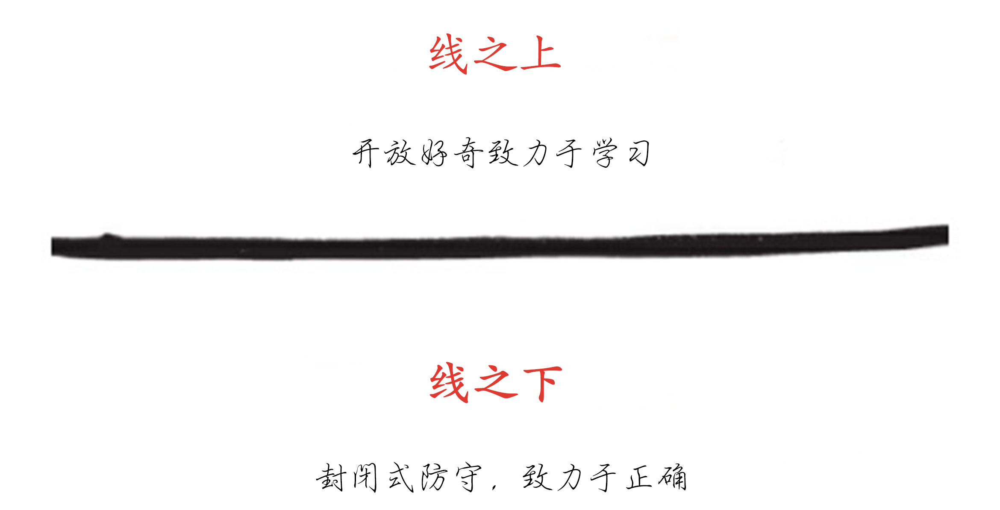

# 第八部分 附录

## 附录 A：《正念领导力》摘要

- 亚历克斯·马考（Alex MacCaw），Clearbit 的创始人兼 CEO

有意识的领导力是更关注于学习而不是坚持正确的态度。当我们的自我让我们害怕做错时，这种恐惧会导致我们不惜一切代价捍卫自己的想法，并费力地说服别人我们是正确的——通常是用愤怒作为手段。

有意识的领导是关于认识到这些情绪（恐惧、愤怒、悲伤）已经控制了我们的思维过程，释放这些情绪，回到好奇心的状态，接受所有的想法和创造力，即使它们似乎与我们自己的想法相矛盾。

只有在好奇的游戏状态下，才能真正实现优雅的解决方案。

以下是书籍《正念领导力》的摘录。

在线之上领导

在任何时刻，一个领袖要么处于线之上，要么处于线之下。如果你在线之上，你是有意识地领导，如果你在线之下，你就不是。在线之上，一个人是开放的，好奇的，并致力于学习。在线之下，一个人是封闭的，防御的，并致力于坚持自己的正确性。

许多人从线之下领导-这是漫长的进化过程中普遍存在的一种状态。一旦我们感觉到第一个冲突的气息，我们的蜥蜴大脑就会启动。恐惧和愤怒上升，我们变得防御，并坚持自己的正确性。此时，我们牢牢在线之下。

知道你在线以下比在线之下更重要。有意识的领导的第一个标志是自我意识和对真理的寻求。第二个标志是暂停、停一秒钟，将自己转变为一个开放和好奇的状态，并站在线的上方。

有意识的原则

以下是生活中应遵循的原则，以便将自己提升到线之上。

彻底承担责任

我承诺对我的生活环境和我的身体、情感、心理和精神健康负全部责任。我承诺支持他人对自己的生活负起全部责任。

承担自身处境（身体、情感、心理和精神层面）的全部责任是真正的个人和关系转型的基础。责怪、羞耻和内疚都源自有毒的恐惧。有毒的恐惧驱动了受害者-斗士-英雄三角关系，这使得领导者和团队在线之下。

有意识的领导者和团队会全面负责——彻底负责，而不是推卸责任。彻底负责意味着将我们生活中的原因和控制权放在自己身上，而不是外部事件。

不要问“该怪谁?”，有意识的领导者会问:“我们能从中学到什么?我们如何从中成长?”有意识的领导者会接受这样一种可能性:与其控制和改变世界，也许世界就是这样。这为个人和组织层面都创造了巨大的发展机会。

通过好奇心学习

我承诺提高自我意识。我承诺将每一次互动视为学习的机会。我致力于将好奇心作为快速学习的途径。

自我意识和学习敏捷被认为是领导者持续成功的关键，它们构成了有意识领导力的基础。

有意识的领导者热情地致力于了解自己，这是他们愿意保持好奇心的基础。在任何时候，领导者要么处于线之（开放、好奇并致力于学习），要么处于线之下（防御性、封闭且致力于正确）。

想要“正确”不会引起戏剧冲突，但渴望、证明和争取“正确”却会。即使有意识的领导者像其他人一样也会变得防御性，但他们经常通过暂停呼吸、接受和转移来打断这种自然反应。

感受所有情感

我承诺将我的情感完全体验一遍。它们到来时，我会在身体里找到它们，然后移动、呼吸和表达它们，以便彻底释放。

优秀的领导者学会利用三个智慧中心：头脑、内心和直觉。

抵制和压抑情感在大多数组织中是标准操作程序。情感被视为负面的，并且会分散良好决策和领导力的注意力。

有意识的领导者知道情感是自然的，表达它们是健康的。他们知道情绪是运动中的能量；感觉只是身体上的感觉。

四种主要情绪是愤怒，恐惧，悲伤，喜悦。知道如何表达它们，直到完成，有助于我们发展情商。每种主要情绪都有独特的能量模式和身体上的感觉。我们所经历的每种感觉以特定的方式邀请我们成长和认知。压抑，否认或回收情绪会导致身体，心理和关系问题。

释放情感，首先定位感觉在身体中，然后发生表达感受。

有意识的领导者会学会定位、命名和释放自己的情绪。他们知道情绪不仅为生活增添了丰富和色彩，而且是成功领导的必要助手。

坦率地说

我承诺说出对我来说真实的事情。我承诺成为一个别人可以坦率表达自己的人。

领导者和团队发现，清楚地看到现实对成功至关重要。为了清楚地看到现实，领导者和组织需要每个人都诚实，不要撒谎或隐瞒信息。他们需要坦率。坦率是以诚实、开放和有意识的方式揭示所有想法、感受和感觉。

坦率地说，增加了领导者和团队共同更清晰地看到现实的可能性。隐瞒是指不向所有相关方披露所有内容。隐瞒还会降低领导者的能量，在他们身上表现为无聊或倦怠，并在团队中产生关系脱节。

与其隐瞒，有意识的领导者更倾向于揭示。他们之所以揭示并不是因为他们正确，而是因为他们希望被了解。通过透明度，他们建立联系和开放学习。有意识的聆听是有效领导力中最重要的技能之一：通过我们的听力“过滤器”区分，我们可以放下它们，并完全关注对方的表达。

有意识的倾听需要勇气:我们必须倾听对方所表达的内容（认知中心）、情感（情感中心）和基本愿望（欲望中心）。在人际关系中，只有当你们有共同的承诺，以及必要的技能，包括能够毫无争议地说话，才可以开始坦诚。

消除闲言碎语

我承诺停止传闻，直接与我担忧的人交谈，并鼓励其他人与他们有问题或担忧的人直接交谈。

尽管闲言碎语早已成为办公室文化的一部分，但它是一个不健康组织的关键指标，也是破坏动力和创造力的最快途径之一。

闲言碎语是指说话者出于负面意图而针对他人的陈述，或是如果被谈论的人在场，说话者不愿以完全相同的方式表达的陈述。

闲言碎语是试图证明一个人思维的正确性，属于线之下的行为；它不是旨在服务被讨论者的评论。

人们说闲言碎语家常是为了获得认可、控制他人和结果、避免冲突、引起注意、感到被包容，并通过让别人错来证明自己的正确性。简而言之，人们通常是出于恐惧而闲言碎语。如果你在说闲言碎语，请向所有涉及者揭示你参与其中。

当领导者和团队学会坦诚地相互交流时，他们将受益于对组织内部问题的直接反馈，否则这些问题可能会破坏创造力和生产性合作。

诚信

我承诺会精益求精地践行征信，包括承认所有真实感受，表达不争论的真相，遵守约定，承担 100%的责任。

征信是践行遵守协议、承担责任、真实表达感受和说出无可争议的真实情况。对于成长中的领导者和组织来说，这是必不可少的。

有意识的领袖在达成协议时非常谨慎。他们会明确协议，并且遵守它们，必要时重新谈判，并在破裂时处理好它们。诚信是有意识的领导和成功繁荣的组织的基础。

表达感激

我承诺以感激之心生活，完全敞开心扉，既接受又给予感激。

致力于感激，同时避免权利观念，有助于领导者和组织在工作场所中增加价值和联系。

感激包括两个部分：敏锐的意识和价值的增加。

当奖励和福利成为期望而不是偏好时，就会产生权利。感激生活有两个方面：开放地接受赞赏和能够充分表达赞赏。对大多数人来说，接受欣赏比给予更困难，人们更害怕接受欣赏。为了避免接受欣赏，人们会有策略性地转移注意力。善于表达欣赏是真诚、无可辩驳、具体而简洁的。

欣赏让社区中独特的才能得到认可。

享受游戏和休息的生活

我承诺创造一个充满游戏、即兴和笑声的生活。我承诺轻松自如地看待生命中的一切，毫不费力地展现它们。我承诺通过尊重休息、更新和节奏来最大化我的能量。

创造一个充满游戏、即兴和笑声的生活，可以让生活轻松展开并最大化能量。玩耍是一种吸引人的、表面上没有目的的活动，提供乐趣并暂停自我意识和时间感。

它也有自我激励的作用，让你想再次实现它。强制性地将注意力集中在任务上的文化会导致更高水平的压力、内疚感、员工疲劳和人员流动。通过这种“刻苦工作”消耗的能量是充满了努力和挣扎的，而通过玩耍消耗的能量是充满了能量的。

大多数领导者抵制玩乐，因为他们认为如果不认真努力工作就会落后。那些休息和玩乐的组织实际上更有生产力和创造力。当尊重休息、更新和个人节奏时，能量得到最大化。

重视并鼓励个人及其组织中充满游戏和喜悦氛围的有意识领导者会建立高效、高成就的企业文化。

探索故事的对立面

我承诺看到我故事的对立面与我的原创故事一样真实或更真实。我认识到我解释了我周围的世界，并赋予我的故事意义。

有意识的领导者通过简单的方式质疑引起苦难的信念，从“这是真的吗？”和“我能绝对知道它是真的吗？”开始。反转练习使领导者可以将他们的信念从确定性转变为好奇心。当有意识的领导者放下他们信仰中正确与否之争时，他们会开放自己去探索好奇心，并与内心最深处的渴望相一致。

## 附录 B：技术创始人的挑战

<bdi>-</bdi>亚历克斯·马考（Alex MacCaw），Clearbit 的创始人兼 CEO

许多软件公司都是由软件工程师创立的。 软件工程师通常很聪明，能够理解和破解系统，并且最重要的是可以构建他们想法的第一版。不幸的是，这也有一个反面，许多软件工程师在转型为全职 CEO 时会遇到困难 - 我就是其中之一。虽然我只能谈论我的经验，但我观察到我的同行也面临着许多相同的挑战。

拥抱销售

在 B2B 软件领域，销售和顾客成功将成为你的业务的核心。个人而言，我从未是一个天生的销售员，实际上，在过去，我大多数情况下将销售看作是低效率的标志。对于一个工程思维的人来说，口头沟通存在信息损失和延迟。再加上一般销售代表要求的佣金和常常伴随该角色的“兄弟文化”，人们开始希望他能够被自动化。

这正是我一开始尝试的。我把销售团队保持在最小规模，并尽可能自动化，试图让自助服务发挥作用。但我发现，在大约 200 万美元的年收入中，我们的增长率趋于平缓。那么出了什么问题呢？

结果证明，我严重低估了两件事情：销售对于获得信任至关重要，客户成功对于克服技术难关至关重要。

信任的消散与地理距离有关。人类的大脑习惯于最信任亲密的朋友，其次是直接的同事，接着是通过面对面交往认识的人，最后才是通过视频会议认识的人。当他们与对方只通过邮件交流时，信任成为能否促成销售的真正问题。

现在，如果你的产品每月售价为 99 美元，这可能不是一个问题。销售所需的信任量随着价格而变化，在低价位时人们可以冒险。然而，要建立一个有意义的业务，你需要大量以那个价格点购买你的产品的客户。如果你针对企业而非消费者，则会发现市场上没有足够多的企业来创造有意义的收入。由于企业更加不敏感于价格，因此提高产品价格是有道理的。比如说一年 20,000 美元，那么现在你面临着信任问题。

引进一个有能力的销售代表，他们会在销售过程中铺平道路。他们会找到关键的决策者，确保听取她的意见，并建立信任。他们会对你的产品的功能做出承诺，你的客户知道，如果事情出了问题，她总是有人投诉并解决问题。

如果你的公司和 99% 的 SAAS 企业一样，你会发现自助服务并不奏效。如果我们只依靠自助服务，我们的收入将会在大约 200 万美元的 ARR 水平上趋于平稳，再也不会有增长。一旦我们增加了销售团队，我们的收入迅速增长。销售可能并不是最高效的事情，但它确实有效。只要人类是购买者，销售就会继续发挥作用。好消息是，销售是经过了无数试验和测试的，有许多书籍、工具和成功的案例可以供你参考。不要把销售只看作是需要尊重的，而要积极拥抱它。

现在，你可能正在想：“这些都很好，我可以看到销售的价值，但是我的销售技巧不怎么好。”好吧，我和你的情况一模一样；我更喜欢做我最擅长的事情：和计算机交流而不是和人类交流。在这种情况下，我的建议是你要找到一个出色的合作伙伴来运营市场推广方面的业务。他们不一定需要成为共同创始人（实际上我认为他们不应该成为共同创始人），但他们需要是你信任的人，能够填补你的公司和你的客户之间的差距。随着时间的推移，你会向他们学习，并逐渐掌握销售技巧。

在我的经验中，最适合这个角色的人具有高情商、中等技术理解能力和出色的职业道德。我发现他们的能力很好的一个指标是他们能否理解（或迅速学习）SQL。

技术鸿沟

我最过高估计的事情是普通人的技术素养。我周围都是非常技术化的人。我的早期团队也是非常技术化的人。难道我的客户也是技术高超的人吗？

不幸的是，这与事实相去甚远。我所学到的是，绝大多数人在面对技术变革时都很艰难地挣扎，勉强保持不被淘汰的状态。每当他们被要求学习一些新工具或概念时，他们会叹气，并想着：“不要再来了——我刚刚完成了上一个学习任务。”这是一场艰苦的战斗，但如果你想让你的客户成功，这是一场必须要打的战斗。

因此，如何解决这个问题呢？是简化产品，改进帮助文档还是优化入职流程？所有这些都很重要，但我发现解决这个问题的唯一答案是客户成功。专职支持代理人将手把手带领客户完成上手流程，及时回答他们的问题，并随时处理出现的任何技术问题。

你可能会再次想到，“但这非常低效。没有办法自动化这个过程，我最终要雇用大量人手。”你是对的——这是低效的，并且有很多开销。你需要投资于寻找和培训这些客户成功代理人，而培训他们会很困难，因为为了与你的客户沟通，他们往往需要与他们同级别的技术能力。但另一种选择要更糟：流失。如果你的客户没有得到适当的入职培训，他们不会看到价值，最终他们会对你和你的产品怀有怨恨，等到续约到来时已经为时过晚——他们已经下定决心要离开。

离开工程师岗位

我认为技术能力较弱的创始人很容易成为伟大的 CEO。他们建立了产品的第一版，雇用工程师，意识到他们在技术上很快就深入不了了，于是专注于获得成为伟大 CEO 所需的技能。

另一方面，热爱编程的创始人常常难以关注公司的其他领域。编程定义了他们，这是他们从十几岁开始就一直在做的事情，这是他们加入这个行业的原因，也是他们每天工作生活中的一部分。

我属于后面的那一种人，离开全职工程师的工作对我来说是一个巨大的挑战。如果这是你毫无顾虑可放弃的事情，那么我很高兴跳过这个部分，否则我有几个建议。

当然，你可以雇用能够填补你弱点的有能力的人，你应该完全这样做，但深下心来，你知道在某个阶段你需要做出决定——将工程师职责委托给他人，将注意力集中在更关键的业务方面（比如招聘）。知道你是自私的，聚焦于你热爱的事情而不是为公司服务的工作，这可能会导致自我厌恶。

我只能说我是如何处理这个问题的，但这是我推荐的过程。它基于公司规模：

0-15 人：不要担心这个困境，只要努力编码和建立产品。

15-20 人：你需要开始委派工程师职责。你唯一能够做到这一点的方法就是绝对信任你的工程团队。找到最好的 CTO 和最好的工程师。起初回顾他们的所有代码，并毫不犹豫地将其与你的标准保持一致。然后随着时间的推移，委派越来越多的工程职责。

20-30 人：大部分的工作都已经委派了。此时，你的工程团队赢得了你的信任，虽然你可能仍然认为自己是最快的工程师，但你会发现将自己扩展的好处更大。你现在的挑战是放弃实际的编程工作。这是你热爱的事情，当然会很困难。我不会立即全部停下来，我会慢慢地将其逐步淘汰到每周只编码一天。然后，关键是填补你现在有的所有闲暇时间，集中于不同的重点：公司建设。只有当你掌握和热爱公司建设时，这才会奏效。找到事业发展中的乐趣，关注人才招聘，建立结构，使人们热爱自己的工作。这些都是你必须学会欣赏和爱的事情。这需要时间，但如果你的心在，一切都是可实现的。如果你的心不在这件事上，考虑雇用另一位 CEO。

## 附录 C：招聘流程

### 在 _（公司名称）_ 进行招聘

### 使命

只聘用 A 类员工。

这些人才囊括了我们需要完成的工作，并符合 __（公司名称）__ 的文化。

### 方法

计分卡：招聘经理创建一份文件，详细描述了该职位需要的人员完成的任务。这是一套定义工作的结果和能力的标准。必须具有可度量性和完成日期。

来源：在我们有职位空缺之前，所有招聘经理都会系统地寻找候选人。

选择：我们进行结构化面试，根据我们创建的计分卡对候选人进行评估。

推销：最后，我们说服最佳的候选人加入我们的团队。

计分卡

使命

职位的使命是什么？

使命描述了业务问题及其解决方案。

例如：“运营负责人将创建和管理一个世界一流的部门，通过提供环境、信息、工具、培训和习惯等支持，支持每个 ____（岗位的人）在其角色中获得成功并使 _____ 公司取得巨大的成功。

成果

必须完成什么结果，到何时才能完成？

这是人员必须完成的任务。这些结果应该是可以衡量的，有截止日期，并且应该有 3 到 8 个（目标是 5 个），按重要性排序。

例如：“在 2014 年 10 月 31 日之前，将每个 ____（岗位的人）转变为我们内部工具（Asana、RelateIQ、GoogleApps）和方法论（GTD、Inbox Zero、目标管理、积极倾听）的熟练使用用户。

能力和素质

所需要的特质/习惯是什么？

1）在这个角色中成功过

2）适合于 _____ 的文化是什么？

这是人员必须如何完成任务。这些行为是某个人必须表现出来以实现上述结果的行为。

例子

我们真正想和他们一起玩。有趣且有兴趣，有有趣的故事。有兴趣了解其他人的故事。

有组织能力。个人有组织能力。遵循 GTD 方法或类似方法，因此对所有待办事项和事件有清晰的认识。专注于关键优先事项。

紧迫感。抵抗组织的自然状态：惯性。知道为了建立伟大的事业，我们都需要立即行动！

创新的。寻求改进流程，使他们的角色和＿＿＿＿更加高效。

具有合作精神。与同事和管理层合作，建立总体协作环境。

有说服力。能够说服他人采取行动。

可教的。渴望进步，愿意接受反馈，并采取行动来改进。

目标对齐

我们通过将计分卡与公司和部门路线图以及与这个人将进行协作的其他＿＿＿＿（岗位的人）的得分卡进行比较来压力测试计分卡。我们确保有协调，然后将计分卡与相关的＿＿＿＿（岗位的人），包括同事和招聘者分享。

一个好的计分卡流程将战略目标转化为执行团队的明确结果，然后将这些结果转化为向他们汇报的人的清晰结果，依此类推。每个＿＿＿＿（岗位的人）最终都会有一组支持战略的结果和支持结果和文化的能力。首先，我们寻找今天需要的工作能力。其次，我们寻求灵活性和适应性，以适应未来角色的变化。

来源

我们始终在寻找人才，并在真正需要新员工之前确定他们的身份。

有三种候选人来源：

1.  我们的网络中的推荐。

1.  招聘人员。

1.  研究人员。

推荐。在这三种来源中，来自我们个人和专业网络的推荐显然是最有效的。

我们需要问自己：“我所认识的最有才华的人是谁，_____ （谁）应该被雇用？”然后询问我们网络中所有有才华的人，以及我们遇到的每个有才华的人，“你所认识的最有才华的人是谁，_____（谁）应该被雇用？”询问我们的顾问、客户、合作伙伴、供应商。加入一个专业组织，在那里询问。

请列出你的前 20 位候选人。

我们个人绩效考核目标之一是：“每个季度寻找一个通过 _____ 电话筛选的候选人。”

招聘人员。我们偶尔会使用招聘人员。他们的效果不如我们自己的网络好。而且，我们明白要想让他们有效，他们需要了解和理解 ______。如果我们不将他们纳入内部并完全暴露给 _______，那么与招聘人员合作就毫无意义了。为此，我们通过与他们分享绩效评估表以及对其推荐候选人的每一个细节来实现这一点。

研究人员。这些是研究关系网络然后给出名单的人，但不直接与候选人联系。我们很少使用研究人员。

这是我们搜寻人才的流程：

1.  来自我们的专业盒个人网络的推荐

<bdi>a.</bdi>创建一个你认识的最有才华的 10 个人的清单。

<bdi>b.</bdi>承诺接下来的 10 周内每周至少与他们中的一个交谈，问他们“你认识的三个最有才华的人是谁？”

<bdi>c.</bdi>继续创建你的名单，并且每周至少与一个人交谈。

<bdi>d.</bdi>在我们的 ATS（应聘者跟踪系统）中记录所有内容。

1.  来自 ____ 的推荐。搜寻每个 ____ 成果清单中的一个成果。

<bdi>a.</bdi>在 ____ 举办搜寻派对。

1.  安排 30 分钟。邀请所有相关的 _____（人）。

1.  请求每个人通过计分卡，尽可能多的联系他们网络中优秀候选人或者候选人来源。

1.  将过程游戏化。给予联系到最多人（或者达到你想要的其他指标）那位奖励。

1.  代表 ______ 的朋友们。我们提供 $ ______ 的推荐奖金，并经常要求 ______ 的朋友们提供推荐。

1.  招聘招聘人员。当我们招聘招聘人员是，我们会给他们计分卡完全的访问权限，以及代表我们对候选人进行沟通。

1.  ATS（应聘者追踪系统）。我们会不遗余力地输入所有相关信息到我们的 ATS 系统中。这是每个人的责任。虽然会有一个负责人每周检查“未填写的信息”，但我们彼此间也要催促对方在看到空缺时填写这些信息。

挑选

我们有一套 4 个面试，可以让我们根据我们的评分卡对一个人进行评估。要成为优秀的面试官，我们必须摆脱被动地观察某人在面试中表现的习惯。相反，使用这 4 个面试来收集关于他们几十年来表现如何的事实和数据。

筛选面试

Topgrading 面试

聚焦式面试

参考人访谈

电话筛选面试

这个环节的目的是尽快筛选出不适合该职位的人。这个过程是通过电话进行的，时间不应该超过 30 分钟。先告诉面试者只需要 15 分钟，如果面试者表现很好，再在电话中决定是否将面试时间延长至 30 分钟。

招聘经理会指派第一个面试人员来筛选。如果候选人通过了第一个面试，招聘经理会进行第二个面试。

在通话前刚刚阅读完岗位要求表。

设定期望：“感谢你抽时间跟我通话。在接下来的 10 分钟里，我想认识一下你，请你先自我介绍。之后，如果你有任何问题想问我，请随时问好吗？”

（重要的是先了解他们的信息，以便你得到的不是简单地重复 ____ 想要的东西。)

面试官的问题指南:

1.  “你的职业目标是什么？”

（如果他/她的目标听起来像 ____ 网站的翻版或他们没有目标，那就将其筛出。）

1.  “你在职业方面真正擅长做什么？”

（要推动他们给你 8-12 个优点，并举例说明，这样你就能全面了解他们的能力。你需要听到和岗位要求表中的要求相匹配的优点和长处。）

1.  “你在职业上不擅长或不感兴趣的事情是什么？”

（要求他们列出真正的弱点，5-8 个。如果他们没有回答足够详细，就跟他们说：“如果你进入我们的下一轮面试，我们将要求你帮助我们联系你的老板、同事和下属，询问他们认为你不擅长或不感兴趣的事情是什么。”）

1.  “你的最近三个老板是谁，他们会如何在我们和他们交谈时按 0-10 给你的表现打分？”

（追问详细原因，了解每个人为什么会给他们这样的评分。我们寻找一致的 8-10 分数。一个 6 实际上是 2 分。但是问问为什么会是 6 分。）

1.  你的职业目标是什么？

1.  你在职业上真正擅长做什么？

1.  你在职业上不擅长或不感兴趣的事情是什么？

1.  你的最近三个老板是谁，他们会如何在我们和他们交谈时按 0-10 给你的表现打分？

然后，重要的是深入挖掘。整个面试过程中，要保持好奇心。问一些包含“什么”、“怎么”或“告诉我更多”的问题。

例如：

1.  “你的意思是什么？”

1.  “能给我举个例子吗？”

1.  “你是怎么做到的？”

1.  “那感觉怎么样？”

（开发人员还需要进行编程测试的额外筛选步骤。）

“

此次初步电话面试的目标是迅速淘汰不合适的候选人。如果你无法明确说出：“这是一个优秀的候选人”，那么就放弃吧。错过一个 A 级选手总比浪费时间在一个边缘选手身上更好。如果我们严格筛选，就能够用更多的时间与被认为是 A 级选手的候选人交流。

如果你认为这是一位优秀的候选人，请让他们知道你认为他们很棒，并且你愿意延长电话面试的时间来进一步了解他们并回答他们有关 ____ 的问题。进入“销售”模式。

如果你认为这位应聘者不是 A 级选手，请在预定的时间（15 分钟，希望如此）结束电话面试。

在 24 小时内，告知他们感谢他们的时间，但此时不会与他们继续推进。

“感谢你抽出时间来面试。我们认为你的优势与我们这个职位的需求不匹配。话虽如此，我们未来还会招聘更多岗位，希望能再次联系到你。”

虽然拒绝别人可能感觉困难，但让他们苦苦等待是不尊重的。绝大多数人更喜欢快速的“不行”的回答，而不是缓慢的回复，更糟的是不回复。

现在，让我们回到那个 A 级候选人。

销售

除了像“建立信任和好感”中描述的那样对候选人的热情、梦想和个人生活感到好奇之外，成功向候选人推销某个职位的关键在于提供足够的信息，让他们看到在这个职位上，他们将拥有：

适合、家庭、自由、乐趣

适合：分享公司路线图、部门路线图和个人路线图。展示他们想去的地方与 ____ 前进的方向相匹配。

家庭：“我们能做些什么来让你的家庭尽可能顺利地适应这个变化？”询问他们的家庭情况。了解他们的名字、年龄等，询问他们家庭成员有哪些关注和需求。满足这些需求。最好能够亲自见到他们的家人（或至少在电话上与他们的配偶交谈），直接发现他们的需求，并满足这些需求。

自由：“在 ____，我们每个季度初协作设定公司、部门和个人的 OKR。你的个人 OKR 意味着我不会过分干预你。在我们定期的 1 对 1 中，我只会要求你向我更新你朝着目标的进展，并在遇到障碍时为你提供支持。我鼓励你与我的团队交流，了解一下和我共事是什么样子。”

乐趣：以下是我们在 ____ 做的有趣活动。

在电话面试结束时，让候选人知道你希望立即安排下一轮面试（可以是第二次电话面试，也可以是现场面试）。

现场面试

对于现场面试，安排与所有必要的决策者连续（之间有一些休息时间）的面试，然后在当天结束时由所有面试官参加的决策会议上进行决策。目标是在一天内获得所需的全部认可以做出肯定或否定的决定。

这一天的面试将包括：

1.  一个 Topgrading 面试

1.  几个聚焦式 面试

面试官的时间表大致如下：

| 830-900am | 面试官会议。今天会发生什么事情。审核评分卡、候选人简历、初筛面试的笔记以及当天的角色/责任。 |
| 845-900am | 团队成员接待应聘者并为他们安排当天的日程。 |
| 900-1100am | Topgrading 面试（1-2 小时） |
| 1100-1200pm | 聚焦式面试 |
| 1200-100pm | 与 ____ 共进午餐 |
| 100-400pm | 聚焦式面试 |
| 400-415pm | 主持人感谢候选人并解释下一步计划 |
| 415-500pm | 决策会议。面试团队会议评估得分卡。招聘经理做出是否进行参考人访谈或终止流程的决定。 |

Topgrading 面试

这个面试的目标是了解应聘者的故事和职业轨迹。这些故事和职业轨迹可以预测应聘者未来的表现。从最早开始，按照时间顺序自然推进。将每份工作（或一组工作）作为一章，每章持续 3-5 年。这个面试大约需要花费 2 小时（对于 CEO 来说，需要 3 小时；对于初级岗位来说，只需要 1 小时）。这个过程值得投入时间。每花费一小时对候选人进行 Topgrading 面试，我们就能节省数百小时处理 B 级和 C 级人物的时间。

招聘经理应该主导 Topgrading 面试，带一位想学习这个方法的同事一起，让他有机会观察，从而学习。

在面试中，首先要设定期望：

“感谢你今天来与我们见面。我们将进行一次按时间顺序的面试，并逐个询问你曾经拥有的每份工作。对于每份工作，我将询问你 5 个核心问题。

1.  你被雇来做什么？

1.  你最引以为豪的成就是什么？

1.  那份工作中有哪些低谷期？

1.  和你一起工作的人是谁？

1.  你为什么离开那份工作？

在面试结束时，我们将讨论你的职业目标和愿望，并且你可以问我关于我们公司的问题。

80％ 的过程将在这个房间进行，但如果我们共同决定继续，我们将进行参考人访谈以完成过程。

最后，尽管听起来很长，但速度会非常快。我的工作是引导讨论的节奏。有时我会要求你深入探讨，有时我会要求我们转到下一个主题。我会尽力确保我们留下足够的时间来涵盖你最近且最相关的工作。

在我们开始之前，还有其他问题吗？”

脚本：

每项工作或一组工作（持续 3-5 年）。

1.  你被雇来做什么？

你正试图创建一张他们的记分卡的图片，如果他们有的话。他们的使命和关键成果（或目标和关键成果）是什么？

1.  你最引以为豪的成就是什么？

希望这些成就能够复核第一个问题中所描述得结果。

1.  那份工作中有哪些低谷期？

不要让候选人轻易脱身。反复改变问题的表述，直到得到真实的回答。

1.  和你一起工作的人是谁？

1.  你的老板叫什么名字？怎么拼写？和他/她在一起工作感觉如何？他/她会说你的最大优势和需要改进的地方是什么？

按照脚本严格执行。通过告知候选人我们将联系这些提到的人，候选人将变得更加真诚。这是 Topgrading 面试中我们最重要的问题，因为它为我们提供了进行参考人访谈所需的信息。对于最近或最重要的工作，请询问：

1.  你们团队中的同事是谁，他们的名字怎么拼写？

1.  你的团队成员是谁，他们的名字怎么拼写？

这些时关键问题，将有助于进行参考人访谈。

1.  你会如何给你继承的团队做 A、B、C 评级？你进行了哪些变革？是否有雇用或解雇员工？你离开时，你会如何给你的团队做 A、B、C 评级？

通过这些问题，我们可以了解应聘者是否会接受已有的团队状况，还是会做出改变以获取更好的结果。我们也可以通过参考检查的方式获取更多信息：“当我们与你的团队成员交谈时，他们认为你作为管理者的最大优点和缺点是什么？”

1.  你为什么离开那份工作？

候选人时晋升、招聘还是被解雇了？一定要弄清楚是什么原因。

为了顺利进行这次面试，你需要：

打断。委婉地处理。不要让候选人东拉西扯，这样做只会削减宝贵的时间，而不传达重要信息。预计每 3-4 分钟打断一次候选人。

“打断别人最好的方式是积极地使用反思式倾听：“哇！听起来公司办公室旁边的那个猪场闻起来真的很糟糕！”候选人说：“是的。”然后你立即说：“你之前跟我说起过启动那个电子邮件广告活动，我很想听听那是什么感觉？它效果如何？

3P。使用 3P 来澄清成就在特定背景下的价值。

你的表现和去年相比如何？

你的表现和计划相比如何？

你的表现与同事相比如何？

推动与牵引。表现优秀的人通常会因机会的牵引而进一步发展。

针对每一次工作变动，判断它是一个推动（Push）还是一个牵引（Pull）。

推动（Push）： “这是互惠互利的结果。” “是我该离开的时候了。”

牵引（Pull）： “我最大的客户雇用了我。” “我的老板为我挖掘了一个更大的机会。”

描绘画面。当你能在脑海中真实地看到所面试者所言之事的画面时，你便知道自己已经理解了他们的意思。请设身处地，站在他们的角度思考。

该停的时候停下来。如果你看到或听到不一致之处，候选人可能在撒谎。如果发生这种情况，请保持好奇心，深入挖掘。把自己想象成一名传记作家（积极正面），而不是一名调查记者（消极负面）。

聚焦式面试

这是让其他团队成员参与，获取有关候选人更具体信息的机会。此次面试着重考察评分卡的成果（技能）和能力（文化适应性）。使用“什么? 怎么? 告诉我更多”框架，在每个答案后保持好奇心。将有 3 位 _____（非招聘经理）被要求进行 3 次聚焦面试，每次 50 分钟。我们将评分卡中的成果和能力分为 3 个部分，让每个面试者专注于一个部分（⅓ 的成果和 ⅓ 的能力）。

设定舞台：

1.  “这次面试的目的是谈论关于的 _____(在空白处填写得分卡中的成果和能力中相应的一项).”

脚本：

1.  “现在我们要谈论 _____(在空白处填写下一个将要讨论的成果或能力)。

1.  在你的职业生涯中，你在这个领域取得的最大成就是什么？

1.  你在这个领域犯过的最大错误，以及从中获得的教训是什么？”

评分

在现场面试一天的最后时候，我们举行一个决策会议，整个面试团队聚集在一起。所有人都需要在 ATS 系统内提交对候选人的评价，然后我们宣布对每个候选人的决策。

技能与意愿的靶心图。我们只选择符合得分卡的技能（他们能做什么）和意愿（他们想要做什么）的候选人，这是他们的技能-意愿配置文件。对于得分卡上的每一项，评估候选人的技能和意愿。只有对于那些你保证有 90% 以上信心能够满足所有目标和核心素质的人才给予 A 级评分。

红旗：

以下是面试过程中需要注意的可能出现问题的信号：

<bdi>-</bdi>候选人不提及过去的失败经历。

<bdi>-</bdi>候选人夸大了自己的回答。

<bdi>-</bdi>候选人把别人的工作归功于自己。

<bdi>-</bdi>候选人对过去的老板做出负面评价。

<bdi>-</bdi>候选人不能解释自己的职位调动。

<bdi>-</bdi>他们的家庭不希望他们接受这份工作。

<bdi>-</bdi>对于管理类招聘，候选人从未必须雇用或解雇任何人。

<bdi>-</bdi>候选人对报酬和职位比对工作本身和 _____ 更感兴趣。

<bdi>-</bdi>候选人试图过于努力地看起来像一个专家。

<bdi>-</bdi>候选人对我们或其他人不感到好奇。（候选人自我沉迷）

抉择：

1.  更新所有评分卡。

1.  对每位候选人评分。

1.  如果我们没有 A 级评分的候选人，重新回到第 2 步：寻找人选。

1.  如果我们有一位 A 级评分的候选人，我们会在参考人访谈过后向他们发出录用通知。

1.  如果我们有多个 A 级评分的候选人，我们会对他们进行排名，并向排名最高的那位 A 级评分候选人发出录用通知，同时我们会尽力为其他 A 级评分的候选人在公司中寻找其他职位。

参考人访谈

我们不要跳过参考人访谈！实际上，我们要通过参考人访谈了解候选人真实情况。这些访谈可以为我们提供远比其他环节更准确的候选人信息，帮我们更准确评估他未来的表现情况。

1.  我们选择恰当的参考人员。老板、同事和下属（有时是三级或二级下属）。我们不使用候选人提供的参考人员名单。

1.  我们要求候选人联系参考人，并安排通话时间。

1.  招聘经理至少进行 2 次（最好 4 次）参考人访谈，而其他团队成员至少再进行 1 次（最好 3 次），总共至少要进行 3 次（最好 7 次）参考人访谈。

脚本：

1.  “你和这个人在什么情况下一起工作？”

1.  “这个人最大的优点是什么？”通过使用“什么？怎么？告诉我更多”框架来提高好奇心。

1.  “在那时候这个人最需要改进的地方是什么？”很重要的一点是要说“那时候”，这使人们可以谈论真正的弱点，假设候选人现在已经改进了这些弱点。（实际上，过去的表现是未来表现的指标。）

1.  “你会在 0-10 的标度上如何评价他/她在这份工作中的整体表现？他/她的哪些表现使你给出这个评分？”

1.  “他/她提到在那份工作中遇到了困难。你能告诉我更多详细的信息吗？”

人们不喜欢给出负面评价，因此留意一些线索。模糊或有限的赞美是毁灭性的，犹豫也是如此。

来自 TrustToken 创始人丹尼·安（Danny An）的建议：

在面试和与参考人电话中要求提供弱点或需要改进的地方时，如果你说“人们不应该做大多数事情，应该专注于能够利用他们的优势的领域。了解弱点是自我意识的体现。”人们会更自由地回答。

销售

我们决定雇用这位候选人只是方程式的一部分。第二个，甚至更关键的部分，是说服候选人加入我们。

正如在建立信任和好感中所描述的那样，关键是要站在候选人的角度思考。了解他们关心什么。然后自己也去关心它。大多数人往往会关心……

适合：分享公司路线图、部门路线图和个人路线图。展示他们想去的地方与 ____ 前进的方向相匹配。

家庭：“我们能做些什么来让你的家庭尽可能顺利地适应这个变化？”询问他们的家庭情况。了解他们的名字、年龄等，询问他们家庭成员有哪些关注和需求。满足这些需求。最好能够亲自见到他们的家人（或至少在电话上与他们的配偶交谈），直接发现他们的需求，并满足这些需求。

自由：“个人路线图上你有完全的决定权，我不会过分干预你。”鼓励候选人与你的团队交流，了解一下和你共事是什么样子。

乐趣：以下是我们在 ____ 做的有趣活动。

未来：“如果你完成了你的目标，而我们作为一家公司也实现了我们的目标，那么在接下来的 5-10 年里，你可能会赚到 x。”

在整个招聘过程中，销售过程都在进行中。以下是关键时刻需要站在候选人的立场上并解决上述问题：

1.  当你进行人才信息搜寻时

1.  当你进行面试时

1.  口头提供录用通知的时间和候选人接受这个机会的时间（在这段时间内要反复与他们保持联系！）

1.  在候选人接受机会和入职的时间之间（是的，他们还没有真正来到公司，要继续与他们保持联系！）

1.  新员工在岗位上的前 100 天（是的，他们仍在评估，要继续关注他们关心的事情！）

要坚持不懈。太多的候选人会因为感觉在得到聘用机会或到达公司后被抛弃而失去。时刻想着：多跟他们接触！

### 实施

实施这个招聘系统：

1.  向全公司宣告。

1.  培训所有的招聘经理和面试官。

1.  执行时间表和流程。在 ATS 系统中输入流程和问题。

1.  将“搜寻一个优秀的候选人”列入每个人的季度评分卡（例如 OKRs）

### 法律

不要歧视。我们仅以一个标准来雇佣员工：他们能否胜任工作。请记住以下内容：

1.  相关性。定义成果和能力将确保我们根据相关标准进行评判。

1.  标准化。拥有一个标准的流程可以确保所有组的公平性。

1.  不要有歧视性语言。我们总是使用“他/她”或“他们”。永远不要对任何人使用贬损性语言。

1.  不得询问违反法律的问题：任何关于婚姻状况、是否想要孩子、怀孕、出生日期或地点、疾病状况、种族或血统、性取向或身体或精神障碍的问题。

### 延伸阅读

请阅读杰夫·斯玛特（Geoff Smart）和兰迪·斯特里特（Randy Street）的《聘谁》一书获取更详细的信息。

## 附录 D：责任区（AOR）清单样本

| 部门 | AoR | DRI-直接责任人 | 候补 |
| 执行官 | 运营每周领导团队会议 | John | Marlo |
|  | 与所有直接报告的员工进行 1-1 沟通 | John | Marlo |
|  | 运营每月全员大会 |  |  |
|  | 解决涉及我的直接报告的冲突 | John | Marlo |
|  | 为提交给执行团队的决策选择决策者 | John | Marlo |
|  | 招募执行团队成员 | John | Marlo |
|  | 批准超过 1000 美元的大额支出 | John | Marlo |
|  | 在与人力资源部门讨论后，对雇用、薪酬和聘用方案做最终批准。 | John | Marlo |
|  | 评估公司资源，在财务计划中准确建模增长和资本配置。 | John | Marlo |
|  | 参加融资和风险投资会议。 | John | Marlo |
|  | 完成公司三个月目标设定。 | John | Marlo |
|  | 每月投资者电话会议。 | John | Marlo |
|  | 投资者更新电子邮件。 | John | Marlo |
|  | 维护 AORs。 | John | Marlo |
| 研发 | 根据产品路线图上的特性为团队分配任务 | Alan | Matthew |
|  | 设定并完成开发期限 | Alan | Matthew |
|  | 前端开发 | Susie | Alan |
|  | 后端开发 | Matthew | Alan |
|  | 管理数据库 | Matthew | Alan |
|  | 管理服务器 | Matthew | Alan |
|  | 建立并监督 bug 报告过程(针对开发团队、所有团队和客户) | Alan | Matthew |
|  | 创建 API 文档 | Matthew | Susie |
|  | 创建和维护自动化 API 测试 | Matthew | Susie |
|  | 开发招聘 | Alan | Matthew |
|  | 对所有新团队成员进行部门培训 | Alan | Matthew |
|  | 在人事部门的帮助下，为部门成员召开所有离岗会议 | Alan | Matthew |
| 产品 | 制定产品路线图 | Jennifer | Susie |
|  | 根据客户和团队的反馈建立功能列表 | Jennifer | Susie |
|  | 为产品路线图创建线框图/对比图 | Susie | Zack |
|  | 审核和批准比较 | Jennifer | Susie |
|  | 产品定价 | Jennifer | Susie |
|  | 安排并运行两周一次的产品开发反馈会议 | Jennifer | Susie |
|  | 创建产品操作指南和产品文档 | Zack | Susie |
|  | 对所有新团队成员进行部门培训 | Jennifer | Susie |
|  | 在人事部门的帮助下，为部门成员召开所有离岗会议 | Jennifer | Susie |
| 销售 | 确保所有销售人员将所有信息输入 CRM | Mark | Aaron |
|  | 在团队会议上更新销售渠道 | Mark | Aaron |
|  | 管理外部顾问 | Mark | Aaron |
|  | 外勤和审查入站线索。 | Aaron | John |
|  | SaaS 的销售 | John | Michael |
|  | 生成出站线索- SDR | Michael | Aaron |
|  | 确保销售指标 | John | Michael |
|  | 开发销售资料、案例研究、常见问题解答和其他资产，以加速销售过程 | Mark | Aaron |
|  | 对所有新团队成员进行部门培训 | Mark | Aaron |
|  | 在人事部门的帮助下，为部门成员召开所有离岗会议 | Mark | Aaron |
| 市场 | 在团队会议上介绍市场更新 | Mark | Aaron |
|  | 跟踪营销 kpi | Mark | Aaron |
|  | 创建和维护内容营销日历 | Mark | Aaron |
|  | 创建和维护每周通讯 | Mark | Aaron |
|  | 保持竞争格局分析 | Mark | Aaron |
|  | 撰写和发布新闻稿 | Mark | Aaron |
|  | 开发和维护记者网络，进行公关发布 | Mark | Aaron |
|  | 开发和维护网络形象(包括网站，LinkedIn, AngelList 等) | Mark | Aaron |
|  | 对所有新团队成员进行部门培训 | Mark | Aaron |
|  | 在人事部门的帮助下，为部门成员召开所有离岗会议 | Mark | Aaron |
| 财务/法律/行政 | 制定和维护月度财务报表 | Marlo | John |
|  | 制定和维护财务预测 | Marlo | John |
|  | 使用 Expensify 管理费用 | Marlo | John |
|  | 对所有新团队成员进行部门培训 | Marlo | John |
|  | 使用[Bill.com](http://Bill.com)管理账单支付 | Marlo | John |
|  | 跟踪和索赔 ARs | Marlo | John |
|  | 热情的工资 | Marlo | John |
|  | 制定，签署和维护法律文件，包括公司文件，保险文件，税务表格等。 | Marlo | John |
|  | 在人事部门的帮助下，为部门成员召开所有离岗会议 | Marlo | John |
|  | 办公室保险、公用事业及相关文件 | Marlo | John |
|  | 保存员工电脑和部门预算的报告 | Marlo | John |
|  | 确保人力资源管理合规- zenefits，内部人力资源管理手册 | Marlo | John |
|  | 管理公司事务 | Marlo | John |

附录 E：董事会

当一个董事会和 CEO 有效运作时，董事会成员会作为 CEO 的副手。同时，董事会还会对 CEO 进行监督，如果 CEO 变得失职，董事会会解雇她并雇用另一个人。这是一个有效董事会的适当角色。不幸的是，大多数董事会并不是这样运作的。

根据法律，C 类公司必须有一个董事会，董事会必须定期开会以及获得关于公司运营的信息和履行受托人责任的监督。 组织成立的目的是使其所有者免受公司的债务个人责任的保护。 如果一家公司没有一个董事会并且不开展适当的董事会会议，那么受到公司侵害的受害者可以起诉该组织并”揭露法人面纱”，从而使法人个人对实体的不当行为承担责任。没有法人会想要这样。因此，董事会会议在遵守法律方面非常有用，可以确保你与股东们的安全。

不幸的是，董事会和董事会会议的实用性通常就此结束。虽然可能存在一些能够向 CEO 提供有用和及时指导的董事会，但绝大多数董事会并不是这样的。在某些情况下，董事会是被动的，不提供什么帮助，也没有什么影响。但是，在大多数情况下，董事会成员实际上是有争议的，他们在很少甚至没有任何了解公司或行业的情况下提供建议，然后会感到沮丧（甚至是好战），如果他们的建议没有被采纳。

作为 CEO，你每个月都至少有 20 个工作日深入参与公司的经营。你的董事会成员只能通过董事会议了解到你能够与他们分享的内容（每月、季度等一次）。董事会成员因此不可能拥有全面的背景信息。然而，许多人仍觉得有必要提供建议。一旦给出建议，因为大多数人有大的自我意识，他们希望其建议被采纳。如果没有被采纳，他们经常会对 CEO 感到不满，这是非常危险的。

由于董事会有雇用和解雇 CEO 的权力，如果足够多的董事会成员因未被采纳的建议而情绪受伤，CEO 可能会发现自己需要寻找一份新的工作。

关于董事会的其他坑：

1.  董事会成员数量是偶数（例如 4、6 等）的董事会可能会出现僵局。即使问题很简单，如果没有方法打破僵局，这也可能引起生存危机。

1.  由于董事会成员通常希望就重要问题与首席执行官进行 1 对 1 的对话，并在董事会会议上发表意见，因此具有许多董事会成员的董事会需要耗费大量精力去维护。

避免这些坑的方法有很多。以下是我的“董事会最佳实践”：

1.  保持董事会成员数量为奇数，并尽可能少。理想人数为 3。 努力不要超过 5 人。

1.  董事会观察员只需要在董事会议上观察，除非董事会成员直接问问题，否者不得发言。强制执行此要求。

1.  在董事会会议前甚至更好地以书面形式向董事会成员提供他们需要的所有信息，这样他们在会议期间几乎没有任何问题。最好的方法是：

<bdi>a.</bdi>创建一个非常完整的演示文稿，包括：

1.  完整的财务报表和指标/KPIs

1.  这些指标的优点和缺点呈现

1.  自上次董事会议以来我们取得的成就（OKRs）

1.  我们计划在下一次董事会议上实现什么（OKRs）

1.  我们面临得 主要挑战以及我们计划如何应对它们

<bdi>b.</bdi>与一个值得信赖得非董事会成员分享那个演示文稿，他会在不清楚地地方提出问题。回答他们所有的问题，并将答案添加到董事会演示文稿中。

<bdi>c.</bdi>将最终版本提交给董事会，他们可能不会有进一步的问题。

1.  在董事会演示之后，希望没有或很少问题出现，给董事会成员布置家庭作业。为每个人分配一个非常具体的任务。不要担心，他们中没有人实际上会完成这项作业。但是他们也不太可能给你提供未经请求的建议。这是家庭作业的真正目标。

1.  如果某个董事会成员给你建议，请记笔记。概括董事会成员说的话，并问他们是否正确。一旦他们说“是的，没错”，感谢他们的建议，并让他们知道你将认真考虑在制定未来计划中。这会让董事会成员感到你至少听到了他们的声音，这通常是他们最想要的。

## 附录 F：IPO，还是不 IPO？

这是个问题。

当你的公司处于良好状态时，有很多人会希望你将公司上市：投资者、员工、顾问、朋友、家人等等。公开交易的股票通常能够为投资者和员工提供最高的流动性和最高的价格。公司的律师、银行家和会计师会在 IPO 和随后的交易中获得巨额费用。朋友和家人会为你的公司上市感到自豪。

在所有这些刺激因素的作用下，IPO 可能会让人觉得是必然的结论。但实际上并非如此！

公开交易的股票确实给公司带来了财务灵活性。但它们削弱了公司的运营灵活性。在 IPO 之后，会出现一系列意想不到的连锁反应，导致一组虚拟的枷锁束缚住你（和你的公司）的手脚。

下面是它得运作方式：

你公司股权价值的强劲表现，使你能够留住优秀的团队成员并收购具备增值潜力的公司。但如果你的股票价值在较长一段时间内显著下跌，许多最优秀的员工将会离开（因为他们的期权价值已经消失，而他们有能力在其他地方找到更好的工作）。同样的，收购也将变得过于昂贵，难以实施。这些动态过程将负面、实质性地影响你的公司管理能力。因此，你会尽一切可能确保股票价格不会显著下跌，而这就是连锁反应的开始。

每个季度，你都必须同时预测下个季度的业绩并报告上个季度的实际情况。会有压力要求每个季度都有增长。如果没有，股东们将会抛售股票。一旦做出了预测，就会有更大的压力要求达到或超过这些预测。如果没有，股东们将会抛售股票。这时候投资循环开始转动起来了。

现在进入空头卖家的阵营，他们认为你在某个时候会从这个投资循环上摔下来。他们在你的股票上持有空头头寸，突然他们的激励是向世界展示你公司所有的最坏的方面，以便立即将股价降低。其中一些空头卖家有诚信，一些则没有。那些没有诚信的人愿意散布传言、谎言和暗示。虽然他们可能在处理虚构的东西，但对于你来说，后果是非常真实的。

最后，还有符合证券交易委员会报告要求的真正成本（萨班斯-奥克斯利法）。这可能每年需要支付数百万美元的会计和法律费用。但更加耗费人力的是需要进行重要的管理开销。

现今，私人市场提供了大量的资本（例如 Softbank、主权财富基金、Tiger Global、Coatue、GV 等），估值也相当高。在决定是否公开上市之前，去联系上市公司的 CEO，了解成本与效益。

Mark Zuckerberg 曾表示想永远保持 Facebook 的私有性质。但是，由于许多员工正在行使他们的期权并在二级市场上出售，公司有可能超过 500 个“股东”的限制。在这个阈值的限制下，美国证券交易委员会要求公司发行公开股份。为了遵守法律，Facebook 选择了上市。

看到这个例子，Palantir 联合二级市场的基金，为其员工提供流动性，以免触发超过 500 个所有者的阈值。

与其听从所有声音（特别是来自机构风投投资者的声音）让你上市，不如考虑保持私有。资本在这个世界上非常充足。一旦失去运营自由，重新获得会非常困难。

## 附录 G：个人

成为最好的 CEO 需要保持生活的平衡，同时也要优化个人生活。 我辅导的 CEO 们经常遇到一些个人问题。 以下是这些问题及其解决方案。

### 睡眠

很多我辅导的 CEO 发现，比起担任公司高层之前，他们现在的睡眠要少得多。对于有些人而言，这意味着在半夜醒来，思考某个问题或待办事项。对于其他人而言，这则意味着睡得晚（为了完成电子邮件等事情），接着被闹钟吵醒以赶到第一场会议。无论哪种情况，这令稀有的“一整晚的睡眠”遥不可及。这些 CEO 认为自己的身体逐渐疲惫，不久之后就会在某种程度上垮掉。

如果这发生在你身上，这里有几个重要的事情需要你知道：

1.  这很正常！你没有任何问题。

1.  你的身体很有弹性，不会这么容易崩溃。（我每晚通常只睡 3 到 6 个小时，但仍感觉很好。）

1.  你的身体会经历轻度睡眠、深度 REM 睡眠和再次轻度睡眠的睡眠周期。每个周期通常持续 1.5 个小时。让我们感到疲倦和脾气不好的是被从深度睡眠中突然叫醒，而这几乎只会发生在被闹钟叫醒的情况下。有趣的是，我们 6 小时的睡眠（在我们结束一个睡眠周期时醒来）比睡 7 个小时再被闹钟从 REM 睡眠中叫醒更能让我们感到更好地休息。（因此，我已经坚持每晚只睡 3 或 4.5 个小时月份，感觉非常好）为了测试这个现象，下载一个 SleepCycle 应用程序，使用它来跟踪你的睡眠模式并在轻度睡眠时醒来。即使没有别的收获，你也将意识到你所经历的是常见的，而不是异常的。

1.  如果你在半夜醒来时想到一个问题或待办事项，那是因为你的大脑在拼命地努力不让这个紧急任务被遗忘。为了轻松地清空你的想法：

<bdi>a.</bdi>在床边放一个便笺本。写下你在夜里想到的任何内容。早上，将其转移到你的 GTD 系统中。

<bdi>b.</bdi>一天中要忠实地遵循你的 GTD 方法。写下你所有的下一步行动，等待完成的任务等等。你的大脑就不需要在夜间记住这个任务或问题，知道你已经在你的 GTD 系统中记录了它。

1.  当你在夜间醒来时，不要与其抗争，接受这件事。允许自己去做有生产性的工作。如果你没有积极性去做有声称性的工作，可以选择做一些舒缓的事情，比如看纸质书。避免做一些无用而刺激性的事情（比如在屏幕上使用社交媒体）。屏幕会发出类似于阳光的蓝光，会让身体的昼夜节律感受器处于“清醒”模式。因此，如果可以避免的话，在半夜不要使用屏幕。通过不允许手机或电脑进入卧室，养成不看屏幕的习惯。

1.  尝试改变你的睡眠环境。不惜花钱来解决问题。以下是一些其他人验证过能建立舒适睡眠环境地方法：

<bdi>a.</bdi>睡眠姿势

1.  面朝下，一条腿抬起成 90 度角（提姆·费里斯（Tim Feriss））。

1.  在床边，腿之间放着一个厚枕头，一个可以使脊柱保持挺直得厚枕头，还有一个可拥抱得厚枕头，全部都在一张记忆棉床上。

<bdi>b.</bdi>睡眠床面

1.  记忆棉床垫

1.  生物床垫

<bdi>c.</bdi>房间

1.  遮光窗帘

1.  白噪音声机或舒缓音乐

1.  卧室禁止使用手机或屏幕设备

1.  尝试在晚上关闭你的 WIFI

<bdi>a.</bdi>仪式

1.  在睡觉前（或在床上）冥想几分钟

1.  高潮（是的，它有帮助！）

### 流动性

如果贵公司真正成功了，你可能会发现自己拥有充足的股权，但仍然缺乏现金。 重要的是要创造流动性并使公司股票多元化。 一般的经验法则是你的“另类资产”（非流动资产）不应超过你净资产的 25％。 由于贵公司的股权可能是你净资产的大部分，因此你的净资产可能超过 95％ 是非流动资产。 几乎不可能出售你在公司中拥有的 75％ 股权。 相反，请记住有两个绝对数字是重要的： 1000 万美元和 1 亿美元。

拥有 1000 万美元的流动净资产的大多数人都会感到安全。 他们松了一口气。 他们不再有风险。 但是，一旦他们持有这笔款项一段时间（并开始养家糊口），他们开始设想这笔净资产可能完全消失的灾难情景。 一旦他们的流动净资产超过 1 亿美元，这些灾难情景就会消失，感觉到充裕。 这是你追求的目标。

事实是，1000 万美元已经足够让人过上美好的生活。 但满足自己内心的需求。 在拥有 1 亿美元之后，每增加一美元可能不会以任何方式增加你的生活质量，但可能会成为负担（如果你购买需要维护和监管的资产）。

因此，一旦贵公司的股权开始拥有显著的价值，请开始向二级股份买家出售，直到你已经卖出 1000 万美元至 1 亿美元。

银行 VS 经纪公司

下一个问题是：我应该把 1000 万美元到 1 亿美元放在哪里？

你有 3 个选择：

1.  商业银行（例如 花旗银行）

1.  投资银行（例如 高盛）

1.  券商公司（例如 嘉信理财）

商业银行会保管你的资金并将其出借给他人。银行获得了这些贷款的全部利益，而你则承担了所有风险。如果经济崩溃，贷款集体违约，那么银行会破产，除非联邦政府出面介入，否则你的所有资产都将用于支付银行债权人的债务。在商业银行存钱是一个糟糕的主意。

投资银行与商业银行类似，它们将利用你的资金为自己赚取利润。唯一的区别是投资银行不仅限于贷款。他们可以用你的资产进行任何形式的赌注或投资。银行获得全部利益，而你承担所有风险。同样，在投资银行存钱是一个糟糕的主意。

最后，有券商公司（如 Schwab、Fidelity）。这些公司不会为自己进行贷款或投资。你在券商公司存放的任何资产仍然归你所有，仅按照你的指示进行投资，你仍然是唯一的受益人。话虽如此，券商公司仍然是一家企业，如果长时间的支出超过了收入，它也会破产（尽管这比银行在激烈的经济下滑中破产的可能性小得多）。在这种情况下，你的资产确实会被卷入破产法院，除了一种例外：美国国债。美国国债永远不会作为托管物。它们始终代表受益所有者持有。如果券商公司破产，你的美国国债证书将直接发送给你，而不是由破产法院持有。

因此，首先将你的流动资产放置在券商公司中。在决定投资策略之前，将所有现金投资于美国国债。

投资

既然钱已经安全，我应该如何投资它？

大卫·斯文森（David Swensen）是耶鲁大学捐赠基金的首席投资官，被认为是资产组合管理的祖师爷。他专门为个人投资者撰写了一本书，名为《不落俗套的成功》。我认为这是个人资产管理的圣经。在书中，他有力地描述了专业资产管理人创造超额收益的能力极为罕见，即使存在，你也很可能永远不会遇见他们。与公开的股票市场相比，你所遇到的资产管理人通常无法为你创造正净回报（在扣除他们的费用和保障金之后）。因此，最好的方法就是简单地投资于低成本指数基金（如 Vanguard ），按照特定的分配方式（他推荐约 30% 的美国股票、30% 的非美国股票、5% 的房地产和 25% 的美国国债）进行投资，并尽可能频繁地进行再平衡。

不幸的是，重新平衡意味着进行大量的交易，这很痛苦。幸运的是，有人建了一个工具来解决这个问题。Wealthfront 是领先的自动再平衡投资引擎。许多其他公司也在效仿，但截至 2018 年，它仍然是我首选的投资方式。