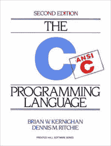
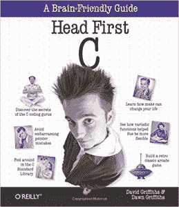
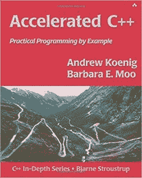
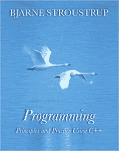

# 初学者和高级程序员的 10 本最佳 C 和 C++书籍

> 原文：<https://hackr.io/blog/10-best-c-cpp-books>

C 和 C++是世界上最流行的两种编程语言。虽然 C 是核心语言，但 C++是 C 语言的扩展。这些语言的可能性是无限的，这就是为什么各种形式和规模的企业都使用它们，因为它们具有可伸缩性和可行性。

由于语言处于领先地位，学习它的人数每分钟都在增加。如果你希望[学习 C](https://click.linksynergy.com/deeplink?id=jU79Zysihs4&mid=39197&murl=https%3A%2F%2Fwww.udemy.com%2Fcourse%2Fthe-complete-c-programming-bootcamp%2F) 和 [C++](https://click.linksynergy.com/deeplink?id=jU79Zysihs4&mid=39197&murl=https%3A%2F%2Fwww.udemy.com%2Fcourse%2Fcpp-deep-dive%2F) ，那么从一本书开始是一个好主意。我们整理了一份由编程社区推荐的 5 本最佳 C 书籍的列表&。不管你的编程水平如何，你都会找到一本符合你要求的书。

Greg Perry 和 Dean Miller 编写的《C 编程绝对初学者指南(第三版)》旨在帮助初学者编写强大而漂亮的 C 程序，而无需成为该语言的专家。这是 c 编程最好的书。这本书是一个快速进入 C 语言舒适区的方法，有一步一步的指导。这本书由 32 章组成，每一章都讨论了 C 编程的核心概念，并附有简明的例子来帮助你更好地理解。每章简要讨论一个概念，然后直接移动到代码，遵循一个实用的理论方法。读者学习一些概念，如组织程序、存储和显示数据、变量、操作符、输入输出、函数、字符串等等。

这本书由多年来各种著名编程书籍的著名作者和编辑策划。Greg Perry 名下有超过 75 本书，都与计算机和编程有关。与此同时，迪安·米勒在出版方面有超过 20 年的经验，并创作了畅销书，如《21 天自学》和《释放》系列丛书。

你可以在这里买到这本书。

 尽管这本书最初是在 40 年前的 1978 年出版的，Brian W. Kernighan 和 Dennis M. Ritchie 的《C 编程语言》仍然被认为是所有技能水平的 C 程序员的圣书，并被公认为学习 C 编程的最佳书籍之一。这本书包含了具有挑战性的练习，涵盖了所有重要的 C 语言概念，帮助你成为一名熟练的 C 语言程序员。

这本书是 Kernighan 和 Ritchie 的合作作品，Ritchie 是 C 语言的创造者，两人都被认为是计算机编程的先驱。这本书在发布后的许多年里充当了这种语言的规范，因为它介绍了这种语言的几个特性，并且涵盖了下面的 ANSI C 标准。它清楚而简要地解释了 C 语言的概念，如类型、运算符、表达式、控制流和函数。虽然它涵盖了概念，但它只是解释了它们的用途，而不是它们是什么。因此，在你开始阅读这本书之前，基本的编程知识是必要的。该书的第二版于 1988 年发布，作者称他们改进了对关键概念和特征的描述。新版本也有新的例子，而旧版本已被完善，以增加学习机制。

你可以在这里买到这本书。

Zed A. Shaw 所著的《艰难地学习 C 语言》是对现代 C 编程的清晰而直接的介绍。这本书以这样一种方式制作，它是所有希望学习 C 编程并渴望提高技能的程序员的完美选择。这本书不仅会帮助你学习 C 编程，还会向你介绍许多在编程世界中寻找的新技能。

由于这本书向读者提供了代码，而不仅仅是小程序的必要代码，这本书在 C 编程世界中为自己赢得了一席之地，这本书包括真正的代码，你可能会在 Github 的项目中看到这些代码。读者将不得不一个接一个地阅读所有的代码来理解 C 编程，所有这些都需要很少或不需要手动操作。这本书包括 52 个精心设计的练习，旨在帮助你掌握严格的防御性编程技术，这种技能将有助于你将来学习任何编程语言。

除了编程概念，如文件，连接器，数组，字符串，函数，内存分配，库，数据结构，堆栈和队列，这本书还讨论了技能，如防御性编码，调试，自动化测试，非法内存访问和破坏和黑客攻击自己的代码。这本书附有一张 DVD，包含超过 5 个小时的视频讲座和教程，完美地补充了这本书。

你可以在这里买到这本书。

David Griffiths 和 Dawn Griffiths 的《Head First C》为 C 编程提供了全面的学习体验。这本书于 2012 年发布，不仅讲述了如何学习 C 编程，还讲述了如何成为一名伟大的程序员。除了语法，这本书还包括实验，通过具体的项目测试你的能力，帮助你运用新技能并建立自信。

这本书讨论了基本和高级的重要领域和概念，包括 C 语言基础，指针，动态内存管理，多线程和网络编程。这本书模仿了大学水平课程的风格和内容，使其成为希望学习 C 编程的学生的示范教材。

你可以在这里买到这本书。

K. N. King 的《C 编程:现代方法(第二版)》是一本平易近人、写得很好的书，涵盖了 C 语言的基本和高级概念，对初学者和中级程序员都有帮助。作者是佐治亚州立大学的副教授，已经出版了几本关于 C、 [Java](https://hackr.io/blog/what-is-java) 和 Modula-2 编程的书籍

这本书的第一版于 1996 年出版，作者的全面和详细的方法使这本书能够被广泛的读者所接受，包括新手程序员到高级学生。这本书被世界各地的许多教育机构采用作为他们的初级 C 编程教材，使第一版成为十多年来领先的 C 编程教材之一。第二版于 2008 年发布，小心翼翼地保留了这本书的流行特征，同时使其与新标准保持一致。它还增加了许多新的练习和项目，以及广泛的修订和更新，以在一本教科书中总结大多数 C 语言概念。是初学者最好的 c 书之一。

你可以在这里买到这本书。

Stanley B. Lippman、Josée Lajoie 和 Barbara E. Moo 的《C++初级读本》被认为是学习 C++编程的最佳书籍之一，是所有技能水平的程序员的理想选择。这本近 1000 页的书从零开始，包含了成为 C++编程专家所需的一切。这本书，为更快和更积极的学习而重组，也为读者提供了大量的读者例子来测试他们的技能。斯坦利·b·李普曼(Stanley B. Lippman)是本书的合著者，他是一名计算机科学家，曾在 C++开发的初始阶段工作。这是最好的 C++书籍，适合初学者开始你的旅程。

第五版延续了前四版的传统，用最新的分类保持材料的更新。这本书也更新到了最新发布的 C++11 标准。这本书从一开始就介绍了 C++库，并展示了它的标准功能和设施，以启动您成为一名成功的 C++程序员的旅程。以前的版本充满了例子，以帮助保持理论与实践的方法，新版本做同样的事情。许多旧的例子已经被更新，同时，几个新的例子已经被加入到书中。全球成千上万的人喜欢这本书(和它以前的版本)。它被认为是初学者和有经验的程序员的宝贵资源。该书是 c++编程的最佳书籍之一。

你可以在这里买到这本书。

Scott Meyers 的《有效的现代 C++》一书遵循了基于示例的格式，这在作者早期出版的书中也有。本书向 C++程序员介绍了 C++11 和 C++14，并帮助他们熟悉这些版本及其特性。包括自动类型声明、移动语义、并发支持等特性。这本书讨论了这些特性的使用，以及如何使你的软件高效、易管理和可移植。

这本书有 300 多页，讨论了几个迎合 C++最新版本的主题。其中一些主题包括支撑初始化的优点和缺点、智能指针生成函数、std:: atomic 和 volatile 之间的区别及其在 C++中的使用，以及 std:: move 和 std:: forward 之间的关系。除了讨论这种语言，这本书还揭示了编写清晰正确的代码可以遵循的技术，以及旧的编程实践如何需要在当前的软件开发中进行一些修订。

你可以在这里买到这本书。

比雅尼·斯特劳斯特鲁普的《C++编程语言》是一本为有抱负的 C++程序员准备的内容丰富的书。但是需要注意的是，C++编程这本书不是针对完全的初学者，而是针对有一些编程知识的人。本书的内容讨论了需要编程背景的 C++版本的具体概念。作者是 C++编程语言的设计者和最初的实现者。

该书的第四版更新了 C++11 及其特性、标准库和基本设计技术。从 C++的基础开始，这本书转移到 C++的必要设施，如结构、语句、函数、联合和枚举。然后讨论抽象机制，如类、模板和元编程；最后讨论了 C++11 和标准库。

你可以在这里买到这本书。

 《加速 C++:实例实用编程》作者安德鲁·克尼格和芭芭拉 E. Moo 是一本采用实用方法的 C++编程入门书。作者是著名的计算机科学家，他们对 C++编程进行了清晰而有力的介绍。这本书不仅讨论了 C++语言的特性，还理解了如何使用这些特性。

Accelerated C++采用了一种创新的方法来教授 C++编程，因为它表明学习 C++不需要 C 编程技能。书中涉及的一些主题是字符串处理、数组、迭代器、类设计、指针、操作符重载和继承。

你可以在这里买到这本书。

 《使用 C++的编程原则和实践》选择了一种基本的方法来帮助读者提高他们的编程技能。这本大部头的书(超过 1200 页)将向你介绍构建你的代码的最佳实践，并帮助你成为一名专业的程序员。对于初学者来说，这本书是编程入门，因为它讨论了面向对象编程和泛型编程。它是 C++编程语言的坚实基础，c++编程语言是一种在现实世界软件中广泛使用的语言。

这本书首先描述了如何感知和理解这本书的内容，因为它有许多练习和讨论，可能会让一个完全的初学者感到困惑。然后，它简要讨论了编程和计算机科学以及软件如何连接人和计算机。继续学习 C++编程，向读者介绍核心概念，如对象、类型、语句、函数、错误、向量、类和 I/O 等。这本书是挤满了问题练习和例子，以帮助您快速有效地掌握概念。

这本书的作者是杰出的比雅尼·斯特劳斯特鲁普，他是 1985 年发布的 C++编程语言的设计者和最初的实现者。Stroustrup 目前是德克萨斯 A&M 大学工程学院计算机科学教授，曾在贝尔实验室和美国电话电报公司实验室工作。被誉为学习 C++编程的最佳书籍之一。

你可以在这里买到这本书。

**结论**

## 总之，如果你想在编程领域发展，学习 C 语言是一个不错的选择。该语言向您介绍了编程概念，如变量、数据类型、方法、函数、循环、数组、字符串等等。学习 C 之后，你可能会被鼓励学习 C++，因为概念几乎是相同的，但 C++是 C 的扩展。学习 C 或 C++可以让你从事游戏开发、系统管理员等工作。如果你想查看 [C 面试问题](https://hackr.io/blog/c-interview-questions)和 [C++面试问题](https://hackr.io/blog/cpp-interview-questions)如果你正在准备[编程面试](https://hackr.io/blog/programming-interview-questions)。

请在评论区告诉我们你更喜欢读哪本书。

**人也在读:**

**People are also reading:**