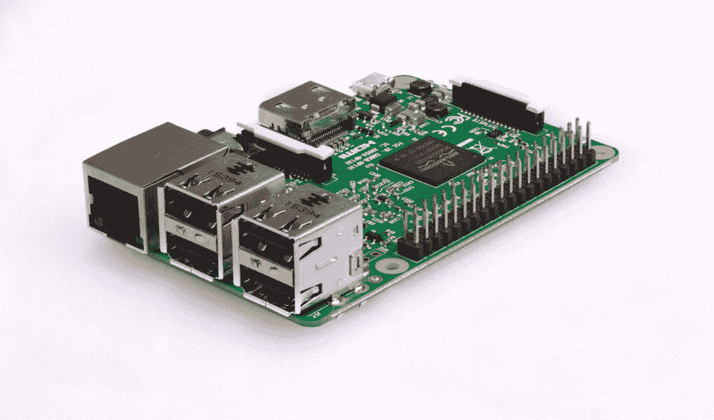
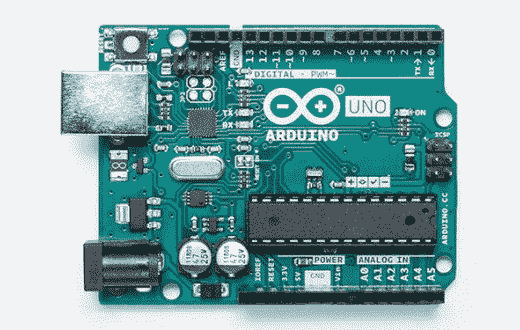
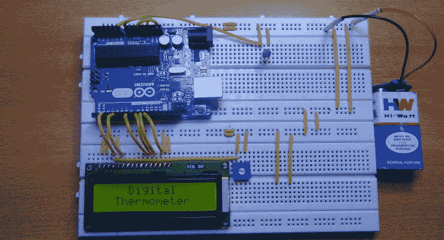

# Arduino vs 树莓派:哪个棋盘最好？[已更新]

> 原文：<https://hackr.io/blog/arduino-vs-raspberry-pi-beginners-guide>

单板计算机在过去的几十年里变得非常流行，因为它们能够用于初学者的开发和学习过程。单板计算机只不过是一个单一的电路板，但作为一个完整的计算机配备了微处理器，内存和输入/输出，以及其他多种功能。单板机最初用于各种行业的演示和开发系统。与标准台式计算机相比，单板计算机通常不依赖扩展槽来实现扩展或基本功能。

虽然有大量的单板电脑可用，但 Arduino 和 Raspberry Pi 是最受欢迎的两种设备。它们在学生和专业人士以及业余爱好者中非常受欢迎。每种板都有其优点和缺点，专业人士知道何时何地使用哪种板，何时切换到另一种板。但是刚刚开始创建项目的程序员经常会在这两者之间感到困惑，并且通常会犹豫不决，不知道应该为他们的项目学习和使用哪种板。

## **什么是树莓派？**

虽然它只有信用卡大小，但树莓派系列是一台功能齐全的电脑，因为它有专用内存、显卡和处理器。该板甚至可以运行 Linux OS(专门设计的版本)，并且很容易安装在大多数 Linux 软件中。这些板是由 Raspberry Pi 基金会开发的，旨在鼓励学校和发展中国家的基础计算机科学学习。尽管仅为教学而设计，但这种板的受欢迎程度超出了预期，并已用于机器人等高端应用。

## **Arduino 是什么？**

[Arduino](https://www.arduino.cc/) 是一款单板电脑，由三大功能组成。第一个是硬件原型平台，第二个是 Arduino 语言，最后但不是最不重要的集成开发环境(IDE) &库。Arduino 板更像是一个微控制器，而不是一台成熟的计算机。Arduino 板不能运行操作系统，但是代码可以被编写并执行，因为它们的永久软件程序解释它。Arduino 板的主要功能是与辅助设备和传感器接口，这使得它非常适合要求最低复杂性且只在传感器或手动输入上工作的项目。

## 【Arduino 与 Raspberry pi 的区别

Arduino 和 Raspberry Pi 都巩固了它们在单板计算机行业的地位，受到全球数百万人的喜爱。虽然它们的特性和功能各不相同，但最终还是要看哪种主板最适合您的项目。本文将讨论 Arduino 和 Raspberry Pi 的特性，并对它们最突出的特性进行比较，以帮助您为您的项目选择最佳的单板计算机。

### **1。学习曲线**

正如我们之前所讨论的，Pi 更像是一台计算机，Arduino 本质上是通向编程世界的大门。总的来说，Arduino 更容易学习，因为它的入门门槛更低。如果你对计算机和编程知之甚少或一无所知，但希望开始，Arduino 是你的正确选择。下面是一个让你了解 Arduino 的速度教程。

https://youtu.be/nL34zDTPkcs

另一方面，具有 Unix 或 Linux 计算背景的人可以很容易地使用 Raspberry Pi，因为它可以很容易地加载专门为 Raspberry Pi 硬件创建的特殊版本的 Linux。一旦安装了操作系统，就像在任何 Linux 机器上工作一样。

### **2。简单性**

与 Raspberry Pi 相比，Arduino 板使用起来要简单得多。只需几行代码，Arduino 板就可以轻松地与模拟传感器和其他电子元件接口。相反，仅仅从传感器读取输入会有很多麻烦，因为它需要安装多个库和软件来创建电路板与传感器和其他电子元件之间的接口。Arduino 中的编码也比 Raspberry Pi 简单，后者需要 Linux 及其命令的知识。

### **推荐课程**

[Arduino 初学者- 2023 完整教程](https://click.linksynergy.com/deeplink?id=jU79Zysihs4&mid=39197&murl=https%3A%2F%2Fwww.udemy.com%2Fcourse%2Farduino-for-beginners-complete-course%2F)

### **3。可用的编程语言**

Raspberry Pi 单板计算机的设计理念是鼓励年轻人加入编程领域。Raspberry Pi 中的 Pi 来自于 [Python 语言](https://hackr.io/blog/python-programming-language)，表示其在计算机中的用途。虽然 Raspberry Pi 在出现的短时间内已经采用了许多[编程语言](https://hackr.io/blog/what-is-programming-language)，由于这个原因，它已经成为大量程序员的首选。Raspberry Pi 中可用的一些语言有 Scratch、Python、HTML 5、JavaScript、JQuery、Java、C、C++、Perl 和 Erlang。

在 Arduino 的情况下，你会遇到 Arduino IDE——一个跨平台的 UI，用于编写程序并上传到板上。它是用编程语言 Java 编写的，可以帮助任何人非常容易地开始 Arduino 编程。但是在高端项目中，Arduino IDE 限制了可以做的事情。如果您不想使用 IDE，可以使用 C++语言编写 Arduino 代码。

在 Arduino 中编程时，初学者和专业人员可以使用许多其他工具。一个这样的工具是 ArduBlock，它帮助没有编程经验的初学者可视化他们的代码，而不是键入代码，帮助他们理解逻辑。另一个基于视觉的工具是 Snap4Arduino，它不太专注于编程，而是更专注于帮助用户理解它是如何工作的，因为它是为稍微年长的受众构建的。其他可以通过外部通信器直接或间接使用的语言有 C#和 Python。

### **4。网络功能**

Raspberry 的联网能力远远超过 Arduino。树莓 Pi 3 具有蓝牙和无线连接功能。它还可以使用以太网连接到互联网。该板配有 1 个 HDMI 端口、4 个 USB 端口、1 个摄像头端口、1 个微型 USB 端口、1 个 LCD 端口和 1 个 DSI 显示端口，非常适合各种应用。然而，另一方面，Arduino 端口并不是直接为网络连接而构建的。即使这是可能的，它也需要一个额外的配有以太网端口的芯片，这将需要进一步的布线和编码。

### **5。处理器速度**

Raspberry Pi 和 Arduino 之间的处理器速度差异非常明显和巨大，这是因为前者是完全可操作的计算机，而另一个是微处理器。对比 Arduino Uno 板和 Raspberry Pi Model B 板的时钟速度，我们看到数值分别为 16 MHz 和 700 MHz。因此，树莓设备比 Arduino 板快 40 倍。此外，Pi 板的 RAM 是 Arduino 板的 128，000 倍，Arduino 板的 RAM 为 0.002 MB。

需要记住的一件重要事情是，Arduino 只是一个即插即用的设备，可以随时打开和关闭，不会造成任何损坏。但树莓派运行在操作系统上，本身就是一台完整的计算机，需要在断电前正确关机。Raspberry Pi 的不正确关闭可能会损坏主板，破坏应用程序，甚至可能会影响处理器速度。

### **6。输入/输出(I/O)引脚**

单板计算机上的 I/O 引脚允许它与连接到它的其他设备进行通信。例如，如果您希望使用单板计算机启动电机或点亮 LED，您需要这些 I/O 引脚来执行这些任务。Raspberry Pi(型号 2)有 17 个 I/O 引脚，而 Arduino (Uno)板有 20 个引脚。

另一个需要注意的关键问题是电路板可以控制这些引脚的时间分辨率。由于 Raspberry Pi 是一台完整的计算机，它的 CPU 可能会被多个其他任务占用，这可能会导致难以将控制时间降至最低。然而，在 Arduino 的情况下，输入可以被监控到最小时间值，以将输出改变到期望的水平。

### 7 .**。功耗**

由于其功能强大(相对而言)的处理器，Pi 板需要连续的 5V 电源，使用电池供电时可能会运行不理想。但由于其低功耗要求，Arduino 可以与电池组无缝运行。但是，功耗可能会随着连接设备数量的增加而变化。

### **8。存储**

基本的 Arduino 板配有 32 KB 的存储空间来存储代码，为板提供指令。这就足够了，因为存储空间不会用于应用程序、视频和照片。然而，Pi 没有附带任何存储，但它支持一个微型 SD 端口，允许用户添加他们喜欢的存储。

### **9。可用性和受欢迎程度**

Arduino 和 Raspberry Pi 板都赢得了世界各地许多人的赞誉。由于如此高的受欢迎程度，Arduino 和 Raspberry Pi 板很容易买到。相比之下，由于功能有限，Arduino 比 Raspberry Pi 板便宜得多。Arduino 板一般是 20 美元或以上，取决于版本，而 Pi 板将花费你大约 35 美元或以上，取决于版本。高端主板的成本可能会增加。以下是全球对谷歌趋势上 Arduino vs Raspberry Pi 的兴趣:

## **机器人和物联网领域 Arduino vs Raspberry**

为您的项目选择正确的单板系统非常重要，因为它将决定您的任务完成的速度和效率。虽然 Arduino 和 Raspberry Pi 主板各有利弊，但选择正确的主板完全取决于您的需求。

例如，如果你的任务是读取传感器数据并实时做出反应，Arduino 板将比 Raspberry Pi 更适合你。这是由于它的低功率需求和低维护。Arduino 非常适合那些需要持续运行，很少或可以忽略交互和反应的项目。这种任务的一个很好的例子就是记录外面的温度并在屏幕上显示出来。Arduino 板非常适合刚刚开始并且没有尝试任何高端项目的初学者。

另一方面，Raspberry Pi 应该用于比上面提到的例子更复杂的项目。当需要同时执行多项任务，并且部分或全部任务比较复杂时，应该使用 Pi 板。例如，如果您的项目是记录特定区域的温度，分析过去几周的温度趋势并预测未来几天的天气，以及确定天气是否最适合灌溉，那么 Raspberry Pi 板就是您所需要的。简而言之，Raspberry Pi 板是为那些正在构建一个复杂且健壮的项目的专业人员设计的，该项目需要同时执行多项任务的能力，这是 Arduino 所缺乏的功能。

## Arduino 与 Raspberry pi:面对面比较

这里我们列出了 Arduino 与 Raspberry Pi 之间的全面对比:

| **装置** | Arduino | **树莓派** |
| **家庭** | Alf-Egil Bogen Vegard Wollan RISC microcontroller (AVR) | 高级 RISC 机器(ARM) |
| **内存(RAM)** | 0.002 兆字节(联合国办事处) | 512 兆字节(型号 B) |
| **时钟速度** | 16 MHz | 700 MHz |
| **操作系统** | 没有人 | Linux 发行版 |
| **输入/输出引脚** | 20 | 17 |
| **存储** | 32 kb 存储空间 | 无板载存储(SD 卡端口) |
| **USB 端口** | 没有人 | 4 |
| **使用的语言** | C/C++ | Python，HTML 5 和 JavaScript |

## **结论**

Raspberry Pi 和 Arduino 展示了一些闪闪发光的差异，这些差异既微妙又显著。这两种板都有一个相当长的利弊列表，但是如果需求是正确的，它们会非常适合。但是不管他们看起来多么不同，总有一个场景是他们可以一起工作来帮助最大化项目的产出。你可以将 Arduino 板比作身体的脊髓，它做出小规模的决定，如点亮 LED 或测量液体的温度，而 Raspberry Pi 板是大脑，它做出复杂的决定，如分析过去的值和预测未来的值。

最后，正如我们已经讨论过的，如果您是初学者，希望学习电子学，或者有电子学背景的人希望从事简单的项目，Arduino 板是您的理想选择。如果你有 Linux 知识，并且想通过创建复杂的网络电子项目来构建它，Raspberry Pi 对你来说是完美的。

无论您选择哪种主板，Hackr.io 都有针对 Arduino 和 Raspberry Pi 的社区指导和课程:

**人也在读:**