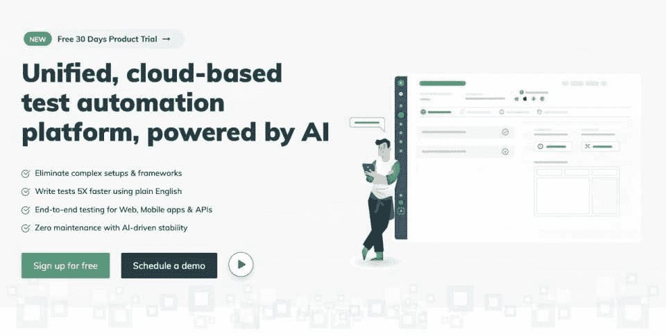
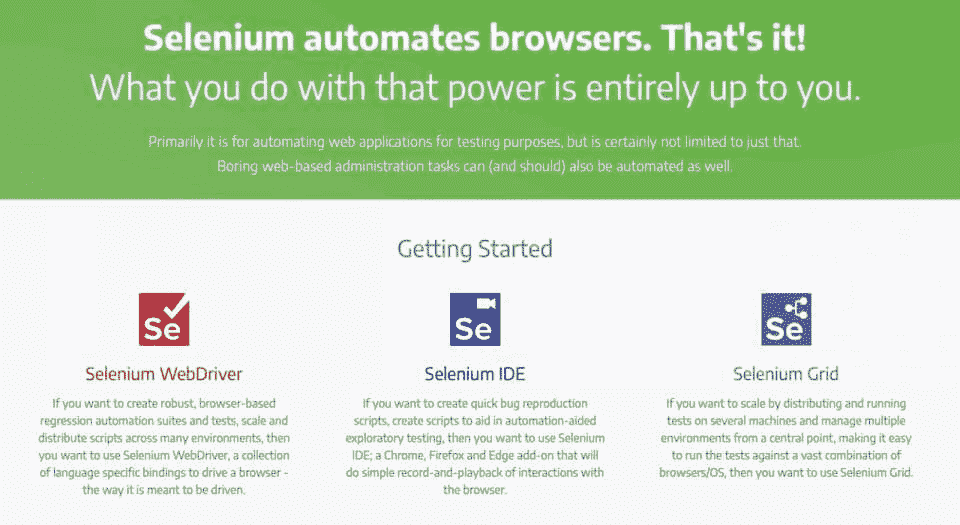
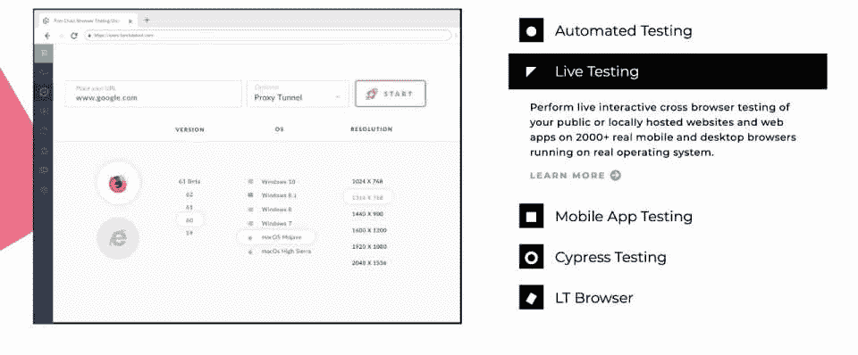
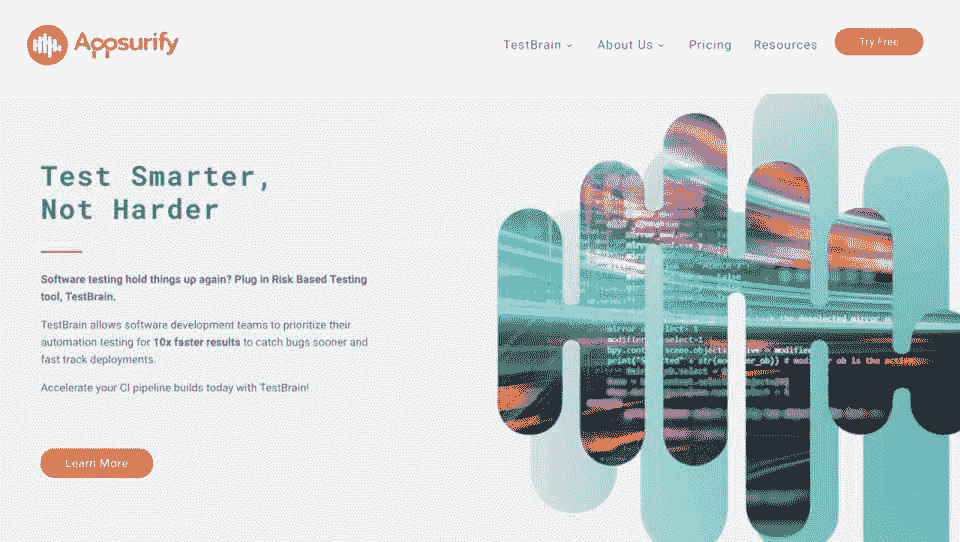
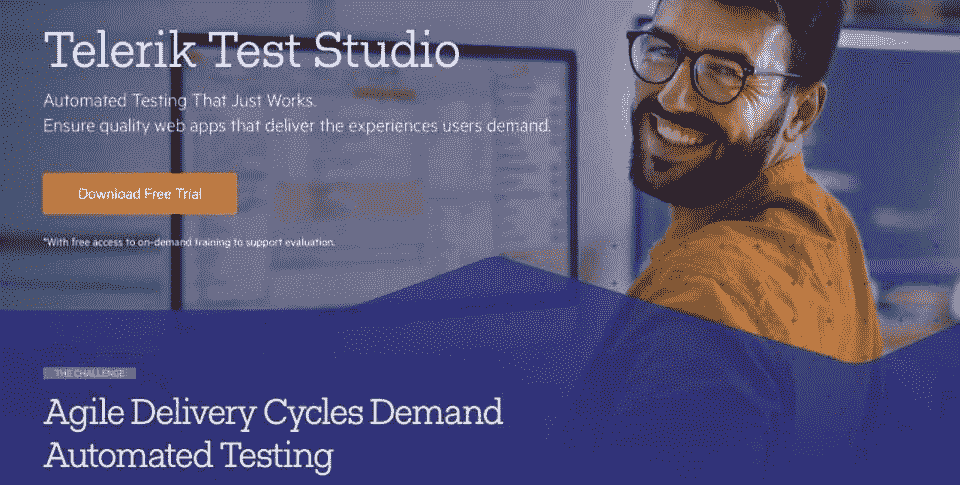
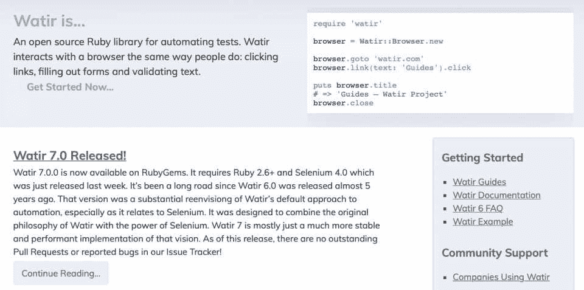
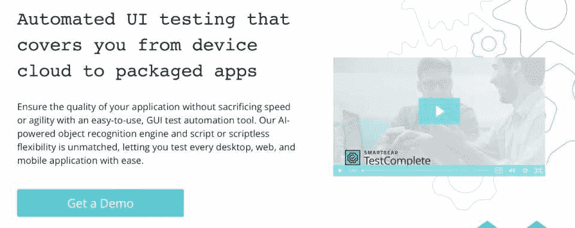
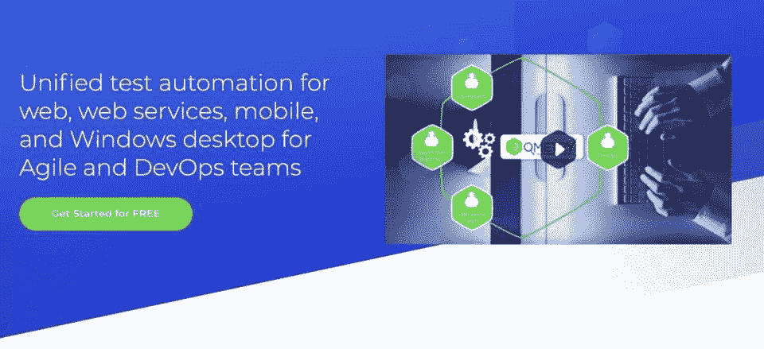
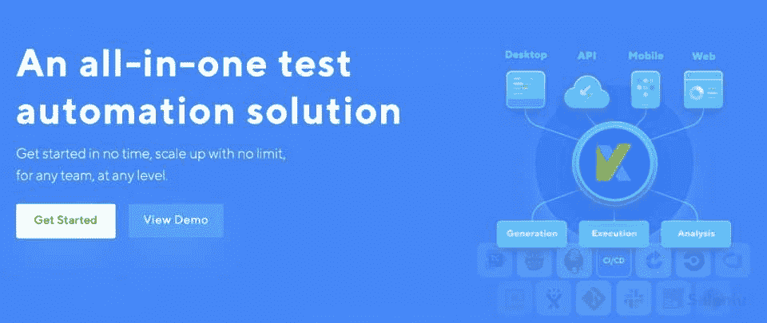

# 2023 年 10 大最佳自动化测试工具[更新]

> 原文：<https://hackr.io/blog/automation-testing-tools>

在软件应用程序部署到最终用户手中之前对其进行测试是软件开发过程中不可或缺的一部分。[软件测试](https://hackr.io/blog/what-is-software-testing)确保特定的软件产品按照客户或最终用户指定的要求运行。此外，在软件产品投入使用之前，它可以识别出软件产品中所有可能的和未被注意到的错误、错误或缺陷。

今天，软件开发人员无法提供一个即使有小缺陷的软件应用程序。因此，他们采用自动化测试来增加软件应用程序的测试集。

自动化测试有助于开发人员提高应用程序的整体质量。它还降低了测试成本，使它比传统的更快。因此，由于自动化，测试的效率得到了最大化。

## 什么是自动化测试？

自动化测试包括使用特殊工具和脚本测试软件产品。在这种类型的测试中，使用专门的测试工具自动执行测试用例，并将获得的结果与预期的结果进行比较。因此，自动化测试中没有人工干预。

自动化测试使得测试过程变得毫不费力。所有耗时且难以手动执行的重复测试操作都通过自动化软件工具实现了自动化。另一方面，手工测试需要专业人员小心地执行测试动作。

## **自动化测试的五大优势**

在测试过程中使用自动化工具或软件对测试团队有多方面的好处，如下所示:

自动化测试比手工测试更能确保准确性。然而，在手动测试过程中可能存在小错误，即使是一个有经验的敏捷的人来执行。

自动化工具生成的测试用例更加准确和精确。但是，另一方面，自动化测试保证了在软件产品中不存在单一的缺陷或错误。

很多时候，在手动测试中执行冗长的测试用例是相当棘手和具有挑战性的。然而，由于自动化测试更快，它在短时间内覆盖了冗长的测试。

因此，自动化测试可以执行更多的测试。软件产品的特性通过更高的测试用例进行测试，并符合最高的质量标准。

*   **早期阶段的缺陷检测**

自动化工具有助于在软件开发的早期阶段检测软件应用程序中的错误或缺陷。及早发现错误可以节省大量时间和后期纠正错误所需的成本。

自动化测试提供了更快的反馈。此外，它为执行的每一个测试用例提供反馈。因此，在 [SDLC 流程](https://hackr.io/blog/sdlc-methodologies)的每个阶段检测 bug 变得更加容易。

此外，如果源代码中有任何变更，测试用例会自动执行，以识别由于变更而产生的错误或缺陷。

在手动测试中执行重复的测试用例是不可行的。测试应用程序会增加测试成本。相反，从长远来看，自动化测试是节约成本的，因为自动化测试中生成的测试脚本可以随时重用。

正如前面提到的，自动化测试具有广泛测试覆盖的能力。由于最大的测试覆盖率，自动化测试确保了软件产品的高质量和高性能。

此外，自动化测试允许测试人员在不同的平台上同时运行多个测试用例。执行的测试越多，应用程序的性能和质量就越高。

今天有太多的自动化测试工具可供使用。然而，选择一个正确的可能是一项艰巨而棘手的任务。下面是一些在选择自动化测试工具时需要考虑的重要参数。

选择适用于所有重要平台和环境的自动化测试工具。但是有些软件工具只支持 [Java](https://www.youtube.com/watch?v=2Xa3Y4xz8_s) 和。NET 应用程序。因此，在选择使用该工具之前，您必须对其兼容性进行大量研究。

一个自动化测试工具应该提供两种或者更多的方法来执行同一个任务。例如，考虑您的工具只支持生成自动化测试脚本的脚本。因此，对于没有经验的成员来说，执行测试过程是非常具有挑战性的。

寻找一个自动化测试工具，允许每个团队成员有效地、可管理地生成、运行自动化测试，而不管他们的编码专业知识。

*   **操作系统兼容性**

自动化测试软件不应该局限于几个操作系统。相反，它应该兼容所有现代操作系统。此外，根据用户的选择，它应该支持各种操作系统配置和旧的操作系统版本。

你的自动化测试工具应该支持各种自动化测试，比如负载测试、单元测试、功能测试等等。确保它允许您根据您的需求执行任何类型的测试。许多工具都有附加组件，你可以根据需要随时使用，并支付相应的费用。

当你购买任何东西或物品时，价格是最重要的。我们总是会考虑一个物体是否值得这个花费。因此，检查你的工具是否以市场价格提供了所有必要的功能。此外，当您需要任何附加组件或升级时，您应该检查额外的成本。

*   **进料和取料数据**

您选择的自动化测试软件应该支持各种数据格式来提供和获取数据。它应该从不同的来源，如 Excel，XML 文件所需的数据。它还应该支持从多个数据库，如 SQL，MySQL，Oracle 等数据输入。最后，它应该允许您获取 MHT、Excel 和 XML+HTML 格式的报告。

这里有一些精选的自动化工具和它们的特性，可以帮助你选择最好的一个。

****

Testisgma 是一个全面的基于云的自动化测试平台，面向现代敏捷测试团队。它是一个人工智能驱动的自动化测试工具，使用简单的英语语言，非常适合 web 应用程序测试、移动应用程序测试和 API 测试。

Testsigma 支持回归测试、跨浏览器测试、持续测试和数据驱动测试。它帮助您在 Android 和 iOS 设备和桌面上开发和执行跨越 800 种不同浏览器的测试脚本。

您可以获得正在执行的每个测试脚本的详细的实时结果。此外，您可以在每一步访问测试用例的结果。集成的报告特性使您能够专注于最优先的测试用例。您可以利用 Testsigma 的内置测试管理特性来生成测试计划，处理用户需求，并对测试用例进行优先级排序。

此外，Testsigma 可以与 bug 跟踪、CI/CD 和协作工具集成，例如 Jenkins、Bugzilla 和吉拉。这种无缝集成确保了高效的缺陷跟踪。

Testsigma 对任何人都是理想的，可能是 SME、QA 或开发人员。他们都可以用 Testsigma 的基于 NLP 的测试创作用简单的英语编写测试脚本。

**定价**

Testsigma 提供 30 天免费试用。有三种定价方案，基本版、专业版和企业版。基本计划每月需要 299 美元，专业计划每月需要 399 美元，企业计划可定制。然而，它也为初创企业提供了一个单独的计划，每月 99 美元。

****

Selenium 是广泛使用的开源自动化测试工具之一。基于 web 的自动化工具支持多种操作系统，包括 macOS、Windows 和 Linux。此外，它支持各种浏览器，如 Chrome、Firefox、Safari 等。

Selenium WebDriver 用于开发自动化测试脚本。您可以在各种环境中分发这些基于浏览器的测试脚本。Selenium IDE 充当 Chrome 和 Firefox 的扩展，帮助您生成 bug 复制脚本。它还可以在自动化的帮助下为探索性测试生成测试脚本。

Selenium 支持 JavaScript、PHP、Ruby、Perl、Python、Java、C#等编程语言。，来创建测试脚本。Selenium Grid 允许您在多个远程机器上执行测试用例，并从一个中心点处理所有测试用例。

**定价**

免费。

[****](http://www.lambdatest.com?fp_ref=franco28)

LambdaTest 是最好的自动化和手动测试工具之一，受到全球 500，000 多人的信任。您可以在 2，000 多种操作系统和浏览器上对您的公共或本地托管的 web 应用进行手动和自动跨浏览器测试。

此外，LamdaTest 可以与期望的项目管理、CD/CI 管道和 bug 日志工具无缝集成。有了这样的集成，您可以立即记录测试过程中出现的错误。地理位置测试功能使您能够从任何位置测试您的应用程序。

LambdaTest 支持在安全可靠的 Selenium 网格上执行跨浏览器测试。它支持同时执行多个测试脚本，减少了测试过程所需的总时间。

**定价**

LambdaTest 通过 Lite 计划提供对其有限功能的终身免费访问。付费版是 Live，如果按年计费，每月需要 15 美元。

还有另外两个流行的计划——网络自动化和网络与移动浏览器自动化。网络和移动浏览器自动化每月收费 99 美元，而如果两者都按年计费，网络自动化每月需要 199 美元。

有一个 LambdaTest 的企业计划提供了更多的高级功能。“按需通过”功能允许您以 10 美元的价格在 30 天内手动测试您的产品 120 分钟。

****

Appsurify TestBrain 是一款自动化测试软件，可以帮助您以十倍的速度进行测试。当开发人员对特定代码进行更改时，它会识别并运行自动化测试。对于开发人员和 QA 来说，经常测试应用程序并识别错误是非常理想的。

Appsurify TestBarin 可以检测由片状测试用例和缺陷引起的失败，并将它们从主构建中隔离出来。此外，如果您对代码进行任何可能导致高风险的更改，它会提醒您。

Appsurify TestBrain 帮助您识别最有可能导致缺陷的代码更改。它允许与现有测试环境的无障碍集成，并支持所有主要的编程语言。可以在自托管和云版本中使用。

**定价**

Appsurify TestBrain 有两个不同的版本——专业版和企业版。专业版每月 10 美元。您可以获得企业版的个性化定价方案。然而，它提供 60 天的免费试用期。

****

另一个基于桌面和网络的自动化软件工具是 Telerik Test Studio。它帮助您交付一个具有用户普遍要求的高质量标准的 web 应用程序。

Telerik Test Studio 的记录/回放功能可让您更快地实现自动化。您只需要首先记录一个测试，并使用自动回放轻松地创建一个测试用例。稍后，您可以在多个浏览器上执行这个特定的测试脚本。

此外，Telerik Test Studio 通过多个内置元素(如集中式对象存储库、正在申请专利的元素检测和多机制元素搜索)最大限度地减少了测试维护。它有一个全面的执行仪表板，使您能够使用结果和报告跟踪应用程序质量。

Telerik Test Studio 是每个人的理想选择，比如开发人员、经理或 QA，无论是否有编码经验或技能。它支持不同的编程语言，如 ASP.NET、AJAX、HTML、WPF、JavaScript 和 Silverlight。

**定价**

Telerik Test Studio 提供灵活的许可选项，非常适合整个团队。对于 Test Studio Web & Desktop 许可证，您需要支付 2499 美元，对于 Test Studio Ultimate 许可证，您需要支付 3499 美元。此外，它还提供运行时附加许可，价格为 349 美元。

****

Ruby 中的 Web 应用程序测试(Watir)是另一个开源且免费使用的自动化测试平台。它支持不同的浏览器，如 Safari、Opera、Chrome、Internet Explorer 和 Firefox，使测试更加容易。水有许多组成部分。Watir-classic、watirspec 和 watir-webdriver 是三个主要元素。

Watir 提供了广泛的功能。您可以在任何需要的时候捕获测试截图。Watir 中的 performance 对象使用户能够测量页面性能。有四个性能属性——performance . memory、performance.navigation、performance.timeOrigin 和 performance.timing

Watir webdriver 帮助你测试 UI 应用和网站应用。它还可以与其他测试框架无缝集成，比如 Cucumber 和 RSpec。Watir 的主要目标是帮助您高效快速地编写 Selenium 测试脚本。

**定价**

免费。

****

TestComplete 是一个全面的自动化测试工具，用于测试移动、桌面和 web 应用程序。这是一个人工智能驱动的软件工具，具有无与伦比的脚本和无脚本的灵活性。它充当了更具可伸缩性和健壮性的 GUI 测试的仓库。

TestComplete 可以跨桌面应用程序(如 Java、Windows 10、.Net 和 WPF。web 应用程序的 TestComplete 的最大优势之一是它可以重用 Angular 和 React 等框架的测试。它支持超过 2050 种浏览器。

使用 TestComplete，您可以在 iOS 和 Android 设备上设计和自动化 UI 测试，而无需越狱手机。它集成了其他工具，如吉拉，詹金斯，Azure DevOps，Git 等。由人工智能驱动的对象识别引擎可以帮助您检测潜在的错误并立即纠正它们。

**定价**

TestComplete 提供 30 天免费试用。稍后，您可以订阅其中一个付费版本。TestComplete 基本计划起价为 6，095 美元。您可以选择桌面、移动或网络选项，并只为您使用的选项付费。TestComplete Pro 计划包括所有三个选项，起价为 9，479 美元。

此外，它还提供了一个 UI Test Plus 捆绑包计划，其中包括一个全面的工具集，以确保跨所有浏览器和设备的高质量应用程序。

****

QMetry Automation Studio 是一个统一的自动化测试工具，支持跨 Windows 桌面、移动、web、web 服务和 API 的自动化测试。它允许用户利用其他自动化工具，如 Selenium 和 Appium，以确保效率和可重用性。

QMetry Automation Studio 可以集成 web 和设备的云测试平台，如 Perfecto Mobile、Sauce Labs 等。此外，它还允许用户使用 CI/CD 工具，如 Bamboo、Jenkins 等。它支持各种平台来执行自动化测试，比如桌面、移动设备、本地移动、web 和 web 服务。

您可以用不同的编程语言开发自动化测试脚本，比如 JavaScript、Java、Python 和 TypeScript。此外，它可以轻松地与其他平台一起工作，如 JUnit、TestNG、Jasmine、Robot、Cucumber 等。

使用 QMetry Automation Studio，您可以重用和共享之前开发的自动化测试脚本。您可以决定执行单个测试或者同时执行多个测试。它是最灵活的工具之一，因为它可以集成各种工具，如测试管理工具、ALM 工具、DevOps 工具、缺陷管理工具等。

**定价**

QMetry Automation Studio 提供 30 天的免费试用。但是，要了解定价计划的详细信息，您需要联系他们的产品专家。

****

Katalon Studio 是一款一体化自动化测试工具，用于测试移动应用、API、桌面应用和 web 应用。它兼容运行在 Windows、Linux 和 macOS 操作系统上。它支持在 Android 和 iOS 设备上测试应用程序、API 服务和所有现代浏览器上的 web 应用程序。

超过 65，000 家公司和组织信任 Katalon Studio，因为它提供了更具可扩展性和更强大的功能。例如，它可以为所有操作系统和平台生成自动化测试脚本。然而，具有最少编码经验的人也可以使用这个工作室来设计自动化测试。

Katalon Studio 与 CI 工具无缝集成，如 Azure、Bamboo、Jenkins 和 CircleCI。它还支持与吉拉的融合。

**定价**

Katalon Studio 的免费版本支持测试 web、API、桌面和移动应用程序的测试用例生成。Katalon Studio Enterprise 提供了两种不同的许可——节点锁定和浮动。节点锁定许可证每年需要 839 美元，浮动许可证每年需要 1，689 美元。

Katalon Runtime Engine 还提供了两种许可证——每年 599 美元的节点锁定许可证和每年 1319 美元的浮动许可证。

UFT 代表统一功能测试。微焦点 UFT 旨在对各种环境和应用程序进行回归和功能测试自动化。早先，它被称为快速测试专业版。对于使用微焦点 UFT 的自动化测试，开发人员和测试人员走到一起，提供具有高质量标准的一流应用程序。

微焦点 UFT 是一款人工智能驱动的自动化测试工具，支持移动应用、web 应用、桌面应用和企业级应用。您可以在短时间内开发自动化的功能测试。然而，维护这些测试并不需要太多的努力。此外，它还增强了测试覆盖率和弹性。

这个人工智能驱动的工具可以帮助你在短时间内运行大量的测试。它支持并行测试，这有助于以更快的速度执行测试。此外，它与 DevOps 工具链集成，通过消除瓶颈来进行连续测试。

**定价**

UFT 微焦点提供 60 天的免费试用。稍后，您可以升级到它的企业计划，该计划可以根据您的测试需求进行定制。

推荐课程

### [自动化的完整 Python 脚本](https://click.linksynergy.com/deeplink?id=jU79Zysihs4&mid=39197&murl=https%3A%2F%2Fwww.udemy.com%2Fcourse%2Fcomplete-python-scripting-for-automation%2F)

**结论**

在这个数字化和快节奏的时代，自动化测试工具在开发健壮的、可伸缩的和可靠的应用程序中被证明是非常有益的。每个人都希望享受一个没有缺陷和错误的软件应用程序。

## 自动化测试工具确保了更高的测试覆盖率，更少的测试执行时间，以及一流的产品质量。此外，选择合适的自动化测试工具可以确保在给定的期限内正确交付软件产品。

确保您选择的自动化测试工具基于上面列出的指标——定价、平台、操作系统兼容性、测试创建以及数据输入和数据输出。

我们已经在上面列出了精选的和趋势自动化测试工具，以及它们的特性和定价计划。一些自动化测试软件工具是免费使用的，任何人都可以使用，而其他的则需要订阅或者许可。但是您必须根据您的测试需求选择正确的工具。

**人也在读:**

We have listed handpicked and trending automation testing tools above with their features and pricing plans. Some automation testing software tools are free-to-use and can be used by anyone, whereas others require subscription or licensing. But you must pick the right tool depending upon your testing requirements. 

**People are also reading:**