# 带示例的基本 GIT 命令

> 原文：<https://hackr.io/blog/basic-git-commands-with-examples>

在专业开发环境中，代码是由开发团队编写的。从坐在角落里的同事到住在世界各地的远程开发人员，任何人都可以和你一起编写代码，为同一个代码库做出贡献。向单个代码库贡献代码的最佳和最流行的方式是版本控制系统。

## **版本控制系统**

版本控制系统是允许我们贡献和管理软件产品的不同版本和阶段的系统，而实际上不必保留多个文件或文件夹。它们还使团队内部的开发更易于管理，减少了痛苦，因为开发人员不必交换文件夹，而是与一个单一的源进行通信，在那里所有的更改都在发生，所有的东西都被保存。

版本控制系统有两种类型:集中式和分布式。

### **1。集中式** **版本控制系统**

集中式意味着代码库或项目位于一个中心位置，也称为存储库。为了做出改变，人们需要访问这个库，并在其中编写他们的代码。

### **2。分布式** **版本控制系统**

在像 Git 和 Mercurial 这样的分布式系统中，事情要灵活得多，因为它们是分布式系统。这意味着每个人都有他的存储库的工作副本，它记录了他的变更以及他或他的同事所做的不同发布。

### **git 是什么？**

Git 是一个免费的开源分布式版本控制系统，旨在快速高效地处理从小到大的项目。

### **Git 如何工作**

大多数版本控制系统的工作方式是计算每个文件中的差异，然后将这些差异相加，就可以得到保存的任何版本，但 Git 不是这样工作的。

Git 的功能相当于文件系统的一系列快照。每次你修改文件中的某些东西，提交它，或者只是保存你的项目的状态，g it 会给整个系统拍一张照片并保存一个对它的引用。如果有一个文件没有被更改，那么它会存储一个对前一个快照的引用。当我们更深入地研究 Git 提供的特性时，我们将会看到这是 Git 中最强大的特性之一。

### **GIT 状态**

使用 Git 时，文件有三种状态。这三种状态分别是:****上演** 。**

 **当你对工作目录中的一个文件进行修改时，它会被 **修改** ，但是这些修改并不存储在代码库中。当您 **暂存** 文件时，这些更改将被标记为在下次提交时保存。当您 **提交** 文件时，这些更改最终会存储在您的代码库中。

关于 Git，有一件基本的事情需要理解，那就是你可以运行两种类型的存储库。通常，您的机器上有一个本地存储库，即您的台式机或笔记本电脑，它定义在您的工作目录中，还有一个远程存储库，它存储在云中。

不同之处在于，您可以在本地机器上使用本地存储库和 Git 及其所有特性，除非您想与他人共享您的代码。只有这样，你才需要在 GitHub/Gitlab 等网站上创建一个远程代码库，并将你的代码上传到这个库中。

一旦你这样做了，任何能够访问你的库的人都可以把代码下载到他/她的本地机器上并为之做出贡献。

## **配置 Git:入门**

要开始使用，请访问 https://git-scm.com/并下载适合您的操作系统的版本。运行安装后，打开 Git bash 或 Git CMD。和 CD(更改目录命令)放到您选择的空目录中，并运行这些命令。将“John Doe”替换为你的 git 用户名，将“**[johndoe@example.com](mailto:johndoe@example.com)**”替换为你的 git 账户的电子邮件 id。

```
$ git config --global user.name "John Doe"
$ git config --global user.email johndoe@example.com
```

这里， git config 是一个命令，要求你的电脑对 中的 config 文件进行修改。git 你系统根目录下的文件夹。`--global`是一个标志，用来告诉 git 这将是你的全局 git 帐户，你将使用这个帐户在整个计算机上创建 git 项目。您还可以使用特定于目录的 git 帐户。 你可以在这里 找到更多关于初始设置和必要命令的细节 [。](https://git-scm.com/book/en/v2/Getting-Started-First-Time-Git-Setup)

## 顶级 Git 命令

### **1\. git status**

现在你已经设置好了，让我们先运行一个 `git status` 命令。


你会得到一个类似这样的错误。当然，这很自然，因为我们还没有在代表我们工作目录的文件夹中初始化 git 存储库。

### **2 .去启动**

为了初始化 Git，我们将运行命令`git init`

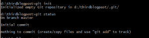

现在，如果我们再次运行`git status`,我们应该看到我们在 branch master 上(我们一会儿将更多地讨论分支),并且这是初始提交，没有什么要提交的，因为项目现在是空的。

让我们创建一个文本文件，并开始创建一些更改来模拟现实世界的项目。我将在 visual studio 代码中这样做，您可以选择任何 IDE/编辑器，它们都有类似的功能，但 VS 代码是我的最爱。让我们给文件添加一些文本:

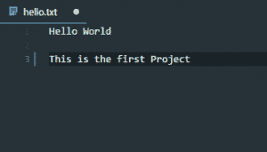

现在，当我们运行 git status 命令时，我们会注意到我们得到了一个未被跟踪的文件。

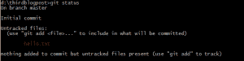

这意味着我们在项目中有一些处于修改状态的内容，并且我们还没有添加到暂存区。

### **3 .去添加**

要将上一步创建和编辑的文件添加到暂存区，我们将运行命令: `git add hello.txt`

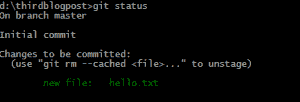

如果您有多个想要添加暂存区的文件，您也可以运行`git add .`来添加修改区中的所有文件。再次运行 git status，您会发现文本文件现在被标记为待提交的更改。

### **4 .去委员会**

现在是最后一步，让我们运行 commit 命令来提交这些更改。关于 commit 命令的一件事是，它必须伴随着一条消息，其背后的原因是 Git 试图实施最佳实践，如果在没有一个描述的情况下进行更改，那么在单个项目内部就不会很忙乱。这就是我们如何运行 git commit 命令:

```
git commit -m “added hello.txt”
```

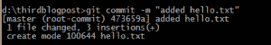

在命令行中，它说一个文件被修改了 3 次插入，这是我们到目前为止写的三行。

因为所有的合作者都会阅读你的提交消息，所以你必须学会如何简洁地书写它们: **[Git 提交消息](https://chris.beams.io/posts/git-commit/)**

### **5 .去推**

所以一切都很好，但现在如果我们想与同事分享项目并让他们参与进来，我们需要将我们的项目放在云上其他队友可以访问的地方。我们没有使它集中化，因为每个人都将拥有他的工作副本，但是需要有一个焦点来传递项目变更。所以让我们在 Github 上创建一个知识库。

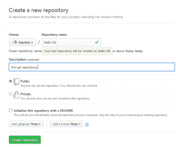

给它一个描述和名字，我就叫它 Hello Git。

当新存储库的页面打开时，您会发现一个推送现有存储库的选项，这正是我们想要做的。

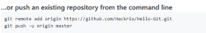

因此，我们将按照命令编写:

```
git remote add origin [repository’s link]
```

然后

```
git push origin master
```

第一个命令以 origin 的名称将我们创建的远程存储库链接到我们的本地存储库，事实上，只要足够清楚，您可以随意命名。第二个命令将主分支上的文件推送到原始存储库。因此，通过运行这两个命令，我们的存储库将以我们在存储库上创建的文本文件结束。

### **6。git 克隆**

现在你的代码被推送到一个远程仓库，任何对你的仓库有访问权限的人都可以下载代码并开始编辑它。

有两种方法可以将远程存储库放入本地机器的目录中。您可以下载整个项目的 zip 文件，也可以将存储库克隆(复制)到系统中的任何位置。

为了下载包含项目全部历史和几乎所有变更的存储库，我们使用命令 `git clone "url of the repository"`

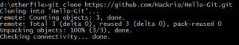

只需导航到您想要克隆存储库的位置并运行

```
git clone "link of the remote repository"
```

通常，你不需要自己编写整个命令。只需找到您想要克隆的存储库(例如在 Github 上)，点击绿色的“克隆或下载”按钮，可以看到下载 zip 或复制 Url 并在命令“中替换的选项

```
git clone "link of the remote repository"
```

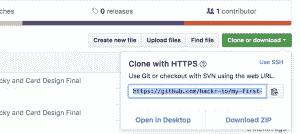

现在让我们深入 Git 的一个非常关键的部分。假设您正在与一位同事一起处理同一个项目，他对您正在处理的同一个文件的存储库进行了一些更改。

(为了模拟这种行为，我将使用 git clone 把我在上一步中推送的项目克隆到我系统的另一个目录中。

这样，我们可以模拟两个人在同一个项目上合作。)

我将打开 VS 代码的另一个实例，并转到我克隆项目的目录，在那里我将把单词“first”改为“changed ”,然后执行我们之前执行的推送项目的步骤，即:添加、提交，然后直接推送。

注意:我们不需要运行 git remote add 命令，因为我们克隆了存储库，并且它已经被远程添加了。

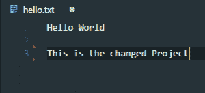

### **7。git 合并和 git 获取**

我们可以通过两种方式将这种变化引入到我们的主项目中，我们将会经历这两种方式。第一种是通过`git merge`命令，它将带来更改并将它们合并到我们的文件中。

另一种方法是首先获取更改，然后将它们合并到我们现有的文件中。所以它基本上运行两个命令。但是，如果我们只想获取更改，然后在需要时有选择地合并它们，那该怎么办呢？

(在尝试之前，我们需要对本地文件和远程存储库文件进行一些修改。为了模拟这种情况，我们将执行一些额外的步骤。)

Git 允许我们访问上一次提交时文件的状态。如果您想回到之前的提交而不做任何更改，您可以运行`git checkout "commit hash" command and pass the appropriate commit hash. You can view all previous commits with hashes using `git log`命令。`

 `你也可以通过点击 GitHub 上的提交标签来找到这些。它看起来会像这样。


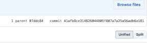

您可以从这里复制上一次提交的散列，并粘贴到命令提示符中。它看起来会像这样。

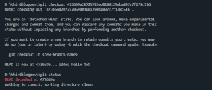

现在我们将运行以下命令。

```
git reset --hard "commit hash"
```

这迫使我们的远程存储库项目文件成为它们在我们进行特定提交时的状态，而不管我们现在有什么。

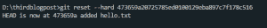

当我们这样做的时候，我们会收到一条消息，说我们晚了一次提交。这意味着 git 将该操作视为另一次提交，现在您的远程存储库中有了一些更改。

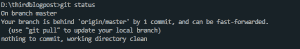

现在让我们获取这些更改，而不要将它们合并到目录中，并有选择地自己进行合并。为此，我们将如下运行 git fetch 命令:

```
 git fetch --all
```

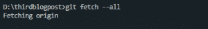

这将获取我们当前没有的所有提交，但不会合并它们或影响我们的工作流程。让我们在文本文件中添加几个词，我将在第三行的“项目”一词后添加“我们制作的”几个词。

然后我会添加并提交这些更改。现在我们的本地回购有一个我们的远程没有的提交，我们的远程有一个我们的本地没有的提交。那怎么办呢？

好吧，让我们试着使用 `git merge` 命令，看看会发生什么。我们得到消息说我们有一个“冲突”，自动合并不起作用，我们需要自己解决这些冲突。


在我的 VS 代码上，我可以清楚地看到这些冲突以及我可以采取的解决措施。如果你没有使用 VS 代码，不要担心，大多数编辑器都支持冲突管理。

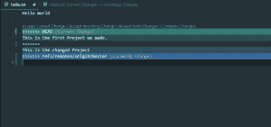

我有 4 个选项，“接受当前更改”、“接受引入的更改”、“接受两个更改”和“比较更改”。

我会选择接受这两种变化来展示不同的选项，但当然，在这种情况下，你应该选择最合适的。现在，这是文本文件的样子:


在这一阶段，你理想的做法是点击“接受当前变更”或“接受传入的变更”，这取决于你想要保留的变更和想要放弃的变更。

完成后，我们将通过提交我们的更改来完成合并。

## **8。分支机构**

到目前为止，我们已经提到了很多分支，是时候解释什么是分支了。分支是 Git 中最强大的特性之一。

分支有许多用例，例如，如果你在不同版本的软件上工作，不同版本的开发不应该在同一管道上进行。分支基本上是将变更的流程向某个方向分流。

另一个更普遍的例子是生产、测试和开发分支，生产将只包含稳定的发布，某些开发提交将在与生产合并之前转移到测试，等等。这是软件世界非常需要的实践。

Git 如此擅长分支的原因是它使用快照和计算差异，这样创建分支的过程就变得比像 SVN 这样令人头疼的其他系统更简单、更快。

让我们在我们的项目上开始一个新的分支，我们可以简单的使用 git branch 命令来创建一个新的分支，使用我们选择的名字。

然后，我们可以使用下面的命令进入该分支:

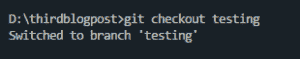

```
git checkout "branch name"
```

我将继续编辑分支‘testing ’,对文本文件进行如下更改，并提交此更改。您可以运行 `git commit -a` 来提交所有未暂存的文件，并使用相同的命令提交它们。

在这里你可以找到一些分支的最佳实践: **[Git 分支模型](https://nvie.com/posts/a-successful-git-branching-model/)**

**[Git Complete:Git](https://click.linksynergy.com/deeplink?id=jU79Zysihs4&mid=39197&murl=https%3A%2F%2Fwww.udemy.com%2Fcourse%2Fgit-complete%2F)**的权威分步指南

## **9。拉取请求**

拉请求用于在最终合并代码之前与其他合作者讨论某段代码。如果您正在为一个开源项目做贡献，或者有一些人远程工作，它们会很有用。 在创建拉式请求时，您可以指定要将更改合并到哪个分支。

要创建一个拉取请求，首先，您需要从您希望合并的分支创建一个新的分支。接下来，您需要提交一些更改，并将这个分支推送到 Github。  您会在存储库页面上找到“新拉取请求”按钮。点击它，Github 会显示如下提示:


在这里，您可以选择分支并留下评论(可选)。创建拉请求后，Github 会为您(项目所有者)提供合并或关闭拉请求的选项。  如果无法在线执行自动合并，您将需要提取并在本地合并它们。Github 有一个“命令行指令”按钮来帮助你。

## **总结**

版本控制是大多数软件工程的要求，也是开发人员的日常实践。这是一个你绝对需要的工具，而掌握它的唯一方法就是使用它。

官方的 Pro Git 书是免费的，资源丰富，所以去看看吧。在 git 官方网站上还有一个 **[备忘单](https://hackr.io/blog/git-cheat-sheet)** 列出了您将使用的大部分 Git 命令，所以这是一个很好的参考，尤其是当您开始 GIT 之旅时。

准备好阅读深入的 Git 教程了吗？下面是编程社区的[最佳 Git 教程和课程](https://hackr.io/tutorials/learn-git?ref=blog-post)。

**人也在读:**`**