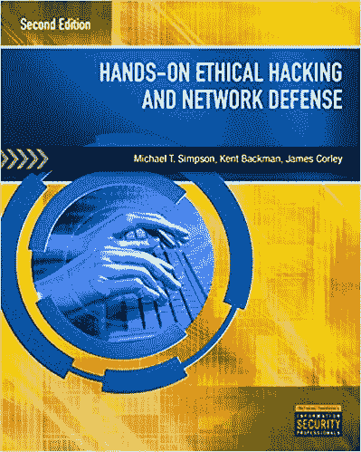
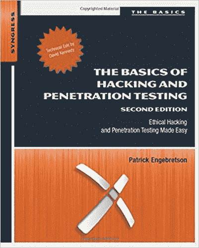
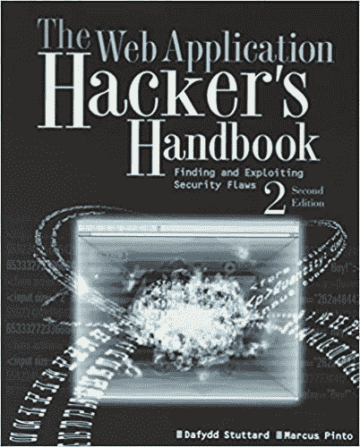
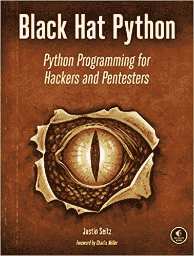
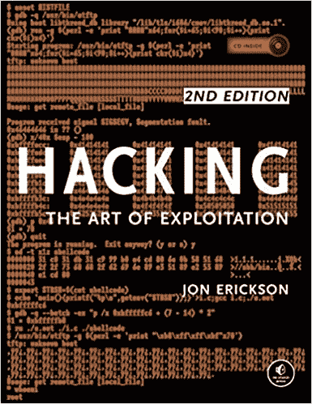
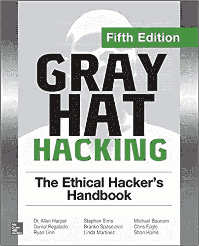
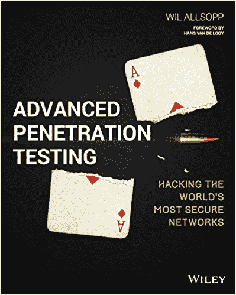
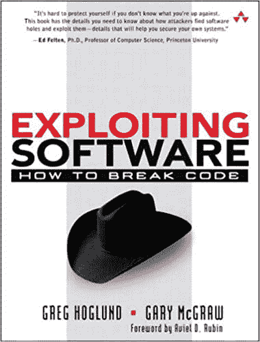
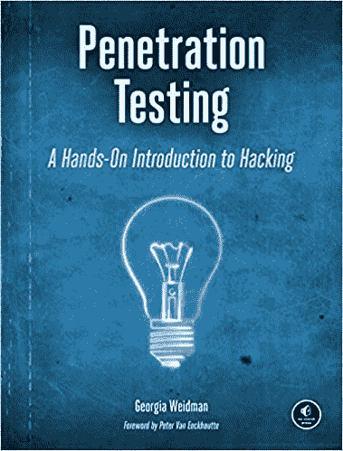

# 从初级到高级黑客的 10 本最佳道德黑客书籍

> 原文：<https://hackr.io/blog/best-hacking-books>

## 道德黑客入门

数字世界发展迅猛，每个阶段都需要保护数据。因为一切——个人信息、银行信息、朋友、家人等等。现在在线共享，数据必须在每一点都是安全的。许多**网络罪犯**正在寻找机会窃取机密数据，目的多种多样，包括利益冲突、国家安全漏洞、恐怖活动等等。

**道德黑客服务**提供保护企业和政府网络免受此类攻击的解决方案，并提供高数据安全性。我们可以通过道德黑客行为防止数据被窃取或滥用，识别漏洞或弱点，实施安全网络，并保护数据。道德黑客有五种主要的**类型，我们大多数人都知道其中的大部分:**

1.  网络应用黑客
2.  网络服务器黑客
3.  系统黑客
4.  无线网络黑客
5.  社会工程

每种类型的黑客行为都需要一定的技能、工具和技术，有道德的黑客需要考虑真正的恶意黑客会如何进行彻底的测试。他们应该找出漏洞，了解渗透测试，使用适当的工具来实施黑客攻击，并做好准备。即使真的发生攻击，损失也微乎其微。

## 黑客的类型

黑客是一个令人兴奋的话题，黑客也是如此。这就是为什么根据他们的意图有不同的类型:

*   **白帽黑客:**嗯，这些都是好人或者有道德的黑客。他们利用安全系统寻找漏洞，这样“坏人”就不会这么做了。他们得到各自公司的许可，这样做的唯一目的是识别潜在的安全威胁。像谷歌、脸书和微软这样存储敏感数据的公司雇佣白帽黑客。
*   **灰帽黑客:**灰帽黑客比白帽黑客领先一步，他们利用左右两边的网络来识别漏洞并纠正它们，从而从组织那里获得金钱。他们没有恶意，并告知当局和情报机构可能存在危险的安全漏洞。
*   **黑帽黑客:**这种类型的黑客试图获得对网络的未经授权的访问，以危及安全系统，关闭系统，并改变网站功能。这些黑客试图获取个人数据、财务数据和密码。

## 10 本最佳道德黑客书籍

在上面的介绍中，我们已经试图涵盖关于黑客的基本信息。一旦你开始阅读关于黑客的书籍，你会对学习和理解事物如何工作更感兴趣，在学习方面，没有什么能胜过书籍！因此，这里我们有十大道德黑客书籍，通过这些书籍你将获得知识，并能够攻击一些系统，知道其中的漏洞。记住，道德黑客行为意味着拥有黑客行为的许可；否则，黑客攻击是一种严重的犯罪。

 评分:4.7

这是一本适合初学者的坚实的基础书籍，也是学习黑客的最佳书籍，包括对网络、安全、黑客等一无所知的新生。作者使用简单有效的语言，并给出了各种概念的透彻解释。它主要是一本理论书籍，没有太多的实现或技术解释。这是一本概述所有高级黑客概念的好书，如[安全测试](https://hackr.io/blog/top-10-open-source-security-testing-tools-for-web-applications)，各种工具，渗透测试技术，移动安全和保护网络的方法。

**亮点**

*   易于阅读，不涉及太多技术细节或实现。
*   每章结尾都有大量的案例场景和问题。
*   这本书介绍了许多概念和术语，如果你希望深入阅读任何术语或概念，你可以使用其他资源或书籍来补充学习。
*   这本书在附录 b 中列出了相当好的资源和额外的参考资料。

你可以在这里买到这本书。

 评分:4.6

如果你计划成为一名渗透测试员(pen-tester)，这将是你很好的第一本书。这本书涵盖了广泛的工具，如回溯和 Kall Linux，Nmap，社会工程师工具包，Netcat，等等。这本书结构良好，一步一步地涵盖每个主题，以便彻底理解。作者的语气颇具娱乐性，引人入胜。这是一个完整的道德黑客培训材料的初学者。

**亮点**

*   如果你不知道如何从道德黑客开始，这本书是你的必读之作。
*   作者花时间来创建一个坚实的基础概念的理解。
*   作者对细节给予了很多关注，并解释了为什么某事以特定的方式被做，而不仅仅是解释正在做什么。
*   作者坚持基本原则，不会用太多的技术细节或高级概念来让你负担过重。
*   每章都有很多例子，章节末的练习，以及额外的资源来增强阅读体验。

你可以在这里买到这本书。

 评分:4.6

这是一本非常受欢迎并且在商业上非常成功的黑客书籍。它遵循一种有效的方法。这本书在网站安全方面做得很透彻，也很有参考价值。作者不会向你灌输事实；他试图让你思考每一点。这本书有大量真实世界的最佳实践和场景。这本书组织得很好，前几章讨论了主要的 web 组件和潜在的漏洞，接下来的几章集中在会话、数据库等的黑客步骤上。

**亮点**

*   有许多攻击和保护 web 应用程序的技术。
*   一些章节帮助你构建你自己的代码，并且有 C++，ASP.Net 和 Java 的例子。
*   作者向读者介绍了许多工具，并鼓励他们使用自己的产品 Burp Suite。
*   虽然 Burp Suite 不是免费的(它相当昂贵)，但您将从内容中获得很多，并测试这本书的技术。
*   这本书既适合初学者，也适合中级学习者。

你可以在这里买到这本书。

 评分:4.6

这本书非常适合那些有一些编程经验(不一定是 Python)但没有黑客经验的人。由于 [Python](https://hackr.io/blog/python-programming-language) 简单易学，可以通过这本书并排学习。想了解更多，可以偶尔参考一下网上的资料。这本书使用 Python 2，主要关注如何使用 Python 编写有效的黑客工具。这本书是彻底的技术和挑战你在不同的水平。你可以把它作为参考资料，也可以从头开始学习。

**亮点**

*   作者给出了很多使用 Python 进行基础黑客攻击的有趣技巧。
*   虽然有些代码已经过时了(Python2)，但是你可以很容易地把它改成对应的 Python3 并使用它。
*   作者语言干脆，切中要害。
*   这本书鼓励你扩展现有的技术来创造你自己的利用和玩弄概念。
*   不需要网络或黑客知识；这本书涵盖了所有必要的基础知识。
*   这本书还涵盖了 GitHub 和如何建立一个 Git-Hub 感知木马。

你可以在这里买到这本书。

 评分:4.6

这本针对黑客的中级书籍对黑客有着不同的视角。作者鼓励你除了了解网络和安全之外，还要有坚实的技术基础，并解释了神秘的黑客技术是如何工作的。这是一本动手实践的书，在探索各种黑客领域的同时，通过示例进行工作。作者强调要像黑客一样思考，要有创造力，要调查以前从未接触过的领域。

**亮点**

*   尽管这本书涉及了一些关于 C 语言的内容，但在你开始阅读这本书之前最好有一个基本的了解。
*   你应该知道 Python、TCP/IP、OSI 和操作系统(Linux)的基本概念。
*   它非常有洞察力和深度，所以当你有时间彻底了解关于黑客的一切时，你应该开始读这本书——它不是快速参考指南。
*   这本书不只是给你用例，而是试图建立一个强大的基础，这样你就可以想出自己的黑客方法。
*   附带一张用于 Linux 的 CD，可以帮助你练习你所阅读的内容。

你可以在这里买到这本书。

 评分:3.7

这本书涵盖了所有的基础知识，然后又介绍了一些中间概念。所以，不管你是不是大一新生，你都会在某种程度上受益于这本书。这是一本有趣的、写得很好的书，风格简洁明快。虽然有些概念没有涉及太深，但从道德黑客、网络和网络安全入手就足够了。

**亮点**

*   这本书一共分为五个部分，第一部分讲述了黑客的一般知识和准备工作，比如学习一门编程语言，使用 gdb 等等。，第二部分从黑客和渗透测试的核心概念开始，第三部分探讨了如何利用系统的左右，第四部分涵盖了一些高级恶意软件分析。第五部分讲的是可以被黑的物联网。
*   每一章都有实验和练习结束时的附加练习。作者也在这一章的结尾给出参考文献。
*   除了各种策略和案例研究，这本书还告诉你如何小心网络攻击，并列出了道德和不道德黑客行为之间的明显区别。

你可以在这里买到这本书。

### 高级道德黑客书籍

到目前为止，我们已经讨论了涵盖基础和基本概念以及一些中间概念的书籍。下面的书更深入一层，帮助读者以更有条理和更深入的方式理解黑客。

 评分:4.8

这本书涵盖了一些复杂的场景和面对这些场景的技术。这是为那些想要像专业黑客一样思考并在高度安全的网络上执行笔测试的专业人士准备的。书中很多例子使用了 C、Java、JavaScript、VBA、Windows 脚本宿主、Flash 等。作者向您介绍了这些语言中的许多扫描工具和标准库应用程序。

**亮点**

*   一本非常吸引人的书；这就像读一本故事书，除了它是技术性的！
*   非常相关的例子，真正揭示了当我们走向数字化时，我们是多么的脆弱。
*   虽然这本书很先进，但它会一步一步地教你如何编写定制代码，并帮助你理解笔测试工具的重要性。
*   即使没有编程知识(但有一些计算机背景)也可以看这本书。你可以通过其他参考资料来学习这些语言。
*   这也是一个伟大的书，为那些想采取认证作为一个笔测试。

你可以在这里买到这本书。

 评分:4.5

这本书技术性很强，写得既有知识性又有教育性。它是为那些有一些逆向工程和开发的工作知识，但想深入探索利用软件漏洞的黑帽技术。这本书强调了攻击模式，这一点我们在其他任何一本书中都没有看到过。作者给出了许多与今天的场景相关的例子和案例研究。

**亮点**

*   这本书关注软件质量问题如何导致安全失误，以及如何快速纠正这些问题。
*   您将学习如何编写自己的破解工具(本书假设您对 x86 处理器有基本的了解)
*   许多章节致力于攻击模式，如堆栈溢出、字符串格式溢出、URL 编码等。，并通过 C++、Java 等不同语言的例子探索如何克服这些困难。
*   作者详细介绍了 rootkits，编写它们，调用挂钩，以及许多更高级的概念。

你可以在这里买到这本书。

 评分:4.4

这本书从解释每个 pentester 应该拥有的基本技能和技术开始。顾名思义，这本书包含了许多例子，实用工具课，和一个基于机器的实验室。通过这种方式，您将能够密切了解黑客是如何访问安全系统、破解网络密钥和密码，以及为以上所有内容和更多内容编写攻击程序的。

**亮点**

*   这本书不是纯技术性的，不会用太多的信息和技术术语让你不知所措。
*   实验室设置有点过时(第一版)，但所有相关信息仍然可以在网上找到(例如 exploit-DB)——尽管如此，这本书还是值得的！
*   如果你是黑客新手，这本书将为你提供很好的介绍，如果你有经验，你可以通过练习和实验室获得很多实用的知识。
*   作者的语气引人入胜、干脆利落，并专注于以实例为基础的学习。

你可以在这里买到这本书。

 评分:4.2

这是一个彻底和全面的指南，不仅如此，它还写在一个迷人的，从事的方式。由于我们都因为其他原因使用网络，作为读者，你可以理解本书中涉及的许多场景。这让我们大开眼界，我们的数据是如何如此脆弱，以及哪些弱点使大规模黑客攻击成为可能。该书还通过各种工具和技术给出了这些问题的解决方案。

**亮点**

每章都包含安全工程备忘单，为最常见的问题提供快速解决方案。

*   涵盖了广泛的基本和高级任务，如 URL 解析、构建混搭和嵌入小工具，使用现代安全特性来保护网络及其用户
*   该书重点介绍了当今网络浏览器面临的问题，包括它们如何运行以及如何构建安全的浏览器应用程序，这意味着这是 web 开发人员的必备书籍。
*   作者的指导和提示是突出的，并显示了作者在该领域的经验。
*   用户从 URL、HTML、CSS 等开始。，并解释了每种功能的行为，然后转到浏览器安全功能。作者还对新的安全特性给出了一些预见(现在可能是旧的，但仍然值得一读！).
*   你可以在这里买到这本书。

进一步学习

## 如果你在进入黑客领域之前没有编程经验，你应该学习一些关于至少一种[编程语言](https://hackr.io/blog/what-is-programming-language)的基础知识，比如 C、C++、Python、Java。此外，你应该知道什么是网络，数据库管理系统，以及它们是如何构成的。这将有助于你更好地专注于黑客。上面的一些书涵盖了这些主题，但对你自己的学习来说，有先验知识是一个很好的选择。

除了这些书之外，还有很多可以增加你学习价值的材料，比如博客和在线教程。以下是 hackr.io 列出的一些[最好的黑客课程，可以进一步提升你的学习体验。](https://hackr.io/tutorials/learn-information-security-ethical-hacking?ref=blog-post)

**想更快的学会黑客技术？参加这个课程！**

### [从头开始学习道德黑客](https://click.linksynergy.com/deeplink?id=jU79Zysihs4&mid=39197&murl=https%3A%2F%2Fwww.udemy.com%2Fcourse%2Flearn-ethical-hacking-from-scratch%2F)

**人也在读:**

**People are also reading:**