# 2023 年面向初学者和专家的 20 本最佳机器学习书籍

> 原文：<https://hackr.io/blog/best-machine-learning-books>

机器学习赋予了人类以自动化方式运行任务的能力。它允许通过研究与同一任务相关的连续数据流来改进我们已经在做的事情。机器学习有着广泛的应用，属于不同的领域，从空间研究到数字营销。

机器学习也构成了人工智能的基础。我们还没有被能够自己做出判断的机器淹没。到那里还有很长的路要走。但是一路上产生的可能性是无穷无尽的。

## 20 本最佳机器学习书籍

所以，现在是拿起机器学习的最好时机。当然，机器学习是一个复杂的领域，但这并不意味着它不能以简单的方式学习。为了帮助你，我们挑选了 20 本最好的机器学习书籍:

**[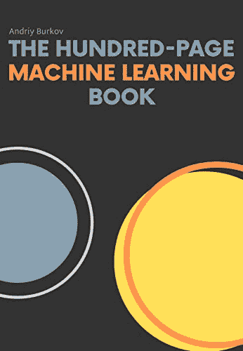](https://geni.us/u6I0eVb) 作者—**安德烈·布尔科夫
**最新版—**第一版
**出版商—**安德烈·布尔科夫
**格式—**电子书(Leanpub)/精装/平装

有可能在仅仅 100 页的篇幅里解释各种机器学习主题吗？安德烈·布尔科夫(Andriy Burkov)写的长达 100 页的机器学习书籍就是为了实现这一点而做出的努力。这本机器学习书籍以一种易于理解的方式写成，得到了知名思想领袖的认可，如谷歌研究总监彼得·诺维格(Peter Norvig)和易贝大学工程主管苏吉特·瓦拉克赫迪(Sujeet Varakhedi)。它是机器学习的最佳入门书籍。

仔细阅读这本书，你将能够建立和欣赏复杂的人工智能系统，清楚基于人工智能的面试，甚至开始你自己的基于人工智能的生意。然而，这本书并不适合绝对的机器学习初学者。如果你在寻找更基本的东西，去别的地方看看。

**涵盖的主题**

*   学习算法的剖析
*   基本算法
*   神经网络和深度学习
*   其他形式的学习
*   监督学习和非监督学习

你可以在这里买到这本书。

**[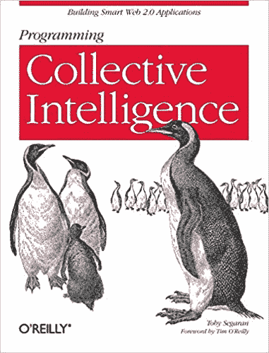](https://geni.us/ubaQbb) 作者—**托比·塞格兰
**最新版—**第一版
**出版商—**奥莱利传媒
**格式—**Kindle/平装

托比·塞格兰(Toby Segaran)的《编程集体智慧》(Programming Collective Intelligence)被认为是开始理解机器学习的最佳书籍之一，它是在 2007 年数据科学和机器学习达到目前顶级职业道路的地位之前编写的。这本书利用 Python 作为向读者传递知识的工具。

《编程集体智慧》与其说是对机器学习的介绍，不如说是实现 ml 的指南。这本书详细介绍了如何创建有效的 ml 算法来从应用程序收集数据，创建从网站访问数据的程序，以及推断收集的数据。每章都有练习来扩展所陈述的算法，并进一步提高它们的效率和有效性。

**涵盖的主题**

*   贝叶斯滤波
*   协同过滤技术
*   进化解决问题的智能
*   用于检测组或模式的方法
*   非负矩阵分解
*   搜索引擎算法
*   支持向量机
*   预测的方法

你可以在这里买到这本书。

**[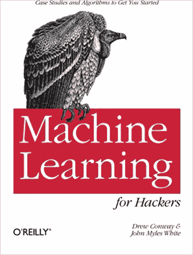](https://geni.us/3VDJZE) 作者—**德鲁·康威和约翰·迈尔斯·怀特
**最新版—**第一版
**出版商—**奥莱利传媒
**格式—**Kindle/平装

《黑客机器学习》这本书是为对处理数据感兴趣的有经验的程序员准备的。在这里，黑客一词指的是熟练的数学家。由于本书的大部分内容是基于 R 中的数据分析，所以对于那些对 R 有很好了解的人来说，这是一个很好的选择。本书还详细介绍了在数据争论中使用高级 R。

《黑客机器学习》一书最重要的亮点可能是包含了恰当的案例研究，突出了使用机器学习算法的重要性。这本书没有深入研究机器学习的数学理论，而是解释了大量现实生活中的例子，以使[学习 ml](https://hackr.io/tutorials/learn-machine-learning-ml) 更容易、更快。

**涵盖的主题**

*   开发一个简单的贝叶斯分类器
*   线性回归
*   优化技术
*   使用 R 查询数据

你可以在这里买到这本书。

** 作者—**汤姆·米契尔
**最新版—**第一版
**出版商—**麦格劳·希尔教育
**格式—**平装

Tom M. Mitchell 的《机器学习》是一本适合机器学习入门的书。它提供了机器学习理论的全面概述，并附有相应算法的伪代码摘要。机器学习书充满了例子和案例研究，以减轻读者学习和掌握 ml 算法的努力。

如果你希望在机器学习领域开始你的职业生涯，那么这本书是必不可少的。由于一个很好的解释叙述，一个 ml 基础的彻底解释，和面向项目的家庭作业，机器学习的书是一个合适的候选人被包括在任何机器学习课程或计划中。

**涵盖的主题**

*   遗传算法
*   归纳逻辑编程
*   机器学习的主要方法介绍
*   机器学习概念和技术
*   强化学习

你可以在这里买到这本书。

**[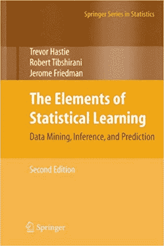](https://geni.us/hwMXlE) 作者—**特雷弗·哈斯蒂、罗伯特·蒂布拉尼、杰罗姆·弗里德曼
**最新版—**第二版
**出版商—**施普林格
**格式—**精装/Kindle

如果你喜欢统计学，并且想从统计学的角度学习机器学习，那么《统计学学习原理》是你必须要读的书。机器学习书籍强调数学推导，用于定义 ml 算法的底层逻辑。在拿起这本书之前，确保你至少对线性代数有一个基本的了解。

《统计学习元素》一书中解释的概念对初学者来说并不友好。因此，你可能会发现它很难消化。然而，如果你仍然想学习它们，那么你可以看看[统计学习介绍](https://geni.us/BEQH)这本书。它解释了相同的概念，但以初学者友好的方式。

**涵盖的主题**

*   集成学习
*   高维问题
*   分类和回归的线性方法
*   模型推断和平均
*   神经网络
*   随机森林
*   监督和非监督学习

你可以在这里买到这本书。

**[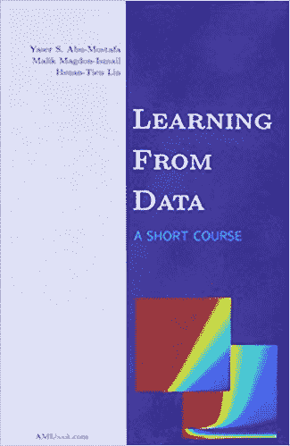](https://geni.us/Stjd7) 作者—**亚塞尔·阿布·穆斯塔法、马利克·马格东-伊斯梅尔、林轩天
**最新版—**第一版
**出版商—**AML book
**格式—**精装/Kindle

想在更短的时间内全面了解机器学习？并且对工程数学很了解？试试从数据中学习:一本简短的教科书。这本书不是传授有关机器学习的各种先进概念的知识，而是让读者更好地理解复杂的机器学习概念。

从数据中学习:一本简短的教科书抛弃冗长和拐弯抹角的解释，简明扼要地解释。为了加强从这本机器学习书中的学习，你也可以参考作者亚塞尔·阿布·穆斯塔法的在线教程。

**涵盖的主题**

*   误差和噪声
*   核心方法
*   过度拟合
*   径向基函数
*   正规化
*   支持向量机
*   确认

你可以在这里买到这本书。

**[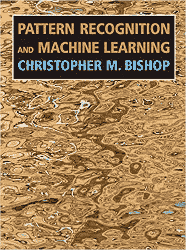](https://geni.us/3BcZ3et) 作者—**克里斯托弗·m·毕晓普
**最新版—**第二版
**出版商—**施普林格 **格式—**精装/点燃/平装

由 Christopher M. Bishop 撰写的《模式识别和机器学习》一书为理解和使用机器学习和模式识别中的统计技术提供了极好的参考。对线性代数和多元微积分的良好理解是通读机器学习书籍的先决条件。

模式识别和机器学习这本书提供了详细的实践练习，为统计模式识别技术提供了一个全面的介绍。这本书以描述概率分布的独特方式利用图形模型。虽然不是强制性的，但是一些概率方面的经验会加速学习过程。

**涵盖的主题**

*   近似推理算法
*   贝叶斯方法
*   基础概率论导论
*   模式识别和机器学习导论
*   基于核的新模型

你可以在这里买到这本书。

**[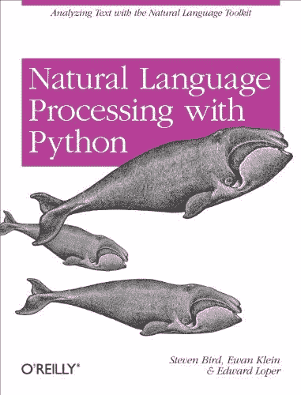](https://geni.us/7q1h) 作者—**史蒂文·伯德、伊万·克莱恩、爱德华·洛珀
**最新版—**第一版
**出版商—**奥莱利传媒
**格式—**可用

自然语言处理是机器学习系统的支柱。《Python 自然语言处理》一书使用 Python 编程语言来指导您使用 NLTK，这是一套流行的 Python 库和程序，用于英语和 NLP 的符号和统计自然语言处理。

使用 [Python 的自然语言处理一书](https://hackr.io/blog/best-python-books-for-beginners-and-advanced-programmers)展示了强大的 Python 代码，以清晰、精确的方式展示了 NLP。读者能够访问注释良好的数据集，用于分析和处理非结构化数据、文本中的语言结构以及其他面向 NLP 的方面。

**涵盖的主题**

*   人类语言是如何工作的
*   集成人工智能和语言学的技术
*   语言数据结构
*   自然语言工具包(NLTK)
*   解析和语义分析
*   流行的语言学数据库

你可以在这里买到这本书。

** 作者—**大卫·巴伯
**最新版—**第一版
**出版商—**剑桥大学出版社
**格式—**精装/Kindle/平装

对于任何有兴趣进入机器学习领域的人来说，贝叶斯推理和机器学习是必备的。这本书对于对学习 ml 感兴趣但没有微积分和线性代数背景的计算机科学家来说是一个合适的解决方案。

在《贝叶斯推理和机器学习》这本书中，并不缺少解释清楚的例子和练习。这使得这本书也是计算机科学本科生和研究生的理想选择。机器学习书籍附带了额外的在线资源和一个全面的软件包，其中包括演示和教师的教学材料。

**涵盖的主题**

*   近似干涉
*   动态模式
*   图形模型的框架
*   概率模型中的学习
*   朴素贝叶斯算法
*   概率推理

你可以在这里买到这本书。

**[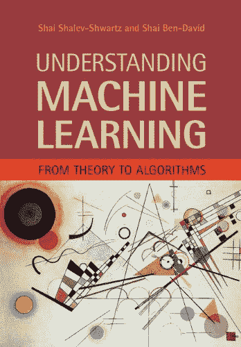](https://geni.us/q7xFj) 作者——**沙勒夫-施瓦茨和沙伊本-大卫
**最新版——**第一版
**出版商——**剑桥大学出版社
**格式——**精装/Kindle/平装

《理解机器学习》一书提供了机器学习的结构化介绍。这本书深入到机器学习的基本理论和算法范式，以及数学推导。

机器学习以一种易于理解的方式呈现了大量的机器学习主题。《理解机器学习》适合任何人，从计算机科学学生到计算机科学、工程、数学和统计的非专家读者。

**涵盖的主题**

*   学习的计算复杂性
*   凸性和稳定性
*   神经网络
*   ML 算法
*   PAC-贝叶斯方法
*   随机梯度下降
*   结构化输出学习

你可以在这里买到这本书。

**[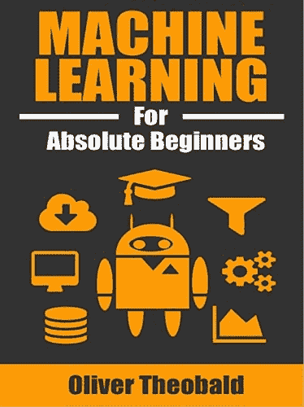](https://geni.us/DeoXyj) 作者—**奥利弗·西奥博尔德
**最新版—**第二版
**出版商—**散点图出版社
**格式—**Kindle/平装

之前没有机器学习的经验和接触？但还是，想学吗？那么你一定不要错过奥利弗·西奥博尔德的《绝对初学者机器学习》一书。显然，不需要任何编码或数学背景就可以从这本机器学习书中受益。

对于任何希望获得机器学习和相关概念的最低调定义的人来说，绝对初学者的机器学习书是最合适的选择之一。为了确保读者容易理解书中提到的一切，清晰的解释和可视化的例子伴随着各种 ml 算法。

**涵盖的主题**

*   神经网络基础
*   使聚集
*   交叉验证
*   数据清理技术
*   集成建模
*   特征工程
*   回归分析

你可以在这里买到这本书。

**[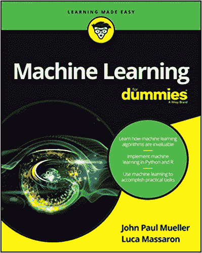](https://geni.us/NSWU) 作者—**约翰·保罗·穆勒和卢卡·马萨隆
**最新版—**第一版
**出版商—**为假人
**格式—**Kindle/平装

《傻瓜机器学习》旨在让读者以一种简单的方式熟悉与机器学习相关的基本概念和理论。此外，这本书侧重于机器学习的实际，现实世界的应用。

John Paul Mueller 和 Luca Massaron 的《机器学习》一书使用 Python 和 R 代码演示了如何训练机器找到模式并分析结果。这本书还解释了 ml 如何促进电子邮件过滤，欺诈检测，互联网广告，网络搜索等。

**涵盖的主题**

*   数据准备
*   机器学习技术
*   监督和非监督学习
*   机器学习周期
*   训练机器学习系统
*   将机器学习方法与结果联系起来

你可以在这里买到这本书。

**[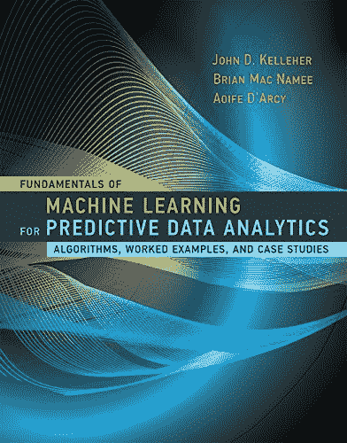](https://geni.us/FZy0u5d)**

预测分析利用一系列统计技术来帮助分析过去和当前的事件，并在此基础上做出未来预测。《预测数据分析的机器学习基础》一书深入研究了做更好的预测数据分析所需的机器学习基础。

显然，你至少需要对预测数据分析的基础有一个良好的理解，才能从机器学习的书中受益。机器学习书中解释的每个机器学习概念都有合适的算法、模型和解释清楚的例子。

**涵盖的主题**

*   基于错误的学习
*   基于信息的学习
*   基于概率的学习
*   基于相似性的学习
*   评估预测模型的技术

你可以在这里买到这本书。

**[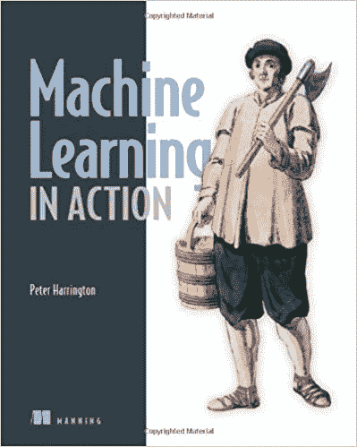](https://geni.us/IoNh5) 作者—**彼得·哈灵顿
**最新版—**第一版
**出版商—**曼宁出版物
**格式—**平装

《行动中的机器学习》是另一本适合的机器学习书籍，受到从大学生到专业人士的各种人的青睐。它不仅详细介绍了机器学习技术，而且以一种彻底解释的方式介绍了这些技术背后的概念。

机器学习书籍也可以作为开发人员编写自己的程序的演练，这些程序旨在以分析为目的获取数据。《行动中的机器学习》一书深入讨论了构成各种机器学习技术基础的算法。机器学习书里提到的大部分例子都是用 Python 代码。

**涵盖的主题**

*   机器学习基础
*   大数据和 MapReduce
*   FP-增长
*   k 均值聚类
*   逻辑回归
*   支持向量机
*   基于树的回归

你可以在这里买到这本书。

**[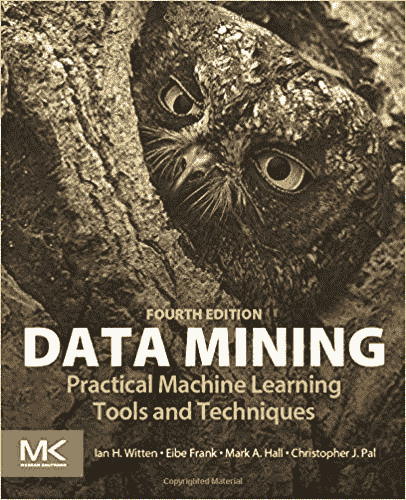](https://geni.us/0AKkn) 作者——**伊恩·h·威滕、艾贝·弗兰克、马克·a·霍尔
**最新版——**第四版
**出版商——**摩根·考夫曼
**格式——**Kindle/平装

数据挖掘技术通过属于数据库系统、机器学习和统计学领域的方法帮助我们发现大型数据集中的模式。如果你需要或计划学习数据挖掘技术，特别是机器学习，一般来说，你必须拿起《数据挖掘:实用机器学习工具和技术》这本书。

顶级机器学习书籍更侧重于机器学习的技术方面。它深入机器学习的技术细节，获取数据的方法，以及使用不同的输入和输出来评估结果。

**涵盖的主题**

*   使聚集
*   比较数据挖掘方法
*   基于实例的学习
*   知识表示和集群
*   线性模型
*   预测性能
*   统计建模
*   传统和现代数据挖掘技术

你可以在这里买到这本书。

**[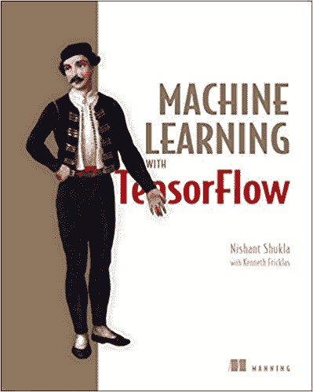](https://geni.us/bCP1QFZ) 作者—**尼尚·舒克拉
**最新版—**第一版
**出版商—**曼宁出版物
**格式—**电子书(免费)/平装本

TensorFlow 是一个符号数学库，是[顶级数据科学 Python 库](https://hackr.io/blog/top-data-science-python-libraries)之一，用于机器学习应用，最著名的是神经网络。使用 TensorFlow 的机器学习这本书为读者提供了机器学习概念和实际编码经验的强大解释。

《TensorFlow 机器学习》一书解释了传统分类、聚类和预测算法的 ml 基础知识。这本书更深入地探讨了深度学习的概念，让读者使用免费和开源的 TensorFlow 库为任何类型的机器学习任务做好准备。

**涵盖的主题**

*   自动编码器
*   卷积、递归、强化神经网络
*   深度学习
*   隐马尔可夫模型
*   线性回归
*   强化学习

你可以在这里买到这本书。

**[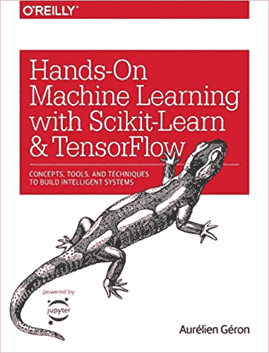](https://geni.us/DkXs) 作者—**奥雷连·盖伦
**最新版—**第二版
**出版商—**奥莱利传媒
**格式—**Kindle/平装

第二版的动手机器学习将 Keras 添加到其内容列表中，与 Scikit-Learn 和 TensorFlow 并列。《机器学习》这本书直观地理解了开发智能系统所需的各种概念和工具。

你需要有编程经验才能开始动手操作机器学习的书。机器学习书中的每一章都有大量的练习，可以帮助你在那之前应用你所学的知识。成功阅读本书后，人们应该能够实现智能程序，能够从获得的数据中学习。

**涵盖的主题**

*   深度神经网络
*   深度强化学习
*   线性回归
*   训练模型，包括决策树、集成方法、随机森林和支持向量机
*   训练神经网络

你可以在这里买到这本书。

**[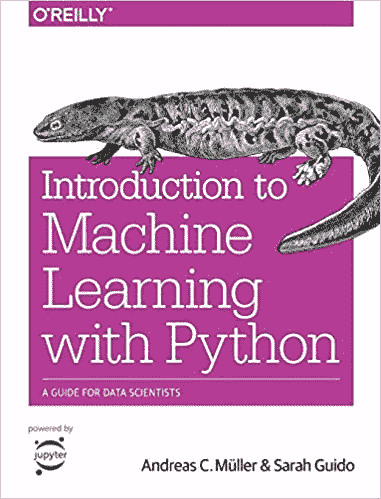](https://geni.us/B30D4) 作者—**安德里亚斯·c·穆勒&莎拉·圭多
**最新版—**第一版
**出版商—**奥莱利传媒
**格式—**Kindle/平装

你是精通使用 Python 的数据科学家，有兴趣学习 ML 吗？然后《Python 机器学习导论:数据科学家指南》是一本理想的书籍，你可以拿起它开始你的机器学习之旅。

《Python 机器学习入门:数据科学家指南》一书将教你各种实用的方法来构建你自己的机器学习解决方案。

您将了解使用 Python 和 Scikit-learn 库创建健壮的机器学习应用程序的所有重要步骤。很好地理解 matplotlib 和 NumPy 库将会对学习过程有更好的帮助。

**涵盖的主题**

*   模型评估和参数调整的高级方法
*   应用，机器学习的基本概念
*   机器学习算法
*   处理文本数据的方法
*   链接模型和封装工作流的管道
*   处理数据的表示

你可以在这里买到这本书。

**[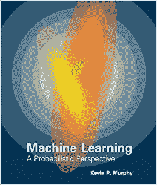](https://geni.us/5h7oHK) 作者—**凯文·p·墨菲
**最新版—**第一版
**出版商—**麻省理工学院出版社
**格式—**eTextbook/精装

《机器学习:概率视角》充满了重要算法的非正式写作和伪代码，是一本有趣的机器学习书籍，展示了怀旧的彩色图像和实际的真实世界的例子，这些例子属于生物学、计算机视觉、机器人学和文本处理等各个领域。

与其他机器学习书籍不同，这些书籍像一本解释几种启发式方法的食谱一样，机器学习:概率观点专注于一种基于原则模型的方法。它使用图形模型以简洁、直观的方式指定 ml 模型。

**涵盖的主题**

*   条件随机场
*   深度学习
*   L1 正则化
*   最佳化
*   可能性

你可以在这里买到这本书。

**[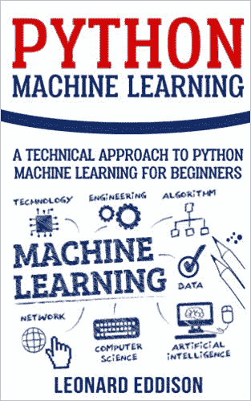](https://geni.us/5ZM2Wq) 作者—**雷纳德·埃迪逊
**最新版—**第一版
**出版商—**CreateSpace 独立出版平台
**格式—**有声读物/平装

一本初学者友好的机器学习书籍，Python 机器学习书籍详细介绍了机器学习的基础知识以及它在数字领域的重要性。这本书还讨论了机器学习的各种分支及其广泛的应用。

Python 机器学习书籍还详细介绍了 Python 编程的基础知识，以及如何开始使用免费的开源编程语言。成功完成机器学习一书后，你将能够用 Python 编写代码来成功地建立各种各样的机器学习任务。

**涵盖的主题**

*   人工智能基础
*   决策树
*   深度神经网络
*   Python 编程语言的基础
*   逻辑回归

你可以在这里买到这本书。

**其他一些顶级的机器学习书籍**

除了我们已经列举的前 20 本机器学习书籍，这里还有一些其他伟大的机器学习和相关书籍的列表:

*   金融机器学习的进展
*   大卫·克里格尔的《神经网络简介》
*   Ron Zacharski 的数据挖掘程序员指南
*   统计学习导论:在 R 中的应用
*   伊恩·古德菲勒、约舒阿·本吉奥和亚伦·库维尔的《深度学习》
*   Francois Chollet 用 Python 进行深度学习
*   深度学习的基础:设计下一代机器智能算法
*   机器学习:贝氏和最优化观点，作者塞尔吉奥·泽奥多里德斯
*   机器学习:算法视角
*   机器学习:使数据有意义的算法的艺术和科学
*   机器学习:神经网络、算法、随机森林和决策树的终极初学者指南
*   带 R 的机器学习:预测建模的专家技术
*   吴恩达的机器学习向往
*   Anand Rajaraman 和 Jeffrey David Ullman 的海量数据集挖掘
*   Pat Nakamoto 的《神经网络和深度学习》
*   概率图形模型:原理和技术
*   Python 机器学习:使用 Python、Scikit-learn 和 TensorFlow 进行机器学习和深度学习
*   统计学习的要素:数据挖掘、推理和预测
*   艾伦·b·唐尼的《思考统计——程序员的概率和统计》
*   理解机器学习:从理论到算法

## **结论**

这总结了 20 本最好的机器学习书籍，你可以浏览这些书籍，以你想要的方式推进机器学习。除了看书，你还可以通过[最好的机器学习教程](https://hackr.io/tutorials/learn-machine-learning-ml?ref=blog-post)，YouTube 视频，在线课程等等方式获取机器学习知识！

机器学习是当今热门的职业选择。它的未来看起来光明灿烂。所以，现在是时候进入这个领域，并从中创造一个有利可图的职业生涯了。

**人也在读:**