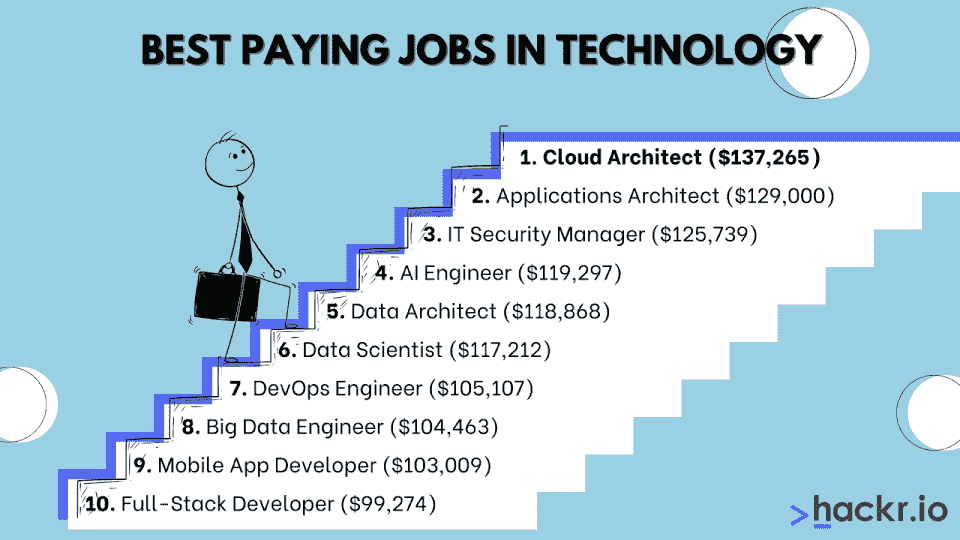

# 2023 年科技行业 10 大高薪工作

> 原文：<https://hackr.io/blog/best-paying-jobs-in-tech>

很少有行业像 IT 行业一样变化如此频繁。曾经有一段时间，作为一名 COBOL 程序员，你可以获得高薪。但在 2023 年，IT 领域最好的薪酬工作与数据科学、云架构、人工智能和应用开发直接相关。

如果你想在 IT 领域进行职业转型，这些是 2023 年科技领域薪酬最高的工作。

## 科技工作的报酬如何？

虽然这个数字非常宽泛，但那些有经验的人通常可以指望赚到六位数。假设你是所在领域的顶尖人物，高薪 IT 工作可以从 25 万美元到 50 万美元不等。

但是即使是高薪的技术工作通常起薪也在 6 万美元左右。科技行业薪酬最高的工作要求你有多年的经验、证书和其他证书。如果你在寻找薪酬最高的 IT 工作，你需要获得学位，开始参加训练营或开始积累经验。

根据美国劳工统计局的数据，2021 年 5 月，计算机和信息技术职业的平均工资中位数是 97430 美元。客观来看，BLS 将所有职业的平均年薪定为 45760 美元。

### **1。云师(******)**)**

 **云架构师设计、优化和分析云网络。随着当今许多组织致力于大规模混合架构，云架构师的工作已经为他们量身定制。如今，一个组织可能拥有多达 200 个不同的软件即服务云平台，所有这些平台都需要得到保护和集成。

云架构师必须非常了解现代云解决方案；他们中的大多数人已经在该行业中担任了多年的云分析师或云管理员。云架构不仅是薪酬最高的技术工作之一，也是一个非常安全的职位；云不会去任何地方。

| 技能和要求

*   有 IT 管理和工程方面的经验。
*   云基础设施和云架构的广泛知识。
*   具备 Python 或 Java 等语言的编程知识。
*   云基础架构、平台和应用的最新知识。
*   沟通、人际交往和领导力方面的软技能。

 | 主要职责

*   创建和维护全面的云战略。
*   评估组织的云网络是否有任何潜在的改进。
*   监控云安全和隐私，并主动应对潜在威胁。

 |

**如何开始:**获得一份专注于云管理或云帮助台管理的 IT 工作。

**推荐课程**

如何找到一份技术工作；面试并获得任何工作

### **2。应用架构师(**[**)12.9 万美元**](https://www.glassdoor.com/Salaries/us-applications-architect-salary-SRCH_IL.0,2_IN1_KO3,25.htm) **)**

“应用程序架构师专门为业务组织设计、开发和实现专门的应用程序。成为一名应用架构师是一条充满挑战和成就感的职业道路。如果你正在寻找一种精神刺激的工作生活，别再犹豫了。应用程序架构师有很多解决问题的机会。此外，你将在帮助公司实现业务目标方面发挥关键作用，这使得这份工作非常有成就感。这些专业人士的收入潜力是有利可图的，工作保障几乎是有保障的。"

——Ryan Yount，LuckLuckGo 的创始人

应用程序架构师比开发人员高一级，开发人员已经获得了丰厚的报酬。应用程序架构师是实际设计解决方案的个人，开发人员随后对这些解决方案进行编码和测试。

应用程序架构师是行业内的一个成熟职位，他们已经广泛地发展了自己，并且可以使用这些知识来微调、优化和头脑风暴新的应用程序。通常，应用程序架构师会领导一个开发人员和工程师团队。

| 技能和要求

*   丰富的编程和应用程序开发知识。
*   能够使用 C++、Java 或 Python 等通用语言进行编程。
*   优化、负载平衡和扩展方面的技能。
*   对开发应用程序的市场营销和实践方面有所了解。
*   软技能包括沟通和领导能力。

 | 主要职责

*   产品所有者和主要开发人员之间的接口。
*   定义应用程序架构的主要方面。
*   检查应用程序的设计和代码。
*   确保应用程序符合最终的生产标准。
*   避免范围蔓延，确保项目按计划进行。

 |

**如何入门:**找一份入门级应用开发人员或软件工程师的工作。就顶级 IT 高薪工作而言，这是一个不需要任何正规教育就可以开始的工作；开始建立你的 GitHub 账户吧。

### **3。IT 安全经理(**[**【125，739 美元**](https://www.glassdoor.com/Salaries/us-it-security-manager-salary-SRCH_IL.0,2_IN1_KO3,22.htm) **)**

“信息安全和网络安全工作是目前市场上薪酬最高的 IT 工作。网络安全风险日益增长的复杂性、频率和强度使这些角色成为所有公司的绝对必要条件。因此，对熟练的网络和信息安全专业人员有非常高的需求，这种天文数字的需求转化为对这些人更高的薪酬。这些行业中合格专业人员的供应不足以满足这一巨大需求，也导致了与这些工作角色相关的高工资、津贴和福利，因为公司不断相互竞争以吸引所需的人才。”

——Eric McGee， [TRGDatacenters](https://www.trgdatacenters.com/) 的高级网络工程师

如今，几乎每个组织都依赖于其 IT 基础架构，而安全威胁可能意味着巨大的金钱损失。正因为如此，IT 安全专业人员的薪酬非常高。

不利的一面是，IT 安全是一项“永远在线”的工作，你可能会工作很长时间。IT 安全经理不只是对安全威胁做出反应；他们主动支撑潜在的安全弱点。IT 安全经理将与组织合作，保护其网络和应用程序免受潜在的入侵。

| 技能和要求

*   广泛了解当前的安全威胁和现代安全实践。
*   了解物联网、内部部署、web 和基于云的安全威胁。
*   IT 安全方面的认证，如 Security+。
*   有管理和维护 IT 网络的经验。

 | 主要职责

*   审查组织当前的安全性，并对其进行审核以进行改进。
*   弥补潜在的安全漏洞，并定期监控威胁。
*   在大范围中断之前，快速响应并缓解主动威胁。
*   就当前的安全威胁和最佳实践向组织提供建议。

 |

**如何开始:**找一份 IT 服务台的入门级工作，或者做一名 IT 安全或网络安全分析师。还可以考虑一个[在线网络安全课程](https://click.linksynergy.com/deeplink?id=jU79Zysihs4&mid=39197&murl=https%3A%2F%2Fwww.udemy.com%2Fcourses%2Fsearch%2F%3Fsrc%3Dukw%26q%3Dcyber%2Bsecurity)。

### **4。AI 工程师(**[**)119297 美元**](https://www.glassdoor.com/Salaries/us-ai-engineer-salary-SRCH_IL.0,2_IN1_KO3,14.htm) **)**

“世界正在慢慢走向依赖人工智能技术的未来。不同行业的公司都在采用这种创新模式来帮助简化运营。我认为科技行业薪酬最高的工作是人工智能工程师。”

——BookYourData的首席执行官加里·泰勒

人工智能和机器学习技术可能是 IT 领域发展最快的学科。十年前，人工智能需要高得惊人的资源。

现在，由于云技术，我们可以将人工智能解决方案应用于一切——从驾驶自动驾驶汽车到检测银行账户欺诈。人工智能工程师是[软件开发人员](https://hackr.io/blog/software-developer-salary)和[数据科学家](https://hackr.io/blog/what-is-data-science)，他们致力于理解和改进人工智能技术，并找到在新领域部署人工智能的新方法。

| 技能和要求

*   编程知识，包括 Python，r 等语言。
*   人工智能特定过程的详细知识，如自然语言处理和机器学习。
*   工程、IT 或数据科学领域的经验。

 | 主要职责

*   开发、维护或解决人工智能系统的问题。
*   调查人工智能系统如何应用于不同的行业和用例。
*   在数据集上“训练”人工智能，提高 AI 准确率。
*   用人工智能解决意外结果。

 |

如何入门:[成为数据分析师](https://hackr.io/blog/become-data-analyst-with-no-experience)或入门级软件开发人员，了解更多 AI 工程知识。

### **5。数据架构师(******)****

 **“云数据库管理员可以轻松赚取六位数的薪水，因为他们很受欢迎。采用云技术的公司比过去收集了更多的数据。

当存储在几乎没有组织的云中时，所有这些信息都会变得杂乱无章。拥有处理云存储数据经验的数据库管理员可以管理这些信息，并确保这些信息对公司有用。"

——戴维·普罗克托尔，EverConnect 公司的高级数据库经理

数据架构师寻找各种方法来分析和优化各种应用程序的数据。数据架构师可能会与人工智能工程师、云架构师、IT 安全经理或应用程序架构师合作，以提供推动其运营所需的数据。

数据架构师需要优化高度可扩展的系统；他们必须有效地使用 SQL 和 NoSQL 数据库，并且经常需要深入研究离散数学的基础知识。

| 技能和要求

*   了解 SQL 数据库、Python 和 Java。
*   理解数据概念，如统计分析和数据建模。
*   数据库系统、云系统、人工智能和机器学习的实践经验。
*   软技能，包括商业和营销知识。

 | 主要职责

*   开发和优化可扩展的数据系统。
*   与关键利益相关者合作，确保数据满足产品的需求。
*   寻找分析、理解和应用数据的新方法。
*   经常想办法将数据应用于市场分析或消费者行为。

 |

**如何入门**:你可以从入门级的数据库分析师开始这条职业道路。就高薪技术工作而言，数据架构师和数据库分析师往往有一条相当直接的职业道路。

### **6。数据科学家(**[**【117212 美元**](https://www.glassdoor.com/Salaries/us-data-scientist-salary-SRCH_IL.0,2_IN1_KO3,17.htm) **)**

数据科学家通常不是来自 IT 背景，而是通过另一个科学研究领域进入 IT 领域。数据科学家不一定懂编程，但会极其擅长使用数据相关的程序。

他们可以用面向数据的语言编程，比如 R 或者通用语言，比如 Python。他们将擅长统计分析、数据模式和处理庞大的数据集。

| 技能和要求

*   R、Python 或其他基于数据的编程语言的知识。
*   有统计分析和模式识别的经验。
*   开发有意义的报告和识别可操作数据的能力。

 | 主要职责

*   分析、分类和整理数据，以产生可操作的或有意义的结果。
*   找到更好的收集数据的方法来获得有意义的信息。
*   创建易于阅读的报告。

 |

**如何开始:**数据科学家可能从具有统计分析背景的人或入门级数据库开发人员开始。

### 7 .**。DevOps 工程师(**[**)105107 美元**](https://www.glassdoor.com/Salaries/us-devops-engineer-salary-SRCH_IL.0,2_IN1_KO3,18.htm) **)**

忘记[敏捷](https://hackr.io/blog/what-is-agile-methodology)，一切都是为了[开发](https://hackr.io/blog/what-is-devops)。DevOps 工程师是专门从事持续集成/持续交付过程的计算机工程师/IT 专家。一名 DevOps 工程师，一名 IT 专家和一名项目经理，将确保 CI/CD 流程顺利运行，新的提交不断部署，并通过主动测试自动化确保系统的稳定性。

虽然 DevOps 已经存在了一段时间，但它最近的人气飙升让那些专门研究 DevOps 的人极其受追捧。如今，DevOps 是薪酬最高的技术工作之一，而且很可能继续上升到顶级 it 工作薪酬的榜首。

**相关文章:** [DevOps vs 敏捷:敏捷和 DevOps 有什么区别？](https://hackr.io/blog/devOps-vs-agile)

| 技能和要求

*   DevOps 领域的直接工作经验。
*   工程和 IT 经验。
*   支持 CI/CD 流程的经验。
*   了解 CI/CD 应用和系统。

 | 主要职责

*   概述 DevOps 流程和 CI/CD 管道。
*   确保组织继续致力于开发运维工具和理念。
*   创建自动化测试并优化开发运维解决方案。

 |

**如何入门:**devo PS 工程师通常会从计算机科学家、IT 专家或入门级计算机工程师做起。

### **8。大数据工程师(**[**)104463 美元**](https://www.glassdoor.com/Salaries/big-data-engineer-salary-SRCH_KO0,17.htm) **)**

大数据工程师管理庞大数据集的数据库，通常使用 NoSQL 数据库和其他非关系数据库技术。大数据工程师也频繁进入人工智能或机器学习领域。他们必须能够梳理异常庞大的数据集，并找到可用和可操作的模式和信息。

随着每家公司都在收集大量信息，大数据专家变得更加必要；没有大数据工程师，这些信息是没有用的。

| 技能和要求

*   对超大数据集有丰富的经验和熟悉程度。
*   非关系数据库系统的知识。
*   统计分析和审计背景。
*   数据科学或数据管理知识。

 | 主要职责

*   构建、分析和维护大数据集。
*   寻找以更低的资源负担管理和分析数据集的方法。
*   使用数据集支持组织的使命并为客户提供价值。

 |

**如何入门:**开始学习大数据和 Python 或 r 等语言，从数据分析师或入门级计算机工程师开始。

### **9。手机应用开发者(**[**【103009 美元**](https://www.glassdoor.com/Salaries/us-mobile-app-developer-salary-SRCH_IL.0,2_IN1_KO3,23.htm) **)**

“只要看一眼你的手机或平板电脑应用程序，就能明白为什么移动应用程序开发人员的需求量很大。这些 IT 专业人员必须技术娴熟，才能为 iOS 和 Android 等流行平台创建应用程序。他们还必须有移动框架和移动开发语言的编码经验，以及 web 开发语言的知识。”

——亚当·伍德，[revene geeks](https://revenuegeeks.com/)的联合创始人

移动应用程序开发人员的薪资范围很广，入门级开发人员通常收入约 4 万美元，经验丰富的专业人员最高可达 20 万美元以上。不过，平均而言，应用程序开发者在这个市场上将赚 10 万美元左右，原因显而易见。

今天，每个公司都希望开发一个应用程序，而自己开发应用程序会非常有利可图。更好的是，许多移动应用程序开发人员几乎完全是自学成才，能够在几乎没有知识的情况下立即投入工作。

| 技能和要求

*   iOS、Android 或平台无关开发套件的知识。
*   理解 Python、C#或 Java 等语言。
*   前端 app 开发的设计知识。
*   React.js、jQuery 等系统的知识。
*   对用户界面和 UX 设计有基本的理解。

 | 主要职责

*   故事板和从头开始开发移动应用程序。
*   创建用户友好的界面和干净的后端。
*   确保跨多个平台的一致体验。
*   通常，将应用程序货币化并找出提高收入的方法。

 |

**如何入门:**任何人都可以通过参加训练营或自学成为移动应用开发者。

### 10。全栈开发者([**)【99274 美元**](https://www.glassdoor.com/Salaries/us-full-stack-developer-salary-SRCH_IL.0,2_IN1_KO3,23.htm) **)**

全栈开发人员同时负责[前端和后端编程](https://hackr.io/roadmaps/full-stack-developer-roadmap)。他们能够从头到尾开发一个 web 应用程序或移动应用程序——由于这种多功能性，他们非常受重视。

由于全栈开发是一个相当宽泛的学科，包括从 WordPress 开发者到云应用开发者的一切，所以薪资范围相当宽泛。但是全栈开发人员总是有需求的，这使得这成为最好进入的领域之一。

| 技能和要求

*   有前端开发和后端开发的经验。
*   了解用户体验和用户界面设计。
*   具有 Java、JavaScript、PHP 和 Python 等编程语言的经验。
*   Web 或云开发经验。

 | 主要职责

*   为应用程序创建、开发用户界面和后端，并排除故障。
*   从头到尾开发应用程序。
*   主动测试和排除应用程序故障。
*   根据产品所有者给出的规格设计应用程序。

 |

**如何入门:**您可以从今天开始构建全栈开发组合，并开始申请职位。

## **奖金:IT 行业最佳入门级职位中的 3 个**

不是每个人都能像一个经验丰富的专业人士一样投入到一份新工作中。相反，许多人想知道他们现在可以从事什么职业，以提高他们以后的市场竞争力。

这里有一些入门级的 IT 职位，即使是那些刚刚开始职业生涯的人也可以获得。

### **前端网页开发者(**[**【73157 美元**](https://www.glassdoor.com/Salaries/us-front-end-web-developer-salary-SRCH_IL.0,2_IN1_KO3,26.htm) **)**

你不需要马上成为一名全栈式的 web 开发者。如果你对设计有眼光，对编程有热情，可以考虑成为一名前端 web 开发人员。起初，一个入门级的前端 web 开发人员可能只能赚 4 万美元左右。但如果你磨练自己的技能，你会发现前端 web 开发人员的平均年薪约为 7 万美元。

### **服务台分析师(**[**)【44436 美元**](https://www.glassdoor.com/Salaries/us-help-desk-analyst-salary-SRCH_IL.0,2_IN1_KO3,20.htm) **)**

成为一名服务台分析师可以让你熟悉 IT 系统、网络和工程领域。如果您有兴趣最终进入安全、网络或架构师专业领域，那么从服务台分析师开始是一个很好的选择。它不仅为初级职位提供了体面的报酬，还能帮助你为更多的职位做准备。当一名服务台分析师时，获得能帮助你走上职业道路的证书。

### **数据库管理员(******)****

 **由于有很大的增长空间，数据库管理员的起薪通常在 45，000 美元左右，但一名经验丰富的数据库管理员平均可以达到 80，000 美元以上。如果你有兴趣成为一名数据库架构师、数据科学家或大数据工程师，那就进入数据库管理领域吧。成为一名入门级的数据库分析师会让你对这个学科有更多的了解。

## 没有学位的情况下，薪酬最高的计算机工作有哪些？

在科技领域，有趣的事情之一是，即使没有学位，你也很有可能找到工作。事实上，你根本不需要上大学，就可以在这个清单上的许多领域找到工作。一些高薪的 IT 工作由自学成功所需技能和知识的人担任。

即使没有上过大学，你也可以找到全栈开发人员、移动应用程序开发人员、数据科学家等工作。你可以通过自学一门或两门编程语言来做很多事情，但是如果你想要一点帮助，你总是可以报名参加一个课程或训练营来让你达到你需要的目的。

如果上面的工作听起来令人生畏，你可以从其他职位开始。考虑下面的选项，作为一个起点，可以帮助你支持自己，为你的梦想职业做准备。

### **Web Developer(**[**【7.83 万美元】**](https://www.bls.gov/ooh/computer-and-information-technology/web-developers.htm) **)**

根据美国劳工统计局的数据，网络开发人员的全国平均工资中位数是 78300 美元。

Web 开发人员是通过编程或使用其他工具来创建网站的专业人员。网站开发人员还负责维护这些网站的良好工作状态。除了这两个职责之外，网站开发人员还要确保网站快速加载并按预期运行。

你可以通过参加训练营或报名参加网上提供的许多负担得起的课程来自学 web 开发。或者，你可以通过访问网上的一些免费资源来自学。

### **计算机程序员(**[**)9.3 万美元**](https://www.bls.gov/ooh/computer-and-information-technology/computer-programmers.htm) **)**

毫无疑问，编程是无需学位也能获得高薪的计算机工作之一。事实上，如果你自学编程，你可以在科技行业找到一份程序员的工作。根据 BLS 的数据，美国计算机程序员的平均工资中位数是 9.3 万美元。

你可以通过访问网上的许多免费资源来自学编程。你也可以报名参加一个负担得起的课程，或者去参加一个更贵的训练营。考虑从 JavaScript 或 Python 开始，这是当今最流行的两种编程语言。

### **平面设计师(**[**)【50710 美元**](https://www.bls.gov/ooh/arts-and-design/graphic-designers.htm) **)**

如果你不是技术型的，而是创新型的，那么图形设计可能会很合你的胃口。作为一名平面设计师，你可以找到自由职业者的工作，或者作为一名内部设计师为一家公司工作。您可能正在创建各种数字(或印刷)资产、品牌包装、营销材料等等。你甚至可能最终与网站开发者合作。

再多学一点，你就可以成为一名 UI 或 UX 设计师，根据你所在的行业，这些职位的报酬可能会更高。

### **支持专员(**[**)57910 元**](https://www.bls.gov/ooh/computer-and-information-technology/computer-support-specialists.htm) **)**

作为一名计算机支持专家，你的工作是与顾客和客户互动，以便提供技术支持。根据行业的不同，这个领域的职位可能是远程的，也可能是现场的。这份工作报酬很高，但是如果你不喜欢和人打交道，它可能不适合你。请注意，这个角色是面向消费者的，这意味着您将与客户交谈并帮助他们解决技术难题。

另一方面，如果你有很大的耐心，对自己的软技能很有信心，你可能会想以这个职位为起点，准备在你选择的领域开始你的职业生涯。

如果你有这方面的能力，计算机支持专家是 it 行业中收入最高的工作之一，即使没有学位也能找到。你也可以获得一个证书来帮助你的凭证。

## **在哪里可以找到薪酬最高的技术工作**

在很多地方，你都可以找到 IT 和计算机科学领域报酬最高的工作。如果你想知道从哪里或如何开始，或者如何提高你找到工作的机会，你可以考虑获得一些 IT 认证来帮助你。这些证书也可以帮助你在开始寻找以下地方之前充实你的简历。

到现在为止，大多数人可能已经听说过 LinkedIn。然而，LinkedIn 不是你典型的工作平台——它更像是专业人士的社交媒体平台。LinkedIn 是一个寻找高薪计算机工作的好地方，但它也是一个惊人的网络平台。许多联系都是在 LinkedIn 上建立的，其中一些会带来工作推荐、推荐信等等。

如果你想拓展你的知识，LinkedIn 也是一个很好的地方。LinkedIn Learning，原名 Lynda.com，是一个在线学习平台，在这里你可以学到新技能。在我们的 [LinkedIn 学习评论](https://hackr.io/blog/linkedin-learning-review)中阅读关于该平台的更多信息。

的确是一个职位发布平台，你可以在那里搜索薪酬最高的职位，尽管该平台也有许多其他行业的职位。的确有数以千计的工作机会，每天都有更多的新职位加入。

ZipRecruiter 创建于 2010 年，十多年来一直在帮助美国人寻找工作。ZipRecruiter 的总部设在加利福尼亚州的圣莫尼卡，但它在亚利桑那州的坦佩也有一个美国办事处。它在以色列特拉维夫和英国伦敦设有国际办公室。

ZipRecruiter 是美国最好的在线招聘网站之一。在这里，你可以找到一些报酬丰厚的最好的技术工作，以及来自各个行业的许多其他工作。

Jobbio 是另一个招聘平台，在这里你可以找到一些最好的技术公司提供的工作机会。在这里，雇主可以公布他们的职位空缺，这样你就可以找到并申请你感兴趣的工作。该网站允许你根据合同类型和发布日期进行过滤，所以你可以按照你喜欢的方式设置一切。Jobbio 在都柏林、伦敦和纽约设有办事处。

像这个列表中的许多其他工作板一样，Glassdoor 是另一个你可以搜索和找到工作申请的平台。然而，Glassdoor 提供的不仅仅是一个工作搜索引擎——在这里，员工(前任或现任)可以留下关于公司的评论，让其他人知道他们是否是一个好雇主。Glassdoor 还拥有其他有价值的资源，包括但不限于关于 IT 职业薪水和公司见解的信息。

CareerBuilder 可能是这个名单上最古老的平台之一，自 1995 年以来一直在帮助人们寻找工作。这个平台可以让你上传简历，方便找工作。除了让你获得高薪的技术工作，你还可以找到有价值的信息，如公司信息、对 IT 工作薪资的见解、工具等。

托盘是一种不同类型的工作板，也许是一个奇怪的了。在这里，招聘是以社区为基础的，工作公告板是经过策划的。Pallet 不是以公司或雇主为中心的战略，而是更侧重于帮助求职者找到他们想要的职位和他们需要的福利。

## **IT 职业建议——成功秘诀**

如果你正在考虑在 IT 行业开始职业生涯，你可以做一些事情来帮助你成功。无论你是在寻找初级职位，还是想提升现有的职业生涯，或者想完全转向一个新的领域，这些建议都会有所帮助。

### **从课程开始**

即使你已经对自己的知识和技能有点信心，有时完成一门课程仍然会有很大的帮助。如果你完成了像 [Udacity](https://hackr.io/blog/udacity-review) 这样一个知名且受人尊敬的平台上的课程，这一点尤其正确，那里的许多课程都是与一些最大的科技公司合作制作的。

在线课程最好的一点是，它们大多数都是自定进度的，让你可以平衡学习和其他日常职责。

### **用认证改善你的简历**

工作经验是优秀的，是找工作必须的。然而，你可以通过获得你所选择的领域的证书来进一步使自己从其他申请者中脱颖而出。证书有助于向潜在雇主展示你受过良好的教育和技能。他们也可以帮助你展示你的承诺，以保持与该领域的最新发展。也就是说，准备好保持你的认证，因为许多认证需要你每隔几年重新认证一次。

### **实习可能很有价值**

如果你没有经验，在 IT 行业找工作会很有挑战性。有时，你甚至可能很难在竞争激烈的行业找到一个入门级的职位。因此，实习可以帮助你在竞争中脱颖而出。不，你不一定要在顶级科技公司实习，你的经历才会有价值。

实习也是建立关系网、建立自信和简历的好方法。

### **制作你的简历**

在寻找高薪 it 工作(或任何工作)时，你的简历至关重要。出于这个原因，花一些额外的时间在你的简历上工作总是一个好主意。确保你的信息是准确的，并努力创造一份设计良好的简历。

除了让你的简历看起来不错，你还应该做一些额外的工作，为你发送的每份申请量身定做。为你申请的特定职位和公司量身定制你的简历有助于让你从那些发送通用预制简历的候选人中脱颖而出。

### **网络**

没有人脉，任何职业建议都不完整。的确，“网络，网络，网络！”是你应该铭记在心的。蓬勃发展的科技行业充满了因推荐而被填补的职位。许多人也从他们一路上结识的熟人和朋友那里听说了工作机会。

你可以在 LinkedIn 上建立人脉，但也可以做其他事情，比如要求公司进行信息面试，参加会议(实体或在线)，加入行业团体或论坛和协会，以及参加当地和地区活动。

不要跳过社交网络——你可能会通过你认识的人找到报酬最高的 IT 工作！即使你没有通过这种方式找到工作，人际网络仍然是一个非常有价值的工具，因为你可以从别人那里学到东西。

### 为工作面试做好准备

工作面试是大多数公司招聘过程的重要组成部分。自然，准备工作面试会对你是否被考虑录用产生重大影响。练习回答一些常见的工作面试问题以及与你选择的领域相关的问题是一个好主意。此外，你可能想对你申请工作的公司以及它所处的行业或市场做一些调查。

请记住，当你在寻找报酬最高的 IT 工作时，技术技能和知识只能让你到此为止。提高你的软技能，比如沟通、公开演讲等等，可能会对你有好处。能够证明你有能力很好地沟通和合作可以帮助你在一个高度合作的环境中找到工作。

## **结论**

你是如何在 IT 行业获得高薪工作的？IT 工作是四个方面的结合:教育、经验、认证和投资组合。

*   教育:如果你没有四年制的技术学位，可以考虑从网络学院获得两年制的学位，或者参加 IT 训练营。
*   体验。许多 IT 职业很简单；你从入门级开始，然后不断进步。看看你想要的职位，确定一个能让你前进的入门级职业。
*   认证:CompTIA、思科和微软的认证都可以给你一个正确的方向。例如，如果你有兴趣成为一名云工程师，你会想要获得 AWS 认证。
*   [Portfolio](https://hackr.io/blog/best-web-development-projects) :程序员应该确保自己有一个全面的 Github portfolio。甚至网络管理员和数据库专家可能也想参与 GitHub 提交。

总之，这些因素证明你知道你在做什么，你能胜任这个职位。

雇主寻求教育和现实世界经验的结合，因为这里面有很多东西要学，而这两者对于一个全面发展的员工都是必要的。获得认证，开始建立一个投资组合，或者今天就学习正确的编程语言，你可能会得到技术领域报酬最高的工作之一。

## **常见问题解答**

#### **1。技术领域工资最高的工作是什么？**

相当多的领域都有年薪超过 10 万美元的工作。薪酬最高的 IT 工作包括信息系统安全经理、开发运维工程师、数据工程师、数据科学家等。

#### **2。哪个 IT 领域最适合未来？**

在过去几年中，许多 IT 领域都经历了快速的指数级增长。这些领域包括云计算、人工智能、数据科学、数据工程、机器学习、网络安全等等。这些职位需求量很大，因为职位空缺比专业人员多。这些领域中的一个职业可能会对你有好处。

#### **3。科技职业值得吗？**

技术是未来——随着时间的推移，世界已经取得了各种各样的技术进步，其中大部分发生在过去的一百年里。毫无疑问，技术将继续发展和进步，这也是为什么从事技术行业可以保证你在未来很多年都有工作保障。此外，如果你选择了正确的领域，你很有可能会有一份赚钱的职业。

#### **4。哪个 IT 公司工资最高？**

根据[这份 PayScale 报告](https://www.payscale.com/data-packages/top-tech-companies-compared)和这篇[文章](https://www.hcamag.com/us/news/general/top-50-companies-with-the-best-pay-packages-according-to-employees/236248)，IT 行业中一些收入最高的公司包括 LinkedIn、Meta(脸书)、谷歌、微软、Zoom、苹果和亚马逊。其他著名的公司包括 RingCentral、T-Mobile、SalesForce 等。这只是少数几家提供 IT 最佳薪酬工作的公司。

#### **5。什么报酬更高——信息技术还是计算机科学？**

从 IT 和计算机科学的角度来看，区分这两者是很有挑战性的，因为有很多重叠的地方。例如，IT 专业人员可能会从事一些编程工作，而计算机科学专业人员可能会从事一些网络工作。这两个领域都有同样有利可图的职业机会，这使得它们几乎是平等的。最后，最好的办法是进入你更喜欢的领域。******