# 2023 年 18 门最佳 SEO 在线课程

> 原文：<https://hackr.io/blog/best-seo-courses>

对于许多专业人士——从营销人员到企业主——搜索引擎优化是一项必要的技能。根据 [Bright Edge](https://videos.brightedge.com/research-report/BrightEdge_ChannelReport2019_FINAL.pdf) 的数据，将近 70%的在线体验都是从搜索引擎开始的。

[SEO](https://hackr.io/blog/what-is-seo) 是一个广泛而复杂的学科，包括许多活动的部分，并且它是[不断变化的](https://www.searchenginejournal.com/google-algorithm-history/)。但是关键词、登陆页面、域名权威——它们都是什么意思呢？

如果你以前从未听说过 SEO，那么所有这些术语很可能就在你的头顶上飞过。是的，开始时，学习 SEO 可能会感到相当令人生畏。景观是千变万化的，追逐算法、规则和其他变化几乎是不可能的。令人欣慰的是，一旦你掌握了一些关键概念，一切就变得容易理解了。

最好的学习方法之一是参加一些在线 SEO 培训。今天，我们将看看一些最好的在线搜索引擎优化课程，这样无论你的经验水平如何，你都可以开始学习。

## **最佳 SEO 在线课程**

我们已经将我们的列表分为**免费、初级、高级**和 **SEO 认证课程**。可以理解的是，免费的搜索引擎优化课程的门槛要低得多——但是如果你想成为一名专业的搜索引擎优化营销人员，你可能需要一些更高级的东西。

自第一个搜索引擎问世以来，SEO 一直在不断发展。

起初，搜索引擎只是看链接——其他人说这个网站是关于什么的？然后，搜索引擎发展到确定内容是否可读，是否有价值，以及格式是否正确无误。

现在，搜索引擎优化变得非常复杂，而且还在不断变化。

今天，当我们谈论搜索引擎优化，我们主要是在谈论谷歌。虽然谷歌不是唯一的玩家，但它占据了大约 90%的市场份额。谷歌一年中会多次改变它的算法。

因此，2023 年最好的在线 SEO 课程不一定会有你进入 2024 年所需的信息。寻找经常更新的在线搜索引擎优化课程是至关重要的，以确保你尽可能地学习最新和最更新的信息。你也可以寻找终身在线搜索引擎优化课程，让你回去学习新的信息。

**相关:**做 SEO 需要一些工具吗？查看今天可用的[最好的 SEO 工具](https://hackr.io/blog/best-seo-tools)。如果你的预算有限，你也可以尝试一些免费的搜索引擎优化工具！

## **最佳初学 SEO 课程**

这些初级课程中的一些会带你完成基础课程，而另一些会带你到中级水平，在那里你可以决定你的下一步。也许有些令人困惑的是，你可能会发现一个面向初学者的 SEO 课程可能比预期的更高级。明智地选择，以确保你在搜索引擎优化获得良好的基础！

下面，你会发现我们的最佳搜索引擎优化初学者课程的顶级竞争者。

**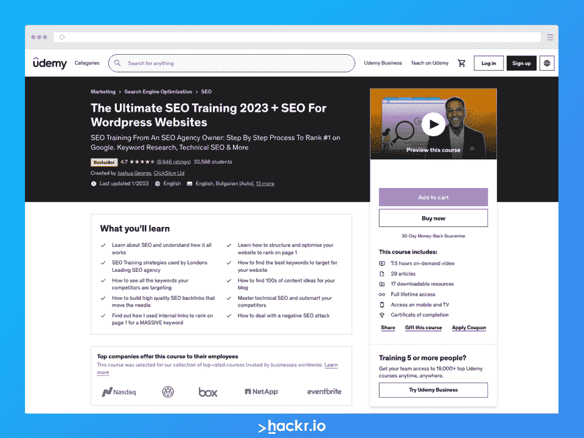**

**[了解更多](https://click.linksynergy.com/deeplink?id=jU79Zysihs4&mid=39197&murl=https%3A%2F%2Fwww.udemy.com%2Fcourse%2Fultimate-seo-training-course%2F)**

**关键信息**

*   **讲师/课程创建者**:约书亚·乔治，ClickSlice 有限公司
*   **时长:** 7.5 小时的视频点播
*   **等级**:初学者
*   **免费或付费:**付费
*   你会学到什么？

*   关于 SEO 你需要知道的一切，包括它如何工作的基本原理
*   领先搜索引擎优化机构使用的培训策略
*   竞争对手关键词研究
*   链接构建策略
*   内部链接策略排名在第一页的关键字
*   关键词研究
*   技术搜索引擎优化
*   应对负面搜索引擎优化攻击

WordPress 网站 SEO 终极培训 2023 + SEO 是针对初学者的课程。课程创建者 Joshua George 是伦敦最成功的 SEO 机构之一的所有者，他表示，这门课程是为企业主、博客作者、有抱负的 SEO 专业人士、网站管理员以及在线或数字营销人员设计的。

在这个项目中，你将找到开始 SEO 所需要知道的一切——从基础知识和它如何工作到成功所必需的技术方面。该课程将教你关键词研究(包括竞争对手的关键词研究)，链接建设策略，等等。

**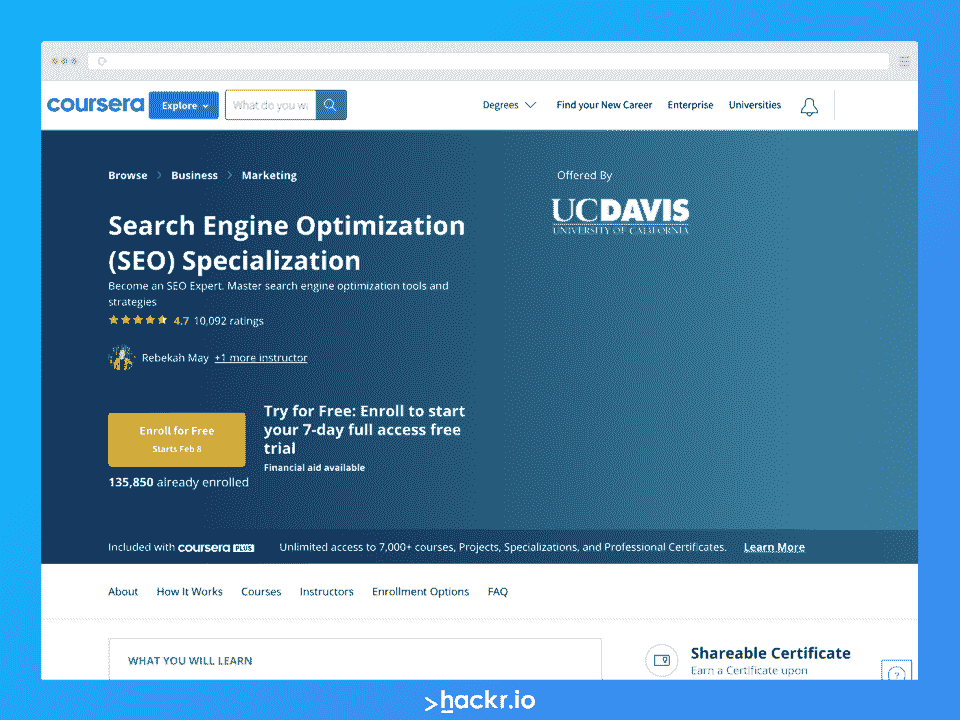**

**[了解更多](https://imp.i384100.net/c/2890636/1347618/14726?u=https%3A%2F%2Fwww.coursera.org%2Fspecializations%2Fseo&partnerpropertyid=2722169)**

**关键信息**

*   **讲师/课程创建者**:加州大学戴维斯分校
*   **持续时间:** 4 周
*   **等级**:初级到中级
*   **免费或付费:**免费审核；如果你想要一个证书和项目的访问权
*   你会学到什么？

*   搜索引擎优化入门
*   SEO 基础
*   如何为搜索引擎优化一个网站
*   用于优化的高级社交和内容策略
*   高级搜索引擎优化策略
*   客户报告项目(网站优化)

深入挖掘搜索引擎优化与加州大学戴维斯分校的搜索引擎优化(SEO)专业化，免费的 Coursera。搜索引擎优化专业化运行总共四周，涵盖了搜索引擎优化的来龙去脉。你将参加测验，完成互动作业，并在论坛中与他人讨论课程。这是你能接触到的最接近真实的 SEO 课程了！

虽然这是一门自定进度的课程(你可以随时重置计时器)，但你可以链接到一个在线群组，进行同伴作业、讨论和帮助。对于那些从声誉卓著的来源寻找信息的人来说，这无疑是最好的搜索引擎优化课程。

**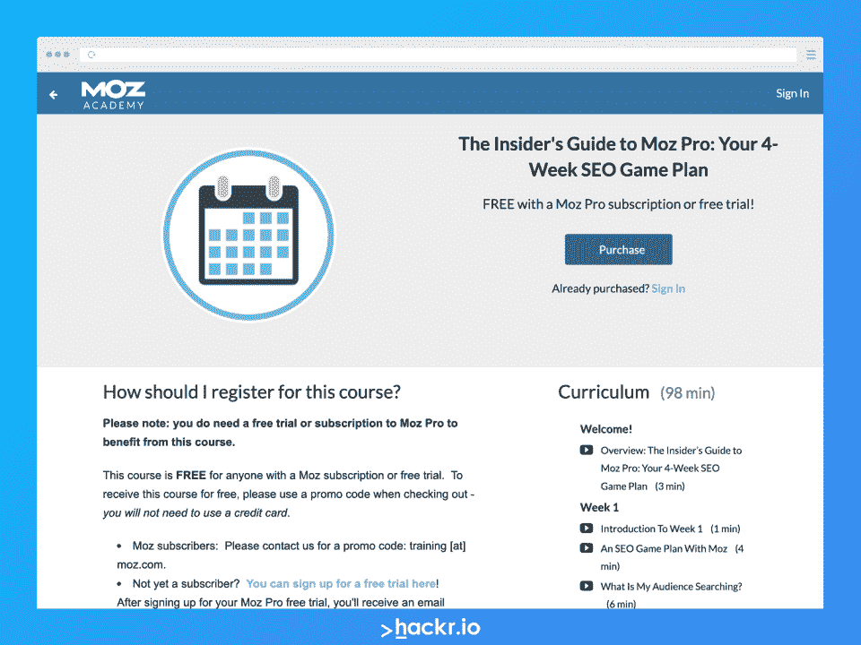**

**[了解更多](https://academy.moz.com/moz-4-week-seo-game-plan)**

**关键信息**

*   **讲师/课程创建者** : Moz
*   **持续时间:** 4 周
*   **等级**:初学者
*   **免费或付费:**付费
*   你会学到什么？

*   如何为任何网站创建和实施一个全方位的搜索引擎优化计划
*   如何使用 Moz Pro 搜索引擎优化工具，包括如何进行搜索引擎优化研究
*   如何建立一个跟踪系统来监控你的搜索引擎优化的结果和进展
*   如何找出你网站的优势/劣势
*   如何分析竞争对手的战略、数据和指标，并将结果信息转化为可操作的步骤，从而为您带来优势
*   如何提升你网站的权威性

这门快节奏的课程涵盖了受众发展、SEO 分析、页面优化、领域权威等等。这是一个完整的课程，旨在作为 SEO 的介绍，为需要从头开始学习一切的初学者量身定制。

具体来说，这门课程非常适合那些不想成为 SEO 营销人员的人——他们只想建立自己的事业。虽然它会给你成为一名 SEO 营销人员所需的信息，但它是为那些出于特定和基础原因想要学习 SEO 的人量身定制的。

**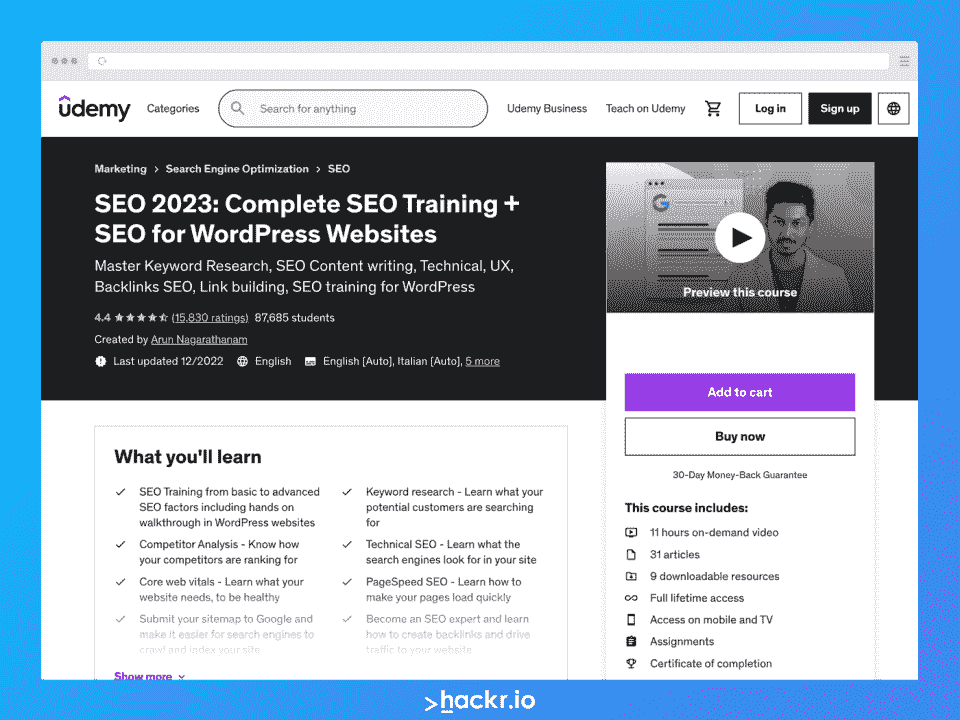**

**[了解更多](https://click.linksynergy.com/deeplink?id=jU79Zysihs4&mid=39197&murl=https%3A%2F%2Fwww.udemy.com%2Fcourse%2Fseo-website-audit%2F)**

**关键信息**

*   **讲师/课程创建者**:约书亚·乔治，ClickSlice 有限公司
*   **时长** : 2 小时视频点播
*   **等级**:初级到中级
*   **免费或付费:**付费

*   如何手动审核网站的 SEO 策略
*   哪些工具用于你的搜索引擎优化审计
*   如何审计网站的技术搜索引擎优化问题
*   您如何解决在审核过程中发现的问题

搜索引擎优化审计-查找和修复网站上最常见的搜索引擎优化问题也是 Joshua George 和 ClickSlice Ltd .开设的课程。这个较短的课程补充了上面 7.5 小时的终极搜索引擎优化培训 2023+WordPress 网站搜索引擎优化课程，但它本身也很好。

在本课程中，您将学习如何执行 SEO 审计，以便您可以修复您的战略和技术 SEO 实施中的任何问题。对于在现有网站上学习 SEO 而不是从头开始的初学者来说，这是一门很好的课程。

**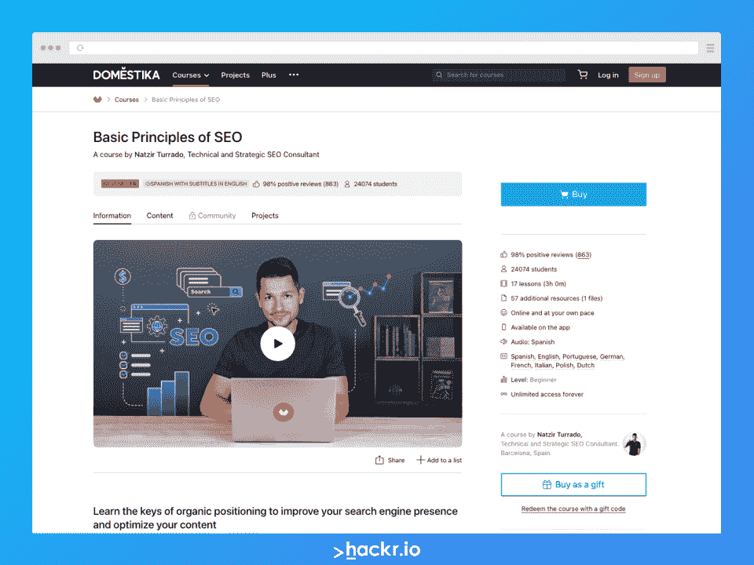**

**[了解更多](http://domestika.sjv.io/ZdnJgX)**

**关键信息**

*   **讲师/课程创建者** : Natzir Turrado
*   **持续时间** : 3 小时
*   **等级**:初学者
*   **免费或付费:**付费

*   搜索引擎优化及其基础知识介绍
*   搜索引擎如何工作
*   关键词和关键词研究
*   为 SEO 创建内容
*   良好/最佳 SEO 实践
*   如何衡量你的 SEO 战略实施进度
*   帮助你将所学付诸实践的期末项目

Domestika 的搜索引擎优化课程的基本原则涵盖了你开始搜索引擎优化需要知道的所有基础知识。你将学习搜索引擎是如何工作的，这样你就有必要的背景知识来更好地理解你将要学习的 SEO 策略。该课程还将教你良好的搜索引擎优化实践，然后告诉你如何衡量你的战略实施取得的任何进展或成功。

如果你是 Plus 会员，Domestika 提供结业证书。

**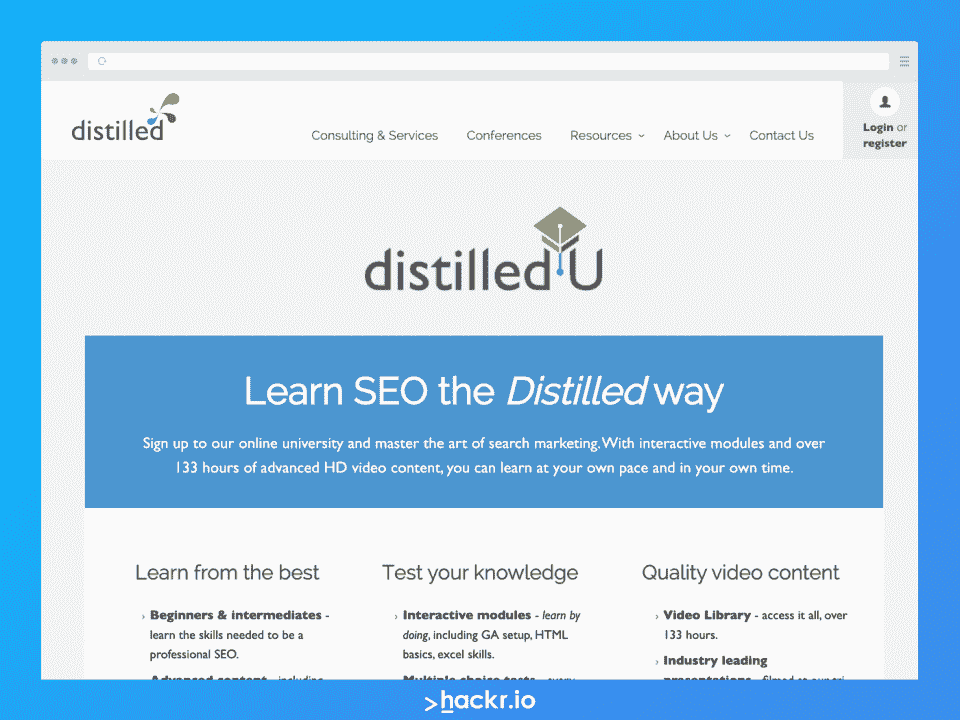**

**[了解更多](https://www.distilled.net/u/)**

**关键信息**

*   **讲师/课程创建者**:蒸馏大学
*   **持续时间:**自定进度
*   **等级**:初级到中级
*   **免费或付费:**付费

*   这个项目涵盖适合初学者和中间用户的主题，教他们成为 SEO 专家所需的一切
*   它还涵盖了移动、视频、分析、搜索引擎优化工具、外展等高级主题
*   该课程还包括测试和互动模块

蒸馏大学的 SEO 101 课程涵盖搜索引擎基础，页面优化，技术 SEO，关键词研究，信息架构等。它既适合初学者，也适合有中级知识的人。这是一门非常强大的课程。视频库中不仅有超过 133 小时的内容，还包括互动模块。

因为蒸馏大学有一个月，而不是一个固定的搜索引擎优化课程费用，整个课程是自定进度的。虽然那里有很多信息，但你可以在闲暇时浏览——非常适合那些试图在全职工作或上学的同时提高自己的 SEO 知识的人。

**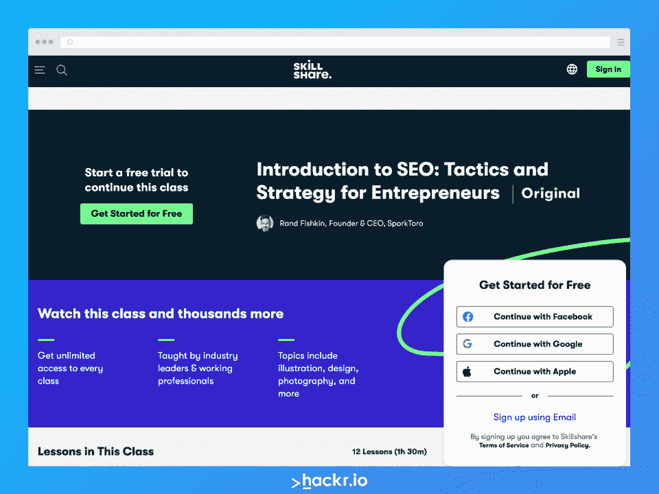**

**[了解更多](http://skillshare.eqcm.net/BXme4y)**

**关键信息**

*   **讲师/课程创建者**:兰德·菲什金
*   **时长** : 1 小时 30 分钟的视频点播和课程
*   **等级**:初学者
*   **免费或付费:**付费

*   搜索引擎优化和 SEO 策略概述
*   使用分析来衡量进展和成功
*   SEO 排名因素
*   搜索引擎优化的误区
*   关键词
*   内容策略
*   评估你的策略

《SEO 入门:企业家的策略和战略》课程很短，但它涵盖了你开始时需要知道的内容。课程本身更针对企业家，尽管非企业家也能从课程中找到价值。在这里，您将了解 SEO 排名因素、关键词、内容策略、分析，甚至 SEO 中的神话和误解。

## **最佳高级 SEO 课程**

搜索引擎优化是一个广泛的学科。很多人都能看懂 SEO 的基础知识，但是要完全掌握需要几年的时间。SEO 不仅仅是知道当前的标准；这是关于学习如何发现算法中的变化并进行调整。高级搜索引擎优化课程包括深入搜索引擎优化，旨在让你成为专家。如果你正在为高级学习者寻找最好的 SEO 程序，考虑下面的选项。

**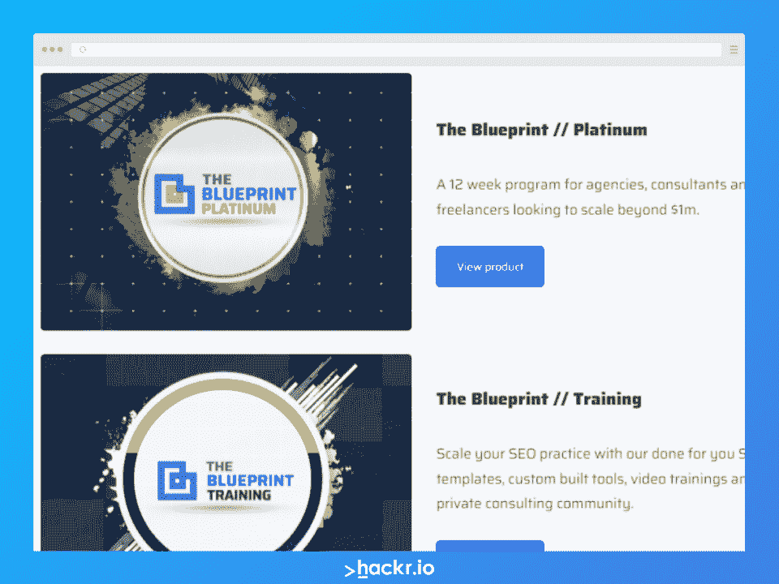**

**[了解更多](https://modules.theblueprint.training/)**

**关键信息**

*   **讲师/课程创建者**:蓝图培训
*   **持续时间:** 12 周
*   **级**:高级
*   **免费或付费:**付费
*   **你将学到什么？**

*   蓝图培训模块涵盖高级主题，包括数据审查、分析、项目规划、竞争对手分析、审计和技术改进、内容规划和创建、链接策略(包括研究、链接建设等)。)，以及更多

这个综合课程花费相当多，但它的目的是确保你从头到尾了解 SEO 的一切。一旦你完成了蓝图培训课程，你应该知道世界顶级机构对搜索引擎优化和营销的了解。这不仅仅是关于了解 SEO——这也是关于 SEO 业务的来龙去脉。

如果你对 SEO 一无所知，这不是一门可以学的课程。大多数学习这门课程的人都已经有了至少几年的行业经验。然而，如果你懂 SEO，这可能是帮助你获得更高薪水的最好的 SEO 培训。

****

**[了解更多](https://click.linksynergy.com/deeplink?id=jU79Zysihs4&mid=39197&murl=https%3A%2F%2Fwww.udemy.com%2Fcourse%2Fseo-get-to-number1-in-google-search%2F)**

**关键信息**

*   **讲师/课程创建者** : Arun Nagarathanam
*   **持续时间:**自定进度
*   **等级**:初级到高级
*   **免费或付费:**付费
*   你会学到什么？

*   从基础到高级的 SEO 概念
*   对手分析
*   关键词研究和策略
*   技术搜索引擎优化
*   用户体验 SEO
*   摆脱负面搜索引擎优化
*   …以及更多

Udemy 的 SEO 2023 课程非常适合那些想学习现代 SEO 和 WordPress 优化的人。Udemy 的 SEO 2023 包括竞争对手分析、关键词研究、内容、技术 SEO、核心网站生命、页面速度、反向链接、UX SEO 和 WordPress 培训。

本课程已针对 2023 年进行了全面更新，提供了关于您今天需要使用哪些战术的深入信息。这是为数不多的经常更新的课程之一，几乎每个月都会更新。

虽然本课程从基础开始，但它也涵盖了通常由更高级的用户学习的更高级的概念。

**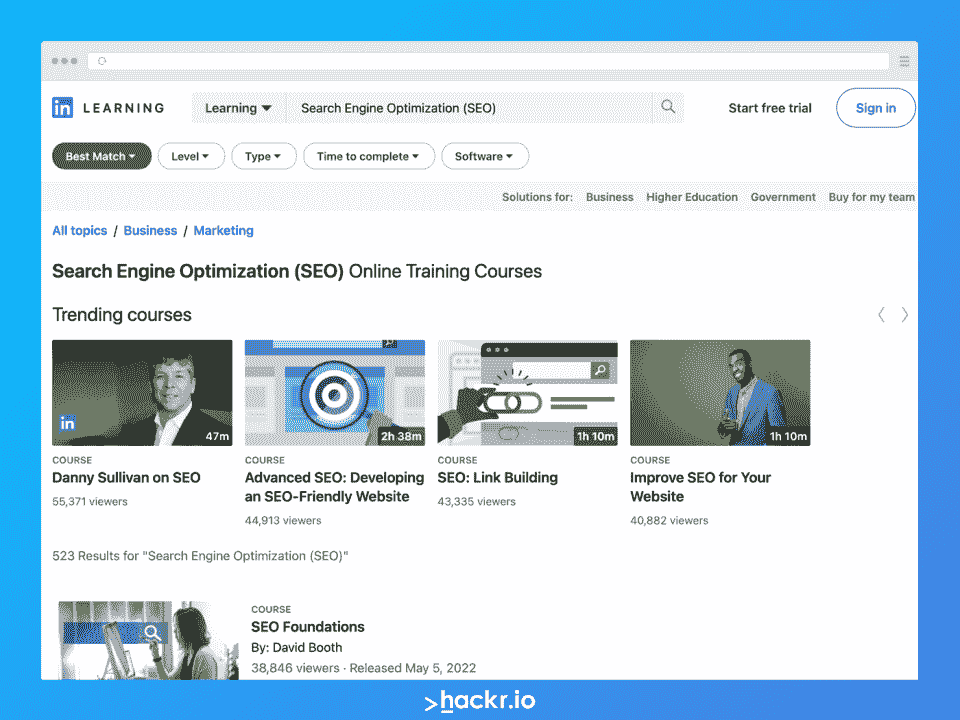**

**[了解更多](https://linkedin-learning.pxf.io/6b3X4q)**

**关键信息**

*   **讲师/课程创建者**:各不相同
*   **持续时间:**因课程而异
*   **电平**:变化
*   **免费或付费:**付费
*   你会学到什么？

*   LinkedIn Learning 提供各种课程，涵盖从基础到高级的不同主题

与 Coursera 类似，LinkedIn Learning(以前的 Lynda)每月提供几门课程。LinkedIn 上有 26 门搜索引擎优化课程，包括“搜索引擎优化基础”、“成为搜索引擎优化专家”和“技术搜索引擎优化”课程被组织成“学习路径”,以便更容易找出你需要知道什么。

LinkedIn 也有许多其他数字营销课程。如果你想改变你的职业(或发展它)，你每月的报名费可以让你获得大量的学习机会。

## **最佳 SEO 认证课程**

SEO 认证课程有什么不同？SEO 认证课程最终会给你一个可验证的认证——一个你可以添加到简历中的资格。SEO 认证课程是建立你的证书的好方法，尤其是如果你在 SEO 方面经验有限的话。

**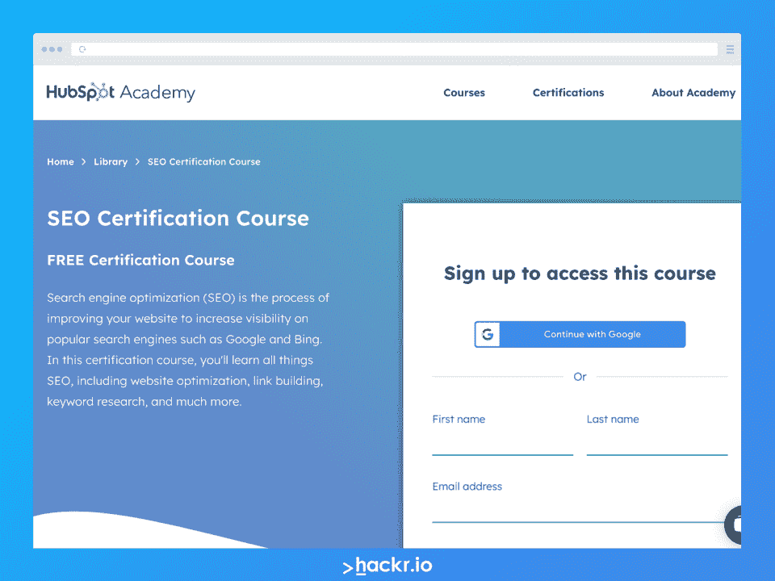**

**[了解更多](https://academy.hubspot.com/courses/seo-training)**

**关键信息**

*   **讲师/课程创建者** : HubSpot 学院
*   **持续时间:** 3 小时
*   **等级**:初学者+
*   **免费或付费:**免费
*   你会学到什么？

*   这个认证课程是为内容创作者和营销人员设计的，但它也非常适合任何想学习更多 SEO 知识的人。它教你如何评估你的网站的搜索引擎优化和改善它，如何创建和实施链接建设策略，等等

HubSpot 提供了一个免费的认证课程，一旦获得，表明你知道搜索引擎优化的基础知识，包括网站优化，链接建设，关键词研究，竞争对手研究，等等。它不仅包括谷歌，还包括必应。

除了免费的认证课程，你还可以浏览 HubSpot 的其他课程和文档。HubSpot 维护着一个极其庞大的 SEO 和数字营销数据库。

HubSpot Academy 是 SEO 领域值得信赖的领导者，它会根据 Google 和 Bing 算法的新变化不断更新信息。

**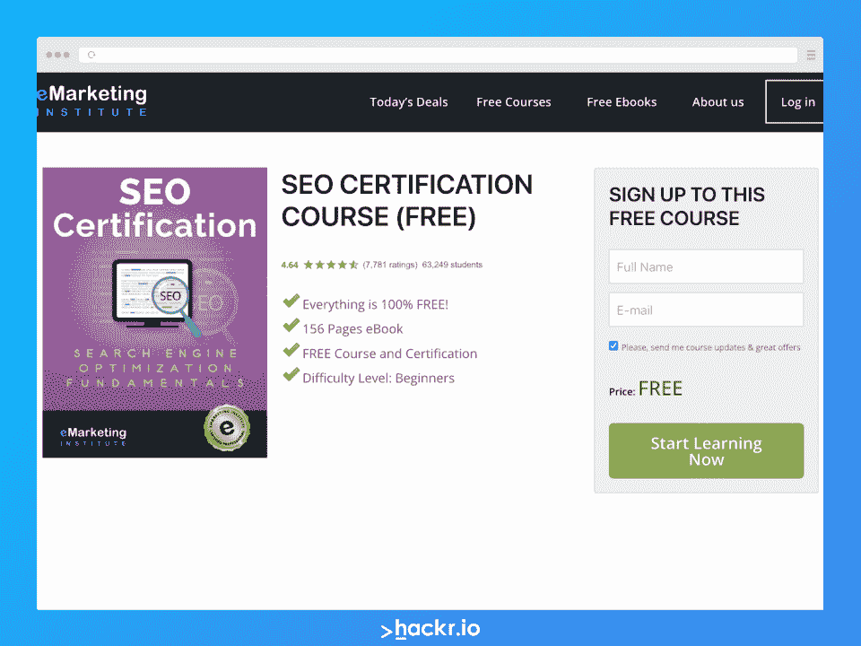**

**[了解更多](https://www.emarketinginstitute.org/free-courses/seo-certification-course/)**

**关键信息**

*   **讲师/课程创建者**:电子营销
*   **持续时间:**按照自己的节奏阅读和学习电子书
*   **等级**:初学者
*   **免费或付费:**免费
*   你会学到什么？

*   搜索引擎优化简介
*   搜索引擎及其工作原理的背景知识
*   设计和开发一个搜索引擎友好的网站
*   关键词研究基础
*   链接建筑
*   SEO 工具
*   如何优化你的网站

这个基本的 SEO 营销课程和认证是免费的，以 156 页的电子书形式提供。你可以在 eMarketing 的网站上注册以获取更多信息，并立即了解搜索引擎优化的基本原理。课程结束时，您将获得 eMarketing 的 SEO 认证。

这个认证过程并没有得到很好的认可，但是这是一个测试你的 SEO 知识和学习更多的好机会。有了免费的课程和认证，你就可以决定这是不是一条好的职业道路。

**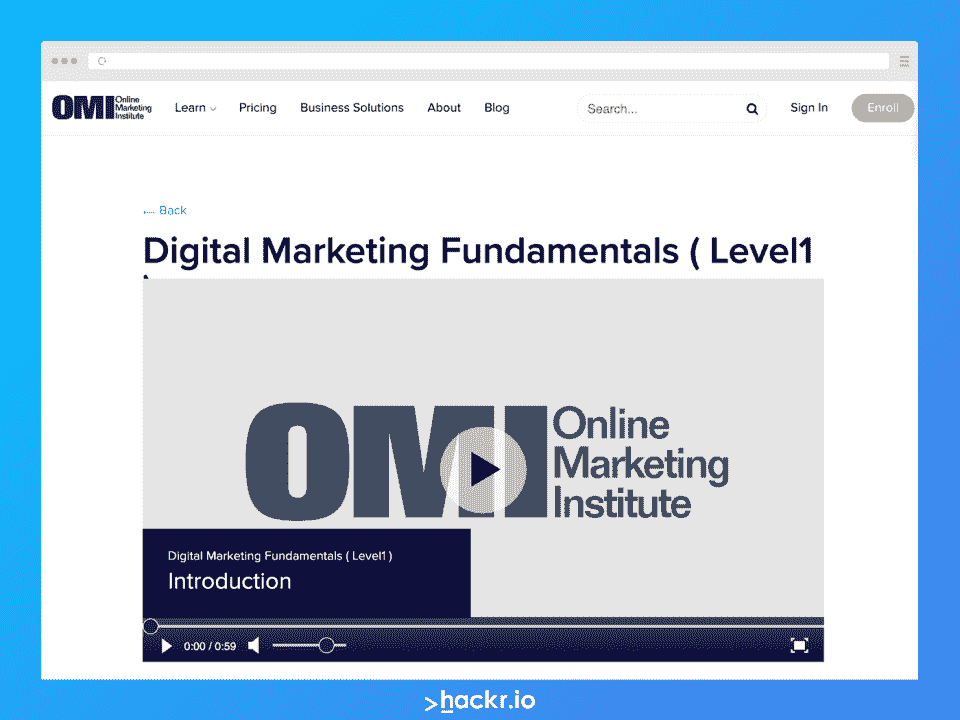**

**[了解更多](https://www.onlinemarketinginstitute.org/certifications/digital-fundamentals-certification/)**

**关键信息**

*   **讲师/课程创建者** : OMI(网络营销学院)
*   **持续时间:**将近七个小时的数字营销基础认证
*   **等级**:初学者+
*   **免费或付费:**付费
*   你会学到什么？

*   本课程涵盖各种类型的数字营销，包括搜索引擎优化

在线营销学院拥有社交媒体、脸书营销、数字营销和内容营销认证。这些认证从 6-11 级不等，涵盖从 SEO 到一般数字营销实践的所有内容。有兴趣学习更多营销和 SEO 知识的人应该参加[数字基础认证](https://www.onlinemarketinginstitute.org/certifications/digital-fundamentals-certification/)。

在现实中，大多数营销人员不只是专注于搜索引擎优化。他们知道搜索引擎优化，竞价排名活动，社会媒体营销和内容营销。网上营销学院是伟大的营销者谁想要更多关于网上营销战略的全面知识。

**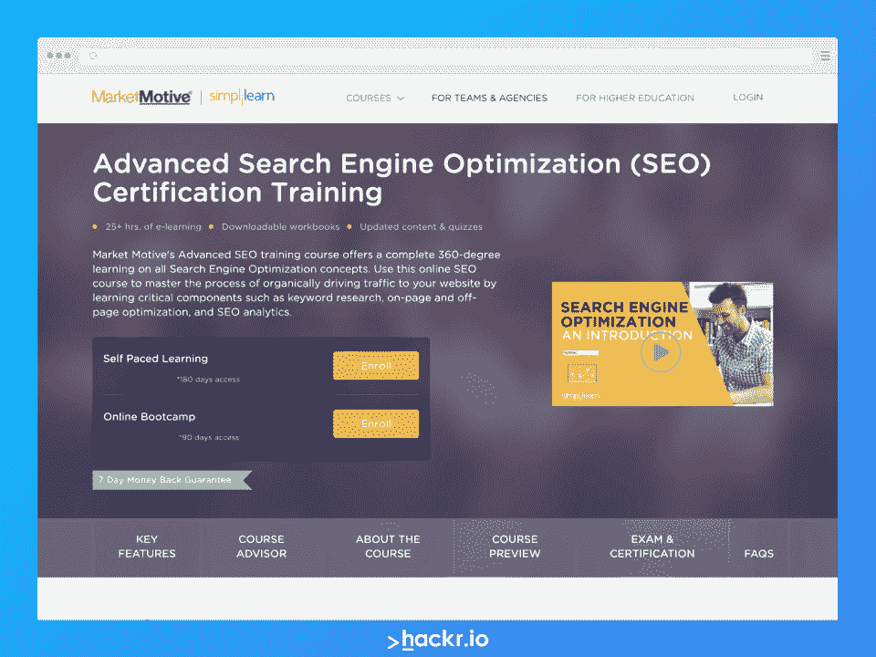**

**[了解更多](https://www.marketmotive.com/search-engine-optimization-seo-training-courses/)**

**关键信息**

*   **讲师/课程创建者**:市场动机
*   **持续时间:**超过 25 小时
*   **级**:高级
*   **免费或付费:**付费
*   你会学到什么？

*   这一深入的高级培训计划涵盖了成为职业选手所需的所有内容。您将了解更多关于关键词研究和管理、页面内和页面外优化、分析等内容。它还包括一章内容营销，以及网页分析和高级搜索引擎优化策略的章节

MarketMotive 提供高级技术 SEO 课程，既可以是自定进度的课程计划(支付 180 天的访问费用)，也可以是在线训练营(支付 90 天的访问费用)。

在这门高级 SEO 认证课程中，您将了解更多基本的 SEO 概念，如何有机地为您的网站增加流量，执行基本的关键字研究，优化页面，以及执行详细的分析。

对于那些发现没有很多结构就无法学习的人来说，训练营是一个很好的选择。训练营会给你明确的目标和明确的期限。但是如果你能自我激励，你可以通过自定进度的学习计划节省一些钱。

****

**[了解更多](https://www.clickminded.com/seo-certification/)**

**关键信息**

*   **讲师/课程创建者** : ClickMinded
*   **持续时间:**因课程而异
*   **等级**:初学者+
*   **免费或付费:**免费开始，然后付费
*   你会学到什么？

*   本课程首先为您设置基础知识，然后继续学习 SEO 如何工作、搜索引擎如何工作等主题。然后，你将学习如何创建一个强大而有效的数据驱动的搜索引擎优化策略，技术搜索引擎优化，搜索引擎优化工具，创建一个搜索引擎优化友好的网站，等等

你可以免费完成 ClickMinded 的基础课程，但要获得认证(并完成更高级的课程)，你需要付费。ClickMinded 的 SEO 认证将显示你知道搜索引擎优化的基础知识。

这个认证课程的目标是搜索引擎优化营销人员和公司和品牌谁想要执行自己的搜索引擎优化。希望员工学习更多搜索引擎优化知识的公司可以考虑让他们通过这一认证途径。

**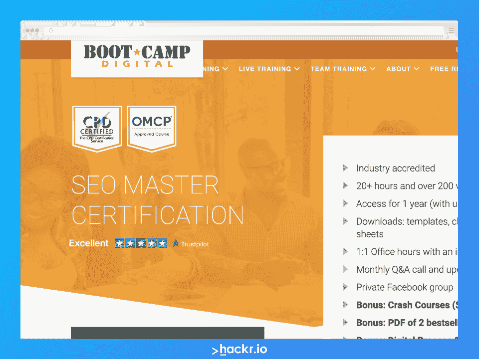**

**[了解更多](https://bootcampdigital.com/product/search-engine-optimization-certification)**

**关键信息**

*   **讲师/课程创建者**:数字训练营
*   **持续时间:**一年大约 20 多个小时的学习内容
*   **级**:高级
*   **免费或付费:**付费
*   你会学到什么？

*   注册后，你将有一年的时间学习四门课程:SEO 培训、网站、谷歌分析和 SEO 文案。每门课程都深入其各自的主题，帮助你学习成为一名全面的职业选手所需的所有知识。例如，SEO 课程教你 SEO 如何工作，如何将 SEO 整合到你的营销策略中，关键词和竞争对手研究，如何建立反向链接策略，等等

想成为 SEO 高手？Bootcamp Digital 的 SEO Master Certification 是一门行业认可的认证课程，包括与讲师一对一的办公时间，模板和清单等下载，以及一个私人的脸书小组，在那里你可以与他人讨论你学到的东西。

虽然这个课程比许多其他课程稍微贵一点，但它也包括一个免费的数字战略研讨会——你可以投资一个额外的 SEO 速成班。这是你想快速成为 SEO 专家的课程。

## **最佳免费 SEO 课程**

你可能想知道如何免费学习 SEO。你可能很高兴知道这是完全可能的，而且现在有很多免费的 SEO 课程！

但是，在你参加任何项目之前，记住你需要小心。

任何人都可以在网上发布 SEO 课程。SEO 每月都在发生巨大的变化，更不用说每年了。当选择一个免费的 SEO 课程时，首先要看它们最近更新了多少，以及它们的出版商的声誉如何。仅仅因为你在寻找免费的 SEO 培训并不意味着你应该在质量上妥协！

下面，你会看到我们对免费课程的主要推荐:

**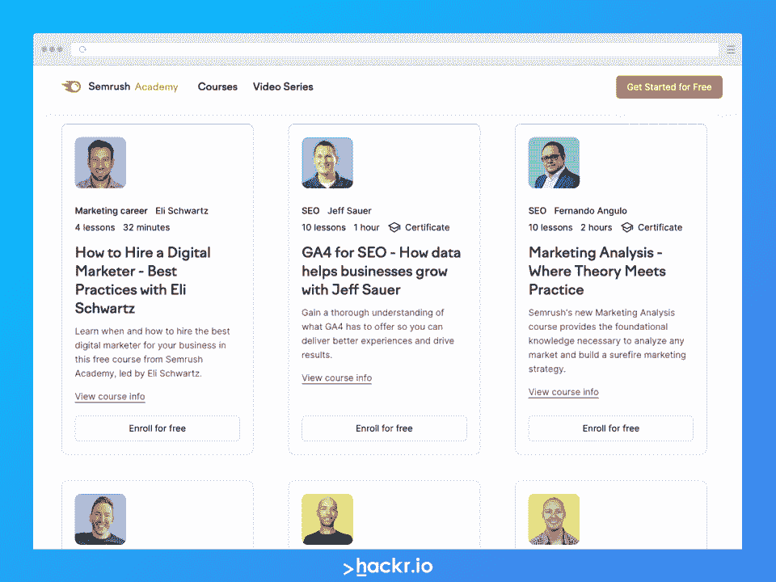**

**[了解更多](https://semrush.sjv.io/doN36j)**

**关键信息**

*   **讲师/课程创建者**:视您选择的课程而定
*   **持续时间:**变量
*   **等级**:初学者+
*   **免费或付费:**免费

*   课程主题根据你的选择而有所不同，但你可以学习如何雇用数字营销人员或被雇用为数字营销人员，内容营销，掌握数字公关，如何创办小企业并获得更多客户，等等。

Semrush 是 SEO 领域公认的领导者，提供课程、认证考试和 Semrush 平台。Semrush 的 SEO 学院包括 Semrush SEO 工具包课程和更集中的课程，如面向中小企业的数字营销和使用 Semrush 发展您的 SEO 机构。

对于那些想学习 SEO 细节的人来说，Semrush 的课程是一个很好的选择，无论是基础知识还是如何将 SEO 整合到商业计划中。他们提供全面的视频课程——但是互动性很低。无论如何，它仍然是 2023 年最佳 SEO 课程的顶级竞争者。

**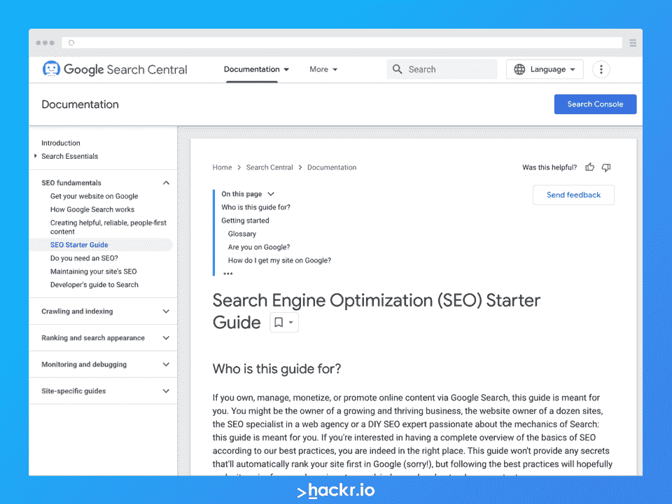**

**[了解更多](https://developers.google.com/search/docs/beginner/seo-starter-guide)**

**关键信息**

*   **讲师/课程创建者**:谷歌
*   **持续时间:**一小时
*   **等级**:初学者
*   **免费或付费:**免费
*   你会学到什么？

*   无论你是小企业主、有抱负的搜索引擎优化专家还是网站所有者，这份谷歌指南都将向你展示学习搜索引擎优化所需的一切。你会学到一些东西，比如如何告诉 Google 哪些页面要抓取，哪些要避开，如何使用元描述和标题标签进行 SEO 格式化，如何最好地设置你的网站 URL，等等。

谁比谷歌更了解谷歌？如果你刚刚起步，需要一些免费信息，谷歌搜索引擎优化课程是理想的起点。这会给你更多关于谷歌搜索引擎的基本信息，它是如何工作的，以及谷歌希望你如何优化你的网站。

但是，当然，谷歌不想放弃一切。许多营销人员多年来一直在尝试确定谷歌并不真正“希望”他们知道的事情。所以，虽然这是一个完美的起点，但以后你可能需要更深刻的知识。

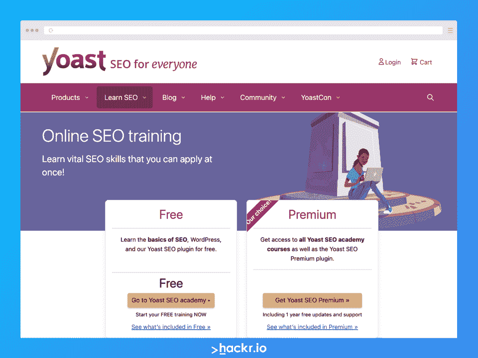

**[了解更多](https://yoast.com/academy/)**

**关键信息**

*   **讲师/课程创建者** : Yoast 和 Yoast SEO 团队
*   **持续时间:**自定进度
*   **等级**:初学者+
*   **免费或付费:**免费
*   你会学到什么？

*   在免费层，你会学到一些东西，比如面向初学者的 SEO，WordPress 和 WordPress SEO，结构化数据
*   如果你购买了 Yoast SEO Premium，你将会学到关键词研究、本地和国际 SEO、电子商务 SEO、SEO 文案、技术培训、WordPress 培训等等

Yoast 是 WordPress 最受欢迎的插件之一，它提供了营销人员优化博客文章、文章、登陆页面等所需的一切。Yoast 还提供几门关于 SEO 和 WordPress 的课程，你可以通过 Yoast SEO 页面访问。

如果你想学习更多，你可以付出更多。只要支付年费，你就可以获得他们所有的 SEO 学院课程(不仅仅是基础课程)和 Yoast SEO 插件。

**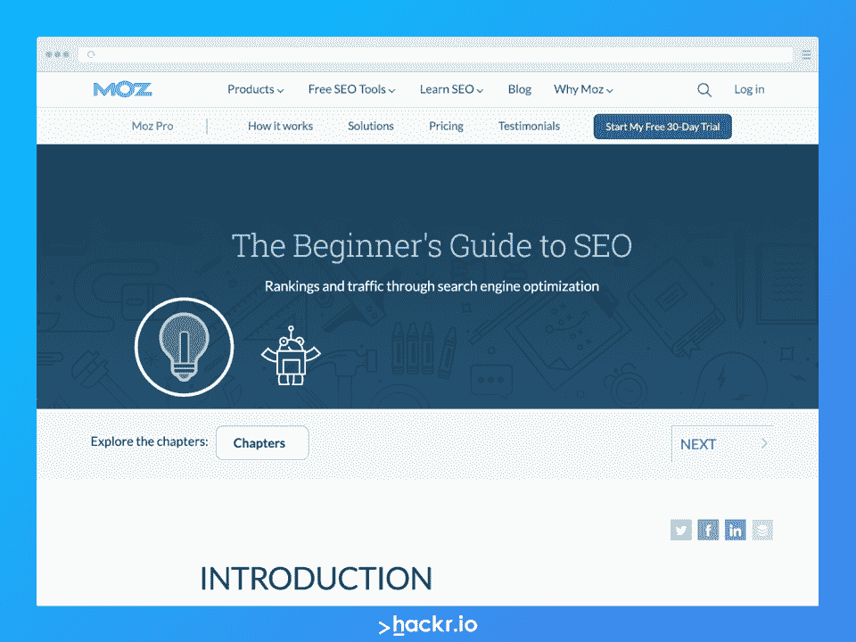**

**[了解更多](https://moz.com/beginners-guide-to-seo)**

**关键信息**

*   **讲师/课程创建者** : [Moz](https://moz.com/about) (当今最知名的 SEO 公司之一)
*   **持续时间:** 7 章
*   **等级**:初学者
*   **免费或付费:**免费
*   你会学到什么？

*   这本初学者指南涵盖了搜索引擎优化的所有主要和重要的方面，包括关键词研究，如何使你的内容(和网站)更适合搜索引擎，链接建设，甚至一些营销

Moz 提供免费的 SEO 工具和 SEO 初学者指南(共七章，你可以免费获得)。虽然 Moz 的课程有高级版本，但这本 SEO 初学者指南应该是你学习基础知识所需要的一切。如果你想获得优质内容，你也可以开始 30 天的免费试用。

**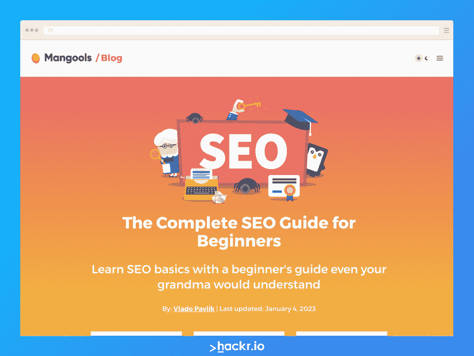**

**[了解更多](https://mangools.com/blog/learn-seo/)**

**关键信息**

*   **讲师/课程创建者**:曼古尔斯/弗拉多·帕夫里克
*   **持续时间:** 7 章
*   **等级**:初学者
*   **免费或付费:**免费
*   你会学到什么？

*   SEO 基础
*   搜索引擎背景
*   关键词研究
*   页面和技术搜索引擎优化
*   优化内容
*   链接建设和反向链接
*   分析学

Mangool 的 SEO 初学者指南几乎涵盖了你在这个主题上需要知道的一切。创建者设计的程序容易被任何人理解，不管他们是新手还是至少有一定经验的人。然而，尽管这是对 SEO 及其原理的有效介绍，但它可能不会像其他一些文章那样频繁更新。

## **SEO 课程入门**

这就是你要的——网上最好的搜索引擎优化课程。那么如何才能入门合适的 SEO 课程呢？这取决于你的经验水平和你的目标。

如果你对 SEO 一无所知，你可以从免费资源入手，比如 Google 的搜索引擎优化或者 Semrush 的 SEO 学院。这将让你对 SEO 的前景有一个大致的了解。从那里，其他[初级 SEO 课程](https://hackr.io/tutorials/learn-seo)和高级课程可以完善你的知识。

如果你是一个企业主或企业家，想要学习更多关于 SEO 的知识，最好是参加一个针对企业主或中小企业的初级课程，而不是营销人员。在线营销学院和 LinkedIn 都有很多选择。如果你是一名作家，你可能会想参加一个 SEO 写作课程。

最后，如果你对搜索引擎优化感兴趣，你也应该参加 SEO 认证课程。搜索引擎优化认证课程证明你有现实世界中的工作知识，它需要适当的搜索引擎优化内容。在线营销学院和 ClickMinded 都提供全面的搜索引擎优化认证课程。

准备好应用您的 SEO 知识并获得实践经验了吗？结账:

**[最佳 SEO 工具](https://hackr.io/blog/best-seo-tools)**

## **常见问题解答**

#### **1。SEO 学什么课程最好？**

外面有很多课程。其中，HubSpot 的 SEO 课程往往最具辨识度。Udemy 和 Coursera 也有一些 SEO 课程、课程和职业道路，可以更容易地学习你需要知道的东西。理想情况下，你应该找到一门适合你的预算、学习方式和时间表的课程。如果你亲自学习效果最好，你可能会想寻找当地最好的搜索引擎优化课程。

#### **2。2023 年 SEO 还有意义吗？**

搜索引擎优化将是相关的，只要搜索引擎是用来寻找内容。但这并不意味着 2022 年的 SEO 仍然适用于 2023 年的 SEO。SEO 随着时间的推移而不断发展；过去有效的策略现在不一定有效。

#### **3。SEO 认证值得吗？**

搜索引擎优化认证主要是为那些搜索引擎优化新手或从另一个领域转向营销的人“值得”。你不应该为一个 SEO 认证付出很多；这不是雇主需要看到的，许多免费和付费认证之间几乎没有实质性的区别。

#### **4。SEO 是个好职业吗？**

搜索引擎优化几乎融入了今天企业所做的每一件事，因为大多数公司的营销已经数字化。作为一名 SEO 专业人士，你可以在许多行业工作，从非营利组织到方公司。SEO 是一个快速发展的职业，它的技能可以扩展到其他领域，如一般的数字营销和内容营销。