# 2023 年你应该查看的 15+最佳 WordPress 在线课程

> 原文：<https://hackr.io/blog/best-wordpress-courses>

WordPress 为互联网上大约三分之一的网站提供支持。事实上不止。拥有 43%的市场份额，难怪这么多人想学习如何使用内容管理系统。事实上， [WordPress](https://wordpress.org/) 是开源的，100%免费使用，这使得它成为你创建网站时更有吸引力的选择。

如果你想了解 WordPress 是如何工作的，这样你就可以制作你自己的网站或者为你的客户创建一些网站，我们把 2023 年最好的 WordPress 课程列表放在了一起。为了您的方便，我们将列表分为两部分:高级和免费。

## **如何选择最好的 WordPress 课程？**

如果你想学习 WordPress，最好的方法之一就是参加 WordPress 课程。课程是你边学边学的好方法，因为许多课程都很全面，包含了你可以零敲碎打学习的主题的逐步信息。这些课程通常包括您需要知道的一切，从最重要的基础知识到与内容管理系统相关的一些最先进的概念。

值得庆幸的是，学习 WordPress 非常容易——以至于学习基础知识只需要几个小时。事实上，你可以找到持续几个小时的课程，告诉你如何建立你的第一个网站。

然而，随着你对 WordPress 的进一步了解，你可能会意识到还有很多东西需要学习，比如主题、插件、SEO(搜索引擎优化)、网站安全等等。如果你足够深入地了解它，你甚至会发现自己想要学习一些关于事物发展方面的知识。但是，你如何选择一门包含所有你最终想学的主题的结构化课程呢？

下面的标准可以帮助你选择最适合你的 WordPress 课程。

*   价格或预算 -你愿意在一门课程上花多少钱？你当然可以免费学习，但是如果你只想学习已经为你准备好的课程，你通常需要付费。Udemy 上的课程经常以可承受的价格出售。然而，有一些项目至少要花费你几百美元，尽管这些项目带来了许多你可能无法从更实惠的选择中获得的好处。
*   **长度或持续时间** -你愿意花多少时间学习？或者更确切地说，你能为这门课程投入多少时间？
*   课程结束后，你会获得某种证书或资格证书吗？本质上，认证不是*所必需的*。但是，如果你能获得一个完成课程的证书，它确实会成为你简历的另一个凭证。
*   **主题覆盖** -你打算学习 WordPress 做什么？如果你只是想学习 WP，以便能够创建和管理自己的网站，你可以选择更短、更简单的课程。然而，如果你想最终为客户创建和管理网站，你可能需要一个更复杂、更深入的 WordPress 类。
*   **站台** -哪里有球场？你打算如何学习(在哪些设备上，在线或离线等)？
*   **评论/评级**——在 Udemy 或 Coursera 等平台上，课程通常会有星级评级(5 分制，5 分是最高的)，让你知道人们对课程的总体看法。这可以帮助你确定一门课程是否值得你花费金钱和时间。
*   你能坚持这门课程多长时间？ -一些平台，如 Udemy，允许你终身访问你购买的课程。他们还允许你下载 pdf 甚至你的课程视频。但是，其他平台可能会在您的订阅结束后立即停止您对课程的访问。终身访问可能更有益，但如果你能下载大部分内容或做详细笔记，那就没必要了。

现在你对选择时要考虑的事情有了更好的想法，从下面的列表中选择合适的类可能会变得更容易。

## **Premium/****2023 年最佳 WordPress 课程**

[**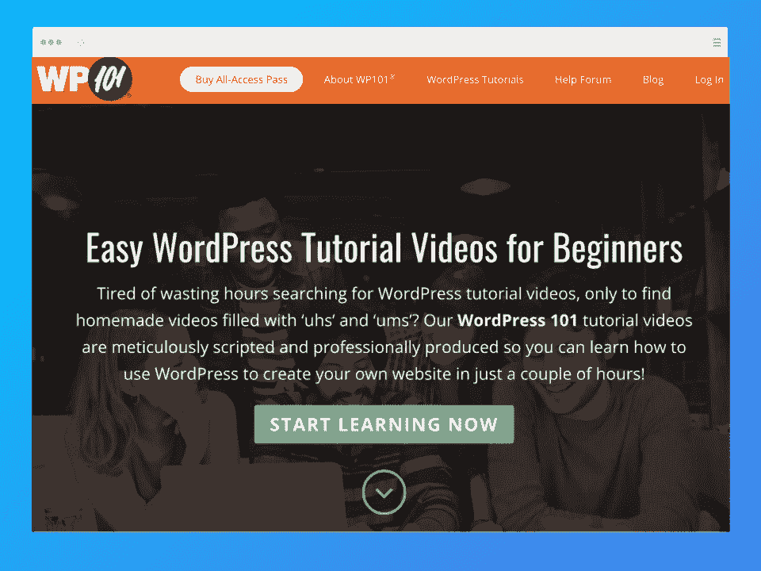**](https://wp101.com/)

#### **关键信息**

*   创建于 2008 年
*   通过大约 90 分钟的视频按照自己的节奏学习
*   获得证书(当你完成课程中的每一课时)

WP101 是一门已经存在了很长时间的 WordPress 课程——事实上将近 15 年。自诞生以来，WP101 已经成为互联网上最好和最受欢迎的 WordPress 教程系列之一。由于它的许多课程和循序渐进的视频，它现在已经帮助了数百万人学习内容管理系统。

如果你有一个繁忙的时间表，这个程序是学习 WordPress 的一个很好的方式，因为大多数视频通常不到五分钟。WP101 教你如何导航 WP 仪表板，如何创建内容，如何管理页面和帖子，如何使用主题，如何安装和使用插件，以及如何使用小部件。

**时长:** 90 分钟的视频

**等级:**初学者

证书:是的，如果你完成了一门课程中的每一课

**价格:**

*   每月 19 美元，或
*   每年 49 美元，或者
*   终身访问 89 美元

**[现在报名](https://wp101.com/)**

[**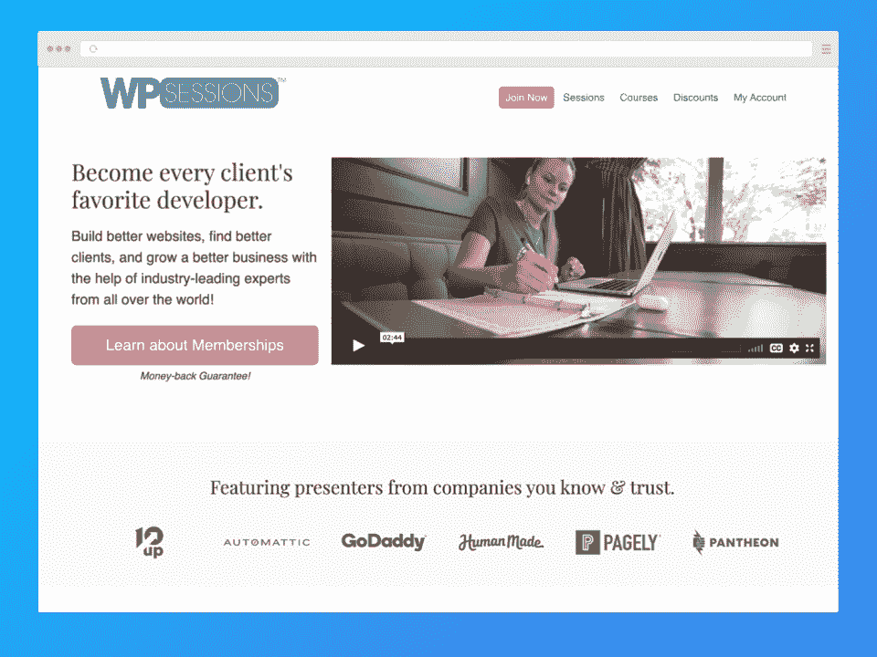**](https://wpsessions.com/)

#### **关键信息**

*   课程平台上的主讲人来自 SiteGround、GoDaddy、Yoast、WooCommerce 等知名公司
*   WPSessions 举办世界上最大的虚拟/在线 WordPress 会议
*   如果你想为自己或你的企业/公司得到培训，私人培训是可行的

如果你想直接从专家那里获得 WordPress 培训，WPSessions 是一个很好的课程提供者。他们的课程和培训课程库继续增长。你可以学习维护，搜索引擎优化，速度优化，甚至如何创建一个插件。

WPSessions 提供的课程更复杂，是为那些对 CMS 的开发更感兴趣的人准备的。如果你想学习如何使用 WordPress 创建和管理你自己的网站，有更多合适的课程。

**时长:** 275 小时以上的内容

**等级:**初学者+

**证书:**无信息

**价格:**

*   每月 29 美元即可访问所有培训并在其他网站上获得独家折扣，或者
*   每年 299 美元下载所有培训，获得额外课程，并在其他网站上获得折扣
*   14 天退款保证

**[现在报名](https://wpsessions.com/)**

[**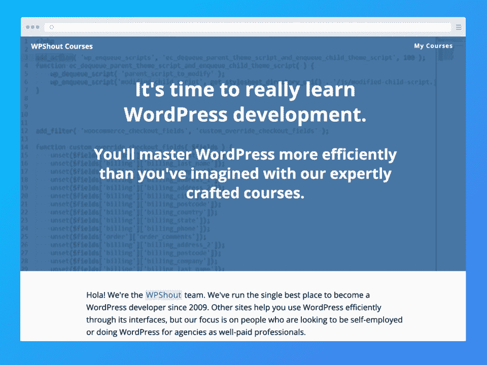**](https://courses.wpshout.com/)

#### **关键信息**

*   提供清晰、全面的课程，详细讲解所有内容
*   也教你关于 WordPress 站点安全的知识
*   最好如果你是一个专业人士，希望学习发展，这样你就可以接受客户
*   还提供了一个免费的 WP 开发入门课程来帮助你开始

如果你想学习更多关于 WordPress 的开发方面的知识，WPShout 是一个很好的选择。它提供了大量的免费内容，包括免费的 WP 开发入门课程。然后，你可以从两个课程中选择:启动并运行或 WordPress 安全与信心。

启动和运行是一门课程，通过视频教程，信息图表和清晰的解释，教你需要知道的关于 WP 开发的知识。它甚至提供了完整的电子书供下载。

**持续时间:**

*   启动和运行:30 多章，每章末尾有测验
*   自信的安全:17 个模块和 90 多个视频教程

**等级:**中级到高级

**证书:**仅适用于入门课程，pro bootcamp 版本

**价格:**

*   启动运行:豪华版 197 美元，专业版 997 美元
*   WordPress 安全自信:开发者综合安全课程:197 美元
*   30 天退款保证

**[现在报名](https://courses.wpshout.com/)**

[**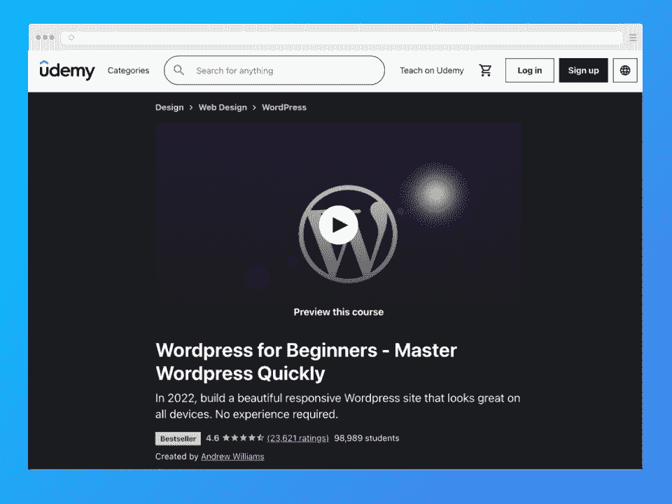**](https://click.linksynergy.com/deeplink?id=jU79Zysihs4&mid=39197&murl=https%3A%2F%2Fwww.udemy.com%2Fcourse%2Fwordpress-for-beginners-course%2F)

#### **关键信息**

*   伟大的，如果你的目标是创建联盟营销网站
*   可在 Udemy 上购买，经常打折，让你终身享用
*   教你从头开始创建一个专业设计的网站，并保持你的内容组织有序，易于查找

这个 Udemy 课程讲述了一些基础知识，教你如何建立一个漂亮的、实用的、负责任的基于 WordPress 的网站。它可以教你如何配置 WP 以获得最好的结果。课程创建者安德鲁·威廉姆斯打算让他的班级帮助那些想为联盟营销创建网站的人，这样他们就可以获得经常性的被动收入。然而，它只讨论了 WordPress/网站创建方面，而不是联盟营销的其他方面。

**时长:** 9h27m 视频，20 节 108 讲

**等级:**初学者+

**证书:**是(Udemy)

**价格:**

*   全价 129.99 美元，通常在 10-20 美元左右出售
*   也可以通过 Udemy 个人计划(订阅)获得，7 天试用期后每月 29.99 美元

**[现在报名](https://click.linksynergy.com/deeplink?id=jU79Zysihs4&mid=39197&murl=https%3A%2F%2Fwww.udemy.com%2Fcourse%2Fwordpress-for-beginners-course%2F)**

[**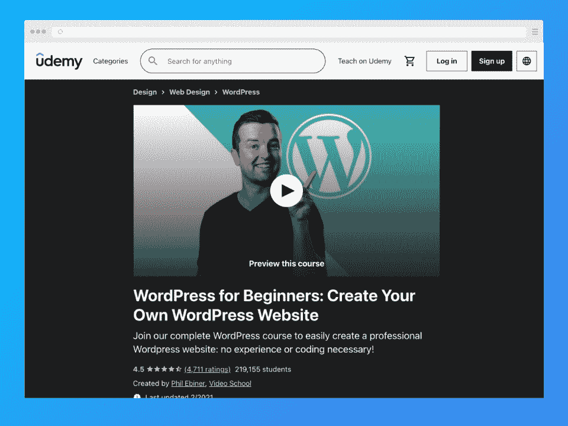**](https://click.linksynergy.com/deeplink?id=jU79Zysihs4&mid=39197&murl=https%3A%2F%2Fwww.udemy.com%2Fcourse%2Fthe-complete-wordpress-for-beginners-course%2F)

#### **关键信息**

*   即使不打折也非常实惠
*   提供实践学习—在学习课程的同时创建完全定制的网站
*   包括一些搜索引擎优化课程

课程创建者 Phil Ebiner 为那些想创建一个漂亮的网站作为业余爱好的人，为他们的个人生活，或为他们的生意制作了这个课程。作为一门实践性很强的课程，你将在学习的过程中创建自己的网站。学生可以从零开始，不需要任何事先的 HTML 或 CSS 知识。

这个 Udemy 课程将向你展示如何创建你的网站，发布页面和文章，使用主题和插件。然后是更复杂的话题，比如电子商务和 WordPress 网站安全。菲尔·埃比纳也让学生知道，如果有任何问题，他们可以寻求帮助。

**时长:** 7h50m 视频，12 节 102 讲

**等级:**初学者

**证书:**是(Udemy)

**价格:**

*   全价 19.99 美元，经常以 10.99 美元左右的价格出售

**[查看课程](https://click.linksynergy.com/deeplink?id=jU79Zysihs4&mid=39197&murl=https%3A%2F%2Fwww.udemy.com%2Fcourse%2Fthe-complete-wordpress-for-beginners-course%2F)**

[**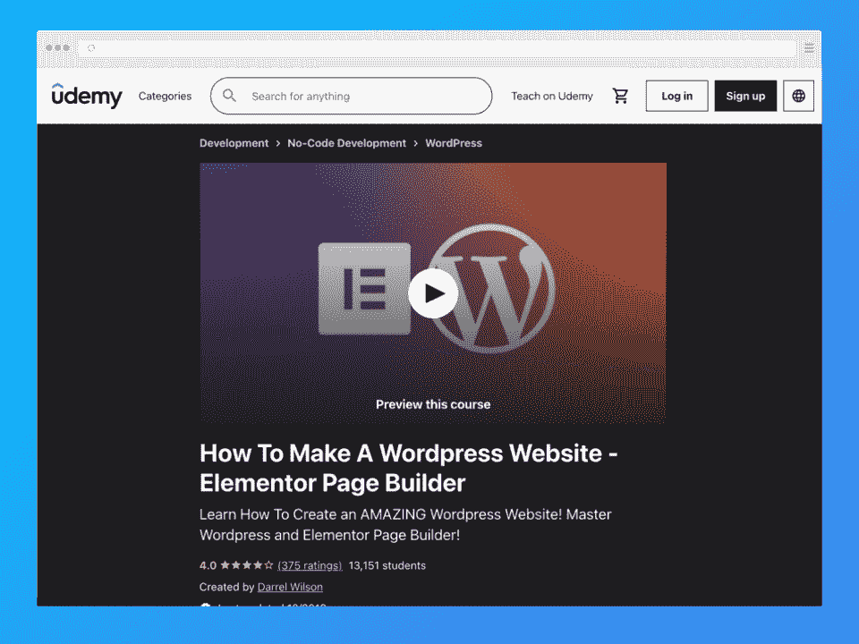**](https://click.linksynergy.com/deeplink?id=jU79Zysihs4&mid=39197&murl=https%3A%2F%2Fwww.udemy.com%2Fcourse%2Fhow-to-make-a-wordpress-website-2017-elementor-page-builder%2F)

#### **关键信息**

*   即使不打折也能买得起
*   短暂但甜蜜
*   教你如何使用 wordpress，然后向你展示元素或

有许多拖放编辑器，Elementor 就是其中之一。你可以在你的 WordPress 网站上安装 Elementor，这样你就可以使用可视化编辑器来设计你的页面。本课程将向您展示实现这一目标所需的一切，包括如何安装 Elementor。

Elementor 是一个为您的网站提供的一体化解决方案，允许您控制网站设计的每个方面，而无需知道如何编码。有了 Elementor 这样的编辑器，你可以更快地工作，而没有学习 HTML 或 CSS 的额外压力。

**时长:**1 h19 米视频，3 节 13 讲

**等级:**初学者

**证书:**是(Udemy)

**价格:**

*   全价 19.99 美元，经常以 9.99 美元的价格出售

**[查看课程](https://click.linksynergy.com/deeplink?id=jU79Zysihs4&mid=39197&murl=https%3A%2F%2Fwww.udemy.com%2Fcourse%2Fhow-to-make-a-wordpress-website-2017-elementor-page-builder%2F)**

[**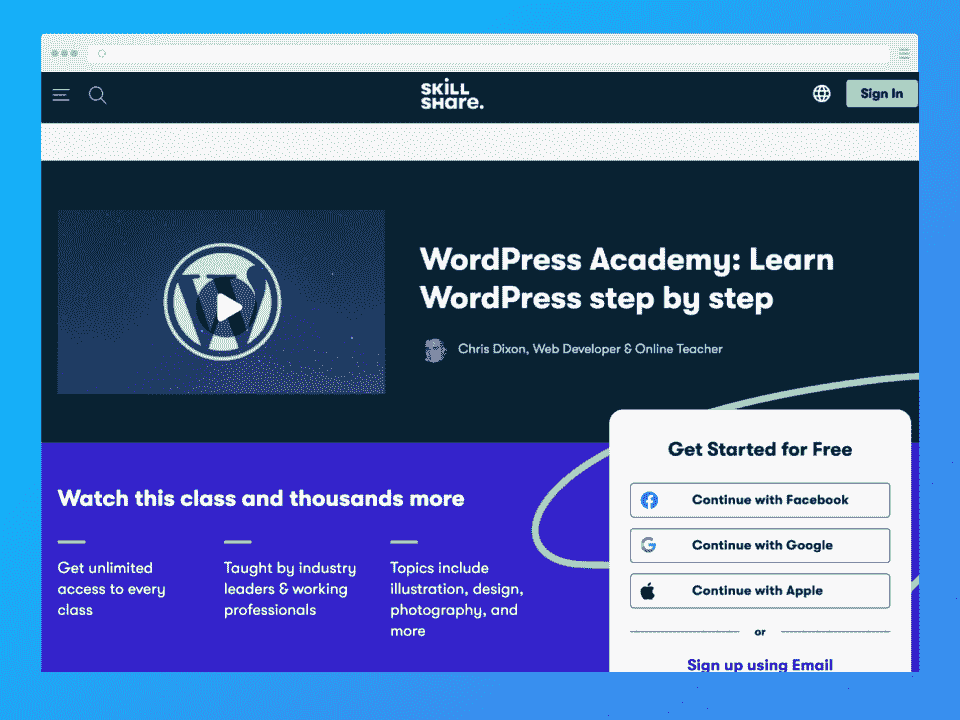**](https://skillshare.eqcm.net/BXo1Z4)

#### **关键信息**

*   在你完成课程的同时，免费获得一个月的虚拟主机服务
*   从一开始就用基于项目的方法学习 WordPress
*   对业余爱好者来说很棒，但对那些希望从事 WP 网站开发的人来说也很棒

本课程由 Chris Dixon 通过 SkillShare 为您带来。Chris Dixon 是一位经验丰富的在线教师和网络开发人员，他制作了这个课程来帮助你从最基础的地方学习掌握 WordPress 所必需的技能。本课程旨在提高趣味性和参与性，采用基于项目的方法，因此您可以边“做”边学习所有的课程都以示范的方式进行，用实际的例子告诉你该怎么做。

虽然 SkillShare 不提供证书，但你仍然可以获得大量的经验，可以在现实世界中使用。你甚至可以学习更高级的主题，比如创建电子商务网站、为搜索引擎优化你的内容、开发 WordPress 主题等等。

**时长:** 84 节课共 8h26m 的视频

**等级:**初学者

**证书:**否

**价格:**

*   免费试用 1 个月，然后每月收费 13.99 美元或每年收费 167.88 美元

**[查看课程](https://skillshare.eqcm.net/BXo1Z4)**

[**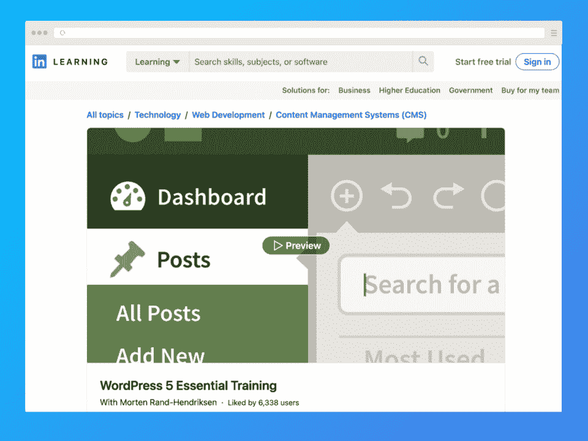**](https://linkedin-learning.pxf.io/WD30mn)

#### **关键信息**

*   相对简短，但是足够详细，可以帮助你开始创建和运行你自己的基于 WordPress 的网站
*   获得 LinkedIn 共享证书
*   大部分包括基础知识，对那些想学习 WordPress 开发的人来说不一定是最好的

Wordpress 5 基础培训是由 Morten Rand-Hendriksen 教授的 LinkedInLearning 课程，他是一位热衷于帮助学生学习 Wordpress 的教师。由于这门课程是从基础开始的，所以即使学生事先没有这方面的知识，他们也能学会。通过本课程，您可以学习如何创建功能丰富的网站和博客，如何创建页面和发布帖子等。

* *价格可能因您所在的位置/地区而异*

**持续时间:** 2 小时

**等级:**初学者

**证书:**是

**价格:**

*   课程 39.99 美元*或
*   免费试用一个月，然后每月支付 29.99 美元或
*   每月 19.99 美元，每年支付

**[查看课程](https://linkedin-learning.pxf.io/WD30mn)**

[**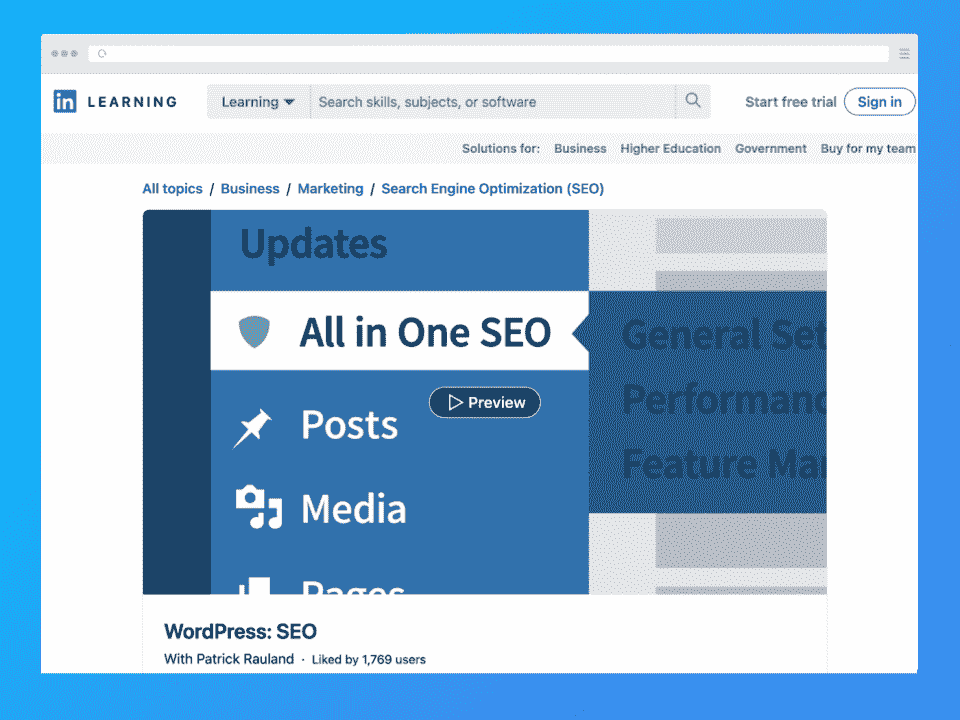**](https://linkedin-learning.pxf.io/EavWon)

#### **关键信息**

*   这不是一个学习如何使用 Wordpress 的课程，所以不要期望深入了解基础知识
*   教授搜索引擎优化的基础知识，如果你希望你的网站有更多的知名度，这是很重要的
*   学习 WordPress 的两个最好的 SEO 插件，Yoast SEO 和一体化 SEO 包
*   获得 LinkedIn 共享证书

营销经理 Patrick Rauland 创建了这个 LinkedIn 学习课程，以帮助学生从 WordPress 获得最大收益。在这个课程中，Rauland 分享了一些技巧和窍门，可以帮助你的网站驱动更多潜在的转化流量。这个课程的开始会让你经历核心的 SEO 概念和原则，比如 WordPress 内外的关键词策略。

本课程还向你展示了如何安装 SEO 插件，如一体化 SEO 包和 Yoast 的 WordPress SEO。

**持续时间:**大约一个小时

**等级:**初学者

**证书:**是

**价格:**

*   课程费用为 29.99 美元*或
*   免费试用一个月，然后每月支付 29.99 美元或
*   每月 19.99 美元，每年支付

**[查看课程](https://linkedin-learning.pxf.io/EavWon)**

[**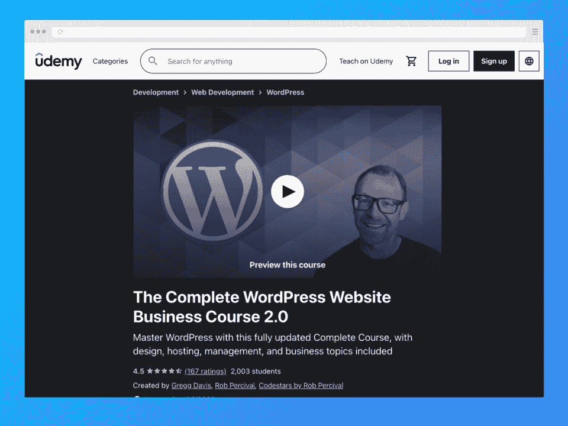**](https://click.linksynergy.com/deeplink?id=jU79Zysihs4&mid=39197&murl=https%3A%2F%2Fwww.udemy.com%2Fcourse%2Fthe-complete-wordpress-website-business-course-20%2F)

#### 关键信息

*   学习如何为自己和客户使用 WordPress，包括电子商务
*   学习建立和维护网站，故障诊断和解决问题
*   了解如何处理 Divi 和 Kadence 等主题
*   教你如何获得、管理和留住客户

尽管这是一门为那些具有初级到中级知识和技能的人开设的课程，但完整的 WordPress 网站商业课程 2.0 只需要一台带有浏览器和互联网连接的电脑。不需要编程经验。

有了这个 Udemy 课程，学生们可以学到为自己的企业(或客户)创建网站所需的一切。你可以收集一些信息，比如如何获得和留住你的客户，以及如何向他们销售网站维护和护理计划，以获得你的经常性收入。如果你也想从事电子商务，你可以在这里学习 WooCommerce。

**持续时间:**18 时 16 分

**等级:**初级到中级

**证书:**是(Udemy)

**价格:**

*   全价 84.99 美元，特价 9.99 美元
*   也可以通过 Udemy 个人计划(订阅)获得，7 天试用期后每月 29.99 美元

**[查看课程](https://click.linksynergy.com/deeplink?id=jU79Zysihs4&mid=39197&murl=https%3A%2F%2Fwww.udemy.com%2Fcourse%2Fthe-complete-wordpress-website-business-course-20%2F)**

[**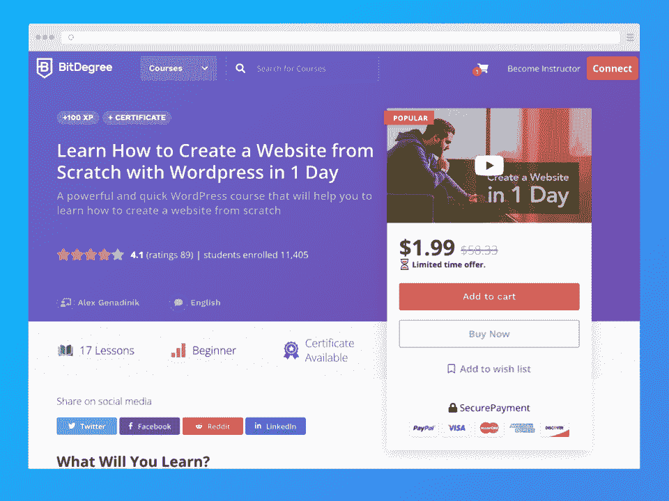**](https://www.bitdegree.org/course/how-to-create-a-website-from-scratch)

#### 关键信息

*   确保解释 WordPress 基本原理的简明易懂的格式
*   非常适合那些想了解 WordPress 但也想学习如何将他们的网站作为一个企业来运营的人
*   还包括营销和概念，如被动收入

BitDegree 提供了这门课程，可以教你创建网站所需的知识——*和*如何创建和运营自己的企业的基础知识。它涵盖了被动收入，营销，以及你如何能有一个伟大的副业，你可以自己当老板。作为一个 75 分钟的简短课程，你可以在短短的一个周末甚至一天内学会你需要的东西。

**持续时间:**75 分钟内完成 17 节简短教程

**等级:**初学者

**证书:**可用

价格: $58.33 全价，经常大减价/打折

**[查看课程](https://www.bitdegree.org/course/how-to-create-a-website-from-scratch)**

## **2023 年免费 WordPress 课程**

[**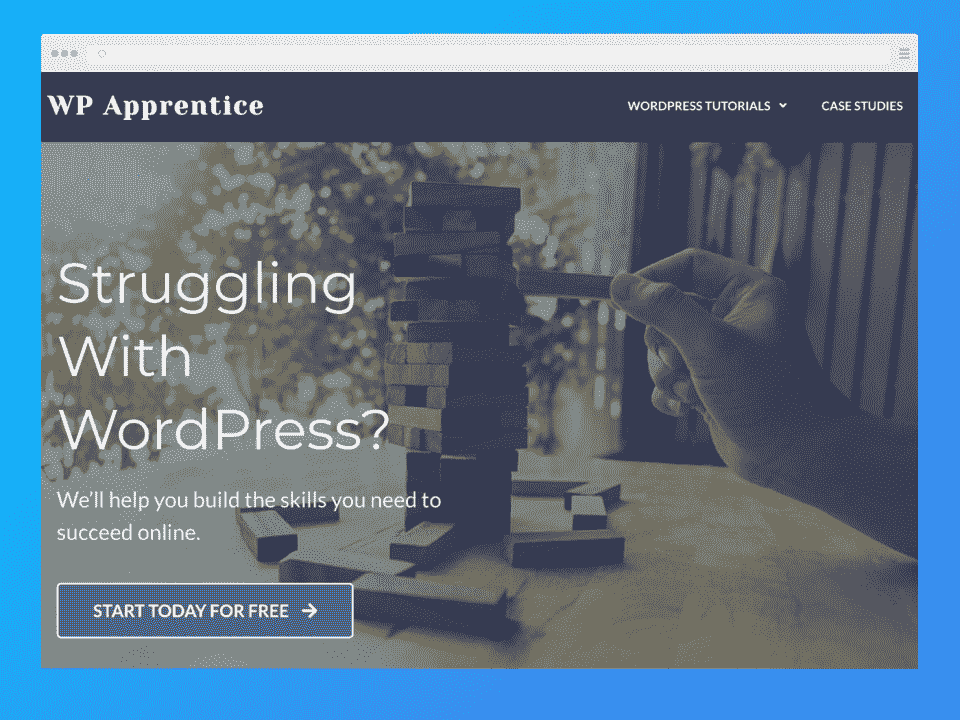**](https://wpapprentice.com/)

#### **关键信息**

*   完成本课程不需要任何编码知识
*   付费课程在 2021 年已经过时，但免费资源和教程仍然存在
*   免费培训资源提供了大量有价值的信息

WP 学徒不再更新新的内容，但创作者继续保持教程作为免费资源。过去购买过课程的人也可以继续使用。

如果你正在寻找最新的信息，这可能不是地方。然而，不管怎样，这里仍然有一些非常有用的提示。

**持续时间:**小时数小时的深度教程

**等级:**初学者

**证书:**无

**价格:**免费

**[查看课程](https://wpapprentice.com/)**

[****](https://yoast.com/academy/free-training-wordpress-for-beginners/)

#### 关键信息

*   甚至对绝对的新手来说也是极好的资源——完美地教授如何使用 WordPress
*   也教一些关于管理你的网站的知识
*   非常好，如果你也想学习一些关于搜索引擎优化你的网站

Yoast 是 WordPress，甚至是 SEO 中最大的名字之一。他们的 WordPress 的 Yoast SEO 插件是最好的插件之一。他们把这个免费资源放在一起，教你你需要知道的东西，从介绍 WordPress 一直到管理你的网站。当然，你不可能有一个由 Yoast 创建的资源里面没有关于搜索引擎优化的东西！

WordPress SEO 对于让访问者访问你的网站至关重要。有了足够的流量，你就可以提高转化率——前提是你提供有价值的价值主张。

Yoast 在这个资源中免费提供了一些最好的 WordPress 培训。所以，即使你在别处支付了课程费用，看看这个也是有益的。

如果您想访问 Yoast SEO 提供的所有学院课程以及 Yoast SEO Premium 插件，您可以支付 Premium 帐户。Yoast SEO Premium + Academy 每年费用 99 美元。

**时长:** 3 小时视频，23 次测验

**等级:**初学者

**证书:**无

**价格:**免费

**[查看课程](https://yoast.com/academy/free-training-wordpress-for-beginners/)**

[**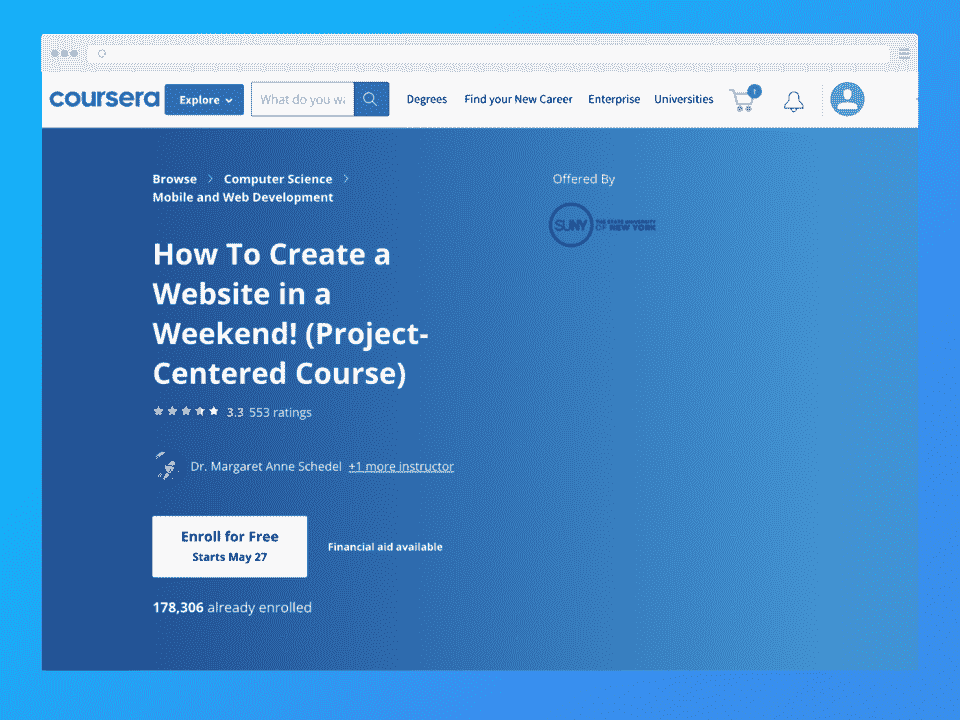**](https://imp.i384100.net/6b5Dr3)

#### **关键信息**

*   非常适合在各种平台上学习——如果您愿意，也可以在移动设备或平板电脑上学习
*   免费学习或支付少量费用获得证书
*   课程期间有论坛和同行评议可以获得实时反馈

本课程可免费旁听。这意味着你可以查看它，除了评分部分之外的所有内容，如果有的话。这个课程很短，可以让你在一个周末就全部学会，尽管你可以想学多久就学多久！

**持续时间:** 22 小时

**等级:**初学者

证书:不，除非你支付课程费用

**价格:**证书免费*或 29 美元

**免费访问仅允许您审核课程，不允许您访问评分部分*

**[查看课程](https://imp.i384100.net/6b5Dr3)**

[**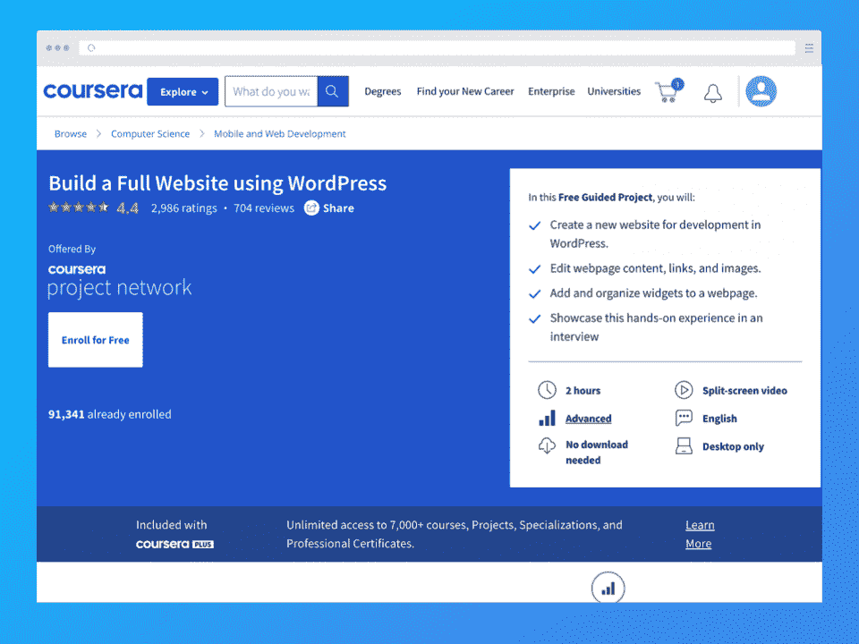**](https://imp.i384100.net/OR3W2G)

#### **关键信息**

*   2 小时循序渐进的指导学习
*   了解如何使用主题和插件
*   学习保持网站用户友好的原则

Coursera 上的这个指导项目估计只需要你两个小时的时间。分屏式的学习方式，更容易拿起你需要的知识。由于你边工作边做，引导式项目很适合以实用的方式学习。然而，由于这个项目特别先进，在尝试这个项目之前，你可能想从另一个课程中学习基础知识。

目前，Coursera 表示该课程最适合北美地区的人。如果你住在该地区以外，你可以试试，尽管 Coursera 目前也在努力改善其他地区的体验。

**持续时间:** 2 小时

**等级:**高级

**证书:**无

**价格:**免费

**[查看课程](https://imp.i384100.net/OR3W2G)**

[**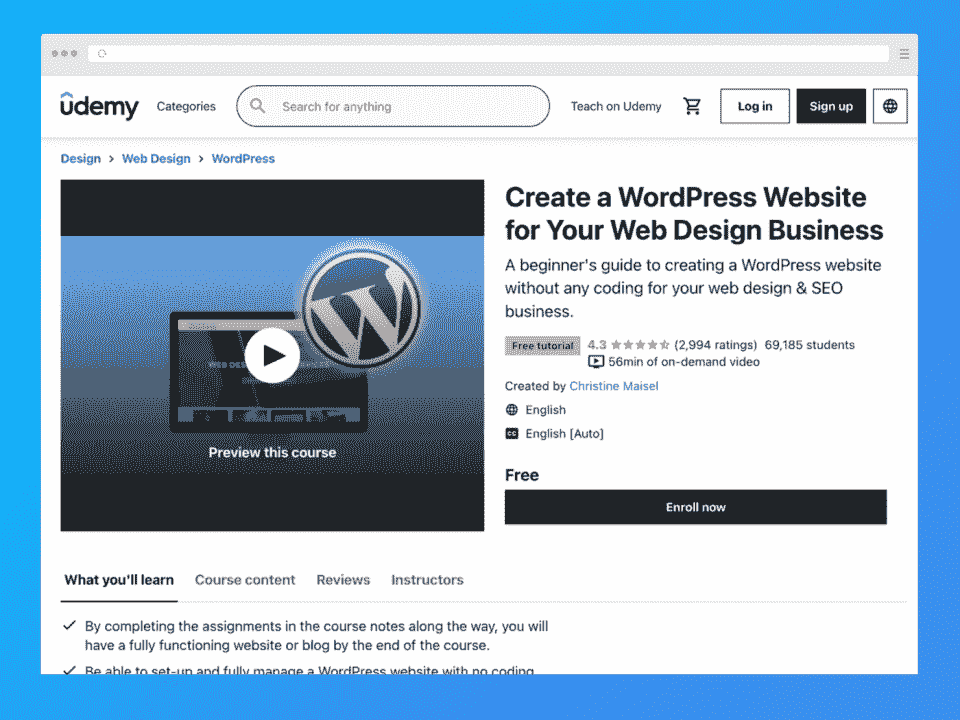**](https://click.linksynergy.com/deeplink?id=jU79Zysihs4&mid=39197&murl=https%3A%2F%2Fwww.udemy.com%2Fcourse%2Fcreate-wordpress-website-for-your-web-design-business%2F)

#### 关键信息

*   学习如何不用任何编码就建立一个 WordPress 站点
*   了解 WordPress 及其主要特性
*   为您未来的业务学习

虽然很短，这个一小时三十六分钟的课程包含了足够的知识来教你一两件事。为你的网页设计公司创建一个 WordPress 网站确实如其名——它教你如何创建自己的网站，而无需知道如何编码。课程创建者 Christine Maisel 确保她的 WordPress 在线课程对新手来说易于理解。

因为这个课程是免费提供的，所以当你完成时，你不会获得证书。然而，你*所做的*最终得到的是你的网站，准备启动！你一步一步地学习所有这些，所以没有必要担心跟不上。

**时长:** 1 小时 36 分钟

**等级:**初学者

**证书:**否(并非所有免费课程都附带证书)

**价格:**免费

**[查看课程](https://click.linksynergy.com/deeplink?id=jU79Zysihs4&mid=39197&murl=https%3A%2F%2Fwww.udemy.com%2Fcourse%2Fcreate-wordpress-website-for-your-web-design-business%2F)**

## **结论**

这个最好的 WordPress 课程列表只包括数百门课程中的一部分，可以帮助你学习如何使用 CMS。不管你选择哪门课程，或者即使你决定自己学习，学习 WordPress 是一个很大的进步。祝你好运！

## **常见问题解答**

#### **1。学习 WordPress 最好的地方是哪里？**

了解几乎任何东西的好地方是 Udemy。Udemy 是一个学习的平台——或者如果你有有价值的东西可以分享的话，也是一个教学的平台。作为一个提供无数课程的在线平台，Udemy 允许你按照自己的进度学习 WordPress 课程，并在完成后获得证书。最精彩的部分？Udemy 经常举行促销活动，所以你可以以很大的折扣购买课程。你还可以终身使用你购买的所有课程。

**在大多数情况下，除非你参加的是不提供证书的免费课程*

#### **2。WordPress 需要编码吗？**

不一定！许多 WordPress web 设计者和开发者为他们的客户创建了漂亮而实用的网站，却从来没有写过一行代码。有许多拖放构建器，如 Beaver Builder、Elementor、Divi 等等。除非你想创建你自己的 WordPress 主题，否则你不应该真的需要编码任何东西(除非你把偶尔的文本格式化计算在内)。

#### **3。WordPress 最好的教程是什么？**

你对最好的 WordPress 教程的选择就是——你的选择。适合你的课程取决于你的需求和你想学什么(以及为什么)。然而，有一些非常棒的课程，有些甚至是免费的。例如，你可以查看 Yoast SEO 资源，那里有大量有用的 WordPress 教程。

#### **4。学习 WordPress 开发最好的方法是什么？**

这个问题的答案取决于你的喜好和学习方式。如果你有上进心，并且不介意一个接一个地寻找资源和指导，你可以自己学习。然而，如果你没有耐心或时间自己做所有的事情，你可以从 WordPress 培训课程中学习，这些课程以线性的、一步一步的方式为你提供一切。

#### **5。学习 WordPress 有多难？**

如果你正在学习 WordPress，这样你就可以创建和管理你自己的网站，这很容易。您可以在几个小时内启动并运行！然而，如果你想更深入地开发 WordPress(比如创建你自己的主题)，这可能会更有挑战性，因为你还需要知道如何编码。

#### **6。WordPress 像 Wix 吗？**

不一定。Wix 是一个设计驱动的拖放式网站构建器，它也为您的网站提供托管服务。如果你想删除网站上的广告并添加自己的域名，你必须付费。WordPress(。另一方面，org)是一个内容管理系统，你可以在任何网站上使用，在 T2 的任何网站主机或平台上使用。您可以使用预先存在的主题或编写自己的代码。或者，如果你想使用拖放式可视化编辑器，你可以使用 WordPress 众多拖放构建器中的一个。

#### 7 .**。Udemy 上最好的 WordPress 课程是什么？**

Udemy 上有太多的 WordPress 课程，我无法把它缩小到一个。然而，这个列表上的一些课程是值得考虑的。例如，如果你想要一个免费的课程，你可以尝试“为你的网页设计业务创建一个 WordPress 网站”如果你想要一个完整的(付费)课程，试试“ [WordPress for 初学者:创建你自己的 WordPress 网站](https://click.linksynergy.com/deeplink?id=jU79Zysihs4&mid=39197&murl=https%3A%2F%2Fwww.udemy.com%2Fwordpress-for-beginners-course%2F&u1=tutorials%2Flearn-wordpress_amcid-oZQ6xqFJUbxAYxxqQZANr)”

#### **8。SkillShare 上最好的 WordPress 课程是什么？**

WordPress 学院:逐步学习 WordPress 是由课程提供商 Skillshare 提供的初级到中级的 WordPress 认证课程。WordPress 学院课程从针对初学者的基础开始。但是，随着课程的进展，它进入了更高级的主题，如 PHP 基础知识，WordPress multisite 等。

[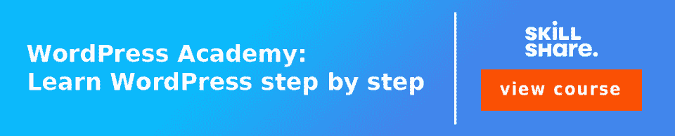](https://skillshare.eqcm.net/qnXLkj)

**人也在读:**