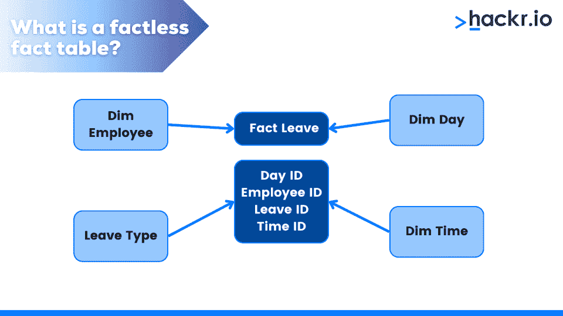
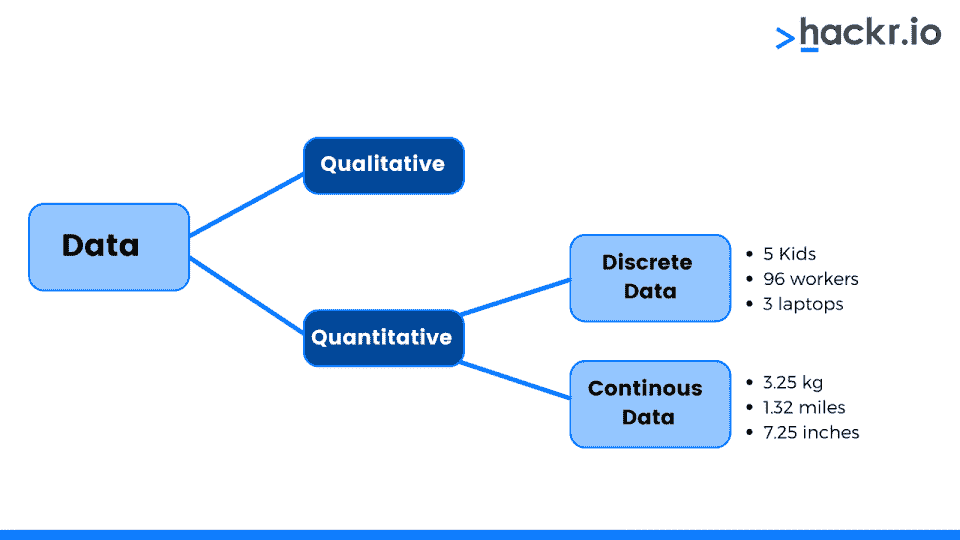
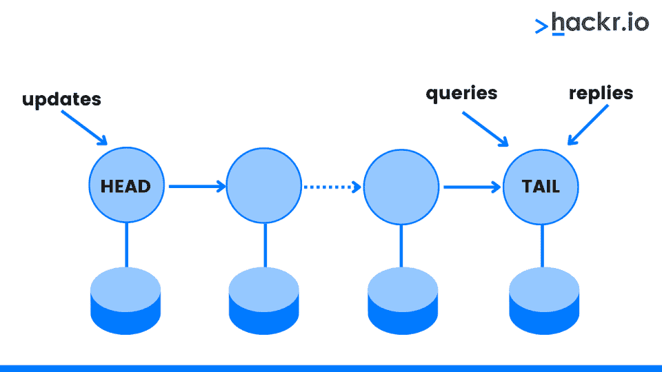

# 50 大数据建模面试问答【2023】

> 原文：<https://hackr.io/blog/data-modeling-interview-questions>

数据建模使用符号和语言来表示数据，为软件系统及其数据片段创建了一个清晰、直观的图像。从事数据建模工作的程序员与其他 IT 专业人员(如数据科学家和管理员)协作，对复杂数据进行建模。这些模型在组织的决策过程中起着至关重要的作用。

但是那些专业人士是怎么开始职业生涯的呢？一切都从准备[数据建模](https://hackr.io/blog/what-is-data-modeling)的面试问题开始。

如果你打算从事数据建模职业，你的第一步是搞定面试。我们将向您介绍常见的数据建模面试问题，供您回顾和练习！

## **针对初学者、有经验者和高级角色的数据建模面试问题和答案**

并非所有的[数据建模角色](https://hbr.org/2018/08/what-data-scientists-really-do-according-to-35-data-scientists)都有相同的期望。我们将按难度对数据建模师面试问题列表进行细分:初级、中级和高级。

#### **1。你如何定义数据建模？**

数据建模使用文本和符号表示数据流的方向，直观地表示复杂软件系统的设计和数据。

#### **2。描述事实和事实表。**

事实是数字数据的表示。例如，到期净额。事实表包括维度表中的外键和数字数据。

#### **3。列出各种数据建模设计模式。**

三种主要类型的设计模式如下:

*   星形模式
*   雪花模式
*   星系模式

#### **4。什么时候应该考虑反规范化？**

当您的表非常复杂时，您应该考虑反规范化。这将帮助您构建数据仓库。

#### **5。什么是无事实事实表？**

****

如果事实表只包含关键值而没有可测量的事实，那么它就是无事实的。

#### **6。定义术语属性和维度。**

维度代表定性数据。您经常会在维度表中看到文本和描述性特征。

#### **7。什么是内存分析？**

内存数据分析是一种完全消除较慢的磁盘访问的情况，因此您可以从主内存访问所有要处理的数据。

#### **8。什么是数据稀疏？**

数据稀疏是大量零值和少量非零值的数据集合。

#### **9。什么是复合主键？**

复合主键是充当表主键的列的集合。

#### 10。主键是什么？

主键是每个表行唯一的一列或一组列。主键值不能为空或 NULL。每个表至少有一个主键。

#### **11。什么是数据库中的表？**

数据保存在行和列中，并组织成表格。列通常称为字段，显示垂直对齐的数据。数据的水平对齐由行表示，通常称为记录或元组。

#### **12。什么是数据集市？**

数据集市就像是数据仓库的简化形式。

#### 13。事实表有哪些不同的类型？

以下是不同类型的事实表:

*   **加法**:可以集成到任意维度的度量
*   **非累加**:不能加到任何其他维度的度量
*   **半可加:**测度只能集成到几个维度中

#### **14。什么是聚合表？**

一个聚合表包含了你可以用求和、平均、最大值等函数计算的数据。

#### 15。什么是 OLTP？

在线事务处理(简称 OLTP)提供了三层面向事务的应用程序。OLTP 管理公司或组织的日常运营。

#### 16。定义检查约束。

check 约束用于确认列的值范围。

#### **17。序列聚类的算法是什么？**

用于序列聚类的算法收集具有事件的连接的或相似的路径和数据序列。

#### 18。什么是连续数据和离散数据？

****

离散数据是一种特定的或有限的数据类型。连续数据以一种有组织的方式不断变化。

#### **19。什么是时间序列算法？**

时间序列算法是一种预测连续数据值的技术。

#### 20。你对位图索引有什么理解？

位图索引是一种唯一的数据库索引，它使用位图(位数组)来处理按位操作和响应查询。

#### **21。什么是数据挖掘？**

数据挖掘是一种实践，它分析巨大的数据集，以发现超越简单分析的模式和趋势。程序员使用数据挖掘来:

*   管理风险
*   检测欺诈行为
*   制定网络安全战略

#### **22。什么是自递归关系？**

递归关系是表的主键和单独的列之间的连接。

#### **23。描述关系数据建模**

关系数据建模是以规范化的表格形式表示对象。

#### **24。什么是预测建模分析？**

预测建模分析是对用于预测结果的模型进行测试或验证的过程。你可以将它应用于统计学、人工智能和机器学习。

#### **25。有哪些类型的约束？**

某些类型的约束包括唯一值、空值、外键、组合键、检查约束和其他变体。

一个[数据建模工具](https://hackr.io/blog/best-data-modeling-tools)是一个帮助你创建数据结构的软件程序。这些工具包括 Altova DatabaseSpy、Casewise、Case Studio 2、Borland Together 等。

#### **27。描述分层数据库管理系统。**

DBMS 是一种分层数据库，其中数据以树状模式排列和存储。分层结构用于存储数据。通过父子关系，您可以使用 DBMS 来可视化数据。尽管层次 DBMS 中的父级可能有许多子级，但每个子级只有一个父级。

#### **28。什么是网络模型？**

网络模型具有层次结构。它有许多记录，因为它允许多个关系来链接记录。使用这个模型，您可以创建一组父记录和子记录。此外，您可以执行复杂的表关联，因为每个记录都可以是多个集合的成员。

#### **29。哈希是什么？**

一种搜索每个索引值并获得所需数据的方法是散列法。您可以使用此方法来确定数据点的精确磁盘位置，而无需使用索引的结构。

#### 三十岁。什么是自然键或商业键？

业务或自然关键字是专门标识实体的字段，如客户 ID、员工 ID、电子邮件等。

#### 31。什么是组合键？

复合键由许多字段表示，在下列情况下使用

#### 32。DBMS 的第四范式是什么意思？

第四范式只允许对非候选值的键依赖。

#### 33。什么是数据库管理系统？

一个叫做数据库管理系统(DBMS)的程序存储和检索用户数据。它由许多改变数据库的程序组成。

#### 34。什么是正常化？

规范化是一种数据库设计方法，它排列表以减少数据依赖性和冗余。它将大表分解成较小的表，并使用关系将它们连接起来。

#### 35。数据建模有什么好处？

以下是数据建模的一些好处:

*   帮助内部和外部企业沟通
*   支持 ETL 过程的数据映射文档
*   确定合适的数据源来填充模型

### **面向资深专业人士的高级数据建模面试问题**

#### 36。XMLA 是什么？

在线分析处理使用 XML 分析工具 XMLA 作为获取数据的标准( [OLAP](https://hackr.io/blog/olap-vs-oltp) )。

#### 37。描述垃圾维度

垃圾维度有助于垃圾数据存储。当您不能在模式中正确存储数据时，我们使用它。

#### 38。解释链式数据复制。

****

链式数据复制是指辅助节点使用 ping 时间或在辅助节点最近时选择目的地的情况。

#### 39。解释虚拟数据仓库。

虚拟数据仓库提供了完整数据的视角，但不包括历史数据。此外，虚拟数据仓库是包含元数据的逻辑数据模型。

#### 40。描述数据仓库快照。

快照是数据提取过程开始时的整个数据可视化。

双向提取是系统在两个方向提取、净化和传输数据的能力。

#### **42。提供一个流行的数据库管理系统软件列表。**

流行的 DBMS 软件包括:

*   关系型数据库
*   Microsoft Access
*   神谕
*   一种数据库系统

#### **43。列出所有类型的基本关系。**

不同类型的主要基本关系包括:

*   多对一关系
*   多对多关系
*   一对一的关系
*   一对多关系

#### **44。什么是 PDAP？**

PDAP 是一个以汇总形式保存信息的数据立方体。它能够为用户提供快速的数据分析和报告。

#### **45。什么是正向数据工程？**

正向数据工程描述了逻辑模型到物理工具的自动转换。

#### **46。什么是数据仓库？**

数据仓库是一个集成的、非易失的、时变的、面向主题的数据库，用来提供分析而不是事务(Inmon)。Dan Lindstedt 的数据库是它的主要模型。这种组合提供了最佳的数据仓库架构。

#### **47。什么是数据库基数？**

在数据库术语中，“基数”通常指数据中值的出现频率。

#### **48。什么是外键？**

外键引用表的另一个集合中的行或文档。

#### **49。第五范式要满足什么条件？**

在无损分解中，一个表不能有任何更小的表被认为是第五范式。

#### 50。什么是 RDBMS？

关系数据库管理系统或 RDBMS 是由关系数据库组成的软件系统，它将数据存储在表中。列和行都被称为元组。例如，Microsoft SQL server 就是一个 RDBMS。

## **奖励提示**

准备好面试了吗？用这些有用的提示完成你的准备工作:

除此之外，您可以遵循一些额外的提示来赢得数据建模师面试:

*   **将你的知识**应用到实践中，为基于场景的数据建模面试问题做好准备。
*   **做笔记**记录最难的维度建模面试问题。更详细地研究那个问题。
*   在你的**简历**中提及你所有的中级和专家级技能。
*   **分享你在相关项目上的经验**，即使是通过课程练习或训练营作业。
*   **与朋友进行模拟面试**，或者对着镜子练习背诵数据建模问题的答案。

## **结论**

在面试前的一周内，每天复习这些数据建模面试问题——我们有预感你会通过的！如果您正在寻找更多关于在数据结构化领域获得职业发展的技巧？

## **常见问题解答**

#### **1。数据建模的三种类型是什么？**

数据建模有三种形式:概念的、逻辑的和物理的。

#### **2。什么是 SQL 中的数据建模？**

SQL 中的数据建模是通过简单的可视化描述复杂软件系统设计的方法，利用文本和符号来表示数据流的方向。

#### **3。数据建模的例子有哪些？**

示例包括为购物应用程序、图书馆系统或酒店预订系统创建 ER 图。

**人也在读:**