# 初学者和高级数据科学家的 10 本最佳数据科学书籍[更新]

> 原文：<https://hackr.io/blog/data-science-books>

除了数据科学是迄今为止收入最高和最受欢迎的领域之一这一事实之外，还需要注意的是，在未来十年或更长时间内，它将继续更具创新性和挑战性。会有足够多的数据科学工作可以给你带来丰厚的薪水和发展机会。

也就是说，没有什么比阅读数据科学书籍更好的方法了。

通过书籍学习数据科学将有助于您全面了解数据科学，因为数据科学不仅仅涉及计算，还包括数学、概率、统计、编程、机器学习等等。

## 数据科学书籍

这里有一些最好的书籍，你可以阅读，以更好地理解数据科学的概念

[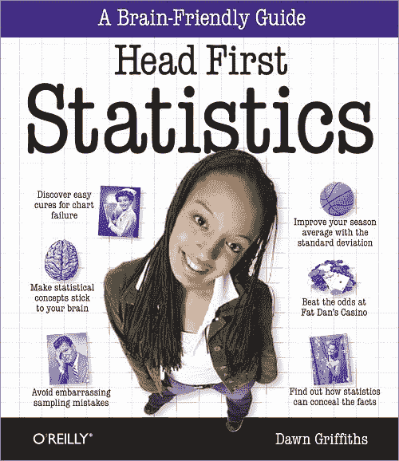](https://geni.us/EX6eEtN)

就像 Headfirst 的其他书籍一样，这本书的基调是友好和对话式的，是数据科学的最佳入门书籍。这本书涵盖了大量的统计数据，从描述性统计开始——均值、中值、众数、标准差——然后是概率和推断统计，如相关性、回归等。如果你是一名在校的科学或商业学生，你可能已经学习了所有这些，这本书是一个很好的开始，以详细的方式刷新你已经学习的一切。边上有很多图片和图形，很容易记住。你可以找到一些好的现实生活中的例子，让你迷上这本书。总的来说，这是一本开始数据科学之旅的好书。

你可以在这里买到这本书。

[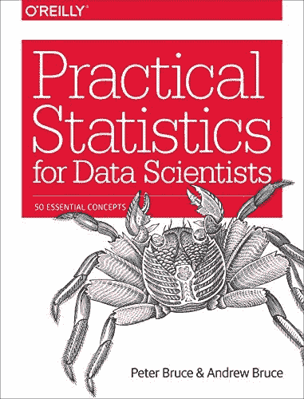](https://geni.us/MRyPky)

如果你是一个初学者，这本书会给你一个很好的概述，你需要学习掌握数据科学的所有概念。这本书不太详细，但提供了关于所有高级概念的足够好的信息，如随机化、抽样、分布、样本偏差等。这些概念中的每一个都得到了很好的解释，并且有例子以及这些概念如何与数据科学相关的解释。这本书还通过对 ML 模型的调查让人们大吃一惊。

这本书涵盖了数据科学所需的所有主题。这是一个快速和容易的参考，但是，不足以深入掌握概念，因为解释和例子并不详细。

你可以在这里买到这本书。

[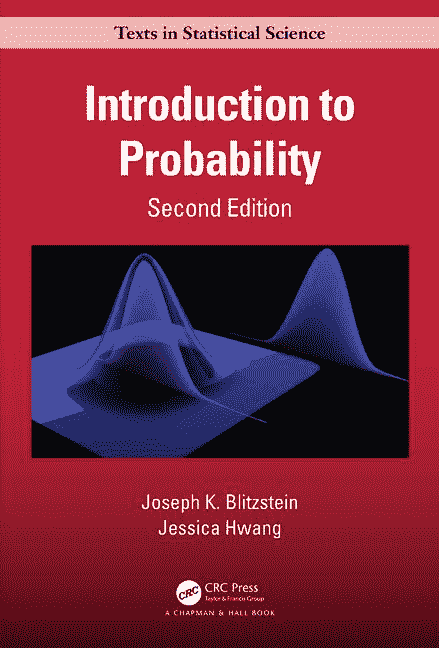](https://geni.us/IQk2vd)

如果你在学校学的是数学，你可能记得计算从一副牌中得到一张黑桃或红桃的概率等等。

这可能是学习概率的最好的书。这些解释非常简洁，类似于现实生活中的问题。如果你在学校学过概率，这本书是加深你的基本概念知识的必备书籍。如果你是第一次学习概率——这本书可以帮助你在核心概念上建立一个坚实的基础，尽管你需要花更长的时间来学习这本书。

这本书已经成为 50 年来最受欢迎的书籍之一，这也是它绝对应该放在你书架上的另一个原因。

你可以在这里买到这本书。

这是一本可以让你开始 Python 的 ML 之旅的书。这些概念的解释就像对一个门外汉，并有足够的例子来更好地理解。语气友好，容易理解。ML 是一个相当复杂的主题，然而，在按照这本书练习之后，你应该能够构建你自己的 ML 模型。你会很好地掌握 ML 概念。这本书有 Python 的例子，但是你不需要任何数学或编程语言的知识来阅读这本书。

这本书是为初学者而写的，详细介绍了基本主题。然而，随着你对 ML 和编码越来越深入，仅仅阅读这本书是不够的。

你可以在这里买到这本书。

[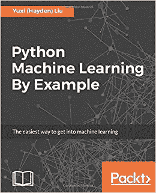](https://geni.us/FU7P)

顾名思义，这本书是最容易进入机器学习的。这本书以一种详细而有趣的方式让你开始学习 Python 和机器学习，其中有一些经典的例子，如使用贝叶斯的垃圾邮件检测和使用回归和基于树的算法的预测。作者分享了他在广告优化，转换率预测，点击欺诈检测等多领域的经验。这完美地增加了阅读体验。

尽管这本书涵盖了 Python 的基础知识，但您可能希望在获得一些 Python 基础知识之后再开始阅读这本书。这本书将帮助你建立所需的软件，直到模型的创建、更新和监控。总的来说，这是一本适合初学者和高级用户的好书。

你可以在这里买到这本书。

[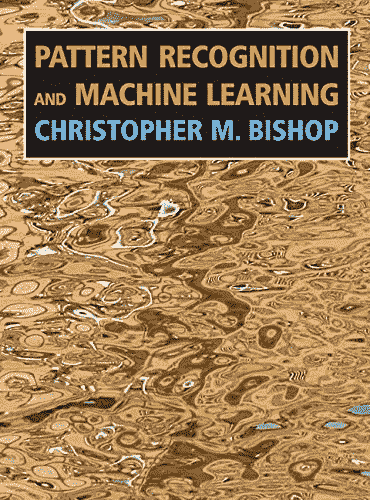](https://geni.us/yaTHE)

这本书适合所有年龄段的人，无论你是本科生、研究生还是高级研究员，都有适合每个人的东西。如果你订阅了 Kindle，这本书不会花你一分钱。获得国际版，有丰富多彩的图片和图表，使您的阅读体验完全值得。

说到内容，这是一本从里到外涵盖机器学习的书。它是彻底的，并且以简单的方式用例子解释概念。很少有读者会觉得一些术语很难理解，但是你应该能够通过使用其他免费资源，如网络文章或视频来理解。如果你认真对待机器学习，这本书是必不可少的，特别是数学(数据分析)部分本质上是详尽的。

虽然你可以用这本书来自学，但和一些机器学习课程一起阅读会是一个更好的主意。

你可以在这里买到这本书。

[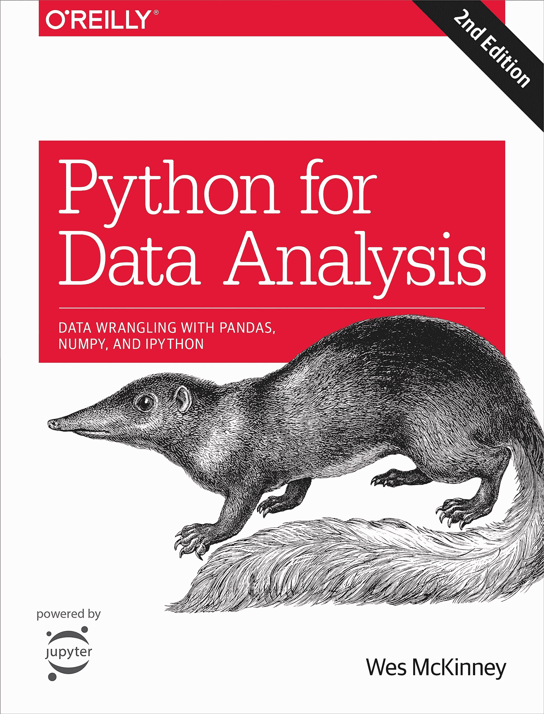](https://geni.us/9Sv8)

名副其实，这本书涵盖了所有可能的数据分析方法。对于初学者来说，这是一个很好的开始，在继续学习 Python 在数据分析和统计中的作用之前，它涵盖了 Python 的基础知识。这本书节奏很快，用超级简单的方式解释了一切。你可以在读完这本书的一周内构建一些真正的应用程序。这本书也可以给你一个指导方针，或者作为你搜索在线课程时迷失的主题的参考。

随着 Python 和数据科学的集中学习，这本书给你一个公平的想法，当你真正开始工作时，你可以期待成为一名数据分析师或数据科学家。作者还在书中给出了许多参考资料，并指出了一些你会喜欢阅读的有用资源。总的来说，这是一本组织良好的书，对数据分析概念有透彻的解释。

你可以在这里买到这本书。

[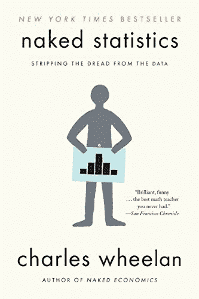](https://geni.us/5hL5)

这本书展现了统计学的美，使统计学变得生动起来。语气诙谐而对话。读这本书你不会感到无聊，也不会感到数学的沉重！作者用现实生活中的例子解释了统计学的所有概念——基础的和高级的。这本书从非常基本的东西开始，如正态分布，中心定理，然后到复杂的现实生活问题和相关的数据分析和机器学习。

虽然这本书很好地解释了基础知识，但最好对这些课程有一些统计学[的先验知识，这样你就可以快速地理解这本书。](https://hackr.io/tutorials/learn-data-science?sub_topics%5b%5d=346?ref=blog-post)

你可以在这里买到这本书。

[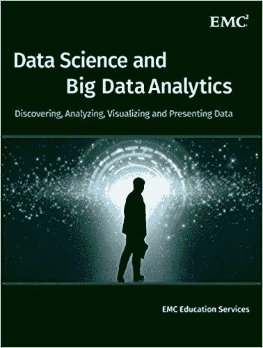](https://geni.us/DmZa)

这本书温和地介绍了大数据以及它在当今数字化竞争的世界中的重要性。整个数据分析生命周期通过案例研究和吸引人的视觉效果进行了详细解释，以便您可以看到整个系统的实际工作情况。这本书的结构和流程非常好，组织得很好。你可以很容易地理解分析是如何完成的，因为每一步就像书中的一章。这本书包括聚类，回归，关联规则和更多的简单，日常生活中的例子，你可以联系起来。还向读者介绍了使用 MapReduce、Hadoop 和 SQL 的高级分析。

如果你打算和 R 一起学习[数据科学，这本书正适合你。](https://hackr.io/blog/r-for-data-science)

你可以在这里买到这本书。

[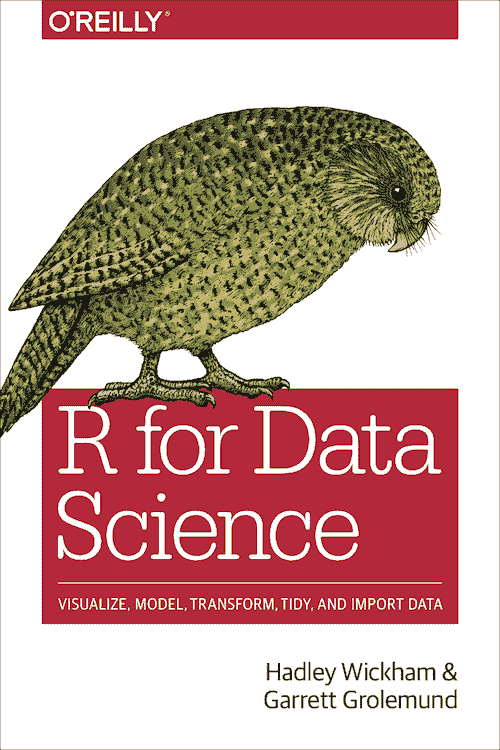](https://geni.us/4IV40)

另一本适合想用 R 学习[数据科学的初学者的书。R with data science 不仅解释了统计学的概念，还解释了您在现实生活中会看到的数据类型，以及如何使用中值、平均值、标准差等概念对其进行转换。以及如何绘制数据、过滤和清理数据。这本书将帮助你理解真实数据是多么的杂乱和原始，以及它是如何被处理的。数据转换是最耗时的任务之一，本书将帮助您获得大量关于转换数据进行处理的不同方法的知识，以便从中获得有意义的见解。如果你想在开始阅读这本书之前学习 R，你可以通过简单的](https://hackr.io/blog/r-for-data-science)[在线课程](https://hackr.io/tutorials/learn-r?ref=blog-post)来做到这一点，然而，这本书已经涵盖了足够的基础知识，所以你可以马上开始。

你可以在这里买到这本书。

## 额外的数据科学书籍

这里我们列出了几本你可能感兴趣的好书:

[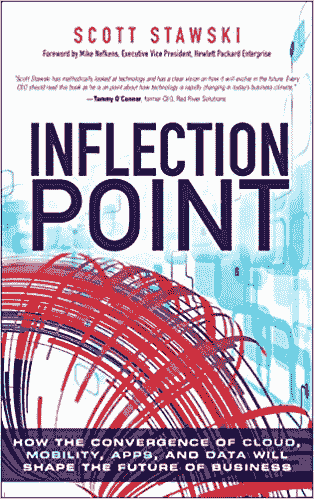](https://geni.us/uJOjH2k)

这不是一本技术书。但是，既然您已经决定进入数据科学职业道路，那么就有必要了解为什么数据科学和大数据在今天占据如此重要的位置。这本书是从商业角度撰写的，提供了许多关于云、大数据、IT、移动性、基础设施等所有技术如何改变当今企业工作方式的见解，并提供了有趣的故事和个人经历来分享。变化的时代和我们应该如何应对它在这本书里描述得很好。

这是一本很好的读物，会让你在数据科学学习之旅中保持动力。

你可以在这里买到这本书。

[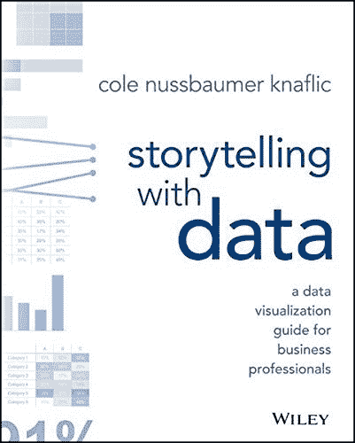](https://geni.us/wibL)

任何以故事和图片形式讲述的东西都很容易进入我们的脑海，并永久地留在那里。这本书很有影响力，它讲述了数据可视化的基本概念，帮助你理解如何充分利用现实世界中的大量数据。作者解释每一个概念的方式都是独一无二的，因为他是以引人入胜的故事形式讲述的。你甚至不会意识到你在一天的阅读中能掌握多少概念——了解背景和读者，在正确的情况下使用正确的图表，识别并去除混乱以获得重要的信息，利用数据中最重要的部分并将它们呈现给用户——所有这些以及更多。

你可以在这里买到这本书。

[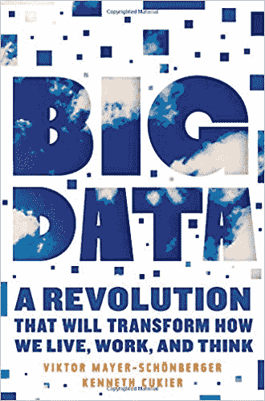](https://geni.us/f7BTw)

这是一本必备的书，是你的大数据、数据科学和人工智能之旅的入门书。这不是一本技术书，但它将让你全面了解大数据是如何被捕获、转换和处理成销售和利润的，即使像我们这样的用户对此一无所知。它解释了公司如何使用我们的数据，以及我们在互联网上分享的信息如何用于创造新的业务创新和解决方案，使我们的生活更加轻松，并将我们所有人联系在一起。它还讨论了这样做的风险和影响，以及如何采取安全措施来避免数据被破坏或滥用。最后有技术论文，挺有帮助的。对每个人来说都是一本好的、简单的读物。

你可以在这里买到这本书。

[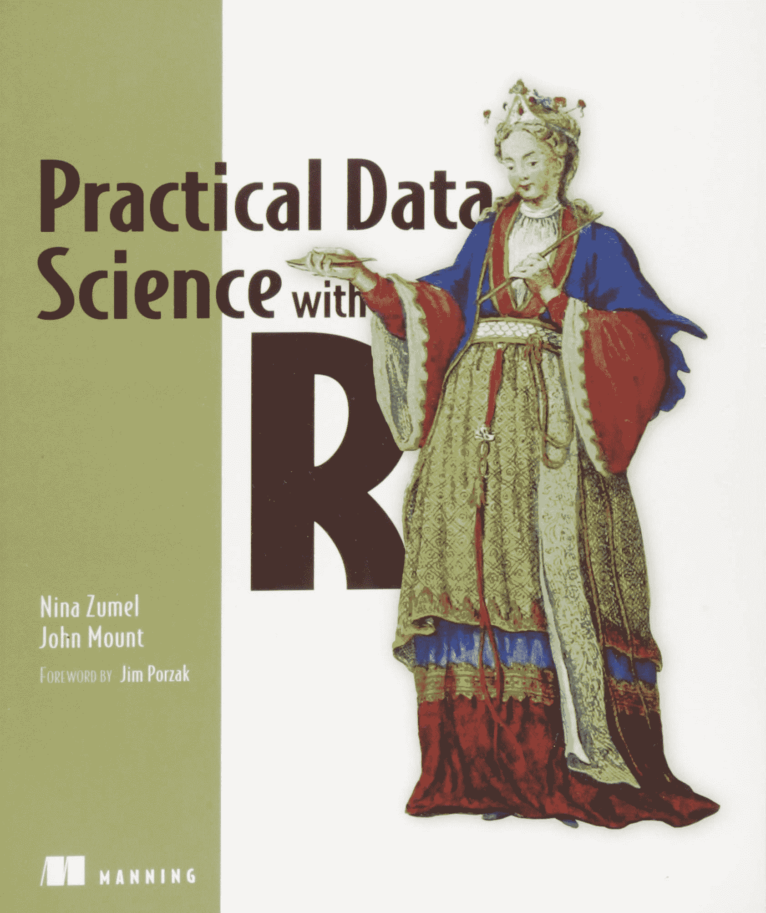](https://geni.us/zuEcC3z)

这是一本中等水平的书，很好地平衡了基本原理和高级数据科学原理。对商业需求的强烈关注使得这本书非常实用和有趣。它还彻底解释了统计学，这是数据科学的基础之一。大多数书只是解释事情是如何做的——这本书解释了如何做以及为什么！这有助于激励读者进入深度学习和机器学习。这是一本适合初学者和高级数据科学家的好书。随着话题的深入，这变得越来越难，但是你可以很容易地理解书中的大部分内容。

你可以在这里买到这本书。

[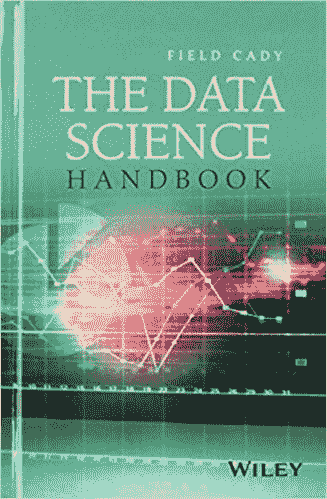](https://geni.us/kaosdh)

这是一本高级书。如果你通过其他书籍或教程对统计学和数据科学有一点了解，你就能体会到书中的内容。这不是一本纯粹的技术书籍，而是一个快速参考，因为它包含了来自各种领先的数据科学家的问答形式的信息。问题以有组织的方式进行，帮助您了解数据科学的各个方面，如数据准备、大数据的重要性、自动化流程以及数据科学如何成为数字世界的未来。虽然这本书缺乏真实的案例研究，但是，如果你有商业思维，你会从著名的数据科学家那里了解到很多策略和技巧。

你可以在这里买到这本书。

[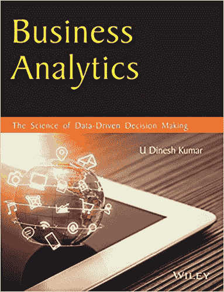](https://geni.us/7W1wGH)

这是一本令人敬畏的深入的书，解释了理论以及实际应用，以提供有益健康的知识。作者以微妙的方式处理主题，并提供了许多易于理解、领会和遵循的案例研究。这本书涵盖了经济学、统计学、金融学以及开始学习数据科学所需的一切。这本书是用大量的努力和经验写成的，洞见的呈现方式也显示了这一点。它包括统计和分析工具、机器学习技术，并很好地融合了基本和高级概念。在这本书的结尾，你还会学到学术模型和六西格玛。

你可以在这里买到这本书。

[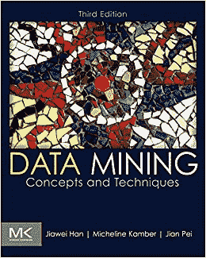](https://geni.us/cPxl3OX)

一本从零开始解释数据挖掘的精彩书籍。以至于你不需要成为计算机科学毕业生也能理解这本书。它从解释数字时代和数据挖掘开始，然后解释可以挖掘的数据类型和可以挖掘的模式，例如，聚类分析、预测分析、相关性等。，以及使用的技术–统计、机器学习和数据库。这本书纯粹是技术性的，你可以一步一步来充分享受这本书。这本书很详细，是你收藏的必备书籍。

它有许多基本的和先进的分类、聚类分析技术，还谈到了数据挖掘领域的趋势和正在进行的研究。

你可以在这里买到这本书。

[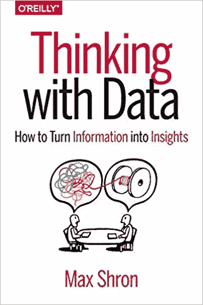](https://geni.us/BTc3)

这是一本可以和其他阅读材料、网络课程一起阅读的小书。它提供了许多有用的见解，并使读者能够进行批判性的商业思考。它帮助你理解为什么事情会以现在的方式发生。通过这些章节，你将学会如何提出好的有意义的问题，记下一个想法的重要细节，并获得重点关注的关键信息。它很好地涵盖了特定于数据的推理模式。这本书将帮助你思考“为什么”，而不仅仅是“如何”。它涵盖了所谓的会议——背景、需求、愿景和结果。

你可以在这里买到这本书。

[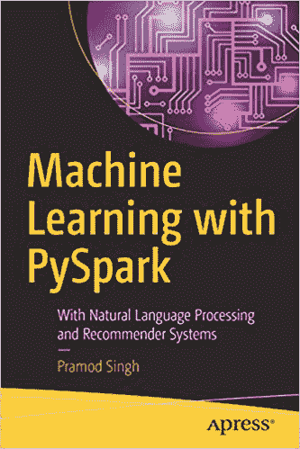](https://geni.us/H0len)

该书详细介绍了机器学习模型、NLP(自然语言处理)应用和使用 PySpark 的推荐系统。它帮助您了解现实世界中的业务挑战并解决它们。它涵盖了线性回归，决策树，逻辑回归和其他监督学习技术。这本书将极大地丰富你的知识，尤其是如果你不只是阅读它，而是与书和实践。您还将能够欣赏 PySpark 丰富的库，这些库非常适合机器学习和数据分析。一本学习使用 Spark 的推荐系统的好书——简洁明了。

你可以在这里买到这本书。

[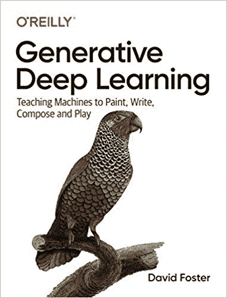](https://geni.us/YfKzc)

这本书就像任何其他的小说一样，让你着迷到最后一页。如果你读过《哈利·波特》，你就会知道我们在说什么。作者做了一项出色的工作，用故事的形式写出了所有易于理解的概念。统计学和直觉学习的主题有点枯燥，这本书尽最大努力让它尽可能的互动和有趣。如果你看别的书，你会意识到神经网络和概率是多么复杂。这本书让它变得简单。在开始这本书之前，通过[一些课程或教程](https://hackr.io/blog/best-way-to-learn-python)来熟悉 Python。从零开始深度学习技术的最佳书籍之一。

你可以在这里买到这本书。

[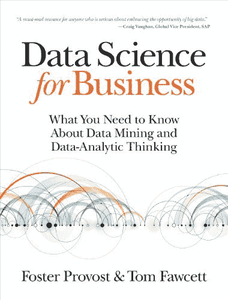](https://geni.us/Pl12Nz)

如果你不能下定决心进入数据科学领域，这本书是一本纯粹面向商业的书。它清楚地解释了为什么你应该学习数据科学，为什么它是你的正确选择。有漂亮的例子，如推荐系统，电信流失率，自动股票市场分析等等。这本书让你保持动力。这不是一本说教的书。它很实用，也给你足够的参考来开始你的技术之旅。这本书强调发现新的商业案例，而不仅仅是处理和分析数据。

在亚马逊上查看这本书的预览，了解书中的概念。

你可以在这里买到这本书。

[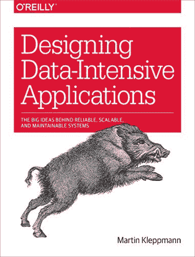](https://geni.us/BijKa3h)

最后，但同样重要的是，这本书有助于理解当今数据系统的架构，以及它们如何适应数据驱动和数据密集型的应用程序。它没有深入到管理、安全、安装和其他方面，而是详细解释了数据检索、数据库系统和基本概念。如果你是建筑师，这本书是给你的。作者讨论了设计数据库和数据解决方案的各个方面，并提供了大量其他资源(在每章的结尾！)来加深你对该主题的了解。

你可以在这里买到这本书。

## 还有更多…

有数百或更多的书籍与数据分析和数据科学相关，不要被大量的书籍淹没。你不必全部读完。我们精心挑选了这些书籍，通过这些书籍和博客中提到的其他资源，您应该能够构建真实世界的模型，并获得深入的数据科学知识。另外一些有帮助的参考书是《自学 SQL》,《大到不能忽视》,这本书有 100 页，是关于机器学习的书,《用 Tableau 和数据分析交流数据》。从我们推荐的 22 本书中的任何一本开始您的数据科学之旅，并告诉我们您是如何喜欢阅读它们的！

如果你想成为数据科学专家，那么[数据科学课程:完整的数据科学训练营](https://click.linksynergy.com/deeplink?id=jU79Zysihs4&mid=39197&murl=https%3A%2F%2Fwww.udemy.com%2Fcourse%2Fthe-data-science-course-complete-data-science-bootcamp%2F)课程对你来说是一笔巨大的财富。

**人也在读:**