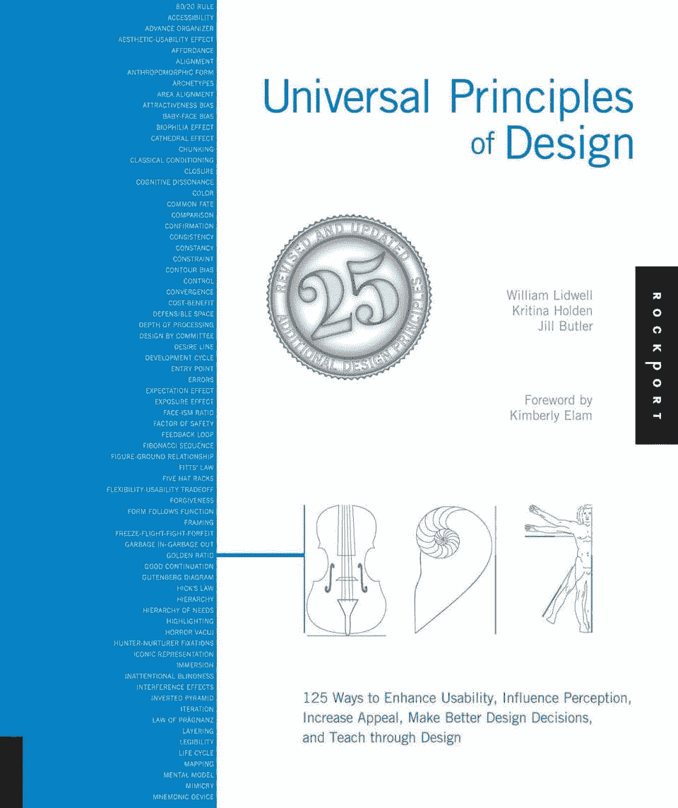
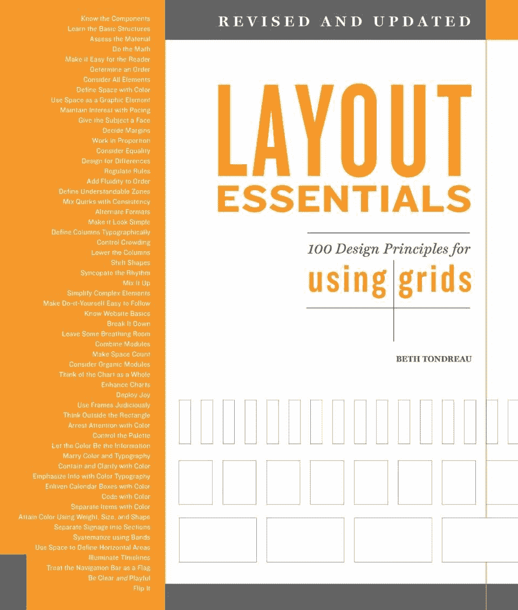
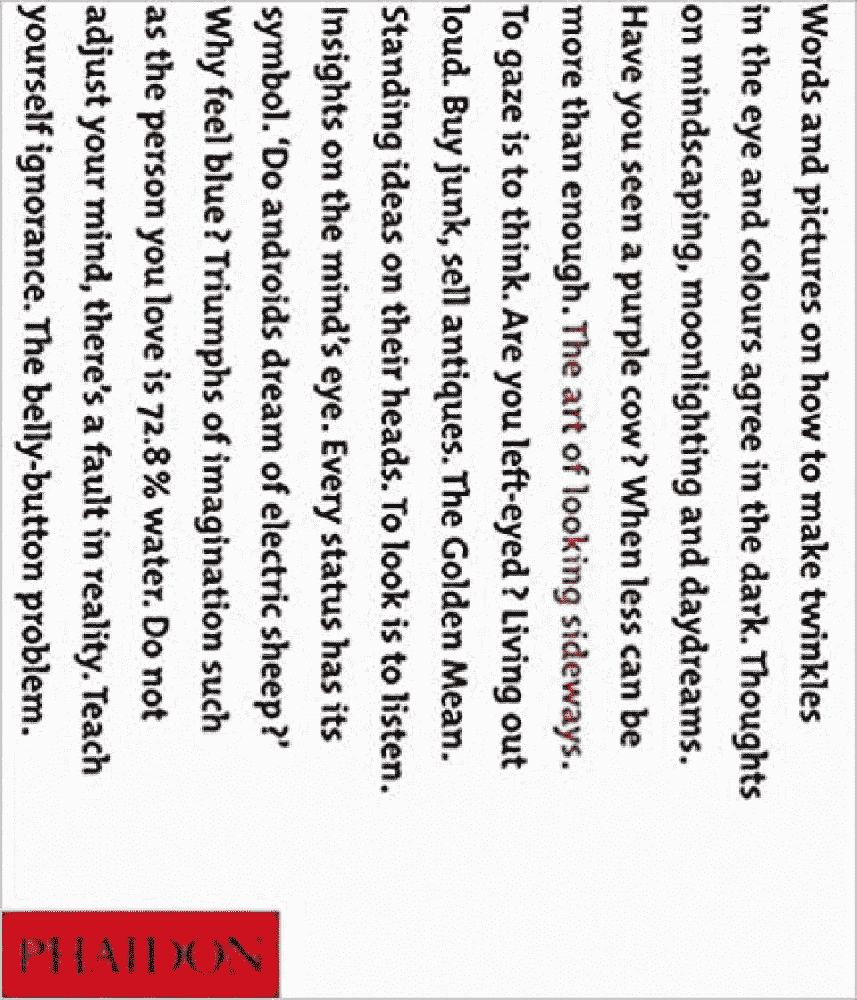
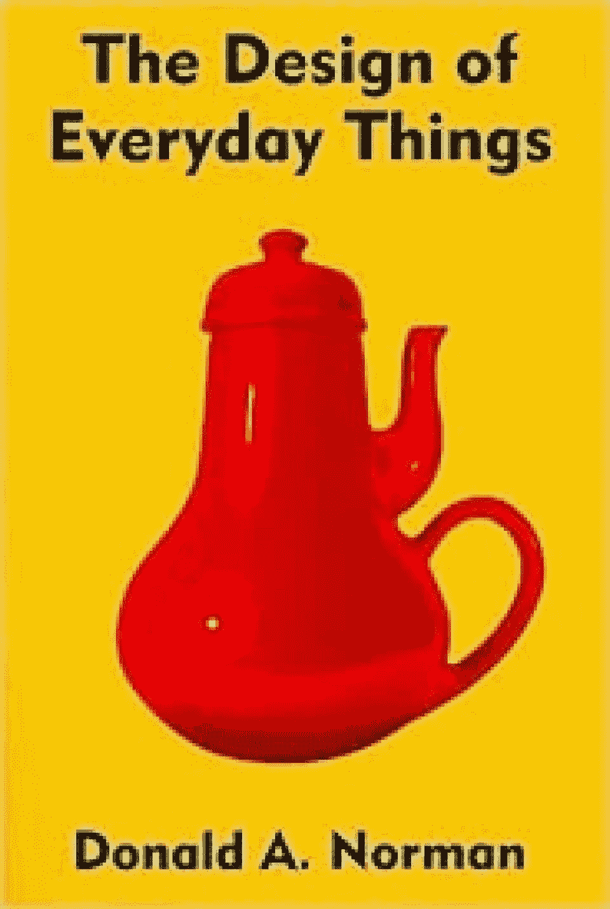
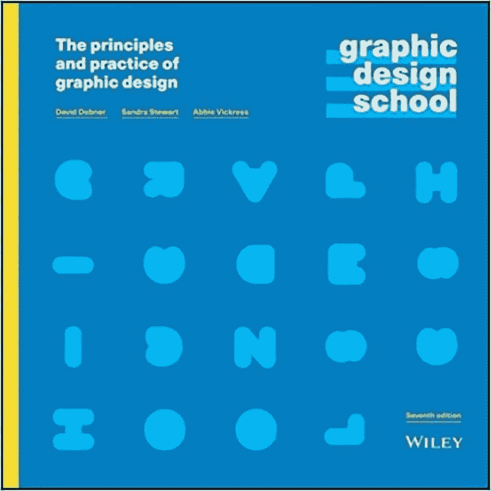
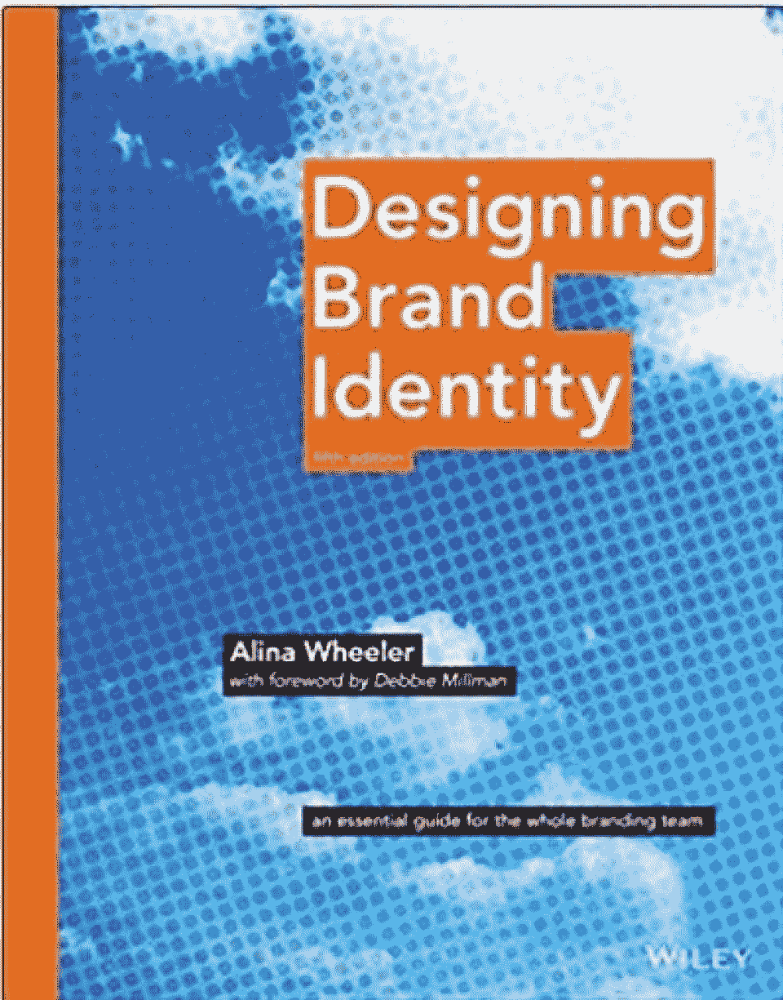
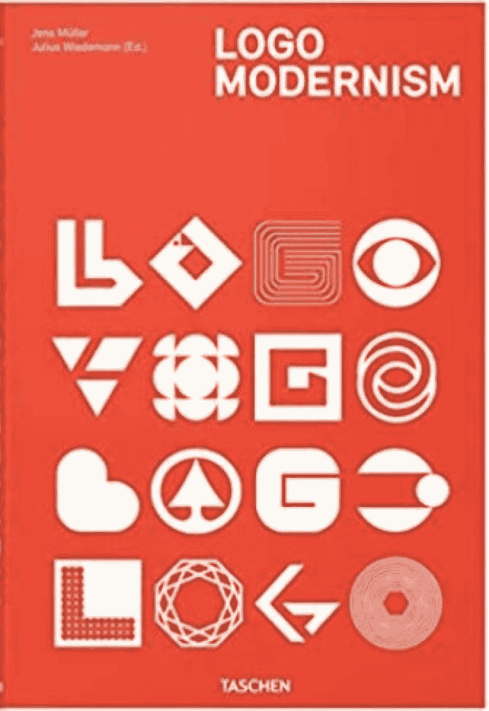
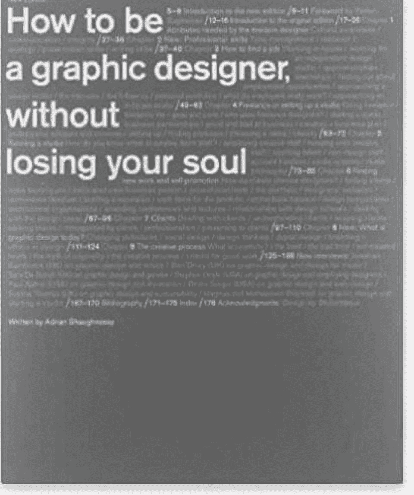
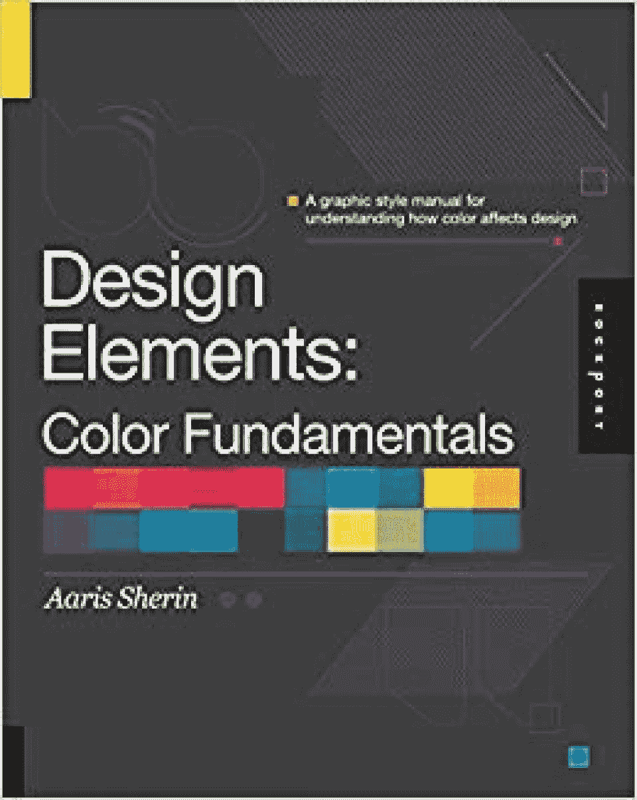
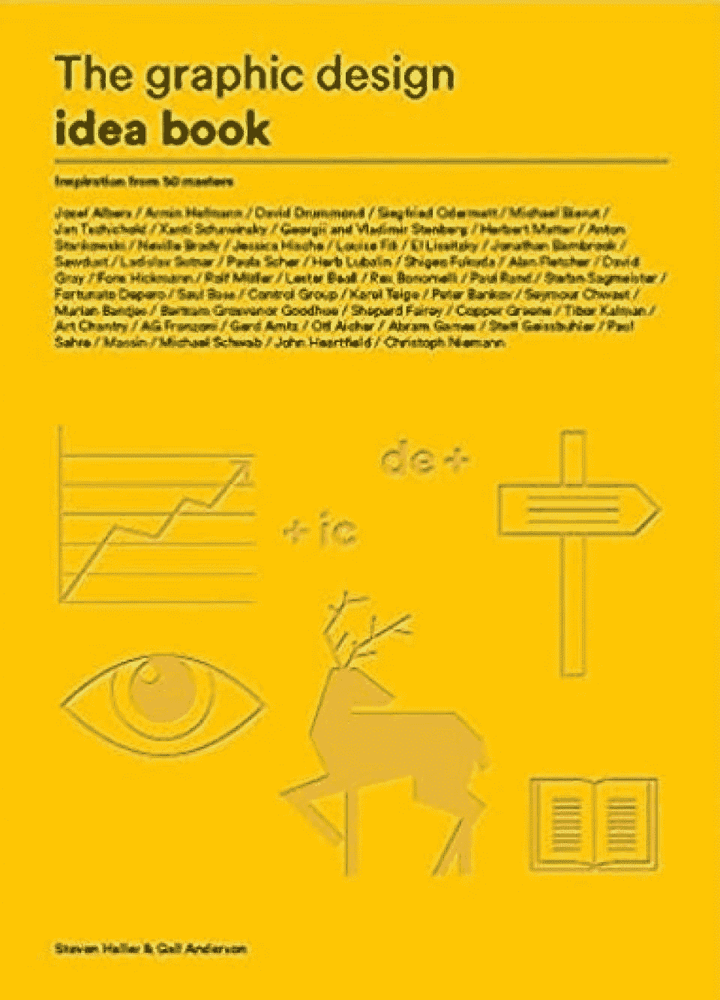

# 2023 年设计类学生的 10 本最佳设计书[更新]

> 原文：<https://hackr.io/blog/design-books>

[平面设计师](https://www.bls.gov/oes/current/oes271024.htm) 有很多路线可以学习他们的手艺。他们可能会参加认证课程，研讨会，学位课程，或进行一些其他的自学。书籍是自学的一种常见方法，在这种方法中，未来的学生主动获取特定领域的知识。设计师可以通过阅读和应用设计书籍中的知识，轻松进行自学！

但是有哪些最好的[平面设计书籍](https://hackr.io/blog/graphic-design-books)？我们将为平面设计师列出 10 本最好的[书籍，这些书籍信息丰富、引人入胜，并且对平面设计师的职业道路有用。](https://hackr.io/blog/graphic-design-books)

我们开始吧！

## **10 本最佳设计书籍**

你可能会因为各种原因阅读设计书籍。也许你是一个想要学习基本设计概念的初级设计师。或者，你精通一种特定的设计方法，并希望扩展你对其他方法的了解。随着时间的推移，你可能会复习不同的设计书籍，以保持你的知识与时俱进。

以下是 10 本 最好的设计书籍 给有经验或有抱负的平面设计师:

**作者:** 威廉·利德威尔，克里斯蒂娜·霍尔登，吉尔·巴特勒

**亚马逊价格:**【17.75 美元

这本书是为寻求拓展和提高设计专业知识的设计师、工程师、建筑师和学生而写的。它解释了每一个主要的设计概念的定义和说明，以取悦读者。

这本书是按字母顺序组织的，所以你可以很容易地查阅原则和章节。此外，这本书还有一个针对设计师的常见问题列表，比如，“我如何帮助人们从我的设计中学习”，“我如何增强设计的可用性”，以及“我如何做出更好的设计决策？”

**购买理由:**

*   关于设计好坏的深思熟虑的讨论
*   有趣的“设计心理学”部分

你可以在这里买到这本书。

****

**作者:** 第一版作者:贝丝·唐卓

**亚马逊价格:**【25.52 美元

这本书通过 100 条设计原则展示了基本的布局指导原则，例如选择字体、努力保持节奏和字体的平衡、组合字体、使用特殊字符、字距调整和易读性。

无论你是在制作小册子、年度报告、海报、网站还是出版物，布局都是展示信息和确保读者轻松理解信息的关键。不幸的是，一些客户评论引用了对这本书的失望，提到了模糊的描述和冗余。

**购买理由:**

*   非常适合设计初学者
*   强大、生动的网格示例

你可以在这里买到这本书。

**作者:**

**亚马逊价格:**【70.51 美元

*《侧目的艺术》* 一看就是一本充满艺术气息的茶几书。然而，每一页都是一件艺术品，展示了你可以创造性地使用类型、空间、意象和颜色。这本书的内容看似随意，从历史名言、荒谬的图像、点滴信息和见解，以及你能想到的一切，只要它呈现得漂亮。

评论家们喜欢这本书的励志感觉，以及它如何鼓励他们跳出框框思考。《图书馆杂志》称这本书对那些“注意力持续时间短”的人来说很棒，这使得它成为家庭办公室工作休息时间或在客厅里慵懒的日子里的一本好书。

**购买理由:**

*   非常适合寻找灵感的设计师
*   轻松愉快，进行短暂的阅读
*   作为茶几书的可爱装饰件

你可以在这里买到这本书。

**建议课程**

**[平面设计大师班——学习伟大的设计](https://click.linksynergy.com/deeplink?id=jU79Zysihs4&mid=39197&murl=https%3A%2F%2Fwww.udemy.com%2Fcourse%2Fgraphic-design-masterclass-everything-you-need-to-know%2F)**

****

**作者:** 唐·诺曼

**亚马逊价格:**【13.43 美元

一个实用的设计， *日常事物的设计* 探讨了认知心理学的考量与强势产品设计之间的关系。Norman 描述了导致客户不满的常见产品设计问题，比如隐藏的控件或不直观的功能。

**购买理由:**

*   对于那些对 UX 设计和人类因素心理学感兴趣的人来说非常棒，其概念也适用于许多其他行业
*   实用平面设计师的理想选择

你可以在这里买到这本书。

**作者:** 大卫·达布纳，桑德拉·斯图尔特，陈细洁·维克里斯

**亚马逊价格:**【35.60 美元

顾名思义， *平面设计学校* 是一本很棒的书，适合想要对设计基础、设计行业和职业以及印刷技术有一个总体介绍的学生。这本书还涵盖了在该领域有影响力的设计师的信息。

吸收了这本书的知识后，学生可以通过书中的许多活动和教程来应用他们所学的知识。

不幸的是，具有讽刺意味的是，一些评论家对这本书糟糕的设计以及一些人可能难以阅读的小字体表示失望。

**购买理由:**

*   非常适合对图形设计、用户体验或用户界面设计感兴趣的学生
*   一本适合初学者的入门书

你可以在这里买到这本书。

**作者:** 艾莉娜·惠勒

**亚马逊价格:**【24.17 美元

图形设计帮助你通过视觉传达信息。对于企业来说，这意味着传达他们的品牌愿景和价值观，这并不总是一件容易的事情。文字通常是不够的，这就是为什么如此多的企业依靠平面设计来创建和传播品牌身份。Alina Wheeler 的 *设计品牌识别* 涵盖品牌案例研究、行业专业人士的有益见解和品牌基础知识。

这本书是专门为公司的营销人员和设计师量身定做的。然而，有抱负的自由职业者可以利用这些原则来打动各种各样的客户。

客户评论引用了 Wheeler 出色、易懂的语调和声音，这使得文本即使对于初学者也是易于理解的。

**购买理由:**

*   通俗易懂
*   综合

你可以在这里买到这本书。

[****](https://amzn.to/3tRmUzi)

**作者:** 延斯·米勒

**亚马逊价格:**【64.91 美元

对于想要了解商标设计原则在几十年中如何演变的设计师来说，现代主义标志是最好的书籍之一。当你想到一些世界上最大的公司——苹果、耐克、特斯拉——你会想到什么？你可能会想到小苹果图标或光滑的勾号。标识对于帮助潜在客户了解你的品牌至关重要。

延斯 穆勒的 *标志现代主义* 探索了世界上最大的标志出现之前不久发生的事情，审视了 1940-1980 年间商标上的现代主义美学。这本书涵盖了各种公司的标志，包括报纸、零售、航空公司等等。

**购买理由:**

*   有趣的书籍，无需阅读大量文本
*   图形设计师的相关类别，如形状、线条、字母组合等。

你可以在这里买到这本书。

[****](https://amzn.to/3fLa90Z)

**作者:** 亚当沙乌格内西

**亚马逊价格:**【19.20 美元

众所周知，平面设计行业薪水低、工作时间长，对那些刚刚起步的人来说是无情的。 [平面设计市场](https://www.bls.gov/ooh/arts-and-design/graphic-designers.htm) 已经饱和，竞争激烈，成功只属于那些努力工作，不仅打磨技术技能，还打磨社交和软技能的人。沙乌格内西的书帮助有抱负的设计师在纷乱的工作环境中导航，为求职面试、管理客户、建立投资组合、润色简历、申请工作、创办工作室等提供可行的步骤和建议。

评论家们特别喜欢这本书在设计领域的完整性。

**购买理由:**

*   平面设计职业导航的实用建议
*   知名平面设计师的访谈

你可以在这里买到这本书。

**作者:t1aaris sherin**

**亚马逊价格:**【24.74 美元

平面设计师有很多工具可以使用，包括形状、线条、图像，当然还有颜色。仅仅通过颜色，设计师就可以影响一件作品的意义和信息，这本书教他们如何做到这一点。Sherin 涵盖了色彩理论及其原理，并帮助学生了解他们可以为了一件艺术品而打破规则的情况。

谈到色彩，这是最好的平面设计书籍之一。 这本书的许多视觉例子也给学生们提供了大量的灵感。

**购买理由:**

*   关于设计中色彩理论和色彩基础的深刻见解
*   适合初学者使用

你可以在这里买到这本书。

**作者:** 史蒂文·海勒和盖尔·安德森

**亚马逊价格:**【16.99 美元

对于该领域的初学者来说，Heller 和 Anderson 的《idea》一书是一个很好的资源。它提供了平面设计基础的基本介绍，包括叙事、色彩和形式等主题。

本书还展示了无数来自业内顶尖人才的作品，为经历艺术家之路的设计师们提供了巨大的灵感。这两位作者的简历令人印象深刻。海勒担任《纽约时报》艺术总监长达 33 年，安德森是一名专业的设计师和插画师，获得过一些奖项。

**购买理由:**

*   艺术家的灵感来源
*   适合初学者使用

你可以在这里买到这本书。

## **结束语**

平面设计师肩负着用形状、颜色、线条以及两者之间的一切进行交流的艰巨任务。根据以上 10 本设计书中的一些技巧，你将会迈向你平面设计生涯的下一步。

如果你想通过动手项目来练习你新的网页设计技能，我们建议你去 NameCheap 买一个[打折域名](https://www.namecheap.com/?clickID=wUoTbQ3KtxyNR9L3K50RiSEKUkAx6n2NkXBZwI0&irgwc=1&utm_source=IR&utm_medium=Affiliate&utm_campaign=2890636&affnetwork=ir&ref=ir)。然后你可以建立自己的网站，开始练习设计。

想继续学习吗？考虑查看一些 [web](https://hackr.io/blog/best-web-development-courses) [开发课程](https://hackr.io/blog/best-web-development-courses)来拓宽你的技能！

[今天查看一些网络开发课程](https://hackr.io/blog/best-web-development-courses)

**人也在读:**