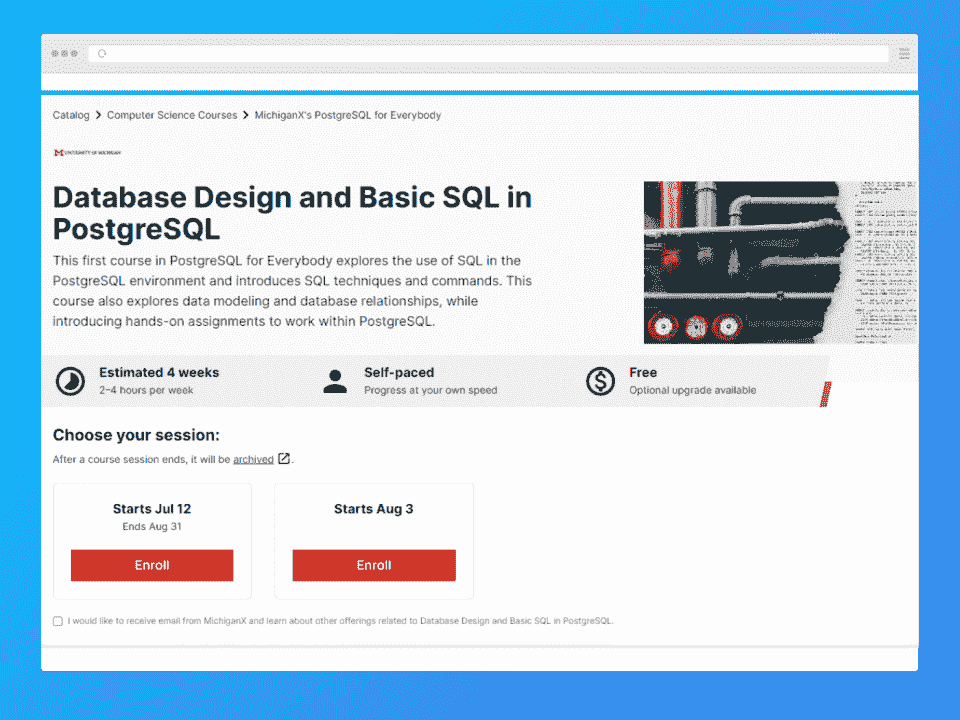
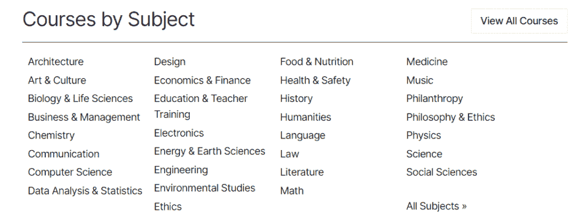
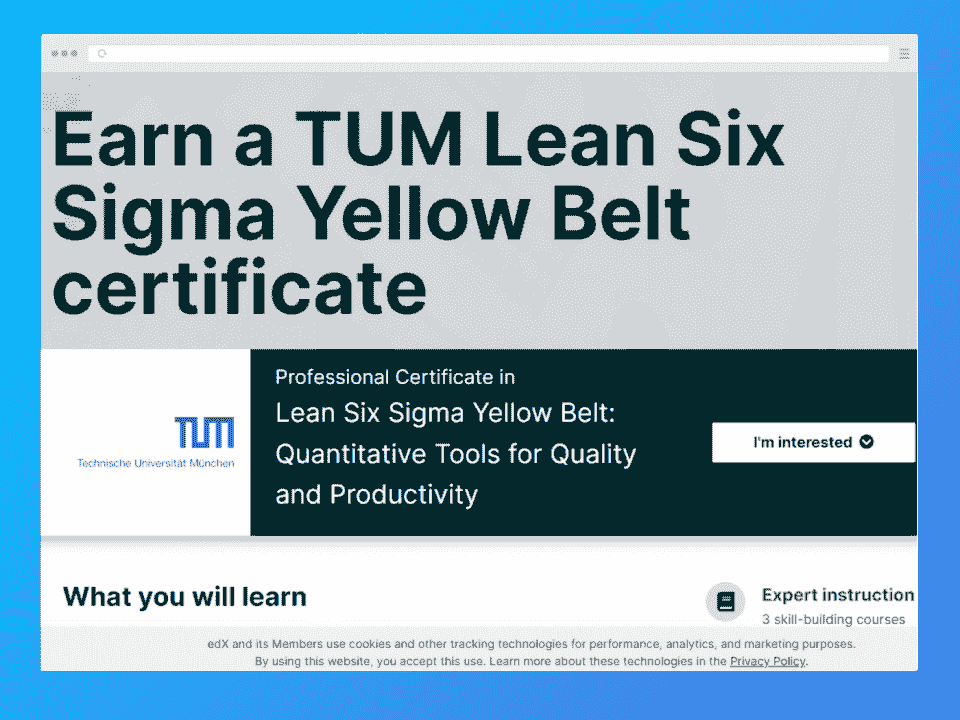
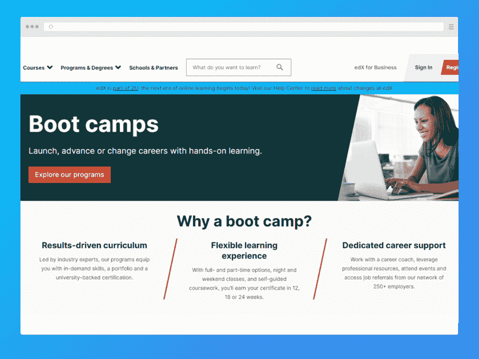
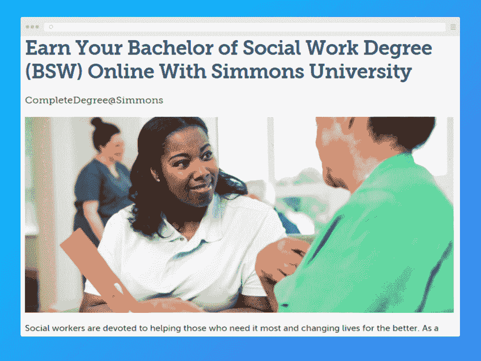
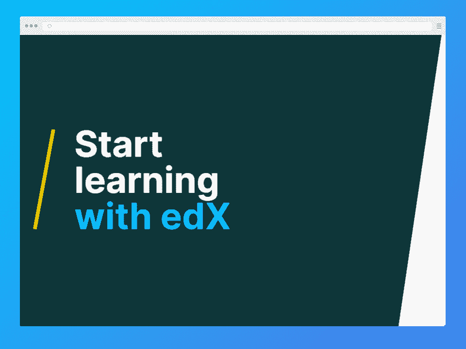
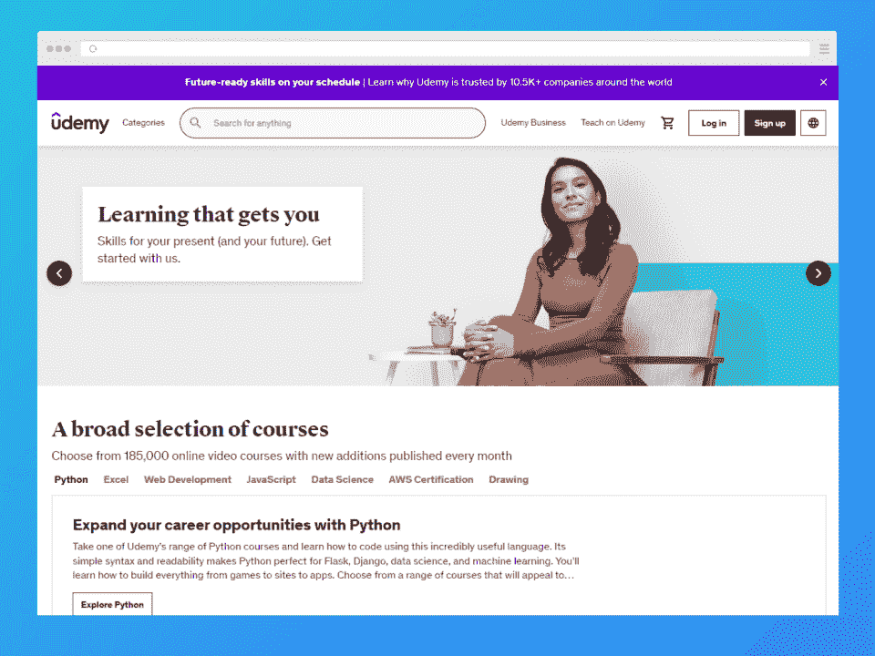
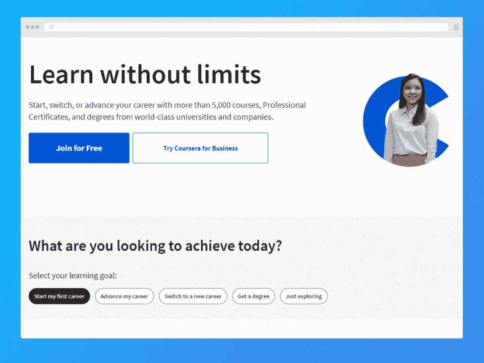
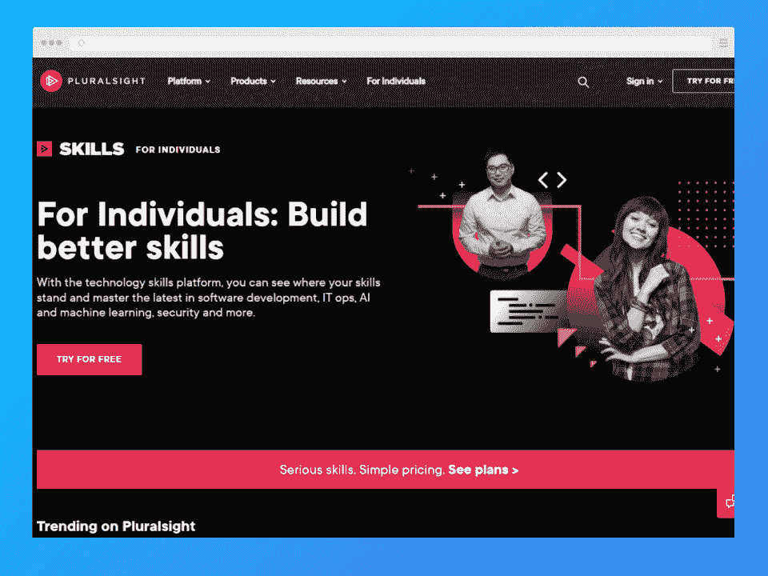

# edX 评论 2023:优点、缺点和选择

> 原文：<https://hackr.io/blog/edx-review>

edX 提供了一个独一无二的机会来学习编程、[数据科学](https://hackr.io/blog/what-is-data-science)以及世界上一些最好的学校的其他计算机和科学学科。哈佛大学、斯坦福大学和麻省理工学院只是在 edX 上提供学习材料的几个认证机构。

| 教练 | 3/5 |
| 课程 | 5/5 |
| 经验 | 4/5 |
| 总数 | 4/5 |

**一览:**

*   edX 是为数不多的在线学习门户网站之一，不仅提供经认证的材料，还提供知名机构的材料。
*   虽然与 Coursera 和 Udemy 等最著名的学习门户网站相比，edX 的课程内容有限，但课程内容要深入得多。
*   你需要为 edX 认证付费，而且你通常会比在其他学习平台上支付更多。
*   然而，如果你不在乎获得一个可共享的认证，你可以免费参加任何课程。

再来说说 edX。今天，我们将讨论 edX 的利与弊，你可以从 edX 中学到什么，以及 edX 是否适合你。

## **什么是 edX？edX 合法吗？**

edX 是由哈佛大学和麻省理工学院创办的非营利组织。它提供 MOOCs(大规模开放在线课程)，每年为数千万学生提供服务。虽然 edX 评论强调了教学和课程的可变质量，但你可以从伯克利获得一个编码营。不幸的是，它不会是免费的。

认证课程是免费的，但有一个问题；认证本身还是需要付费的。你可以按照自己的进度学习这些“免费课程”中的大部分，除非你付费，否则你不会获得任何证书。参加本数据库课程:

[查看课程](https://edx.sjv.io/c/2890636/1598007/17728?u=https%3A%2F%2Fwww.edx.org%2Fes%2Fcourse%2Fdatabase-design-and-basic-sql-in-postgresql)

在四周的时间里，你将从密歇根大学提供的课程材料中学习数据库设计和基本的 SQL。但这不会传达任何凭证。如果你想要证书，有一个 196 美元的可选课程升级。

此外，尽管课程使用了这些著名大学提供的材料，但课程本身并不一定是由这些大学开办的。至少有一些机构将他们的在线学校外包出去——所以你可能并不总能得到像哈佛这样的学校所承诺的教育。

不过，edX 上有相当广泛的课程材料。edX 是各种学科训练营、专业认证、学士学位甚至硕士学位的主办地。

与许多其他在线学习平台不同，edX 有许多领域。edX 是少数几个包含商业相关的*和*文科课程的平台之一。比方说，你想深入研究伦理学——你更有可能在 edX 上找到，而不是在 Udemy 或 Coursera 上。

### **edX 简史**

edX 由麻省理工学院教授阿南特·阿加瓦尔(Anant Agarwal)和前雅虎(Yahoo！执行。两人之前曾在一个名为“电路”的教育项目上合作，该项目为全球学生提供互动练习和视频讲座。在“电路”获得成功后，两人决定创建一个更全面的在线学习平台，最终成为 edX。

今天，edX 是世界上最大的在线学习平台之一。该非营利组织提供来自 90 多个合作机构的免费和负担得起的课程，包括哈佛大学、麻省理工学院、加州大学伯克利分校和乔治敦大学。除了提供课程，edX 还提供 MOOCs(大规模开放在线课程)，允许任何有互联网连接的人按照自己的时间表学习。

## edX 课程是免费的吗？它们值多少钱？

大多数 edX 课程都是免费的，就像你在旁听一样。您可以访问课程材料、文件和项目，但是您没有获得任何证书或凭证。如果你需要证书或凭证，你将不得不付费。总的来说，edX 课程比 Udemy 或 Coursera 上的课程要贵一点——每门至少 100 到 200 美元。

其他费用因深度而异。例如，伯克利的编码训练营[是一门 13，000 多美元的课程](https://bootcamp.berkeley.edu/faq/#1564086090750-7528f764-70cc)——比社区大学的副学士学位还要贵。伦敦大学的在线学士学位课程通常超过 2 万美元。所以，范围很广。

## **edX 上最受欢迎的证书、训练营和学位**

虽然 edX *拥有从训练营到学士学位的一切，但它的专业认证可能是最受欢迎的——因为它们更简短、更容易获得。*

### **edX 上最受欢迎的证书**

edX 颁发的专业证书向你的雇主表明你了解特定的、与行业相关的技能。edX 上一些最受欢迎的证书包括:

*   [精益六适马黄带:质量和生产力的量化工具](https://edx.sjv.io/c/2890636/1598007/17728?u=https%3A%2F%2Fwww.edx.org%2Fprofessional-certificate%2Ftumx-six-sigma-and-lean)(慕尼黑工业大学)。为期六个月的自定进度课程，介绍如何将六项适马标准应用于质量和生产力。专家指导和认证只需 400 美元。
*   [前端 Web 开发者](https://edx.sjv.io/c/2890636/1598007/17728?u=https%3A%2F%2Fwww.edx.org%2Fprofessional-certificate%2Fw3cx-front-end-web-developer) (W3Cx)。为期七个月的自定进度的前端 web 开发和基础 web 编程课程。总共五门课程的专家指导，价格为 995 美元。
*   风险管理(纽约金融学院)。向华尔街真正的金融专家学习风险管理。这种自定进度的五个月课程的整个项目体验费用为 1895 美元。

如果你熟悉其他平台，你会注意到 edX 比许多其他在线学习门户网站更关注商业和金融。大多数在线学习门户倾向于编程、编码训练营和数字设计。但这并不意味着 edX 没有那些课程——远非如此。让我们来看看一些最受欢迎的训练营。

### **edX 评论:最受欢迎的训练营**

训练营是针对实践学习的广泛课程，就像你在这个行业一样。训练营是进入一个新行业或发展你职业生涯的好方法。

以下是 edX 上一些最受欢迎的训练营:

*   [伯克利编码训练营](https://edx.sjv.io/c/2890636/1598007/17728?u=https%3A%2F%2Fbootcamp.berkeley.edu%2Fcoding%2F%3Futm_source%3Dedx%26utm_medium%3Dreferral%26utm_campaign%3Dedx-ucb%26linked_from%3Dsitenav%26utm_user-id%3Dcb40f6e7-d28c-4056-abbe-b95a0ec019a2)(伯克利)。一个全栈编码训练营，让你立即投入运行。伯克利编码训练营的费用高达 13，000 美元，但它会教你编程的所有知识。
*   [数据分析训练营](https://edx.sjv.io/c/2890636/1598007/17728?u=https%3A%2F%2Fbootcamp.cvn.columbia.edu%2Fdata%2F%3Futm_source%3Dedx%26utm_medium%3Dreferral%26utm_campaign%3Dedx-cu%26linked_from%3Dsitenav%26utm_user-id%3Dcb40f6e7-d28c-4056-abbe-b95a0ec019a2)(哥伦比亚工程)。为期 24 周的课程，旨在通过真实项目和讲师指导课程教授数据分析的基础知识。全职训练营超过 15000 美元。
*   网络安全训练营(佐治亚理工学院)。一个完整的网络安全和网络安全课程，旨在让你在该领域的工作。这个项目的费用是 10，000 美元，但是有奖学金。

请注意，训练营通常会帮助你[找到工作](https://hackr.io/blog/ways-to-land-your-first-job-in-it)。训练营不仅包括特定领域的知识，还包括面试和建立投资组合的要素。

[查看其他训练营](https://edx.sjv.io/c/2890636/1598007/17728?u=https%3A%2F%2Fwww.edx.org%2Fboot-camps) 

### **edX 上最受欢迎的学位**

edX 拥有在线学位课程，包括实时在线课程、课程材料和个性化支持。以下是一些由认证大学提供真实证书的课程:

*   [商业与管理理学学士](https://edx.sjv.io/c/2890636/1598007/17728?u=https%3A%2F%2Fprograms.edx.org%2Frequestinfo%2Flse%3Fnocache%3D1%26linked_from%3Dsitenav%26utm_user-id%3Dcb40f6e7-d28c-4056-abbe-b95a0ec019a2)(伦敦大学)。学习企业管理，钻研企业财务和项目管理。这个学位非常适合那些想提升自己商业管理职业生涯的人。
*   [注册护士到护理学士](https://edx.sjv.io/c/2890636/1598007/17728?u=https%3A%2F%2Fonline.simmons.edu%2Fbachelors%2Frn-to-bsn-online%2F%3Futm_source%3Dedx%26utm_medium%3Dreferral%26utm_campaign%3DSC_RNBSN%26linked_from%3Dsitenav%26utm_user-id%3Dcb40f6e7-d28c-4056-abbe-b95a0ec019a2)(西蒙斯大学)。注册护士可以获得护理学位，并在这一在线课程中加快他们的职业生涯。这个学位非常适合想挣更多钱的注册护士。
*   [社会工作学士学位](https://edx.sjv.io/c/2890636/1598007/17728?u=https%3A%2F%2Fonline.simmons.edu%2Fbachelors%2Fonline-social-work-bachelors-bsw%2F%3Futm_source%3Dedx%26utm_medium%3Dreferral%26utm_campaign%3DSC_BSW%26linked_from%3Dsitenav%26utm_user-id%3Dcb40f6e7-d28c-4056-abbe-b95a0ec019a2)(西蒙斯大学)。获得一个学位，帮助你在西蒙斯大学做社会工作，四年制，学士学位。这个学位非常适合那些想从事私人和公共社会工作的人。

**查看所有在线硕士学位**

这些都是很严谨的课，但是也很贵。许多课程来自伦敦大学(以在线课程闻名)等大学，而不是哈佛大学。

| edX 获得认证了吗？edX 是不被认可的，但是许多通过 edX 提供课程的机构是被认可的。也就是说，你应该检查每门课程的证书以确保万无一失。机构*和*项目都应该得到认证。 |

## **edX 对谁有好处？谁应该使用 edX？**

因为 edX 的课程范围很广，对很多观众来说都很棒。

对于那些只想提升技能和改善职业生涯的人来说，证书是个不错的选择。对于那些想彻底改变职业生涯或大幅改善职业前景的人来说，训练营或学位课程可能更好。

通过 edX 提供的认证和训练营往往由比学位项目更有资格的组织提供，这是你应该考虑的。

## **edX 课程值得吗？edX 会帮你找工作吗？**

edX 刚推出的时候，很多课程都是出于好奇；人们想知道麻省理工或斯坦福的学生在学什么。但现在，这是获得证书或参加名牌大学训练营的好方法。此外，许多雇主将 edX 视为新员工良好的教育来源。

需要注意的是，它的训练营和学位课程确实比其他类似的平台更昂贵——所以你需要决定是从知名大学获得证书还是更实惠。一个 edX 训练营可能需要 13，000 美元，而其他地方的相同(或类似)材料可能需要 2，000 美元。

### **edX 证书有价值吗？**

edX 证书可能提供了最大的价值。它们涵盖了特定的基础知识(例如前端或后端开发)，并且价格(通常)低于 300 美元。花 300 美元，你可以获得为期 9 个月的网络开发课程……或者花 50，000 美元，你可以获得为期 4 年的计算机科学学位。

但是证书只有雇主赋予它们的价值。edX 证书来自麻省理工学院和哈佛大学等机构，增加了它们的分量。

查看所有训练营

## **如何注册和使用 edX**

您可以完全免费注册 edX，并开始注册免费认证和课程。但是不买是拿不到证书的。与 Udemy 或 Coursera 不同，edX 不是一个基于订阅的系统。你必须购买你想要的课程。购买后，您可以在闲暇时自由访问和使用它们。

### edX 的折扣:有折扣券吗？

大部分 edX 类已经打折；你会发现它们的价格通常是 995 美元，但标到了 850 美元。很少看到没有某种形式折扣的课程。此外，edX 全年都有优惠券。大多数优惠券从 10%到 15%不等。

### **edX 退款和取消政策**

您可以在课程开始后 14 天内取消课程并获得退款。所以，你可以认为这是一种预付费的尝试。如果你发现课程不适合你，不是你所期望的，或者你只是没有时间来管理它，你可以取消它来获得退款。

## **在 edX 上寻找最佳课程的技巧**

edX 上的所有课程都经过严格审查。它们与管理它们的实体机构所提供的知识不相上下。其他在线市场依赖星级评定和评论，而 edX 课程依赖机构的声誉。

这里有一些提示:

*   edX 上不是所有的大学都是平等的。例如，伦敦大学是一所知名的在线大学，但它不一定能与麻省理工学院相提并论。
*   并不是所有的 edX 课程都由学校管理。正如我们之前提到的，有些课程是外包的，所以你可能得不到预期的学习体验。
*   你为名字付钱。看一下提供的课程，和你可以通过其他途径获得的课程进行比较，比如 PluralSight。你可能会发现你会支付过高。

除此之外，了解你的学习风格。如果你需要教师指导的材料，那么自定进度的课程不适合你；训练营会更好。

| **今天加入 350，000+名学习者**平均每天，edX 有超过 350，000 名学习者积极使用他们的程序。超过 160 个机构开设了 edX 课程，包括伯克利、哈佛、波士顿大学和麻省理工学院。 |

## **edX 课程真的是哈佛(伯克利、麻省理工等)的吗？**

我们在评论中多次提到这一点，但这是一个重要的问题。名校如哈佛等准备这些课程，哈佛等大学聘请导师教授课程。并不是每门课程都由哈佛、伯克利或麻省理工学院提供。有 150 多个机构，包括不太知名的机构。但都是优质机构而非个别导师提供的。

正如 edX 评论中所报道的，教师是极其不稳定的。这导致许多人得出结论，一些教师是专门为在线课程聘用的，或者被归入在线课程。虽然这些著名大学的现任教授可能会教授一些课程，但你更有可能会得到一个助手或者没有太多经验的人。

## **edX:利弊与 edX 课程回顾**

| **优点** | **缺点** |
| 世界上一些最负盛名的大学提供的课程

*   广泛的学科，包括文科、商业和金融
*   多种学习方式，从课程到完成学位课程

 | 比其他平台贵

*   教师可能与材料不一致
*   凭借 [3.6](https://www.trustpilot.com/review/www.edx.org) 的 TrustPilot，edX 在评论者中的表现略逊于许多其他平台。大多数投诉与高成本和不可预测的教师有关。除了外包课程，课程教学也经常外包。此外，虽然 edX 确实拥有来自名牌大学的*材料*，但这些大学的讲师并不总是展示这些材料。

 |

作为一个平台，也有可用性和便利性的问题。许多学生报告了错误和难以使用的用户界面。

edX 是一个很好的平台——但仅仅是麻省理工学院、斯坦福大学和哈佛大学的徽章并不意味着它没有自己的问题。在很大程度上，这个问题与支付过高的名牌大学的名字，而不一定从那所大学接受教育有关。

**edX 的替代品**

## **edX**

| **我们打** | **Coursera** | **复数视线** | **类** | 3,500+ |
| 32,000+ | 5,000+ | 7,000+ | **学生** | 1.1 亿 |
| 三千五百万 | 八千二百万 | 一百万 | **成本** | 变化 |
| 变化 | 59 美元/月 | 29 美元/月 | **我们打** | ** |

### 如果 edX 有质量问题，Udemy 不会解决它。Udemy 是一个开放的市场，任何人都可以在这里教学，所以他们有更多的课程和教师。它们也便宜得多。一些名牌大学在 Udemy 上开设课程，你可以通过 Google 这样的机构找到课程。但是在这个平台上拿到认证就要挑剔了。

**Coursera**

**

### Coursera 与 Udemy 非常相似，但他们有更多的质量控制和更大的深度课程库存，如学位课程。此外，Coursera 有订阅包，比 edX 便宜得多。

**复数视线**

**

### PluralSight 比 Udemy 或 Coursera 贵一点，但也有很多折扣和优惠券。PluralSight 上的课程往往非常深入，但不管出于什么原因，它们并不像 Udemy 或 Coursera 那样普遍受欢迎。

**结论:edX 值得吗？**

如果你只是想学习技能，免费的编码训练营可能是更好的选择。但是如果你想要一个知名大学的证书或认证，edX 是最适合你的。edX 介于“官方”学位和其他在线学习市场之间。具体来说，edX 有知名大学来给简历加分。

## **使用 edX 如果:**

你想从名牌大学拿材料。

你知道教师的素质可能是多变的。

*   你愿意为一个知名大学的名字付出更多。
*   看完我们的 edX 评论，你可能会对其他学习平台感到好奇。查看我们的其他评论！
*   **[阅读我们的 Coursera 评论](https://hackr.io/blog/coursera-review)**

**常见问题解答**

**1。edX 其实好吗？**

## edX 有很好的课程材料，但是教师的质量参差不齐。并非每门课程都由该机构的教师授课，许多课程都是外包的。edX 好不好主要看具体课程。

#### **2。edX 证书值得吗？**

edX 是最受欢迎的在线课程提供商之一，其独特的主张是提供麻省理工学院和哈佛大学等机构的课程。但是这些证书是否值得真的取决于雇主...而且他们确实比其他类似的认证项目花费更多。

#### **3。edX 真的是哈佛吗？**

哈佛是众多开设 edX 课程的学校之一，但 edX 不是哈佛。相反，它是一个非营利性的学习平台，提供各种机构的在线课程。所有的 edX 课程都是由个别教授开发的，而不是 edX 组织。所以，指令可能不是直接来自大学。

#### **4。edX 对简历好吗？**

edX 课程可以为你的简历增色不少，尤其是如果这些课程与你申请的工作相关的话。至少有些价值候选人有现实世界的经验和知识，所以 edX 课程可以帮助你脱颖而出。但是要看课程的深度和用人单位。

#### **5。edX 证书是免费的吗？**

不需要。虽然 edX 上的一些课程是免费的，但大多数课程都是收费的。费用取决于课程，但通常比其他在线认证项目更贵。

#### **6。我能得到 edX 经济资助吗？**

是的。你可以申请 edX 课程的经济资助。如果被录取，你就可以免费学习这门课程。然而，除非你以某种方式(通过经济资助或直接)支付费用，否则你不会获得证书。一些学位项目也有奖学金。

#### **6\. Can I Get edX Financial Aid?**

Yes. You can apply for financial aid for edX courses. If accepted, you'll be able to take the course for free. However, you will not receive a certificate unless you pay the fee, one way or another (through financial aid or directly). Some degree programs also have scholarships.