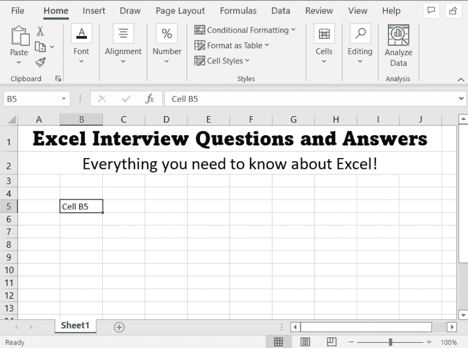
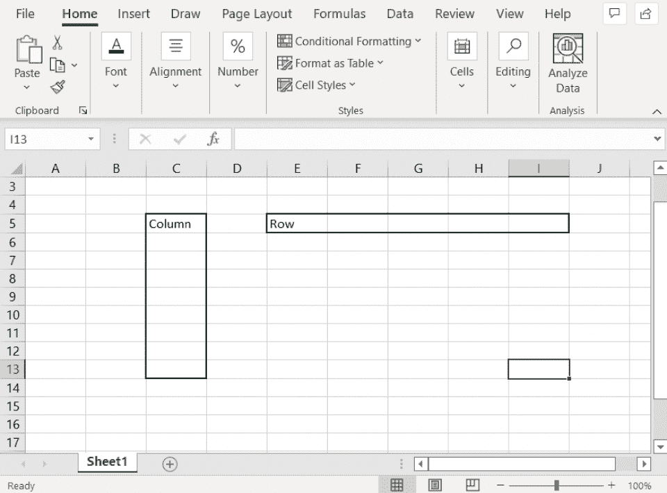
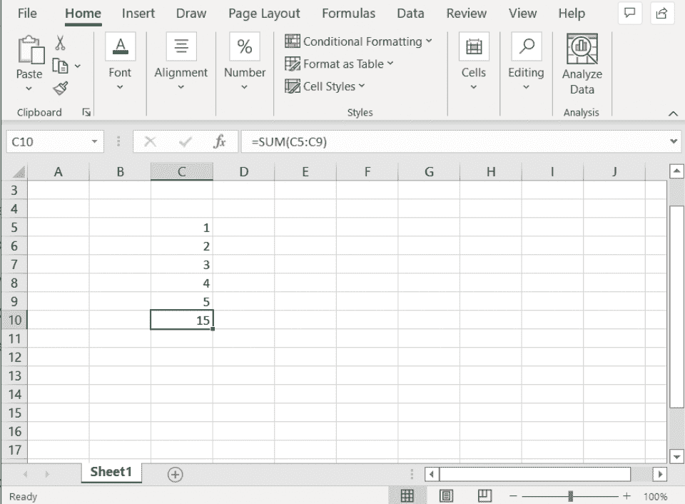
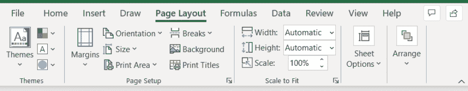
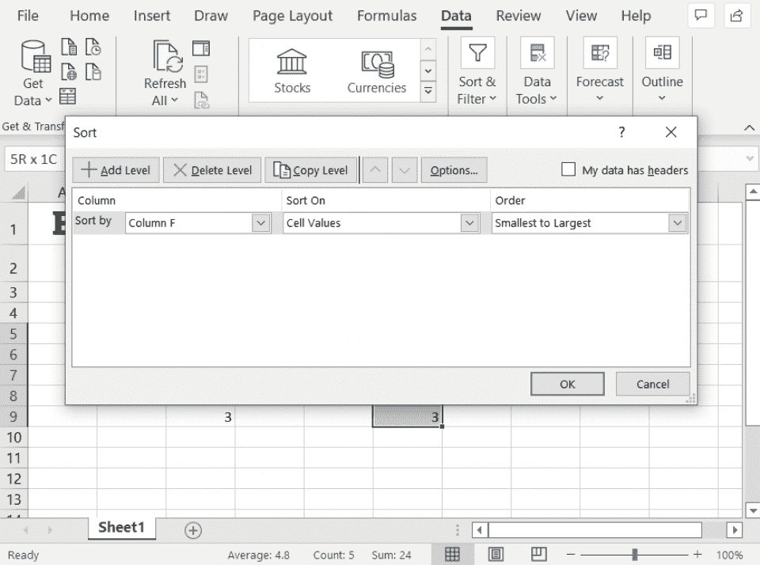
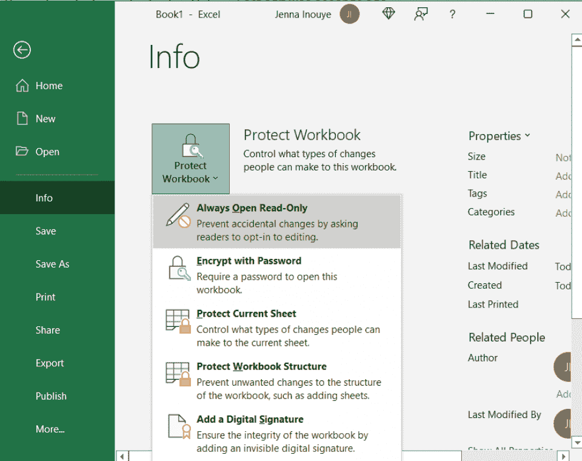
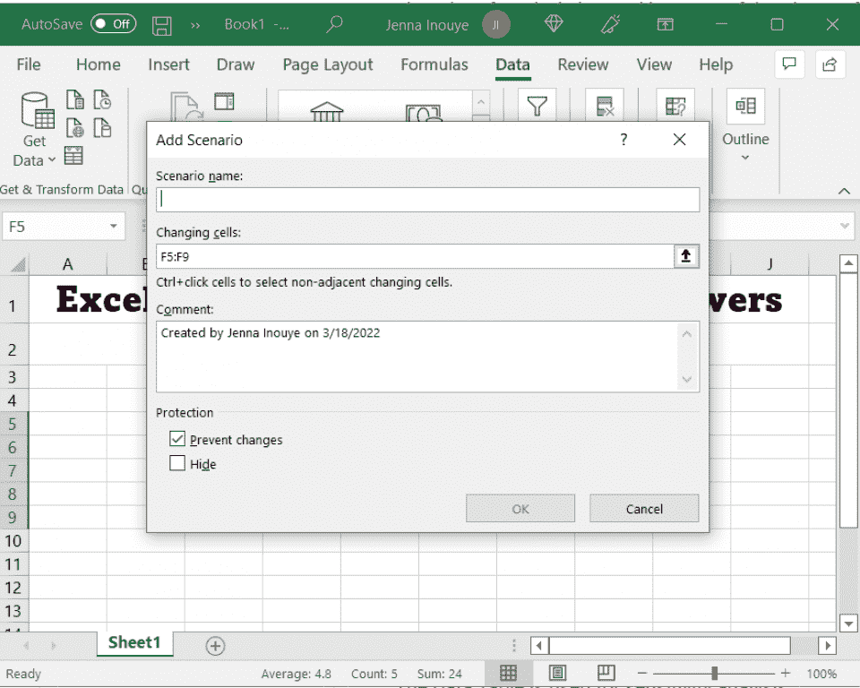
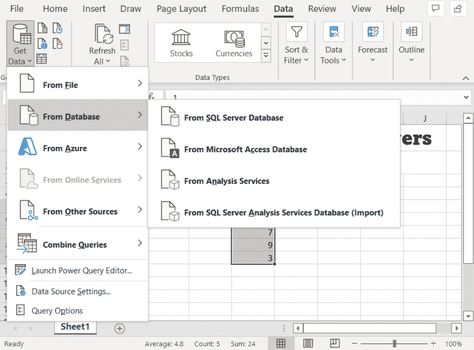

# 2023 年 40+顶级 Excel 面试问答[更新]

> 原文：<https://hackr.io/blog/excel-interview-questions>

[Excel](https://click.linksynergy.com/fs-bin/click?id=jU79Zysihs4&offerid=1160033.10005649&type=3&subid=0) 在你梦想的开发人员工作资格清单上吗？很有可能，你需要为基础、中级和高级 Excel 面试问题做好准备。我们已经创建了一个 Excel 常见问题和答案的完整列表，旨在为您的下一次[工作面试](https://hackr.io/blog/programming-interview-questions)做好准备。

## **Excel 面试问题:面试要了解哪些 Excel 知识**

据招聘人员称，超过 82%的职业需要在某些方面表现出色。[微软 Excel](https://www.microsoft.com/en-us/microsoft-365/p/excel/cfq7ttc0hr4r?ranMID=24542&ranEAID=aqAWIo/Xdy8&ranSiteID=aqAWIo_Xdy8-upMKTFto6o7xpgRi91g2Jg&epi=aqAWIo_Xdy8-upMKTFto6o7xpgRi91g2Jg&irgwc=1&OCID=AID2200057_aff_7593_1243925&tduid=%28ir__whxy6e0nukkfbyg1hwqrsmyb6m2xqwqpm9quhxya00%29%287593%29%281243925%29%28aqAWIo_Xdy8-upMKTFto6o7xpgRi91g2Jg%29%28%29&irclickid=_whxy6e0nukkfbyg1hwqrsmyb6m2xqwqpm9quhxya00&activetab=pivot:overviewtab&ranMID=24542&ranEAID=jU79Zysihs4&ranSiteID=jU79Zysihs4-zaCiIAIgykJ3keyY0CEZHg&epi=jU79Zysihs4-zaCiIAIgykJ3keyY0CEZHg&irgwc=1&OCID=AID2200057_aff_7593_1243925&tduid=%28ir__cy1p6euogskfbxiyby3dbext9f2xcg9gh6kng9mj00%29%287593%29%281243925%29%28jU79Zysihs4-zaCiIAIgykJ3keyY0CEZHg%29%28%29&irclickid=_cy1p6euogskfbxiyby3dbext9f2xcg9gh6kng9mj00) 是一项异常普遍而重要的技能。在功能上，大多数人对 Excel 只是一知半解。让自己成为一名高级的超级用户是让自己在竞争中获得优势的一个好方法。

你的面试官可能会准备一份 Excel 测试问题和答案的清单，问你各种各样的问题来确定你的技能水平。有时，面试官会放弃口头的微软 Excel 面试问题，而是给你一个技术面试。

Excel 技术面试问题包括向您展示 Excel 模拟时提出的问题。然后，你必须回答问题，实时解决问题。

先从面试的基础、中级、高级 excel 试题及答案开始吧！

## **基本 Excel 面试问题**

Excel 上的这些基本面试问题，涵盖了绝对的基础。以任何身份使用过 Microsoft Excel 的任何人都应该能够回答这些问题。相反，如果你不能回答这些问题，面试官可能会认为你从未在 Excel 中工作过。

### **1。什么是细胞？**

****

单元格是工作表的基本单位，您可以在其中输入数据。每个单元格都有一个地址，由列字母和行号表示。例如，下图中单元格的地址是 B5。

### **2。范围和单元格有什么区别？**

区域是一组彼此相邻的单元格。如果某个单元格与该范围中的至少一个其他单元格相邻，则该单元格是该范围的一部分。您可以选择垂直移动(横跨一列)或水平移动(横跨一行)的单元格范围。

### **3。列和行有什么区别？**

****

列是工作表中单元格的垂直分组。行是工作表中单元格的水平分组。

### **4。如何在单元格中输入文本并设置其格式？**

要在单元格中输入文本，只需直接在单元格中键入即可。您也可以使用键盘快捷键 Ctrl+Enter 在单元格中输入文本。要设置单元格的格式，可以使用功能区栏。

### **5。一个细胞能容纳什么？**

单元格可以包含任何类型的文本、数字或计算解决方案的公式。一个单元格甚至可以包含一个 URL。单元格不能包含图像。虽然您可以将图像粘贴到 Excel 中，但它们不会保存在特定的单元格中。

### **6。如何格式化单元格中的数字？**

要设置单元格中数字的格式，请选择单元格编号，然后使用功能区中可用的格式选项。您可以更改格式、小数位数和千位分隔符。例如，一些国家将 1，000 美元格式化为“1，000 美元”，而其他国家则使用“1.000 美元”

### **7。什么是 Excel 公式？**

****

公式是根据工作表中其他单元格的值计算结果的等式。公式总是以等号(=)开头。

### **8。如何在单元格中输入公式？**

若要在单元格中输入公式，请在单元格中键入一个值。每个公式都以等号(=)开头。您也可以使用键盘快捷键 Shift+Enter 在单元格中输入公式。

### **9。如何编辑公式？**

要编辑公式，请双击包含该公式的单元格。这将打开公式编辑器，您可以在其中对公式进行更改。请注意，当您编辑公式时，会弹出建议。自动建议功能对于记住公式的参数非常有用。

### 10。什么是函数？

函数是基于给定值计算结果的预定义方程。例如，SUM 函数计算给定值的总和。通过键入函数及其参数，可以在公式中使用函数。

### **11。如何在公式中使用函数？**

要在公式中使用函数，只需在公式编辑器中键入函数名，然后提供所需的值。例如，SUM 函数要求您指定要相加的单元格区域。

### **12。如何更改工作表中的页面格式或页边距？**

****

要更改工作表中的页边距或页面选项，请转到功能区的**页面布局**部分。

在旧版本的 Excel 中，您可能需要转而选择**文件>页面设置**。这将打开“页面设置”对话框，您可以在其中调整工作表的页边距。

与 [Microsoft Word](https://click.linksynergy.com/deeplink?id=jU79Zysihs4&mid=24542&murl=https%3A%2F%2Fwww.microsoft.com%2Fen-in%2Fmicrosoft-365%2Fword) 类似，Excel 中的页眉和页脚文本显示在工作表中每页的顶部和底部。您可以自定这些页眉和页脚以包含日期、时间、工作表名称等。

### **14。什么是工作表？**

工作表是包含数据和信息的文档。工作表分为行和列，用于组织和分组数据。每个 Microsoft Excel 工作表都是一个单独的文件。

如果你将使用微软 Excel 处理该职位的日常工作职能，你应该能够用微软 Excel 回答中级问题。如果你有一两年的 Excel 工作经验，这些面试问题将涵盖你应该知道的事情。

### 15。Excel 的主要竞争对手有哪些？

[Google Sheets](https://spreadsheetpoint.com/excel-vs-google-sheets/) ，Zoho Sheet，LibreOffice 都是常见的电子表格应用。出于分析目的，PowerBI 和 MySQL 等数据库将处理大量更复杂的数据。

### 16。微软 Excel 有什么好处？

Microsoft Excel 易于使用，具有通用性和可移植性。由于 Microsoft Excel 在业务应用程序中使用如此频繁，您可以将其导入和导出到许多实用程序中。大多数人对微软 Excel 有一些熟悉，这使得它很快就可以被分享。Microsoft Excel 既有桌面解决方案，也有在线解决方案，它提供了电子表格用户可能需要的所有功能。

### **17。微软 Excel 有哪些缺点？**

Microsoft Excel 是一个专有的付费解决方案，所以不是每个人都使用它。有些人更喜欢使用免费的解决方案，如 Google Sheets。Microsoft Excel 主要用作电子表格来收集数据和执行次要的分析功能。对于复杂的数据库任务，它可能不是正确的解决方案。

### 18。最受欢迎的 Microsoft Excel 函数有哪些？

SUM 可能是最流行的 Microsoft Excel 函数；它将所有给定值相加。另一个常见的 Microsoft Excel 函数是 AVERAGE，它将所有给定值相加，然后得出一个平均数。

### **19。你如何在 Excel 中对数据进行排序？**

****

数据输入 Excel 后，可以自动排序和过滤。转到**数据- >排序和过滤**功能，对任意列的数据进行向上或向下排序。

### 20。Excel 中的运算顺序是怎样的？

Excel 遵循 PEMDAS:括号，指数，乘法，除法，加法，然后减法。如果你输入“=1+2/4”，答案将是 2 而不是。

### **21。什么是 VLOOKUP？**

Excel VLOOKUP 函数是一个流行的函数，旨在查找超大电子表格和数据集中的数据。VLOOKUP 可用于查找与给定字符串相同或相似的数据，并定位与之相关的数据。虽然 Excel 不是数据库，但 VLOOKUP 通常被视为“类似数据库”的功能。

### **22。Excel 中有哪些图表？**

Excel 有许多类型的图表。Microsoft Excel 中包括柱形图、饼图、折线图、面积图、散点图、气泡图、曲面图和圆环图。其中，柱形图、饼图和折线图是最受欢迎的。

在单元格上，您可以右键单击并添加注释。注释对于向其他查看 Excel 表格的人传达信息而不直接编辑数据非常有用。

### **24。为什么要在 Microsoft Excel 中“冻结窗格”?**

冻结一个窗格意味着工作表的一部分永远不会移动，即使您正在滚动浏览其他数据。它经常用于在页面上创建静态元素(如索引)。

### **25。“隐藏”一张表是什么意思？**

当您“隐藏”表单时，它在表单导航中不再可见。工作表仍然在那里，仍然可以被显示和操作，除非您采取进一步的措施来保护工作簿。隐藏工作表对于“存档”旧信息很有用，尽管信息仍将存在于文件中。

### **26。如何在 Excel 中保护工作簿？**

****

如果您不想让任何人阅读工作簿，该怎么办？您可以用密码保护工作簿。“保护工作簿”工具提供了许多选项:只读、密码加密、工作表和工作簿保护以及数字签名。

### **27。Excel 中的“合并”是做什么的？**

Merge 将多个单元格合并成一个单元格，这是一个很有用的格式化功能。例如，您可以将一行中的所有单元格组合起来，以创建一个“标题”

## **Excel 专家高级 Excel 面试问答**

大多数 Microsoft Excel 用户不需要知道这些高级面试问题。这些面试问题是为超级用户准备的，这些人经常使用 Excel，或者需要进行一些真正突破 Excel 功能界限的操作。

### **28。什么是 Excel 中的数据透视表，如何使用它？**

数据透视表用于通过创建视图来对表中保存的数据进行重新组织、平均、计数或其他分析，从而对数据进行更深入的分析。

### **29。什么是 Excel 中的宏？如何使用宏？**

宏是硬编码的事件序列，例如打开电子表格和在标题中输入特定文本。宏可以用来节省时间，如果掌握在合适的程序员手中会非常强大。

### 三十岁。什么是 Excel 中的假设分析？

****

Excel 的假设分析使用您的电子表格数据进行数据驱动的模拟。在假设分析下，您可以选择将发生变化的某些单元格，以便为您提供不同的报告指标。

### 31。您可以从哪里将数据导入 Excel？

****

Excel 可以直接从 [SQL Server 数据库](https://hackr.io/blog/mysql-create-database)、Microsoft Access 数据库、Analysis Services 和 SQL Server Analysis Services 导入数据。Excel 还可以引入 Google Sheets 文件、CSV 文件和其他几种流行的格式。

### 32。Excel 中的曲面图是什么？

表面图是一种独特的 3D 拓扑地图，可与提供正确坐标的数据一起使用。

### 33。Excel 中的气泡图是什么？

气泡图是一种特殊类型的散点图。然而，散点图跟踪两个变量(X 和 Y ),而气泡图跟踪第三个变量。第三个变量由散点图点的大小表示。气泡图中的数字越大，气泡越大。

### 34。Excel 中什么是圆环图？

圆环图由同心圆环组成。像大多数 Excel 图表一样，圆环图可以根据所显示的数据提供强大的可视化效果。

### 35。什么是 VBA 电码，如何使用？

VBA 代码是一种用于在 Excel 中创建宏的 Visual Basic。例如，下面的 VBA 将[打开一个工作簿](https://docs.microsoft.com/en-us/office/vba/api/excel.workbooks.open):

**Workbooks.open("test。XLSX")**

VBA 是一种强大的脚本语言，也是 Microsoft Excel 最高级的应用之一。您可以通过 Excel 表直接编辑 VBA 代码，或者创建独立的代码片段，然后由程序运行。

### 36。什么是 XLM？

今天，微软的 Excel 表格使用 VBA。但是在过去，他们使用 XLM；专门为 Excel 设计的语言。如果你正在使用旧的 Excel 表格，你可能会被要求在 XLM 编码。

### 37。如何从另一个工作簿导入数据？

Microsoft Excel 使从另一个工作簿导入数据变得相当容易。您可以通过键入源工作簿名称和正在提取的工作表，在工作簿之间创建一个[外部引用](https://support.microsoft.com/en-us/office/create-an-external-reference-link-to-a-cell-range-in-another-workbook-c98d1803-dd75-4668-ac6a-d7cca2a9b95f)

```
data from: =[SourceWorkbook.xlsx]Sheet1!$A$1
```

但是，如果移动文件、重命名图纸或移动数据，则提取的数据将会不正确。

### 38。Excel 中的逻辑测试是什么？

Excel 可以通过 IF 函数执行基本的逻辑测试。IF 函数生成一个测试场景，然后基于该场景生成一个输出。如果一个数字大于 0，下面的代码将生成“Yes ”,如果一个数字等于或小于 0，则生成“No ”:

```
=IF(A1>0,”Yes”,”No”)
```

### 39。Excel 中的时间线有什么用途？

在处理数据时，时间线可以根据给定的日期顺序分离数据。作为一种强有力的分析形式，时间线显示了信息是如何随时间变化的。您可以按年、季度、月或日对日期进行交互式排序。

### 40。如何创建包含多个数据源的数据透视表？

通过 pivot 数据建模功能，您可以使用多个数据源创建数据透视表。数据可以被动态地拉进数据透视表进行更广泛的分析。

### 41。你如何在 VBA 调试代码？

在 VBA 调试代码最基本的方法是按下 F8 按钮来执行代码。代码执行向您显示代码可能失败的确切位置。也可以使用断点(F9)。

### **42。您在 Excel 中可能遇到的主要错误类型有哪些？**

有六种主要的错误类型:#N/A、#DIV/0、#VALUE、#REF、#NAME 和#NUM。除了 DIV/0(这是一个被 0 除的错误)之外，每一个都引用了一个缺失或不正确的元素。例如，“#VALUE”和“#REF”错误指的是错误类型的值或引用(如用作数字的文本)或根本不可用。

## Excel 面试的 5 个技巧

面试需要了解 Excel 的哪些内容？这取决于职位。一些职位将“Excel”列为一项技能，而实际上他们只是需要你能够制作工作表。其他职位需要你深入钻研宏和合并。

无论哪种方式，您都可以准备:

1.  **了解基础知识。**去面试之前，先复习一下 Excel 的基本功能。创建工作簿，在单元格中输入数据，并练习制作工作表。
2.  考虑参加一个课程。简短的 Excel 课程或辅导可能只需要一两个小时，就能教会你多次面试的重要信息。Microsoft Excel 确实会随着每个新版本而变化；所以，即使你对 Excel 了解很多，一门课程也能有所帮助。
3.  考虑现实世界的情况。当面试官问你问题时，想想你在现实生活中可能需要处理这些数据的情况。如果你在抽象思维方面有困难，这可以帮助你。
4.  保持冷静。因为 Excel 是一个如此常见却又复杂的程序，每个人对 Excel 的体验可能会千差万别。只要你在这个项目中相对称职，你就可以学习。
5.  **练习模拟。**如今，许多面试都包括一项技术考试，要求你在模拟的 Excel 窗口中操作数据。提前练习这些模拟会有所帮助。

不要害怕澄清或说你不知道的事情。Excel 技能是非常可训练的；你的面试官可能会试图确定你的技能水平，而不是低估你的经验。

## **结论**

你要去面试了。兴奋起来！但是如果你以后打算用[微软 Excel](https://www.microsoft.com/en-us/microsoft-365/p/excel/cfq7ttc0hr4r?ranMID=24542&ranEAID=aqAWIo/Xdy8&ranSiteID=aqAWIo_Xdy8-upMKTFto6o7xpgRi91g2Jg&epi=aqAWIo_Xdy8-upMKTFto6o7xpgRi91g2Jg&irgwc=1&OCID=AID2200057_aff_7593_1243925&tduid=%28ir__whxy6e0nukkfbyg1hwqrsmyb6m2xqwqpm9quhxya00%29%287593%29%281243925%29%28aqAWIo_Xdy8-upMKTFto6o7xpgRi91g2Jg%29%28%29&irclickid=_whxy6e0nukkfbyg1hwqrsmyb6m2xqwqpm9quhxya00&activetab=pivot:overviewtab&ranMID=24542&ranEAID=jU79Zysihs4&ranSiteID=jU79Zysihs4-zaCiIAIgykJ3keyY0CEZHg&epi=jU79Zysihs4-zaCiIAIgykJ3keyY0CEZHg&irgwc=1&OCID=AID2200057_aff_7593_1243925&tduid=%28ir__cy1p6euogskfbxiyby3dbext9f2xcg9gh6kng9mj00%29%287593%29%281243925%29%28jU79Zysihs4-zaCiIAIgykJ3keyY0CEZHg%29%28%29&irclickid=_cy1p6euogskfbxiyby3dbext9f2xcg9gh6kng9mj00) 的话，可能是时候好好温习一下 Excel 面试题了。参加 Excel 课程(甚至参加新兵训练营)可以帮助你为将来的面试做好准备。

除了 Excel，还可以考虑使用其他[强大的数据分析工具](https://hackr.io/blog/top-data-analytics-tools)，如 PowerBI 和 Tableau。通过进一步扩展你的技能，你可以打开新的机会。作为微软 365 的[的一部分，你也可以访问 Excel。](https://click.linksynergy.com/fs-bin/click?id=jU79Zysihs4&offerid=1160033.10004289&type=3&subid=0)

### 想掌握 Excel？查看这些课程！

[Udemy 推荐的 Excel 课程](https://click.linksynergy.com/deeplink?id=jU79Zysihs4&mid=39197&murl=https%3A%2F%2Fwww.udemy.com%2Ftopic%2Fexcel%2F)

## **常见问题解答**

**1。面试怎么考 Excel 技能？**

有时面试官会问一些基础、中级或高级的问题。其他时候，面试官会要求你做一个电子表格，并执行某些功能。

#### **2。在 Excel 面试中你应该期待什么？**

如果该职位是以 Excel 为中心的，那么你可能会有一个技术面试(模拟)以及各种各样的问题，以确定你的经验水平与 Excel。如果这个职位仅仅包括 Excel，你可能会面临三到四个关于 Excel 和你过去如何使用它的问题。

#### **3。Excel 面试应该说什么？**

谈谈你用 Excel 解决具体问题的一次经历。讨论你用过的功能，哪些有用，哪些没用。

**人也在读:**