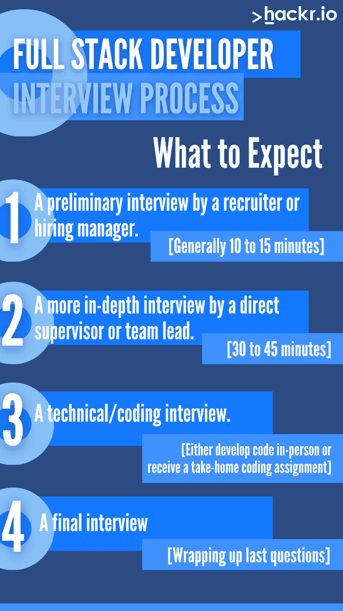
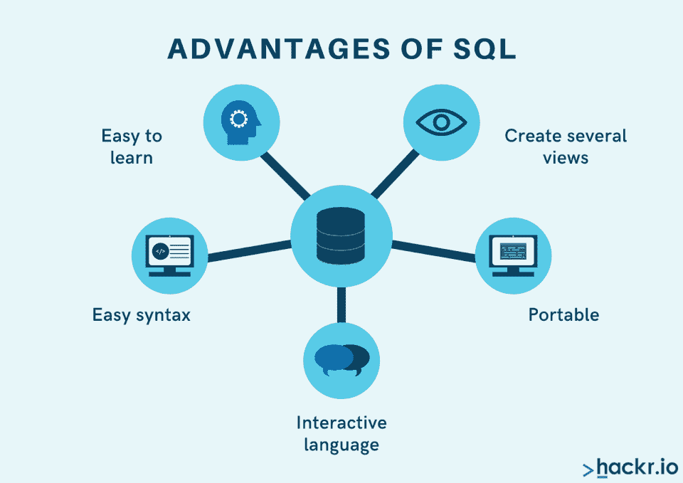

# 20 大全栈开发者访谈问答[2023]

> 原文：<https://hackr.io/blog/full-stack-developer-interview>

一个[全栈开发者](https://www.indeed.com/hire/job-description/full-stack-developer)是一个多面手；了解后端和[前端开发](https://hackr.io/blog/how-to-become-a-front-end-developer)来龙去脉的人。一大堆面试问题往往很全面，因此也很吓人。

我们编制了一份最重要的全栈开发面试问题列表，从技术问题到有关您工作经验的问题，供您练习和学习。

让我们来看看全栈开发人员职位最受欢迎的面试问题。我们将从讨论全栈开发者访谈的基本结构开始。然后，我们将深入探讨一些完整的开发人员面试问题。

## **什么是全栈开发者面试？**

首先:你能从全栈 web 开发者面试问题中期待什么？

如果这是你作为全栈开发者的第一次面试，你可能会紧张。但是不要担心。全栈开发人员的面试过程严格而清晰。

虽然这可能会有所不同，但大多数技术面试都分为 3 到 4 个阶段。这听起来可能很累人，但是一旦你完成了最初的阶段，你通常至少会得到一份工作。

1.  招聘人员或招聘经理的初步面试。初步面试通常持续 10 到 15 分钟，可能会包括一些技术问题，但不会太多。他们正在试探你是否有资格获得这个职位。
2.  由直接主管或团队领导进行的更深入的面试。现在，你将与主管、团队领导以及潜在的其他团队成员进行 30 到 45 分钟的面试。这次面试是为了看你是否有技术能力和“合适的人选”
3.  技术/编码面试。在这个阶段，你要么被要求亲自参加一次编码面试(在他们面前开发代码)，要么把一个项目带回家(比如开发一个 API 并送进去)。
4.  最后一次面试。可选，但有时会有一次与团队的最终面试，讨论你迄今为止的表现以及你的任何问题。

这是很长的一步。一些最大的 FAANG 公司可能需要几个月的时间来完成面试过程。但是，在这个过程中，你也提高了自己作为全栈开发人员的技能。

## **关于技术问题的快速说明**

如果您在网上寻找面向新生(初学者)的全套开发人员面试问题，您会看到许多技术问题，例如:

*   GraphQL 是什么？
*   描述一个 Rest API？
*   应该选择 jQuery 还是 React？

实际上，这些问题在全栈开发者访谈中很少被问到。作为一个全栈开发者，你已经提供了你的投资组合。虽然您应该*知道*这些问题的答案，但是全栈开发非常广泛。

你可能在面试 iOS 移动应用程序开发的职位，或者云计算企业 SaaS 开发的职位。你可能会面试 Python、JavaScript 或基于 COBOL 的银行应用程序，这些应用程序需要通过一系列越来越复杂的 API 来实现现代化。

因此，对于全栈 web 开发来说，没有任何真正的“技术问题”。

了解你的代码。了解你的循环、功能和策略。为编码面试做好准备。但是不要过分纠结于细枝末节。即使是最严格的雇主现在也在使用更多的“带回家”编程示例，而不是现场编码面试。

## **基础全栈开发面试问答**

作为一名全栈开发人员，您应该了解 HTML、CSS 和 JavaScript 的基础知识。你应该了解像 Python，Java，或者 C++这样的后端技术。您应该了解 SQL，以及潜在的特定技术，如 Microsoft SQL 和 MySQL。您需要了解版本控制、集成开发环境(ide)和代码卫生的基础知识。但是，你可能只有不到一年的经验。

### **1。什么是 SQL？**

SQL 或结构化查询语言是一种标准的数据库查询语言，用于访问和操作关系数据库中的数据。SQL 命令用于从数据库表中检索数据、向表中插入新记录、更新现有记录以及从表中删除记录。

### **2。SQL 与 NoSQL 有何不同？**

SQL 是一种标准的数据库查询语言，用于访问和操作关系数据库中的数据，而 NoSQL 是一种不使用 SQL 查询语言的非关系数据库管理系统。在功能上，NoSQL 通常用于大数据，而 SQL 用于传统数据。

### **3。什么是 GIT，为什么它如此重要？**

Git 是一个版本控制系统，允许开发人员跟踪文件的变更，并在多人之间协调对这些文件的工作。Git 通常用于协作软件开发项目，对于 DevOps 中的代码分支和合并至关重要。

### **4。什么是 HTML 标签、属性或元素？**

HTML 标签是定义网页结构和内容的代码元素。HTML 标签用于封装网页内容，如文本、图像和其他媒体。

HTML 属性是一个代码元素，它提供关于 HTML 标记的附加信息。属性通常指定元素的 id、类或样式。

HTML 元素是一个代码元素，表示网页上的一段内容。元素通常包含在 HTML 标记中。

### **5。HTML、CSS、JavaScript 在页面上的作用是什么？**

HTML 用于构建页面内容，CSS 用于设计页面内容的样式，JavaScript 用于为页面添加交互性或动态行为。在过去，这个答案是明确的。今天，它可能会变得模糊，特别是因为混合了两者的技术(框架)。

### **6。如何优化你的 HTML、CSS 和 JavaScript？**

您可以通过缩减代码、使用内容交付网络(CDN)或缓存静态资产来优化 HTML、CSS 和 JavaScript 代码。

### 7 .**。后端 web 开发最好的语言有哪些？**

您可以使用许多编程语言进行后端 web 开发，但流行的选择包括 PHP、Java、Python 和 Node.js (JavaScript)。

你的回答是一种观点，但要准备好支持它，并解释你的个人经历。

### **8。当今 web 开发的主要挑战是什么？**

web 开发的一些主要挑战包括扩展应用程序以满足不断增长的用户需求，管理数据安全和隐私问题，以及确保与各种设备和浏览器的兼容性。

几年前，web 开发的主要挑战是平台独立性，但是随着框架的使用，移动优化变得更加容易和自动化。

现在，您将深入了解反映经验的全栈开发人员面试问题和答案。你可能已经做了 2 到 3 年的开发人员。面试官会问一些关于你使用过的特定框架和技术的问题，比如 minification、SaSS 和 Bootstrap。你会被问到你在这个行业的经历和你参与过的项目。

### **9。你在全栈 web 开发方面有什么经验？**

全栈开发人员是指那些熟悉 web 开发项目各个方面的人，从设计和构建用户界面到设置服务器和数据库。但是通常，开发人员来自一个或另一个领域；他们实际上是具有一些 HTML/CSS/JavaScript 技能的后端开发人员，或者是具有一些 SQL 知识的前端开发人员。准确描述你在前端和后端开发方面的精通程度。

### 10。你用什么环境开发 web 应用？

今天大多数人从所谓的 LAMP 栈开始:Linux、Apache、MySQL 和 PHP。但是现在有越来越多的例外，开发者也在云上开发网络应用。例如，您可能主要使用 AWS 云计算服务器实例。

### **11。你的技术是什么？**

技术栈是开发人员用来创建 web 应用程序或网站的编程语言、工具、框架和库的组合。它也被称为解决方案堆栈或软件堆栈。

不同类型的应用程序需要不同的堆栈；例如，一个基本的 HTML/CSS 网站可能只需要一个文本编辑器。作为一名开发人员，您的技术栈是您喜欢使用的技术的总和，而不仅仅是您使用的语言。例如，您可能喜欢使用 Bootstrap、CakePHP 和 PHPMyAdmin。

### **12。你在数据库设计和开发方面有什么经验？**

数据库是任何 web 应用程序的关键部分，负责存储和检索数据。设计良好的数据库可以极大地提高应用程序的性能和可伸缩性。描述您设计和构建数据库的经验，包括关系数据库和非关系数据库。你最常用的技术是什么？

中级开发人员不仅应该有管理数据库的经验，还应该有开发数据库的经验。开发一个数据库不仅仅是关于结构和组织，还有优化。准备好描述你的过程。

### 13。你在服务器管理和开发方面有什么经验？

Web 应用程序通常托管在 web 服务器上，处理用户请求并返回适当的响应。描述您设置和配置 web 服务器的经验，以及您开发服务器端代码的任何经验。注意，并非所有全栈开发者都有服务器管理经验；不要害怕说你不知道。但是要明确自己的学习意愿。

### **14。你对 DevOps 有什么体验？**

DevOps 是一套实践，它将软件开发和操作结合起来，以简化向用户交付功能和更新的过程。今天，DevOps 对于创建能够快速工作并满足客户需求的代码是非常重要的。如果你没有 DevOps 的任何经验，可以考虑参加认证课程。

### 15。你在云计算方面有什么经验？

当你作为全栈开发人员被问到这个问题时，他们真的想知道你在云计算服务器上构建 SaaS 解决方案的经验。除了提供企业级资源管理之外，[云托管服务](https://www.cloudways.com/en/?id=1347120)上的 web 应用程序在功能上没有什么不同；您可以随时申请资源。但是，如果你曾经在谷歌或亚马逊的云上创建过应用程序，你就已经创建了云计算应用程序。

### 16。你如何保持你的编码技能？

也许不公平，但期待这个问题。大多数雇主希望听到你喜欢用自己的时间编程，并且保持自己的技能和敏锐。也许你正在做[代码挑战的来临](https://adventofcode.com/)或者从事个人视频游戏项目。也许你要去训练营。准备好带着对职业明确的热情诚实地回答这个问题。

事实是，不喜欢编码的人会精疲力尽，尤其是全栈开发人员。你想表明你喜欢你的领域。

## **高级、经验丰富的全栈开发者访谈问答**

面向有经验的开发人员的全栈开发人员面试问题和答案不太关注技术(他们知道你了解这些)，而是更多地关注你的工作习惯和与他人合作的经验。你如何应对紧迫的截止日期？你有管理经验吗？当危机来临时你会怎么做？你如何在压力下保持健康和快乐？

### **17。你曾经领导过开发团队吗？发生了什么，你学到了什么？**

对于一个有经验的开发人员来说，领导力是很重要的。即使您对管理角色不感兴趣，高级全栈开发人员也需要负责团队，并向他们传授原则和最佳实践。

我是上一个项目的团队领导。我把沟通和可见性放在第一位，钻研我们的 DevOps 策略，我们按时推出了产品。我学到了很多关于管理团队成员优势的知识——每个人都是不同的，做事情的方式也不同，但是通过利用这些优势，我能够创造出最好的项目。

### 18。描述一个出错的项目。今天你会做什么不同的事？

每个人都有那个噩梦般的项目。也许范围蔓延接管了。也许客户只是不知道他们想要什么。每个人都有失败的时候，尤其是在开发方面。重要的是你从这些失败中学习和成长的能力。

两个关键的利益相关者在项目的方向上有强烈的分歧。我们选择了对项目最有意义的方向，但是第二个利益相关者在最后一分钟退出了。我们应该在前进之前让它们保持一致，而不是抱最大的希望。

### **19。描述一个你无法解决或者花了你一段时间才解决的编程挑战。**

正如我们在“中级”全栈 web 开发人员面试问题中提到的，您应该将编程作为一种爱好和一种职业。这似乎不公平，但是雇主经常怀疑那些在业余时间不编程的人——感觉他们好像不喜欢这个过程。

在你的研究中，你可能遇到过至少一个你无法解决的编程挑战。描述一下它和你采取的步骤。通常，这是一个密集的数学问题——如果你不能在业余时间建立自己的物理引擎，没有人会反对你。

### 20。描述你如何处理你的代码审查。讨论一次你错了并被纠正的时候。

如果你是一个有经验的全栈开发者，你现在应该知道失败只是过程的一部分。有时我们没有 100%地工作。有时我们忽略了一个清晰的解决方案。但是，当自我成为障碍时，软件就不会被运出。谈谈你如何处理批评。如果你过去在处理这件事上有问题，描述一下你现在是如何处理的。

## **提示和技巧:如何登陆并准备一个完整的开发者面试**

要回答所有的面试问题，你首先需要进行面试。让我们来谈谈如何获得面试机会并为面试做好准备。

### **获得完整的开发者访谈**

如果你没有得到复试机会，可能是因为你的简历不够强。采取以下步骤:

*   建立强大的投资组合。你需要两到三个展示你技能的真实项目。
*   **打造一份好简历**。你的简历应该展示所有你熟悉的技术。包括所有你参加过的[网站开发课程](https://hackr.io/blog/best-web-development-courses)和[训练营](https://hackr.io/blog/free-coding-bootcamps)。
*   刷掉那个 LinkedIn。你会惊讶于招聘人员通过社交媒体联系的频率。
*   申请很多很多职位。今天，你可能会在面试前申请 40 甚至 100 个职位。
*   申请那些你并不总能胜任的职位。不是每个人都将拥有 10 年以上的 JavaScript。你可能不需要它。

把工作描述想象成一个“愿望清单”，而不是一系列要求。你需要很多申请才能得到面试机会。

### **参加全栈开发者面试**

面试后不接受跟进？你应该这样做:

*   **阅读职位描述，熟悉技术。**全栈开发涉及很多技术。
*   **跟进任何你无法回答的问题**。有时候就是当场回答不好。如果你以后想到更好的答案，就发邮件给他们。
*   **注重合身。面试官想知道你是否适合公司文化。在早期，他们会根据个性而不是技术敏锐度进行面试。不要害怕展示你的个性。**
*   **练习。**通过练习采访朋友和家人来建立自信。

大多数面试都是一样的——人们希望和他们相处融洽的人一起工作。许多受访者犯了这样的错误:只讨论他们的经验和技能，而没有建立融洽的关系。第一次面试(有时是第二次)通常是关于融洽的。

从你的简历和作品集，他们应该知道你在技术上很强。现在是时候展示你的团队精神了。

## **如何准备编码面试**

编码面试和面试本身有点不同。在编码面试中，你实际上解决了编码问题——有时是现场，有时是在家测验。编码面试问题通常包括循环、优化和框架方面的知识。

*   **尝试一些** [**web 开发实践项目**](https://hackr.io/blog/full-stack-project-ideas) **。实践项目是获得现实世界知识的一个好方法。**
*   解决编程难题和测验。这些谜题和测验在编码面试中经常被强调。
*   温习工作描述中提到的技术。如果是针对 Salesforce，你知道他们会希望你使用 Salesforce 专有的低代码语言。

编码面试是面试过程中最令人生畏的部分。确保你解释了你的代码和你的思考过程。他们不需要你完美。他们需要了解你的想法。

## **问题** ***你*** **面试时应该问的问题**

面试官经常会问你是否有问题要问他们。总是准备一些，比如:

*   你喜欢在这个行业工作的什么？
*   你最喜欢公司文化的哪一方面？
*   这家公司的发展道路是什么？
*   成功的关键指标是什么？
*   这家公司如何支持继续教育？

**[2023 年网络开发训练营](https://click.linksynergy.com/link?id=jU79Zysihs4&offerid=1045023.1565838&type=2&murl=https%3A%2F%2Fwww.udemy.com%2Fcourse%2Fthe-complete-web-development-bootcamp%2F)**

## **结论:今天就开始您的全栈开发者生涯**

面试不应该是可怕的。记住你也在面试他们。你想找到一个适合自己的职位，所以不要害怕问问题或大胆思考。

同时，请考虑:

## **常见问题解答**

#### **1。我如何准备全栈开发者面试？**

通过复习工作描述中提到的技能，提前练习面试，回顾你最近的一些项目来做准备。当然，还要复习一些常见的编码面试问题。

#### **2。全栈开发者访谈多长时间？**

全栈开发人员面试开始于 10 到 15 分钟的初步会面和问候。从那里，他们从 30 分钟到一个小时不等。预计你将需要经历多个阶段，根据职位的经验水平，可能需要几天、几周或几个月。

#### **3。全栈开发者面试难吗？**

是也不是。如果你了解自己的东西，它们应该不会很难——但它们可能会很有压力，很耗时。通过提前准备来降低难度。你参加的面试越多，你就越有信心。