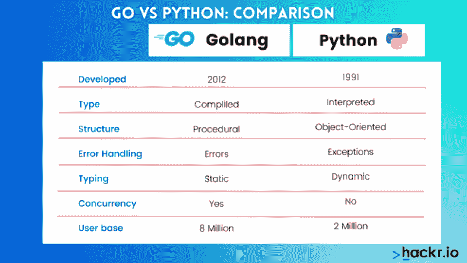
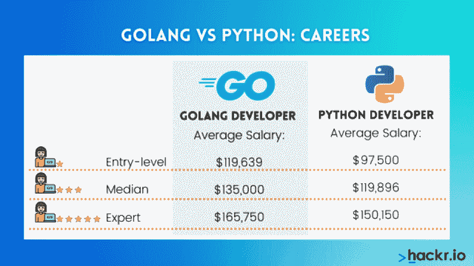

# Golang vs Python:应该学哪种语言？

> 原文：<https://hackr.io/blog/golang-vs-python>

Golang 和 Python 都是用于许多任务的通用编程语言。由于它们易于使用且受欢迎，因此经常被比较。但是他们有天壤之别。

*   Go 是一种用于微服务和 API 开发的轻量级、编译型、过程化语言。
*   Python 是一种面向对象的解释性语言，适用于 web 应用程序后端和移动应用程序开发等通用应用程序。

如果你在 Go 和 Python 之间做出选择，很可能是因为这两种语言都在快速发展，非常有市场。虽然 Go 在原始社区代码库方面落后于 Python，但它正迅速成为市场上最重要的语言之一。

Python 比围棋早二十年。但这并不意味着 Go 会把 Python 从宝座上打下来。今天，我们将深入了解 Go 语言 Python，以及何时应该使用一种语言而不是另一种语言。

| **深入了解**Golang 和 Python 都在需要学习的最佳编程语言列表中。其他语言包括 [Java](https://hackr.io/blog/what-is-java) ，C/C++，JavaScript，R，swift。 |

## Golang:一种用于微服务的轻量级编译语言

说到 API 开发，很少有语言像 Golang 这样有优势。Golang 旨在支持小型功能性微服务的构建。虽然它与 C 类似，但它增加了各种下一代特性:垃圾收集、结构化类型和内存管理。Go 比许多其他语言快得多，尤其是像 Python 这样的解释型语言。

**优点**:

*   更简单易用。
*   在虚拟机支持下编译。
*   自动打字和垃圾收集。
*   一种非常快速、轻量级和可伸缩的语言。

**缺点**:

*   更容易犯编程错误。
*   大型独立二进制文件。
*   一种没有太多支持的新语言。

简而言之，Go 是一种简单易用的语言，但这也是一把双刃剑。虽然你可以在 Go 中创造伟大的东西，但它也给了你犯错误的自由。

这里是“你好，世界！”在戈朗:

```
package main
import "fmt"
func main() {
fmt.Println("Hello, world!")
}
```

### **Golang 比 Python 好吗？**

很难说任何语言一定比其他语言“更好”，因为程序员针对不同的用例使用不同的语言。说到微服务、API 和其他快速加载特性，Golang 绝对优于 Python。

但是当涉及到自然语言处理或机器学习时，Python 的健壮性和可读性(以及其库的广泛性)开始发挥作用。

### **Golang 比 Python 硬吗？**

Golang 和 Python 都被认为是“容易学习”的语言，尽管它们可能需要一些时间来掌握。大多数程序员将能够使用这两种语言中的任何一种立即投入工作，但应该参加课程或[训练营](https://hackr.io/blog/free-coding-bootcamps)并参与练习题，以真正发展他们的技能。

### 是“GoLang”、“Golang”还是“Go”？

Golang 的实际名称是“Go”但是，当然，这有点难以搜索——因为这是一个必要的，也因为这是一个著名的流行，古老的游戏。“Golang”成为指代 Go 语言的方式部分是因为它的域名。

今天，人们交替使用“Golang”和“Go”这两个词。如果你想正确和被理解，那么你应该参考“Go 语言”

### 如何学习 Golang？

可以通过 Golang 认证课程学习 Golang，这也有助于向雇主证明你了解围棋的复杂性。但是因为围棋*是*这样一门简单的语言，它也可以通过项目、实验和快节奏的训练营来学习。

推荐 Python 课程

### [用 Python 完成从零到英雄的 Python boot camp](https://click.linksynergy.com/deeplink?id=jU79Zysihs4&mid=39197&murl=https%3A%2F%2Fwww.udemy.com%2Fcourse%2Fcomplete-python-bootcamp%2F)

Python:一种健壮的、解释性的通用语言

## Python 是一种高级、易学的编程语言，用于从 web 应用程序到机器学习人工智能的一切。Python 是世界上最流行的语言之一，也是世界上发展最快的语言。

因为它有如此多的用例(和如此重要的采用)，它被认为是就业市场上最理想的语言之一。同时，Python 确实有一些问题；作为一种解释型语言，它很难扩展——而且它结构上的宽松会产生有坏习惯的编码人员。

**优点:**

简单易学的通用语言。

*   由一个庞大而繁荣的社区支持。
*   更快的开发速度和更少的代码行。
*   机器学习和人工智能的领先语言。
*   **缺点:**

缓慢且不一定可扩展。

*   灵活性可以等同于坏习惯。
*   比围棋更老更严。
*   众所周知，Python 是一种非常灵活、简单的语言——但与 Go 相比，它似乎有些严格。虽然 Python 有更多的用例，但它也更难扩展。

这里是“你好，世界！”在 Python 中:

**Golang 是否正在取代 Python？**

```
print("Hello, world!")
```

### Golang 可以取代 Python 用于大多数应用，但这并不意味着 Golang *就是*取代 Python。不仅市场上有许多 Python 程序员，而且用 Python 开发的应用程序、插件和集成也比 Go 多得多。正因为如此，Golang 要真正取代 Python 还有很长的路要走。

更具体地说，Go 和 Python 有不同的用例。Go 主要用于 API 和微服务架构。它也可以用于 web 应用程序；任何必须是轻量级、快速和可伸缩的东西。但代价是在围棋中更难做出更复杂的作品。

同时，当代码的可读性和开发速度很重要时，就使用 Python。Python 是一种快速生产的语言，即使它不是一种快速执行的语言。用 Python 开发应用程序非常快——即使对那些不一定是编程专家的人来说也是如此。

**学完 Python 应该学 Golang 吗？**

### Golang 不仅仅是阅读起来很轻松；写起来很轻巧。由于其语法的简单性和相对狭窄的用例，Golang 非常容易学习。Python 程序员可能希望学习 Golang，以便在就业市场上获得优势，或者扩展他们的技能。

Python 和 Golang 都可以作为通用语言使用——但是因为它们的优点、缺点和用例有很大的不同，所以了解这两种语言绝对是值得的。一个既懂 Python 又懂 Go 的程序员会更全能。

**如何学习 Python？**

### 作为一种相对容易使用的语言，Python 可以通过浏览 [Python 教程和课程](https://hackr.io/tutorials/learn-python)或者启动[系列 Python 项目](https://hackr.io/blog/python-projects)来学习。

**Golang vs Python:概述和对比图**

## ****

**Go vs Python 结构:过程 vs 面向对象**

### 今天大多数健壮的语言都是面向对象的——这是有原因的。面向对象语言不仅使代码的生成更快更容易，而且还保证了代码的质量。Python 是面向对象的，而 Go 不是。

Go 是一种面向过程的语言，这意味着它没有类和对象；一切都是线性发生的，而不是针对某个特定的离散项目的行动。更多的代码重复出现在面向过程的语言中。

这种缺乏控制的情况会使 Go 更难控制，同时使编程变得更容易。换句话说，系统的自由最终意味着开发人员可以出于错误的原因得到正确的答案——他们可以用错误的方式产生功能代码。

但是这也是一些程序员反对 Python 的理由；它的动态类型和易于使用的语法会导致新程序员养成坏习惯。关心这个问题的程序员应该花时间从教程和课堂上正确地学习，而不是试图自己解决问题。

**Go 与 Python 性能:哪个执行更快？**

### 当我们谈论 Go 与 Python 的性能时，我们讨论的是代码编程后的一切。Go 是编译语言；它被编译然后打包。Python 是一种解释型语言；无论何时运行，它本质上都是“编译”的。

Go 的执行速度高达 Python 的 40 倍[。与任何编译语言相比，Python 都有不足之处。像 Python 和 PHP 这样的解释型语言永远不会像 Go 和 c 这样的编译型语言一样快或一样好。](https://getstream.io/blog/switched-python-go/)

**Go vs Python:每种语言谁用？**

### Python 主要由开发人员和程序员使用，而 Go 更可能由系统管理员、安全专业人员和其他维护大型代码库的外围人员使用。Python 和 Go 都被设计成对初学者友好的，但是 Go 更可能被那些编程学科之外的人使用。

**Go vs Python 速度:开发哪个更快？**

### 在编程中，当涉及到速度时，有多个因素。我们已经讨论了 Go 在原始性能方面比 Python 快得多的事实。但是还有开发和部署的速度。

当从头开始编写小规模项目时，Go 可能会更快。非常简单明了。但是当开发更大的项目或者可能需要开源库和社区代码库的项目时，很容易明白为什么 Python 可能有优势；使用 Python，已经为您做了相当多的工作。

对于部署，Go 可能需要更长的部署时间，因为它必须被编译、打包和分发。Python 将花费更少的时间来部署，因为它可以作为一种解释型语言连续部署。

**Python 和 Golang:哪个更好用？**

### 对于大多数程序员来说，Python 和 Go 都很好学。围棋可能更容易学，因为它是一种更小众、更狭隘的语言。如果你有符合围棋能力的用例，学围棋可能更好。如果你正在寻找一种更通用的语言，可以用于许多用例，学习 Python 可能会更好。

那么，Golang 和 Python 哪个更容易呢？这取决于你在发展什么，你的长期战略是什么。如果你想学一门能拓宽你的视野、让你更有市场的语言，这两种方法都可以。但是，如果您正在使用 API 或现有的特定代码库，那么您选择的语言更有可能很重要。

**Golang vs Python:Python 和 Go 的相似之处**

### Golang 和 Python 有很多不同之处。但是有两个主要的相似之处:可读性和用户友好性。大多数人可以很快学会这两种语言中的任何一种。大多数人将能够通过查看某人的 Python 或 Go 代码来判断它在做什么，即使他们事先没有代码库的知识。

**Python vs Golang:领养**

### 据估计，世界上大约有 800 万 Python 开发者。相比之下，Golang 程序员大约有[200 万](https://research.swtch.com/gophercount)。当你考虑到 Python 是在 1991 年发布的，而 Go 是在 2012 年发布的，这并不像看起来那么重要。作为一门语言，Go 正在迅速发展，这也是为什么许多人怀疑它有一天会超越 Python。

但在得出任何结论之前，请考虑 Python 也在快速发展——随着更多的程序员扩展到机器学习、深度学习和人工智能领域。此外，考虑到 Go 增长背后的原因与 Python 毫无关系。由于越来越依赖云解决方案、微服务架构和物联网设备，Go 正在突飞猛进地发展。

因此，虽然 Go 可能会继续增长，但这种增长不太可能会取代 Python 的增长。相反，这两种语言都由于它们的用例阵列而发展得非常快。

**Go 语言 vs Python:职业**

### ****

Golang 开发人员的平均工资为 135，000 美元，入门级职位的起薪为 119，639 美元。根据同一消息来源，Python 开发者的平均年薪为 119，879 美元，入门级职位[的起薪为 97，500 美元](https://www.talent.com/salary?job=python+developer)。

为什么差距如此之大？可能是因为 Go 开发人员已经是微服务或物联网专业人员，而 Python 开发人员更有可能是没有太多经验的“新手”程序员。即使是在初级职位上，这也很重要。

此外，知道围棋的人更少了。大部分大学毕业的人都懂一些 Python。

不管怎样，Go 开发人员和 Python 开发人员在就业市场上都很吃香，可以拿到六位数或接近六位数的薪水。

Python vs Go:你应该使用哪种语言？

## 对于大多数程序员来说，问题不是“学习哪种语言”，而是先学习哪种语言。除非你有一些理由想要了解更多关于微服务架构或 API 的知识，否则 Python 将会是更广泛、更健壮的语言。如果这将是你学习的第一门编程语言，那就更是如此。

但这并不意味着你从来没有学过围棋。如果你要使用微服务、API 或物联网设备，Go 会非常有用。围棋快速成长是有原因的；更多的公司需要 Go 程序员。因为 Go 是一种比 Python 更“现代”的语言，所以它也非常容易学习。

**结论**

## 一般来说，程序员通常懂三到四种语言。你学习的每一种语言都是你工具带上的另一种工具；解决编码问题和迎接编码挑战的又一次机会。但是由于 Go 是一种如此特殊的语言，在你开始学习它之前，考虑一下你是否会使用这种语言是值得的。

与此同时，Python 一直在快速发展，没有任何放缓的迹象。更好的是，一旦你学会了基础知识，从 Python 转移到其他语言*是非常容易的。不管怎样，Python 和 Go 都是最适合找工作的[编程语言](https://hackr.io/blog/which-programming-language-is-best-for-getting-a-job)的榜首。*

**人也在读:**

**People are also reading:**