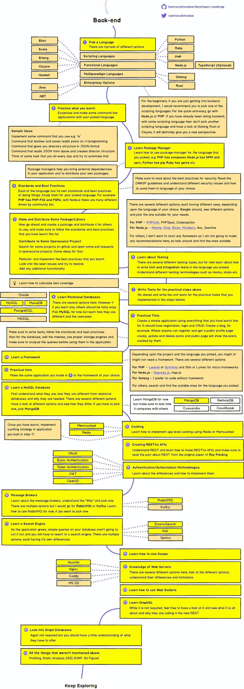

# 如何成为后端开发人员-学习途径

> 原文：<https://hackr.io/blog/how-to-become-a-backend-developer>

近年来，web 开发领域已经成为一个热点。随着网站获得越来越多的关注，组织已经意识到要获得更多的线索，他们需要有一个强大的在线存在。因此，他们寻找能够使用最新技术为他们设计和开发最好看、性能最好的 web 应用程序的人才。

当这是一个利润丰厚的领域时，肯定会有丰厚的利润。确实有！这就是为什么年轻一代被 web 开发作为职业所吸引是很自然的。然而，想要走一条职业道路和实际上追求它是两回事。它需要准备，一系列的步骤，相关的教育和实践。

如果你是一名有抱负的 web 开发人员，你需要知道的第一件事是 web 开发人员分为三类——前端、后端和全栈。根据你想成为哪一类的网络开发人员，要遵循的步骤会有所不同。在这篇文章中，我们将关注如何成为一名后端开发人员。我们将演示您需要遵循的流程的每一步。

那么让我们开始吧。

### 首先，谁是后端开发人员，他是做什么的？

您可能已经知道，在典型的[客户端-服务器架构](https://en.wikipedia.org/wiki/Client%E2%80%93server_model)中，应用程序数据存储在服务器端，并作为客户端的输出。web 应用程序的服务器端工作被称为后端。这是 web 应用程序所有内部工作发生的地方，也是后端开发人员的工作所在。

后端开发人员负责使用[编程语言](https://hackr.io/blog/best-programming-languages-to-learn)来创建代码，这实际上使网络应用程序按照它们应该的方式运行。这些开发人员编写的代码运行在 web 服务器上。除了编写后端代码，这类开发人员还负责开发这类 web 应用的移动版本所使用的 API。

### **如何成为后端开发者？**

学习后端开发有助于你熟悉几种编程语言，这对你的职业生涯有很大的帮助。如果你对逻辑是如何工作的有一个基本的了解，它可以被证明是相当有益的。如果没有，你可以随时报名参加一个基本的计算机语言课程，以获得接触的基础。这只是为了保证你一旦踏上学习后端开发的道路，在任何阶段都不会功亏一篑。

以下是您需要遵循的步骤:

#### **第一步:精通数据结构的基础知识&算法**

大多数 web 开发人员跳过这一步，进入[学习框架](https://hackr.io/blog/web-development-frameworks)。但是，了解数据结构和算法基础总是更好。虽然不深入，但你必须对这个过程有一个基本的概念。你应该修改基本的数据结构和算法栈、队列、链表、树、图、散列、排序&搜索算法，以及其他编程的核心概念。

#### **第二步:学习一门编程语言，选择一个框架。**

成为一名网络开发人员需要努力、时间和耐心。你不能指望任何人一夜之间学会不同的编码语言。所以，确定一个时间表和你想学的基本编程语言。像 [Python](https://hackr.io/tutorials/learn-python?ref=blog-post) 、 [PHP](https://hackr.io/tutorials/learn-php?ref=blog-post) 、 [Ruby](https://hackr.io/tutorials/learn-ruby?ref=blog-post) 、 [JavaScript](https://hackr.io/tutorials/learn-javascript?ref=blog-post) 这样的学习语言，近段时间比较抢手。

你可以同时学习多种编程语言。记住，越多越开心。此外，请注意，理解编程的基础是必须的。如果你还不熟悉它们，从 C、Java 或 Python 这样的语言开始，试着理解应用程序逻辑是如何工作的，编码的最佳实践等等。

#### 第三步:学习数据库的基础知识。

将数据库系统添加到您的投资组合中是下一个合乎逻辑的步骤。有许多易于使用的关系数据库管理系统可供您选择。今天几乎所有的网站都有某种存储，所以了解数据库总是有益的。

#### **第四步:学习框架**

根据你选择的编程语言，你可以学习至少一个框架的基础知识。无论是 Django 还是 Ruby-on-Rails；大多数框架遵循相同的 MVC(模型-视图-控制器)原则。虽然用编程语言编写整个应用程序代码是允许的，但这需要更多的努力、时间和大量的编码。然而，使用框架可以让您创建模板和代码，这些模板和代码可以在以后重用。这减少了您需要编写的代码行数。所以你变得更有效率。这就是为什么学习一个框架也是一个好主意。

#### 第五步:开始你的实践训练。

直到你真正开始实践，你才会明白事情是如何运作的。你需要定期使用工具和实践来更好地理解你到目前为止学到的伦理知识。最好的方法是做一些小项目或任务。你可以从做一些项目开始，比如简单的待办事项列表、简单的博客、照片库网络应用、简历生成器、基本的项目管理应用等。

#### **第六步:创新和创造新事物**

创新和原创想法在所有领域都受到重视。可能是科技领域最大的，因为他们可以改变整个游戏。如果你已经有了一个创业或项目的想法，那么你会做得很好。如果没有，你还有时间去思考和努力。

从构建创业克隆开始是好的。这意味着你可以克隆市场上的一些产品。此外，您可能会对以下有用的网站/应用程序感兴趣。

1.  Buffer——一种更智能的社交媒体分享方式——为各种社交媒体渠道安排帖子。
2.  你好吧——简单的 JavaScript 插件，帮助你完成营销工作。
3.  Airbnb/Fiverr——任何东西的市场

#### **第七步:托管— AWS / Heroku**

现在你已经准备好展翅高飞了！将您的产品部署在云服务提供商上，以便可以从 WWW 访问它。AWS 可以成为首选，因为它提供了近一年的免费托管(有限使用)。

你可能也感兴趣:[谷歌云与 AWS 和 Azure 的区别](https://hackr.io/blog/google-cloud-vs-aws-vs-azure)

### 你全都明白了吗？

好了，现在你知道了如何成为一名后端开发者，是时候升级游戏了。决定你是想做一名后端开发人员，还是想成为一名自由职业者。在大多数大型行业，成为后端开发人员也可能会增加你的收入。记住所有这些，努力写一份好的简历。最后，我们想说的是，除了灌输所需的技能，要成为一名成功的后端开发人员，你需要专注、耐心和努力。

这里是[完整的路线图](https://github.com/kamranahmedse/developer-roadmap "complete roadmap")，通过它你可以成为后端开发人员。

**想学 web 开发？udemy 的** [网站开发者训练营](https://click.linksynergy.com/deeplink?id=jU79Zysihs4&mid=39197&murl=https://www.udemy.com/course/the-web-developer-bootcamp/)课程对你来说是一个很好的 Kickstarter。

祝您的编程之旅一切顺利！

**人也在读:**