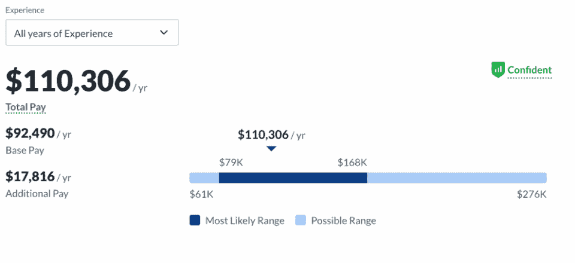
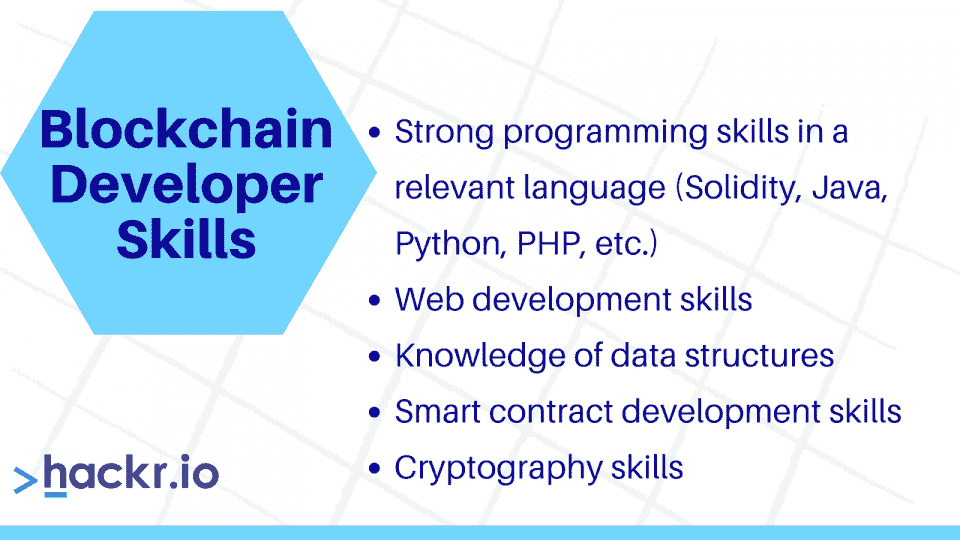
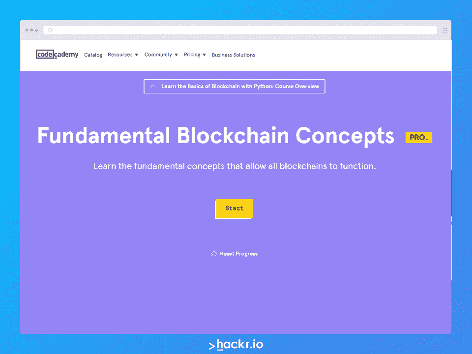

# 如何通过 6 个步骤成为区块链开发者

> 原文：<https://hackr.io/blog/how-to-become-a-blockchain-developer>

区块链技术最近风靡一时，如果你对这个领域有一点了解，就很容易明白为什么会这样。这项技术有可能改变我们互动和交换价值的方式，无论是金钱还是其他更无形的形式。数十亿美元被投入到金融和其他用例中，该行业正在蓬勃发展。

出于这个原因，如果你想转行，成为一名区块链的开发者可能是一个明智的决定。很多这样做的人都是通过自主学习和持之以恒做到的，你可以想想。这篇文章将告诉你如何成为一名区块链开发人员，并对区块链技术及其组成概念有所了解。

## **什么是区块链？**

很简单，区块链就是一串包含数据的块。更具体地说，区块链是由数百万台计算机管理的一系列带有时间戳的不可变数据记录。它不归任何单一实体所有，并使用加密原则来确保数据的真实性。每一个区块都是独一无二的，经过数百万台电脑的验证和确认后被添加到链中。

把一个块想象成分类账中的一页。它在验证后的新块中记录最新的事务。每个块都有前一个块和当前块的地址。

第一个实际上可以正常运行的区块链是现在传说中的比特币。这是一种加密货币或分散的虚拟货币，不需要中间人或银行来验证每个用户的持有量。银行在金融界扮演着中央集权的角色，确保每个人的账目准确无误。有了比特币，数百万台电脑验证了这些信息，交易是公开的，信息是不可改变的。

以太坊将事情向前推进了一步。它促进了“智能合同”的使用，这是一种提供比金融更大潜力的程序。它导致了过多的 dapps(去中心化应用),并使区块链图灵完备——也就是说，它提供了更多的可编程性。

## **区块链开发者是做什么的？**

区块链的发展有很多可能性。你可以很快开始你自己的区块链，但是你不太可能通过这种方式找到职业，除非你脑子里有自己的商业想法。

更有可能的是，你会发现自己学会了[区块链的工程技能](https://hackr.io/blog/blockchain-programming-beginners-guide)，然后将这些技能应用到一家初创公司的工作中——或者是一家刚刚开始从事这项技术工作的大型知名公司。

换句话说，您将在现有的区块链平台上进行构建和开发。这可能还涉及前端和后端工作，以及一般的设计任务。

智能合同开发技能也很受欢迎。许多区块链项目和公司正在寻找智能合同开发人员来构建新的用例并完善现有的用例。

区块链开发商可能会发现自己承担了以下责任:

*   开发智能合同
*   开发[不可替代的令牌项目](https://capital.com/best-nft-projects-10-picks-to-watch-in-2021)
*   设计区块链协议
*   设计共识协议和安全模式
*   设计网络架构
*   为 dapps 开发交互式前端设计

## **为什么要成为区块链开发者？**

[来源](https://www.glassdoor.com/Salaries/blockchain-developer-salary-SRCH_KO0,20.htm)

从纯粹以职业为导向的角度来看，区块链产业正以惊人的速度增长，预计到 2030 年价值将达到 1375.9 亿美元。从 2020 年 9 月到 2021 年 7 月的十个月里，仅在一个求职平台上，区块链相关的岗位的[数量就增加了 118%。](https://blockchaintrainingalliance.com/blogs/news/blockchain-career-job-outlook-in-2022#:~:text=Indeed.com%20reported%20blockchain%2Drelated,September%202020%20to%20July%202021.)

接下来的事实是，你将致力于尖端技术，开发一些最先进的金融应用程序，帮助数百万贫困人口。一个人可以开发的应用范围实际上是无限的，所以你可能会发现自己希望开始自己的事业。

越来越明显的是，区块链技术将在几个行业中发挥作用，在新老公司中都是如此。对于那些愿意付出努力的人来说，机会很多，而且他们可能会因此获得丰厚的回报。区块链开发人员在科技领域的平均年薪最高，通常在 12.5 万美元到 17.5 万美元之间。 [Glassdoor](https://www.glassdoor.com/Salaries/blockchain-developer-salary-SRCH_KO0,20.htm) 目前称，区块链开发者在美国的平均年薪约为 11 万美元。

## **区块链开发者有哪些技能？**

****

一个区块链开发人员将拥有相当多的与传统技术角色相同的技术技能。这些包括相关的编程语言、数据结构和网络开发的坚实基础。

此外，他们还需要精通密码学和智能合约开发。这绝不是一个详尽的列表，但涵盖了大部分的要点。

## **如何成为区块链开发者**

即使这个行业刚刚起步，你也可以采取一些明确的步骤，让自己处于开始职业生涯的位置。以下是步入正轨的良好指南。

### **1。学习区块链开发理论**

这个领域有几个术语你必须了如指掌。这些在你从事的几乎所有角色和项目中都是常见的，所以你需要彻底了解这个理论。

这些概念包括区块链本身、共识机制、矿工和利益相关者(或验证者)、公共和私有地址、智能合同、钱包、节点和一般加密经济学。

你不必感到不知所措。[区块链课程](https://hackr.io/blog/best-blockchain-courses)(甚至是独立学习)可以让你在这些想法中走得很远。

### **2。报名参加区块链课程**

区块链课程是学习区块链开发、智能合约开发、共识算法和加密货币经济学背后的理论的良好基础。它肯定会指导你如何成为一名区块链开发人员或稍微不同的(如果迂腐的话)加密开发人员。

在几个教育平台上有几门区块链课程。杜克大学提供了一门关于 Defi 的专业课程，而这门关于区块链基础知识的 T2 Udemy 课程是一个很好的起点。查看我们关于[最佳加密和区块链教程](https://hackr.io/blog/best-cryptocurrency-blockchain-tutorials)的文章，获得更多指导。

这条道路将提供几个明确定义的任务，你必须检查，以成为一名区块链开发人员-也给你机会与同学互动。

更不用说你可以利用的许多书籍(其中一些是免费的)和在线资源了。

### **3。构建实际的区块链**

这是你的学习之路变得更加有趣和富有挑战性的地方。信不信由你，你实际上可以在 10 分钟内构建一个区块链，尽管这需要一些预先的编码知识。

区块链开发常用的编程语言有 [C](https://hackr.io/tutorials/learn-c) 、 [C++](https://hackr.io/tutorials/learn-c-plus-plus) 、 [Solidity](https://hackr.io/tutorials/learn-solidity) 、 [Golang](https://hackr.io/tutorials/learn-golang) 和 [Python](https://hackr.io/tutorials/learn-python) ，虽然还有很多其他的。

虽然我们不会在这里介绍整个过程，但可以说您必须学习如何创建块和块中的数据，以及总体区块链。你还应该学习如何创造一种加密货币。

### **4。智能合约代码**

有了基本的区块链，你可以继续学习如何创建智能合同。这在最基础的层面上也很容易实现，尽管像资源管理和安全性这样的想法会随着时间和经验而出现。

如果你想要一个如何编写智能合同的快速课程，请查看 [CryptoZombies](https://cryptozombies.io/) 。这将教你如何在变得可靠的同时变得有趣，因为它可以帮助你制作你的密码收集游戏。

### **5。加入区块链开发小组**

与其他编程领域一样，加入一群志同道合的人将对你的教育和职业发展大有裨益。在 [Github](https://github.com/topics/blockchain) 、 [Reddit](https://www.reddit.com/r/CryptoTechnology/) 论坛、 [StackExchange](https://bitcoin.stackexchange.com/) 上互动，与其他开发者联系，提高自己的技能。

### **6。保持编码和联网**

有了足够的经验和实践，你会发现自己有能力申请区块链发展相关的职位。你必须保持你的技能敏锐，并不断地做项目，这将在潜在的面试中作为你的投资组合。不要忘记与其他开发者和普通加密社区交流。很快，你就有信心去找工作了！

## **开始区块链开发者之旅**

你必须投入时间和精力成为一名区块链开发者。这不会在一夜之间发生，但是很快你就会有足够的自信让自己脱颖而出。重点是你开始了。使用上面列出的指导并坚持下去，你很快就会感谢自己。

## **常见问题解答**

#### **1。成为区块链开发者需要多长时间？**

这将取决于个人的能力，但你要期待自己在 3 到 6 个月内编写自己的项目代码。至于你作为区块链开发者的第一份工作，这可能需要至少 12 个月的时间。

#### **2。区块链需要编码吗？**

是的，区块链开发确实需要编码。区块链开发中使用了几种编程语言，如 C、Python 和 Golang。

#### **3。区块链开发者有需求吗？**

是的，区块链开发商非常抢手。该行业预计在未来几年将增长到 1000 亿美元以上。2020 年第三季度至 2021 年年中，相关头寸也翻了一番。

#### **4。一个区块链开发者的工资是多少？**

区块链开发者的平均年薪在 12.5 万美元到 17.5 万美元之间。当然，这里可能会有一些偏差，最高级别的工作提供更多。

**人也在读:**