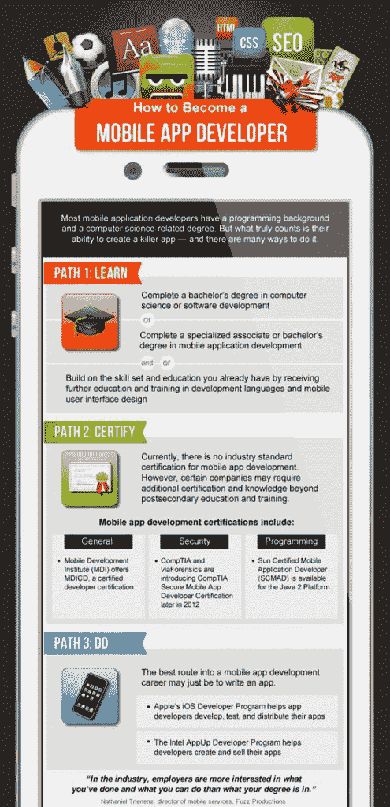

# 如何成为一名手机 App 开发者？[逐步指南]

> 原文：<https://hackr.io/blog/how-to-become-a-mobile-app-developer>

移动应用行业非常庞大，预计在未来几年内还会增长。事实上，研究表明，移动应用行业的总价值将增加到 1889 亿美元。

随着这种增长，市场将非常有利可图。你可以为自己的企业制作一个移动应用程序，也可以开始移动应用程序开发生涯。

你不必回到大学去攻读计算机科学学位。当然，你可以那样做，但是这需要很多时间和金钱。这就是为什么我们决定为你成为应用开发者提供一个可行的指南。

## 如何成为一名移动应用开发者

在这篇文章中，你会发现成为一名成功的移动应用开发者的五步指南。让我们开始吧。

## 选择一个主要平台

学习开发移动应用程序的第一步是选择一个主要的平台。你会发现很多，比如 Android，iOS，Windows，Symbian，和 Blackberry RIM。然而，很明显，Android 和 iOS 正在主导移动行业。Windows 10 应用程序可能仍然相关，但它仍然不是最赚钱的平台。因此，选择 iOS 应用或 Android 应用来开始您的旅程将是一个明智的选择。

一个与另一个完全不同。你需要考虑你想专攻哪一个。当然，你可以尝试掌握所有的东西，但是不推荐这样做。最好只涵盖一个，然后逐渐扩展你的视野，将其他应用程序开发平台也包括进来。

## 学习基本的背景技能

要成为一名移动应用程序开发人员，必须具备必要的软件开发技能和知识。

但是在你进入编程的世界之前，回答一个简单的问题是很重要的

你到底从哪里开始？

可能有三种情况。

*   你是一名 web 开发人员，正在学习移动应用程序开发。在这种情况下，您会发现许多有用的平台可以帮助您过渡到移动应用程序开发，如 Appcelerator Titanium。
*   您可能以前没有做过任何编码，但是您对面向对象编程是如何工作的有一个基本的概念。在这种情况下，你很容易理解和学习如何开发移动应用程序。

三。你完全是个初学者。在这种情况下，最好上一堂简短的计算机科学入门课。你可以很容易地在 Coursera、edX 等网站上找到这样的课程。，这也是免费的。

既然你知道你的立场，你做决定就容易了。下一步包括:

## 掌握编码技巧

一旦你选择了你的平台，下一步你需要做的就是学习它的核心概念。

#### **对于 iOS，**

你将需要[学习 Swift](https://hackr.io/tutorials/learn-ios-swift?ref=blog-post) 或者 Objective-C .但是你如何选择呢？这完全取决于你学习移动应用程序开发的原因。

如果您正在学习开发应用程序来创建自己的产品，那么 Swift 将是一个明智的选择。Swift 于 2014 年推出，从那以后，它收到了大部分积极的反馈。

然而，如果你打算成为一家移动应用程序开发公司的 iOS 开发人员，最好的选择可能是先学习 Objective-C。主要是因为大量的文档是为 Objective-C 编写的，而现在仍有数以千计的 iOS 应用程序是用 Objective-C 构建的，你可能需要它来维护或修复代码。

苹果提供了 iOS 开发者库，这是有据可查的。你会发现很多教程和视频可以帮助你学习编码。它帮助你将 iOS 开发程序的复杂性分解成小的基本部分，以便于理解。事实上，有很多关于 iOS 开发的很棒的博客。

#### **对于安卓系统，**

要在 Android 平台上开发应用，你需要了解 Java 或 Kotlin。对于那些不知道它如何工作的人来说，你需要一门编程语言 Java 的入门课程。最好的起点是谷歌的 Android 开发者库。同样，这些都是非常详细的记录，并有一套全面的培训材料。

在你决定选择 Android 之前，你应该意识到市场上有许多不同类型的 Android 设备。开始的时候会有点复杂。但是一旦过了这一关，你就有潜力到达更广阔的市场。

此外，您还可以订阅 Android 每周简讯，了解最新的软件。

#### **使用手机应用开发软件**

为自己的产品开发应用程序的另一个选择是使用移动开发软件。你甚至不需要编码，它通常有成千上万的模板让你入门。

### 练习你的技能

知道如何编写代码仅仅是构建一个应用程序的开始。最好的结果来自编写和实践干净的代码和文档。你可以这样组织你的练习:

#### I .开发一个应用程序创意

从开发一个应用程序创意开始。找出人们在日常生活中面临的问题。把它们列出来，选出最有意义的一个。一旦你决定了，就开始设计你的应用程序。

#### 二。展示应用程序的详细信息

开发协议时另一件重要的事情是确保你的应用程序易于理解。用户应该能够在不参考其他页面的情况下进行导航。此外，你还需要弄清楚应用程序的功能。如果你想让你的用户留下来，建立一个优秀的用户界面是至关重要的。

#### 三。合作或雇佣你需要的人

当你开始时，你可能无法独自开发完整的应用程序。例如，你可能擅长编码，但可能缺乏设计技能。最好向已经是该领域专家的人寻求帮助。

你可以聘请专家，或者与同意帮助你的人合作。

#### 四。测试你的应用

一旦你完成了应用程序的开发，你需要进入测试阶段。在任何软件的第一次裁剪中，缺陷都是不可避免的。

你可以让你的朋友下载应用程序，让他们通过它来玩。如果他们注意到任何故障，他们可以向您传达同样的信息。反馈将帮助你了解什么在应用程序中可行，什么不可行。

[完整的 2023 年网络开发训练营](https://click.linksynergy.com/link?id=jU79Zysihs4&offerid=1045023.1565838&type=2&murl=https%3A%2F%2Fwww.udemy.com%2Fcourse%2Fthe-complete-web-development-bootcamp%2F)

### 转换到其他平台

因此，一旦你掌握了一个平台，是时候尝试一下其他领域了。否则，你会错过客户，如果你不这样做。每个平台都有自己的一套功能，你必须相应地修改你的应用程序。

在这里，我们分享信息图表，通过你可以更好地理解它:

**出处:**hongkiat.com

## 最后的想法

就这样。总之，我们建议不要马上开始学习移动应用程序开发。相反，在你学习移动应用程序开发的同时，花时间想想你想从事的项目。

**人也在读:**