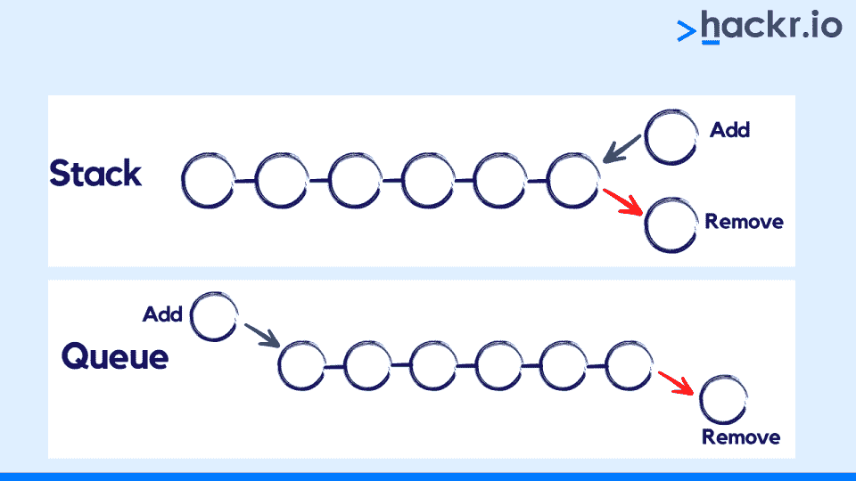
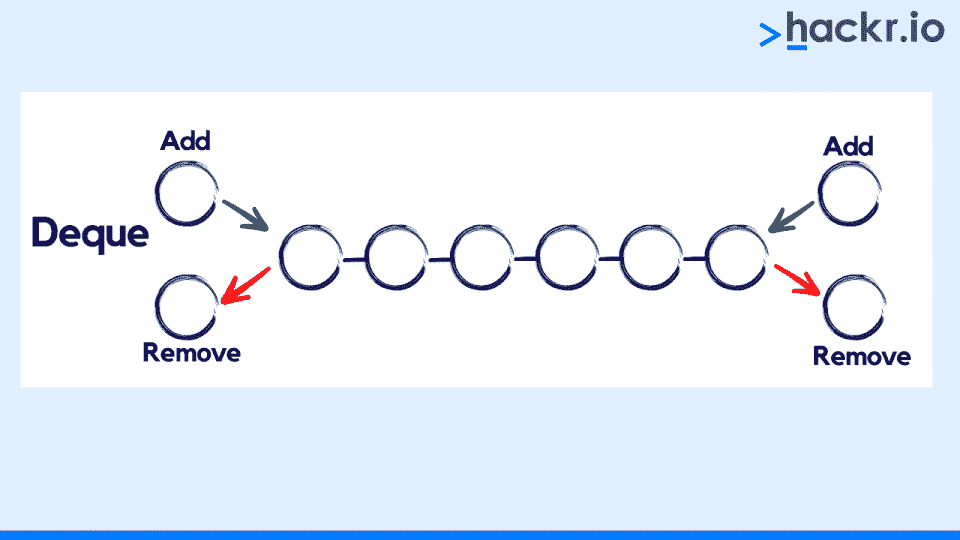

# 如何使用 Python Deque 实现快速高效的队列

> 原文：<https://hackr.io/blog/how-to-use-a-python-deque>

对于经常使用 [Python](https://hackr.io/blog/best-python-courses) 编写代码的人来说，这个列表是最常用和最熟悉的数据集合之一。它们是优秀的数据结构，具有许多有用的功能，允许用户添加、删除和排序项目。毫无疑问，对于许多情况来说，这个列表是正确的选择，但是 Python 也提供了更适合某些情况的替代方法。

例如，列表可能不是实现堆栈或队列抽象数据类型的最佳数据结构。这是因为列表不是线程安全的，这意味着如果多个线程试图同时访问和修改同一个元素，事情可能会出错。这给了我们错误信息和不一致的数据。

队列抽象数据类型是先进先出(FIFO)数据问题中最流行的数据结构之一。我们可以有效实现队列的一种方法是使用双向链表。对于需要快速访问队列的第一个和最后一个元素的应用程序来说，这是非常理想的。

在这篇博文中，我们将看看 Python deque(Python 标准库提供的双端队列数据结构)。我们将看看什么是 dequee，我们将介绍如何使用 Python deque 实现来创建和操作数据结构。

## **Python 中的一个 Deque 是什么？**

deque 也称为双端队列(发音为“deck”)，是一个有序的项目集合，您可以将新项目添加到队列的前面或后面。Deques 类似于 list，但是在从列表的开头或结尾添加或删除项目时更有效。



Deques 通常用作队列，但是您也可以将它们用作堆栈。

当用作队列时，我们将项目添加到队列的一端(通常是后面)，并从另一端(通常是前面)移除它们。这代表了项目先进先出(FIFO)队列的定义质量。

当用作堆栈时，我们将项目添加到队列的一端(通常是后面)，并从同一端(也通常是后面)移除它们。这意味着队列可以代表堆栈的后进先出(LIFO)行为。

Python 将 deque 实现为双向链表。列表中的每个节点都有对上一个节点和下一个节点的引用。头节点引用尾节点，尾节点引用头节点。

## **为什么要使用 Python Deque？**

当您需要从前面添加或移除元素(索引 0)时，列表不是最佳选择。在这些情况下，整个列表必须向右移动，以便为新添加的元素腾出空间，或者列表必须向左移动，以便填充新删除的元素的空白。在这两种情况下，花费的时间随着列表的大小线性增长。这意味着这些操作具有 O(n)的[时间复杂度](https://hackr.io/blog/big-o-notation-cheat-sheet)，或者线性时间复杂度。

然而，如果你使用*。append()* 方法将一个元素添加到一个列表的末尾，那么这将是一个非常快速的操作，具有恒定的时间复杂度，或者 O(1)。类似地，如果你使用*移除最右边的元素。pop()* 方法，那么这个也同样一样快。

当试图访问前面的元素时，Deques 解决了与列表相关的问题。这是因为 deques 是作为一个双向链表实现的，具有同样稳定和快速的追加和弹出操作。这意味着 deques 可以为我们提供线程安全和内存高效的追加，并以近似恒定的时间复杂度或 O(1)从队列的任意一端弹出。

## **Python 的德格特征**

广义线性队列抽象数据类型要求插入必须发生在一端(通常是后端)，删除必须发生在另一端(通常是前端)。这代表了队列的 FIFO 特征，它会导致元素插入和删除的一些限制。

然而，Python deque 允许我们访问队列的两端进行插入和删除。



**以下是 Python deque 的特征:**

*   Deques 允许内存高效和线程安全的追加，并从队列的任何一端弹出，两端的时间复杂度大致不变，即 O(1)
*   Deques 可以用各种数据结构有效地实现，包括数组、链表和树
*   在许多算法和数据结构中，Deques 可以作为列表的替代
*   Deques 比 lists 具有更可预测的最坏情况性能
*   Deques 比 lists 更容易“正确”使用
*   Deques 比 lists 更灵活
*   在许多情况下，Deques 比 lists 更有效
*   Deques 可以有效地向左或向右旋转，这被称为“循环缓冲区”
*   Deques 是跟踪列表头部和尾部元素的好选择
*   无需创建新列表或复制现有数据，就可以轻松反转 Deques
*   当存储大量元素时，队列比列表消耗更少的内存
*   Deques 可以用作 FIFO 队列或 LIFO 堆栈
*   deque 是一个双端队列，这意味着它可以用作堆栈或队列
*   deque 是一种线性数据结构，支持两端的快速插入和删除
*   deque 通常实现为动态数组，可以根据需要调整大小
*   deque 可用于实现其他数据结构，包括堆栈、队列或优先级队列

现在我们已经看到了 deque 的特征，让我们看看 Python 中 deque 的类型。

## **Python Deque 的类型**

根据限制操作的方式，队列可以是以下两种类型之一:

1.  输入受限的队列
2.  输出受限的队列

### **输入受限的队列**

输入受限的双队列是一种数据结构，它允许从双队列的任一端删除元素，但只允许在双队列的一端插入元素。

输入受限的队列通常用在需要队列的应用中，但是元素的顺序并不重要。例如，我们可以使用一个输入受限的队列来存储需要处理的 CPU 任务。CPU 可以从队列的前面移除并处理第一个任务，而不用关心队列中剩余任务的顺序。

输入受限的 deques 也经常用在空间有限的应用中。这是因为它们只需要两个指针(一个用于 dequee 的前面，一个用于后面),并且不需要连续的内存来存储数组中的 dequee 元素。

### **输出受限队列**

受输出限制的双端队列是一种数据结构，它允许从双端队列的任一端插入元素，但只允许从双端队列的一端删除元素。

在需要 FIFO 队列的灵活性，但又需要从队列后面删除元素的情况下，这种类型的 deque 非常有用。例如，如果您使用一个输出受限的 dequee 实现了一个 LIFO 堆栈，您将能够在堆栈的顶部(dequee 的后面)推入(插入)和弹出(删除)元素。

总的来说，输出受限的队列是一种通用的数据结构，可以在各种情况下使用。如果您需要队列的功能，但是还需要从队列后面删除的灵活性，那么这种类型的 deque 就很有意义。

## **一个队列的特征**

Deques 允许我们执行几种类型的操作:

*   追加项目
*   流行项目
*   访问项目
*   旋转项目

更明确地说，这些对象支持以下 Python deque 方法:

| **方法** | **描述** |
| *。append()* | 将元素添加到队列的右侧 |
| 【t0 . append left()】的缩写形式 | 将元素添加到队列的左侧 |
| *。clear()* | 从队列中删除所有元素 |
| *。copy()* | 创建队列的副本 |
| *。count()* | 计算给定元素出现的次数 |
| *。extend()* | 通过添加元素来扩展队列的右侧 |
| *。extendleft()* | 通过添加元素来扩展队列的左侧 |
| *。索引()* | 返回元素在队列中的位置 |
| *。insert()* | 在给定位置插入元素 |
| *。pop()* | 从队列右端删除并返回一个元素 |
| *。popleft()* | 从队列左端删除并返回一个元素 |
| *。remove()* | 删除第一次出现的给定值 |
| *。反向()* | 反转队列中元素的顺序 |
| *。旋转()* | 基于给定的参数旋转队列 |
| 【T0 .麦克斯韦(): | 返回队列的最大大小 |

上表显示了我们可以对一个 deque 对象执行的不同操作。在下一节中，我们将创建一个 deque 对象，并在 Python 中执行这些操作。

## **Python 上的操作队列**

在 [Python](https://hackr.io/blog/best-way-to-learn-python) 标准库的集合模块中， [deque](https://docs.python.org/3/library/collections.html#collections.deque) 是一个可用的类。我们可以从集合模块导入 Python deque，并且可以对 dequee 对象执行不同的操作。在下一节中，我们将探索一个 Python deque 示例。

### **将元素插入到 Python 队列中**

首先，让我们创建一个空的队列，然后执行几个操作:

```
from collections import deque

seq = deque() #create an empty deque
print(seq) #print the deque

seq.append(1) #use append() to insert element at right end
print('The deque after appending right:',seq) #print the deque

seq.appendleft(2) #use appendleft() to insert element at left end
print('The deque after appending left:', seq) #print the deque

seq.extend([4,5]) #use extend() to insert several elements at the right end
print('The deque after extending right:', seq) #print the deque

seq.extendleft([6,7]) #use extendleft() to insert elements at the left end
print('The deque after extending left:', seq) #print the deque

seq.insert(3,2) #use insert() to insert the value 2 at 4th position
print('The deque after inserting element:', seq) #print the deque​
```

上述代码输出以下内容:

```
deque([])
The deque after appending right: deque([1])
The deque after appending left: deque([2, 1])
The deque after extending right: deque([2, 1, 4, 5])
The deque after extending left: deque([7, 6, 2, 1, 4, 5])
The deque after inserting element: deque([7, 6, 2, 2, 1, 4, 5])
```

这里发生了什么？在第一步中，我们从集合模块中导入了 deque 类。在第二步中，我们创建了一个没有值的 dequee 对象的新实例，这意味着我们创建了一个空的 dequee。

在这之后，我们使用了*。append()* 方法将一个元素添加到 deque 的右侧。然后我们使用了*。appendleft()* 方法将元素' 2 '添加到 deque 的左侧。

同样，我们使用了*。extend()* 方法将元素[4，5]添加到 deque 的右侧，我们使用了*。extendleft()* 方法将元素[7，6]添加到 deque *的左侧。*在最后一步，我们使用了*。insert()* 方法在第四个位置添加元素“2”(这是索引 3)。

现在，让我们看看如何从一个 deque 对象中删除元素。

### **从 Python 队列中移除元素**

现在，我们将介绍从 Python 队列中移除元素的不同方法。

```
from collections import deque

seq = deque([1,2,3,4,5,6]) #create a new deque
print(seq) #print the deque

seq.pop() #use pop() to remove right most element
print(seq) #print the deque

seq.popleft() #use popleft() to remove leftmost element
print(seq) #print the deque

seq.remove(3) #use remove() to remove the given element
print(seq) #print the deque

seq.clear() #use clear() to clear all elements in the deque
print(seq) #print the deque
```

上述代码输出以下内容:

```
deque([1, 2, 3, 4, 5, 6])
deque([1, 2, 3, 4, 5])
deque([2, 3, 4, 5])
deque([2, 4, 5])
deque([])​
```

在第一步中，我们从 collections 模块导入了 dequee 类，然后定义了一个新的 dequee 对象。然后，我们使用了*。pop()* 方法从 deque 对象中移除最右边的元素。我们也使用了*。popleft()* 方法删除最左边的元素。在这之后，我们使用了*。remove()* 方法通过传递一个参数来移除元素“3”。最后，我们使用了*。clear()* 方法来清除 dequee 中的所有元素，这留给我们一个空的 dequee 对象。

在下一节中，我们将探索 deque 提供的更多操作。

### **Python 上的其他操作队列**

除了添加和删除元素，我们还可以执行其他操作，包括计算元素数量、查找元素索引、旋转 deque 对象等。以下代码显示了这些操作是如何工作的:

```
from collections import deque

seq = deque([1,1,2,3,4,5,6]) #create a new deque
print(seq) #print the deque

a = seq.count(1) #count the occurrence of 1
print('Count of 1 is:', a) #print the count of 1

b = seq.copy() #copy the deque object using count()
print(b) #print the deque

c = seq.index(2) #get the index of the element 2
print('The index of 2:', c)  #print the index

seq.reverse() #reverse the deque object using reverse()
print(seq) #print the deque

seq.rotate(1) #rotate the deque object to the right
print(seq) #print the deque
```

上述代码输出以下内容:

```
deque([1, 1, 2, 3, 4, 5, 6])
Count of 1 is: 2
deque([1, 1, 2, 3, 4, 5, 6])
The index of 2: 2
deque([6, 5, 4, 3, 2, 1, 1])
deque([1, 6, 5, 4, 3, 2, 1])
```

在第一步中，我们从 collections 模块导入了 dequee 类，然后创建了一个 dequee 对象。接下来，我们使用了*。count()* 方法来计算 deque 中“1”的出现次数，并打印结果。然后我们使用了*。copy()* 方法将 deque 对象复制到变量‘b’中。我们使用了*。index()* 方法返回随机元素的索引，' 2 '。我们也用了*。reverse()* 方法来反转 dequee 对象，最后我们用。rotate()方法和参数“1”。

这些是可以在 deque 对象上执行的一些操作。我们可以在 Python deque 实现中使用的其他方法包括*。maxlen()，。len()和。反转()。*

## **结论**

Python deque 是一种重要的数据结构，有许多应用。在本文中，我们讨论了什么是 dequee，以及我们可以对 dequee 对象执行的不同操作。Deques 主要用于以下情况:

*   我们需要快速的时间复杂度
*   我们需要一个小的内存足迹
*   我们想要创建一个 LIFO 堆栈
*   我们想创建一个 FIFO 队列

要了解更多关于成为 Python 专家的信息，请查看我们的[Python 编码简介](https://hackr.io/blog/python-programming-language)文章，以及[顶级 Python 面试问答。](https://hackr.io/blog/python-interview-questions)

## **常见问题解答**

#### **1。Python 中的队列和队列是什么？**

队列是一种抽象数据类型，它用 FIFO 排序来表示元素列表。deque 是一个内置的 Python 数据结构，它表示一个双端队列，可以从两端添加或删除元素。

#### **2。一个 Python 的 Deque 是列表吗？**

不，一个队列不是一个列表。deque 是它自己的数据结构，类似于一个列表，但是具有额外的功能。

#### **3。Python 中的队列比队列好吗？**

这个问题没有明确的答案，因为它取决于项目的具体需求。然而，一般来说，双端队列比常规队列更通用，因为它允许在队列的前端和后端高效地插入和删除。

#### **4。我们为什么要用德克呢？**

当您需要一个类似队列的数据结构，允许在数据结构的前端和后端快速插入和删除时，可以使用 deque。

#### **5。在 Python 中如何使用 Deque 作为堆栈？**

有两种方法可以使用 python 队列作为堆栈。第一种方法是使用 append()和 pop()方法。第二种方法是使用 appendleft()和 popleft()方法。

**也读作:**