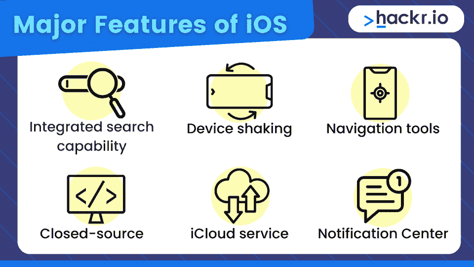
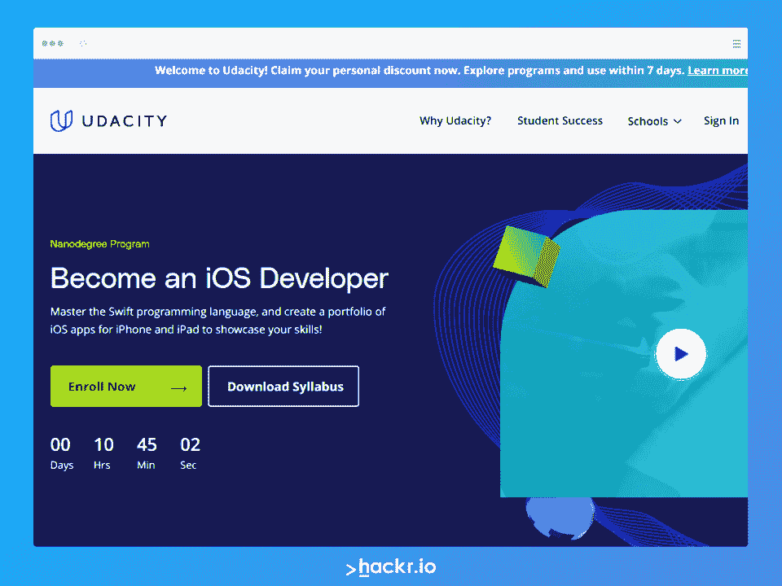
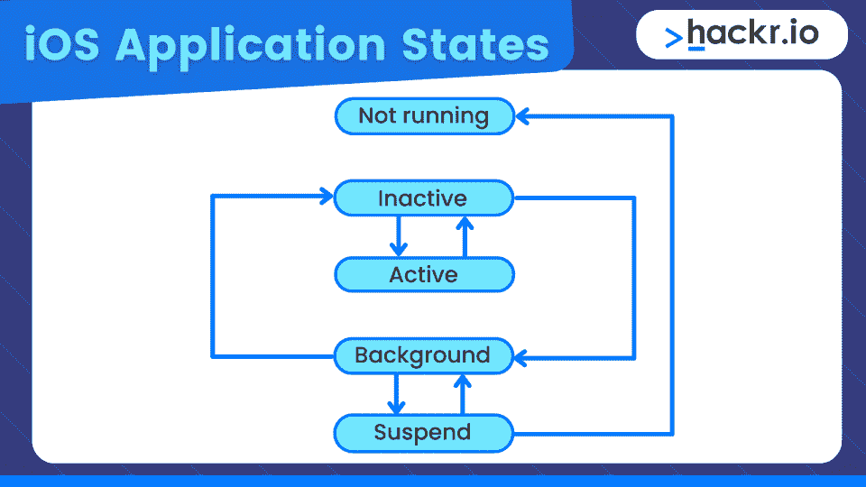
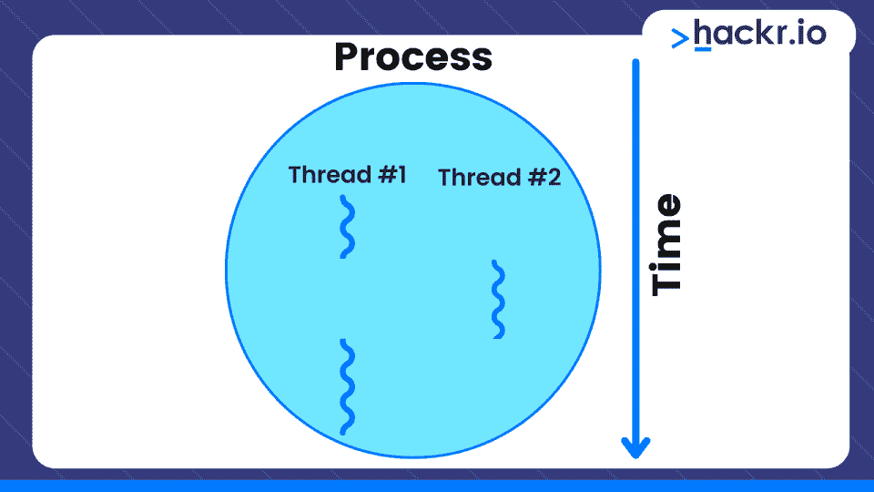
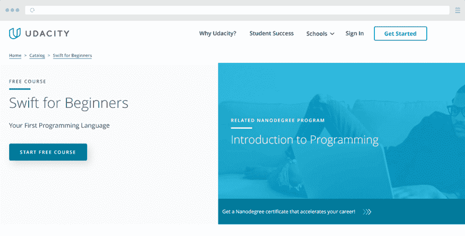

# 面向开发者的 40+ iOS 面试问答【更新】

> 原文：<https://hackr.io/blog/ios-interview-questions-and-answers>

iOS 代表 iPhone 操作系统——苹果为其大多数设备开发的移动操作系统。除了为每一个著名的 iPhone 或 iPad 应用程序提供流畅、复杂的导航之外，iOS 还以其安全性和有效性而闻名。

iOS 开发人员负责在移动设备上创建、测试和改进 iOS 应用程序。苹果几乎每年都会推出新的 iPhone，所以你可以想象对 iOS 开发者的需求。客户现在比以往任何时候都更需要用户友好和直观的 iOS 应用程序。

有兴趣为 iPhone 创造下一个抖音或糖果粉碎吗？你必须通过一些高级 iOS 开发者的面试问题。

这就是为什么我们编辑了这份最新的 iOS 面试问题列表，以帮助你在下一次面试中胜出。我们开始吧！

## **热门 iOS 面试问答**

我们将 iOS 技术面试问题列表分为三个部分:基础、中级和高级。

### **iOS 大一新生(初学者)面试问题**

这些基本的 iOS 面试问题和答案对于几乎没有 iOS 工作经验或基本了解 iOS 概念的初学者来说是一个极好的资源。

#### **1。iOS 是什么？**

iOS 是一个运行在手机等移动设备上的软件平台，其功能类似于计算机系统。iOS 旨在更节能、更快、更小。由苹果公司维护和开发并仅针对苹果硬件发布的移动操作系统(OS)称为 iOS(以前的 iPhone OS)。

以下是 iOS 的一些主要功能:

*   **集成搜索功能**允许同时搜索文件、媒体、应用程序和电子邮件。
*   **摇动设备**来撤销最近的活动，这一切都归功于手势检测。
*   **导航工具**(谷歌地图)
*   **闭源**让事情更安全。
*   iCloud 服务使用户能够将他们所有的数据存储在云端。
*   **通知中心**提供 app 通知。

#### **2。iOS 的抽象层次有哪些？**

iOS 有四个不同的抽象层:

*   **核心 OS 层:**提供与外部硬件交互的底层能力和安全框架。
*   **核心服务层:**从核心服务层提供顶层需要的服务。
*   **媒体层:**提供图形、音频和视频所需的工具。
*   **Cocoa Touch 层:**框架的位置，在设计应用程序时经常使用。

#### **3。区分异步调用和同步调用。**

**同步**:

同步 API 调用需要暂停代码执行并等待 API 调用完成。这意味着在 API 返回响应之前，您的应用程序不会继续运行，用户可能会经历延迟或性能滞后。然而，如果您的应用程序只有在收到 API 响应时才运行，那么同步 API 调用可能是有利的。

**异步**:

异步调用不会暂停(或等待)服务器响应 API 调用。您的程序继续运行，然后当服务器响应调用时，会调用一个“回调”函数。

#### **4。iOS 中有哪些属性？**

值与某些类、结构或称为属性的枚举相关联。与计算(而不是保存)值的计算属性不同，存储属性在实例中保存常量和变量值。枚举、类和结构都提供计算属性。但是，只有类和结构提供存储属性。

**iOS 开发者相关课程**

#### **5。什么是枚举？**

带有枚举符号的变量只能取一组预定值中的一个。例如，一周中的某一天只能是以下某一天:星期一、星期二、星期三、星期四、星期五、星期六或星期天。因此，在声明枚举时，必须提供所有潜在值的列表。根据编译器，在程序中的任何地方，这些都是唯一可能赋给变量的值。

#### **6。区分宾语中的强引用和弱引用——c .**

**强引用:**

强引用(最常见)意味着您想要“拥有”属性或变量所寻址的对象。只要用一个强引用来引用分配给该属性的任何对象，编译器就会采取预防措施来防止它被破坏。直到你将属性设置为 nil，对象才会被销毁(除非一个或多个其他对象也持有对它的强引用)。

**弱引用:**

但是，对于弱引用，您表示不希望控制对象的生存期。为什么？因为至少有一个其他对象对您弱引用的项有强引用。当不再是这种情况时，对象就被销毁了，并且你的弱属性在默认情况下被设置为零。

#### **7。什么是代码覆盖率？**

代码覆盖率计算在自动化测试套件运行时，您的生产代码运行了多少。它通常表示为实际执行的行数占所有可执行行数的百分比。例如，如果您的测试覆盖了 100 行代码的 75%,那么只有 25%的代码被执行。在只有 25 行的代码中，bug 很容易隐藏。它提供了对你的代码“测试得有多好”的一般指示，因此，“我们可以有多确定它将运行。”

#### **8。iOS 中有哪些不同的应用状态？**

iOS 有五种应用程序状态:

**未运行**

系统关闭了应用程序，不管它是否已经启动。

**未激活**

尽管在前台处于活动状态，但该应用程序目前没有获取事件。(但是，它可能正在运行其他代码)。一个典型的应用程序在进入下一个阶段之前只会在这个阶段花费很短的时间。

**激活**

当应用程序在前台处于活动状态时，它正在获取事件。前台应用的默认设置是这样的。

**背景**

应用程序在后台运行代码。大多数应用程序在暂停前都会短暂经历这种状态。但是，需要更多执行时间的程序可以在这种情况下停留一段时间。

**暂停**

即使程序在后台运行，也不会执行任何代码。在系统自动将其转换到此模式之前，应用程序不会收到通知。暂停的程序仍然有内存，但是它没有运行任何代码。

#### **9。Android 和 iOS 有什么区别？**

苹果公司在 Unix 基础上开发了 iOS 系统..iOS 系统的固定用户界面和预定操作方式限制了用户更改设备功能的能力。

Android: 谷歌拥有 Android OS，这是一个适应性更强的开源平台。该操作系统是开源的，因为有几个具有不同硬件配置的设备在使用它。这使得保持无 bug 和维护所有类型设备的操作系统变得非常困难。

| **iOS** | **安卓** |
| 苹果设备的移动操作系统。 | Android 设备的移动操作系统。 |
| 专为 iPhones、iPads 和 iPods 设计。 | 专为平板电脑和智能手机设计 |
| Safari 是默认浏览器。 | 谷歌 Chrome 是默认浏览器。 |
| 用 C， [C++](https://hackr.io/blog/cpp-course) ，Swift，Objective-C 开发。 | 用 C 和 C++开发的。 |
| 随着时间推移保持一致的速度 | 随着时间的推移，性能可能会下降 |
| 闭源 | 开源 |

#### 10。什么是正则表达式？

正则表达式是“正则表达式”的昵称。它概述了将应用于文本搜索的格式化模式的准则。

比如:“a？z”将匹配“acz”、“abz”、“adz”或任何其他以“a”开头、以“z”结尾的三个字母的组合。

我们可以为我们的用例应用更多的规则，特别是那些处理字符组、字符串位置等的用例。实际上，在所有的计算机语言中，正则表达式的语法都是相同的。

#### **11。iOS 中的深度链接是什么？**

移动应用中的深度链接是产品和服务销售指数增长的未来前沿。它类似于网页上的可点击链接，只是在这种情况下，它将消费者导向移动应用程序中的某些页面。这项技术不只是打开一个移动应用程序并导航到其中的特定页面，而是即时集成移动应用程序，让用户直接访问服务。

移动应用技术的现状阻碍了几个应用之间的流畅导航和交互。深度链接提供了一个解决方案，让用户更容易在应用程序中找到特定的登录页面。

#### **12。什么是大中央调度(GCD)？**

大中央调度(GCD)为多核计算机优化软件。本质上，它通过将线程池管理从开发人员委托给操作系统来帮助并发代码执行。它适用于 OS X 10.6 和 iOS 4 及更高版本。

随着 iOS 的成熟，GCD 提供了几个优势，包括

*   通过在后台执行复杂的活动来提高应用程序的响应速度。
*   提供比典型的锁和线程更好的并发模型来防止并发错误。

#### 13。什么是自动引用计数？

自动引用计数是一种编译时内存管理技术。它保证对象只在面向对象的软件开发中需要的时候才会被保存在内存中(否则会被删除)。

通常，分配一个对象来执行一项任务或保存一些数据或状态。理想情况下，一旦任务完成，如果不再需要数据，就释放对象。程序员或系统设计人员可以创建大型的互连对象图。随着对象关系变得更加复杂，何时释放特定对象的问题就出现了..

当一个对象不再有用时不释放它是一种浪费，并且会导致应用程序“消耗”比它实际需要的更多的内存。这可能导致严重的软件故障(并最终耗尽可用内存)。引用计数是给每个对象一个“引用计数”，这是对有多少其他对象依赖它而留在内存中的连续跟踪。当一个给定的项的总数减少到零时，这个给定的项被释放。

#### **14。C 和客观 C 有什么区别？**

以下是 C 和目标 C 的不同之处:

*   与 C 相比，目标 C 包含了类。

*   虽然 C 结构的成员总是公共的，但 Objective C 中的实例变量(数据成员)可以被指定为公共的、私有的或受保护的。

*   Objective-C 增加了语法和语义，使得面向对象编程成为可能。

*   C 是过程化编程，而 Objective C 是面向对象编程。

*   使用 Objective C 可以将问题分成更小的、独立生成的、可测试的子问题和子模块。

*   Objective C 具有远程调用和将方法委托给其他对象的能力，并且使用类别和消息转发可以直接实现它们。

*   与 Java 类似，Objective C 不允许多重继承。

*   Objective C 的用户可以通过声明 Objective C 类来定义协议。

| **参数** | **C** | **目标-C** |
| 编程范例 | 程序的 | 面向对象 |
| 对类的支持 | 不 | 是 |
| 超集/子集 | 目标 C 的子集 | C 语言的超集 |
| 两颗北极指极星 | 易受攻击 | 空指针和是类型安全的 |
| 语言类型 | 低级的 | 高层 |
| 程序设计方法 | 自上而下 | 自下而上 |
| 变量声明 | 在节目开始时 | 程序中的任何地方 |
| 安全性 | 不安全 | 因为封装而安全 |
| 支持函数和运算符重载 | 不 | 是 |
| 对...的想法 | 嵌入式服务和操作系统 | 网络、移动应用和游戏。 |

#### 15。可可触感是什么？

为了用 Objective-C(或 [Swift](https://hackr.io/blog/best-way-to-learn-swift) )创建 iOS 应用程序，苹果公司创建了 Cocoa Touch 框架(Cocoa for OSX- Cocoa Touch for IOS)。Cocoa Touch 中以“NS”或“UI”开头的类包括 NSObject(基本类)、NSArray、UIView 和 UITableViewController 等。Cocoa 是在 iPhone 上运行应用程序的先决条件。把 cocoa 或者任何框架想象成设备和编程语言(Objective-C)之间的桥梁机制。

#### 16。线程和进程的区别是什么？

**流程**

进程是正在执行的程序，或者是在队列中等待或使用 CPU 的程序的动态实例。许多组件构成了一个流程，如下所示:

*   流程 ID
*   内存部分(堆栈、堆、文本和代码部分)
*   进程状态
*   程序计数器
*   打开文件列表

**线程**

CPU 使用的基本组成部分是线程。进程本身是线程的一个组成部分。一个进程中可能有一个或几个线程。

以下是构成一个线程的一些关键部分:

*   线程 ID
*   程序计数器
*   寄存器组
*   堆

| **流程** | **线程** |
| 任何正在执行的程序 | 正在执行的程序的任何部分 |
| 需要很多时间来创造 | 创建所需的时间更少 |
| 需要更多时间来终止 | 在更短的时间内终止 |
| 更多时间用于上下文切换 | 更少的上下文切换时间 |
| 单个进程被隔离 | 一个进程的所有线程共享一个公共内存 |
| 要人 | 轻量级选手 |
| 进程不与另一个进程共享数据 | 进程中的线程与其他线程共享数据 |

现在，让我们转到更有经验的个人的下一级 iOS 面试问题和答案。

#### **17。什么是设计模式？**

本质上，设计模式是可重复的代码解决方案，可以重复应用来解决典型的软件问题。在您的项目中使用设计模式将会产生更加模块化、更加可伸缩和优化的软件。你将更好地理解其他人的代码，因为你将能够马上识别设计模式。

设计模式不能作为创建更好软件的指南，因为设计模式和最佳实践彼此完全不同。此外，它们并不打算提供如何应对挑战的指导。相反，它们仅仅作为对典型工程和建筑概念的观察到的通常反应的文件。常见的设计模式包括 Facade、Decorator、Factory Method、Singleton 等。

**通过本课程学习 iOS 开发**

#### 18。您对分配和保留关键字的理解程度如何？

**Assign:** 这个关键字使我们能够构造从一个对象到另一个对象的引用，而不增加源的保留计数。保留计数记录有多少个对象相互粘附在一起。该值会立即分配给实例变量。

**保留:**是关键字**赋值**的反义词。它建立了两个对象之间的引用，但也增加了源的保留计数。

#### **19。iOS 开发会选择哪些不同的编程语言？**

以下是我们可以用于 iOS 开发的不同的[编程语言](https://hackr.io/blog/best-programming-languages-to-learn):

#### 20。iOS 中的 Objective-C 是什么？

苹果公司创造了 Objective-C——一种遵循面向对象编程概念的高级编程语言。它是 iOS 开发人员用来为 iOS 和 OS X 构建软件应用程序的最基本的编程语言，是 C 语言和 Smalltalk 语言的融合。

以下是 Objective-C 的显著特征:

*   支持静态和动态类型
*   面向对象
*   提供出色的内存管理
*   支持二进制框架
*   自动创建和管理元类
*   与 C++和目标 C++交互操作

#### **21。Objective-C 中的数据类型是什么？**

下面是 Objective-C 中一些常用的数据类型

*   BOOL: 它返回特定条件的真或假。BOOL 和 _Bool 都是有效的关键字。
*   **NSInteger:** 表示整数。
*   **NSUInteger:** 表示无符号整数。
*   **NSString:** 表示一个字符串。

#### **22。捆绑包 ID 与应用 ID 有何不同？**

捆绑 id 是苹果生态系统中应用程序的专属 id。结果呢？没有两个应用程序可以共享相同的标识。您可以使用捆绑包 ID(适用于 OS X 和 iOS 程序)来识别应用程序升级。

应用程序 ID 字符串标识来自同一个开发团队的任何应用程序。该字符串由两部分组成:团队 ID 和捆绑包 ID。这些段由句点(.).开发者提供捆绑 id 来标识单个程序或一组应用程序，而苹果提供团队 id 来标识某个开发团队。

#### **23。什么是单体设计模式？**

Singleton 是一种对象构造设计模式。它属于“创造性”设计模式。它允许我们拥有一个并且只有一个类的实例。单例对象通常用于为您的应用程序提供配置选项或全局环境。

例如，当您的应用程序启动时，它会创建一个全局环境并用客户端提供的或预先配置的配置参数填充它。必要时，几个应用程序组件可能会使用这些配置选项。

#### **24。Swift 编程语言有什么特点？**

苹果创造了 Swift，这是一种编译编程语言，用于为 iOS、macOS、watchOS 和 tvOS 制作应用程序。以下是 Swift 编程语言的一些特点:

*   **简单易懂** : Swift 读起来和英语很像，让新手学习起来很简单。
*   可扩展:Swift 是最具可扩展性的编程语言之一，可以将功能扩展到 iOS 和 OSX 平台。
*   **易于维护:** xCode 会在构建您的应用程序之前检查您的代码是否有问题，使其快速且易于管理。
*   **Quick** : Swift 是静态类型的，比其他编程语言更快。
*   **提高内存使用:** Swift 的内存管理实现了自动化。

#### 25.什么是立面设计模式？

门面模式通过掩饰系统的复杂性，使系统更容易使用。在结构设计模式下，它属于。在这种体系结构中，客户端程序可以访问系统，但它通过为客户端提供一个更友好的界面来隐藏系统的工作方式。

在这种方法中，构建了一个类(FACADE ),它包含用户定义的函数以及调用属于系统的其他类的委托。因此，客户端代码只与 Facade 通信，而不与底层系统通信。

#### **26。你将利用哪个框架来开发 iOS 的应用程序界面？**

UIKit 是一个专门为 iOS 开发设计的框架。这个框架允许开发人员设计应用程序的图形基础设施和用户界面。它包括以下内容:

*   用户界面
*   事件处理
*   应用程序结构
*   图形、印刷和绘图

### **面向有经验开发者的高级 iOS 面试问答**

下一站，iOS 体验了开发人员的面试问题，其中包含一些项目和简历条目！

#### **27。什么是 MVC？**

MVC 的主要原则是将程序分成三个部分:

**型号**

数据形状和业务逻辑被称为模型，它们服务于数据库蓝图。模型维护应用程序数据，并在数据库中访问和存储对象模型状态。

它更新数据并响应用户的数据读取请求。在这种情况下，模型与数据库通信以接收或发布数据。此外，它接受链接到数据库的请求，处理这些请求，然后通过浏览器将数据返回给用户。

**控制器**

控制器控制视图-模型的交互。如果用户想要请求数据并得到响应，会发生什么？它们需要正确的业务逻辑——接受用户请求、验证请求或将其转发给另一个组件的算法。然后，该算法传递客户端响应。

管制员负责这项任务。

**视图**

视图是用户界面和表示，它让最终用户能够访问应用程序的资源，并让他们向应用程序的服务器或后端发送请求。通常，用户可以使用 web 浏览器或移动应用程序发送查询来获取某些资源，如特定的网页。您可以完全用 HTML 或者用 React、Vue 等工具和框架来编写视图。

#### **28。能说说 SpriteKit 和 SceneKit 框架吗？**

这个框架使游戏开发者能够快速轻松地创建 2D 动画对象。它可以让他们创建二维的文本、视频、图像、形状和粒子。

**SceneKit:** 是一个用于创建 3D 图形的 iOS 框架。iOS 游戏开发人员可以使用该框架为 iOS 游戏应用程序制作吸引人的 3D 动画效果和场景。

#### **29。iOS 中的 Swift 是什么？**

Swift 由苹果公司开发，是一种直观的编程语言，允许 iOS 开发人员为苹果电视、iPhones、iPads、iPods、苹果手表和 Macbooks 构建应用程序。它是苹果公司创造的一种开源语言，为 iOS 开发者提供了更多的灵活性和自由度。

#### 三十岁。Swift 中有哪些不同的模式匹配技术？

Swift 中的模式匹配技术如下:

*   元组模式
*   铅字铸造模型
*   通配符模式
*   可选模式
*   枚举案例模式
*   表情模式

#### 31。Swift 中的泛型是什么？

使用泛型的代码不指定基础数据类型。多亏了泛型，我们可以预测它将包含的类型。此外，泛型优化了代码。

#### 32。Swift 中的惰性存储属性是什么？

如果一个属性的初始值直到第一次被使用时才确定，那么它就被认为是惰性存储的。通过在存储属性的声明前添加惰性修饰符，可以将一个属性指示为惰性存储属性。

#### 33。什么是并发？

并发性意味着两个任务同时运行。例如，当计算机上的内核将两个进程分配给不同的内核时，两个内核同时执行进程指令。

同样，当新连接在旧连接完成之前到达，并且必须立即处理时，就会发生并发。从更广泛的意义上来说，它发生在我们必须同时处理几个任务的时候。当*许多*任务开始同时运行时，就出现了并行执行。

**[iOS 面试问题&150+面试答案(Swift)](https://click.linksynergy.com/link?id=jU79Zysihs4&offerid=1045023.2548987&type=2&murl=https%3A%2F%2Fwww.udemy.com%2Fcourse%2Fcrack-any-ios-interview-swift%2F)**

#### 34。Swift 中的 Guard 语句是什么？

条件语句“guard”比典型的条件语句提供了更多的承诺。如果条件为假，执行将毫无疑问地离开当前范围(或者，至少，跳过循环的这个迭代，中断循环，从当前块/函数返回，或者终止整个程序)。

此外，它还有一个好处，就是在条件中为余下的作用域维护您创建的任何绑定，避免您需要更多的嵌套 if 语句来简单地说出 unwrap 四个可选值。

#### 35。目标 C 中的@ synthesize 是什么？

@ synthesize 为属性生成 getter 和 setter 方法。

#### 36。什么是 UUID？

UUID 代表通用唯一标识符，它是一个 128 位的数字，用来唯一地标识一个在线对象。可以使用任意数量的变量来指定每个位的含义。UUIDs 旨在帮助应用程序唯一地标识数据，而无需大量的中央协调。

#### 37。什么是观察者设计模式？

观察者设计模式中的“主题”跟踪所有等待主题更新的观察者。主题更新时，所有观察者都会收到警报。

#### 38。JSON 是什么？

简单的数据结构和对象使用 [JSON](https://hackr.io/blog/json-vs-xml) 来表示，这是一种基于文本的、人类可读的数据传输标准，用于基于 web 浏览器的程序，有时也用于客户端和服务器端编程环境。

JSON 最初是作为 Netscape Navigator Web 浏览器的页面脚本语言开发的，它基于 JavaScript。可以用 JSON 语法序列化对象、数组、数字、字符、布尔值和 null。

#### 39。你对 Swift 中的 KVC 和 KVO 有什么了解？

**KVC:** 键值编码，让你在运行时利用字符串来检索对象的属性。

**KVO:** 键值观察，一种观察程序状态变化的方法。

#### 40。你能解释一下完成处理器吗？

完成处理程序是作为参数传递给另一个函数的函数。它们主要负责处理异步事件响应。此外，完成处理程序为应用程序提供有关操作完成的信息。

## **奖励提示**

这里有一些额外的提示，让你在下一次 iOS 开发者面试中胜出:

*   **利用课程和在线资源:**在线资源，如 iOS 课程或教程，以获得对概念的基本理解。
*   与朋友一起练习:在重要的日子到来之前，尝试模拟面试来掌握那些棘手的面试问题。
*   更新你的简历:如果面试官在审查你的完整申请时不能评估你的经验，你的技能就没有机会展现出来。
*   自信点:你能行的！

## **结论**

无论你是专业开发人员还是初学者，请随意阅读这些常见的 iOS 面试问题和答案，以便在下一次面试中胜出。我们已经涵盖了你需要知道的一切，从 Swift 和设计模式、[基本编程语言范例](https://hackr.io/blog/programming-paradigms)和操作系统。

对其他潜在的工作机会感到好奇？如果你遇到任何与 Java 相关的职位，我们都会帮你搞定。

[学习 100+ Java 面试题！](https://hackr.io/blog/java-interview-questions)

## **常见问题解答**

#### **1。我该如何准备 iOS 面试？**

最好的准备方式是至少有一个好的 iOS 项目来展示和了解 Swift 编程语言基础。当然，你也可以阅读这篇文章中的面试问题来做准备。

#### **2。iOS 开发者需要知道什么？**

iOS 开发人员应具备 Swift 编程语言、设计模式、基本编程流程和操作系统方面的知识。

#### **3。如何面试一个资深 iOS 开发者？**

一个资深 iOS 开发者的面试，通常侧重于项目基础和你学到的东西。受访者应该熟知所有潜在的应用程序边缘案例，包括应用程序伸缩性、漏洞以及在应用程序中实现模块化。

#### **4。什么是 iOS 开发者？**

一个 iOS 开发者对 iOS 环境有着透彻的理解，包括它如何在各种苹果设备上运行。他们必须熟悉在 iOS 环境中创建和修改应用程序。

**人也在读:**