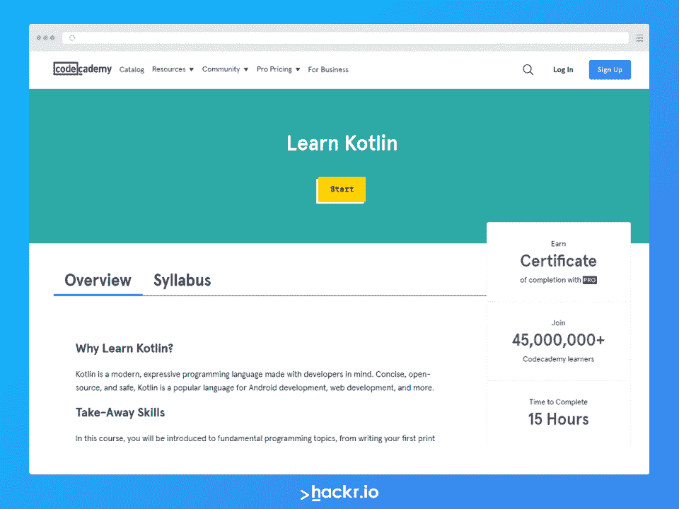

# 下载 Kubectl 备忘单 PDF 以快速参考

> 原文：<https://hackr.io/blog/kubectl-cheat-sheet>

Kubernetesis 是最著名的容器编排平台之一。作为一个开源平台，Kubernetes 为容器化的应用程序自动化了广泛的管理、部署和扩展任务。

Kubernetes 集群是一组称为节点的控制面板和工作机，它们在您每次部署 Kubernetes 时形成一个集群。如果您想命令您的 Kubernetes 集群执行任务，您可以使用命令行 kubectl。它使用 Kubernetes API 与 Kubernetes 集群的控制面板进行通信。有了它，您几乎可以在 Kubernetes 集群上执行任何操作，而不需要直接调用 API。

拥有 Kubernetes 知识的程序员需求量很大，因为许多公司和组织都采用 Kubernetes 来高效地开发应用程序。

准备好使用 kubectl 充分利用 Kubernetes 命令了吗？我们整理了这个 kubectl cheat sheet，其中充满了关于管理 Kubernetes 集群、kubectl 日志、kubectl list pods 等等的见解。

有了这个 kubectl 和 Kubernetes 命令备忘单，您将能够处理任何应用程序项目。

我们开始吧！

## **下载 Kubectl 备忘单 PDF**

我们将讨论所有重要的 Kubernetes 命令，以便与集群控制面板进行通信。您可以随意使用这个 kubectl/kubernetes 备忘单。这是准备面试的绝佳资源，也是轻松完成应用项目的简单参考。

这里有一个 kubectl 备忘单 pdf 的链接，您可以随时随地下载并离线访问。

### **立方自动完成**

要在当前 shell 中设置 bash 中的 autocomplete，必须使用以下命令安装 bash 完成包。

```
source <(kubectl completion bash)
```

要将自动完成功能永久添加到 bash shell 中，请运行以下命令。

```
echo "source <(kubectl completion bash)" >> ~/.bashrc
```

您可以使用 Kubectl 的简称，如下所示。

```
alias k=kubectl
complete -F __start_kubectl k
```

#### **ZSH**

要在当前 shell 中设置 zsh 中的 autocomplete，您需要运行以下命令。

```
source <(kubectl completion zsh)
```

您也可以运行以下命令使其永久化。

```
echo "[[ $commands[kubectl] ]] && source <(kubectl completion zsh)" >> ~/.zshrc
```

### **Kubectl 上下文和配置**

下一组命令将包括显示、上下文和用户信息。

使用以下命令显示合并的 kubeconfig 设置:

```
kubectl config view
```

同时使用几个 kubeconfig 文件，并使用以下命令查看合并的配置:

```
KUBECONFIG=~/.kube/config:~/.kube/kubconfig2
kubectl config view​
```

```
kubectl config view -o jsonpath='{.users[?(@.name == "e2e")].user.password}'
```

使用以下命令获取 e2e 用户的密码:

运行以下命令显示第一个用户:

```
kubectl config view -o jsonpath='{.users[].name}'
```

使用以下命令显示用户的完整列表:

```
kubectl config view -o jsonpath='{.users[*].name}'
```

显示上下文列表:

```
kubectl config get-contexts
```

显示当前上下文:

```
kubectl config current-context
```

将默认上下文设置为 my-cluster-name:

```
kubectl config use-context my-cluster-name
```

向支持基本身份验证的 kubeconf 添加新用户:

```
kubectl config set-credentials kubeuser/foo.kubernetes.com --username=kubeuser --password=kubepassword
```

为该上下文中的所有后续 kubectl 命令永久保存名称空间:

```
kubectl config set-context --current --namespace=ggckad-s2
```

使用特定用户名和名称空间设置上下文:

```
kubectl config set-context gce --user=cluster-admin --namespace=foo \
 && kubectl config use-context gce​
```

```
kubectl config unset users.foo
```

删除名为 foo 的用户:

用短别名设置或显示上下文/名称空间:

```
alias kx='f() { [ "$1" ] && kubectl config use-context $1 || kubectl config current-context ; } ; f'
alias kn='f() { [ "$1" ] && kubectl config set-context --current --namespace $1 || kubectl config view --minify | grep namespace | cut -d" " -f6 ; } ; f'
```

“apply”通过定义 Kubernetes 资源的文件帮助管理应用程序。通过运行 kubectl apply，可以很容易地在集群中创建和更新资源。这是管理生产应用程序的常用方法之一。Kubectl 应用

### **创建对象**

Kubernetes 中的对象是代表集群状态的持久实体。

具体来说，他们可以描述:

*   运行的容器化应用程序(以及在哪些节点上运行)
*   这些应用程序的可用资源
*   关于应用程序行为的策略，如升级和重启策略

Kubernetes 对象是“意图的记录”在您创建对象之后，Kubernetes 系统将不断地工作以确保对象存在。通过创建一个对象，您可以向 Kubernetes 系统讲述集群的工作负载将会是什么样子(理想状态)。

如果您想使用 Kubernetes 对象(创建、修改或删除)，您需要使用 Kubernetes API。kubectl 命令行界面(CLI)使您更容易进行必要的 Kubernetes API 调用。有兴趣直接使用 Kubernetes API 吗？试用其中一个客户端库。

您可以在 YAML 或 JSON 中定义 Kubernetes 清单文件。这个清单文件带有扩展名。yaml，。yml，还有。json 等。

以下是允许您解决清单文件的命令。“应用”用于根据您的配置文件推送所需的更改。

创建资源:

```
kubectl apply -f ./my-manifest.yaml 
```

从多个文件创建:

```
kubectl apply -f ./my1.yaml -f ./my2.yaml
```

在目录中的所有清单文件中创建资源:

```
kubectl apply -f ./dir
```

**创建命令将有助于从文件或标准输入设备生成新资源。

从 url 创建资源:

```
kubectl apply -f https://git.io/vPieo
```

使用以下命令启动 Nginx 的单个实例:

```
kubectl create deployment nginx --image=nginx
```

创建打印“Hello World:”的作业

```
kubectl create job hello --image=busybox:1.28 -- echo "Hello World"
```

创建一个每分钟打印“Hello World”的 CronJob:

```
kubectl create cronjob hello --image=busybox:1.28   --schedule="*/1 * * * *" -- echo "Hello World"​
```

```
kubectl explain pods
```

检索 pod 清单的文档:

从标准输入创建多个 YAML 对象:

```
cat <<EOF | kubectl apply -f -
apiVersion: v1
kind: Pod
metadata:
 name: busybox-sleep
spec:
 containers:
 - name: busybox
   image: busybox:1.28
   args:
   - sleep
   - "1000000"
---
apiVersion: v1
kind: Pod
metadata:
 name: busybox-sleep-less
spec:
 containers:
 - name: busybox
   image: busybox:1.28
   args:
   - sleep
   - "1000"
EOF

Create a secret
```

有几把钥匙:

```
cat <<EOF | kubectl apply -f -
apiVersion: v1
kind: Secret
metadata:
 name: mysecret
type: Opaque
data:
 password: $(echo -n "s33msi4" | base64 -w0)
 username: $(echo -n "jane" | base64 -w0)
EOF
```

### Kubernetes 大师与本课程！

### [](https://www.pntra.com/t/TUJGR0lLR0JHRklKSkdCR0ZISk1N?url=https%3A%2F%2Fwww.codecademy.com%2Flearn%2Flearn-kotlin)

### **查看和查找资源**

在 Kubernetes 中，我们可以将资源定义为 Kubernetes API 中的端点。它负责存储特定种类的 API 对象的集合。例如，名为内置 pod 的资源是 pod 对象的集合。

我们可以使用定制资源来扩展 Kubernetes API。在 Kubernetes 的默认安装中，定制资源不必总是可用的。此外，自定义资源使我们有可能创建各种核心 Kubernetes 功能，这使 Kubernetes 在本质上更加模块化。

动态注册使得定制资源在运行的集群中出现或消失成为可能。此外，集群管理员有权更新自定义资源，而无需考虑集群本身。与内置资源一样，用户也可以在安装时创建和访问自定义资源的对象。

#### **“获取”命令和基本输出**

这些命令将帮助您从各种来源获取集群数据:

*   kubectl get services: #用于显示名称空间中的所有服务
*   kubectl get pods-all-namespaces:#用于显示所有名称空间中的所有 pods
*   kubectl get pods -owide:#用于显示当前名称空间中的所有 pods，以及更多详细信息
*   kubectl get deployment my-dep:#用于显示特定的部署
*   kubectl get pods:#用于显示名称空间中的所有 pods
*   Kubrick 得到了我的下-o YAML:# to get a pod YAML

#### **“描述”命令显示详细输出**

```
kubectl describe nodes my-node
kubectl describe pods my-pod
```

#### **列出按名称排序的服务:列表命令、周期树等**

```
kubectl get services --sort-by=.metadata.name
```

按重新启动计数排序的列表窗格:

```
kubectl get pods --sort-by='.status.containerStatuses[0].restartCount'
```

列出按容量排序的持久卷:

ku bectl get PV-sort-by = . spec . capacity . storage

获取标签为 app=cassandra 的所有 pod 的版本标签:

```
kubectl get pods --selector=app=cassandra -o \
 jsonpath='{.items[*].metadata.labels.version}'
```

获取带点的键的值，例如“ca.crt:”

```
kubectl get configmap myconfig \
 -o jsonpath='{.data.ca\.crt}'
```

对于这个命令，使用一个选择器来排除标签号为' node-role.kubernetes.io/master '的结果查看所有工作节点:

```
kubectl get node --selector='!node-role.kubernetes.io/master'
```

获取命名空间中所有正在运行的窗格:

```
kubectl get pods --field-selector=status.phase=Running
```

获取所有节点的 ExternalIPs:

```
kubectl get nodes -o jsonpath='{.items[*].status.addresses[?(@.type=="ExternalIP")].address}'
```

这个命令对于对于 jsonpath 来说过于复杂的转换非常有用，可以在这里找到。列出属于特定 RC“jq:”的 pod 的 pod 名称

```
sel=${$(kubectl get rc my-rc --output=json | jq -j '.spec.selector | to_entries | .[] | "\(.key)=\(.value),"')%?}
echo $(kubectl get pods --selector=$sel --output=jsonpath={.items..metadata.name})​
```

```
kubectl get pods --show-labels
```

显示所有窗格标签:

检查哪些节点就绪:

```
JSONPATH='{range .items[*]}{@.metadata.name}:{range @.status.conditions[*]}{@.type}={@.status};{end}{end}' \
&& kubectl get nodes -o jsonpath="$JSONPATH" | grep "Ready=True"​
```

```
kubectl get secret my-secret -o go-template='{{range $k,$v := .data}}{{"### "}}{{$k}}{{"\n"}}{{$v|base64decode}}{{"\n\n"}}{{end}}'
```

列出 pod 当前使用的所有机密；无需外部工具即可获得输出的解码机密；

```
kubectl get pods -o json | jq '.items[].spec.containers[].env[]?.valueFrom.secretKeyRef.name' | grep -v null | sort | uniq
```

该命令在清理停止的容器时很有用，同时避免删除 initContainers。列出所有 pod 的 initContainer 的所有 containerIDs:

```
kubectl get pods --all-namespaces -o jsonpath='{range .items[*].status.initContainerStatuses[*]}{.containerID}{"\n"}{end}' | cut -d/ -f3​
```

```
kubectl get events --sort-by=.metadata.creationTimestamp
```

列出按时间戳排序的事件:

比较当前和未来的集群状态:

```
kubectl diff -f ./my-manifest.yaml
```

为节点返回的所有键创建一个句点分隔的树:

当在复杂的嵌套 JSON 结构中定位一个键时，这个命令很有帮助。

```
kubectl get nodes -o json | jq -c 'paths|join(".")'
```

创建一个以句点分隔的树，包含为 pod 等返回的所有键。：

```
kubectl get pods -o json | jq -c 'paths|join(".")'
```

为所有窗格创建一个包络:

该命令假设您有一个用于窗格的默认容器、默认名称空间，并且支持“env”命令。在所有 pod 上运行任何支持的命令时，而不仅仅是“env ”,这是很有帮助的

```
for pod in $(kubectl get po --output=jsonpath={.items..metadata.name}); do echo $pod && kubectl exec -it $pod -- env; done
```

### **更新资源**

*   滚动“前端”部署的更新“www”容器，更新映像:

```
kubectl set image deployment/frontend www=image:v2 
```

*   检查部署的历史记录，包括版本:

```
kubectl rollout history deployment/frontend 
```

*   回滚到以前的部署:

```
kubectl rollout undo deployment/frontend
```

*   回滚到特定版本:

```
kubectl rollout undo deployment/frontend --to-revision=2 
```

*   观察“前端”部署的滚动更新状态，直到完成:

```
kubectl rollout status -w deployment/frontend 
```

*   滚动重启“前端”部署:

```
kubectl rollout restart deployment/frontend 
```

*   强制替换、删除然后重新创建资源:

该命令可能会导致服务中断。

```
kubectl replace --force -f ./pod.json
```

*   为复制的 nginx 创建一个服务，它服务于端口 80 并连接到端口 8000 上的容器:

```
kubectl expose rc nginx --port=80 --target-port=8000
```

*   将单容器 pod 的映像版本(标签)更新为 v4:

```
kubectl get pod mypod -o yaml | sed 's/\(image: myimage\):.*$/\1:v4/' | kubectl replace -f -
```

```
kubectl label pods my-pod new-label=awesome 
```

```
kubectl annotate pods my-pod icon-url=http://goo.gl/XXBTWq
```

*   自动缩放名为“foo:”的部署

```
kubectl autoscale deployment foo --min=2 --max=10
```

### **修补资源**

这些命令将根据需要修补资源。

```
kubectl patch node k8s-node-1 -p '{"spec":{"unschedulable":true}}'
```

*   更新容器的图像:

请记住，spec.containers[*]。名称是必需的，因为它是一个合并键

```
kubectl patch pod valid-pod -p '{"spec":{"containers":[{"name":"kubernetes-serve-hostname","image":"new image"}]}}'
```

*   使用带有位置数组的 json 补丁更新容器的映像:

```
kubectl patch pod valid-pod --type='json' -p='[{"op": "replace", "path": "/spec/containers/0/image", "value":"new image"}]'
```

*   使用带有位置数组的 json 补丁进行部署:

```
kubectl patch deployment valid-deployment  --type json   -p='[{"op": "remove", "path": "/spec/template/spec/containers/0/livenessProbe"}]'
```

*   向位置数组添加新元素:

```
kubectl patch sa default --type='json' -p='[{"op": "add", "path": "/secrets/1", "value": {"name": "whatever" } }]'
```

### **编辑资源**

这些命令将根据需要编辑资源。

*   编辑名为“docker-registry:”的服务

```
kubectl edit svc/docker-registry 
```

*   使用替代编辑器:

```
KUBE_EDITOR="nano" kubectl edit svc/docker-registry
```

### **缩放资源**

这些命令将根据需要扩展资源。

*   将名为“foo”的 Scalereplicaset 设置为 3:

```
kubectl scale --replicas=3 rs/foo 
```

*   将“foo.yaml”中指定的资源缩放到 3:

```
kubectl scale --replicas=3 -f foo.yaml 
```

*   将 mysql 扩展到 3(当名为 mysql 的部署的当前大小为 2 时):

```
kubectl scale --current-replicas=2 --replicas=3 deployment/mysql
```

*   扩展多个复制控制器:

```
kubectl scale --replicas=5 rc/foo rc/bar rc/baz 
```

### **删除资源**

以下命令用于根据需要删除资源。

*   使用 pod.json 中指定的类型和名称删除 pod:

```
kubectl delete -f ./pod.json 
```

*   删除没有宽限期的 apod:

```
kubectl delete pod unwanted -now
```

*   删除具有相同名称“baz”和“foo:”的 pod 和服务

```
kubectl delete pod, service baz foo 
```

*   删除标签名称为 myLabel 的 pods 和服务:

```
kubectl delete pods, services -l name=myLabel 
```

*   删除命名空间 my-ns 中的所有 pod 和服务:

```
kubectl -n my-ns delete pod, svc --all 
```

*   删除与 awk 模式 1 或模式 2 匹配的所有 pod:

```
kubectl get pods  -n mynamespace --no-headers=true | awk '/pattern1|pattern2/{print $1}' | xargs  kubectl delete -n mynamespace pod
```

### **与跑步舱互动**

下一组命令将向您展示如何与正在运行的窗格进行交互:

```
kubectl logs my-pod 
```

*   Dumppod 日志，标签名称=myLabel(标准输出):

```
kubectl logs -l name=myLabel 
```

*   容器以前实例化的 Dumppod 日志(stdout ):

```
kubectl logs my-pod --previous 
```

*   Dumppod 容器日志(标准输出，多容器情况):

```
kubectl logs my-pod -c my-container 
```

*   Dumppod 日志，标签名称=myLabel(标准输出):

```
kubectl logs -l name=myLabel -c my-container 
```

*   容器先前实例化的 Dumppod 容器日志(标准输出，多容器情况):

```
kubectl logs my-pod -c my-container --previous 
```

```
kubectl logs -f my-pod 
```

*   Streampod 容器日志(标准输出，多容器情况):

```
kubectl logs -f my-pod -c my-container 
```

*   流标签为 name=myLabel (stdout)的所有 pod 日志:

```
kubectl logs -f -l name=myLabel --all-containers 
```

*   将 apod 作为交互式 shell 运行:

```
kubectl run -i --tty busybox --image=busybox:1.28 -- sh 
```

*   在 mynamespace 的命名空间中启动 nginx pod 的单个实例:

```
kubectl run nginx --image=nginx -n mynamespace 
```

*   运行 apod nginx 并将其规范写入名为 pod.yaml 的文件:

```
kubectl run nginx --image=nginx                    
--dry-run=client -o yaml > pod.yaml
```

将 pod 连接到运行容器:

```
kubectl attach my-pod -i 
```

*   在本地机器上的端口 5000 上监听，并转发到 my-pod 上的端口 6000:

```
kubectl port-forward my-pod 5000:6000 
```

*   在现有 pod 中运行命令(1 个容器案例):

```
kubectl exec my-pod -- ls / 
```

*   访问交互式外壳以运行 pod (1 个集装箱箱)

```
kubectl exec --stdin --tty my-pod -- /bin/sh 
```

*   在现有 pod 中运行命令(多容器情况):

```
kubectl exec my-pod -c my-container -- ls / 
```

*   显示给定窗格及其容器的度量:

```
kubectl top pod POD_NAME --containers 
```

*   显示给定 pod 的指标，并按“cpu”或“内存:”对其排序

```
kubectl top pod POD_NAME --sort-by=cpu 
```

### **复制文件和目录**

这些命令帮助您复制文件和目录:

*   将/tmp/foo_dir 本地目录复制到当前名称空间的远程 pod 中的/tmp/bar_dir:

```
kubectl cp /tmp/foo_dir my-pod:/tmp/bar_dir 
```

*   将/tmp/foo 本地文件复制到特定容器的远程 pod 中的/tmp/bar:

```
kubectl cp /tmp/foo my-pod:/tmp/bar -c my-container 
```

*   将/tmp/foo 本地文件复制到名称空间 my-namespace 中的远程 pod 中的/tmp/bar:

```
kubectl cp /tmp/foo my-namespace/my-pod:/tmp/bar 
```

*   将/tmp/foo 从远程 pod 复制到本地的/tmp/bar:

```
kubectl cp my-namespace/my-pod:/tmp/foo /tmp/bar 
```

### **与部署和服务交互**

下一组命令帮助您与部署和服务进行交互(转储、监听、查看、运行)。

*   部署的转储容器日志(单容器情况):

```
kubectl logs deploy/my-deployment 
```

*   部署的转储容器日志(多容器情况):

```
kubectl logs deploy/my-deployment -c my-container 
```

*   在本地端口 5000 上侦听，并转发到服务后端的端口 5000

```
kubectl port-forward svc/my-service 5000 
```

*   监听本地端口 5000，并转发到服务目标端口，名称为<my-service-port>:</my-service-port>

```
kubectl port-forward svc/my-service 5000:my-service-port 
```

*   在本地端口 5000 上侦听并转发到由<my-deployment>创建的 Pod 上的端口 6000:</my-deployment>

```
kubectl port-forward deploy/my-deployment 5000:6000 
```

*   在部署中的第一个 pod 和第一个容器中运行命令(单容器或多容器情况):

```
kubectl exec deploy/my-deployment -- ls 
```

### **与节点和集群交互**

了解如何使用下一组命令与节点和集群进行交互。

*   将 my-node 标记为不可调度:

```
kubectl cordon my-node 
```

*   排空 my-node 以准备维护:

```
kubectl drain my-node 
```

*   将我的节点标记为可调度:

```
kubectl uncordon my-node 
```

*   给定节点的显示度量:

```
kubectl top node my-node 
```

*   显示主服务器和服务的地址:

```
kubectl cluster-info 
```

*   将当前集群状态转储到标准输出:

```
kubectl cluster-info dump 
```

*   将当前群集状态转储到/path/to/cluster-state:

```
kubectl cluster-info dump --output-directory=/path/to/cluster-state 
```

*   按照指定替换值(如果已经存在带有该键和效果的污点):

```
kubectl taint nodes foo dedicated=special-user:NoSchedule
```

### **集群管理**

这些命令帮助您管理集群，从列出 API 资源到显示相关信息:

*   显示群集中主服务器和服务的端点信息:

```
kubectl cluster-info
```

*   显示在客户机和服务器上运行的 Kubernetes 版本:

```
kubectl version
```

*   检索集群配置

```
kubectl config view
```

*   列出可用的 API 资源:

```
kubectl api-resources
```

*   列出可用的 API 版本

```
kubectl api-versions
```

```
kubectl get all --all-namespaces
```

### **达蒙塞特**

一个 [DaemonSet](https://kubernetes.io/docs/concepts/workloads/controllers/daemonset/) 确保节点运行 pod 副本。节点和单元被添加到集群中。类似地，一旦节点被移除，pod 就经历垃圾收集。当您删除 DaemonSet 时，由它创建的所有窗格也会被删除。

每个节点的一些典型 DaemonSet 用法:

*   运行集群存储
*   运行日志收集
*   运行节点监控

对于简单的情况，一个守护进程集可以覆盖所有节点和每种守护进程类型。更复杂的设置可能对一种类型的守护进程使用多个守护进程集，但是对不同的硬件类型使用不同的标志、内存和 CPU 请求。

```
Shortcode = ds
```

*   列出一个或多个数据集:

```
kubectl get daemonset​
```

*   编辑和更新一个或多个 DaemonSet 的定义:

```
kubectl edit daemonset <daemonset_name>
```

```
kubectl delete daemonset <daemonset_name>
```

```
kubectl create daemonset <daemonset_name>
```

*   管理 DaemonSet 的首次展示:

```
kubectl rollout daemonset
```

*   显示命名空间内 DaemonSets 的详细状态:

```
kubectl describe ds <daemonset_name> -n <namespace_name>
```

### **部署**

部署运行多个应用程序副本，并自动替换任何失败或无响应的实例。部署由 Kubernetes 部署控制器管理。此外，部署确保用户请求通过应用程序的一个或多个实例得到服务。

```
Shortcode = deploy
```

*   列出一个或多个部署:

```
kubectl get deployment
```

*   显示一个或多个部署的详细状态:

```
kubectl describe deployment <deployment_name>
```

*   编辑和更新一个或多个服务器部署的定义:

```
kubectl edit deployment <deployment_name>
```

```
kubectl create deployment <deployment_name>
```

```
kubectl delete deployment <deployment_name>
```

*   检查部署的首次展示状态:

```
kubectl rollout status deployment <deployment_name>
```

### **事件**

Kubernetes 事件是框架中的一个对象，它是在响应其他资源(如节点、窗格或容器)的变化时自动生成的。

状态变化是这个问题的核心。例如，pod 生命周期的各个阶段(如从挂起到运行的转换，或者成功或失败的状态)可能会触发 Kubernetes 事件。重新分配和调度也是如此。

```
Shortcode = ev
```

*   列出所有系统资源的所有最近事件:

```
kubectl get events
```

```
kubectl get events --field-selector type=Warning
```

*   列出所有事件(不包括 Pod 事件):

```
kubectl get events --field-selector involvedObject.kind!=Pod
```

*   提取具有特定名称的单个节点的所有事件:

```
kubectl get events --field-selector involvedObject.kind=Node, involvedObject.name=<node_name>
```

*   从事件列表中过滤出正常事件:

```
kubectl get events --field-selector type!=Normal
```

### **日志**

系统组件日志记录群集中发生的事件，这对调试很有用。要查看这些事件的所需详细信息，您可以配置日志详细程度。

日志有两种类型，即细粒度和粗粒度。粗粒度日志表示组件中的错误。另一方面，细粒度的日志表示事件的逐步跟踪。

```
kubectl logs <pod_name>
```

*   打印 pod 最后一小时的日志:

```
kubectl logs --since=1h <pod_name>
```

*   检索最近 20 行日志:

```
kubectl logs --tail=20 <pod_name>
```

*   从服务中检索日志，并可以选择哪个容器:

```
kubectl logs -f <service_name> [-c <$container>]
```

*   打印 pod 的日志并跟踪新日志:

```
kubectl logs -f <pod_name>
```

*   打印 pod 中容器的日志:

```
kubectl logs -c <container_name> <pod_name>
```

*   将 pod 的日志输出保存到名为“pod.log:”的文件中

```
kubectl logs <pod_name> pod.log
```

*   检查日志中以前出现故障的 pod:

```
kubectl logs --previous <pod_name>
```

### **名称空间**

在 Kubernetes 中，名称空间提供了一种在单个集群中隔离资源组的机制。资源名称在一个命名空间内必须是唯一的，但在跨命名空间时不能是唯一的。基于命名空间的作用域仅适用于命名空间对象(例如，部署、服务等)。)而不是群集范围的对象(例如，存储类、节点、持久卷等)。).

```
Shortcode = ns
```

*   创建一个名称空间<name>:</name>

```
kubectl create namespace <namespace_name>
```

*   列出一个或多个名称空间:

```
kubectl get namespace <namespace_name>
```

*   显示一个或多个命名空间的详细状态:

```
kubectl describe namespace <namespace_name>
```

```
kubectl delete namespace <namespace_name>
```

*   编辑和更新名称空间定义:

```
kubectl edit namespace <namespace_name>
```

*   显示命名空间的资源(CPU/内存/存储)使用情况:

```
kubectl top namespace <namespace_name>
```

### **复制控制器**

复制控制器是 Kubernetes 的一个关键特性，负责:

*   管理 pod 生命周期
*   确保指定数量的 pod 副本在任一时间点都在运行
*   增加或减少指定的窗格数量

```
Shortcode = rc
```

*   列出所有复制控制器:

```
kubectl get rc
```

*   按名称空间列出复制控制器:

```
kubectl get rc --namespace="<namespace_name>"
```

### **复制集**

副本集确保您有一组稳定的副本集在运行。您可以使用一个来确认相同的 pod 是否可用。

```
Shortcode = rs
```

```
kubectl get replicasets
```

*   显示一个或多个副本集的详细状态:

```
kubectl describe replicasets <replicaset_name>
```

```
kubectl scale --replicas=[x]
```

### **秘密**

机密是包含少量敏感数据(如密码、令牌或密钥)的对象。这些信息或者存储在 Pod 规范中，或者存储在容器映像中。如果你使用一个秘密，你不需要在你的应用程序代码中包含机密数据。

```
kubectl create secret
```

```
kubectl get secrets
```

*   列出所有需要的关于秘密的细节:

```
kubectl describe secrets
```

```
kubectl delete secret <secret_name>
```

### **服务**

服务是将运行在一组 pod 上的应用程序公开为网络服务的一种直接方式。

如果您想使用任何不熟悉的 servicediscovery 机制，那么在使用 Kubernetes 开发应用程序时，没有必要对其进行更改。这是因为 Kubernetes 为每个 pod 分配了一个唯一的 IP 地址，一个 DNS 可以管理多个 pod 上的所有负载。

```
Shortcode = svc
```

*   列出一项或多项服务:

```
kubectl get services
```

*   显示服务的详细状态:

```
kubectl describe services
```

*   将复制控制器、服务、部署或 pod 作为新的 Kubernetes 服务公开:

```
kubectl expose deployment [deployment_name]
```

*   编辑和更新一个或多个服务的定义:

```
kubectl edit services
```

### **服务账户**

服务帐户为在 pod 中运行的进程提供身份。下面是对服务帐户的有用介绍。

```
Shortcode = sa
```

```
kubectl get serviceaccounts
```

*   显示一个或多个服务帐户的详细状态:

```
kubectl describe serviceaccounts
```

*   替换服务帐户:

```
kubectl replace serviceaccount
```

*   删除服务帐户:

```
kubectl delete serviceaccount <service_account_name>
```

### **状态设置**

StatefulSets 代表一组 pod，它们具有唯一的、持久的身份和稳定的主机名，GKE 维护这些身份和主机名，而不管它们被安排在哪里。与 statefullset 相关联的持久性磁盘存储器负责存储给定 StatefulSet pod 的状态信息和其他弹性数据。

```
Shortcode = sts
```

```
kubectl get statefulset
```

*   仅删除状态集(非窗格):

```
kubectl delete statefulset/[stateful_set_name] --cascade=false
```

**[Kubernetes 认证管理员(CKA)](https://click.linksynergy.com/deeplink?id=jU79Zysihs4&mid=39197&murl=https%3A%2F%2Fwww.udemy.com%2Fcourse%2Fcertified-kubernetes-administrator-with-practice-tests%2F)**

## **结论**

如果您想进入 Kubernetes 的世界，并在管理容器方面有很高的熟练程度，这个 kubectl 备忘单将帮助您实现目标。

不要忘记下载我们的 kubectl cheat sheet，这样您就可以随时轻松访问这些命令。

[点击此处](https://drive.google.com/file/d/1Z-kX_8o4ix0RPS9yah_gl4L9He6kKApZ/view?usp=sharing)下载我们的免费 kubectl 备忘单 PDF。

即将有一个工作面试？准备好我们关于 [Kubernetes 面试问题](https://hackr.io/blog/kubernetes-interview-questions)的文章！

## **常见问题解答**

#### **1。我如何在 Kubernetes 中获得 Pod 详细信息？**

列出名称空间中的所有 kubectl pods

```
kubectl get pods
```

#### **2。如何使用 kubectl 命令？**

下面是 kubectl 的基本语法:

```
kubectl [command] [TYPE] [NAME] [flags]
```

命令部分描述了您想要执行的操作，例如创建、描述、获取、应用和删除。

*   创建从文件或标准输入设备生成新资源
*   描述检索有关资源或资源组的详细信息
*   get 从各种来源获取集群数据
*   删除根据需要删除资源
*   应用基于您的配置文件推送更改

the 描述 kubectl 所针对的资源类型，例如 pods、服务、daemonsets、部署、复制集、statefulsets、Kubernetes 作业和 cron 作业等

name 是一个区分大小写的字段，指定相关资源的名称。Flagshelp 表示对某个资源的特殊选择或请求。

#### **3。我能在库比特指挥吗？**

是的，你可以用 kubectl 命令。可以使用 kubectl 的 auth can-i 子命令查询 API 授权层。该命令确定使用 kubectl 的用户当前是否可以使用 SelfSubjectAccessReview API 执行给定的操作。

#### **4。我如何获得 kubectl 的 Pod 状态？**

您可以运行以下命令来获取 pod 状态:

```
kubectl get pods -n kube-system some-appdeployment -o jsonpath="Name: {.metadata.name} Status: {.status.phase}"
```

#### **5。如何在 Shell 脚本中运行 kubectl 命令？**

您可以使用以下方法之一执行 shell 命令:

在 kubectl exec 中打开一个 bash 命令 shell，您可以在其中执行命令:

```
kubectl exec -it pod-name -- /bin/bash
```

*   获取 suitecrm-0 pod 的外壳:

```
kubectl exec -it suitecrm-0 -- /bin/bash
```

*   使用 kubectl exec 直接执行命令:

```
kubectl exec -it pod-name -- /bin/bash -c "command(s)"
```

*   列出 suitecrm-0 pod 的根目录:

```
kubectl exec -it suitecrm-0 -- /bin/bash -c "ls /"
```

**人也在读:**