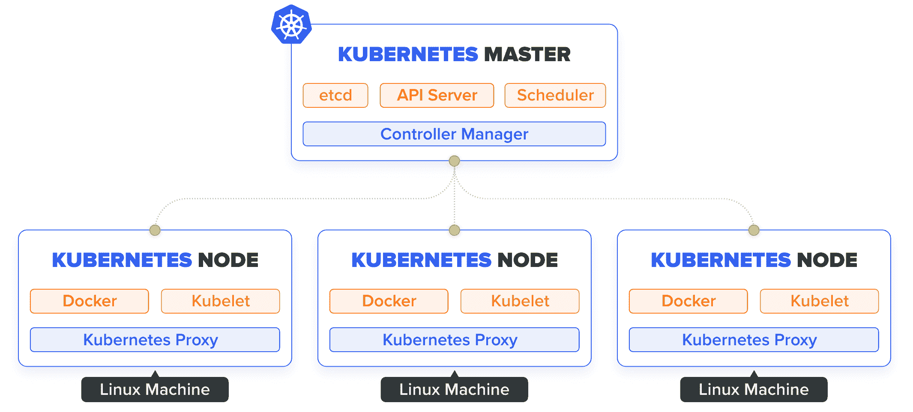
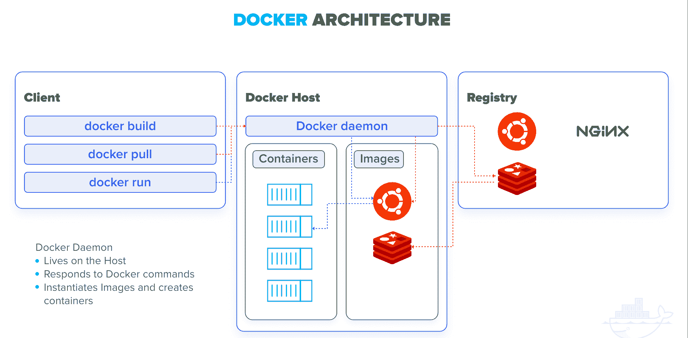
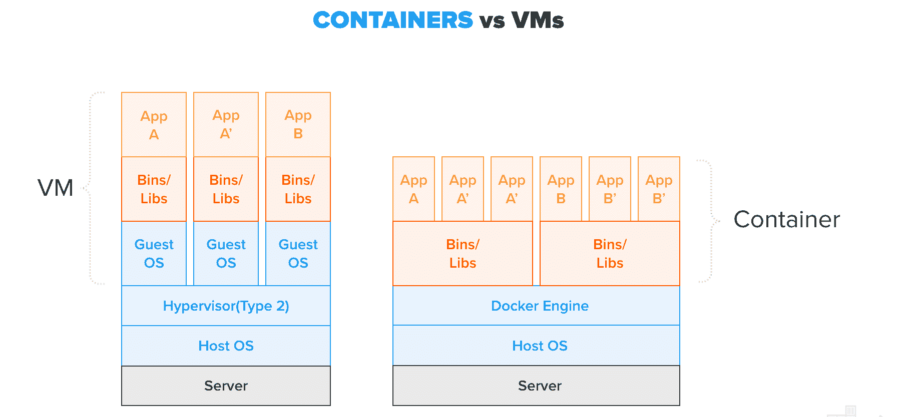
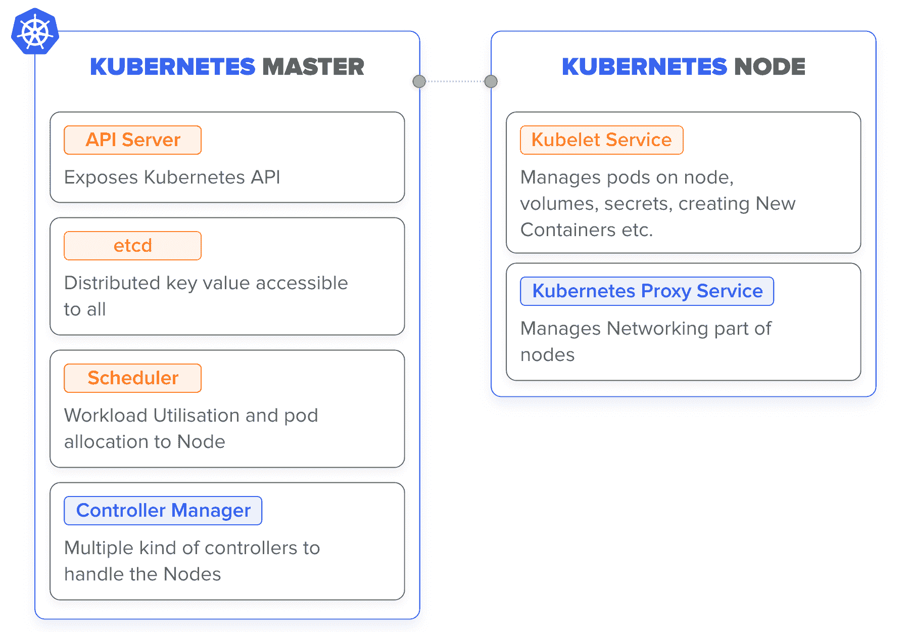

# Kubernetes vs Docker:面对面比较[更新]

> 原文：<https://hackr.io/blog/kubernetes-vs-docker>

Docker 和 Kubernetes 都是云计算行业中使用的两个领先工具。Docker 是一个使用容器化概念的计算机应用程序，而 Kubernetes 是一个容器编排系统。

通常情况下，Docker 和 Kubernetes 是同时使用的。然而，Kubernetes vs Docker 是云计算社区中一个非常热门的话题。

在比较两种最重要的云计算技术(Docker vs Kubernetes)之前，我们先来简单介绍一下这两种技术。

## **什么是 Kubernetes？**

[Kubernetes](https://hackr.io/tutorials/learn-kubernetes?ref=blog-post) 于 2014 年 6 月首次发布，最初由谷歌开发。开源容器编排系统的进一步开发和维护由云计算原生计算基金会负责。

根据官方网站，Kubernetes 是“一个自动化部署、扩展和管理容器化应用程序的开源系统。”

使用容器化技术，Kubernetes 允许在几个计算节点上运行容器，这些节点可以是裸机服务器或虚拟机。根据任何时候的要求，Kubernetes 可以让容器旋转起来或拆卸下来。

在使用 Kubernetes 之前，需要仔细检查一些东西。其中之一是确保所有参与的计算节点彼此安全连接。

## **Docker 是什么？**

Docker 由 Docker，Inc .开发，于 2013 年 3 月首次发布。这是一个能够执行[操作系统级虚拟化](https://en.wikipedia.org/wiki/Container_(virtualization))的计算机程序，通常被称为容器化。

Docker 可以从两个不同的角度来看。从第一个角度来看，Docker 容器是真正的轻量级虚拟机，从第二个角度来看，Docker 是一个软件打包和交付平台。

后一个方面是 [Docker](https://hackr.io/tutorials/learn-docker?ref=blog-post) 容器化技术及其在云计算行业广泛采用的主要原因。

### **Kubernetes vs Docker 是相关查询吗？**

比较 Docker 和 Kubernetes 就像比较太阳和月亮。当然，两者都是天体，但两者之间的比较听起来不太对！这是因为虽然两者都发光，但一个是恒星，另一个是天然卫星。

虽然 Docker 可以在没有 Kubernetes 的情况下运行，而 Kubernetes 也可以在没有 Docker 的情况下充分发挥作用，但在合作中使用两者可以改善彼此的功能。因此，Kubernetes 与 Docker 之间的争论是很奇怪的，如果不是完全不理智的话。

Docker 可以安装在一些计算机上运行容器化的应用程序。容器化的方法意味着在操作系统上运行应用程序，使它们与系统的其他部分隔离开来。应用程序可能会觉得它有自己专用的操作系统。

多个应用程序可以在单个操作系统上运行，就好像每个应用程序都有自己的操作系统实例一样。每个应用程序都在一个容器中。Docker 允许在单个操作系统上创建、管理和运行容器。

现在，当你在几个主机上安装了 Docker，比如操作系统，你就可以从 Kubernetes 中获益。在这种情况下，我们将这些主机称为节点或 Docker 主机，它们可以是裸机服务器或虚拟机。

将 Kubernetes 与 Docker 结合使用的好处在于，它有助于从一个单独的仪表板或命令行界面在所有 Docker 主机上自动化容器负载平衡、联网、供应、伸缩和安全性。

使应用程序更具可伸缩性和使基础设施更健壮是选择多节点的两个最佳理由。由单个 Kubernetes 实例管理的节点集合称为 Kubernetes 集群。

## 【Kubernetes 和 Docker 之间的差异

Docker Swarm 或简称 Swarm 是一个开源的容器编排平台。它是 Docker 的本地集群引擎，因此使用与 Docker 相同的命令行。以下是 Docker 和 Kubernetes 之间的各种重要差异:

### **应用部署**

通过使用 pod 和服务(或微服务)的组合在 Kubernetes 中部署应用程序。在 Docker Swarm 中，应用程序的部署仅仅作为微服务或群集中的服务进行。

Docker Swarm 带有 Docker Compose，可以帮助安装应用程序。为了识别多容器，Docker Swarm 拥有 YAML (YAML Ain 非标记语言)文件。

### **可用性**

Docker Swarm 提供高可用性，因为这些服务支持群节点中的复制。群管理器节点不仅负责管理整个集群，还负责管理属于工作节点的资源。

所有的豆荚都分布在 Kubernetes 的节点中。这不仅使 Kubernetes 能够容忍应用程序实例的故障，还提供了高度的可用性。

Kubernetes 中的负载平衡服务负责检测不健康的 pod 并将其删除。Kubernetes 提供了比 Docker Swarm 更高的可用性。

### **容器设置**

虽然 Docker Swarm API 不支持所有的 Docker 命令，但它提供了 Docker 几乎所有的最佳功能。

所以，Docker Swarm 支持 Docker 可用的大多数工具。然而，如果 Docker API 不能完成某些必需的操作，那么在 Docker Swarm 中也没有简单的解决方法。

像 Docker Swarm 一样，Kubernetes 有自己版本的 API、客户端定义和 YAML。然而，这些不同于他们的码头同行。

因此，不可能使用 Docker CLI 或 Docker Compose 来定义 Kubernetes 中的容器。在需要切换平台的场景中，需要重写 YAML 命令和定义。

### **负载均衡**

通常，入口用于 Kubernetes 中的负载平衡。然而，还有另一种方式，Kubernetes 中的 pod 通过服务公开。然后，它可以在所属的集群中用作负载平衡器。

Docker Swarm 有一个 DNS 元素，可以用来将传入的请求分发到一个特定的服务名称。对于负载平衡，服务可以自动分配，也可以在用户指定的端口上运行。

### **联网**

Kubernetes 遵循平面网络模型。因此，所有的豆荚都可以相互交流。网络策略规定了 pod 之间的交互方式。通常，平面网络模型被实现为覆盖。

Kubernetes 中的平面网络模型需要两个 CIDRs:

*   一个用于服务，和
*   另一个是从哪个 pod 获取 IP 地址

在 Docker Swarm 中，加入 Swarm 集群的节点负责:

*   为服务生成覆盖网络，覆盖集群中的每个主机，以及
*   集装箱专用码头桥网络

Docker Swarm 为用户提供了在创建覆盖网络时加密集装箱数据流量的选项。

### **可扩展性**

Kubernetes 是一个用于分布式系统的综合框架。因为 Kubernetes 提供了一组统一的 API 和关于集群状态的强大保证，所以它是一个复杂的系统。这些能力是导致容器部署和伸缩变慢的原因。

与 Kubernetes 相比，Docker Swarm 能够以更快的速度部署容器。因此，它允许更快的反应时间来根据需求扩展系统。

## **Docker 和 Kubernetes 之间的协同作用**

Kubernetes 能够与任何集装箱化技术协同工作。RKT 和 Docker 是开源容器编排引擎的两个最受欢迎的选项。然而，后者比前者更受青睐。

由于更倾向于将 Docker 与 Kubernetes 结合使用，所以在完善这两种技术之间的合作方面投入了大量的精力。

虽然 Docker 有自己的容器编排引擎 Docker Swarm，但是不能忽视使用 Kubernetes 和 Docker 的倾向。这从 Docker for Desktop 自带 Kubernetes 发行版这一事实中可以明显看出。

因此，显而易见的是，Docker 和 Kubernetes 这两种技术已经联合起来，并从这种合作中受益匪浅。

## Kubernetes 与 Docker 之间的直接比较

| **参数** | **Kubernetes** | **码头工人** |
| 设置 | 设置 Kubernetes 组件的主节点和工作节点只需要很少的手动步骤。 | 需要简单的 [Linux 命令](https://hackr.io/blog/basic-linux-commands)来设置。 |
| 应用程序部署 | Kubernetes 通过结合使用 pods 和服务来部署应用程序。 | Swarm 中，应用程序的部署作为微服务或服务在 swarm 集群中进行。 |
| 有效性 | Kubernetes 提供了比 Docker Swarm 更高的可用性。 | 提供高可用性 |
| 容器设置 | 它提供了一个强大的集群状态和一组统一的 API，减缓了扩展和容器的部署。 | 对于较大的集群，在 Docker 中部署容器会更快。 |
| 负载平衡 | 可以执行负载平衡，但需要使用容器盒手动配置服务。 | 它包括负载平衡，集群中的所有容器都加入公共网络，并允许节点和容器之间的连接。 |
| 建立工作关系网 | 它遵循一个平面网络模型，因此，所有的豆荚被允许相互作用。 | 在 Docker Swarm 中，加入 Swarm 集群的节点负责为服务生成覆盖网络，覆盖集群中的每个主机。 |
| 可量测性 | Kubernetes 是一个用于分布式系统的综合框架。 | Docker Swarm 能够以更快的速度部署容器。 |
| 升级 | Kubernetes 客户端和服务器包的手动升级需要手动执行。 | 升级 Docker 可以在 MAC 或 Windows 中通过单击一步一步地完成。 |

[Docker & Kubernetes:实用指南【2023 版】](https://click.linksynergy.com/link?id=jU79Zysihs4&offerid=1045023.3490000&type=2&murl=https%3A%2F%2Fwww.udemy.com%2Fcourse%2Fdocker-kubernetes-the-practical-guide%2F)

## **结论**

这总结了 Kubernetes 和 Docker 的比较。希望你所有的疑问现在都解决了。两者(Docker vs Kubernetes)都是目前云计算行业中使用最多的两种技术。因此，如果你还没有开始使用它们，现在是时候了。

通过下面的专用评论窗口分享您对 Docker 和 Kubernetes 技术的看法和意见。

**人也在读:**