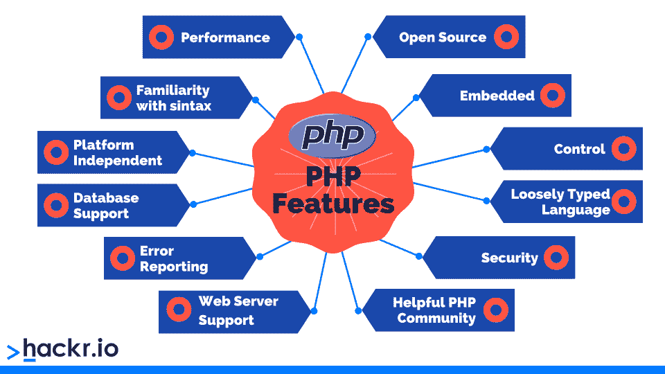

# 13 个最佳 PHP 项目及源代码[2023] |初学者到专业人士

> 原文：<https://hackr.io/blog/php-projects>

作为最新的 [Stack Overflow 开发者调查](https://survey.stackoverflow.co/2022/#most-popular-technologies-language)中 10 种最受欢迎的语言之一，PHP 负责为 2023 年互联网上超过 75%的[网站](https://w3techs.com/technologies/details/pl-php)的后端提供动力应该不足为奇。

令人印象深刻！而且，当你想到像 WordPress、脸书、维基百科等科技巨头都在使用 PHP 时，这是完全有道理的。

作为一种已经存在了近 30 年的开源脚本语言，PHP 拥有一个庞大而忠诚的开发人员社区。它也非常容易学习，是 web 开发初学者的理想第一语言。但不要让这愚弄了你；PHP 是一种强大的语言，可以用来为复杂的项目创建高级功能。

学习 PHP 或者增强 PHP 知识的最好方法之一是构建 PHP 项目。这些也是创建或改善你的作品集的很棒的方法，这真的可以帮助你在申请网站开发工作时脱颖而出。

本文找到了 2023 年 13 个最好的 PHP 项目，让你的 PHP 技能和作品集更上一层楼。对于初学者、中级开发人员和高级 PHP 开发人员的 PHP 项目，每个人都有适合的东西。

想学习 PHP 或提升你的技能吗？查看 [**最好的 PHP 书籍**](https://hackr.io/blog/best-php-books-for-beginners-and-advanced-programmers)

## **简单来说，什么是 PHP？**

简单地说， [PHP](https://hackr.io/blog/what-is-php) 是一种开源的通用脚本语言，用于开发 web 应用和网站。最初由拉斯马斯·勒德尔夫于 1994 年创建，用于监控他的个人主页(PHP)的流量，1995 年向公众发布，从此作为一种简单易学的开源语言赢得了长久的声誉。

PHP 最显著的特点是所有的 PHP 代码都在后端服务器上执行，然后将结果返回给客户端浏览器。这意味着客户端只能看到 PHP 代码执行后的结果，而不是实际的 PHP 源代码。但是这不是使用 PHP 的唯一好处。

*   快速、高效、安全
*   轻松嵌入 HTML 文件
*   在手机和台式机/笔记本电脑上运行
*   为用户数据加密实施哈希技术
*   可用于构建桌面应用程序
*   连接到数据库以访问、更新或修改数据

想要拓展你的网页开发技能吗？结账

**[排名前 10 的 PHP 替代品](https://hackr.io/blog/top-php-alternatives)**

## **面向初学者的 PHP 项目**

### **1。大学生聊天机器人**

[**PHP 项目源代码**](https://github.com/AaravRajSIngh/Chatbot)

对于初学者来说，这是最好的简单 PHP 项目想法之一，因为它让您构建一个聊天机器人 web 应用程序，用人工智能来响应普通大学生的消息和查询。

聊天机器人分析学生的疑问，并返回最合适的答案。如果学生认为聊天机器人的回答不充分，他们可以提供反馈，让您为该查询向聊天机器人提供更多信息。这允许您通过在管理区添加新答案来提高聊天机器人的准确性。

额外的好处是，你甚至可以使用 AWS、GCP 或任何其他云提供商在云上托管这个聊天机器人 web 应用程序。

### **2。客户关系管理系统**

[**PHP 项目源代码**](https://github.com/salesagility/SuiteCRM)

这个 PHP 初学者项目让您学习如何构建一个简单的 CRM 来管理客户数据以及与开源 SuiteCRM 的交互。

通过这个 PHP 项目，您将学习创建登录表单，添加客户详细信息，以及通过电子邮件或电话跟踪客户交互。您还将出于报告目的将数据导出为各种格式。

[**PHP 项目源代码**](https://github.com/ravi-kp/Automatic-TimeTable-Generation-For-An-Institute)

如果您正在寻找带有源代码的实用 PHP 项目，这是学习面向对象编程、数据库管理和其他基本编程概念的好方法。

您将构建一个带有时间表生成器的 web 应用程序来创建和管理学生课堂时间表。您还可以添加其他功能，如可变时区、学生根据需求选择课程的选项，或者实时更新出勤记录。

[**PHP 项目源代码**](https://www.youtube.com/watch?v=nBig_Pp8hbo)

如果你是一个博客订阅者，正在寻找带源代码的 PHP 迷你项目，这个面向初学者的很酷的 PHP 项目可以让你构建一个 RSS 阅读器来更新博客帖子或任何其他你想关注的内容。这也是学习 web 服务和 API 的好方法。

您可以将多个 RSS 提要组合成一个提要，然后创建一个简单的 web 应用程序，允许用户搜索和订阅不同的 RSS 提要。您甚至可以实现额外的功能，如书签、管理订阅源或电子邮件通知。

### **5。产品评级系统**

[**PHP 项目源代码**](https://github.com/NipunaMarcus/product-rating-system)

对于对人工智能感兴趣的初学者或改进者来说，这是最好的 PHP 项目想法之一，因为你将为客户评论建立一个评级系统。

它利用自然语言处理(NLP)算法，根据存储在数据库中的客户评论对产品进行评级。你甚至可以挖掘和匹配评论中的关键词来分析情感。很漂亮，对吧？

### **6。约会经理**

[**PHP 项目源代码**](https://github.com/thegr8dev/doctorpatientportal)

这是最好的 PHP 项目想法之一，在服务器端使用 PHP 和 MySQL，在客户端使用 Ajax 和 JavaScript 来创建 web 应用程序，作为医疗保健专业人员的预约管理系统。

这是提高后端数据库技能的好方法，因为您将使用 MySQL 数据库来存储关于医生、患者和患者预约的关键信息。

### **7。电影推荐系统**

[**PHP 项目源代码**](https://www.linkedin.com/pulse/how-i-built-movie-recommender-from-scratch-laravel-after-malune?trk=articles_directory)

如果您对数据科学感兴趣，这个构建电影推荐系统的 PHP 项目正是您所需要的。使用 [Kaggle movies 数据集](https://www.kaggle.com/datasets/rounakbanik/the-movies-dataset)，你可以访问关于 45，000 部电影的大量详细信息，如描述、上映日期、类型、语言等。

在这个项目中，您将使用 Laravel 构建一个模拟网飞的 PHP web 应用程序。这也包括后端的 MySQL 数据库。

您的 web 应用程序将在每次页面重新加载时包含一部随机选择的电影，以及一系列包含 10 部不同流派的随机电影的旋转木马。用户可以查看电影细节，然后通过协作过滤技术基于这些选择访问电影推荐。

对提高 PHP 技能的方法感兴趣吗？结账

**[最好的 PHP 框架](https://hackr.io/blog/best-php-frameworks)**

### **8。照片编辑**

[**PHP 项目源代码**](https://www.youtube.com/watch?v=__sZT7oeKb0)

这个照片编辑应用程序是那些优雅而强大的 PHP 项目理念之一，它融合了 JavaScript 和 PHP，为用户创建一个 web 应用程序来创建美丽的数字艺术品。这个 PHP 项目也迫使你使用面向对象的编程，这是磨练这些技能的一个很好的方法。

使用 XAMPP，你将为用户提供一系列工具来画他们想要的任何东西！这个项目的中心是“画笔工具”，允许用户选择各种颜色和画笔大小来制作创意绘画。

### **9。脸书 App**

[**PHP 项目源代码**](https://github.com/ristotoldsep/Facebook-clone)

这个 web 应用程序项目让您重新创建流行的社交媒体平台脸书。

预计将使用 PHP、HTML、CSS、JavaScript 和 AJAX 来构建我们都习惯于脸书的关键功能，如在时间轴上发布图像、状态更新和评论。

您还将构建一个登录和注册页面、群聊功能、搜索功能和密码恢复。因此，可以说这是一笔真正的交易，这是一种了解全栈设计的绝佳方式，这种设计将应用于脸书这样的大型项目。毫无疑问，这是你投资组合中的一个强有力的选择。

## **带源代码的高级 PHP 项目**

### 10。广告服务器

[**PHP 项目源代码**](https://github.com/gursimran81/AD-SERVER-PHP)

这个 PHP 项目让你建立一个广告服务器，一个强大的工具，数字营销人员使用它来达到他们想要的观众。

从最简单的意义上来说，广告服务器是向网站访问者发送广告的网络服务器。为了复制这一点，您将构建三个模块。第一个是管理员，负责控制用户进程和监视用户活动。第二种是让广告客户添加广告客户。

### **11。电子商务网站**

[**PHP 项目源代码**](https://github.com/mohsinenur/E-Commerce-Website-Using-PHP)

这个电子商务网站项目是 PHP 的一个经典用例。您将结合 PHP 和 MySQL 来构建一系列系统功能，如产品导航、用户配置文件和用于管理产品和订单的前端管理面板。

看似简单，这个强大的 PHP 项目是学习创建像在线购物网站这样无处不在的东西的全栈过程的好方法。

### **12。血库&献血者管理系统**

[**PHP 项目源代码**](https://github.com/varunsardana004/Blood-Bank-And-Donation-Management-System)

这个项目结合 PHP 和 SQL 来构建一个血库管理系统。您将构建一个具有管理和用户区域的 web 应用程序，以模拟需要管理献血者详细信息和关键献血信息的现实世界系统。

您将要构建的功能包括用户注册页面和信息搜索页面，作为全栈项目的另一个例子，您需要使用 PHP 和 SQL 技能来创建这个 web 应用程序。

### 13。股票管理平台

[**PHP 项目源代码**](https://www.youtube.com/watch?v=qZSf98TyRHE)

这个项目要求你将 PHP 与 MySQL、HTML、CSS、Ajax 和 JavaScript 结合起来，创建一个 web 应用程序来帮助企业管理他们的订单、库存、退货和销售记录。您还将使用用户友好的引导库和 AdminLTE 模板。

预计将建立两个区域，一个为管理人员，另一个为一般工作人员。您的管理区将允许管理员访问所有 web 应用程序页面、表单和功能，而员工用户将拥有有限的访问权限。

## **结论**

PHP 是一种非常流行且易于学习的脚本语言，用于创建 web 应用程序和网站，被现代科技世界的巨头们使用，包括 WordPress、脸书、维基百科等等。

无论你是一个选择 PHP 作为语言的有抱负的 web 开发人员，还是一个有经验的 PHP 开发人员，提高你的技能和增强你的投资组合的最好方法之一就是构建 PHP 项目。这也是一个模仿真正的 web 开发人员的任务的极好的学习过程。

也就是说，本文涵盖了你需要在 2023 年构建的 13 个最佳 PHP 项目。我们甚至为初学者提供了一系列 PHP 项目选项，为中级开发人员提供了 PHP 项目思路，以及高级 PHP 项目。因此，无论你的技能水平如何，总有一个 PHP 项目适合你去钻研！

**用 PHP 申请开发者工作？检查一下**

**[顶级 PHP 面试问题](https://hackr.io/blog/php-interview-questions)**

## **常见问题解答**

#### **1。PHP 适合大型项目吗？**

PHP 是小型 PHP 项目或非常大和最复杂的 web 应用程序的理想选择，PHP 可以扩展以适应任何应用程序的需求，如 WordPress、脸书和维基百科等大型科技公司对它的采用。

还有一系列 PHP 框架可以帮助扩展你的 PHP web 应用，比如 Laravel。

#### **2。哪里可以下载免费的 PHP 项目？**

网上有各种资源可以下载带有源代码的免费 PHP 项目，包括 GitHub、SourceForge 等等。

如果您正在寻找新的 PHP 项目，本文列出了 13 个免费使用的最佳 PHP 项目，因此根据您的技能水平，总有适合您的项目。

#### **3。有哪些好的 PHP 项目？**

好的 PHP 项目主题模拟真实世界的用例，因为这有助于向未来的雇主展示你的技能。例如，看看我们为初学者设计的聊天机器人项目，为中级开发人员设计的照片编辑器，以及为高级 PHP 开发人员设计的广告服务器。

#### **4。我如何开始一个 PHP 项目？**

看看我们添加到本文中的项目列表。这些都是基于难度水平，有初学者到高级 PHP 程序员的选择。

如果你不确定自己在这个范围内的位置，试着在每个类别的一系列项目中找到最适合你知识水平的。此外，准备好一个 IDE 来处理您的项目文件！

#### **5。我可以在 PHP 实习的时候做这些项目吗？**

绝对的。我们所有的选项都是很好的 PHP 项目，学生可以在实习期间展示他们的 PHP 技能。此外，用这些来给你的实习雇主留下深刻印象是一个获得永久职位的好方法。

#### **6。PHP 用于什么样的项目？**

PHP 最广为人知的是被 web 开发人员用来创建交互式网站和 web 应用程序。然而，将 PHP 嵌入 HTML 也很简单，这有助于使静态网站更具交互性和动态性。这也延伸到与数据库交互的全栈 web 应用。

**人也在读:**