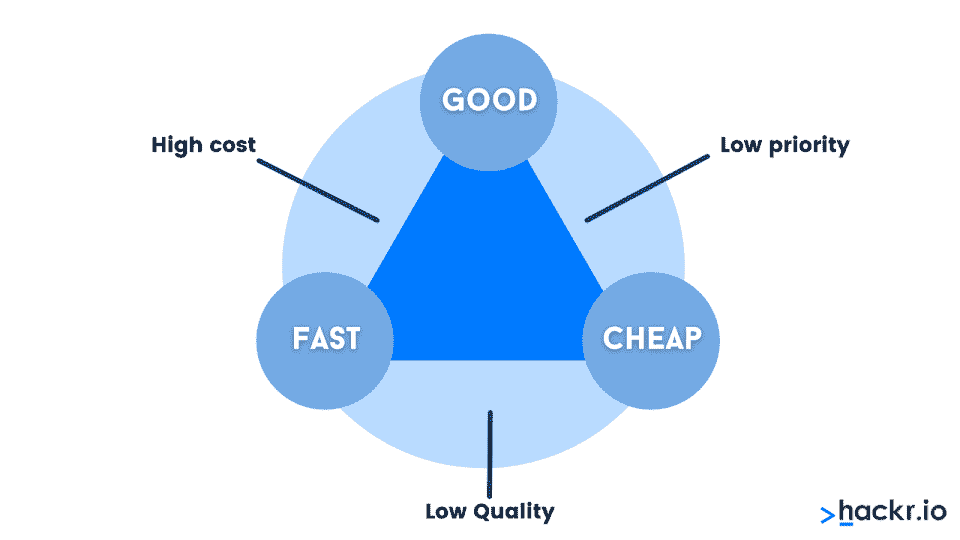
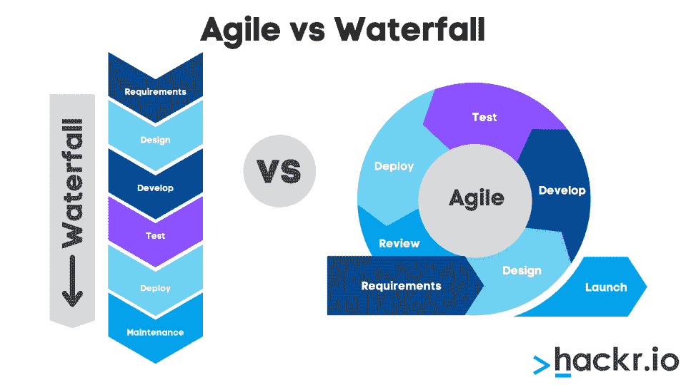

# 项目经理面试问题:你必须知道的一切

> 原文：<https://hackr.io/blog/project-manager-interview-questions>

项目管理是一个令人兴奋的职业领域，具有欢迎任何行业的灵活性。由于很多人来自不同的背景——编程、营销、商业——确定面试的内容可能会有点伤脑筋。

幸运的是，项目经理面试的问题是可以预测的。今天，我们将涵盖项目经理的基本、中级和高级面试问题，同时还提供重要的面试技巧。

## **项目管理面试问答**

项目经理身兼多职，与许多人争论，并且需要在(通常是广泛的)约束条件下跟踪大量的目标。作为一名项目经理，你必须组织良好，注重细节，并且自信。

项目管理面试问题和答案可以让你深入了解项目管理面试可能会如何进行，同时也测试你的领域知识。我们整理了一些你可能会遇到的最常见的项目管理面试问题。

## **基本项目管理面试问题**

对于初级职位，面试官可能会问这些基本的 PM 面试问题。如果你正在进入你的第一个项目管理角色，先温习一下这些问题。

### **1。项目经理是做什么的？**

项目管理是通过资源管理实现目标的过程。项目本质上是临时性的，是为了满足独特的目标和目的，通常与收入或绩效相关。项目经理负责监督和推进项目。

### **2。一个项目的关键要素是什么？**

关键要素是三重约束:范围、时间和成本。你可能也听说过这是好，快，便宜。

### **3。什么是几种不同类型的项目？**

有许多不同类型的项目，但一些常见的项目包括:

*   IT 项目
*   建筑项目
*   营销活动
*   新产品开发

任何有固定端点的东西都可以被认为是一个项目。想想你做过的项目。问这个问题通常是为了确定您是否理解项目、项目群或过程之间的区别。

### **4。程序和项目的区别是什么？**

程序不同于项目，因为它们通常没有截止日期。一个计划可以由为了实现一个共同目标而共同管理的项目组成。例如，一家公司可能将所有的营销活动作为一个程序来管理。

### **5。过程和项目的区别是什么？**

项目有明确的开始和结束，而业务流程是一个持续的活动。业务流程通常由业务流程管理软件管理，而项目通常由人工管理。

### **6。使用项目管理方法的好处是什么？**

项目管理方法论指的是类似瀑布、敏捷或看板的东西。使用项目管理方法有许多好处，包括:

*   标准化
*   改善沟通
*   效率更高
*   成功的可能性增加

谈论项目管理方法如何帮助你变得更有组织性和自信——以及你所经历和喜欢的方法。

### **7。瀑布模型和敏捷模型的区别是什么？**

****

瀑布模型是传统的线性项目管理方法，而敏捷模型是一种更加灵活的方法，强调迭代和持续改进。今天，瀑布模型已经被普遍摒弃，几乎所有的公司都在使用敏捷。但是像制造业这样的一些行业仍然使用瀑布。

**阅读更多:** [**敏捷 vs 瀑布**](https://hackr.io/blog/agile-vs-waterfall)

### **8。项目的不同阶段是什么？**

项目的不同阶段是:

*   开始
*   规划
*   执行
*   监视
*   关闭

别忘了关门！结束可能不是项目的主动部分，但它强调了组织在未来改变其过程的任何需要。

### **9。什么是项目章程？**

项目章程是定义项目的目的、目标和范围的文档。项目经理在启动阶段创建章程。

### 10。什么是利益相关者分析？

利益相关者分析是识别和评估项目利益相关者的过程。这有助于您了解他们的需求和期望，并制定一个在整个项目中管理他们的计划。

### **11。什么是工作分解结构或 WBS？**

工作分解结构是一种用于将项目分解成更小、更易管理的任务的工具。以这种方式分解工作可以创建可实现的里程碑，而不会变得不知所措。

### **12。什么是甘特图？**

甘特图是一个条形图，显示了项目中每项任务的开始和结束日期。这是一个流行的项目管理工具，因为它提供了项目时间表的清晰概览。

### 13。什么是关键路径？

关键路径是项目中最长的路径，代表完成项目所需的最短时间。关键路径的延迟会延迟整个项目。

### **14。成为项目经理需要具备哪些技能？**

项目经理需要大量的软技能和技术技能。其中最重要的包括:

*   领导力
*   组织的
*   沟通
*   解决问题
*   时间管理

项目经理需要的许多技能是“软技能”或与人相关的技能。但是项目经理也经常需要技术技能——至少足以知道什么是可能的。

### 15。什么是范围蔓延？

范围蔓延指的是项目范围随时间扩展的趋势。这总是危险的，因为它会导致项目超出预算和时间。项目经理必须控制范围蔓延。

### 16。范围蔓延的原因是什么？

范围蔓延有许多原因，但常见的原因包括:

*   缺乏明确的目标
*   沟通不畅
*   角色和责任不明确
*   缺乏利益相关者的认同
*   规划不足

如果涉众没有充分理解或尊重最终产品，这将导致范围蔓延。

### **17。如何防止范围蔓延？**

通常，这取决于项目本身。一些方法包括:

*   从一开始就明确目标
*   让利益相关者了解情况并参与进来
*   明确定义角色和职责
*   创建详细的项目计划
*   监控进度并根据需要进行更改

一个项目经理必须总是在范围蔓延的顶端，但是不要太多以至于在必要的时候他们不能灵活。谈谈您过去不得不管理范围蔓延的时候。

恭喜你！你现在已经做项目经理几年了，应该能回答这些中级项目经理的问题。当你回答这些问题时，试着结合你之前经历的直接轶事。

### 18。你如何管理利益相关者的期望？

利益相关者管理需要考虑与管理范围蔓延相似的因素:

*   从一开始就明确目标
*   让利益相关者了解情况并参与进来
*   明确定义角色和职责
*   创建详细的项目计划

涉众参与得越多，他们就越有可能有(合理的)期望。在了解什么是可能的或不可能的之前，他们需要了解项目。

### **19。你如何创建一个项目进度表？**

时间表的创建取决于您的软件。但是您通常可以通过完成以下步骤来创建计划:

*   确定需要完成的任务
*   任务排序
*   估计每项任务所需的时间
*   为每项任务分配资源

项目时间表是管理项目的重要工具，应该在计划阶段尽早制定。

### 20。你如何创建一个项目预算？

项目经理必须为你参与的每个项目设定预算。通常，这是基于实用性和组织需要多少项目完成。

项目预算包括:

*   确定每项任务的成本
*   估计每项任务所需的时间
*   为每项任务分配资源

但你也必须考虑外部因素，比如实际可用的资金。

### **21。你如何监督和控制一个项目？**

监控项目是项目经理保持对项目控制的常用方法。您可以通过以下方式监控项目:

*   创建项目时间表和预算
*   对照时间表和预算监控进度
*   根据需要进行更改

当然，一个项目并不总是按计划进行。项目经理还必须能够调整。上一次你的项目出了问题时发生了什么？

### **22。影响项目的不同类型的风险有哪些？**

大多数风险属于以下几类:

*   范围蔓延
*   预算超支
*   进度延迟
*   质量问题

想想项目遇到这些风险的时候。你是如何准备的？

### **23。你如何处理项目中的冲突？**

冲突对许多人来说是不舒服的。对于项目经理来说，冲突可能是工作中最困难的部分。通过以下方式有效处理项目中的冲突:

*   确定冲突的根源
*   与所有相关方沟通
*   努力达成各方都能接受的解决方案

项目经理不是奇迹创造者。有时，在项目进展之前，风险承担者可能需要解决冲突。

### **24。什么是变更管理，为什么它在项目中很重要？**

变更管理是管理项目变更的过程。这一点很重要，因为它有助于确保以可控和安全的方式进行变更。良好的变更管理减轻了风险并减少了范围蔓延。

### **25。什么是挣值管理，它是如何在项目中使用的？**

挣值管理是一种用于测量项目进度的技术。它基于这样一个原则，即一个项目的价值是已经完成的所有任务的价值的总和。可以理解的是，创收活动更有利于这一进程。不是所有的项目都可以进行挣值管理。

## **高级项目管理面试问题**

在你职业生涯的这个阶段，你是一个有经验的项目经理。你没见过全部，但你见过很多。你的面试会倾向于问一些关于你个人经历、挑战和成功的问题。

### **26。作为项目经理，你面临过哪些挑战？**

想想你曾经不得不完成的最困难的项目。是什么让它变得如此困难？你做了什么来解决这个困难？你觉得你处理得对吗？对学到的任何东西都要诚实；你今天会用不同的方式处理这个项目吗？

### **27。作为项目经理，什么项目让你最自豪？**

花些时间突出你的一项成就。想想你完成的最后一个项目，一个你认为你做得很好的项目。这可能是一个有很多挑战或者出了很多问题的项目；你是在评判你作为项目经理的价值，而不是项目本身。

### **28。您对哪些项目管理套件有经验？**

调查公司使用的项目管理系统。是 MS Project 吗？[Monday.com](https://try.monday.com/hackr)？特雷罗？《任务世界》？Asana？市面上有几十种，可能会让人应接不暇。回顾他们的项目管理解决方案(如果有免费试用的话)，但是不要害怕承认你在某个特定领域没有经验。相反，你可以这样说，“我从来没用过 Basecamp，但我用过 Trello。”

### **29。作为项目经理，你学到的最重要的一课是什么？**

大多数项目经理都有这样一个项目，它从开始到结束立刻就出了差错或者很棒。想想你最重要的项目以及它们教会了你什么。不要害怕谈论错误，只要你能展示你是如何从中吸取教训的。

## **项目经理情景面试问答**

有时，你会在面试过程中被引导通过一些特定的场景。项目管理认证或课程路径是准备这些的好方法。下面是几个示例场景。

### **场景 1:创建时间表**

你是一个组织的项目经理，计划推出一个新产品。产品上市日期定在六个月后。您被要求为产品发布创建一个项目时间表。

你会怎么做？

答:创建一个**项目章程**，概述项目的目标、时间表、风险和可交付成果。一旦章程被批准，创建工作流程的**分解结构**和**项目进度表**。使用风险图表创建一个广泛的**风险管理计划**来减轻可能影响项目的风险。写一份**沟通计划**以确保利益相关方了解最新情况。

### **场景 2:处理变更管理**

你是一个项目的项目经理，这个项目正处于里程碑的中途。一个关键的利益相关者要求您添加会延迟推出的主要变更。然而，其他利益相关者也认为这些变化对项目是必不可少的。

你会怎么做？

答:项目经理必须能够将变更整合到计划中。如果所有涉众都渴望改变，这就不是范围蔓延。然而，这将意味着该项目将需要更长的时间或更昂贵。确定这些变更的必要性，并获得变更项目的批准。

### **场景 3:管理与利益相关方的冲突**

在风险评估和项目规划的早期阶段，您是一名项目经理。两个关键的利益相关者在产品需要的特性上存在根本的分歧。

你会怎么做？

回答:项目经理对涉众负责并指导他们，但不能最终为他们做决定。为每个利益相关者的观点创建模拟，并要求他们达成共识。给出他们必须做出这些决定的明确期限。

## **下一次项目经理面试的技巧**

研究上面的项目管理问题是一个很好的开始。以下是一些为下次面试做准备的技巧:

*   获得项目管理认证。
*   使用项目管理软件获得实践经验。
*   加入一个专业组织，比如项目管理协会(PMI)。
*   了解最新的行业新闻和趋势。
*   阅读关于项目管理主题的书籍和文章。

项目管理是一个令人兴奋的领域，总是在变化。通常，项目管理人员已经在他们的行业工作了一段时间。所以，既然每个行业不一样，你的准备可能也不一样。

## **结论:赢得下一次项目管理面试**

通过准备关于你的经验、技能和解决问题能力的问题，你将会给面试官留下深刻印象，并得到你一直想要的项目经理职位。但是不要忘记熟能生巧。回顾一下这些项目经理面试问题，试着安排与家人和朋友的模拟面试，以建立你的信心并帮助你放松。

在你下次面试之前:

*   查找一些优秀的项目管理认证。
*   调查顶级项目管理解决方案。
*   参加项目管理课程来更新你的技能。

## **项目经理常见问题解答**

### 如何准备项目经理面试？

除了学习常见的面试问题，项目经理应该考虑获得认证。项目管理认证将带你经历面试中讨论的许多场景。

### 项目经理面试可以问什么问题？

面试官可能会问你关于项目管理软件和方法的经验。准备好讨论你从头到尾管理项目的经验。

### 项目经理成功需要的三样东西是什么？

一个项目经理需要有条理，有很强的解决问题的能力，并能有效地与利益相关者沟通。项目经理也应该对项目管理原则和软件有很深的理解。

### 项目经理的 5 项主要任务是什么？

项目经理的主要任务是启动、计划、执行、监控和结束项目。这些活动也被称为项目管理生命周期的各个阶段。