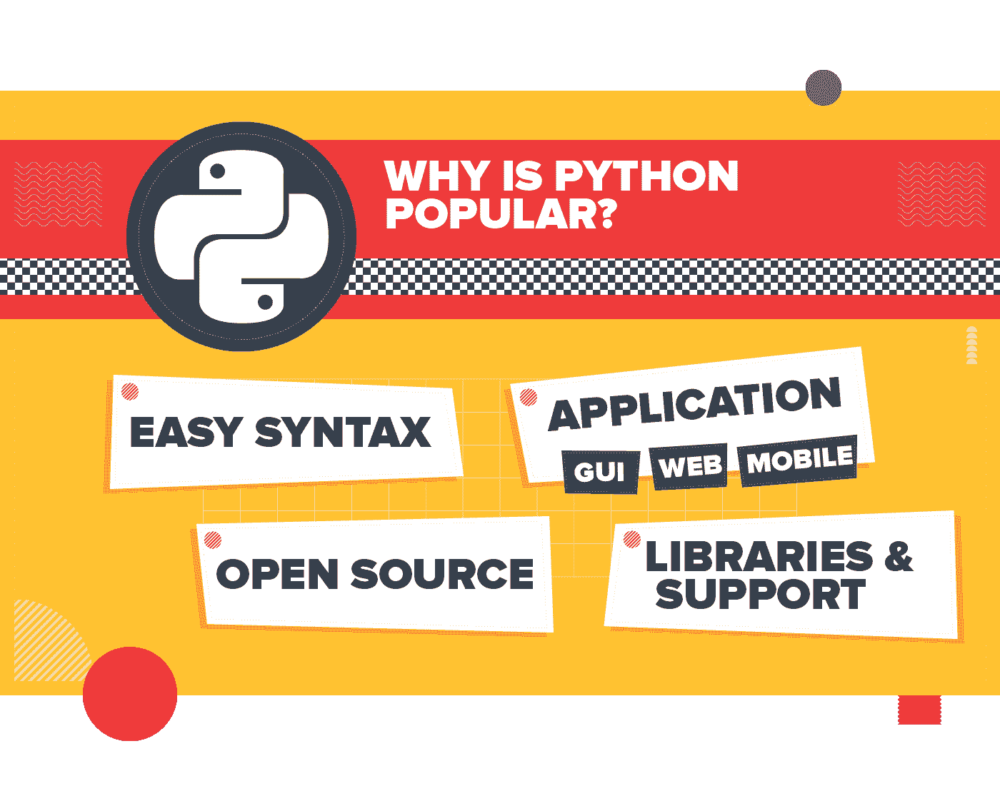

# 数据科学如何学习 Python

> 原文：<https://hackr.io/blog/python-for-data-science>

## 为什么学 Python 是为了数据科学？

Python 被认为是最适合的，也是数据科学职业所需的一项有价值的技能。

Python 已经被列为数据科学的首选编程语言，因为:

*   它是世界上最流行的语言，拥有热情的用户群体。
*   它是自由和灵活的。
*   它提供了简单的语法，减少了开发时间。
*   它为科学计算提供了机器学习库。

在 DS 领域，Python 生态系统的开发预计会增加，因此就业机会也很丰富。因此，对于那些学习 Python 进行数据科学研究的人来说，未来是非常光明的。尽管学习 Python 数据科学的步骤很简单，但仍然需要付出艰苦的努力。如果专心学习 Python，它有可能把一个人的职业生涯带到一个新的高度。

## 计算机编程语言

它由 Guido Van Rossum 于 1989 年开发，是一种高级、易学、动态初始化的通用语言。随着[机器学习和人工智能](https://hackr.io/blog/ai-vs-machine-learning)的兴起，Python 已经成为人们关注的焦点，因为它使工作更有效率，也更容易。就可以使用的开发人员、库和应用程序而言，它是发展最快的语言。

### Python 为什么受欢迎？

### Python 的特性

*   简单:它很简单，让你更多地考虑问题而不是语法。
*   开源:任何人都可以免费使用，对 Python 的修改也是允许的，没有任何问题。
*   **可移植性:** Python 支持可移植性，即编写代码并与任何人分享。
*   **可嵌入和可扩展:** Python 支持向自身添加其他语言的代码来运行这些功能，使 Python 更加强大。
*   **解释:** Python 是逐行解释的，意思是对内存的管理。
*   **庞大的库:** Python 拥有庞大的库支持，有助于轻松获得问题的解决方案。
*   **面向对象:** Python 支持 [OOPs 概念](https://hackr.io/blog/oops-concepts-in-java-with-examples)。也就是说，任何现实世界的问题都可以被模型化为代码，并且具有安全性，例如访问受到限制。

## 学习数据科学的步骤

### **第一步:**Python 的基础知识

熟悉数据科学包括学习 [Python 编程](https://hackr.io/blog/python-programming-language)基础知识。首先，让我们看看 Python 的一些基础知识。

数据科学的 Python 基础

1.  变量:变量是指内存中存储数据值的位置。但是 Python 不需要变量声明或者类型声明。
2.  数据类型:Python 支持各种数据类型，它定义了各种可能的变量和存储操作。
    1.  数字
    2.  目录
    3.  用线串
    4.  元组
    5.  设置
    6.  词典
3.  运算符:操作数的值可以在操作数的帮助下进行操作。一些运算符包括算术、比较、赋值、逻辑、按位、成员和标识。
4.  条件语句:如果给定的条件为真，条件语句在块内执行一组语句。If、Elif 和 Else 是 Python 中的条件语句。
5.  循环:需要递归执行的代码语句可以放在循环块中。
6.  函数:代码可以分成有用的称为函数的块，允许它们组织代码并重用它，从而节省时间。

除了学习 Python 的基础知识，你也可以从加入在线教程和社区开始。这样，你会被志同道合的人所包围，并帮助你学到更多。

也可以从看一些书和博客帖子开始。

你可以在这里开始搜索最好的 Python 书籍。

### **步骤 2:** 练习迷你 Python 项目

在学习 Python 时，实际的实现是一个优势，所以尝试一些 Python 项目，边做边学。尝试编程和构建项目，如在线游戏的计算器，或获取城市天气预报的程序。像这样的项目将提高你的技能，巩固你的基础。

在您精通基本项目之后，接下来，您必须积累使用 API 的经验，并开始 web 抓取，这也将有助于以后收集数据。

通过完成您遇到的编程挑战的解决方案来获取知识。

### **第三步:**学习 Python 数据科学库

Python 对于数据科学非常重要，因为它为科学计算或分析、可视化等提供了大量的库。下面列出了一些最好和最重要的 Python 库:

1.  NumPy: NumPy，代表“数值 Python”，是用于数据科学的 Python 核心库。它用于科学计算，并作为通用数据的多维容器来执行各种数字操作和功能。
2.  Pandas:它是 Python 的一个重要库，用于数据科学的操作和分析。它与表格数据、矩阵数据、有序和无序时间序列非常兼容。
3.  Matplotlib:这是 Python 中一个强大的可视化库。它可以用在 Python 脚本、web 应用服务器和其他 GUI 工具包中。Matplotlib 中可以使用不同类型的绘图和多个绘图工作。
4.  Seaborn:它是 Python 中的一个统计绘图库。它提供了漂亮的默认样式和绘制统计图形的高级界面。
5.  Scikit-Learn:它是主要的吸引力之一，因为它是一个免费的库，我们可以在那里使用 Python 实现机器学习，因为它包含了用于数据分析和挖掘目的的简单有效的工具。可以使用 scikit-learn 实现逻辑回归、时间序列算法等算法。

### **第 4 步:**在学习的过程中构建数据科学投资组合

如果你是一名有抱负的数据科学家，那么你必须建立自己的投资组合。你提到的项目应该由几个数据集组成，你应该分享你收集到的有趣的见解。你项目的主题必须是你感兴趣的，你喜欢做的。

在展示项目组合时，其他数据科学家可以合作向未来的雇主展示你拥有所需的编程技能。

### **第五步:**应用先进的数据科学技术

在学习 Python 数据科学的过程中，您的旅程将充满不断的学习。我们建议获得坚实的理解。它给你一种提供有价值见解的心态，而不仅仅是执行代码。你也可以选择高级课程，以确保你是最新的。您可以使用实时数据馈送对项目进行编程。您可以开始熟悉像回归、分类和 k-Means 聚类模型这样的技术。

像 Quora、Stack Overflow 这样的资源和论坛充满了渴望学习更多知识的人，他们也分享他们的知识来帮助你学习编程。

[机器学习 A-Z:Python&R in Data Science【2023】](https://click.linksynergy.com/link?id=jU79Zysihs4&offerid=1045023.950390&type=2&murl=https%3A%2F%2Fwww.udemy.com%2Fcourse%2Fmachinelearning%2F)

## 结论

数据科学跨越众多行业，是一个不断发展的领域。在这一点上，需求呈指数增长，有大量的学习机会。随着时间的推移，最好通过阅读、协作和与他人交谈来继续学习，以便与其他数据科学家竞争。

在 Python 用于数据科学的路线图中，您还有其他步骤要分享吗？下面分享！

继续学习！！

**人也在读:**