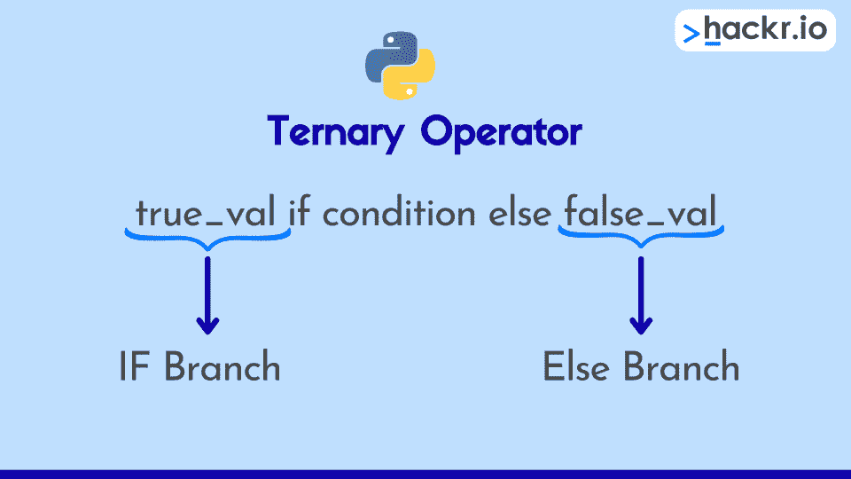
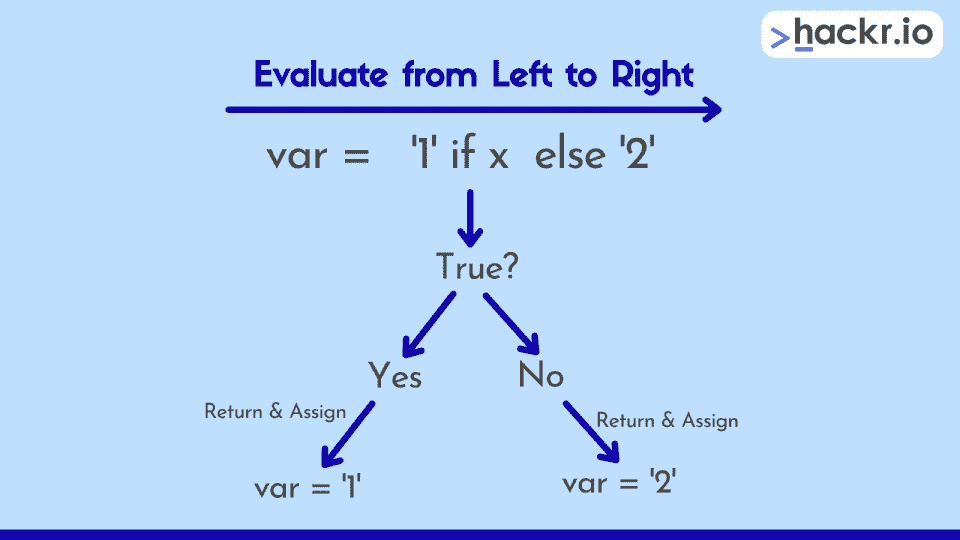
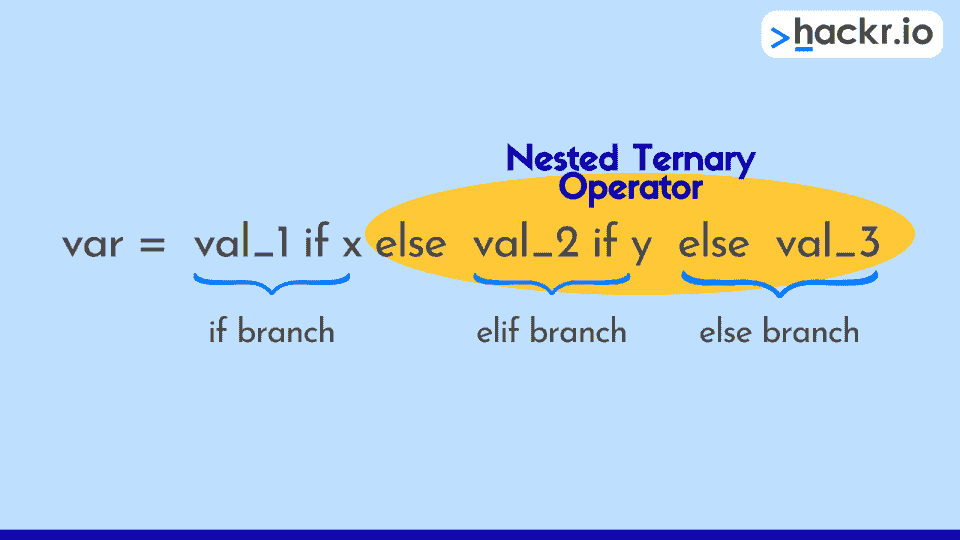

# Python 三元运算符:如何以及为什么应该使用它

> 原文：<https://hackr.io/blog/python-ternary-operator>

对于任何 Python 开发人员来说，编写简洁、实用、有组织、易懂的代码都应该是重中之重。输入，Python 三元运算符。

*这是什么？*我听到你问了。你可以使用三元运算符来测试一个条件，然后只用一行代码就执行一个条件赋值。*这有什么了不起的？*嗯，这意味着我们可以用一种更快、更实用的方式来编码条件赋值，从而取代那些曾经流行的 if-else 语句。

现在不要误解我，我们仍然需要 if-else 语句(查看我们的[综合指南](https://hackr.io/blog/python-conditional-statements-switch-if-else)和 [Python 备忘单](https://hackr.io/blog/python-cheat-sheet)了解使用条件语句的最佳方式)。但是，当有更简单的方法来获得相同的结果时，让您的代码更 Pythonic 化总是好的做法，这正是您使用三元运算符所获得的结果。

## **为什么要使用 Python 三元运算符？**

Python 中的三元运算符(也称为条件运算符)在检查给定条件是真还是假之后执行求值和赋值。这意味着三元运算符有点像简化的单行 if-else 语句。很酷，对吧？

当正确使用时，这个操作符减少了*代码的大小*并提高了*的可读性*。

### **三元运算符语法**

三元运算符有三个操作数:

*   **条件:**一个布尔表达式，其计算结果为真或假
*   **true_value:** 当条件的计算结果为 true 时要赋值的值或表达式
*   **false_value:** 条件评估为 false 时要分配的值或表达式

当我们把所有这些放在一起时，它应该是这样的:

```
var = true_value if [condition] else false_value
```

****

因此，这意味着赋值运算符(=)左侧的变量“var”将被赋值为:

*   **真值** *如果布尔表达式评估为真*
*   **false_value** *如果布尔表达式评估为 false*

## **如何用三元运算符代替 If-Else**

为了更好地理解我们如何用 Python 中的三元运算符替换 if-else 语句，让我们为每种方法编写一个简单的程序。在第一个例子中，我们假设用户在提示时输入一个整数，我们将从熟悉的 if-else 开始。

### **使用 If-Else 语句编程**

```
given_age = input("Enter your age to check if you are old enough to watch this movie or not:")
movie_access = "Yes, you are old enough to watch this movie!" if int(given_age) >= 18 else "Sorry, you aren't old enough to watch this movie yet!"
print(f"The Result - {movie_access}")
```

当用户在输入提示符下输入 22 时，我们会得到如下结果:

```
Enter your age to check if you are old enough to watch this movie or not: 22

The Result - Yes, you are old enough to watch this movie!
```

在这个例子中，if-else 语句指定“是的，你已经到了可以看这部电影的年龄了！”如果用户输入一个大于或等于 18 岁的年龄，则赋给 movie_acess 变量，否则，它赋给“对不起，你还不够大，不能看这部电影！”。最后，我们使用 f 字符串将结果打印到屏幕上。

现在，让我们使用三元运算符语法使程序更加简洁。

### **使用三元运算符的程序**

```
given_age = input('Enter your age to check if you are old enough to watch this movie or not:')
movie_access = ('Yes, you are old enough to watch this movie!' if int(given_age) >= 18 else 'Sorry, you are\'nt old enough to watch this movie yet')
print(f'The Result - {movie_access}') 
```

在这个版本的程序中，接收条件语句(movie_access)结果的变量在赋值操作符(=)的左边。

三元运算符计算条件:

```
if int(given_age) >= 18
```

如果条件评估为真，程序指定“是的，你已经足够大了，可以看这部电影了！”到 movie_access，否则它会指定“对不起，你还不够大，不能看这部电影！”。

让我们看看另一个使用 Python 三元运算符和 if-else 来实现相同目标的例子。这一次，我们将编写一个简单的 Python 代码片段来检查给定的整数是偶数还是奇数。

```
# Using Ternary Operator
given_int = 8
msg = "Even" if (given_int % 2) == 0 else "Odd"
print(msg)
# Using If-Else statement
msg = " "
if(given_int % 2) == 0:
  msg = "Even"
else:
  msg = "Odd"
print(msg)
```

在这个程序中，我们使用了一个三元运算符和一个 if-else 语句块来确定给定的整数在使用模除以 2 时是否产生零余数(如果您不熟悉这个运算符，可以看看我们的备忘单)。如果余数是零，我们有一个偶数，否则，我们有一个奇数。

马上，我们就可以知道 if-else 语句在评估条件后会做什么。使用三元运算符片段，我们可以看到以下内容:

*   如果条件(given_int % 2 == 0)为真，则将“Even”赋给消息
*   如果条件(given_int % 2 == 0)为假，则将“奇数”赋给消息

而且，由于我们已经将给定的整数设置为偶数，程序将在屏幕上打印“even”。

因此，我们可以再次看到，三元条件语句是一种更干净、更简洁的方式来实现与 if-else 语句相同的结果。我们简单地从左到右计算三元表达式，然后指定 true 或 false 条件的返回值。



## **Python 三元语句的主要考虑事项**

三元运算符并不总是适合替换代码中的 if-else。

例如，如果我们有两个以上带有 if-elif-else 语句的条件分支，我们不能用一个*单个*三元运算符来替换它。这里的线索在名字中，因为三元指的是数字“三”，这意味着它需要三个操作数。但是，如果我们尝试用三元运算符替换 if-elif-else 语句，我们将有四个操作数要处理(如果我们有许多“elif”分支，可能会有更多)。

那么我们在这里做什么？嗯，我们需要将多个三元运算符链接在一起(或嵌套在一起)(我们在常见问题解答中涉及到这一点)，但有时这可能会有点混乱，如果代码变得难以阅读，使用 if-elif-else 可能会更干净。



另一件要记住的事情是，我们打算使用三元运算符进行条件赋值。*这是什么意思？如果我们想在计算一个条件表达式后执行代码块，我们不能使用三元方法:在这些情况下，最好坚持使用 if-else。*

但是，我们可以使用三元运算符，如果我们在检查一个条件后将某个变量赋值给某个变量。看，如果我们记得我们应该是*分配*一些东西给另一些东西，这很容易。

### **Python 三元语句的显著特征**

*   根据条件表达式的布尔结果返回 A 或 B(A < B)
*   与 C 类型语言(C/C++)相比，它使用不同的参数排序
*   在所有 Python 操作中，条件表达式的优先级最低

## **结论**

仅此而已。我们尽了最大努力向您提供关于 Python 三元运算符的所有信息。我们还讨论了如何在 Python 代码中使用三元语句，并将它们与它们的近亲——曾经流行的 if-else 语句——进行了比较。

如果你是一个初学者，正在寻找 Python 编程生涯的一个简单开端，请查看我们的[学习指南](https://hackr.io/blog/best-way-to-learn-python)以及我们的[最新 Python 课程列表](https://hackr.io/blog/best-python-courses)，在那里你可以轻松地在线注册。

最后，别忘了你还可以查看我们的[综合 Python 秘籍](https://hackr.io/blog/python-cheat-sheet)表，它涵盖了各种主题，包括 Python 基础知识、流控制、Python 中的模块、函数、异常处理、列表、字典和数据结构、集合、itertools 模块、综合、lambda 函数、字符串格式化、三元条件运算符等等。

## **常见问题解答**

#### **1。什么是三元运算符(包括一个例子)？**

程序员喜欢使用简洁的三元运算符进行条件赋值，而不是冗长的 if-else 语句。

三元运算符有三个参数:

*   首先，比较论证
*   第二，如果比较结果为真，要分配的值(或表达式的结果)
*   第三，如果比较结果为假，要分配的值(或表达式的结果)

#### **简单三元运算符示例:**

```
m = 10
n = 20
o = m if (m < n) else n
print(o)
```

如果我们运行这个简单的程序，“(m < n)”条件的计算结果为 true，这意味着“m”被赋给“o”，print 语句输出整数 10。

“m”和“n”的条件返回值不能是完整的语句，而是简单的值或表达式的结果。

#### **2。如何编写三条件三元运算符？**

假设您有三个条件要检查，并且您想要使用三元条件语句。你是做什么的？答案其实很简单，*将多个三元运算符*链接在一起。下面的语法显示了它的一般格式:

```
var = value_1 if [condition_1] else value_2 if [condition_2] else value_3
```

如果我们把这个语法分解，它就是说:

*   如果 condition_1 为真，则返回 value_1 并将它赋给 var
*   否则，检查 condition_2 是否为真。如果是，返回 value_2 并将它赋给 var
*   如果两个条件都不成立，则返回 value_3 并将它赋给 var

我们现在已经使用一系列三元运算符创建了一个单行版本的 if-elif-else 语句。

等效的 if-elif-else 语句将是:

```
if condition_1:
  var = value_1
elif condition_2:
  var = value_2
else:
  var = value_3 
```

在将三元语句链接在一起之前，要考虑的一件事是它是否会使代码更难阅读。如果是这样，那么它可能不是很 Pythonic 化，您最好使用 if-elif-else 语句。

#### **3。如何编写三元运算符语句？**

如果遵循如下所示的一般形式，我们可以很容易地用 Python 编写三元表达式:

```
var_result = true_value if [condition] else false_value
```

我们首先选择一个评估条件。然后，我们或者返回 **true_value** 或者 **false_value** ，然后我们将这个赋值给 **results_var** 。

#### **4。三元运算符比 If-Else 快吗？**

如果我们考虑到三元运算符是单行语句，if-else 语句是一段代码，那么 if-else 需要更长时间才能完成是有道理的，也就是说是的，三元运算符更快。

但是，如果我们从 Big-O 符号的角度来考虑速度(如果我在这里把你搞糊涂了，不要担心，去看看我们的 [Big-O 备忘单](https://hackr.io/blog/big-o-notation-cheat-sheet))，那么它们实际上是一样快。*这怎么可能？*这是因为当我们的问题变得非常大时，条件语句被视为*常数时间操作*。

因此，答案既可以是也可以不是，这取决于你问的问题的类型。